# 🛡️ My Cybersecurity Journey - Writeups

## 🎓 Professional Certifications

### 🏆 Pre-Security Pathway - TryHackMe

  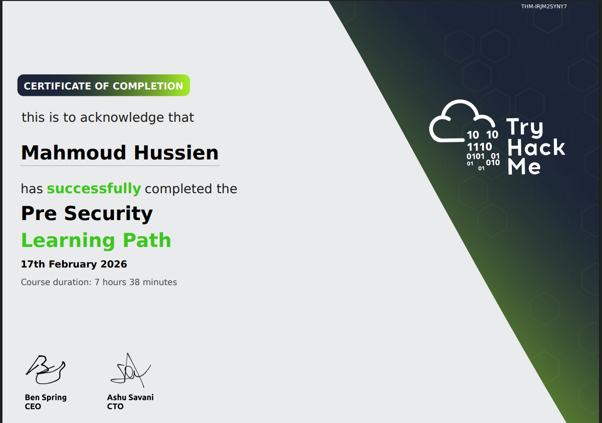

* **المهارات المكتسبة من المسار:**
    * **Cyber Security Introduction:** فهم أساسيات المجال والوظائف المتاحة.
    * **Network Fundamentals:** دراسة الـ OSI Model، والـ IP addresses، وكيفية عمل الـ Routing والـ Switching.
    * **How the Web Works:** فهم بروتوكولات الـ HTTP/HTTPS، والـ DNS، والـ Cookies.
    * **Linux Fundamentals:** إتقان التعامل مع الـ Terminal والـ Permissions ونظام الملفات في لينكس.
    * **Windows Fundamentals:** فهم نظام التشغيل ويندوز من منظور أمني والتعامل مع الـ Command Line.

---

# 🛡️ My Cybersecurity Path & Certifications

## 🎓 Completed Path: Cyber Security 101
**Platform:** TryHackMe | **Issue Date:** Feb 13, 2026 | **Credential ID:** THM-SW96MFJBOJ

  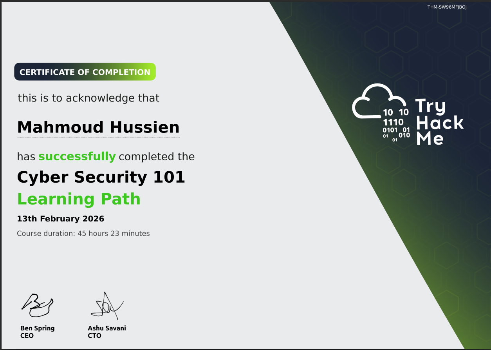

### 🛠️ Skills Covered & Labs Completed:
* **Networking:** OSI Model, TCP/IP, DNS, and HTTP.
* **Web Security:** Web Vulnerabilities & Web Exploit Basics.
* **Operating Systems:** Windows & Linux Foundations.
* **Security Tools:** Wireshark, Burp Suite, and Gobuster.

---

## 🏗️ Ongoing Work: SOC Level 1 Path
* **Progress:** 41%
* **Latest Labs:** Email Analysis (Phishing), MITRE ATT&CK Framework.

---

## 🦈 Network Analysis with Wireshark
**Description:** Completed the Wireshark series covering basics, packet operations, and traffic analysis.

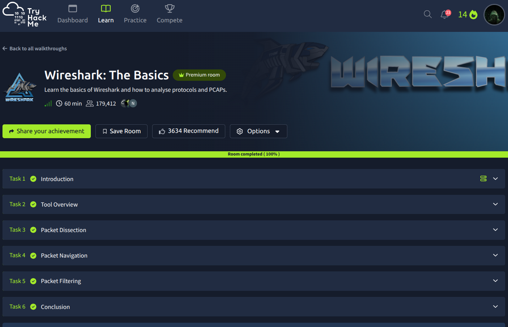
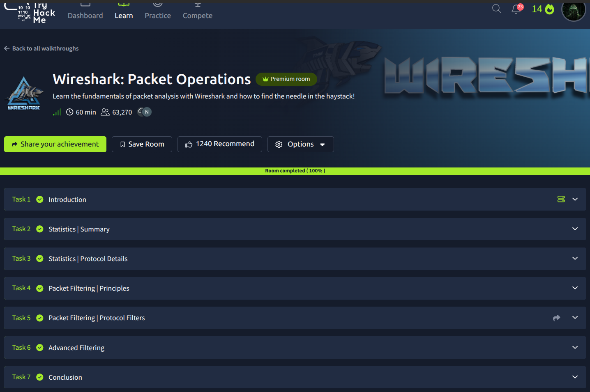
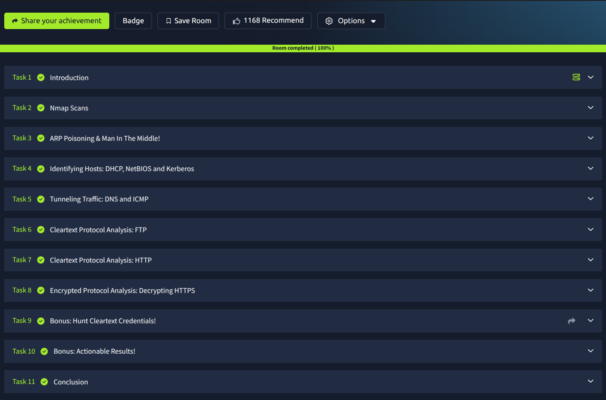

### 🔍 Key Learning:
- تحليل الـ Protocols الأساسية واكتشاف الـ Anomalies.
- استخدام الـ Filters المتقدمة للوصول للبيانات المشبوهة.

---

## 🐽 Intrusion Detection with Snort
**Description:** Hands-on experience using Snort to detect real-time threats and write custom rules.

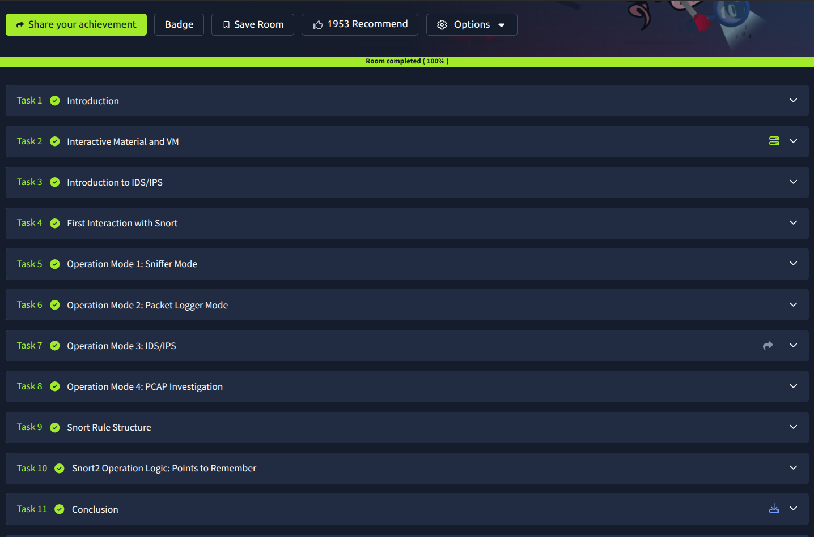

### 🔍 Key Learning:
- كتابة الـ Snort Rules لاكتشاف الهجمات.
- تحليل الـ Alert logs والتعامل مع الـ PCAP files.

---

## 🛡️ Malware Analysis: FlareVM
**Description:** Successfully completed the FlareVM room, gaining hands-on experience in setting up a malware analysis laboratory environment.

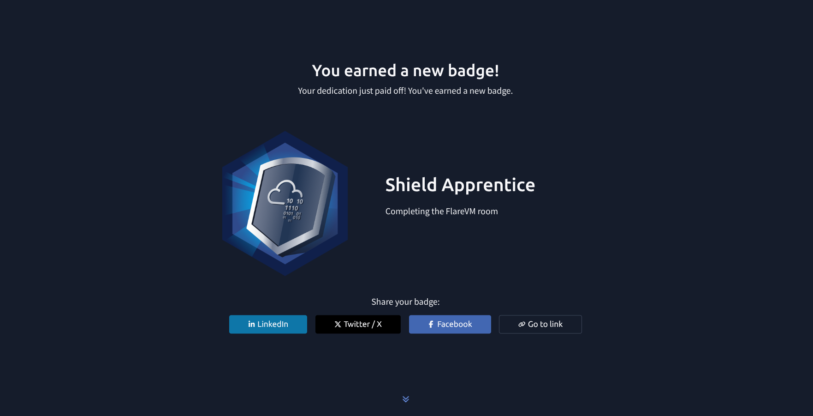

### 🔍 Key Learning:
- تجهيز بيئة معزولة لتحليل الفيروسات (Sandboxing).
- التعرف على الأدوات الأساسية في FlareVM لتحليل الـ Malware.

---

## 🐧 Linux Fundamentals (Parts 1, 2, 3)
**Description:** Completed the full Linux Fundamentals pathway on TryHackMe, covering everything from basic terminal navigation to system administration and package management.

  
  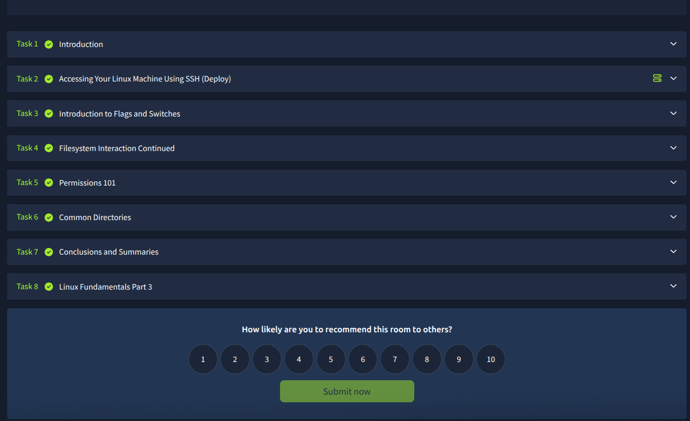
  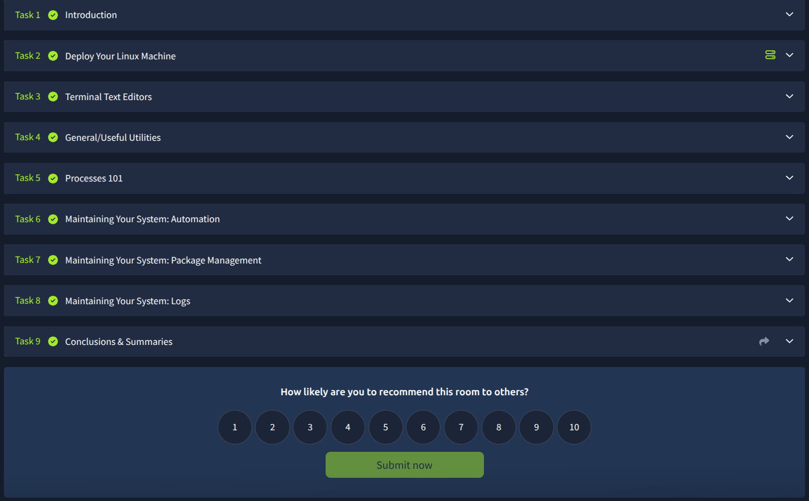

### 🛠️ Key Skills Learned:
- **Terminal Command Line:** Navigating the file system using `cd`, `ls`, `pwd`.
- **System Commands:** Using `find`, `grep`, and shell operators (`>`, `>>`, `|`).
- **Permissions:** Understanding `chmod` and managing file access.
- **System Admin:** Managing processes, services, and automation via Cron.

---

## 🐝 OWASP Top 10
**Description:** Deep dive into the top 10 most critical web application security risks. Understand how to identify and mitigate common vulnerabilities.

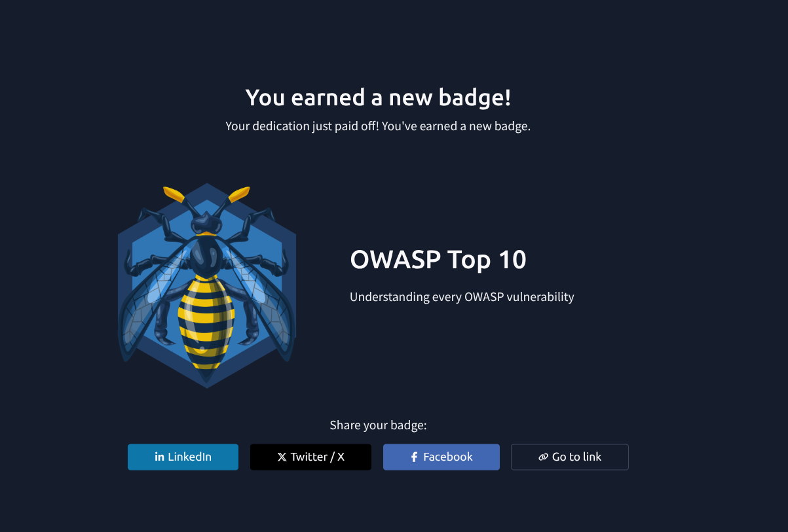

### 🔍 Key Learning:
- **Injection & XSS:** Understanding how malicious scripts are executed.
- **Broken Access Control:** How attackers bypass authorization.
- **Sensitive Data Exposure:** Protecting user data and encryption basics.

---

## 🛡️ Security Operations Center (SOC) - Blue Team Introduction
**Description:** Started the SOC Level 1 path by understanding the fundamental role of a Junior Security Analyst and how defensive teams operate.

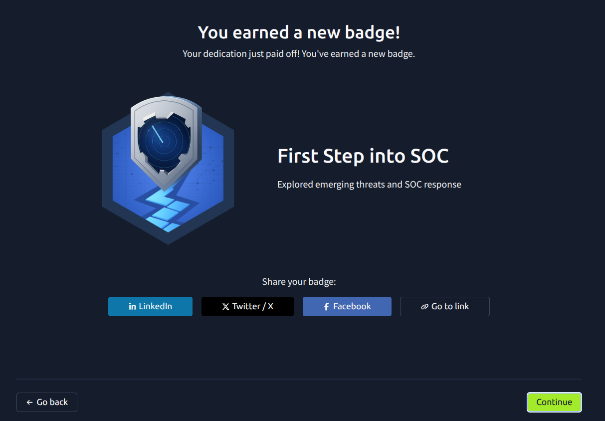

### 🔍 Key Learning:
- **SOC Roles:** فهم مهام الـ Junior Security Analyst والدور اللي بيقوم بيه فريق الـ Blue Team.
- **Attack Vectors:** التعرف على مداخل الهجمات المختلفة سواء عن طريق الأخطاء البشرية (Humans) أو الثغرات التقنية في الأنظمة (Systems).
- **Defensive Mindset:** التفكير بعقلية المدافع لصد التهديدات قبل وقوعها.

---

## 🛡️ Endpoint Detection and Response (EDR)
**Description:** Understanding how EDR solutions monitor endpoints and provide visibility into malicious activities.

  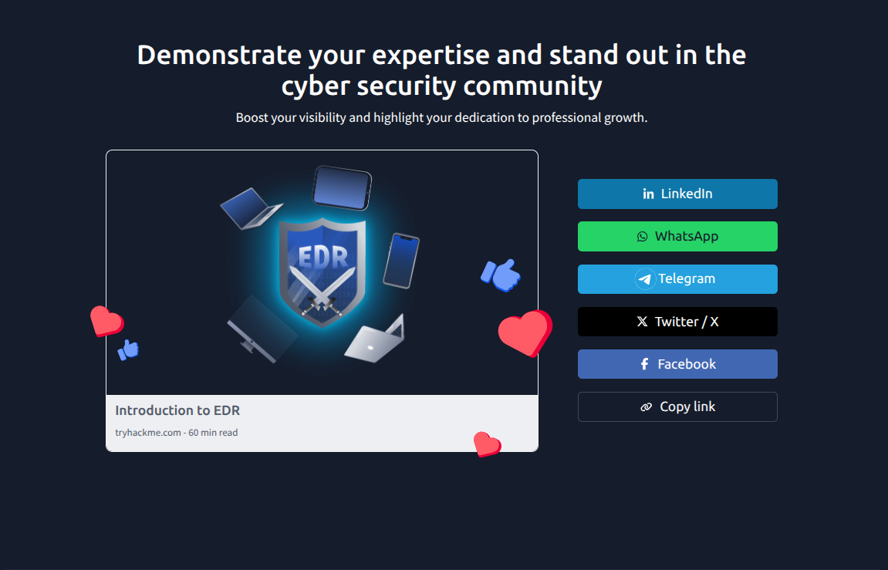
  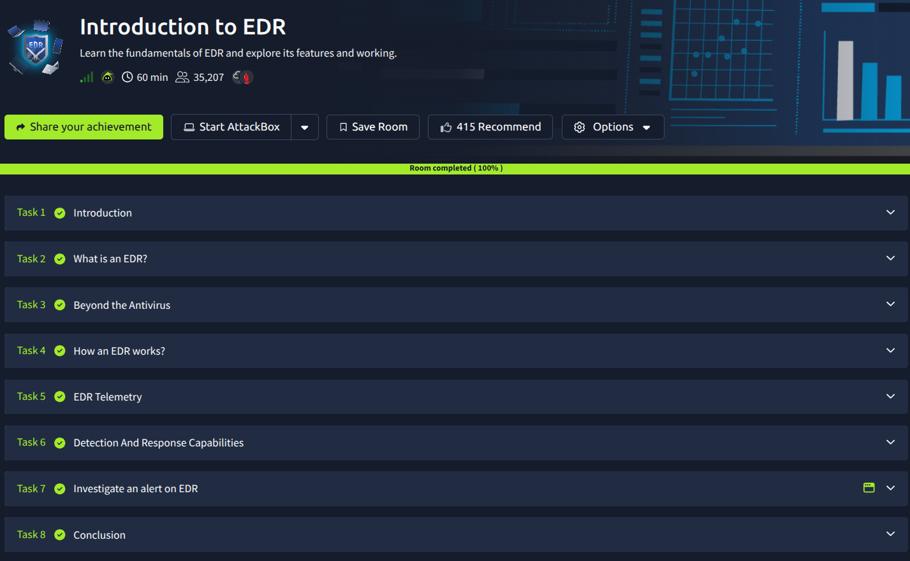

### 🛠️ What I Learned:
- **EDR vs Antivirus:** الفرق بين الحماية التقليدية والـ EDR في اكتشاف الهجمات المعقدة.
- **EDR Telemetry:** كيفية جمع البيانات من الأجهزة وتحليل السلوكيات المشبوهة.
- **Practical Investigation:** التحقيق في تنبيه (Alert) حقيقي داخل بيئة EDR.

---

## 🛠️ Security Information and Event Management (SIEM)
**Description:** Learning how to centralize, search, and analyze logs using industry-standard tools like Splunk.

  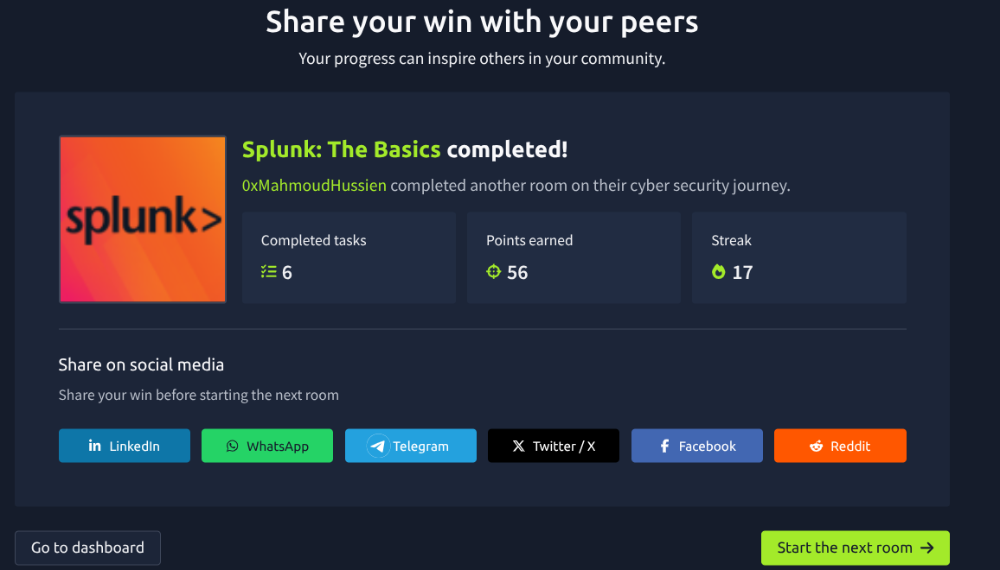
  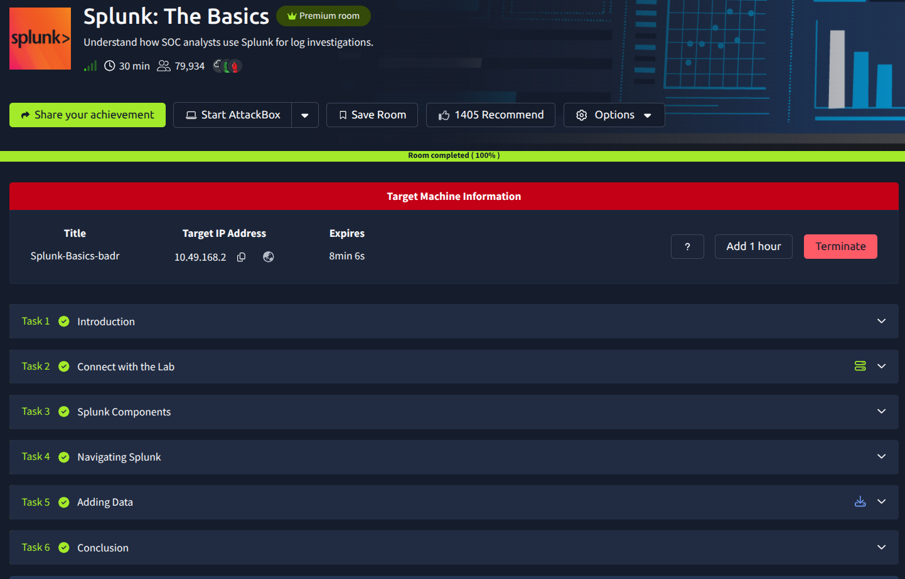

### 🔍 Splunk Proficiency:
- **Splunk Components:** فهم الـ Indexer, Search Head, والـ Forwarder.
- **Data Ingestion:** تعلم كيفية إضافة البيانات (Add Data) والبحث فيها باستخدام الـ SPL.
- **Log Investigation:** ممارسة التحقيق في السجلات لاكتشاف النشاطات المشبوهة داخل الشبكة.

  ---

## 📊 SIEM Mastery: Splunk & Elastic Stack (ELK)
**Description:** Hands-on experience with industry-leading SIEM platforms for log centralization and threat hunting.

  
  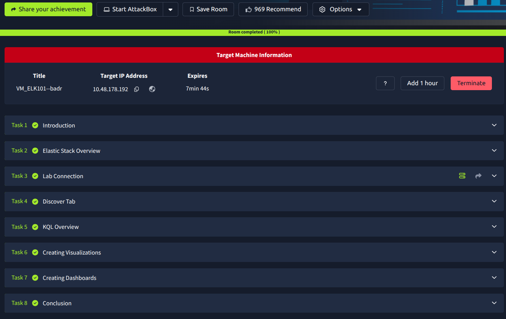

### 🛠️ Elastic Stack Key Learning Outcomes:
- **ELK Architecture:** فهم كيفية عمل Elasticsearch و Logstash و Kibana معاً.
- **KQL Proficiency:** كتابة استعلامات معقدة باستخدام Kibana Query Language للبحث في السجلات.
- **Visualizing Data:** بناء Dashboards احترافية لمراقبة التهديدات الأمنية لحظياً.

---

## ⚙️ Security Orchestration, Automation, and Response (SOAR)
**Description:** Learning how to automate repetitive tasks and orchestrate incident response workflows to improve SOC efficiency.

  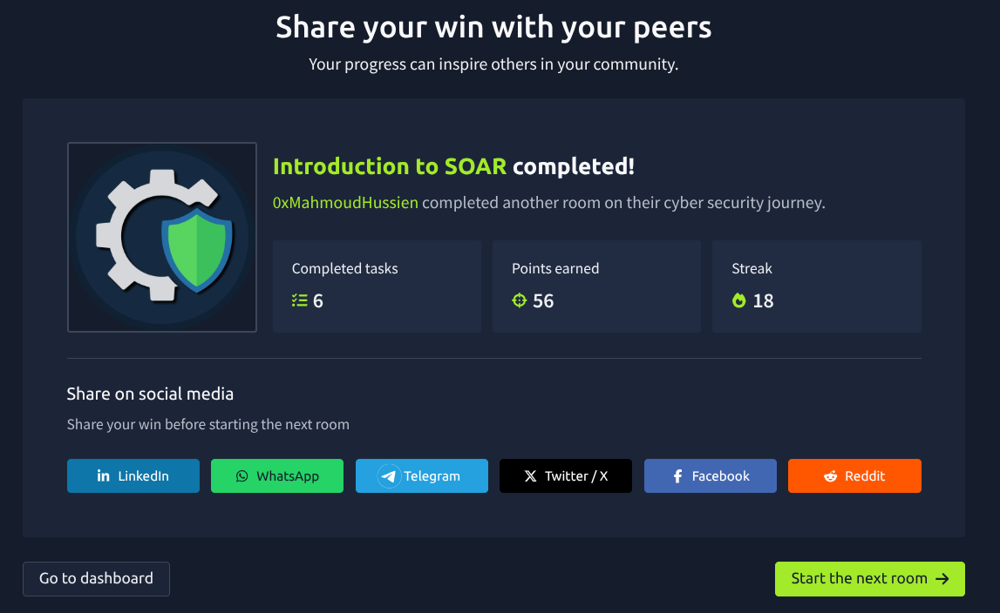
  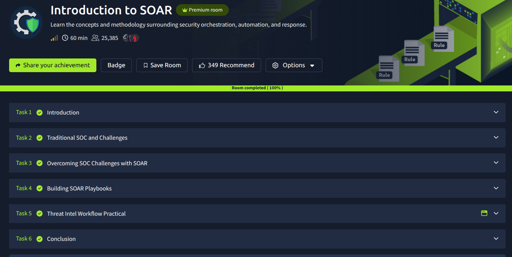

### 🛠️ Key Learning Outcomes:
- **Automation Playbooks:** فهم كيفية بناء الـ Playbooks لأتمتة الرد على التنبيهات المتكررة.
- **Tool Integration:** تعلم كيفية ربط أدوات الـ SIEM والـ EDR بمنصة SOAR واحدة.
- **Efficiency Boost:** كيفية تقليل الـ Mean Time to Respond (MTTR) من خلال العمليات الآلية.

---

## 🔍 Network Intelligence: Zeek (Bro) Exploration
**Description:** Completed extensive training on Zeek, covering core concepts and solving complex network traffic challenges.

| Zeek: The Basics | Zeek: Challenges |
| :---: | :---: |
| 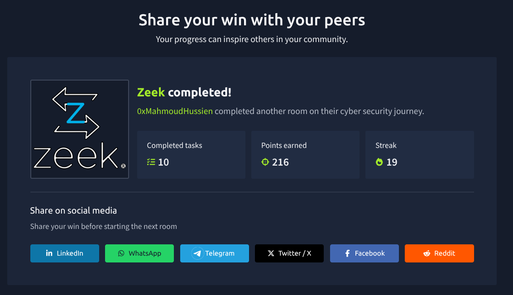 | 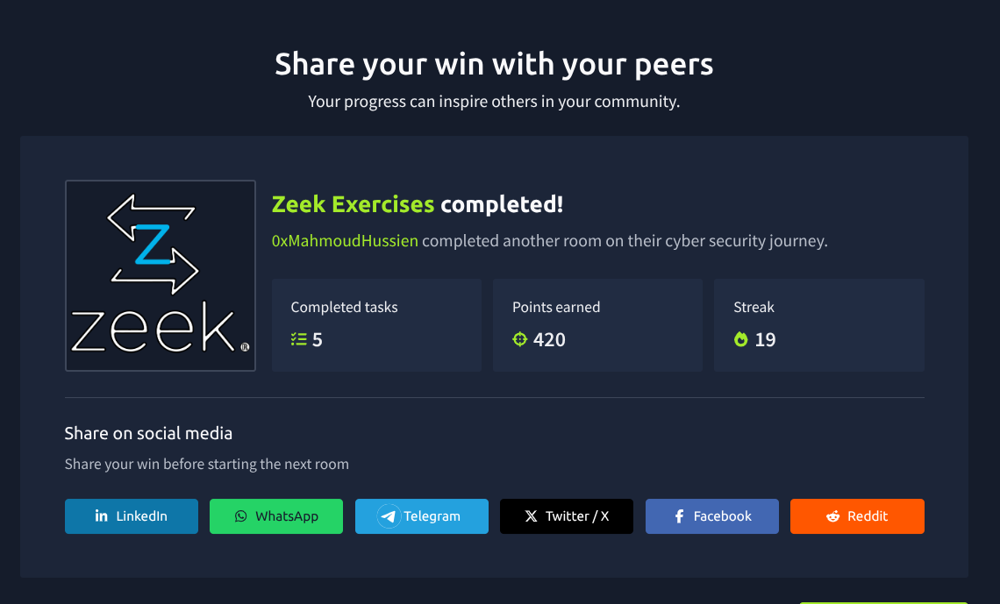 |
| 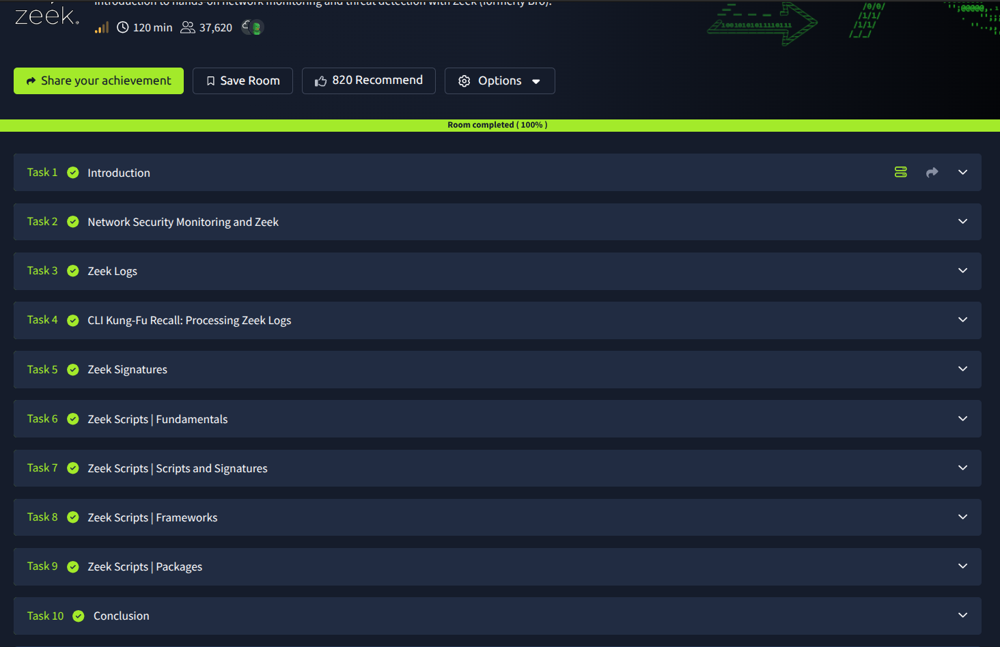 | 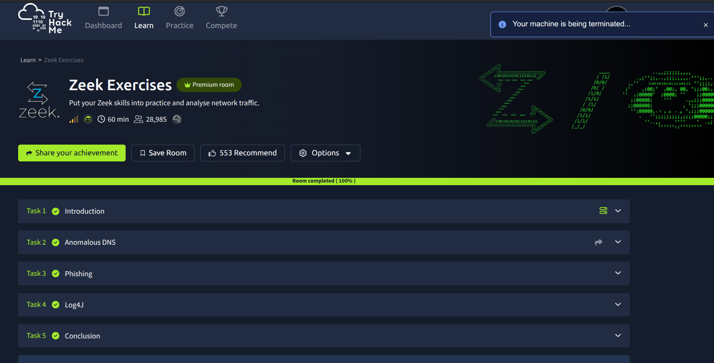 |

### 🛠️ Technical Expertise Gained:
- **Packet Analysis:** تحليل الـ PCAP Files واستخراج الأدلة الجنائية الرقمية منها.
- **Protocol Deep-Dive:** فهم وتحليل سجلات بروتوكولات الـ HTTP, DNS, و FTP لاكتشاف التهديدات.
- **Advanced Threat Hunting:** حل تحديات واقعية لاكتشاف الهجمات المعقدة داخل الشبكة باستخدام Zeek.

---

## 🔺 Threat Hunting: The Pyramid Of Pain
**Description:** Understanding the relationship between indicators of compromise (IOCs) and the level of "pain" they cause an adversary when denied.

  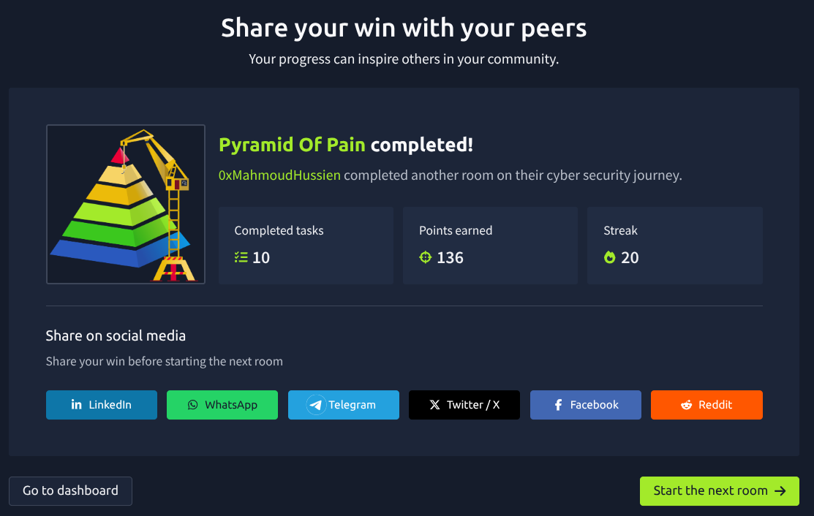
  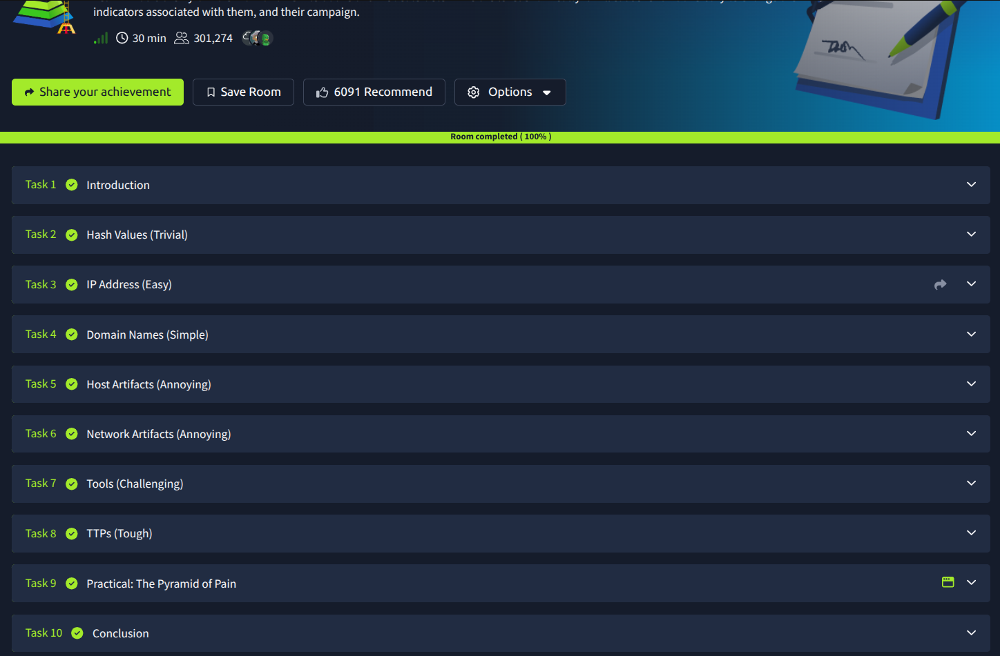

### 🧠 Key Learning Outcomes:
- **IOCs Hierarchy:** التمييز بين الـ Hash Values والـ IP Addresses وصولاً للـ TTPs.
- **Detection Strategy:** كيفية بناء استراتيجيات كشف (Detection) تركز على سلوك المهاجم وليس فقط أدواته.
- **Incident Analysis:** تعلم كيفية رفع تكلفة الهجوم على المخترق من خلال استهداف المستويات العليا في الهرم.

---

## ⛓️ Strategic Defense: Unified Kill Chain
**Description:** Mastering the end-to-end framework that describes the phases of a cyberattack, combining multiple models into a single unified chain.

  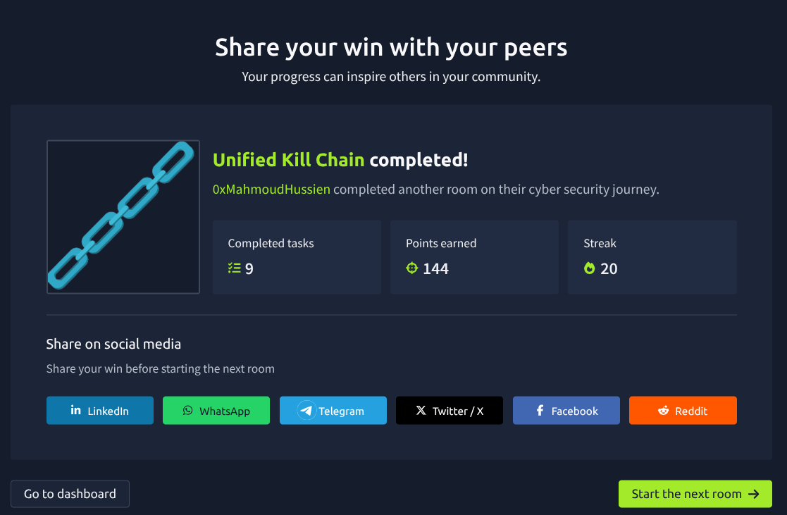
  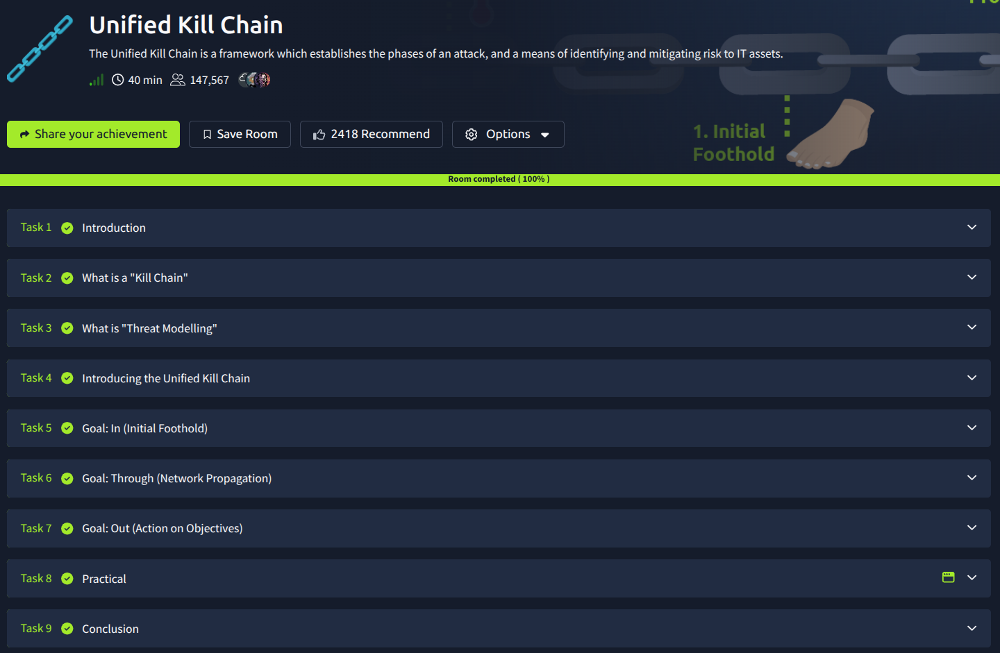

### 🛠️ Key Learning Outcomes:
- **Framework Integration:** فهم كيفية دمج الـ Kill Chain التقليدي مع مصفوفة الـ MITRE ATT&CK.
- **Attack Phases:** دراسة الـ 18 مرحلة للهجوم من الـ Reconnaissance وحتى الـ Objectives.
- **Defensive Mapping:** تعلم كيفية تحديد نقاط الضعف في الشبكة ورسم خطط الدفاع بناءً على كل مرحلة من مراحل الهجوم.

---

## 🛡️ Frameworks: MITRE ATT&CK Mastery
**Description:** Deep understanding of the globally-accessible knowledge base of adversary tactics and techniques based on real-world observations.

  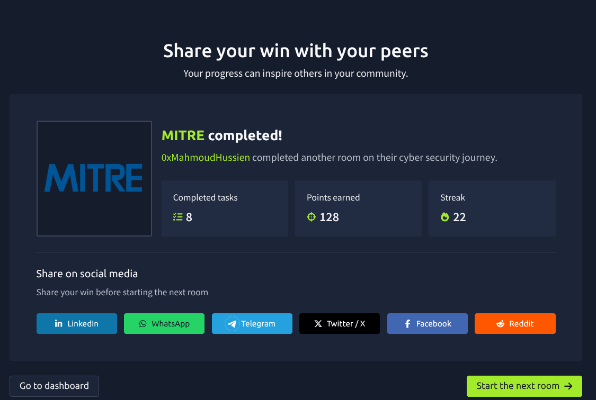
  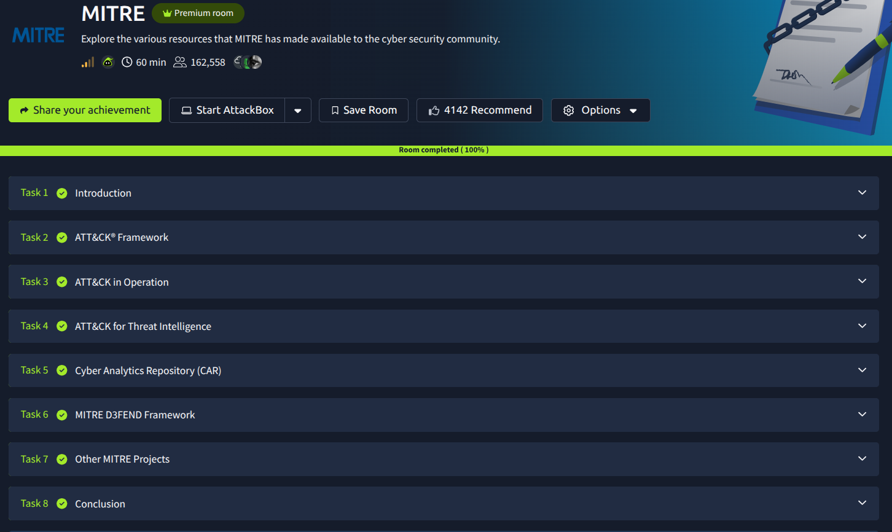

### 🛠️ Key Learning Outcomes:
- **Tactics vs. Techniques:** فهم الفرق بين "ماذا" يحاول المهاجم تحقيقه و"كيف" يقوم بذلك فعلياً.
- **Matrix Navigation:** تعلم كيفية استخدام مصفوفة MITRE لتحليل الهجمات وتحديد الفجوات الدفاعية.
- **Detection & Mitigation:** كيفية استخدام المعارف الموجودة في الإطار لتحسين قدرات الكشف والرد على التهديدات.

---

## 🛡️ Practical Investigation: MITRE ATT&CK Navigator
**Scenario:** Adversary Mapping & Defensive Analysis (APT28 Case Study)

  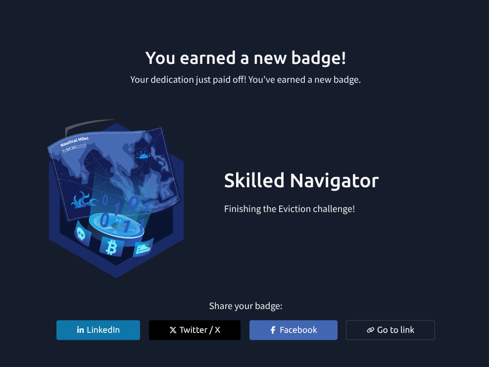
  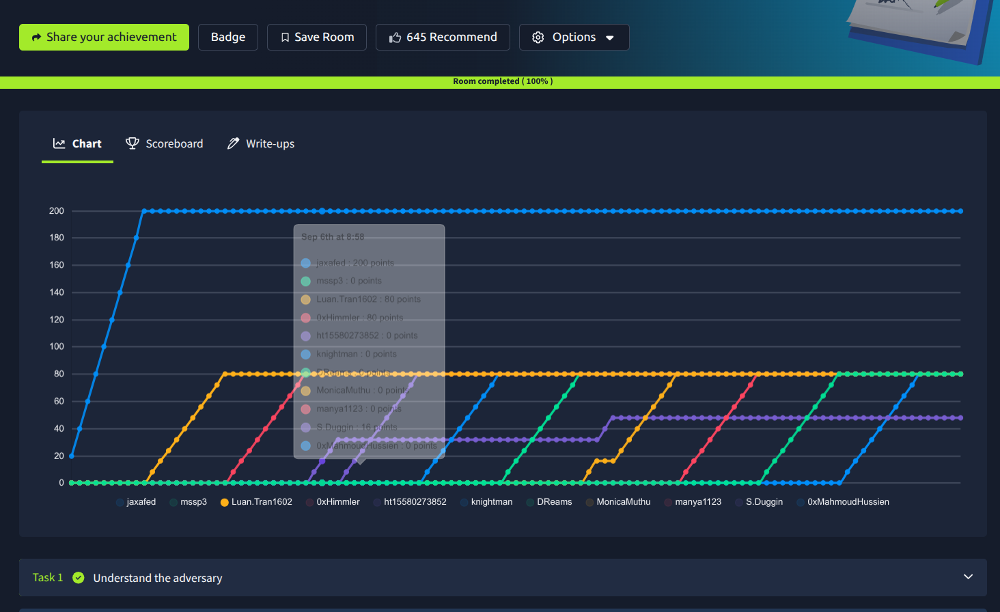

### 🛠️ Hands-on Skills Applied:
- **APT Profiling:** تحليل سلوك مجموعة **APT28** وتحديد الـ Techniques اللي بيستخدموها.
- **Navigator Mapping:** استخدام أداة **MITRE Navigator** لعمل Visualization للفجوات الدفاعية (Defensive Gaps).
- **Detection Engineering:** تحديد الـ TTPs اللي محتاجة مراقبة مكثفة في الـ SIEM بناءً على السيناريو العملي.

---

### 📧 Email Security & Phishing Analysis (Part 1)
*Completed 3/7 rooms of the module. Focusing on header analysis and malicious lures.*

#### 1. Phishing Analysis Fundamentals

  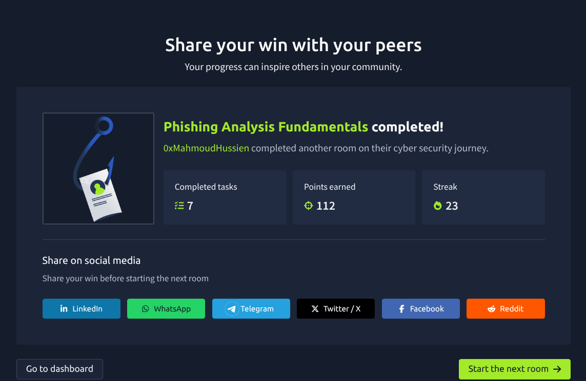
  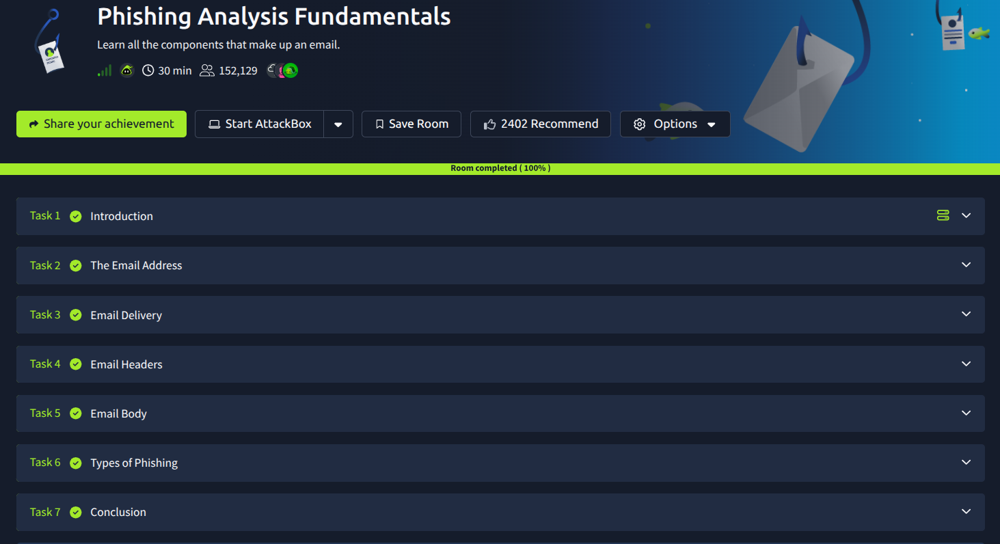

* **Key Learning Outcomes:**
    * فهم مكونات الإيميل والفرق بين الـ **SMTP envelope** والـ **Email header**.
    * تحليل الـ **IP addresses** للمرسل وتتبع مسار الإيميل.
    * التعرف على أنواع الـ **Attachments** المشبوهة وكيفية التعامل معها.

#### 2. Phishing Emails in Action

  
  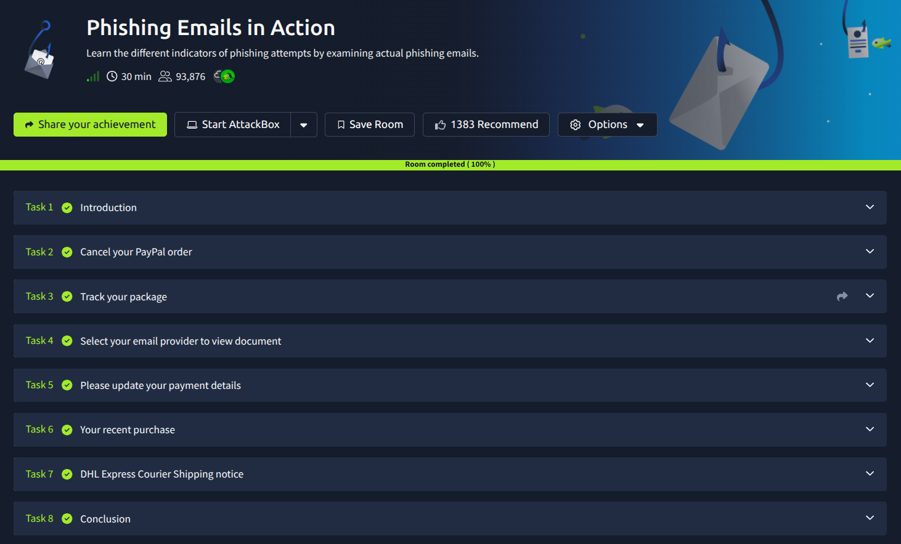

* **Key Learning Outcomes:**
    * تحليل سيناريوهات حقيقية لهجمات تحاكي **PayPal** و **DHL**.
    * اكتشاف الـ **Malicious URLs** المستخبية وراء أزرار وهمية.
    * التدريب على كشف الـ **Social Engineering** وتكتيكات إيهام الضحية.

#### 3. Phishing Analysis Tools

  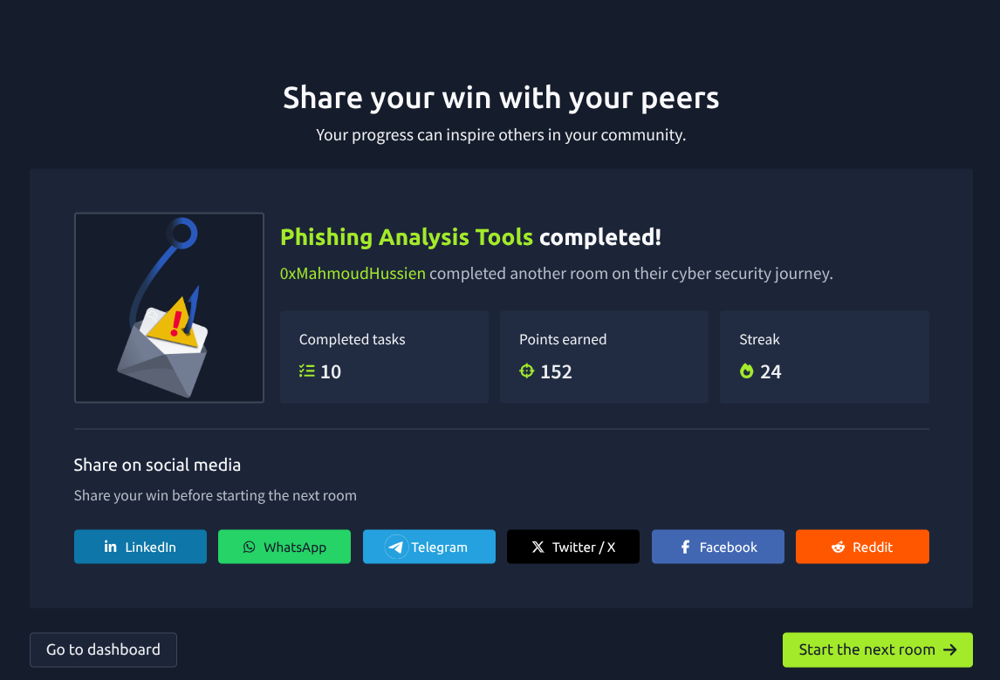
  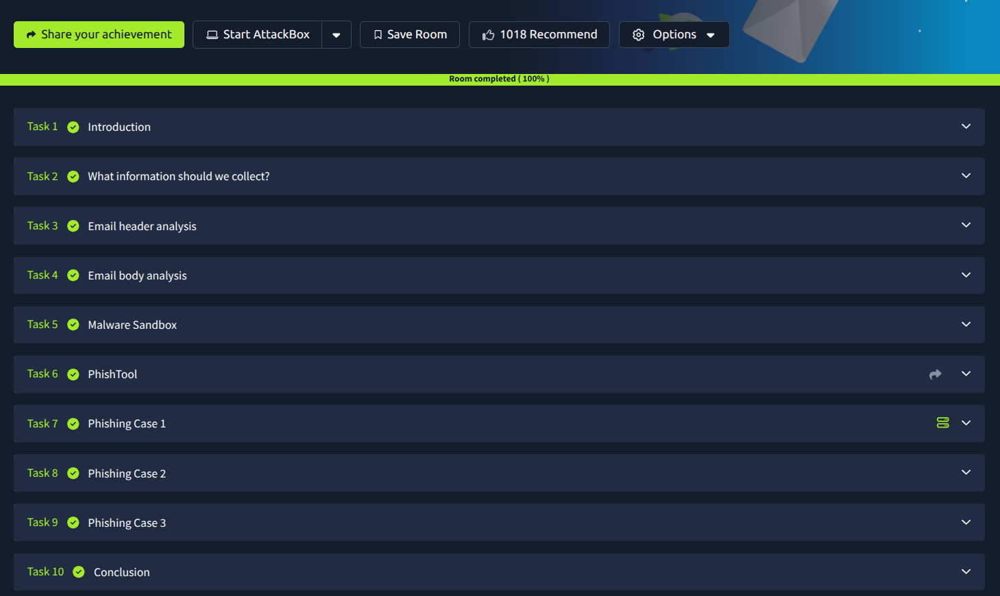

* **Key Learning Outcomes:**
    * احتراف استخدام أداة **PhishTool** لتحليل الـ Headers بشكل آلي.
    * استخدام الـ **Malware Sandboxes** لفحص الملفات والروابط بأمان.
    * إجراء تتبع كامل (Investigation) لثلاث حالات حقيقية (Phishing Cases).
---

### 📧 Email Security & Phishing Analysis (Part 1)
*Completed 3 core rooms in the Email Security module.*

#### 1. Introduction to Email Security (SPF, DKIM, DMARC)

  
  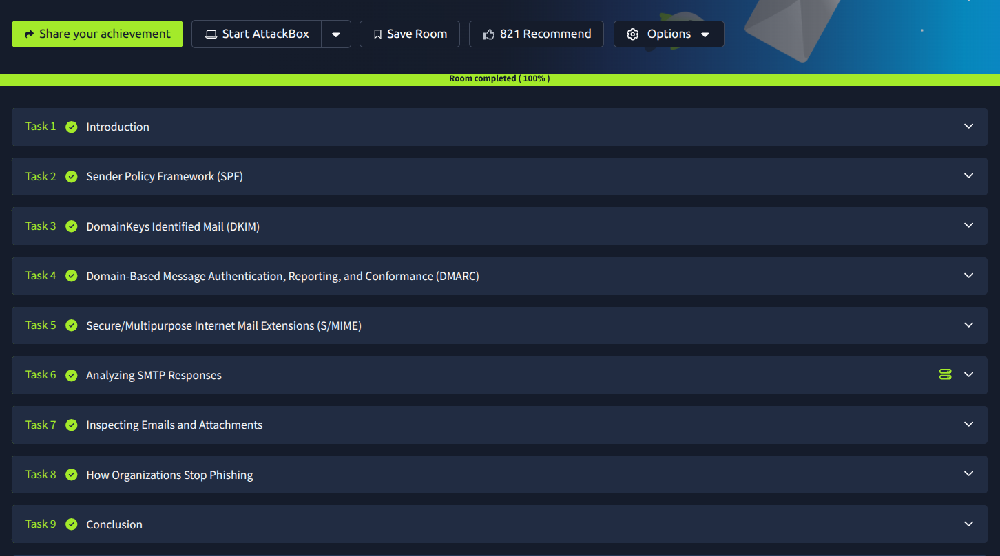

* **اللي اتعلمته:**
    * فهم بروتوكولات التحقق **SPF, DKIM, DMARC** وإزاي بنستخدمهم لمنع الـ Spoofing.
    * تحليل الـ **Email Headers** يدويًا وفهم الـ **Hop-by-hop** تتبع للمرسل.

#### 2. Phishing Emails 1

  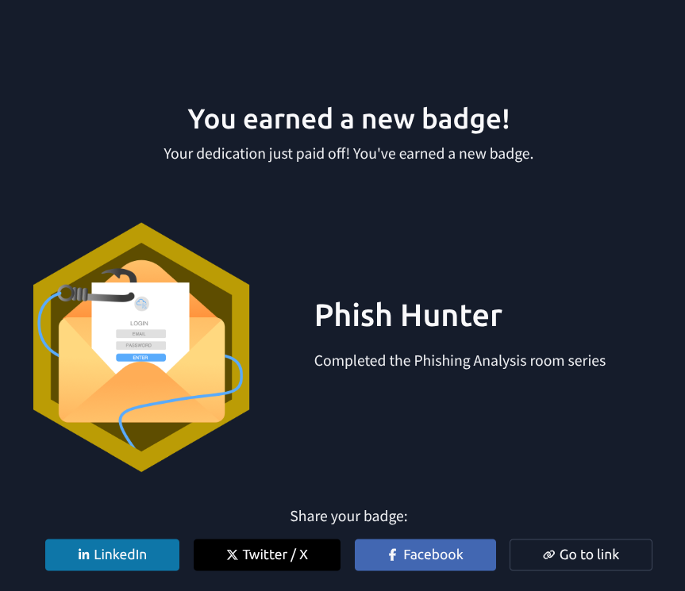
  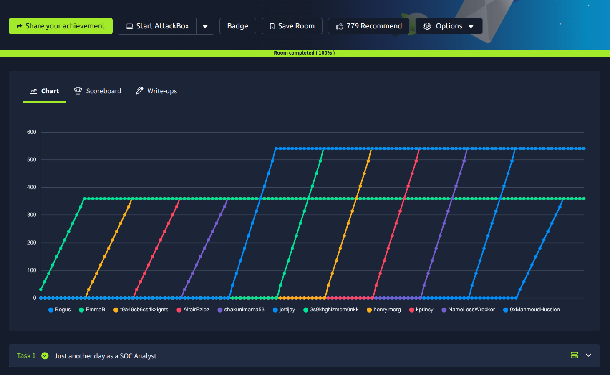

* **اللي اتعلمته:**
    * فحص الـ **Visual Indicators** في الإيميلات المشبوهة.
    * تحليل الـ **Embedded Links** وفهم تكتيكات الـ Social Engineering البدائية.

#### 3. Phishing Emails 2

  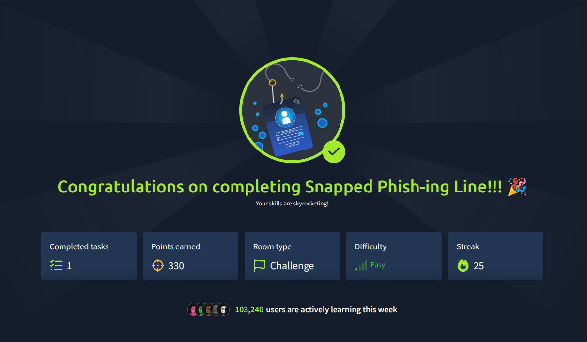
  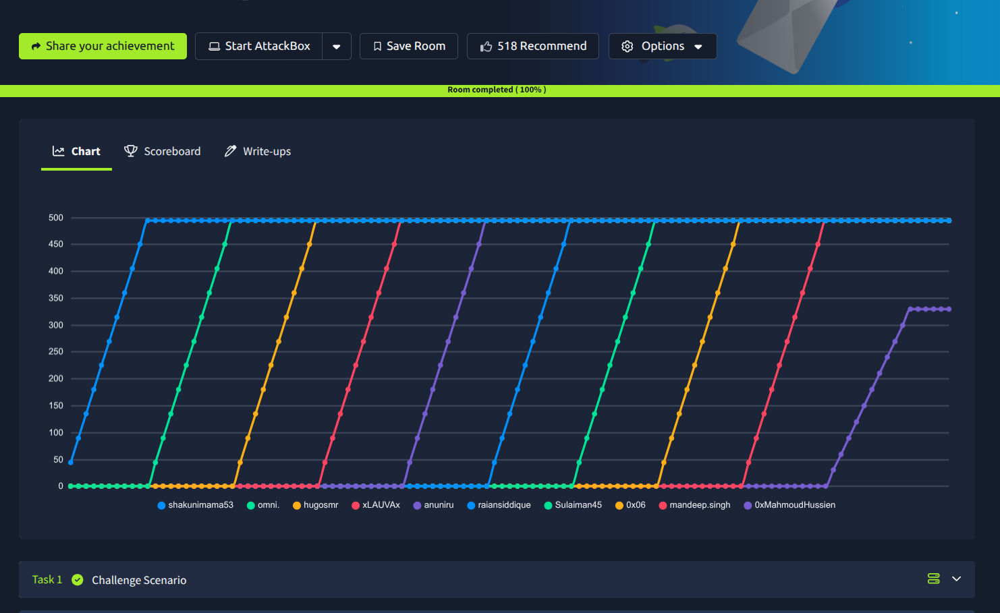

* **اللي اتعلمته:**
    * التعمق في تحليل الـ **Attachments** المشبوهة.
    * التعامل مع حالات Phishing أكثر تعقيداً واستخراج الـ **IOCs** (مؤشرات الاختراق) من محتوى الإيميل.

---

#### 4. NetworkMiner (Network Forensics)

  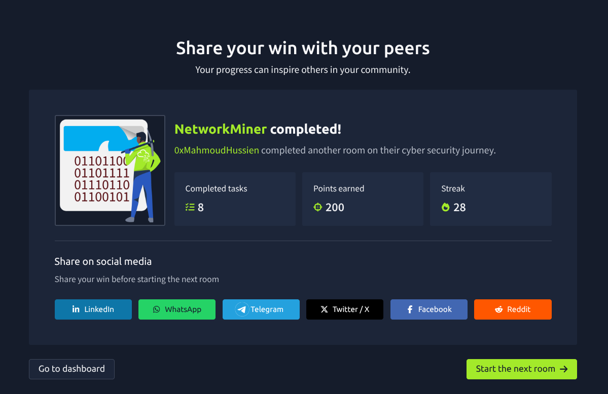
  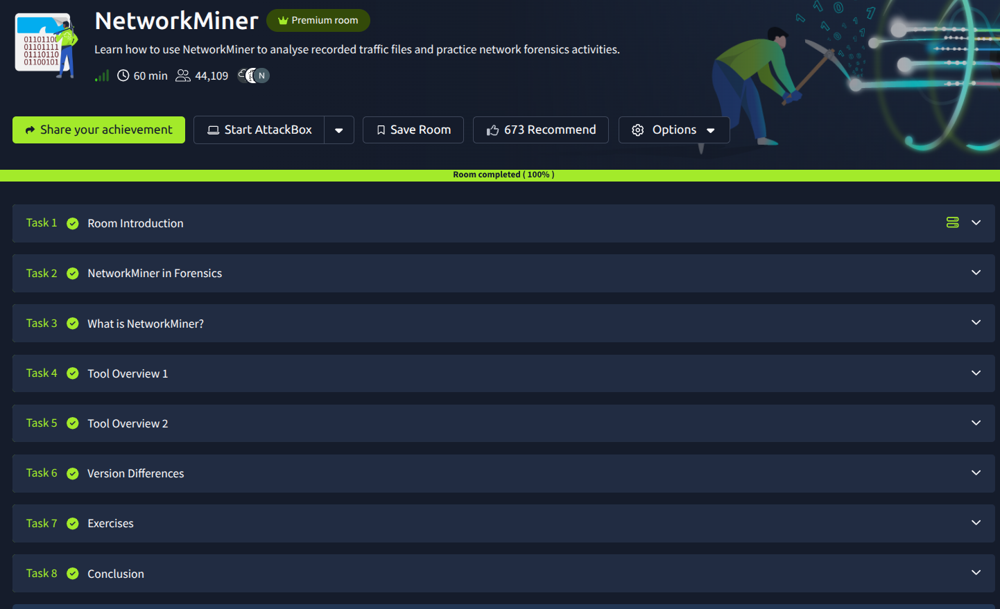

* **اللي اتعلمته:**
    * استخدام **NetworkMiner** كـ NFAT (Network Forensic Analysis Tool) لاستخراج الملفات تلقائياً من الـ Traffic.
    * استخراج الـ **Credentials** والصور والملفات المتبادلة عبر بروتوكولات غير مشفرة مثل HTTP و FTP.
    * تحليل الـ **OS Fingerprinting** لمعرفة أنظمة التشغيل للأجهزة الموجودة في الشبكة بدون إرسال أي حزم (Passive Sniffing).

---

#### 5. Network Security Essentials

  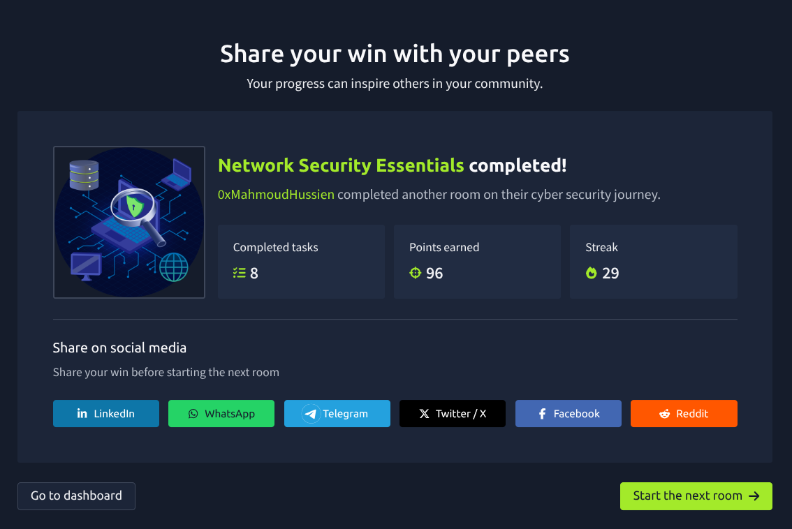
  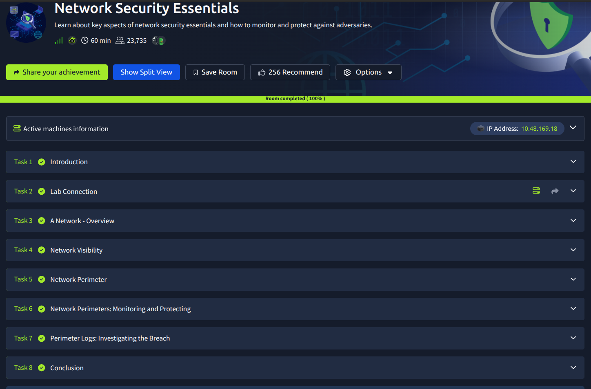

* **ما تم تعلمه (Learning Objectives):**
    * فهم ماهية الشبكات وتحديد المكونات الرئيسية المكونة لها (Key Components).
    * استكشاف مفهوم "محيط الشبكة" (Network Perimeter) وأهميته في حماية البيانات.
    * التعرف على التهديدات الرئيسية التي تستهدف محيط الشبكة (Perimeter Threats).
    * تحليل وفحص سجلات جدار الحماية (Firewall Logs) للتمييز بين الأنشطة الطبيعية والمشبوهة.

---

#### 6. Network Discovery Detection

  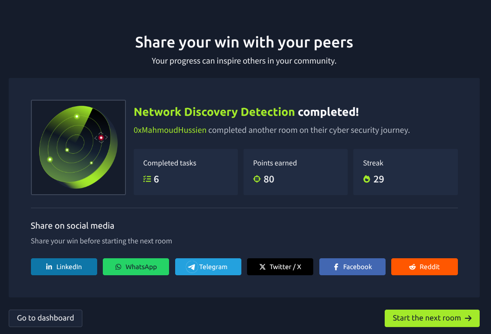
  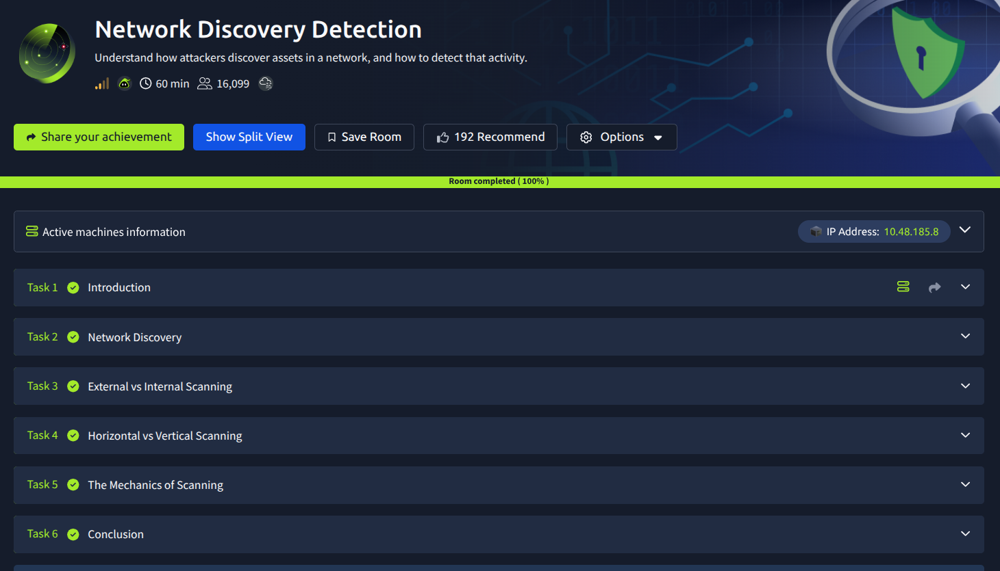

* **ما تم تعلمه (Learning Objectives):**
    * فهم ماهية الـ **Network Discovery** ودورها في كشف الأجهزة والخدمات النشطة.
    * التعرف على أسباب قيام المهاجمين بعمليات الاكتشاف (Reconnaissance) قبل الهجوم.
    * التمييز بين أنواع الـ Network Discovery المختلفة (External vs Internal Scanning).
    * فهم آليات عمل تقنيات الاكتشاف (Horizontal vs Vertical Scanning) وكيفية رصدها واكتشافها.

---

#### 7. Data Exfiltration Detection

  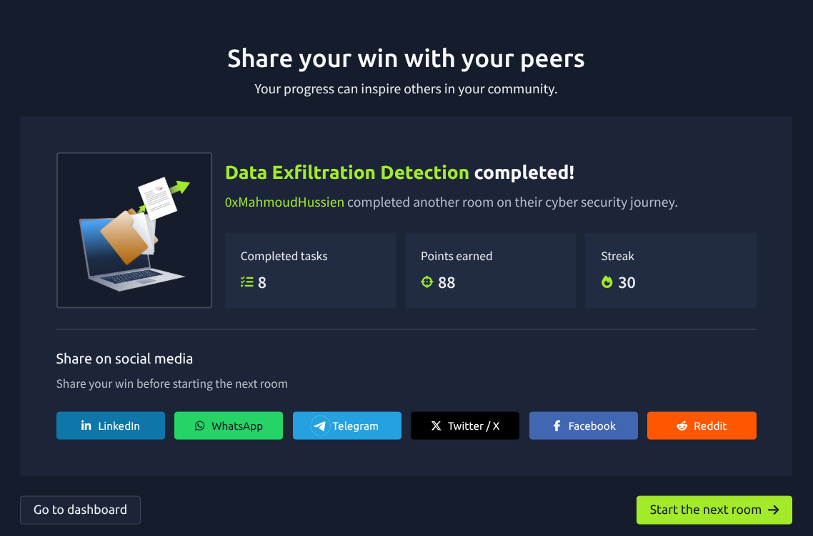
  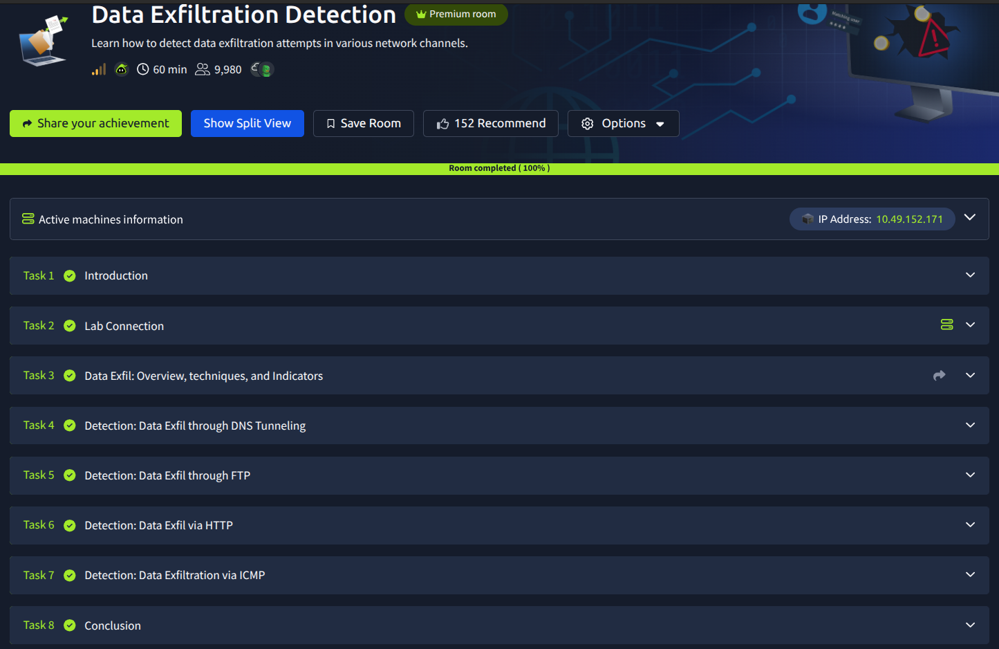

* **ما تم تعلمه (Learning Objectives):**
    * فهم الطرق الشائعة التي يستخدمها المهاجمون لتسريب البيانات (Data Exfiltration).
    * تعلم كيفية اكتشاف محاولات التسريب من خلال تحليل حركة مرور الشبكة (Network Traffic Analysis).
    * تحديد علامات تسريب البيانات على الأجهزة النهائية (Endpoint Devices).
    * ربط السجلات (Log Correlation) داخل نظام الـ **SIEM** للكشف عن قنوات التسريب المخفية.

---

#### 8. Man-in-the-Middle (MITM) Detection

  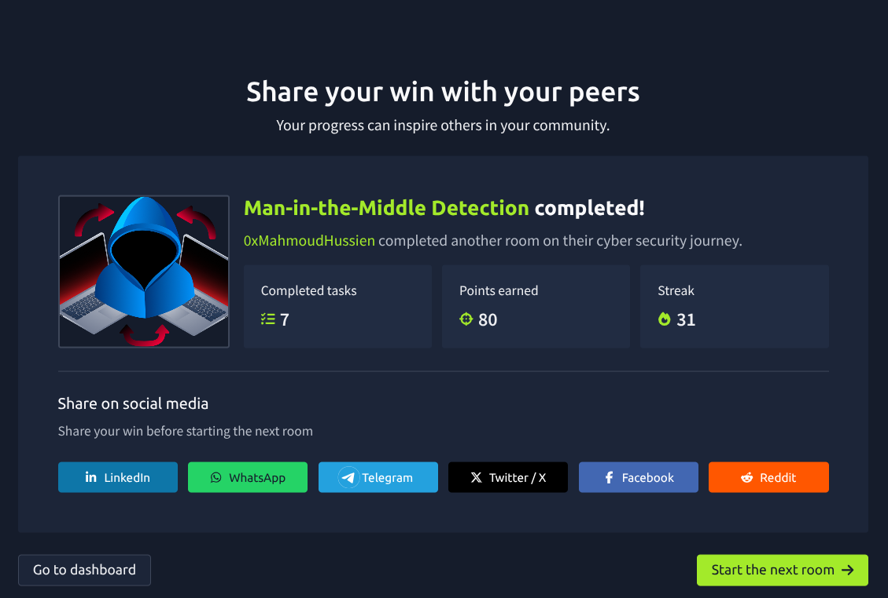
  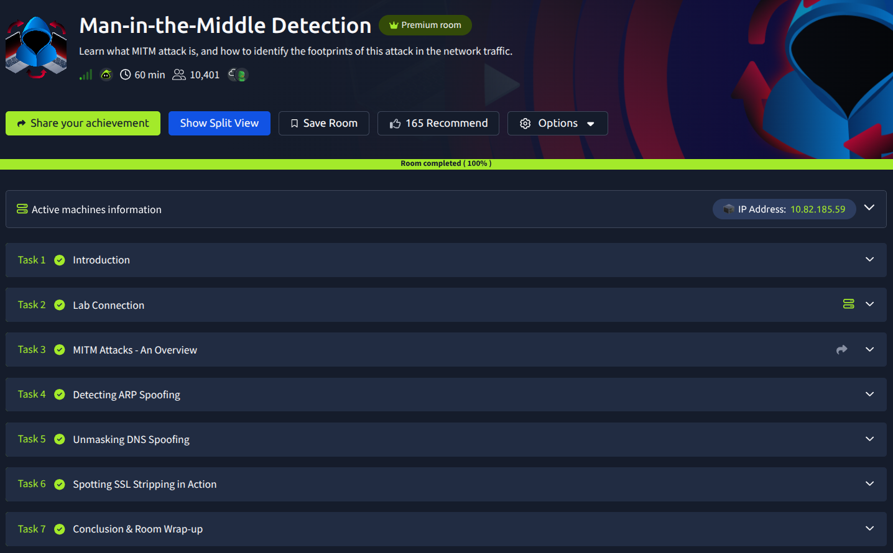

* **ما تم تعلمه (Learning Objectives):**
    * فهم نواقل وتقنيات هجمات الـ **MITM** الشائعة وكيفية تنفيذها في الشبكات.
    * تعلم كيفية تحديد "مؤشرات الاختراق" (IoCs) المرتبطة بهجمات الرجل في المنتصف.
    * إتقان استخدام أدوات مراقبة الشبكة لرصد أنماط حركة المرور المشبوهة (Suspicious Traffic).
    * ممارسة إجراءات الاستجابة للحوادث (Incident Response) المخصصة لسيناريوهات الـ MITM.

---

#### 9. Web Security Essentials

  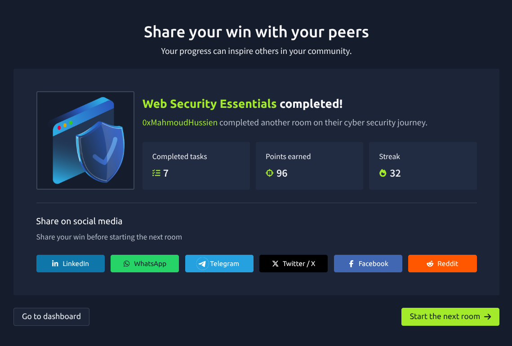
  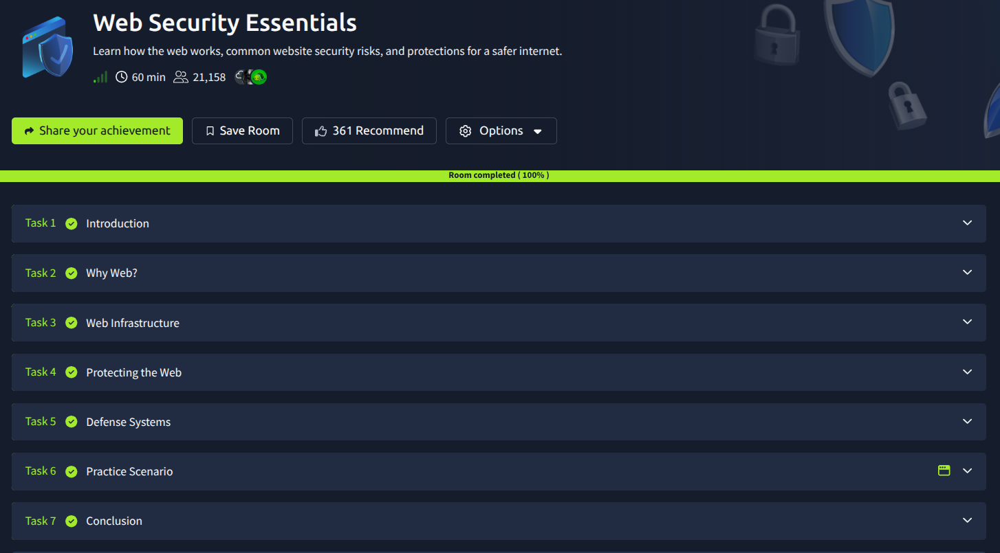

* **ما تم تعلمه (Learning Objectives):**
    * فهم التحول من تطبيقات سطح المكتب إلى تطبيقات الويب (Web Applications) وأثره الأمني.
    * تحليل الأسباب التي تجعل تطبيقات الويب هدفاً شائعاً ومفضلاً للمهاجمين.
    * استكشاف البنية التحتية للويب (Web Infrastructure) والأدوات المستخدمة لتأمينها.
    * التدريب العملي على تطبيق التدابير الأمنية لتقوية وتأمين تطبيقات الويب الجديدة (Hardening).

---

#### 10. Detecting Web Attacks

  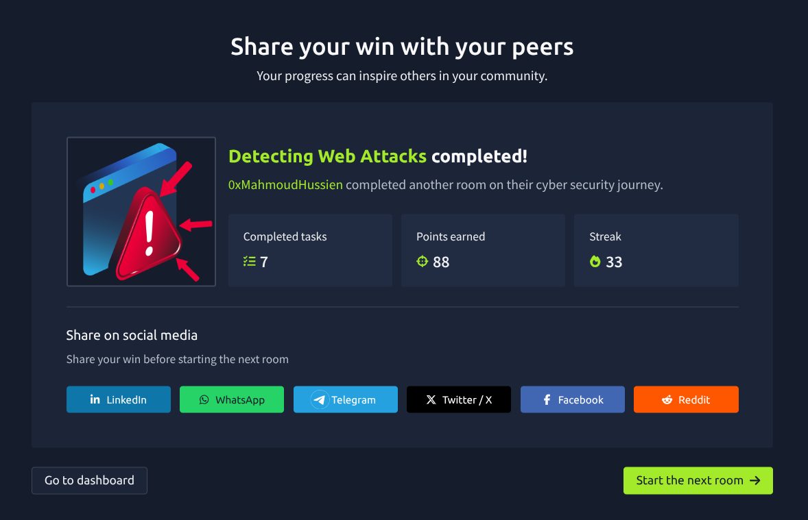
  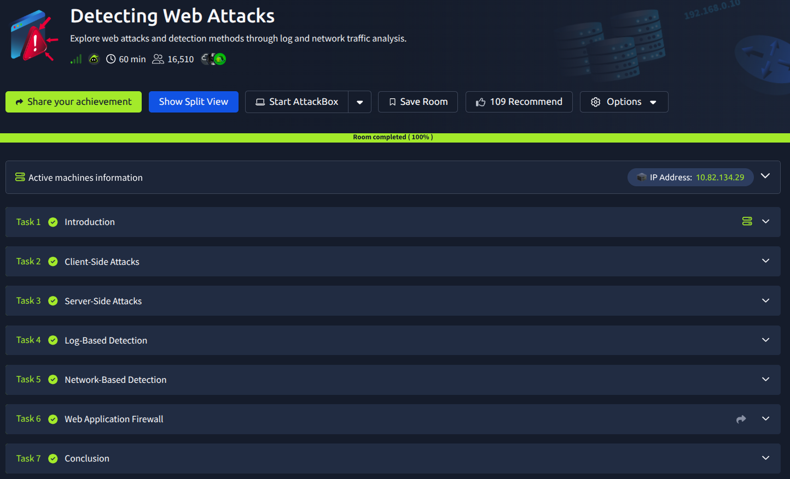

* **ما تم تعلمه (Learning Objectives):**
    * التعرف على أنواع هجمات الويب الشائعة التي تستهدف المستخدم (Client-side) والسيرفر (Server-side).
    * فهم مميزات وعيوب طرق الاكتشاف القائمة على تحليل السجلات (Log-based Detection).
    * استكشاف أساليب رصد الهجمات من خلال تحليل حركة مرور الشبكة (Network Traffic Analysis).
    * دراسة دور وأهمية جدران حماية تطبيقات الويب (WAF) في صد الهجمات.
    * الممارسة العملية على كشف وتحديد هجمات الويب الحقيقية باستخدام الأدوات والأساليب المذكورة.

---

#### 11. Detecting Web Shells

  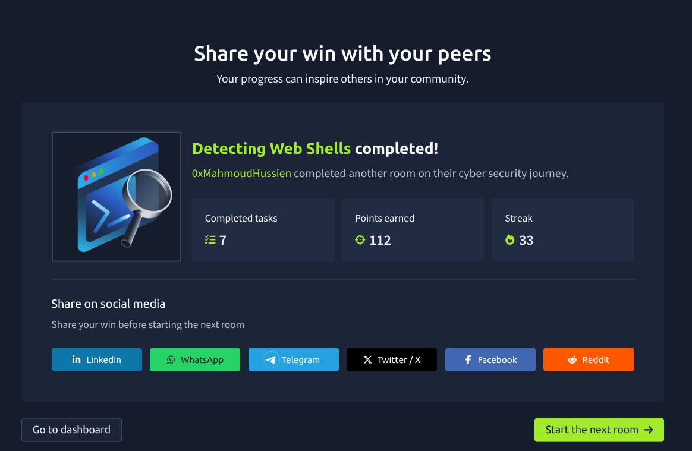
  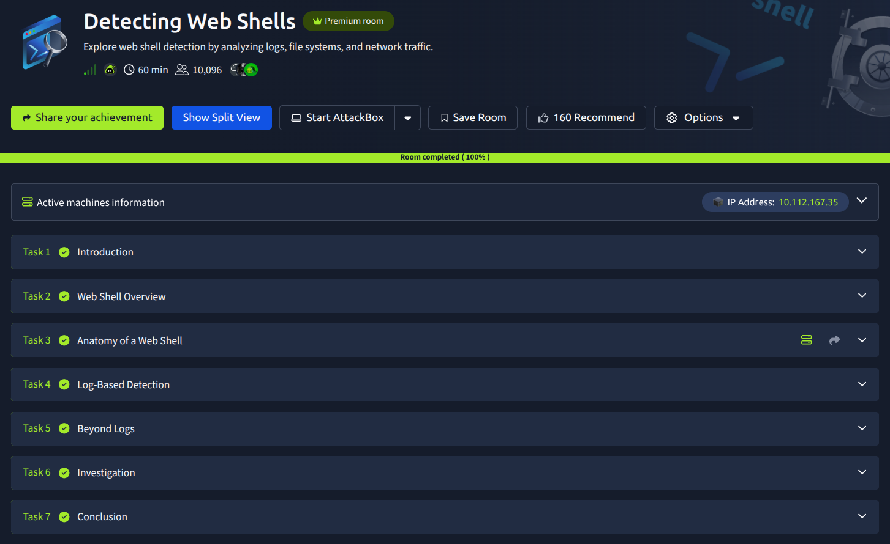

* **ما تم تعلمه (Learning Objectives):**
    * فهم ماهية الـ **Web Shells** وكيفية استخدام المهاجمين لها للسيطرة على السيرفرات عن بعد.
    * تعلم تقنيات اكتشاف نشاط الـ Web Shell من خلال تحليل السجلات (Logs)، ونظام الملفات (File System)، والشبكة.
    * التعرف على الأدوات والأساليب الشائعة المستخدمة في رصد وكشف الـ Web Shells بمختلف أنواعها.

---

#### 12. Detecting Web DDoS

  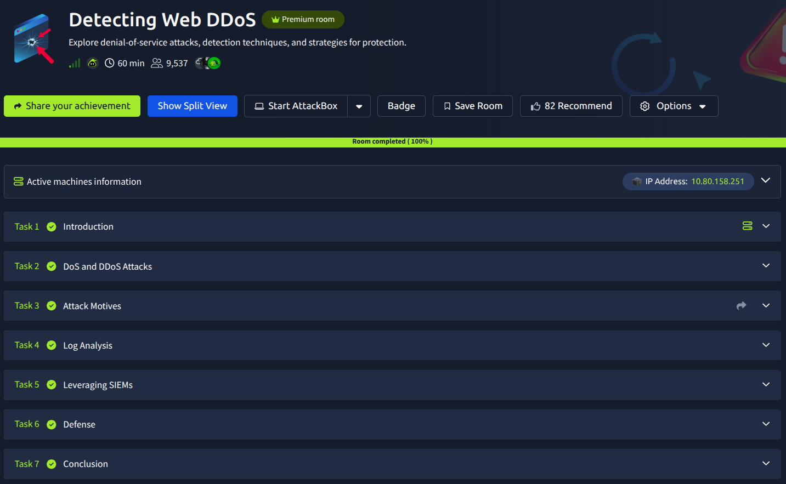

* **ما تم تعلمه (Learning Objectives):**
    * فهم كيفية عمل هجمات حجب الخدمة (DoS) وآليات تعطيلها للأنظمة.
    * استيعاب دوافع المهاجمين من القيام بهذه الهجمات التخريبية.
    * كشف علامات الـ **Web DoS** والـ **DDoS** من خلال تحليل سجلات الويب (Web Logs).
    * التدريب العملي على تحليل هجمات حجب الخدمة باستخدام تحليل السجلات (Log Analysis).
    * استكشاف تقنيات الكشف والحد من المخاطر (Detection & Mitigation) التي يستخدمها المدافعون.

---

### 🏆 Special Achievement: Web Defender

  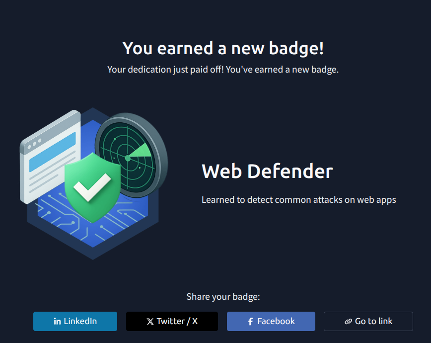

> **تم الحصول على هذه البادج بعد إتمام سلسلة غرف تأمين واكتشاف هجمات الويب بنجاح.**

---

#### 13. Windows Logging for SOC

  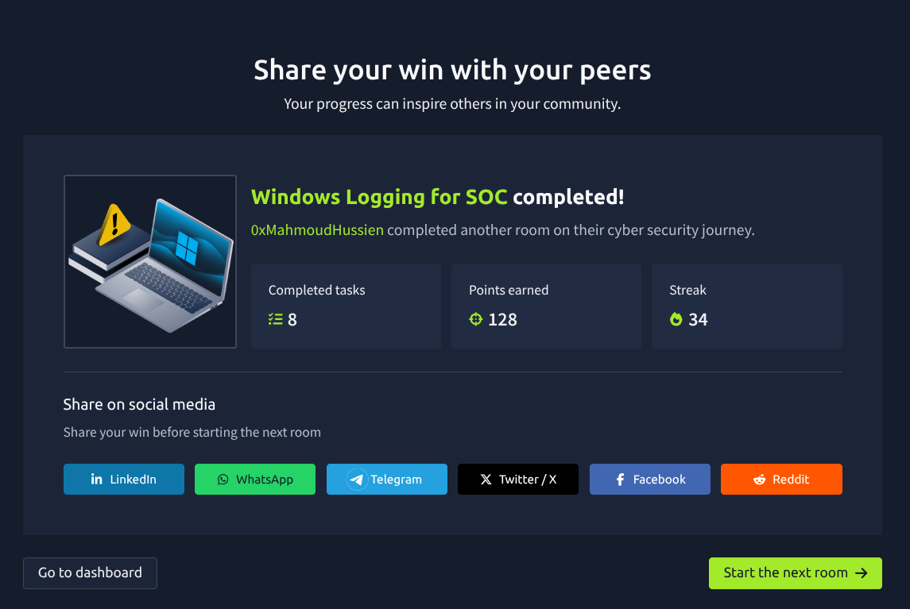
  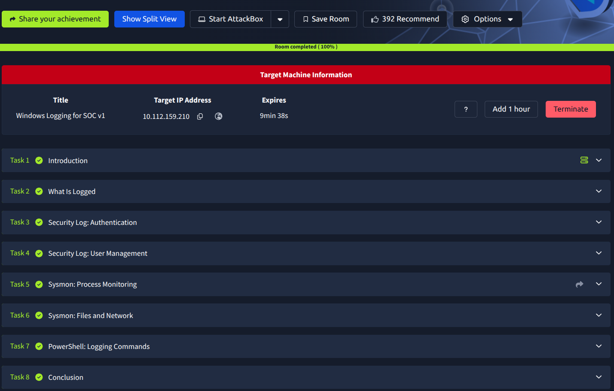

* **ما تم تعلمه (Learning Objectives):**
    * فهم كيفية الوصول إلى سجلات أحداث ويندوز (Windows Event Logs) الهامة وتفسيرها.
    * تعلم مراقبة مصادر السجلات القيمة مثل **Sysmon** و **PowerShell** لكشف الأنشطة المشبوهة.
    * التحضير لاستخدام هذه السجلات في أنظمة الـ **SIEM** والمختبرات المتقدمة في الـ SOC.
    * الممارسة العملية لمهارات تحليل السجلات على مجموعات بيانات حقيقية ومتعددة (Log Datasets).

---

#### 14. Windows Threat Detection 1

  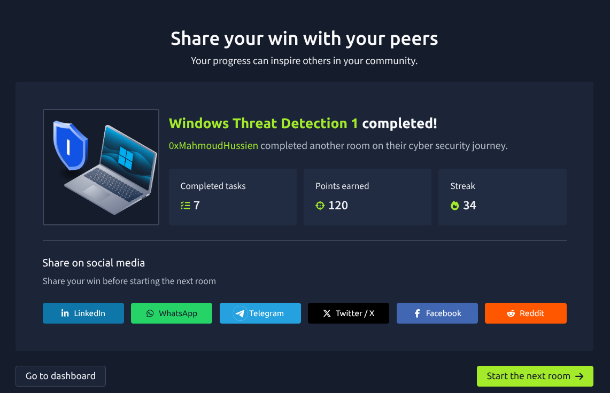
  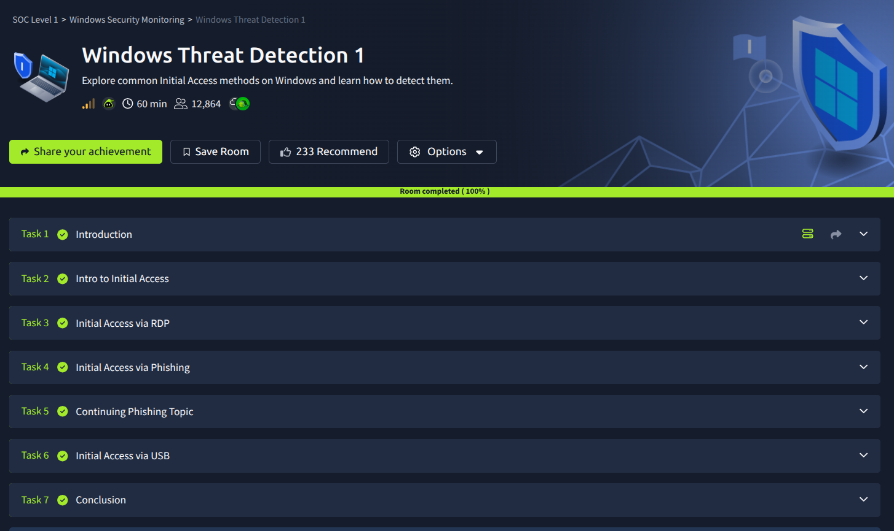

* **ما تم تعلمه (Learning Objectives):**
    * استكشاف الكيفية التي يتبعها المهاجمون للوصول إلى أجهزة ويندوز واختراقها.
    * تعلم تقنيات "الوصول الأولي" (**Initial Access**) الشائعة من خلال أمثلة واقعية.
    * التدريب العملي على اكتشاف كل تقنية اختراق باستخدام سجلات أحداث ويندوز (Windows Event Logs).

---

#### 15. Windows Threat Detection 2

  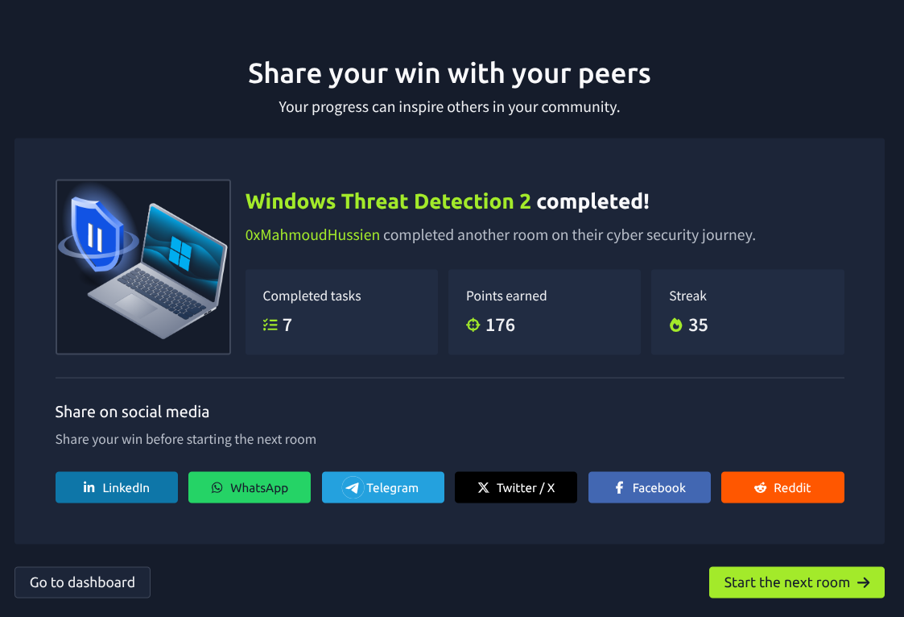
  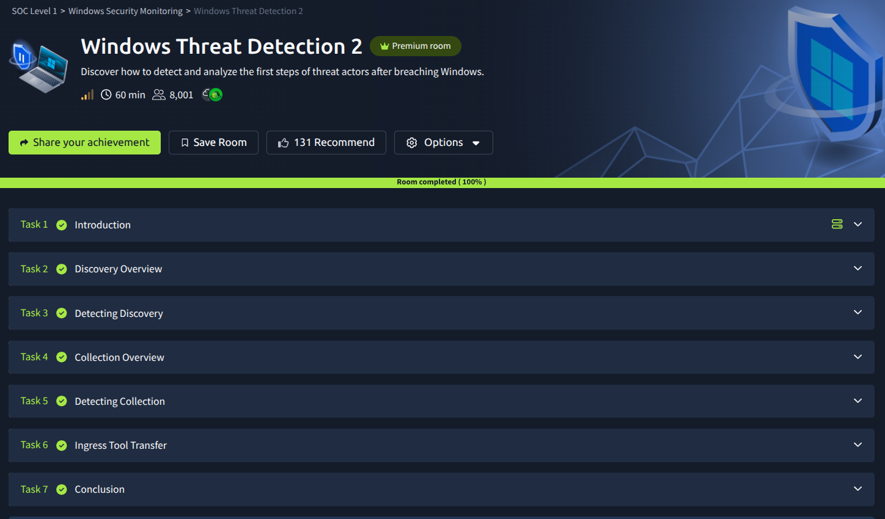

* **ما تم تعلمه (Learning Objectives):**
    * اكتشاف تقنيات الاستكشاف (Discovery) الشائعة باستخدام سجلات أحداث ويندوز.
    * تعلم كيفية تتبع أصل الهجوم من خلال إعادة بناء شجرة العمليات (**Process Tree Reconstruction**).
    * التعرف على البيانات التي يبحث عنها المهاجمون وكيفية تنفيذ عمليات تسريبها (Exfiltration).
    * فهم كيفية تسجيل الأوامر الخبيثة في السجلات من خلال تنفيذها عملياً ومراقبة النتائج.

---

#### 16. Windows Threat Detection 3

  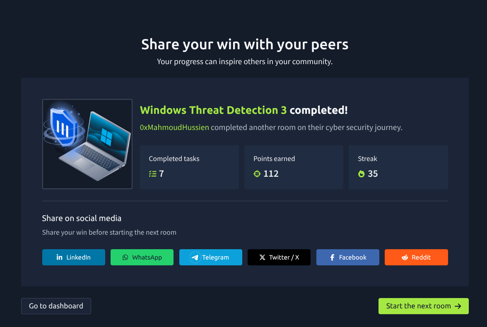
  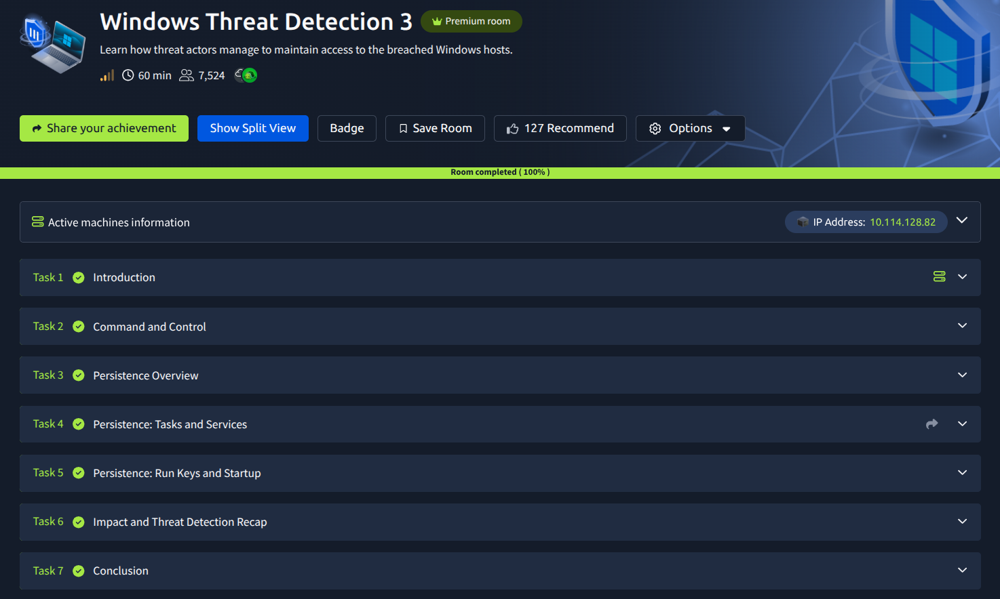

* **ما تم تعلمه (Learning Objectives):**
    * مراجعة وتعميق مفهوم أنظمة القيادة والسيطرة (**C2 - Command and Control**).
    * فهم أسباب وكيفية حفاظ المهاجمين على اتصالهم بالأجهزة المخترقة لفترات طويلة.
    * استخدام سجلات أحداث ويندوز لكشف طرق "البقاء" (**Persistence**) المختلفة التي يزرعها الهكرز.
    * تطبيق التقنيات المتعلمة في بيئة عملية (Hands-on) لمحاكاة سيناريوهات اختراق واقعية.

---

### 🏆 Special Achievement: Windows Defender

  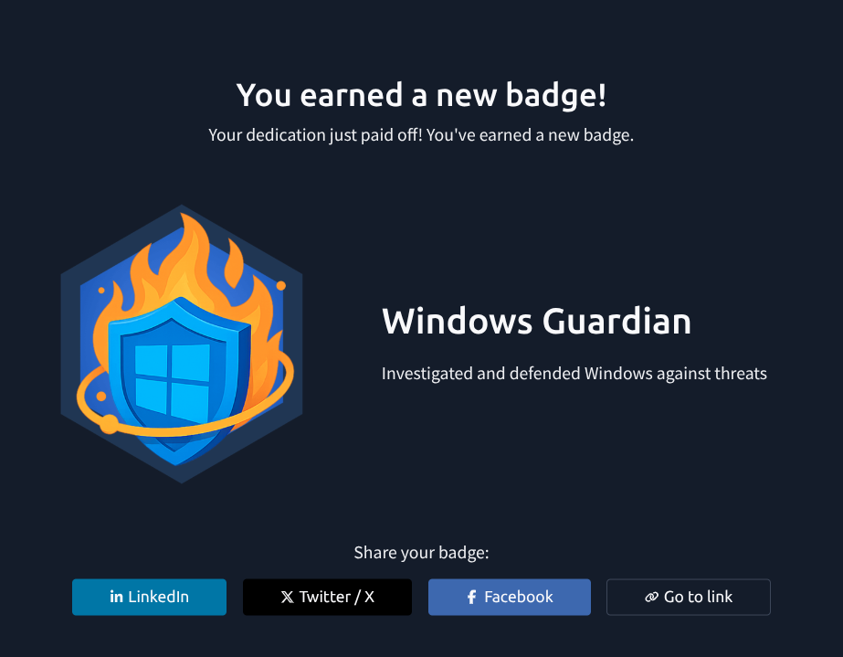

> **تم الحصول على هذه البادج بعد إتمام سلسلة غرف Windows Security Monitoring، وإتقان مهارات رصد وتحليل الهجمات المتقدمة داخل بيئة الويندوز.**

---

#### 17. Linux Logging for SOC

  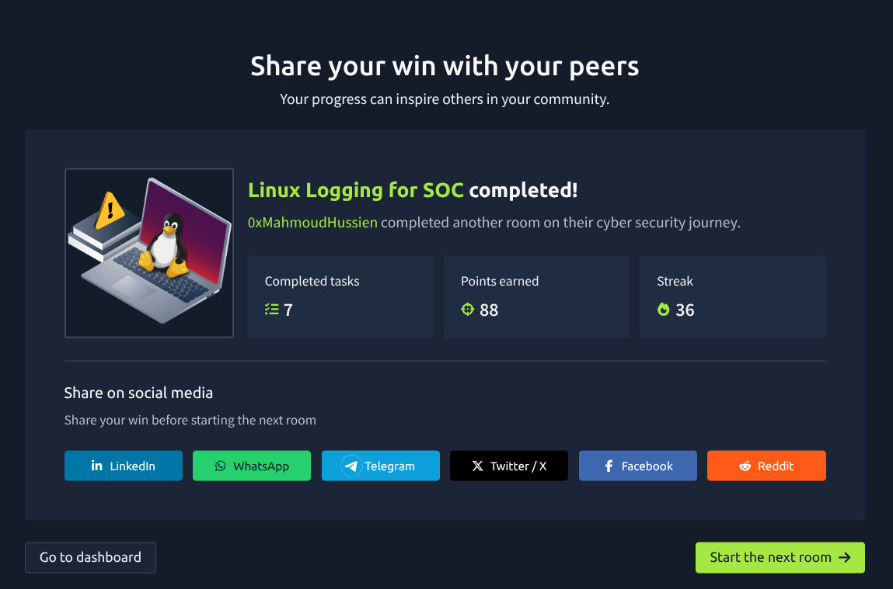
  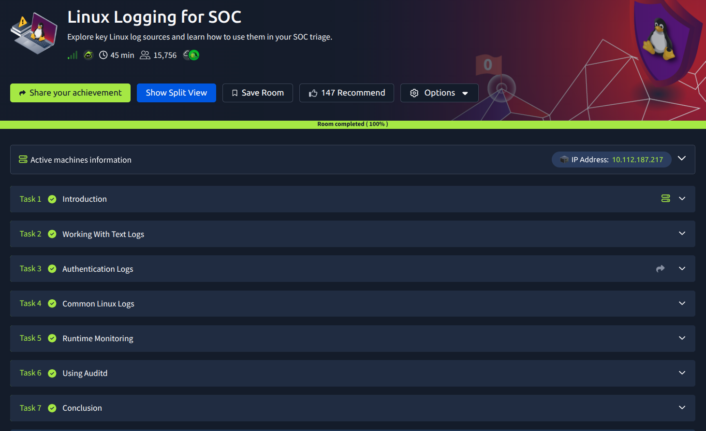

* **ما تم تعلمه (Learning Objectives):**
    * استكشاف أنواع السجلات المختلفة في نظام لينكس (Authentication, Runtime, System logs).
    * تعلم الأوامر الأساسية لتحليل السجلات وتجنب الأخطاء الشائعة أثناء التعامل معها.
    * فهم كيفية عمل أدوات مثل **auditd** في مراقبة وتسجيل الأحداث والأنشطة داخل النظام.
    * التطبيق العملي على تحليل جميع مصادر السجلات المتعلمة داخل بيئة افتراضية (VM).

---

#### 18. Linux Threat Detection 1

  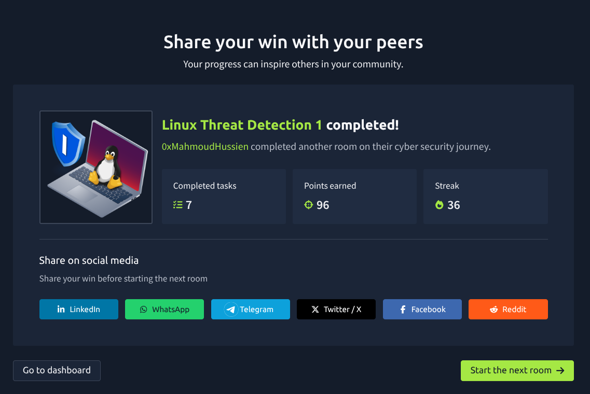
  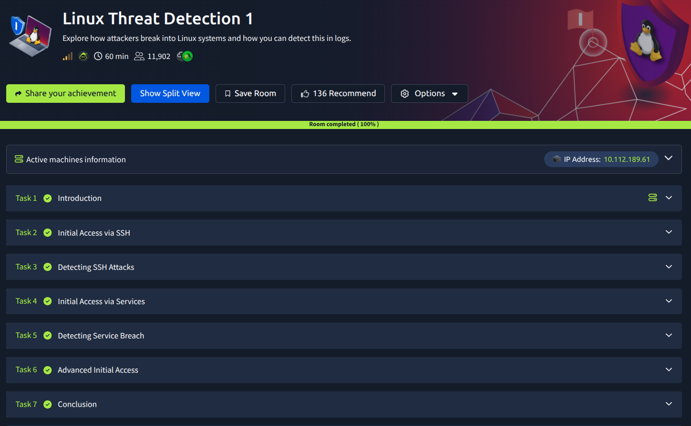

* **ما تم تعلمه (Learning Objectives):**
    * فهم دور بروتوكول **SSH** والمخاطر الأمنية المرتبطة به في بيئات لينكس.
    * تعلم كيف يمكن للخدمات المكشوفة على الإنترنت (Internet-exposed services) أن تؤدي إلى اختراقات أمنية.
    * استخدام تحليل شجرة العمليات (**Process Tree Analysis**) لتحديد المصدر الحقيقي للهجوم.
    * الممارسة العملية على اكتشاف تقنيات الوصول الأولي (Initial Access) في مختبرات محاكاة للواقع.

---

#### 19. Linux Threat Detection 2

  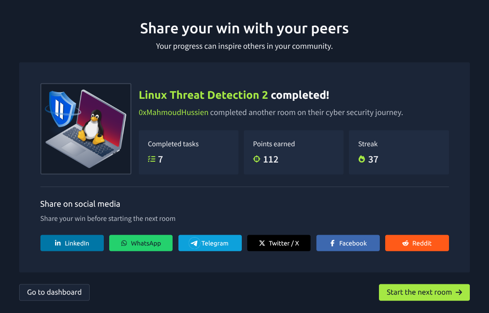
  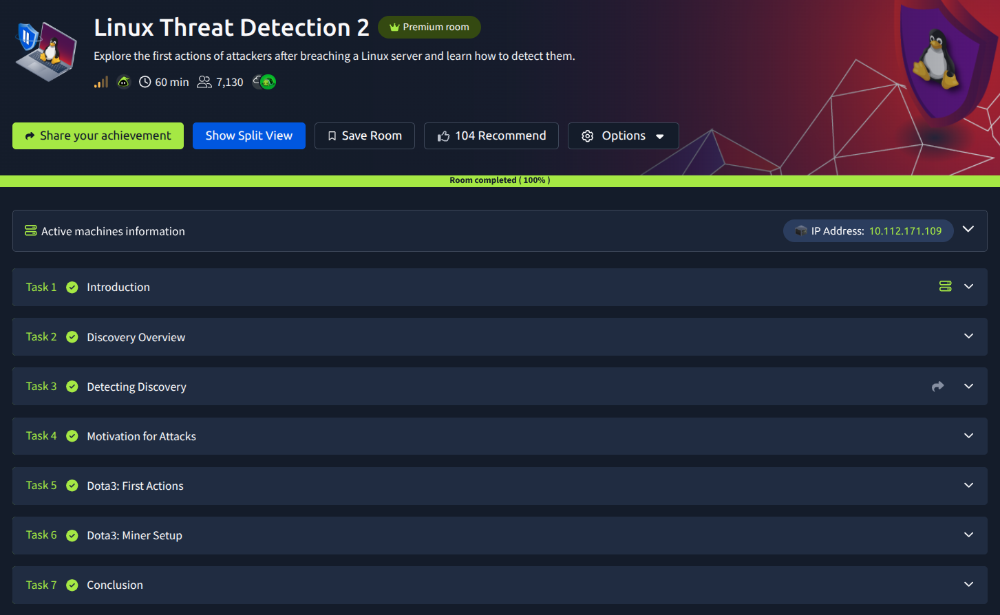

* **ما تم تعلمه (Learning Objectives):**
    * استكشاف كيفية تحديد أوامر الاستكشاف (**Discovery Commands**) داخل السجلات.
    * التعرف على التهديدات الشائعة التي تعرض سيرفرات لينكس للخطر.
    * فهم الطرق والأساليب التي يستخدمها المهاجمون لرفع البرمجيات الخبيثة (**Malware**) على الضحايا.
    * الممارسة العملية من خلال كشف وتحليل هجوم حقيقي لتعدين العملات الرقمية (**Cryptominer Attack**).

---

#### 20. Linux Threat Detection 3

  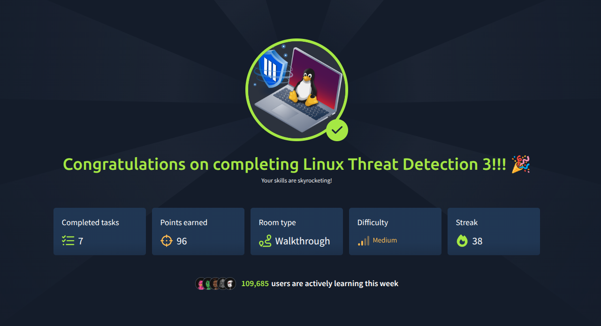
  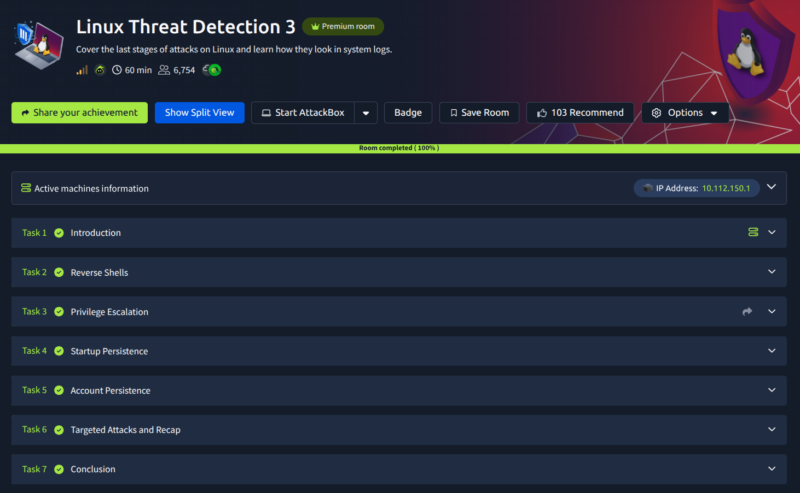

* **ما تم تعلمه (Learning Objectives):**
    * فهم كيفية استخدام الـ **Reverse Shells** في اختراقات أنظمة لينكس والسيطرة عليها.
    * دراسة الأساليب التي يتبعها المهاجمون لرفع صلاحياتهم (**Privilege Escalation**) للوصول لدرجة الـ Root.
    * استكشاف أكثر 5 تقنيات شائعة يستخدمها المهاجمون لضمان البقاء (**Persistence**) داخل نظام لينكس.
    * تحليل الآثار الرقمية التي تتركها هذه العمليات في سجلات النظام لضمان سرعة الكشف عنها.

---

### 🏆 Special Achievement: Linux Defender

  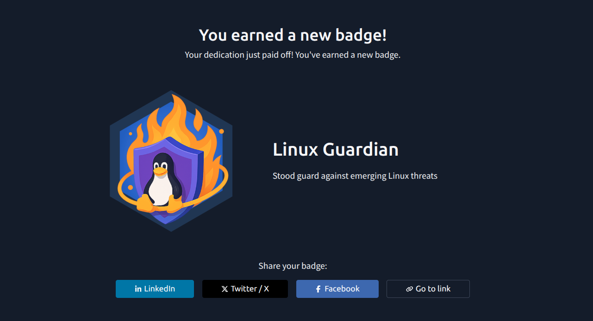

> **تم الحصول على هذه البادج بعد إتمام سلسلة غرف Linux Security Monitoring، وإثبات القدرة على رصد التهديدات المتقدمة، وتحليل الـ Reverse Shells، وكشف محاولات رفع الصلاحيات داخل بيئات اللينكس.**

---

#### 21. Malware Classification

  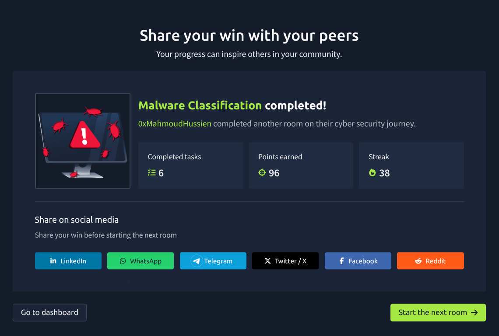
  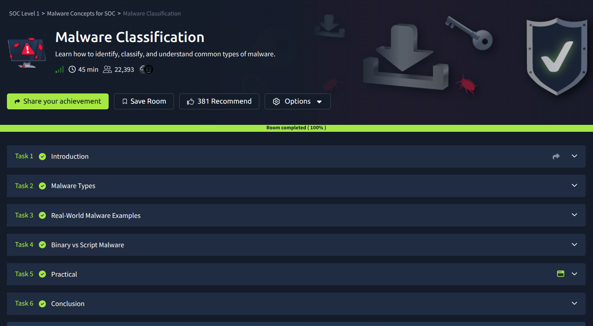

* **ما تم تعلمه (Learning Objectives):**
    * تعلم تصنيف أنواع البرمجيات الخبيثة الشائعة بناءً على سلوكها والغرض منها.
    * فهم كيفية عمل البرمجيات الخبيثة (Malware) في السيناريوهات الواقعية.
    * تحديد الفروقات الجوهرية بين البرمجيات الخبيثة التنفيذية (Executable) والقائمة على السكريبتات (Script-based).
    * الممارسة العملية على تصنيف وتحليل أنواع مختلفة من الملفات الضارة.

---

#### 22. Intro to Malware Analysis

  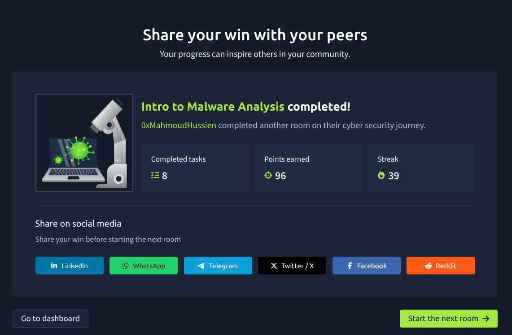
  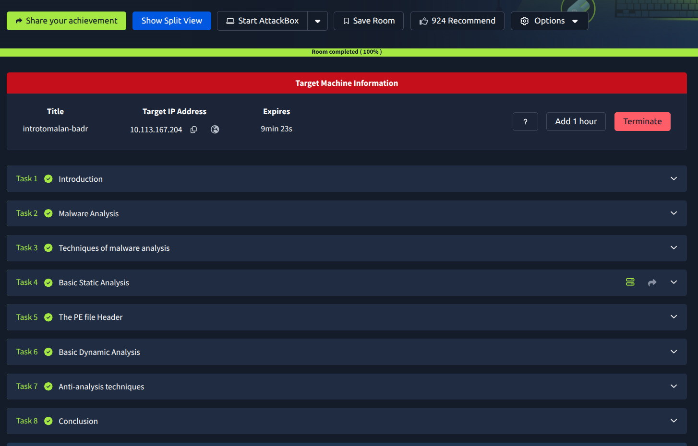

* **ما تم تعلمه (Learning Objectives):**
    * فهم ماهية البرمجيات الخبيثة وتكوينها التقني بشكل عميق.
    * استخدام الأدوات والمصادر الشائعة المساعدة في عمليات التحقيق الجنائي الرقمي.
    * إجراء التحليل الأساسي الثابت (**Static Analysis**) والديناميكي (**Dynamic Analysis**) للملفات المشبوهة.
    * تعلم كيفية إعداد بيئة آمنة ومعزولة (**Sandbox**) لتحليل البرمجيات الخبيثة دون تهديد النظام الأساسي.

---

#### 23. Living Off the Land Attacks

  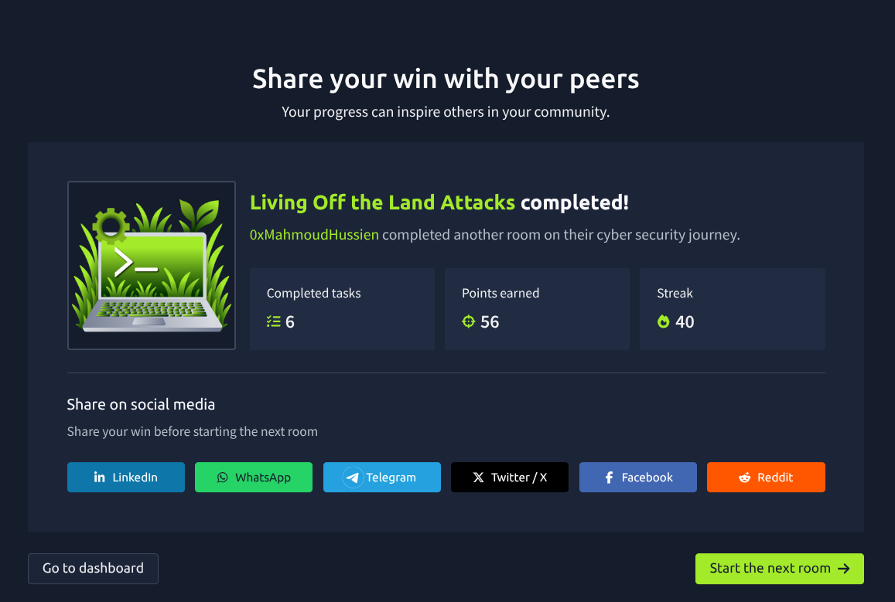
  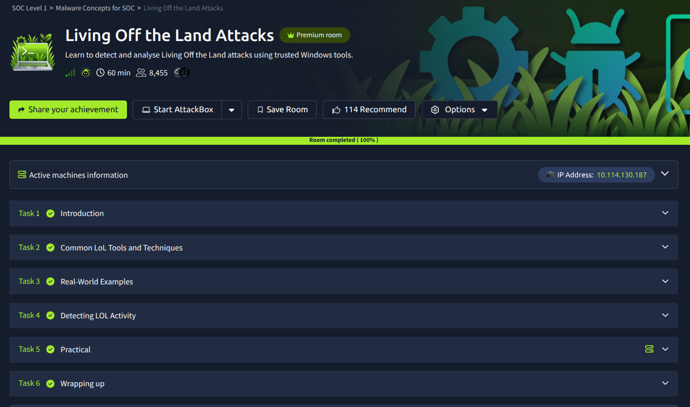

* **ما تم تعلمه (Learning Objectives):**
    * فهم ماهية هجمات الـ **Living Off the Land (LotL)** وكيفية استغلال الأدوات الشرعية للنظام.
    * تحديد أدوات ويندوز الموثوقة (مثل PowerShell, Certutil, WMIC) التي يمكن للمهاجمين إساءة استخدامها.
    * التعرف على تقنيات المهاجمين التي تندمج مع العمليات الطبيعية للنظام لتجنب الكشف.
    * تعلم كيفية رصد سلوك الـ LoL باستخدام تحليل السجلات (Log Analysis) وتنبيهات الـ **SIEM**.
