# 🛡️ Mahmoud Hussein | SOC Analyst Portfolio
### My Cyber Security Journey 🚀

Welcome to my cybersecurity repository. This project documents my technical progress, hands-on labs, and real-world investigations in the field of Security Operations and Threat Hunting.

---

## 🔧 Tools & Technologies

* **SIEM/SOAR:** Splunk, ELK Stack (Kibana), Tines.
* **Network Analysis:** Wireshark, TShark, Zeek (Bro), Snort, NetworkMiner.
* **Endpoint & Forensics:** FlareVM, EDR Solutions, Volatility 3, Autopsy, Sysmon.
* **Frameworks:** MITRE ATT&CK, Unified Kill Chain, Pyramid of Pain.
* **OS:** Ubuntu Linux (Primary), Windows.

---

## 🧪 Hands-on Labs & Technical Writeups
Click on any of the sections below to view detailed writeups:

* [🌐 **Network Analysis & IDS** (Wireshark, Snort, Zeek, NetworkMiner)](./labs/network/network_security.md)
* [🛡️ **Cyber Frameworks** (MITRE ATT&CK, Pyramid of Pain, UKC)](./labs/frameworks/cyber_frameworks.md)
* [📊 **SIEM & SOAR Operations** (Splunk, ELK, SOAR)](./labs/siem-soar/siem_mastery.md)
* [🖥️ **Endpoint Security & EDR** (FlareVM, EDR Intro)](./labs/endpoint-security/malware_analysis.md)
* [📧 **Email Security & Phishing Analysis** (PhishTool, SPF/DKIM/DMARC)](./labs/email-security/phishing_analysis.md)
* [🐝 **Web Application Security** (OWASP Top 10)](./labs/web-security/web_vulnerabilities.md)
* [🐧 **Linux Fundamentals Walkthrough**](./labs/os-security/linux_fundamentals.md)

---

#### 9. Web Security Essentials

  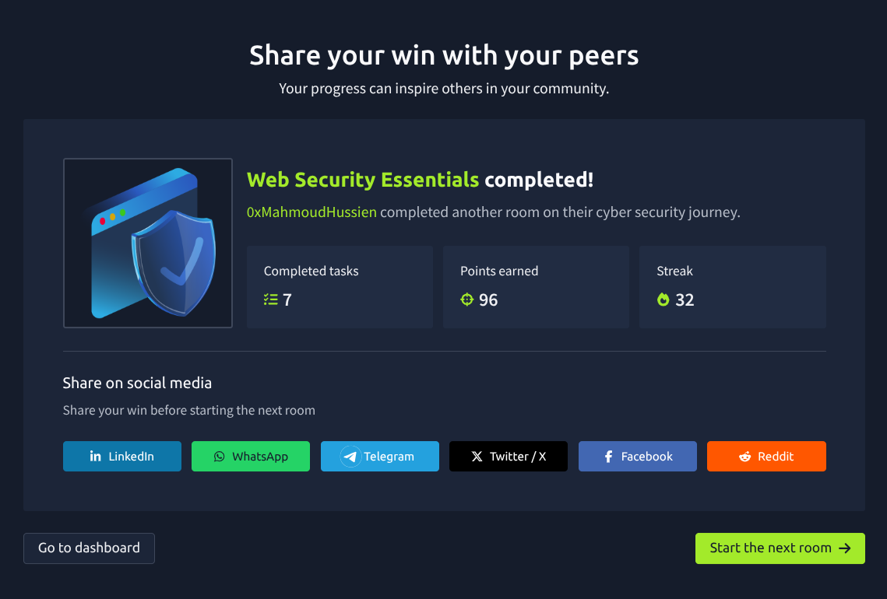
  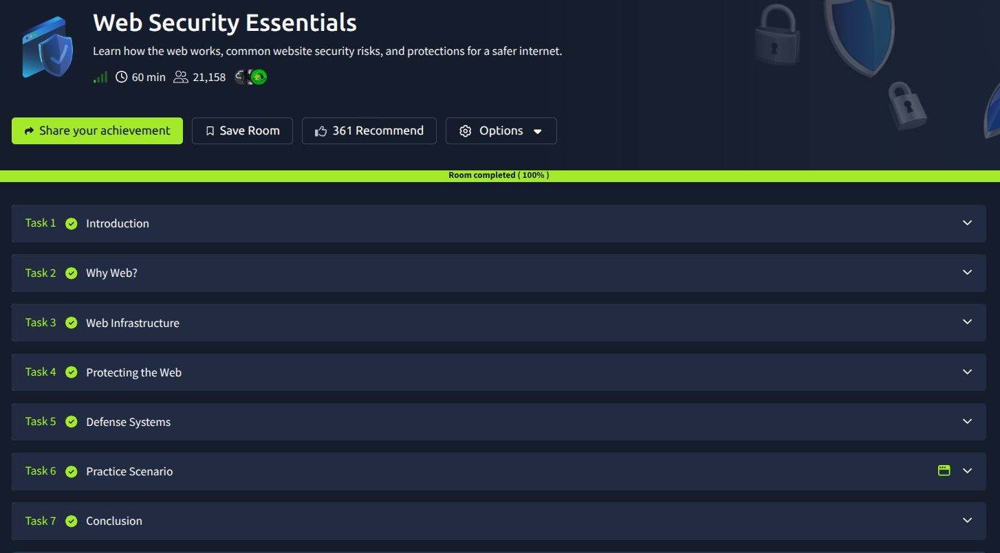

* **ما تم تعلمه (Learning Objectives):**
    * فهم التحول من تطبيقات سطح المكتب إلى تطبيقات الويب (Web Applications) وأثره الأمني.
    * تحليل الأسباب التي تجعل تطبيقات الويب هدفاً شائعاً ومفضلاً للمهاجمين.
    * استكشاف البنية التحتية للويب (Web Infrastructure) والأدوات المستخدمة لتأمينها.
    * التدريب العملي على تطبيق التدابير الأمنية لتقوية وتأمين تطبيقات الويب الجديدة (Hardening).

---

#### 10. Detecting Web Attacks

  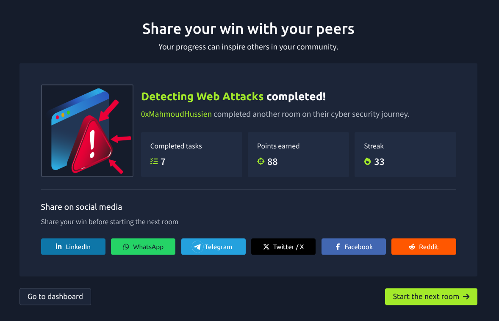
  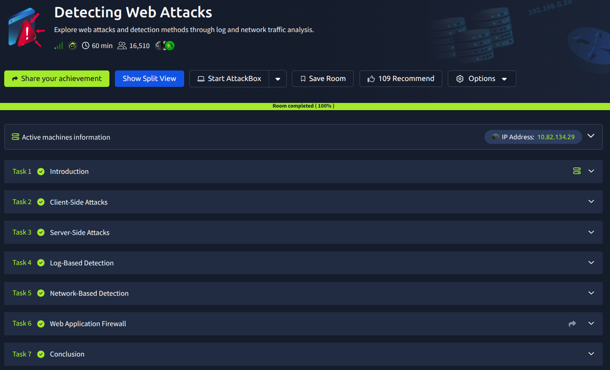

* **ما تم تعلمه (Learning Objectives):**
    * التعرف على أنواع هجمات الويب الشائعة التي تستهدف المستخدم (Client-side) والسيرفر (Server-side).
    * فهم مميزات وعيوب طرق الاكتشاف القائمة على تحليل السجلات (Log-based Detection).
    * استكشاف أساليب رصد الهجمات من خلال تحليل حركة مرور الشبكة (Network Traffic Analysis).
    * دراسة دور وأهمية جدران حماية تطبيقات الويب (WAF) في صد الهجمات.
    * الممارسة العملية على كشف وتحديد هجمات الويب الحقيقية باستخدام الأدوات والأساليب المذكورة.

---

#### 11. Detecting Web Shells

  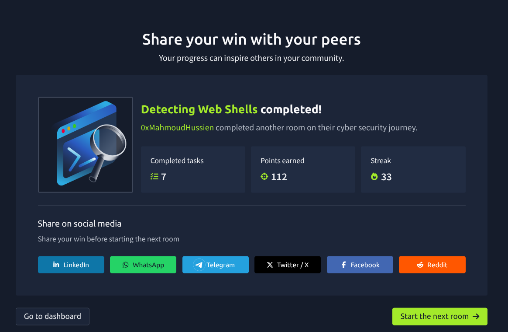
  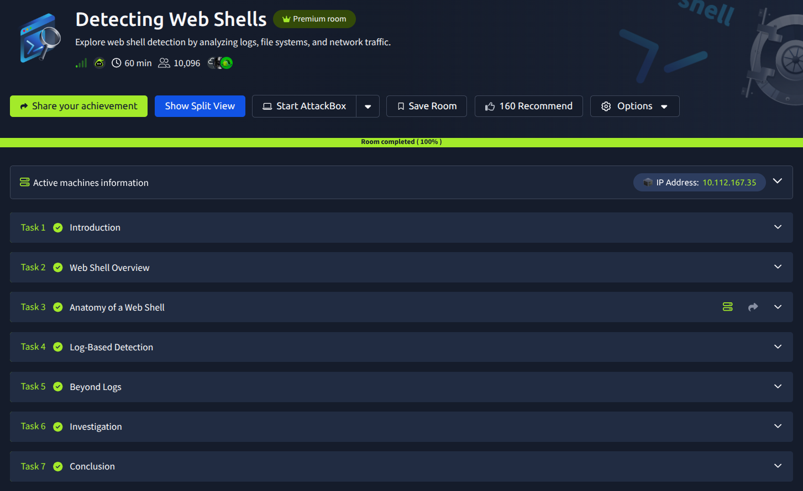

* **ما تم تعلمه (Learning Objectives):**
    * فهم ماهية الـ **Web Shells** وكيفية استخدام المهاجمين لها للسيطرة على السيرفرات عن بعد.
    * تعلم تقنيات اكتشاف نشاط الـ Web Shell من خلال تحليل السجلات (Logs)، ونظام الملفات (File System)، والشبكة.
    * التعرف على الأدوات والأساليب الشائعة المستخدمة في رصد وكشف الـ Web Shells بمختلف أنواعها.

---

#### 12. Detecting Web DDoS

  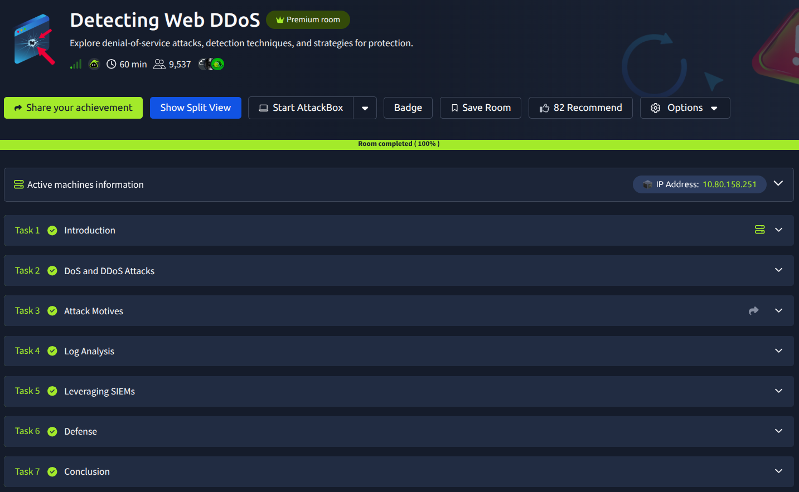

* **ما تم تعلمه (Learning Objectives):**
    * فهم كيفية عمل هجمات حجب الخدمة (DoS) وآليات تعطيلها للأنظمة.
    * استيعاب دوافع المهاجمين من القيام بهذه الهجمات التخريبية.
    * كشف علامات الـ **Web DoS** والـ **DDoS** من خلال تحليل سجلات الويب (Web Logs).
    * التدريب العملي على تحليل هجمات حجب الخدمة باستخدام تحليل السجلات (Log Analysis).
    * استكشاف تقنيات الكشف والحد من المخاطر (Detection & Mitigation) التي يستخدمها المدافعون.

---

### 🏆 Special Achievement: Web Defender

  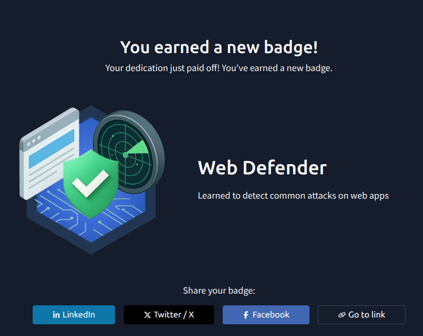

> **تم الحصول على هذه البادج بعد إتمام سلسلة غرف تأمين واكتشاف هجمات الويب بنجاح.**

---

#### 13. Windows Logging for SOC

  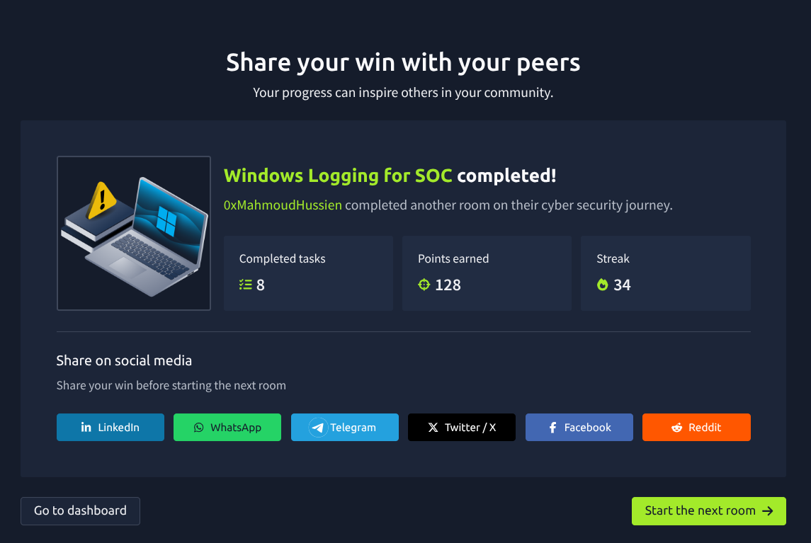
  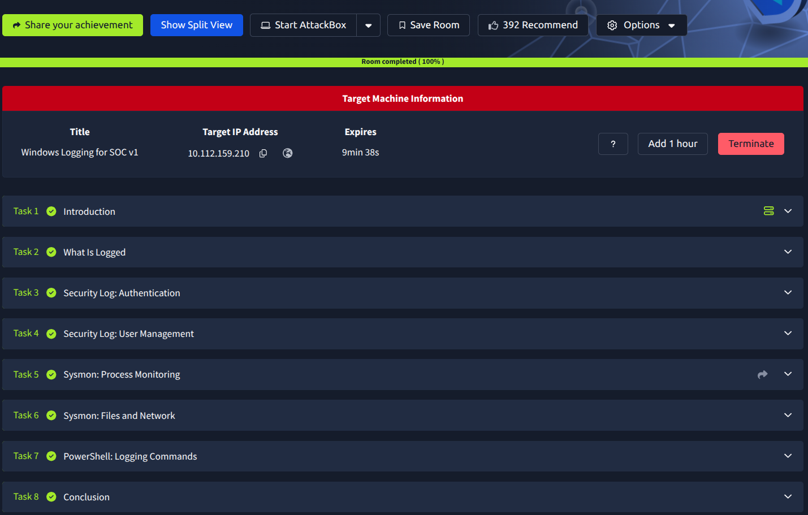

* **ما تم تعلمه (Learning Objectives):**
    * فهم كيفية الوصول إلى سجلات أحداث ويندوز (Windows Event Logs) الهامة وتفسيرها.
    * تعلم مراقبة مصادر السجلات القيمة مثل **Sysmon** و **PowerShell** لكشف الأنشطة المشبوهة.
    * التحضير لاستخدام هذه السجلات في أنظمة الـ **SIEM** والمختبرات المتقدمة في الـ SOC.
    * الممارسة العملية لمهارات تحليل السجلات على مجموعات بيانات حقيقية ومتعددة (Log Datasets).

---

#### 14. Windows Threat Detection 1

  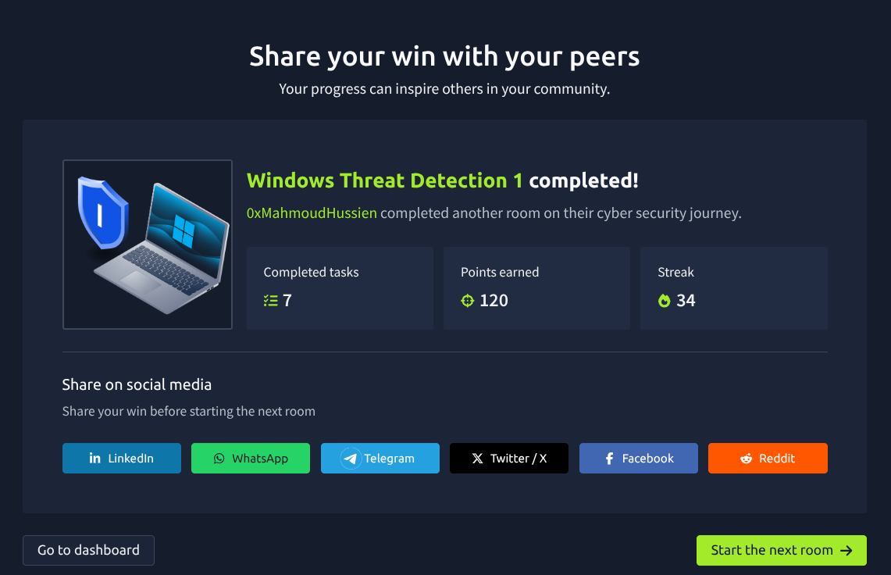
  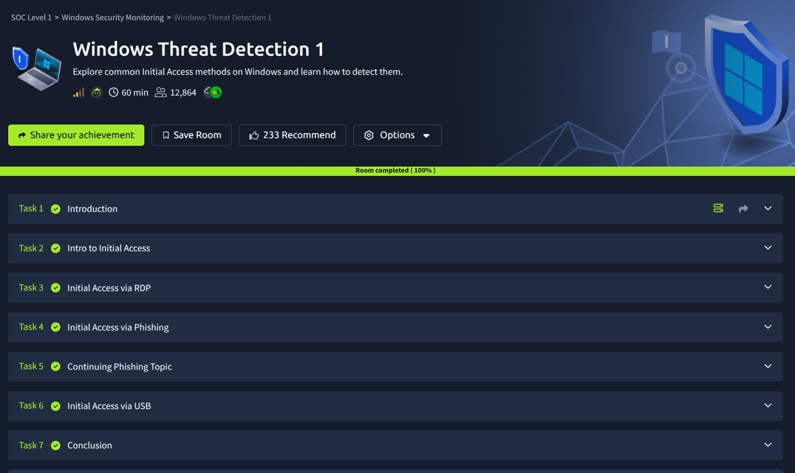

* **ما تم تعلمه (Learning Objectives):**
    * استكشاف الكيفية التي يتبعها المهاجمون للوصول إلى أجهزة ويندوز واختراقها.
    * تعلم تقنيات "الوصول الأولي" (**Initial Access**) الشائعة من خلال أمثلة واقعية.
    * التدريب العملي على اكتشاف كل تقنية اختراق باستخدام سجلات أحداث ويندوز (Windows Event Logs).

---

#### 15. Windows Threat Detection 2

  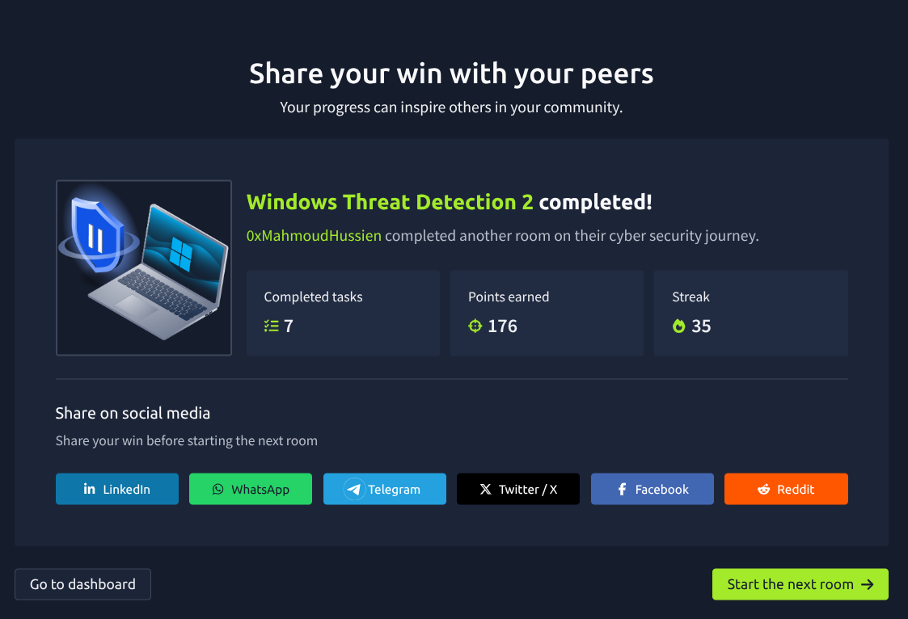
  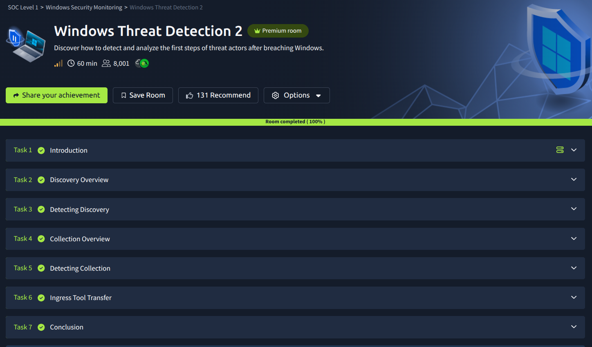

* **ما تم تعلمه (Learning Objectives):**
    * اكتشاف تقنيات الاستكشاف (Discovery) الشائعة باستخدام سجلات أحداث ويندوز.
    * تعلم كيفية تتبع أصل الهجوم من خلال إعادة بناء شجرة العمليات (**Process Tree Reconstruction**).
    * التعرف على البيانات التي يبحث عنها المهاجمون وكيفية تنفيذ عمليات تسريبها (Exfiltration).
    * فهم كيفية تسجيل الأوامر الخبيثة في السجلات من خلال تنفيذها عملياً ومراقبة النتائج.

---

#### 16. Windows Threat Detection 3

  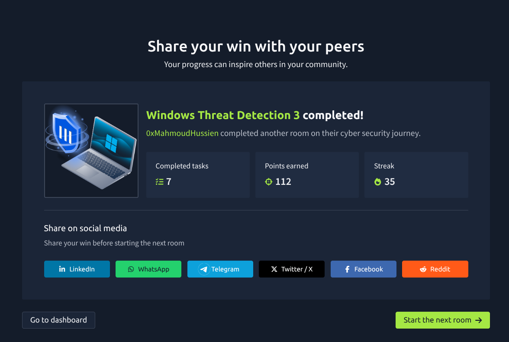
  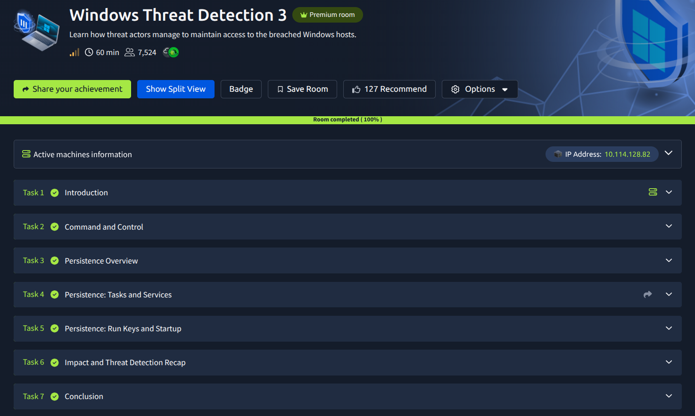

* **ما تم تعلمه (Learning Objectives):**
    * مراجعة وتعميق مفهوم أنظمة القيادة والسيطرة (**C2 - Command and Control**).
    * فهم أسباب وكيفية حفاظ المهاجمين على اتصالهم بالأجهزة المخترقة لفترات طويلة.
    * استخدام سجلات أحداث ويندوز لكشف طرق "البقاء" (**Persistence**) المختلفة التي يزرعها الهكرز.
    * تطبيق التقنيات المتعلمة في بيئة عملية (Hands-on) لمحاكاة سيناريوهات اختراق واقعية.

---

### 🏆 Special Achievement: Windows Defender

  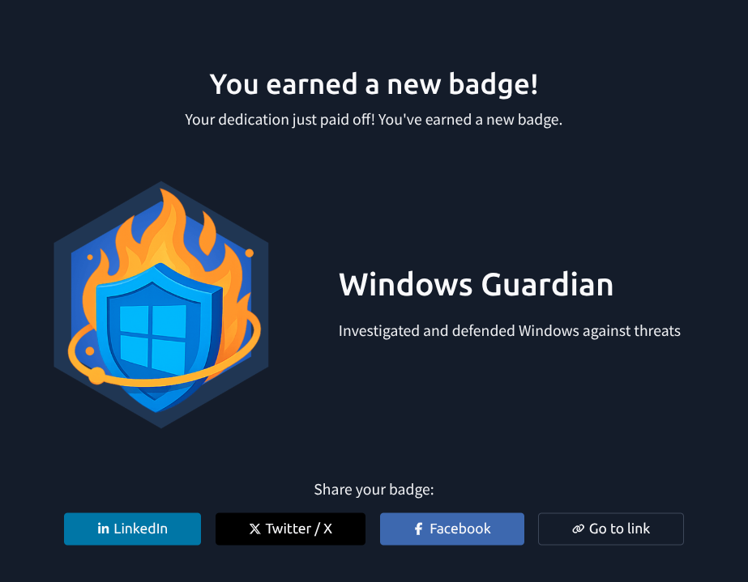

> **تم الحصول على هذه البادج بعد إتمام سلسلة غرف Windows Security Monitoring، وإتقان مهارات رصد وتحليل الهجمات المتقدمة داخل بيئة الويندوز.**

---

#### 17. Linux Logging for SOC

  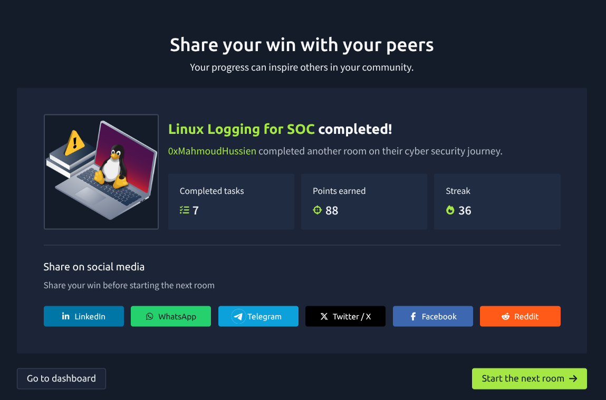
  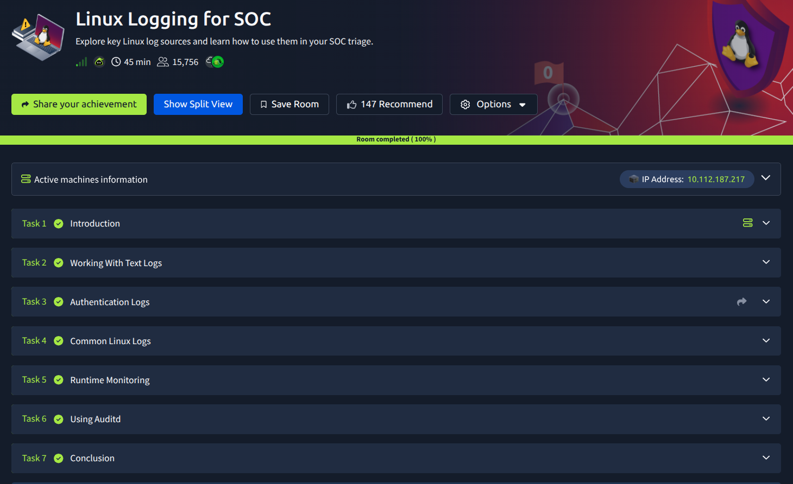

* **ما تم تعلمه (Learning Objectives):**
    * استكشاف أنواع السجلات المختلفة في نظام لينكس (Authentication, Runtime, System logs).
    * تعلم الأوامر الأساسية لتحليل السجلات وتجنب الأخطاء الشائعة أثناء التعامل معها.
    * فهم كيفية عمل أدوات مثل **auditd** في مراقبة وتسجيل الأحداث والأنشطة داخل النظام.
    * التطبيق العملي على تحليل جميع مصادر السجلات المتعلمة داخل بيئة افتراضية (VM).

---

#### 18. Linux Threat Detection 1

  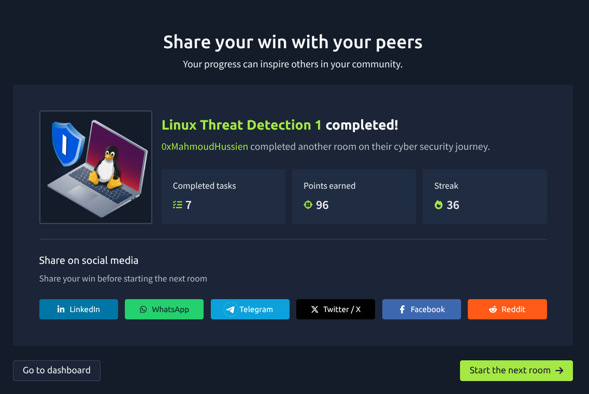
  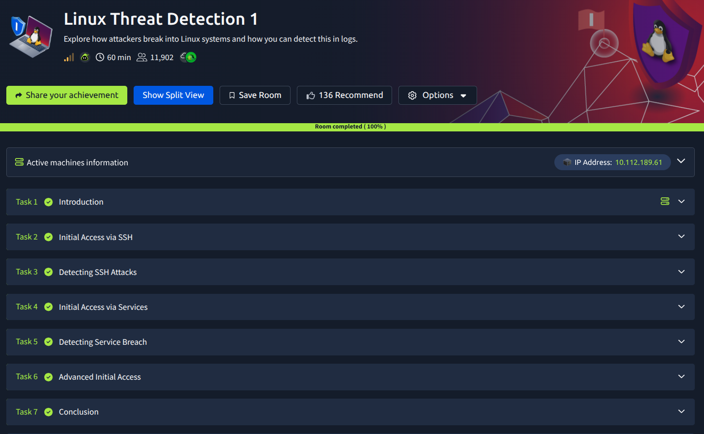

* **ما تم تعلمه (Learning Objectives):**
    * فهم دور بروتوكول **SSH** والمخاطر الأمنية المرتبطة به في بيئات لينكس.
    * تعلم كيف يمكن للخدمات المكشوفة على الإنترنت (Internet-exposed services) أن تؤدي إلى اختراقات أمنية.
    * استخدام تحليل شجرة العمليات (**Process Tree Analysis**) لتحديد المصدر الحقيقي للهجوم.
    * الممارسة العملية على اكتشاف تقنيات الوصول الأولي (Initial Access) في مختبرات محاكاة للواقع.

---

#### 19. Linux Threat Detection 2

  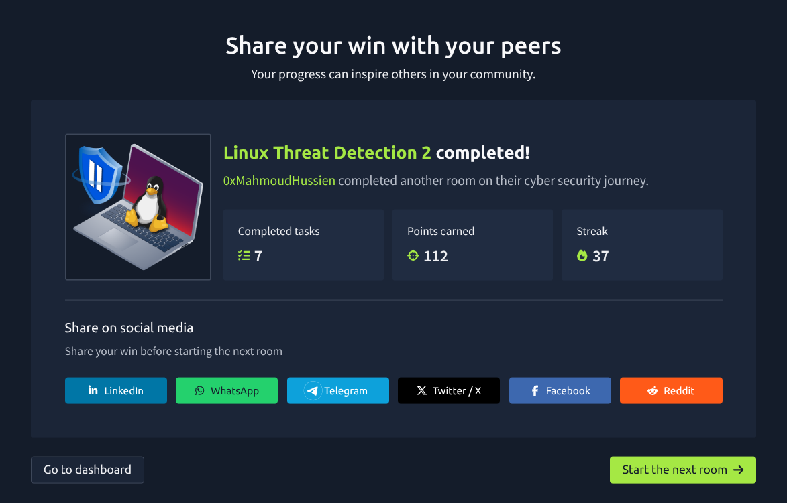
  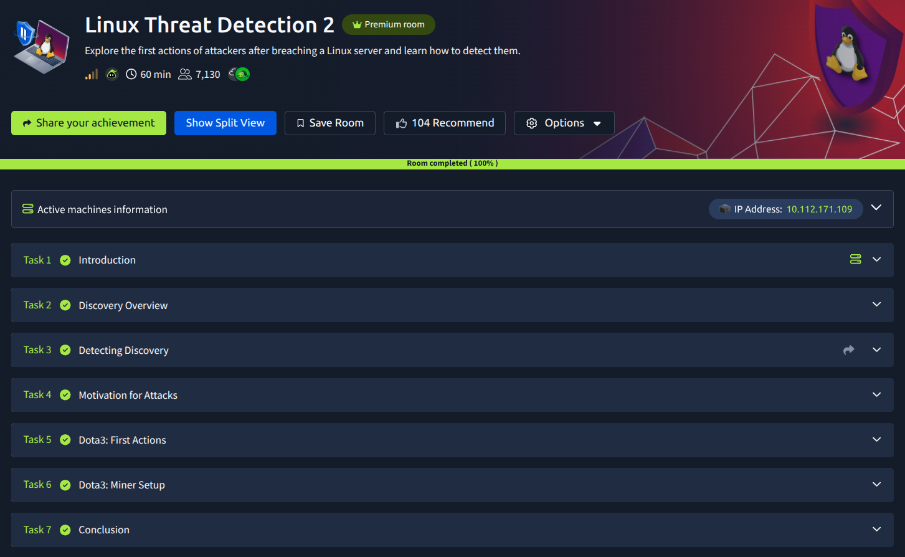

* **ما تم تعلمه (Learning Objectives):**
    * استكشاف كيفية تحديد أوامر الاستكشاف (**Discovery Commands**) داخل السجلات.
    * التعرف على التهديدات الشائعة التي تعرض سيرفرات لينكس للخطر.
    * فهم الطرق والأساليب التي يستخدمها المهاجمون لرفع البرمجيات الخبيثة (**Malware**) على الضحايا.
    * الممارسة العملية من خلال كشف وتحليل هجوم حقيقي لتعدين العملات الرقمية (**Cryptominer Attack**).

---

#### 20. Linux Threat Detection 3

  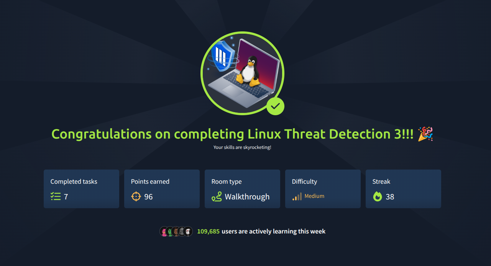
  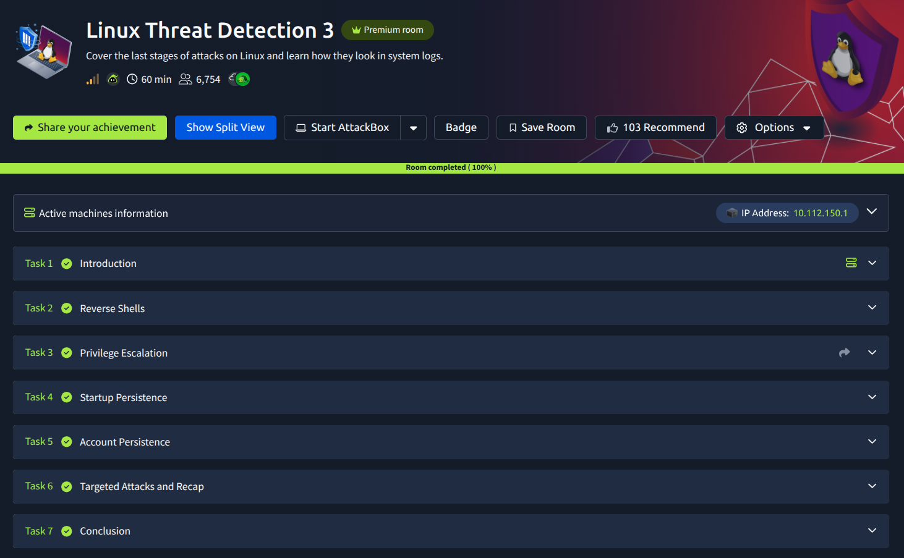

* **ما تم تعلمه (Learning Objectives):**
    * فهم كيفية استخدام الـ **Reverse Shells** في اختراقات أنظمة لينكس والسيطرة عليها.
    * دراسة الأساليب التي يتبعها المهاجمون لرفع صلاحياتهم (**Privilege Escalation**) للوصول لدرجة الـ Root.
    * استكشاف أكثر 5 تقنيات شائعة يستخدمها المهاجمون لضمان البقاء (**Persistence**) داخل نظام لينكس.
    * تحليل الآثار الرقمية التي تتركها هذه العمليات في سجلات النظام لضمان سرعة الكشف عنها.

---

### 🏆 Special Achievement: Linux Defender

  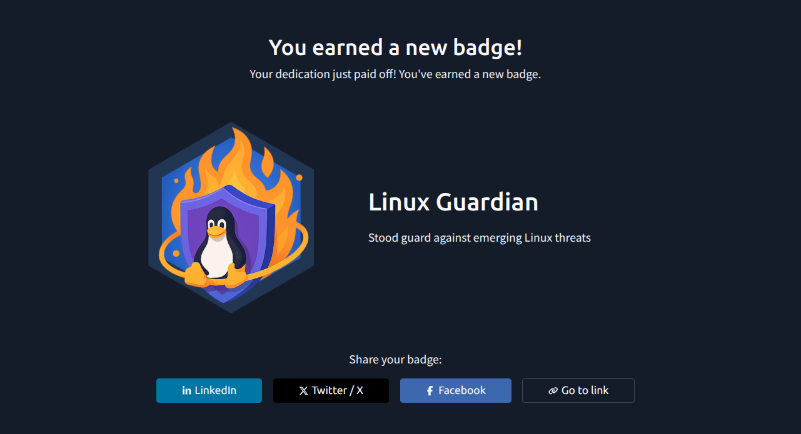

> **تم الحصول على هذه البادج بعد إتمام سلسلة غرف Linux Security Monitoring، وإثبات القدرة على رصد التهديدات المتقدمة، وتحليل الـ Reverse Shells، وكشف محاولات رفع الصلاحيات داخل بيئات اللينكس.**

---

#### 21. Malware Classification

  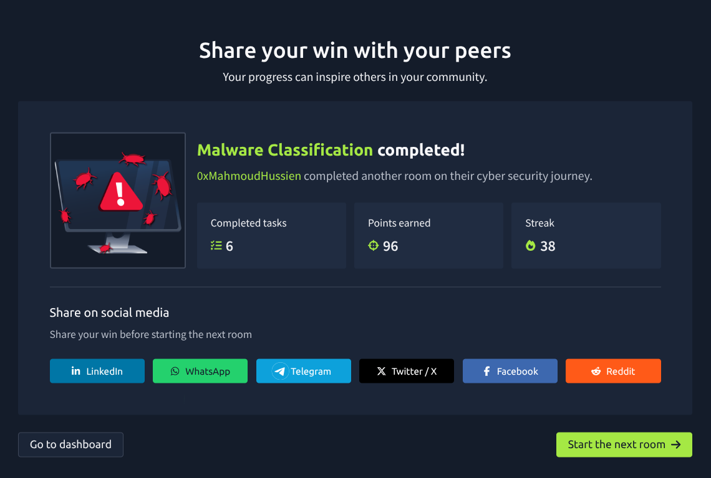
  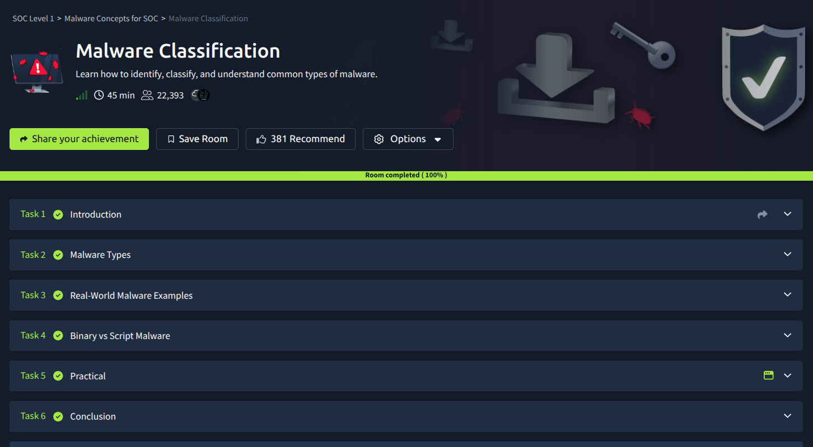

* **ما تم تعلمه (Learning Objectives):**
    * تعلم تصنيف أنواع البرمجيات الخبيثة الشائعة بناءً على سلوكها والغرض منها.
    * فهم كيفية عمل البرمجيات الخبيثة (Malware) في السيناريوهات الواقعية.
    * تحديد الفروقات الجوهرية بين البرمجيات الخبيثة التنفيذية (Executable) والقائمة على السكريبتات (Script-based).
    * الممارسة العملية على تصنيف وتحليل أنواع مختلفة من الملفات الضارة.

---

#### 22. Intro to Malware Analysis

  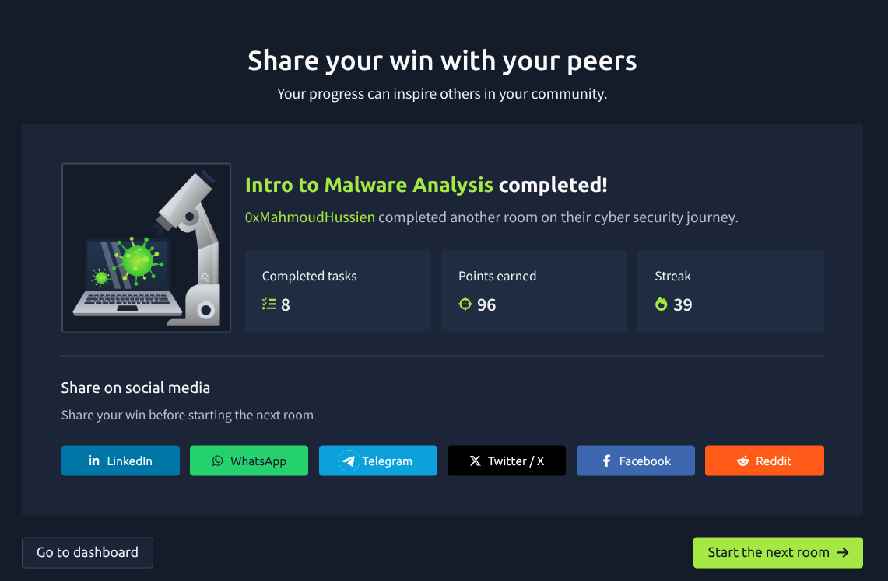
  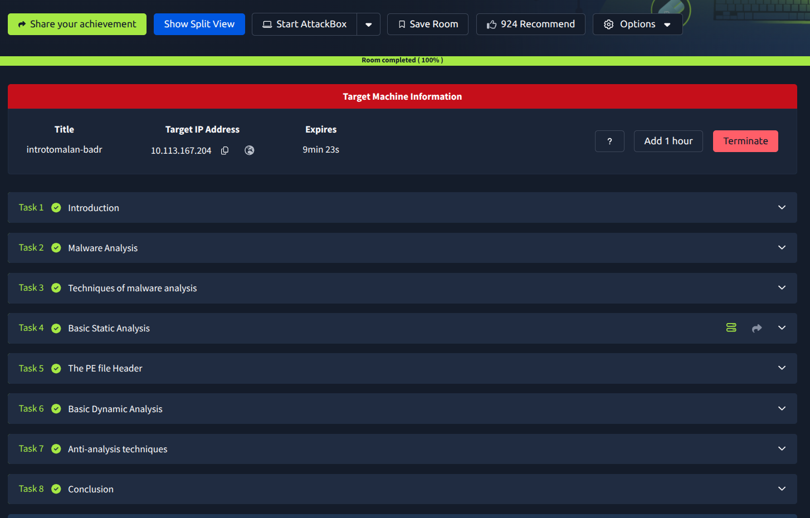

* **ما تم تعلمه (Learning Objectives):**
    * فهم ماهية البرمجيات الخبيثة وتكوينها التقني بشكل عميق.
    * استخدام الأدوات والمصادر الشائعة المساعدة في عمليات التحقيق الجنائي الرقمي.
    * إجراء التحليل الأساسي الثابت (**Static Analysis**) والديناميكي (**Dynamic Analysis**) للملفات المشبوهة.
    * تعلم كيفية إعداد بيئة آمنة ومعزولة (**Sandbox**) لتحليل البرمجيات الخبيثة دون تهديد النظام الأساسي.

---

#### 23. Living Off the Land Attacks

  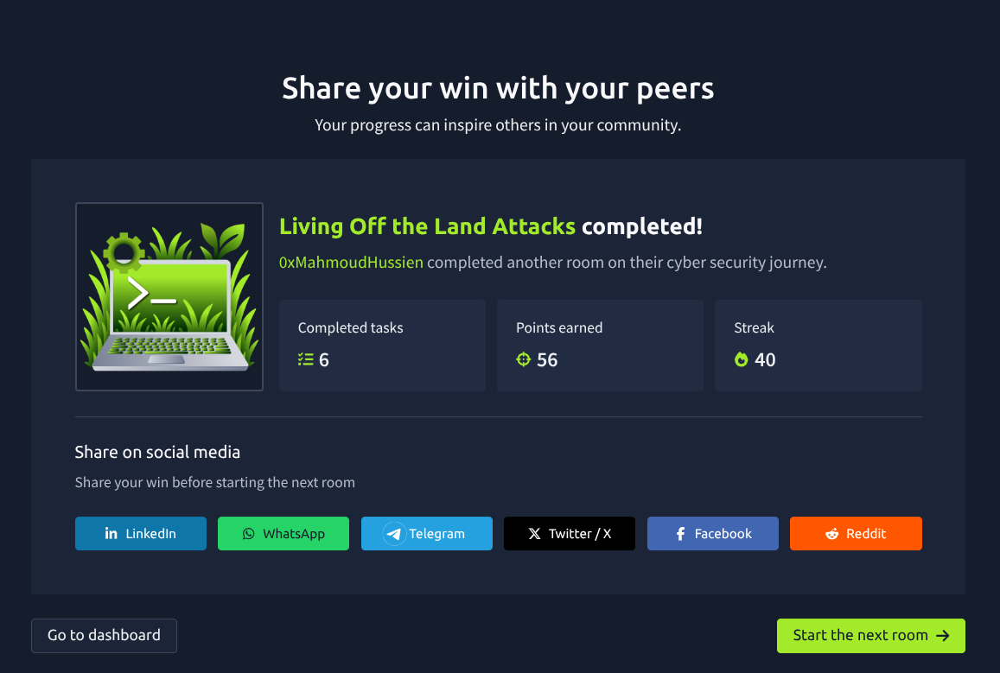
  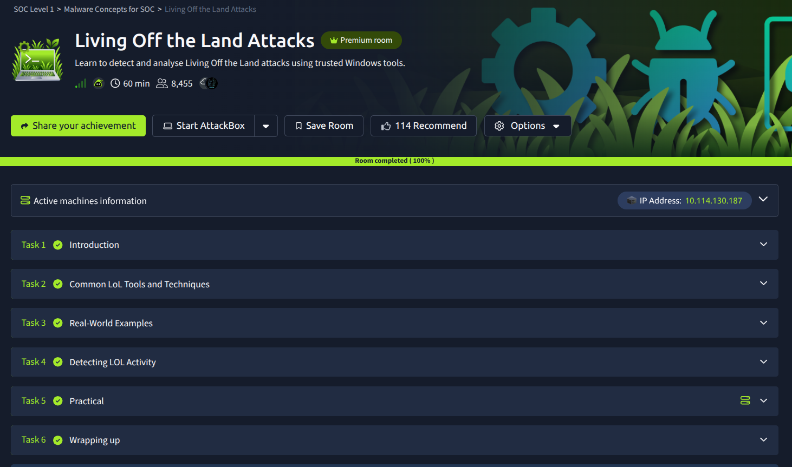

* **ما تم تعلمه (Learning Objectives):**
    * فهم ماهية هجمات الـ **Living Off the Land (LotL)** وكيفية استغلال الأدوات الشرعية للنظام.
    * تحديد أدوات ويندوز الموثوقة (مثل PowerShell, Certutil, WMIC) التي يمكن للمهاجمين إساءة استخدامها.
    * التعرف على تقنيات المهاجمين التي تندمج مع العمليات الطبيعية للنظام لتجنب الكشف.
    * تعلم كيفية رصد سلوك الـ LoL باستخدام تحليل السجلات (Log Analysis) وتنبيهات الـ **SIEM**.

---

#### 24. Shadow Trace

  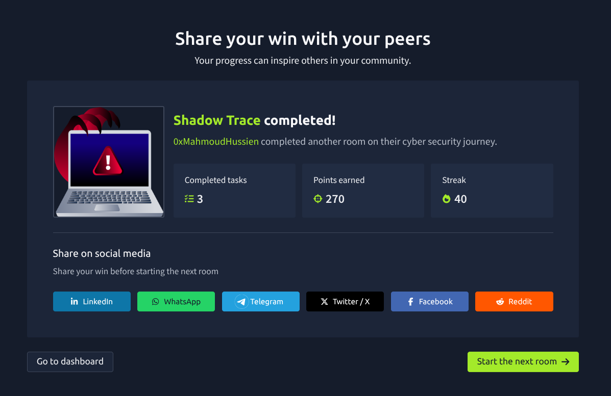
  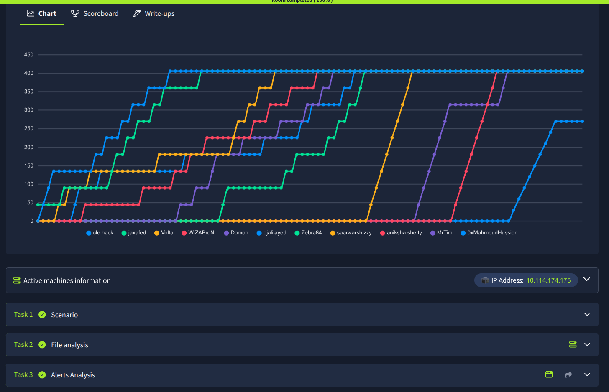

* **ما تم تعلمه (Learning Objectives):**
    * استخراج مؤشرات الاختراق (**IOCs**) من الملفات البرمجية المشبوهة (Binaries).
    * ربط التنبيهات (Alerts) بالأنشطة الخبيثة لتحليل سلسلة الهجوم بالكامل.
    * تنفيذ إجراءات الفرز الأساسية (**SOC Triage**) لتحديد مدى خطورة التهديدات وترتيب أولويات الاستجابة.

---

### 🏆 Special Achievement: Malware Defender

  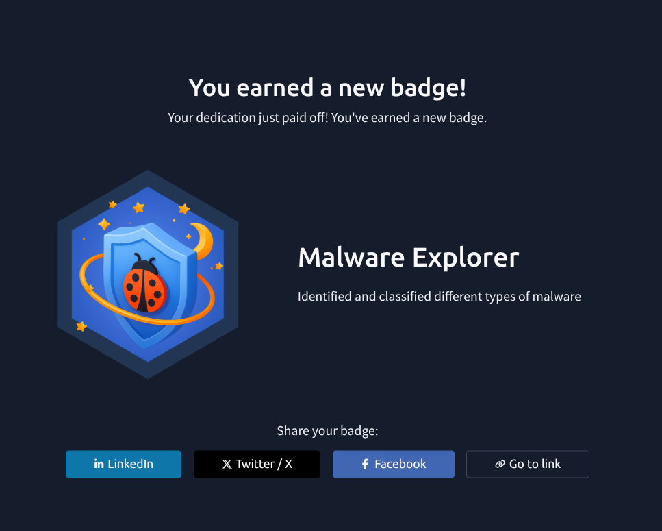

> **تم الحصول على هذه البادج بعد إتمام مسار Malware Concepts، وإتقان مهارات تصنيف البرمجيات الخبيثة، تحليلها (Static & Dynamic)، وكشف هجمات الـ Living Off the Land وربط الـ IOCs بالنشاطات التخريبية.**

---

#### 25. Intro to Cyber Threat Intel

  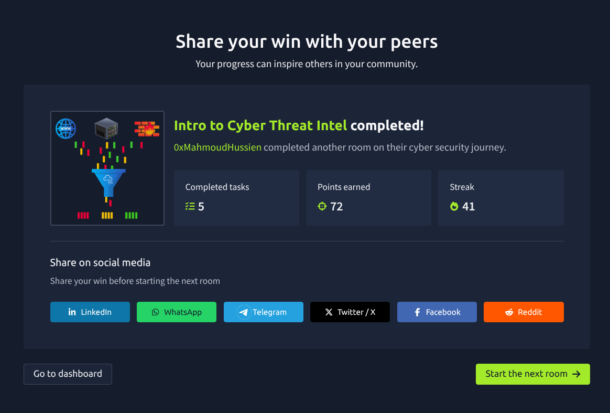
  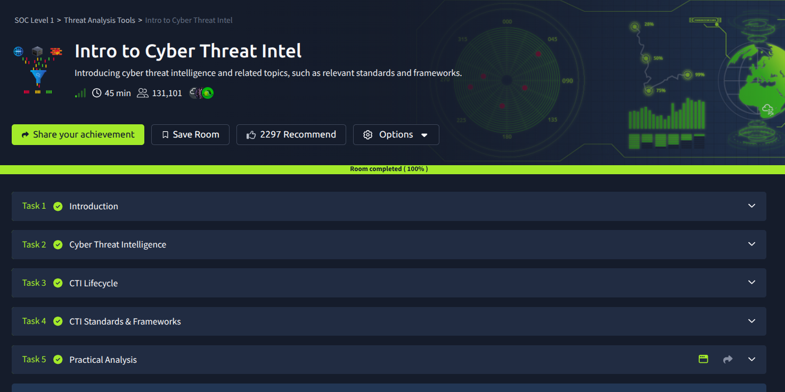

* **ما تم تعلمه (Learning Objectives):**
    * فهم ماهية الاستخبارات المتعلقة بالتهديدات السيبرانية (CTI) وأهميتها القصوى لمحللي الـ SOC.
    * دراسة دورة حياة استخبارات التهديدات (**Threat Intelligence Lifecycle**) والمؤشرات التي يجب البحث عنها.
    * التعرف على كيفية مشاركة المعلومات الاستخباراتية باستخدام الـ Feeds والمنصات المتخصصة (Platforms).

---

#### 26. File and Hash Threat Intel

  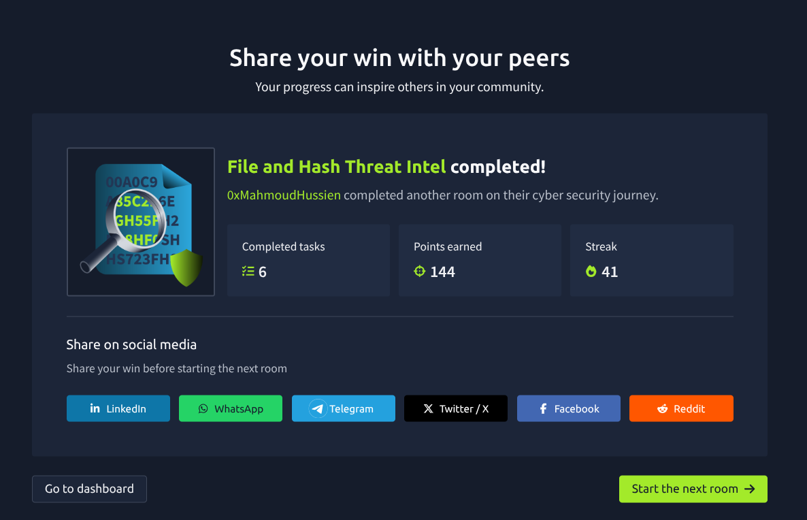
  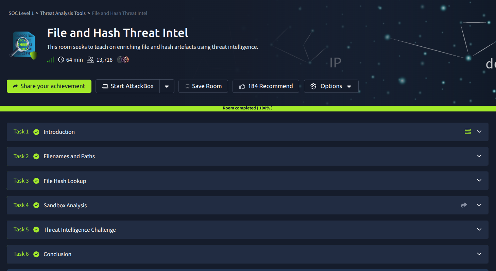

* **ما تم تعلمه (Learning Objectives):**
    * تفسير مسارات وأسماء الملفات المشبوهة باستخدام القواعد الاستدلالية (**Heuristics**).
    * إنشاء والتحقق من بصمات الملفات (**File Hashes**) لضمان سلامتها وتحديد هويتها.
    * الاستفادة من منصات **VirusTotal** و **MalwareBazaar** لإثراء المعلومات حول الملفات المكتشفة حديثاً.
    * استخراج وتحليل سلوك الملفات من تقارير الـ **Sandbox** وربطها بإطار عمل **MITRE ATT&CK**.

---

#### 27. IP and Domain Threat Intel

  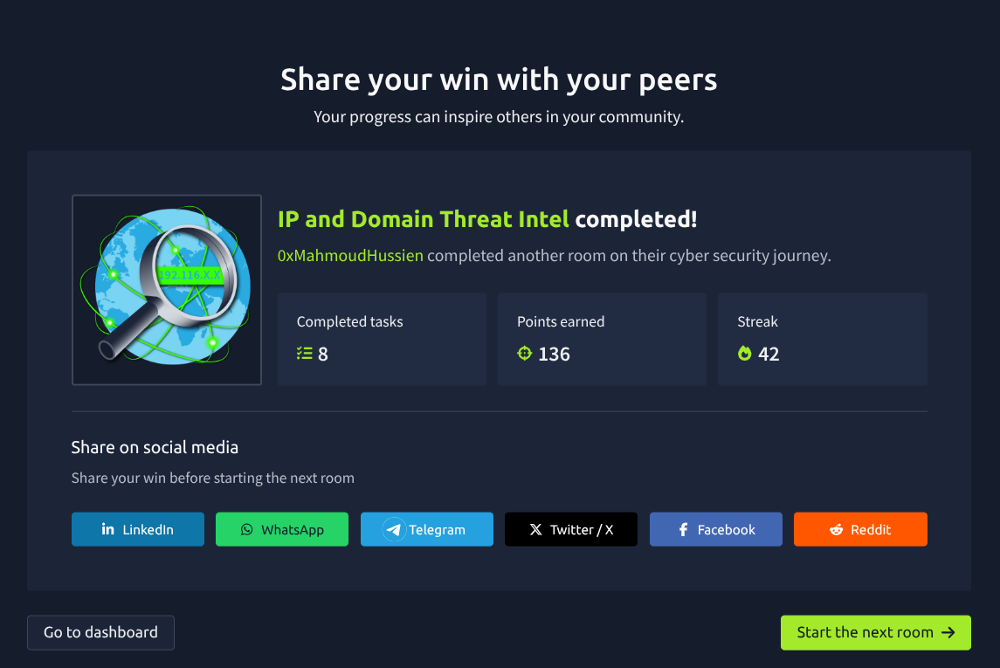
  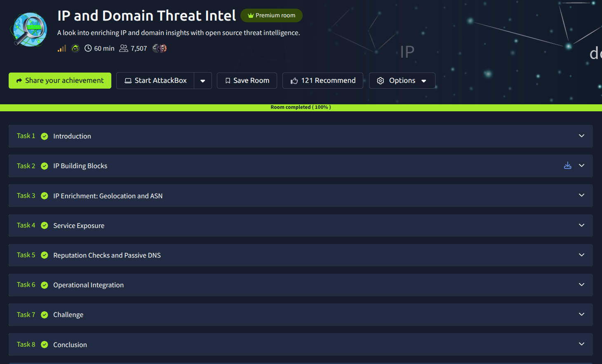

* **ما تم تعلمه (Learning Objectives):**
    * فهم أهمية استخبارات التهديدات المتعلقة بالعناوين (IPs) والنطاقات (Domains) لعمل الـ SOC.
    * تحديد الموقع الجغرافي للـ IPs وتفسير أرقام الأنظمة المستقلة (**ASNs**) التابعة لها.
    * اكتشاف البنية التحتية المشبوهة باستخدام محركات **Shodan** و **Censys** وتحليل الـ Service Banners.
    * تقييم سمعة العناوين والنطاقات (Reputation Assessment) باستخدام أدوات متنوعة.
    * إثراء بيانات النطاقات (Domain Enrichment) عبر فحص عمر الـ WHOIS، سجلات الـ DNS، وشفافية الشهادات الرقمية (Certificates).

---

#### 28. Invite Only (Challenge Room)

  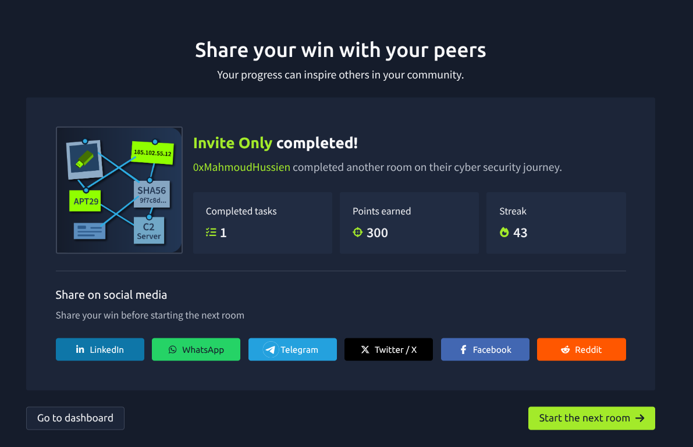
  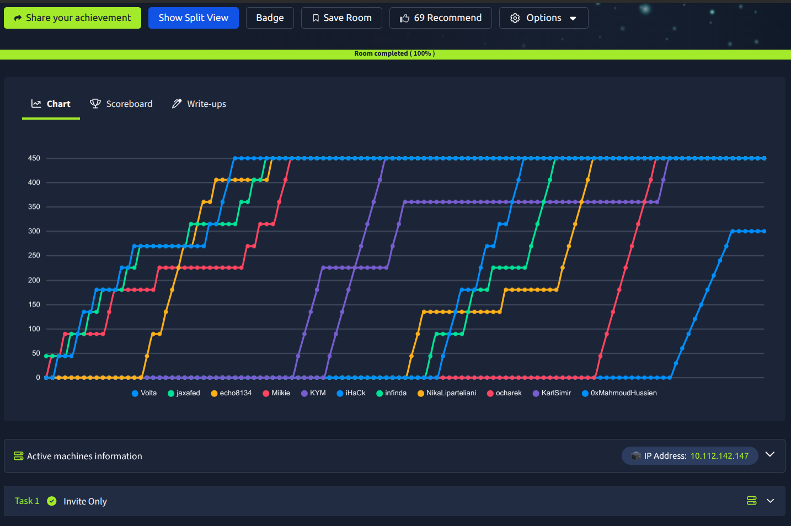

* **ما تم إنجازه (Accomplishments):**
    * حل تحدي عملي يحاكي سيناريوهات اختراق واقعية تتطلب مهارات تحليلية متقدمة.
    * استخدام تقنيات البحث والتقصي الرقمي للوصول إلى المعلومات المطلوبة (Flags).
    * تطبيق أدوات الـ OSINT والتحليل الفني لفك شفرة التحدي والوصول للحل النهائي.
    * تعزيز مهارات حل المشكلات (Problem Solving) تحت ظروف تحاكي بيئة عمل الـ SOC.

---

### 🏆 Special Achievement: Threat Intel Defender

  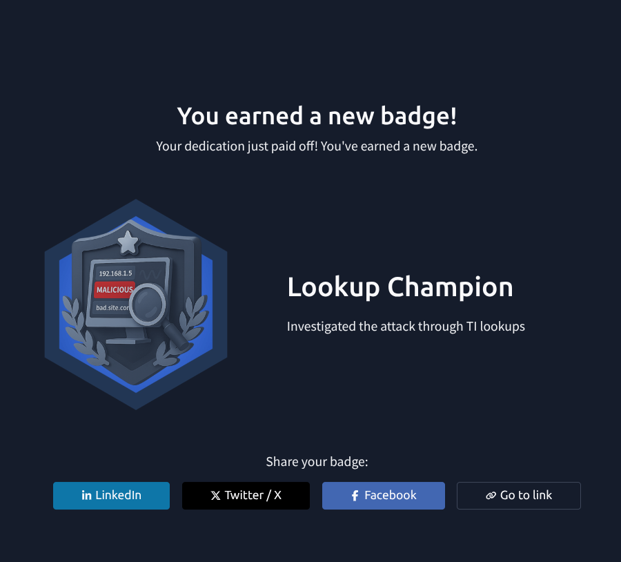

> **تم الحصول على هذه البادج بعد إتمام مسار Cyber Threat Intelligence، وإتقان مهارات تتبع التهديدات عبر الـ IPs والـ Domains، وتحليل الـ Malware Bazaar، وربط الأنشطة المشبوهة بإطار عمل MITRE ATT&CK لتوقع ومنع الهجمات قبل حدوثها.**

---

#### 29. Sysmon

  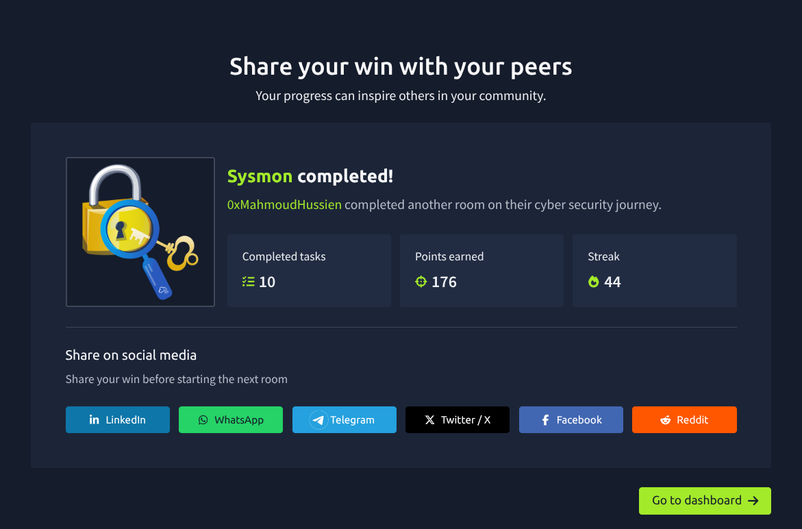
  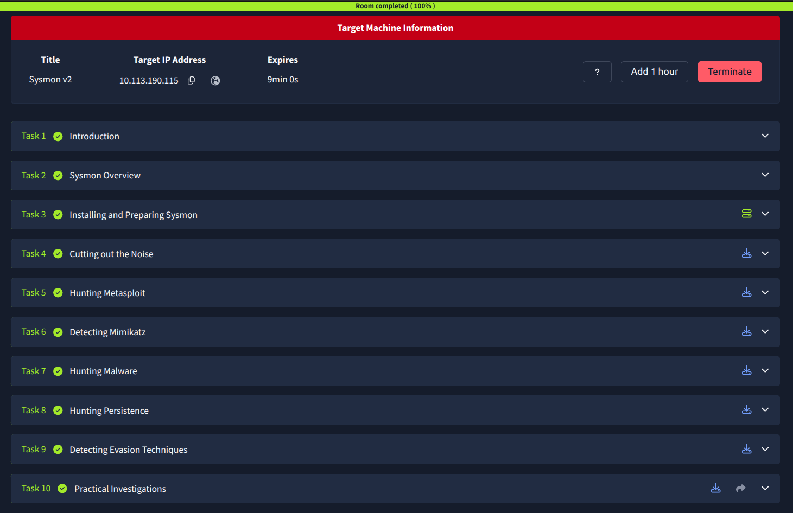

* **ما تم تعلمه (Learning Objectives):**
    * فهم دور أداة **Sysmon** كجزء من مجموعة أدوات **Sysinternals** في مراقبة الأنظمة.
    * تعلم كيفية تثبيت وإعداد الـ **Configuration Files** لتصفية الأحداث الهامة وتقليل الضجيج (Noise).
    * تحليل أحداث النظام الهامة مثل إنشاء العمليات (**Process Creation**)، اتصالات الشبكة، وتعديل الـ Registry.
    * اكتشاف الهجمات المتقدمة (مثل الـ الـ Process Injection) التي لا تستطيع سجلات ويندوز العادية كشفها.
    * كتابة واستخدام الـ **Rules** (باستخدام لغة XML) لتخصيص عملية الرصد بناءً على احتياجات المؤسسة.

---

#### 30. Log Analysis with SIEM

  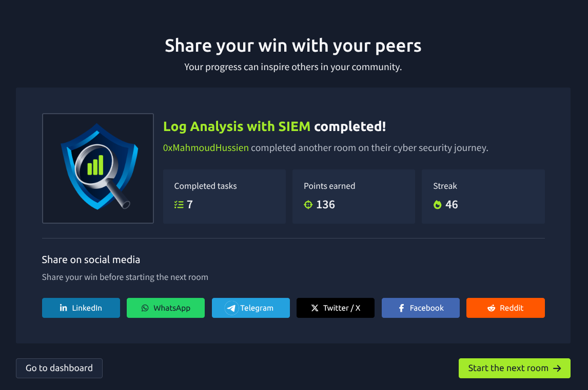
  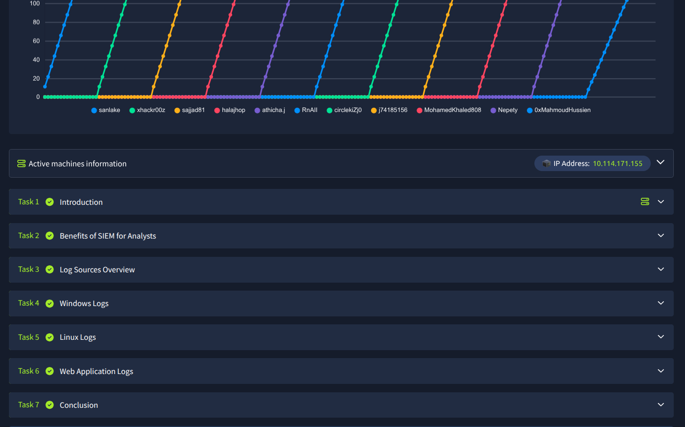

* **ما تم تعلمه (Learning Objectives):**
    * استكشاف مصادر البيانات المتنوعة التي يتم سحبها (**Ingestion**) إلى أنظمة الـ SIEM.
    * فهم أهمية ربط البيانات (**Data Correlation**) لتحويل السجلات المنفصلة إلى قصة هجوم متكاملة.
    * تعلم القيمة التحليلية لسجلات الويندوز، لينكس، الويب، والشبكة أثناء التحقيقات.
    * الممارسة العملية على تحليل السلوكيات الخبيثة واكتشاف الأنماط المشبوهة داخل منصة الـ SIEM.

---

#### 31. Alert Triage With Splunk

  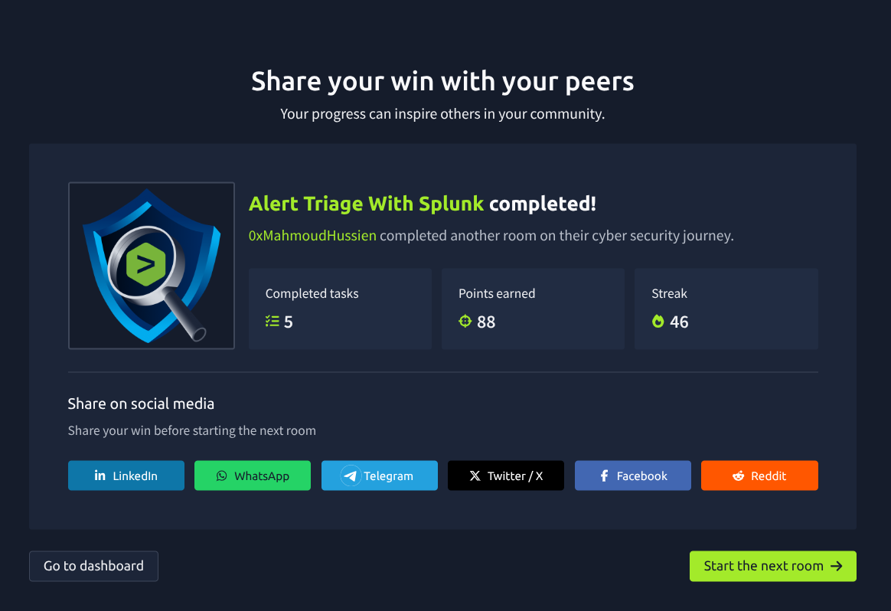
  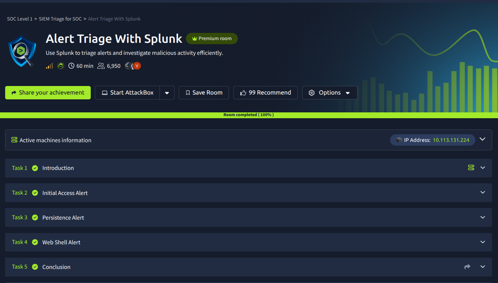

* **ما تم تعلمه (Learning Objectives):**
    * تعلم الكيفية الصحيحة للتحقيق في التنبيهات (Alerts) داخل بيئة عمل الـ SOC.
    * فهم كيفية تتبع وتحليل هجمات التخمين (**Brute-force Attacks**) على أنظمة لينكس عبر Splunk.
    * اكتشاف آليات البقاء (**Persistence Mechanisms**) التي يزرعها المهاجمون داخل أنظمة ويندوز.
    * تحليل الـ **Web Shells** وكشف الثغرات في خوادم الويب المصابة.
    * الممارسة العملية على التحقيق في 3 سيناريوهات واقعية لمواجهة التهديدات باستخدام منصة **Splunk**.

---

#### 32. Alert Triage With Elastic

  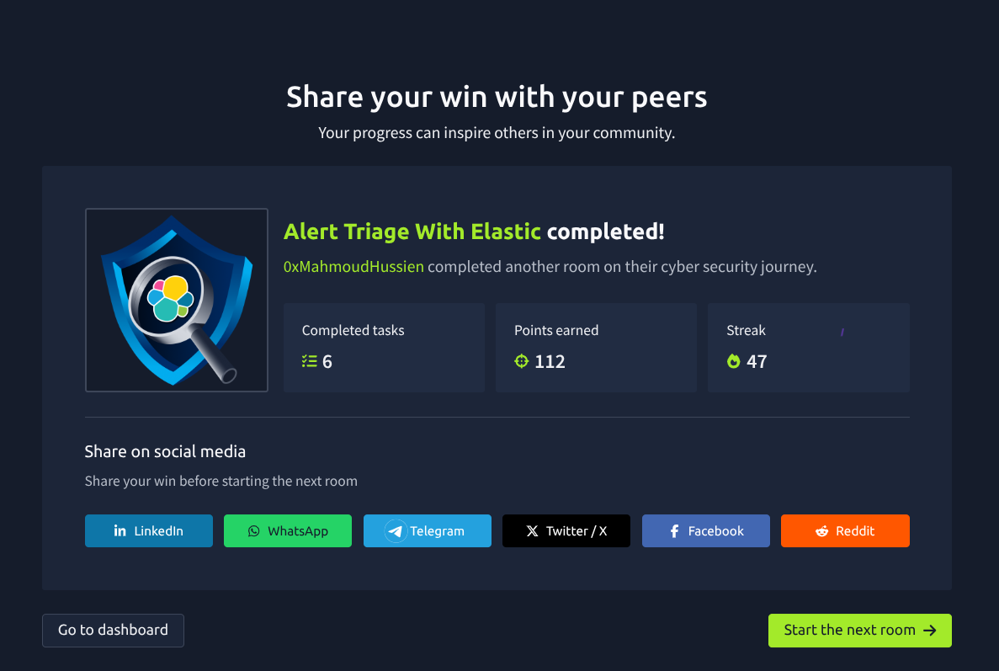
  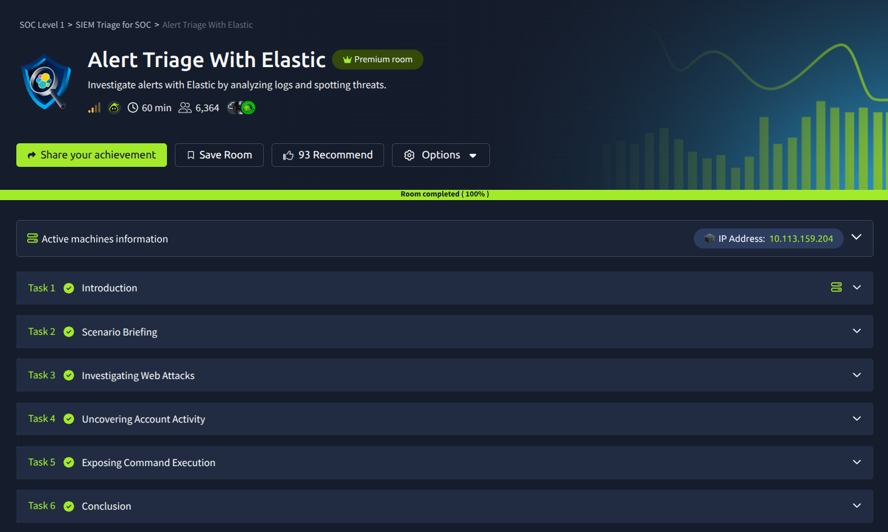

* **ما تم تعلمه (Learning Objectives):**
    * استخدام منصة **Kibana** لتحليل سجلات الأمان الشائعة بكفاءة عالية.
    * تعلم كيفية تحديد مؤشرات الاختراق الرئيسية (**Key IOCs**) من خلال البيانات الضخمة.
    * ربط الأحداث (**Event Correlation**) عبر مصادر سجلات متعددة لرسم صورة كاملة للهجوم.
    * كشف تفاصيل الاختراقات الأمنية من خلال تتبع وتحليل سلسلة من تنبيهات الـ SOC.

---

#### 33. ItsyBitsy (Investigation Case Study)

  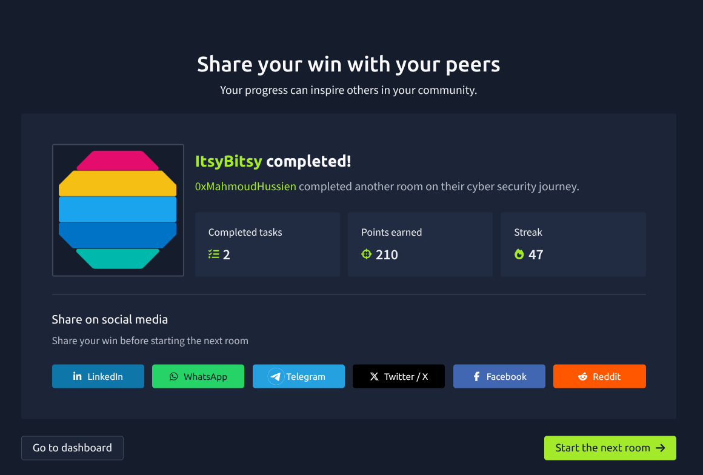
  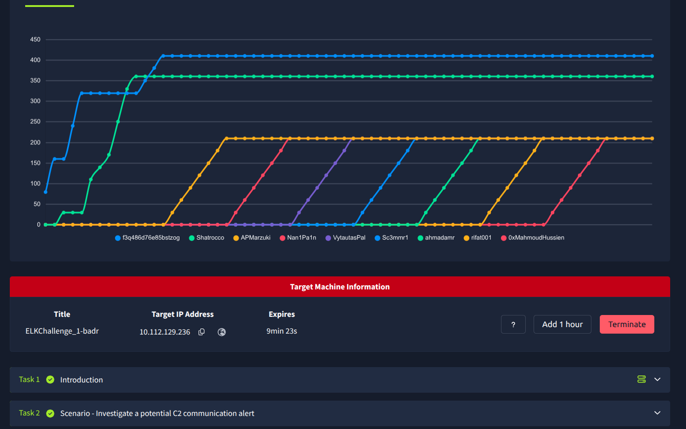

* **السيناريو والتحقيق (Scenario & Investigation):**
    * محاكاة دور محلل SOC (Analyst John) للتحقيق في تنبيه IDS يشير لاتصال **C2** مشبوه من قسم الـ HR.
    * تحليل سجلات **HTTP** لمدة أسبوع كامل تم سحبها وفهرستها داخل **Kibana** (index: connection_logs).
* **المهارات المكتسبة (Skills Applied):**
    * استخدام **KQL** لتحليل آلاف الأحداث وتحديد الـ IP الخاص بالمستخدم المصاب.
    * كشف استخدام أدوات ويندوز الشرعية (**Legit Windows Binaries**) في عمليات تحميل ملفات خبيثة.
    * التعرف على تقنيات المهاجمين في استغلال مواقع مشاركة الملفات المشهورة كمنصات **C2 Server**.
    * تتبع الـ **Full URL** للوصول للملف المشبوه واستخراج الـ Secret Code (Flag) من داخل محتواه.

---

#### 34. Incident Handling With Splunk

  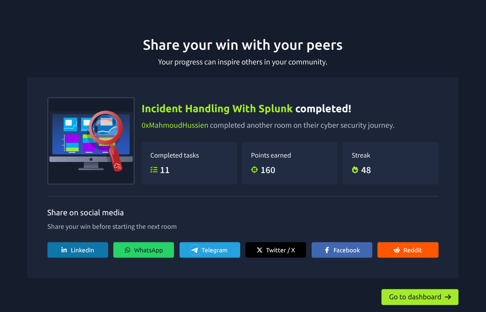
  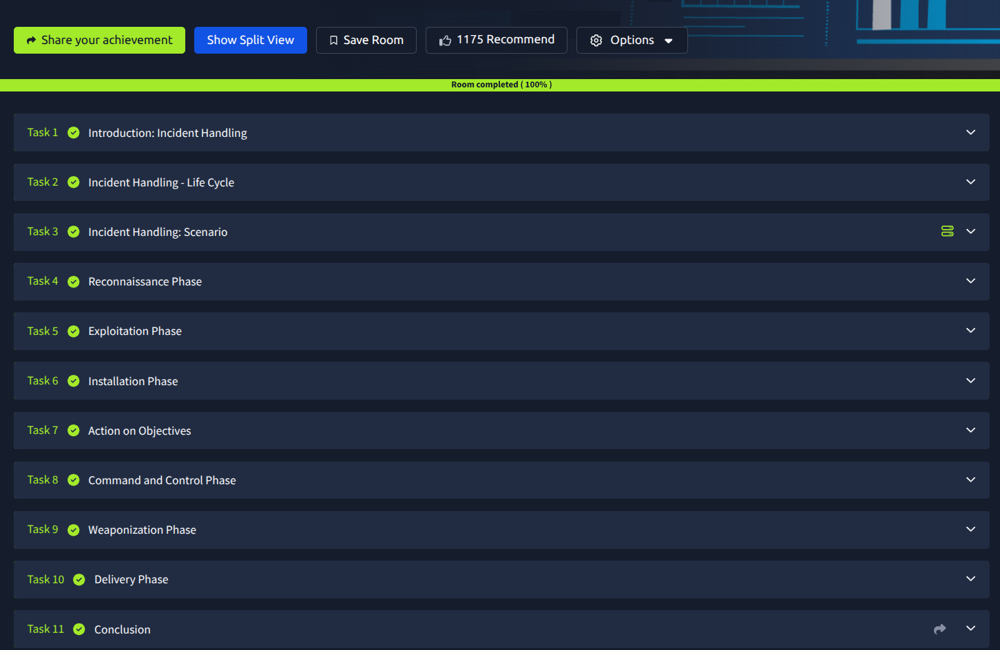

* **ما تم تعلمه (Learning Objectives):**
    * تعلم كيفية الاستفادة من مواقع الاستخبارات المفتوحة المصدر (**OSINT**) لتعزيز عملية التحقيق.
    * ربط ورسم خريطة لأنشطة المهاجم بمراحل سلسلة القتل السيبراني (**Cyber Kill Chain Phases**).
    * إتقان استخدام استعلامات **Splunk** الفعالة للبحث في السجلات (Logs) وتتبع التهديدات.
    * فهم الأهمية التكاملية لمصادر السجلات المرتكزة على المضيف (**Host-centric**) والمرتكزة على الشبكة (**Network-centric**).

---

#### 35. Benign (Scenario-Based Investigation)

  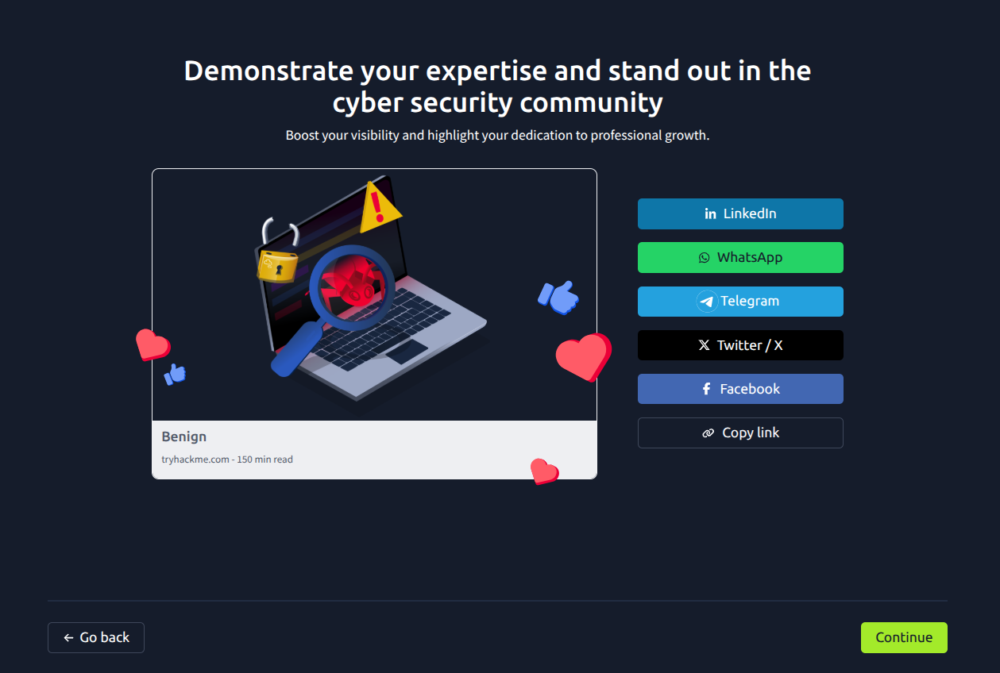
  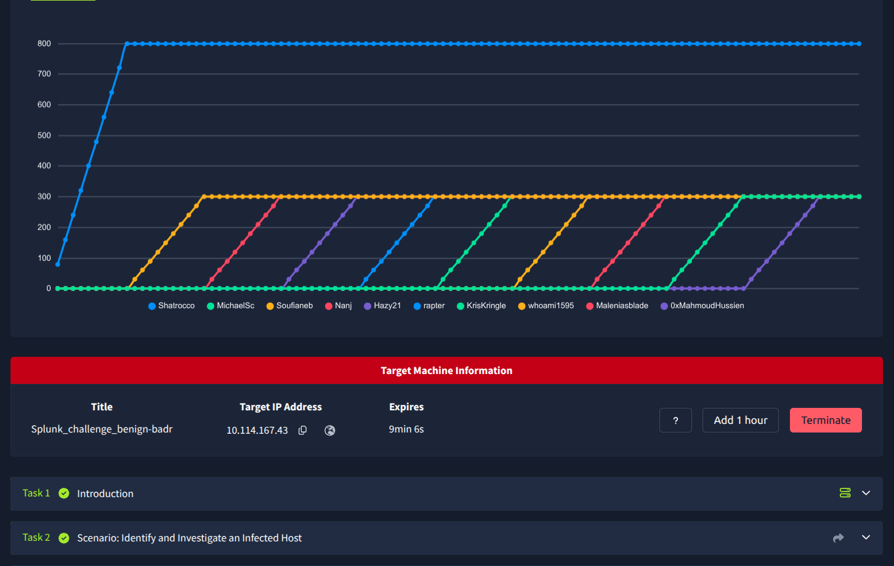
  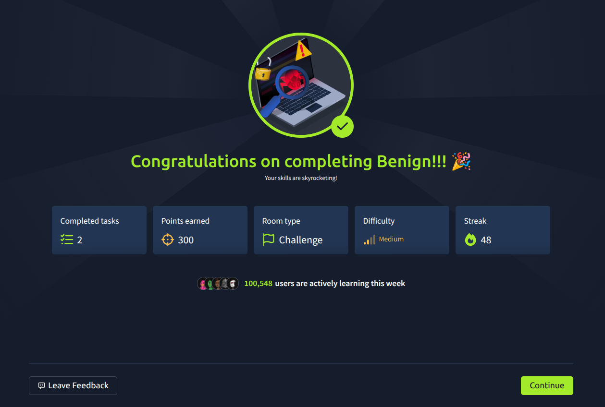

* **ما تم تعلمه (Learning Objectives):**
    * تحليل سجلات الـ **Splunk** للتمييز بين العمليات النظامية والأنشطة المشبوهة.
    * التحقيق في سيناريوهات واقعية تتضمن استخدام أدوات ويندوز (LOLBins) في سياق سليم وخبيث.
    * إتقان مهارات البحث المتقدمة لتحديد الـ **Root Cause** لأي تنبيه أمني.
    * تقليل الـ False Positives عبر فهم السلوك الطبيعي للمستخدمين والأنظمة داخل الشبكة.

---

#### 36. Brim

  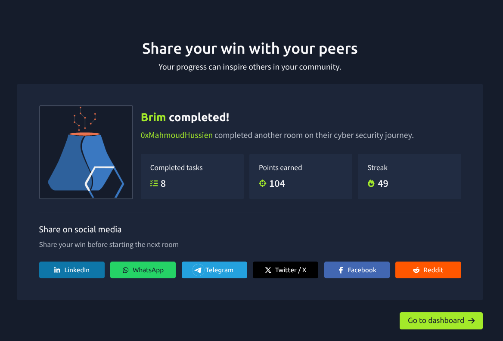
  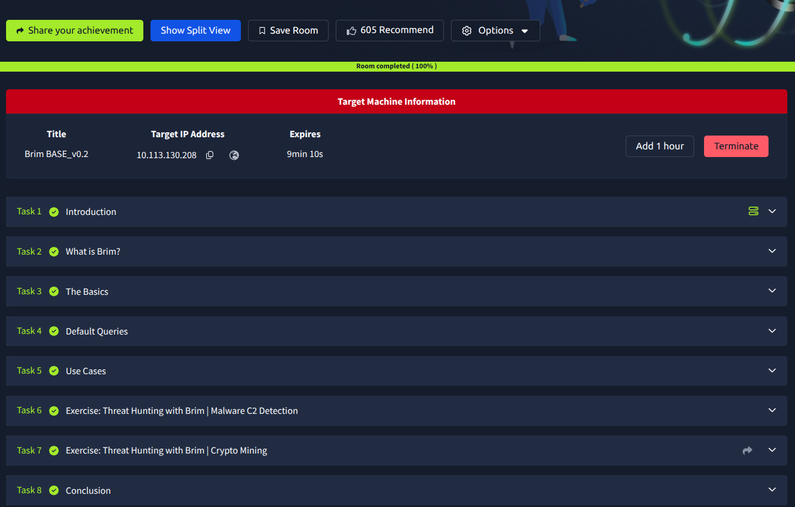

* **ما تم تعلمه (Learning Objectives):**
    * معالجة وتحليل ملفات الـ **PCAP** الكبيرة وتحويلها إلى سجلات منظمة وسهلة التصفح.
    * إتقان لغة الاستعلام **ZQL** (Zed Query Language) لتصفية البيانات واستخراج المعلومات الأمنية.
    * استخدام الـ **Suricata** و **Zeek** المدمجين داخل Brim لاكتشاف التنبيهات والأنشطة المشبوهة.
    * الربط بين تحليل الشبكة وأدوات التحليل الأخرى مثل **Wireshark** للتعمق في تفاصيل الـ Packets.
    * كشف أنماط الـ Malware Traffic واتصالات الـ C2 من خلال تحليل سجلات الـ HTTP والـ DNS.

---

#### 37. Tempest (Investigation Challenge)

  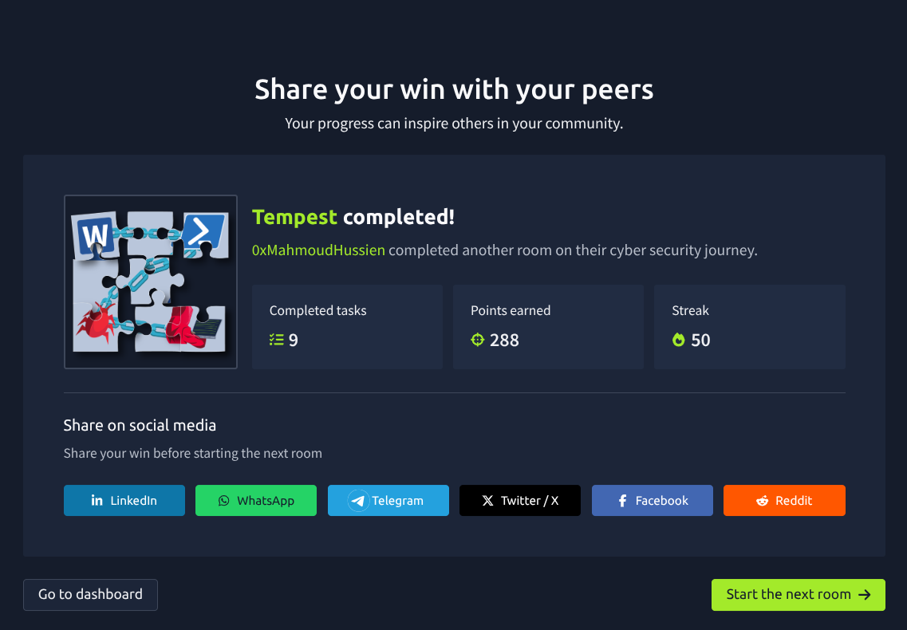
  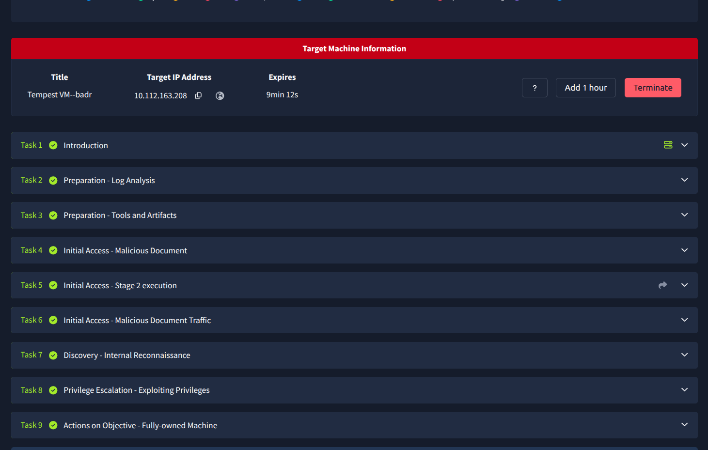

* **ما تم إنجازه (Accomplishments):**
    * حل تحدي عملي متكامل يتطلب مهارات التحقيق الرقمي والاستجابة للحوادث (**DFIR**).
    * تحليل الأدلة الرقمية ومطاردة التهديدات داخل بيئة مصابة لكشف جدول المهاجم الزمني.
    * استخدام أدوات التحليل المتنوعة لفك شفرة الهجوم واستخراج الـ Flags المطلوبة.
    * تعزيز القدرة على ربط الأحداث ببعضها للوصول إلى كيفية حدوث الاختراق (Root Cause Analysis).

---

#### 38. TShark: The Basics

  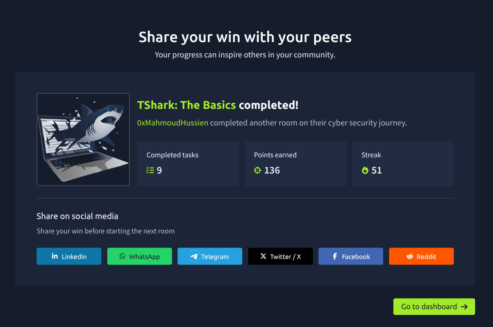
  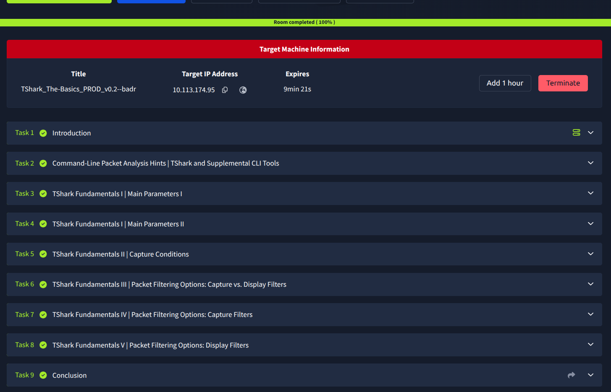

* **ما تم تعلمه (Learning Objectives):**
    * تعلم كيفية تصفية وتحليل حركة مرور الشبكة (**Traffic Analysis**) باستخدام أداة سطر الأوامر **TShark**.
    * تطبيق فلاتر الـ **Wireshark** المعروفة داخل بيئة الـ Terminal بكفاءة عالية.
    * التوسع في عمليات تصفية الحزم (Packet Filtering) وأتمتتها (**Automation**) باستخدام الخيارات المتقدمة في TShark.
    * استخراج حقول محددة من الـ Packets وتحويلها إلى تقارير نصية سهلة القراءة والتحليل. 

---

#### 39. TShark: CLI Wireshark Features

  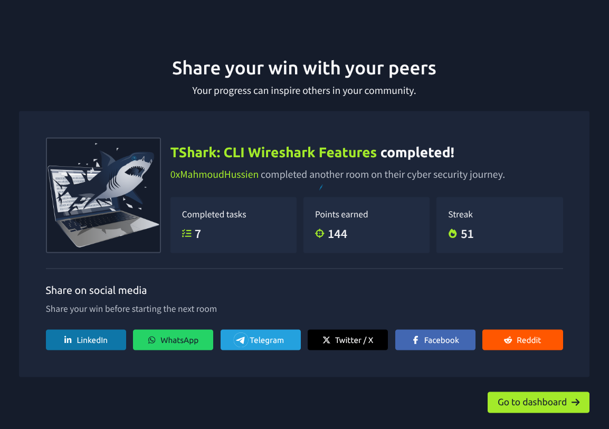
  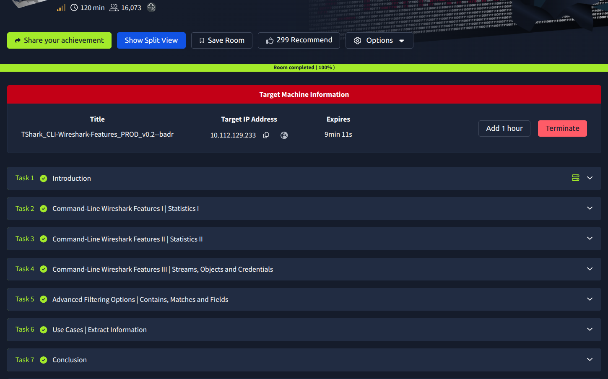

* **ما تم تعلمه (Learning Objectives):**
    * استكشاف واستخدام مهارات Wireshark المتقدمة مباشرة من سطر الأوامر (CLI).
    * استخراج الإحصائيات (Statistics) وتحليل البروتوكولات والـ Endpoints باستخدام خيارات `-z`.
    * تحليل سلاسل البيانات (**Follow Streams**) لاستعادة المحادثات والبيانات المتبادلة في البروتوكولات المختلفة (TCP/UDP/HTTP).
    * إتقان التعامل مع الـ **Time Styles** والتحكم في عرض الحقول بدقة متناهية.
    * دمج الـ TShark في عمليات الـ Automation لتحليل كميات ضخمة من الـ Traffic بسرعة وكفاءة.

---

#### 40. TShark Challenge I: Teamwork

  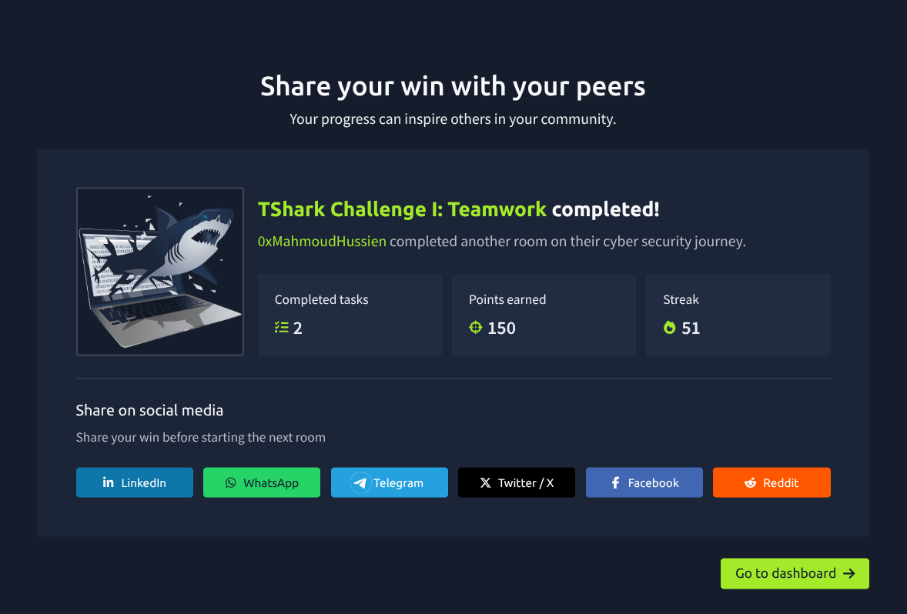
  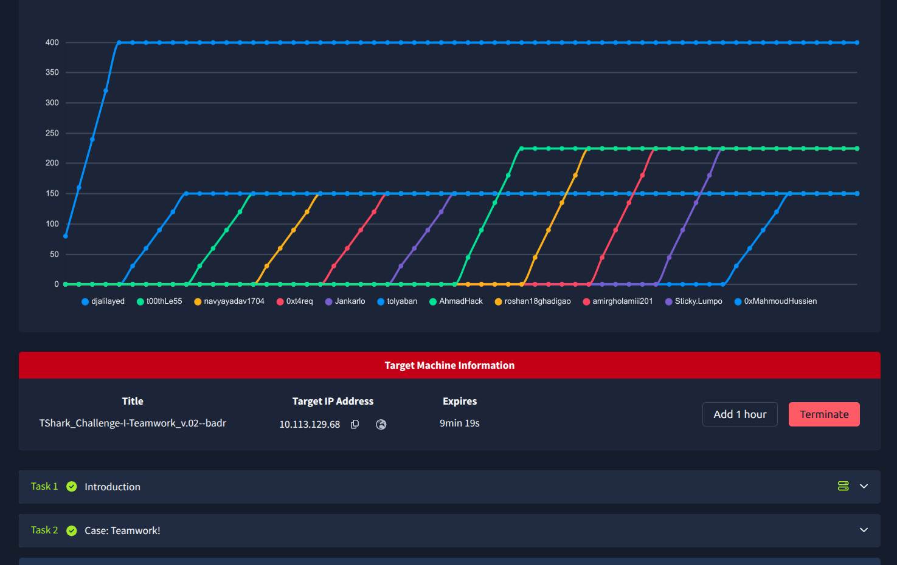

* **ما تم إنجازه (Accomplishments):**
    * حل تحدي عملي يعتمد بالكامل على استخدام **TShark** في بيئة سطر الأوامر.
    * تحليل ملف لاستخراج مؤشرات الاختراق (IOCs) وتتبع مسار الهجوم.
    * استخدام مهارات الـ **Packet Filtering** المتقدمة للإجابة على أسئلة التحقيق.

---

#### 41. TShark Challenge II: Directory

  
  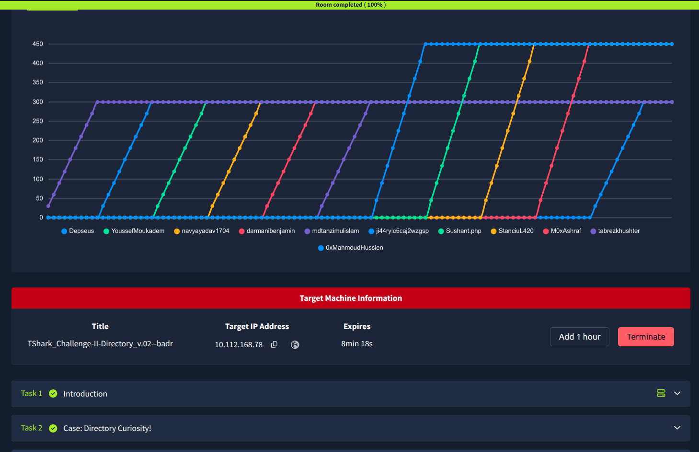

* **التحقيق والسيناريو (Scenario & Investigation):**
    * التحقيق في تنبيه أمني يشير لتعرض مستخدم لمشكلة بسبب "فضوله" في تصفح فهرس ملفات مشبوه (Poor file index).
    * استخدام **TShark** لتحليل ملف الـ PCAP واستخراج الأدلة الرقمية (Artifacts) من حركة مرور الشبكة.
    * استخراج الـ **Hashes** للملفات المشبوهة وفحصها باستخدام **VirusTotal** لتأكيد الإصابة (True Positive).
* **المهارات المكتسبة (Skills Applied):**
    * إتقان تقنيات استخراج الملفات المتبادلة عبر بروتوكول HTTP باستخدام سطر الأوامر.
    * ربط تحليل الشبكة بذكاء التهديدات (**Threat Intelligence**) للتحقق من سلامة الملفات.
    * تحليل الـ HTTP Objects وتحديد الملفات التي تم تحميلها وتسببت في اختراق الجهاز.

---

### 🏆 Special Achievement: TShark Master

  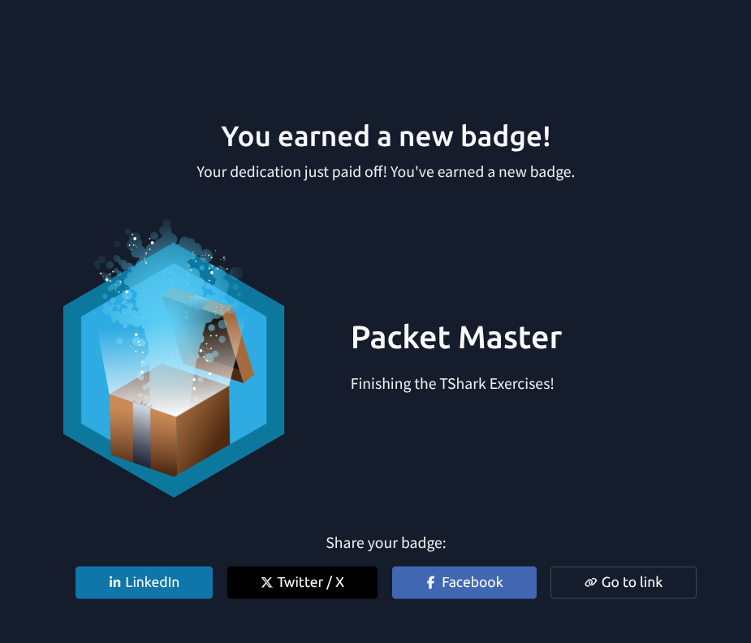

> **تم الحصول على هذه البادج بعد إتمام كافة غرف وتحديات TShark بنجاح. تضمنت الرحلة إتقان تحليل البروتوكولات عبر سطر الأوامر، واستخراج الملفات المشبوهة، والربط مع أدوات الـ Threat Intel مثل VirusTotal لكشف التهديدات المتقدمة وأتمتة عمليات فحص الـ PCAPs.**

---

#### 42. Windows Event Logs

  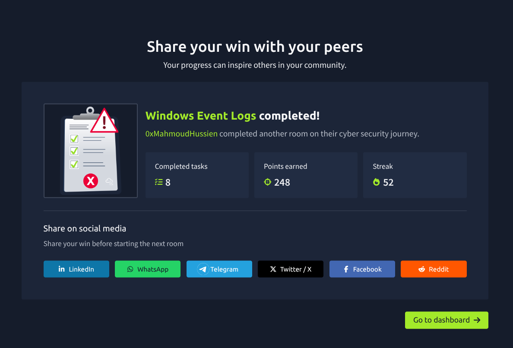
  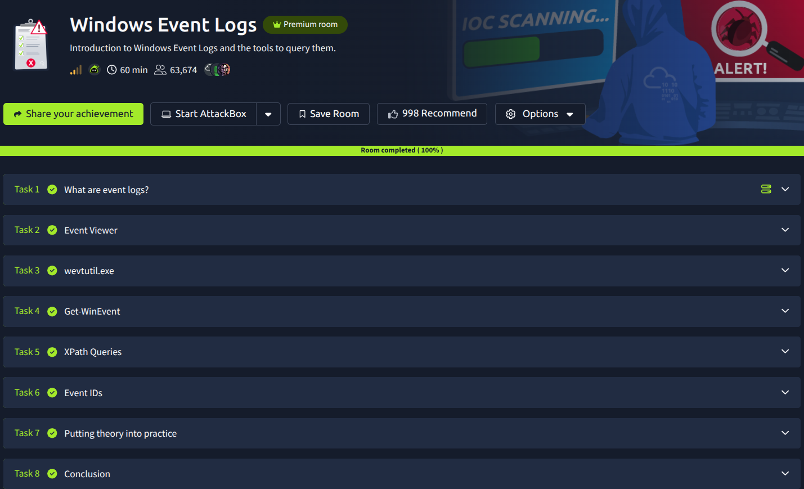

* **ما تم تعلمه (Learning Objectives):**
    * فهم بنية سجلات أحداث ويندوز (System, Security, Application) وكيفية التعامل معها.
    * استخدام أداة **Event Viewer** و **Get-WinEvent** عبر PowerShell للبحث عن الأحداث وتصفيتها.
    * التعرف على الـ **Event IDs** الهامة للتحقيق الأمني (مثل 4624 للـ Logon و 4688 لإنشاء العمليات).
    * تحليل سجلات الـ **XPath Queries** لكتابة فلاتر مخصصة ودقيقة لاستخراج الأدلة الرقمية.
    * مراقبة سلوك المستخدمين وكشف محاولات الدخول غير المصرح بها أو التلاعب بالنظام.

---

#### 43. Boogeyman 1 (Case Study)

  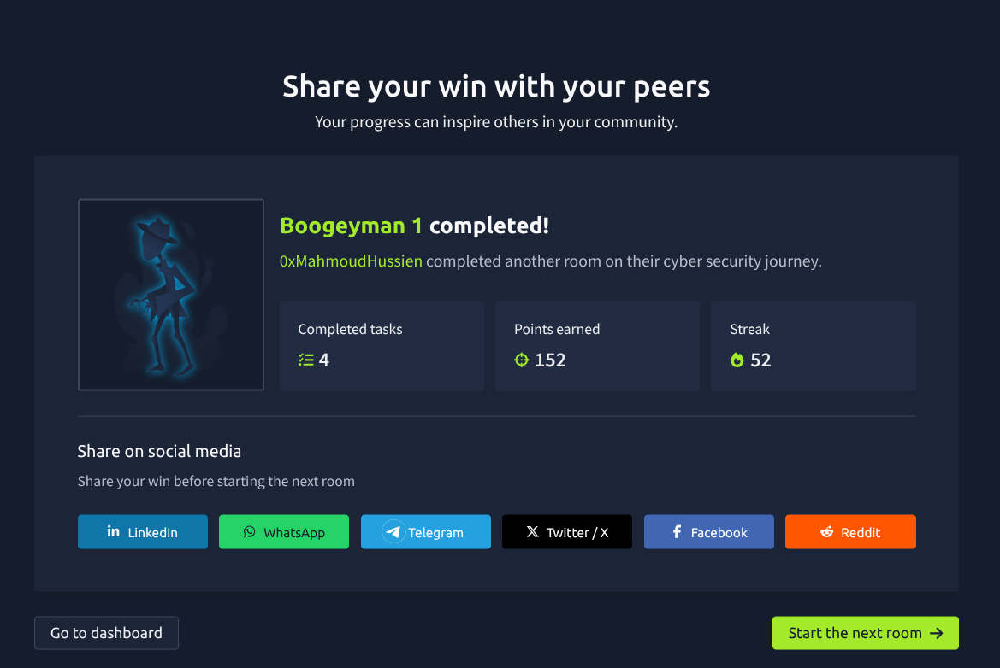
  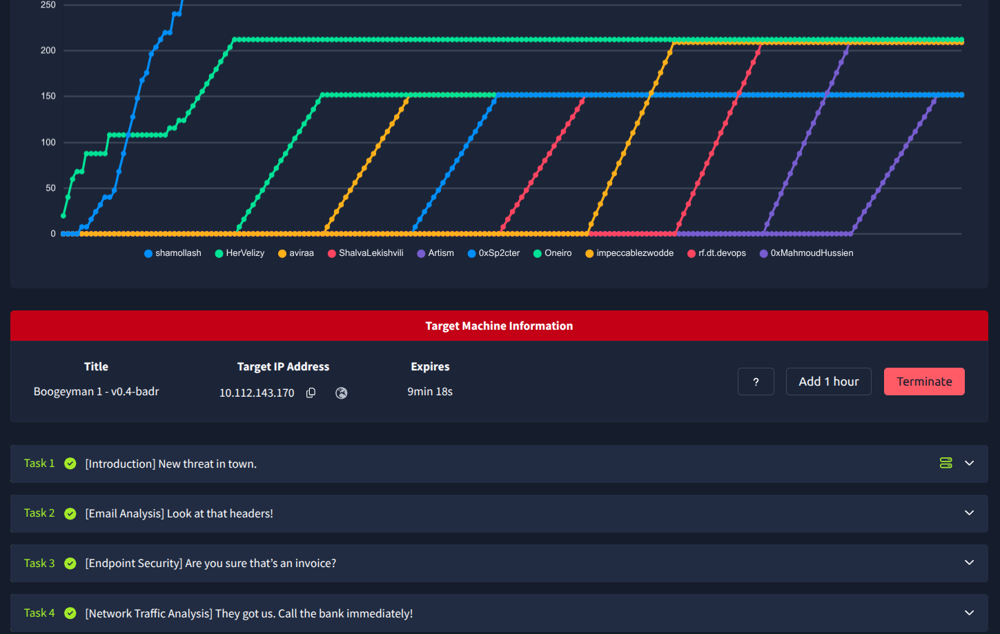

*#### 43. Boogeyman 1 (Case Study) - [📖 View Detailed Technical Investigation Report](./investigations/Boogeyman1.md).

---

#### 44. Core Windows Processes

  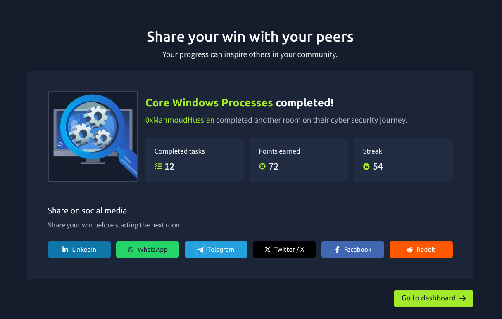
  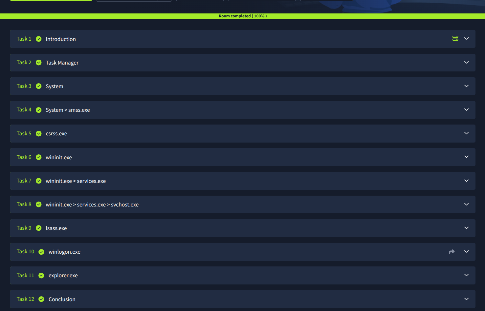

* **ما تم تعلمه (Learning Objectives):**
    * فهم العمليات الأساسية لنظام التشغيل ويندوز (مثل System, Smss.exe, Csrss.exe, Wininit.exe, Services.exe).
    * التعرف على الـ **Parent Process** والمسار الصحيح (Path) لكل عملية أساسية لتمييز أي تلاعب.
    * فهم كيفية عمل الـ **Session 0** والـ **Session 1** وكيفية توزيع العمليات عليهما.
    * تعلم كيفية استخدام أدوات مثل **Process Explorer** و **Task Manager** لتحليل سلوك العمليات بشكل معمق.
    * اكتشاف تقنيات التمويه التي يستخدمها المهاجمون من خلال انتحال أسماء العمليات الأساسية (Process Mimicking).

---

#### 45. Volatility (Memory Forensics - Volatility 3)

  
  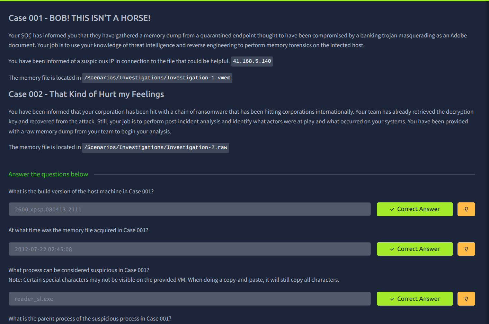
  

*#### 39. Volatility - [📖 View Detailed Memory Forensics Report](./investigations/Volatility.md)

---

#### 46. Boogeyman 2 (Phishing & Memory Analysis)

  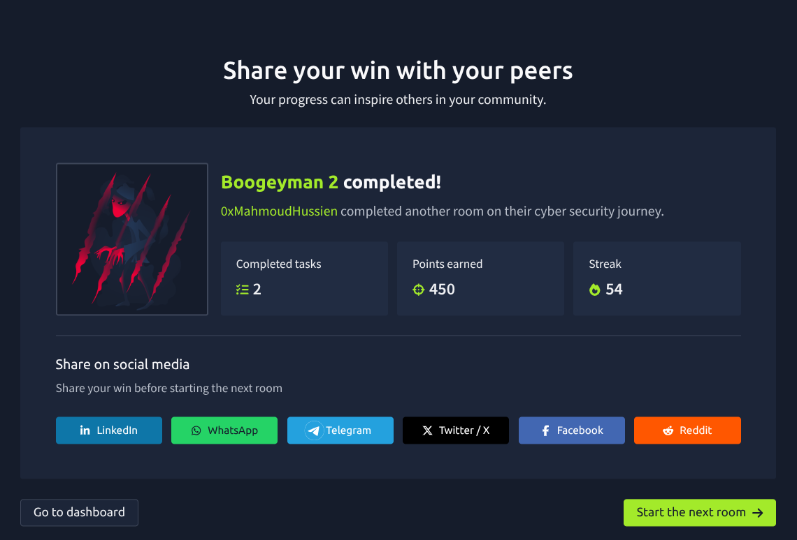
  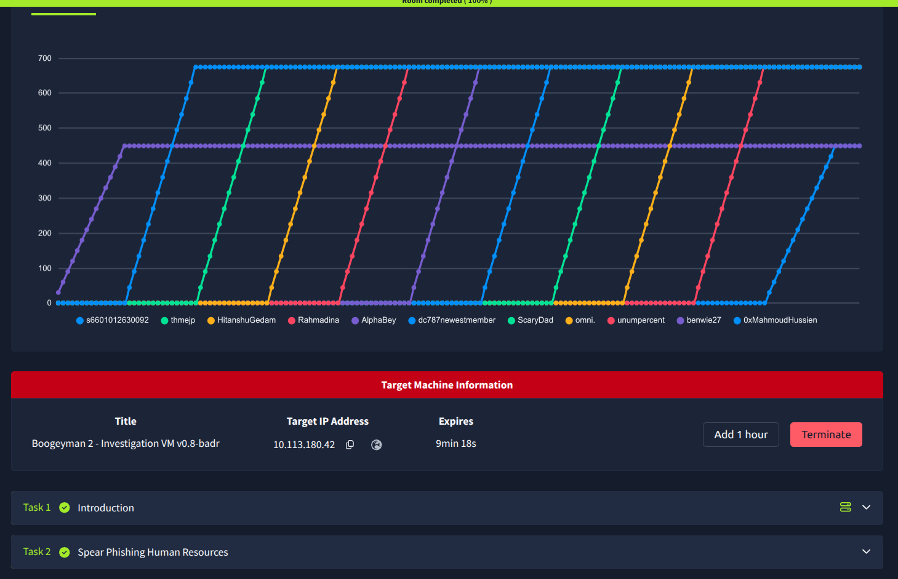

*#### 46. Boogeyman 2 (Phishing & Memory Analysis) - [📖 View Detailed Investigation Report](./investigations/Boogeyman2.md)

#### 47. Boogeyman 3 (Full Attack Chain Analysis)

  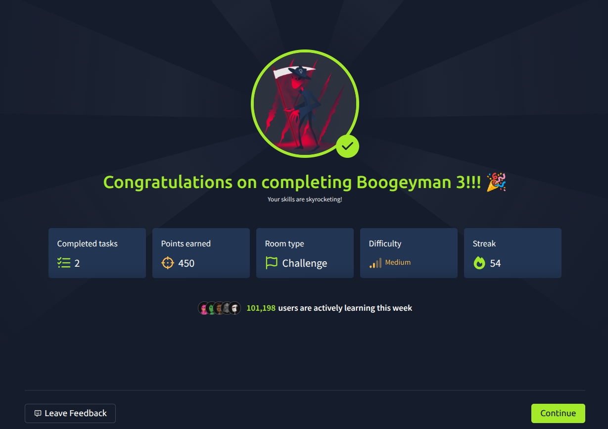
  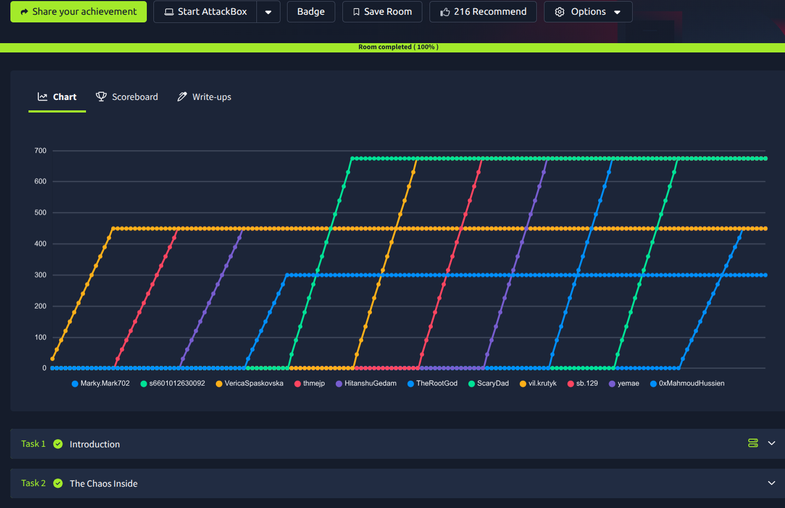

*> 📝 **[Technical Investigation Report (Detailed Write-up)](./investigations/Boogeyman3.md)**

 ---

### 🏆 Special Achievement: Boogeyman Slayer

  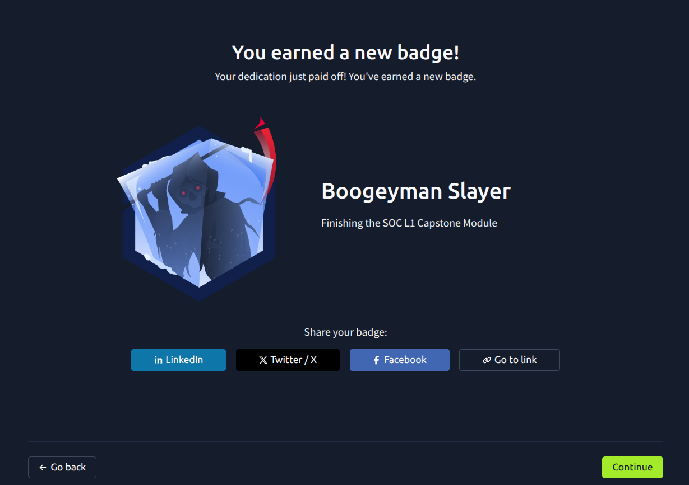

> **تم الحصول على هذه البادج بعد إتمام سلسلة تحديات Boogeyman الثلاثة (Capstone Challenges).

 ---

#### 48. Hacking with PowerShell

  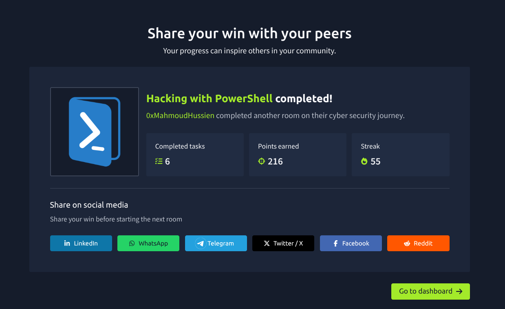
  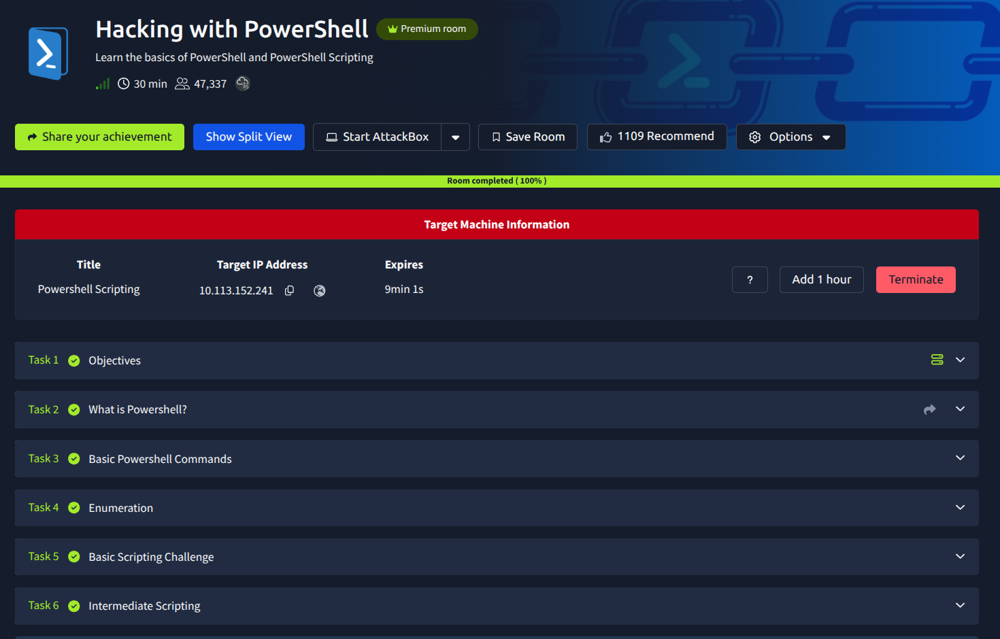

* **ما تم تعلمه (Learning Objectives):**
    * فهم أساسيات الـ **PowerShell Scripting** وكيفية أتمتة مهام الفحص.
    * ممارسة تقنيات الـ **Enumeration** لجمع معلومات النظام والشبكة.
