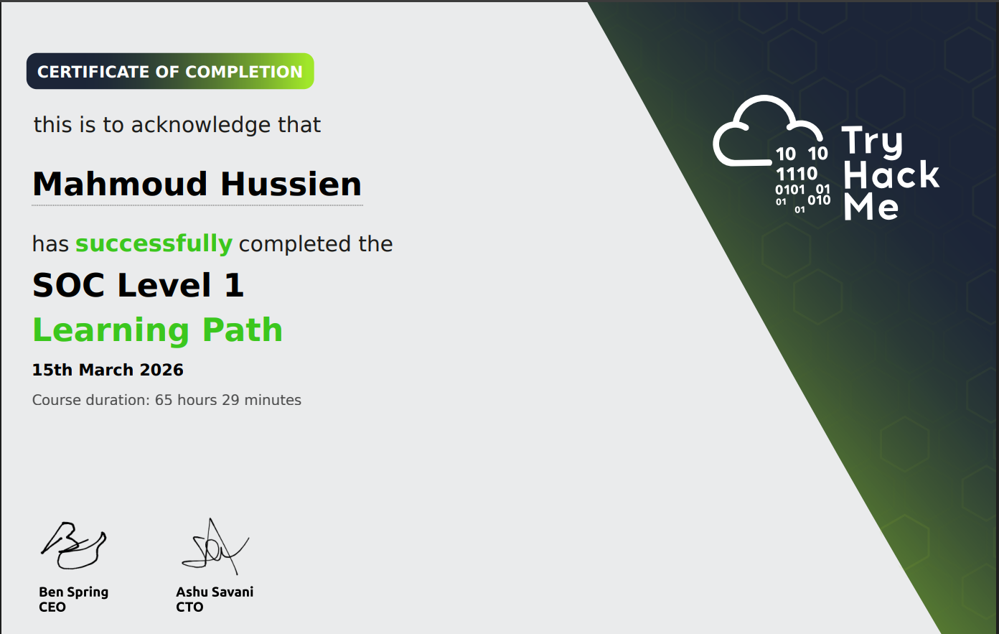

# 🎓 Professional Certification Writeup — TryHackMe

> A structured summary of completed learning paths on TryHackMe, covering foundational cybersecurity, network analysis, and SOC-level operations.

---

## 🏆 CERT — 01 · Pre-Security Pathway

**Platform:** TryHackMe

  

### 🛠️ Skills Acquired

| Area | Description |
|------|-------------|
| **Cyber Security Intro** | Understanding the field, career roles, and threat landscape fundamentals |
| **Network Fundamentals** | OSI Model, IP addressing, routing and switching concepts |
| **How the Web Works** | HTTP/HTTPS protocols, DNS resolution, cookies and sessions |
| **Linux Fundamentals** | Terminal navigation, file permissions, and Linux filesystem structure |
| **Windows Fundamentals** | Windows OS from a security perspective, CMD and PowerShell basics |

---

## 🏆 CERT — 02 · Cyber Security 101

**Platform:** TryHackMe &nbsp;|&nbsp; **Issued:** Feb 13, 2026 &nbsp;|&nbsp; **Credential ID:** `THM-SW96MFJBOJ`

  

### 🛠️ Skills Acquired

| Area | Description | Tools |
|------|-------------|-------|
| **Networking** | OSI model, TCP/IP stack, DNS and HTTP in depth | `TCP/IP` `DNS` `HTTP` |
| **Web Security** | Common web vulnerabilities and practical exploitation basics | `Burp Suite` `Gobuster` |
| **Operating Systems** | Security-focused foundations for both Windows and Linux | — |
| **Security Tools** | Hands-on labs with industry-standard security tools | `Wireshark` `Burp Suite` `Gobuster` |

---

## 🏆 CERT — 03 · SOC Level 1

**Platform:** TryHackMe &nbsp;|&nbsp; **Issued:** Mar 15, 2026 &nbsp;|&nbsp; **Duration:** 65 hrs 29 min

  

### 🛠️ Skills Acquired

| Area | Description | Tools |
|------|-------------|-------|
| **SOC Fundamentals** | Alert triage workflows, SOC operations, and security frameworks | `MITRE ATT&CK` `Pyramid of Pain` |
| **Network & Web Monitoring** | Traffic capture, packet analysis, and IDS/IPS rule writing | `Snort` `Zeek` `Wireshark` `TShark` |
| **Endpoint Security** | Log analysis for Windows and Linux to detect suspicious activity | — |
| **DFIR** | Memory forensics and phishing investigation in real scenarios | `Volatility 3` |
| **SIEM Triage** | Event correlation, alert analysis, and incident timeline building | `Splunk` `ELK Stack` |
| **Capstone Challenges** | Applied threat investigation via the Boogeyman challenge series | — |

