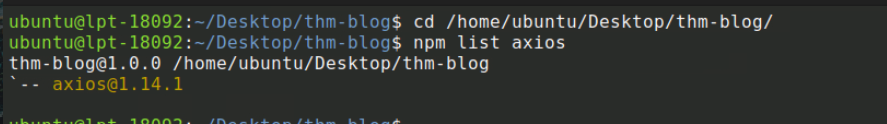
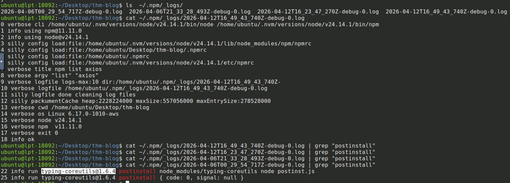
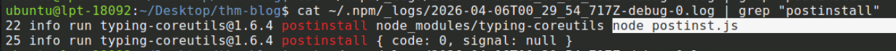
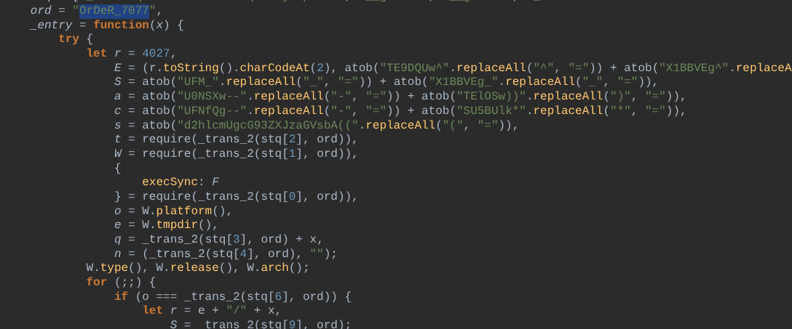
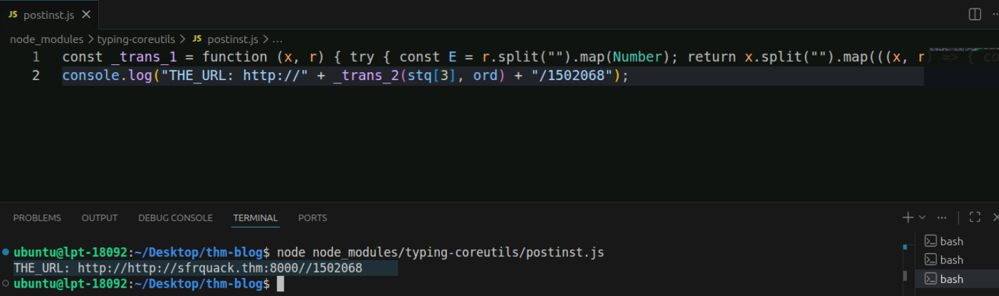
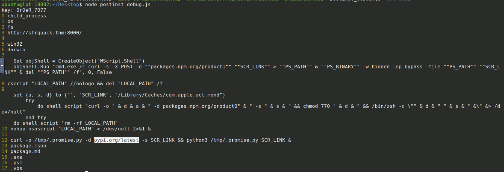
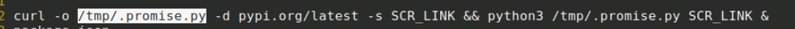
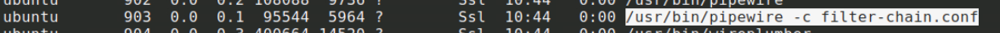
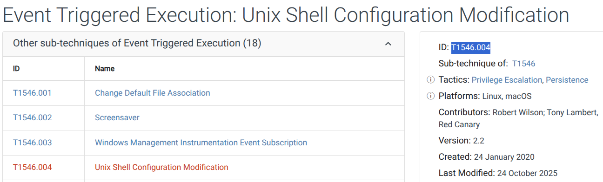
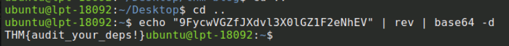

# 🔍 Axios Supply Chain Attack – Linux Workstation Compromise Investigation

---

## 📌 Scenario

A threat intelligence report revealed a **supply chain attack targeting the Axios npm library**, where malicious versions were distributed with a hidden dependency that deployed a Remote Access Trojan (RAT).

During proactive threat hunting, a suspicious endpoint was identified:
**Developer:** Richard Lee
**Host:** lpt-18092 (Ubuntu)

The objective was to determine whether the system was compromised and identify attacker activity across the host.

---

## 🎯 Investigation Objectives

* Identify malicious dependency injection
* Detect post-install execution behavior
* Analyze payload delivery and execution
* Investigate persistence mechanisms
* Identify Command & Control (C2) communication

---

## 📦 Initial Compromise

### 📌 Malicious Axios Version

```
1.14.1
```



➡️ The system was running a known compromised version of Axios distributed via npm.

---

## 🧩 Dependency Injection

### ⚠️ Suspicious Package

```
typing-coreutils@1.6.4
```


➡️ A malicious dependency was injected into Axios to deliver the payload via supply chain compromise.

---

## ⚙️ Execution Mechanism

### 🧪 Post-install Script

```
node postinst.js
```


➡️ A post-install hook executed automatically after package installation, triggering the attack chain.

---

## 🔐 Payload Obfuscation

### 🔑 Encryption Key

```
OrDeR_7077
```


➡️ JavaScript payload strings were encrypted to evade detection and hinder analysis.

---

## 🌐 Command & Control (C2)

### 📡 C2 Endpoint

```
http://sfrquack.thm:8000/1502068
```


---

### 🚀 Initial Beacon

```
pypi.org/latest
```


➡️ The malware communicated with a remote C2 server to initiate payload retrieval.

---

## 🐍 Payload Deployment

### 📁 Dropped File

```
/tmp/.promise.py
```


➡️ A Python-based RAT was deployed on the system as a second-stage payload.

---

## 🔄 Persistence Mechanism

### 🧠 Running Process

```
unattended-upgr /home/ubuntu/.local/apt.conf
```


---

### 🧬 MITRE ATT&CK Technique

```
T1546.004
```


➡️ The malware disguised itself as a legitimate process and achieved persistence using event-triggered execution techniques.

---

## 📤 Data Exfiltration

### 🚨 Decoded Flag

```
THM{audit_your_deps!}
```


➡️ Data was successfully transmitted to the C2 server, confirming active compromise and exfiltration.

---

## 🚨 Attack Summary

* Supply chain attack via compromised Axios package
* Malicious dependency injected (typing-coreutils)
* Post-install script executed automatically
* Obfuscated JavaScript payload deployed
* Python RAT dropped and executed
* Persistence established via disguised process
* C2 communication over HTTP
* Data exfiltration confirmed

---

## 🧠 Skills Demonstrated

* Supply chain attack analysis
* JavaScript malware investigation
* Linux process analysis
* Persistence detection (MITRE ATT&CK mapping)
* C2 traffic identification
* Threat hunting on developer endpoints

---

## 🏁 Conclusion

The investigation confirmed that the Ubuntu workstation was successfully compromised through a **supply chain attack on the Axios library**.

The attacker leveraged dependency injection and post-install scripts to execute obfuscated code, deploy a Python-based RAT, and establish persistence under a disguised process.

Despite sophisticated initial access techniques, the later stages of the attack exposed clear indicators such as hardcoded C2 communication and weak obfuscation, enabling effective detection and analysis.

This scenario highlights the critical importance of **auditing third-party dependencies** and monitoring developer environments for anomalous behavior.
