# Splunk 2: Boss of the SOC v2 — CTF Writeup

* **Platform:** TryHackMe  
* **Room:** Splunk 2 (BOTSv2)  
* **Category:** SIEM / Threat Hunting / APT Investigation  
* **Difficulty:** Hard  
* **Analyst:** Mahmoud Hussien 
* **Dataset:** BOTSv2 (August 2017)  
* **Persona:** Alice Bluebird, SOC Analyst at Frothly

---

## Scenario Overview

As SOC Analyst Alice Bluebird, the task is to investigate a series of incidents within Frothly (a beer company) using the BOTSv2 Splunk dataset. The investigation spans four series of escalating complexity: insider threat activity (100s), web application attacks (200s), ransomware and macOS malware (300s), and an Advanced Persistent Threat campaign by the Taedonggang APT group (400s).

---

## 100 Series — Insider Threat: Amber Turing

---

### Question 1 — What website domain did Amber visit to find competitor contact information?

**SPL Query:**

```spl
index=botsv2 sourcetype="stream:http" 10.0.2.101
NOT (site=*microsoft.com OR site=*bing.com OR site=*msn.com
     OR site=*atwola.com OR site=*symcd.com OR site=*gvt1.com OR site=*google.com)
| dedup site
| table site
```

**Investigation:**

- Mapped Amber's username to IP `10.0.2.101` via Palo Alto firewall logs.
- Filtered HTTP stream traffic from her IP, excluding known legitimate domains.
- A distinct commercial beverage industry domain surfaced — a direct competitor to Frothly.

**Answer:**

```
www[.]berkbeer[.]com
```
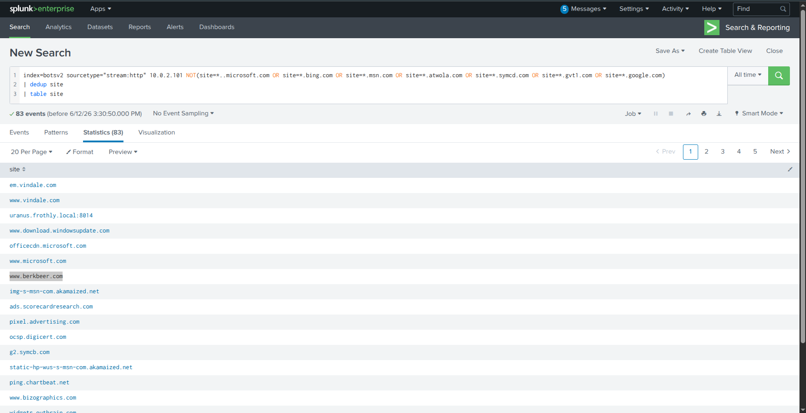

---

### Question 2 — What image file displayed the executive's contact information?

**SPL Query:**

```spl
index=botsv2 sourcetype="stream:http" 10.0.2.101 www.berkbeer.com
| table uri_path
```

**Investigation:**

- Isolated all URI paths Amber requested from `berkbeer.com` — returned 12 events.
- Among the asset paths, one image filename explicitly referenced a CEO role.

**Answer:**

```
/images/ceoberk.png
```
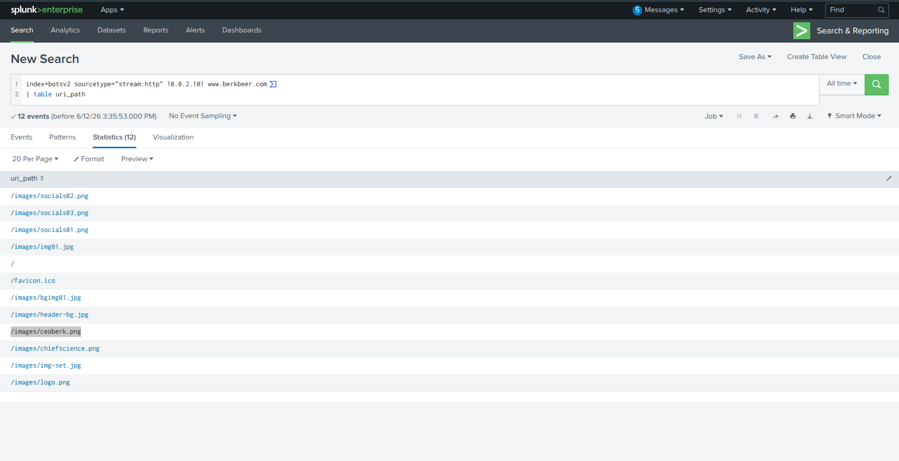

---

### Question 3 — What is the CEO's name?

**SPL Query:**

```spl
index=botsv2 sourcetype="stream:smtp" aturing@froth.ly berkbeer.com
```

**Investigation:**

- Intercepted the outbound SMTP stream from Amber's email to `berkbeer.com`.
- Parsed the raw email body — the reply block contained the CEO's greeting and email signature.

**Answer:**

```
Martin Berk
```
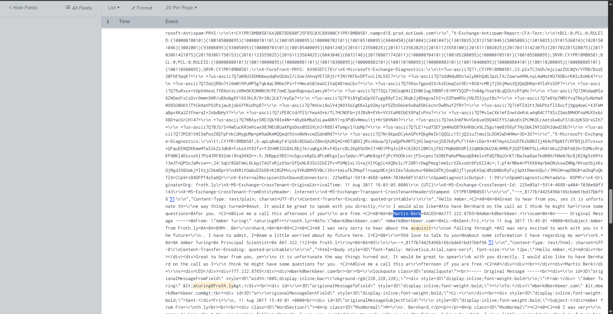

---

### Question 4 — What is the CEO's email address?

Using the same SMTP stream query, the `To:` field and sender metadata confirmed the email address:

**Answer:**

```
mberk@berkbeer.com
```
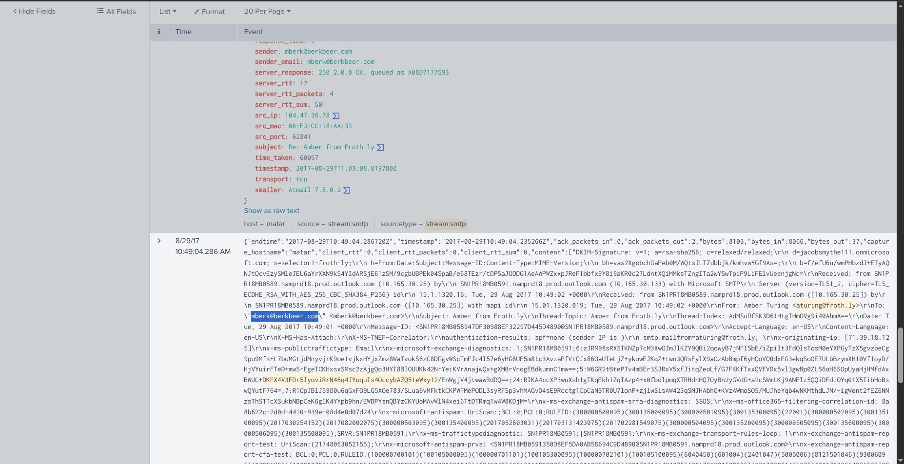

---

### Question 5 — What is the email address of the second competitor employee Amber contacted?

**SPL Query:**

```spl
index=botsv2 sourcetype="stream:smtp" aturing@froth.ly berkbeer.com
```

**Investigation:**

- Continued reviewing SMTP events from the same stream.
- A secondary transaction was identified via the subject line `"Heinz Bernhard Contact Information"`.
- The `sender_email` field exposed a new contact identity.

**Answer:**

```
hbernhard@berkbeer.com
```
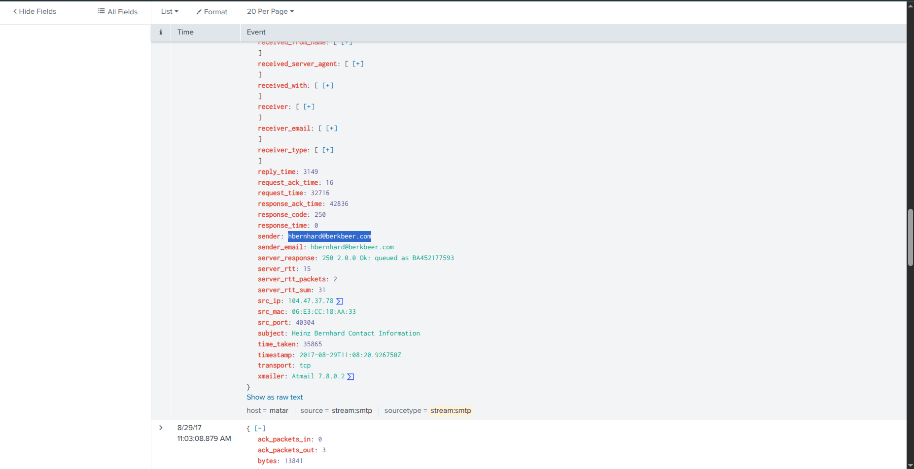

---

### Question 6 — What is the name of the file attachment Amber sent to the competitor?

**SPL Query:**

```spl
index=botsv2 sourcetype="stream:smtp" aturing@froth.ly berkbeer.com
```

**Investigation:**

- Expanded the MIME metadata fields (`attach_disposition`, `attach_filename`) for the email to Heinz Bernhard.
- A proprietary Word document was found attached — confirming an **insider threat data exfiltration** event.

| Field | Value |
|---|---|
| Recipient | `hbernhard@berkbeer.com` |
| File Name | `Saccharomyces_cerevisiae_patent.docx` |
| MIME Type | `application/vnd.openxmlformats-officedocument.wordprocessingml.document` |
| Size | 142,548 bytes |

**Answer:**

```
Saccharomyces_cerevisiae_patent.docx
```
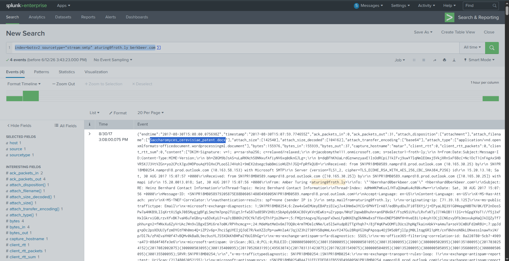

---

### Question 7 — What is Amber's personal email address?

**Investigation:**

- Extracted and Base64-decoded the raw SMTP transmission payload from the exfiltration stream.
- The decoded HTML body contained a `mailto:` link revealing Amber's covert personal email — used to route communications outside corporate monitoring.

**Answer:**

```
ambersthebest@yeastiebeastie.com
```
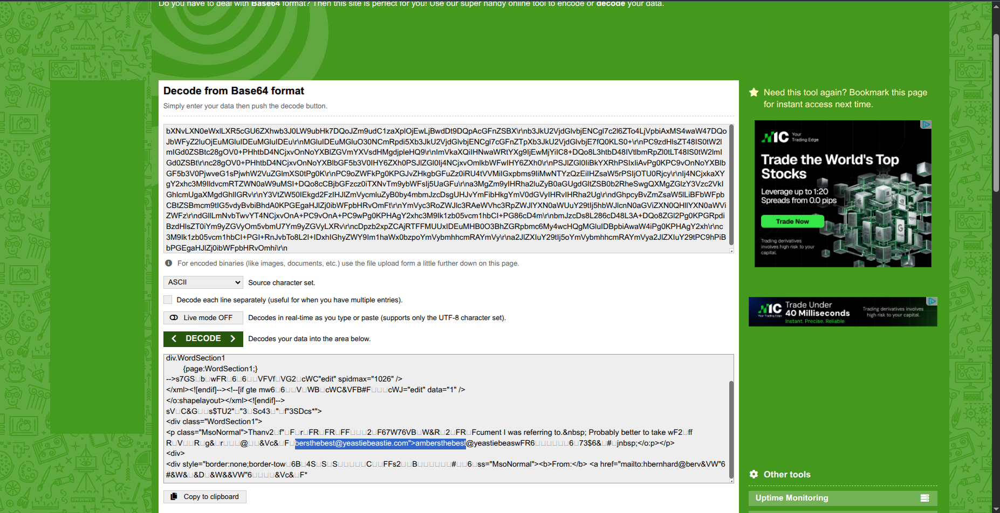

---

## 200 Series — Web Attacks & Anonymization

---

### Question 8 — What version of Tor Browser did Amber install?

**SPL Query:**

```spl
index=botsv2 amber tor sourcetype="XmlWinEventLog:Microsoft-Windows-Sysmon/Operational"
```

**Investigation:**

- Pivoted from network layer to host-based Sysmon logs on `wrk-aturing.frothly.local`.
- File creation and process execution events in Amber's Downloads folder exposed the Tor installer.

```
C:\Users\amber.turing\Downloads\torbrowser-install-7.0.4_en-US.exe
```

**Answer:**

```
7.0.4
```
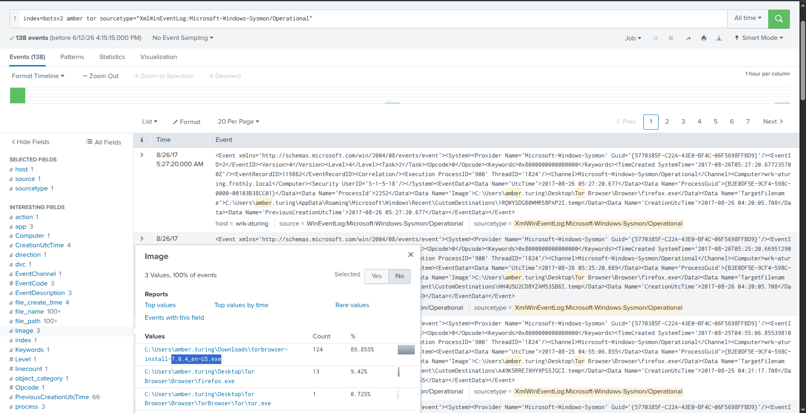

---

### Question 9 — What is the public IPv4 address of the server running www.brewertalk.com?

**SPL Query:**

```spl
index=botsv2 brewertalk.com
```

**Investigation:**

- Queried 12,566 events and analyzed the `dest_ip` field distribution.
- Internal AWS addresses (`172.31.x.x`) accounted for the majority of traffic.
- The external public IP was isolated at 4.3% of total volume (473 events).

| IP | Role | Volume |
|---|---|---|
| `172.31.4.249` | Internal forwarder | 88.4% |
| `172.31.0.2` | Internal forwarder | 5.6% |
| `52.42.208.228` | **Public server IP** | 4.3% |

**Answer:**

```
52[.]42[.]208[.]228
```
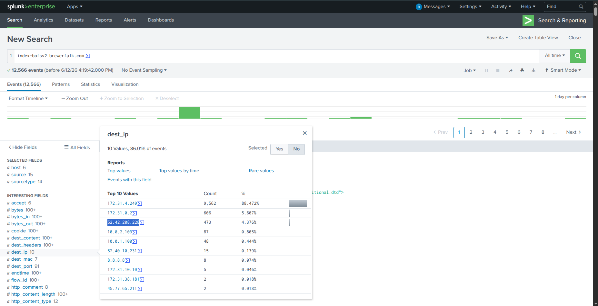

---

### Question 10 — What IP address was used to run a web vulnerability scan against www.brewertalk.com?

**SPL Query:**

```spl
index=botsv2 brewertalk.com
```

**Investigation:**

- Analyzed `src_ip` distribution for anomalous request volumes.
- Legitimate user traffic is low-frequency and distributed; scanner traffic is high-volume and concentrated.
- One IP generated **8,966 events** — representing **83% of all traffic** to the site.

**Answer:**

```
45[.]77[.]65[.]211
```
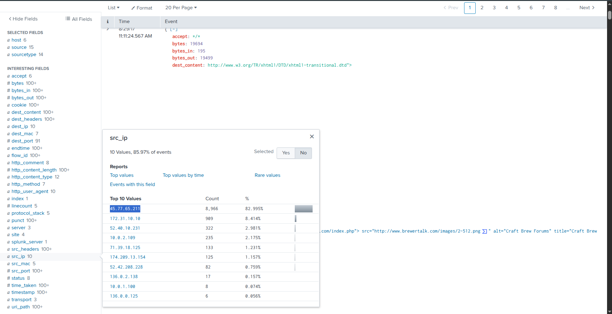

---

### Question 11 — What URI path is being attacked by the scanner IP?

**SPL Query:**

```spl
index=botsv2 brewertalk.com sourcetype="stream:http" 45.77.65.211
```

**Investigation:**

- Filtered HTTP stream traffic from the scanner IP against `brewertalk.com`.
- Analyzed `uri_path` distribution — one endpoint received **662 requests**.
- Raw packet inspection confirmed SQL injection payloads targeting this path.

**Answer:**

```
/member.php
```
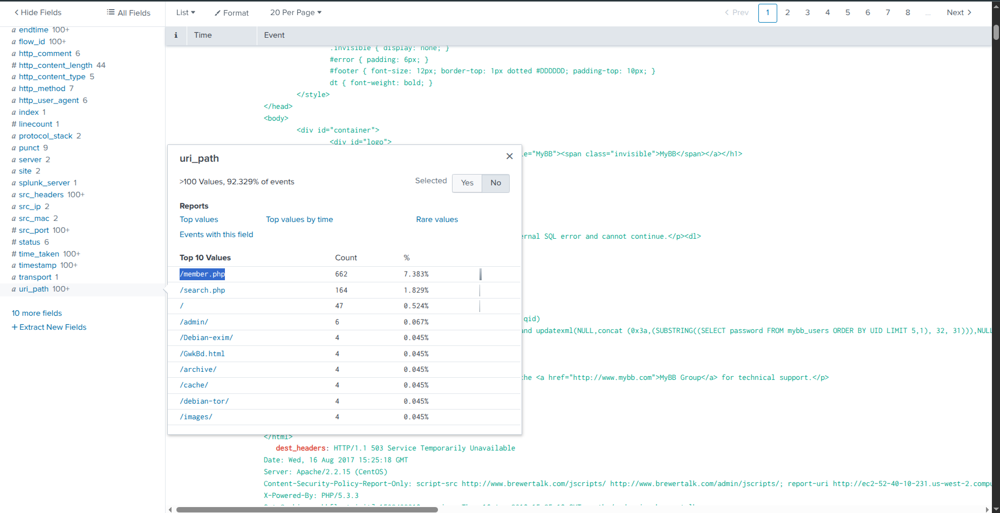

---

### Question 12 — What SQL function is being abused on that URI path?

**SPL Query:**

```spl
index=botsv2 brewertalk.com sourcetype="stream:http" 45.77.65.211 uri_path="/member.php"
| dedup form_data
| table form_data
```

**Investigation:**

- Parsed `form_data` field from POST requests to `/member.php`.
- Identified **Error-Based SQL Injection** using a specific MySQL XML function.

**Payload Pattern Observed:**

```sql
AND updatexml(NULL, concat(0x3a, (SUBSTRING((SELECT password FROM mybb_users ...)))))
```

**Answer:**

```
updatexml
```
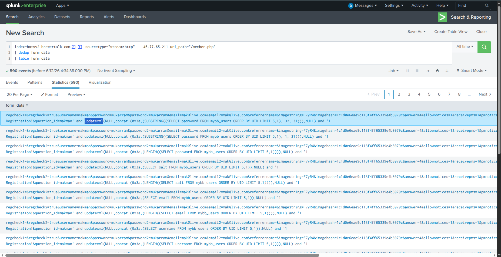

---

### Question 13 — What was the value of the cookie transmitted during Kevin's XSS attack?

**SPL Query:**

```spl
index=botsv2 Kevin sourcetype="stream:http" tag=error
| table cookie
```

**Investigation:**

- Filtered HTTP errors linked to Kevin's session — returned 9 events.
- Parsed the `cookie` field to extract the session variables transmitted in Kevin's browser headers.

| Cookie Name | Value |
|---|---|
| `mybb[lastvisit]` | `1502408189` |
| `adminsid` | `9267f9cec584473a8d151c25ddb691f1` |

**Answer:**

```
1502408189
```
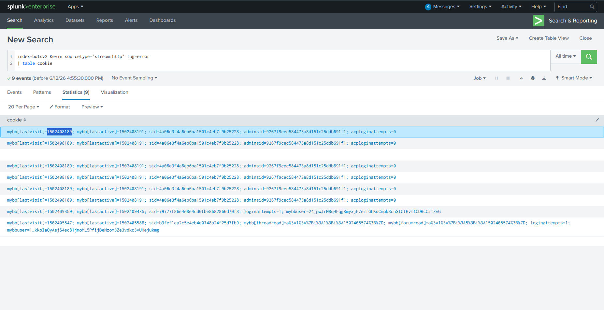

---

### Question 14 — What brewertalk.com username was maliciously created via spear phishing?

**SPL Query:**

```spl
index=botsv2 1bc3eab741900ab25c98eee86bf20feb brewertalk.com
| table form_data
```

**Investigation:**

- Tracked the stolen Anti-CSRF token (`1bc3eab741900ab25c98eee86bf20feb`) used in the forced registration.
- Parsed `form_data` from POST requests — revealed a homograph spoofing attack on the username field.

| Field | Value |
|---|---|
| Username | `kIagerfield` (capital `I` instead of lowercase `l`) |
| Password | `beer_lulz` |
| Email | `kIagerfield@froth.ly` |
| Group | `4` (elevated/admin) |

**Answer:**

```
kIagerfield
```
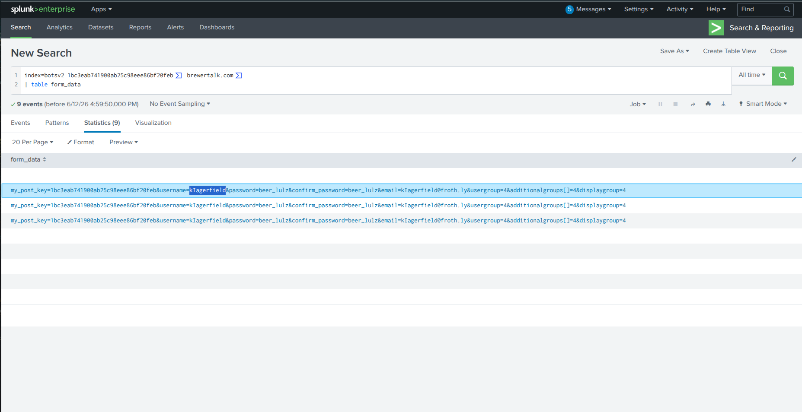

---

## 300 Series — Ransomware & macOS Malware

---

### Question 15 — What is the name of Mallory's PowerPoint file after encryption?

**SPL Query:**

```spl
index=botsv2 host="MACLORY-AIR13" (*.ppt OR *.pptx)
```

**Investigation:**

- Filtered osquery file events on Mallory's MacBook for PowerPoint extensions.
- A `calendarTime` entry on August 18, 2017 captured the file state change.

| State | Filename |
|---|---|
| Original | `Frothly_marketing_campaign_Q317.pptx` |
| Encrypted | `Frothly_marketing_campaign_Q317.pptx.crypt` |

**Answer:**

```
Frothly_marketing_campaign_Q317.pptx.crypt
```
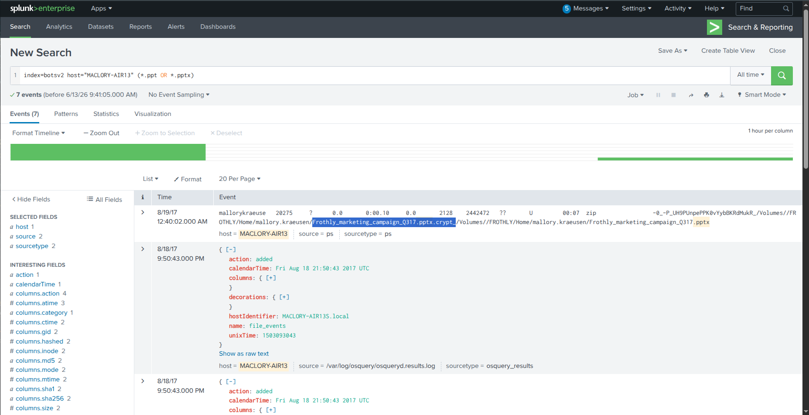

---

### Question 16 — What Game of Thrones episode was encrypted?

**SPL Query:**

```spl
index=botsv2 host="MACLORY-AIR13" sourcetype=ps *.crypt NOT *.pdf
```

**Investigation:**

- Filtered process logs for `.crypt` files excluding PDFs — surfaced 744 events.
- An `unzip` execution chain revealed the exact media file targeted by the ransomware.

```
GoT.S07E02.BOTS.BOTS.BOTS.mkv.crypt
```

**Answer:**

```
S07E02
```
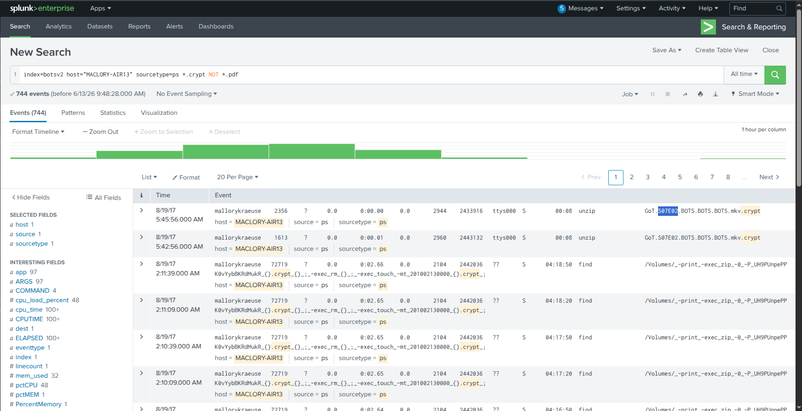

---

### Question 17 — What is the vendor name of the USB drive Kevin used?

**SPL Queries:**

```spl
-- Step 1: Identify malware file creation timestamp
index=botsv2 host="kutekitten" sourcetype="osquery_results" "Important_HR_INFO"

-- Step 2: USB device insertion 57 seconds before
index=botsv2 host="kutekitten" source="/var/log/osquery/osqueryd.results.log" usb_devices
```

**Investigation:**

- Malware file `Important_HR_INFO_for_mkraeusen` was created at **Aug 3, 2017 @ 18:19:07 UTC**.
- USB device `action=added` event was logged at **18:18:10 UTC** — exactly 57 seconds earlier.
- Hardware IDs: `vendor_id=058f`, `model_id=6387` → resolved via USB ID database.

**Answer:**

```
Alcor Micro Corp
```
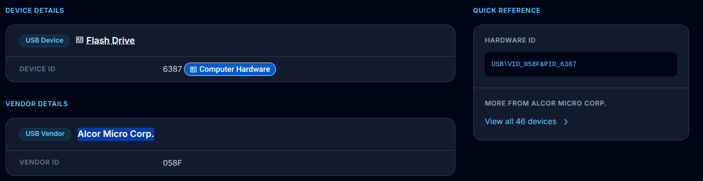

---

### Question 18 — What programming language is the malware written in?

**Investigation:**

- SHA-256 hash `befa9bfe488244c64db096522b4fad73fc01ea8c4cd0323f1cbdee81ba008271` was submitted to VirusTotal.
- Identified as **OSX.FruitFly (Quimitchin)** — a macOS backdoor.
- Execution characteristics confirmed runtime via system Perl interpreter (no binary compilation).

**Answer:**

```
Perl
```
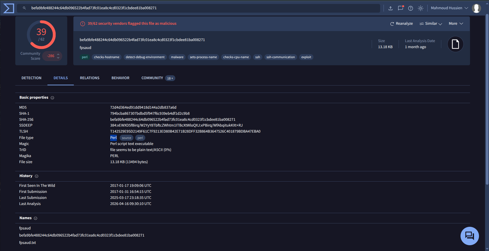

---

### Question 19 — When was this malware first seen in the wild?

**Investigation:**

- VirusTotal historical metadata for the SHA-256 hash.
- `First Seen In The Wild` field extracted from the History section.

**Answer:**

```
2017-01-17
```
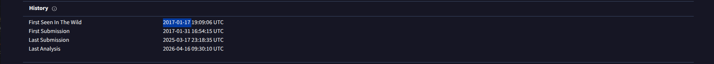

---

### Question 20 — What is the first (alphabetically) C&C server FQDN?

**SPL Query:**

```spl
index=botsv2 host="kutekitten" sourcetype="stream:dns"
(query="*duckdns.org" OR query="*hopto.org")
| table _time, src, query, answer
```

**Investigation:**

- Sandbox behavioral analysis (Hybrid Analysis) for the `fpsaud` Perl script showed two outbound DDNS destinations.
- Alphabetically sorted: `eidk.duckdns.org` comes before `eidk.hopto.org`.

**Answer:**

```
eidk.duckdns.org
```
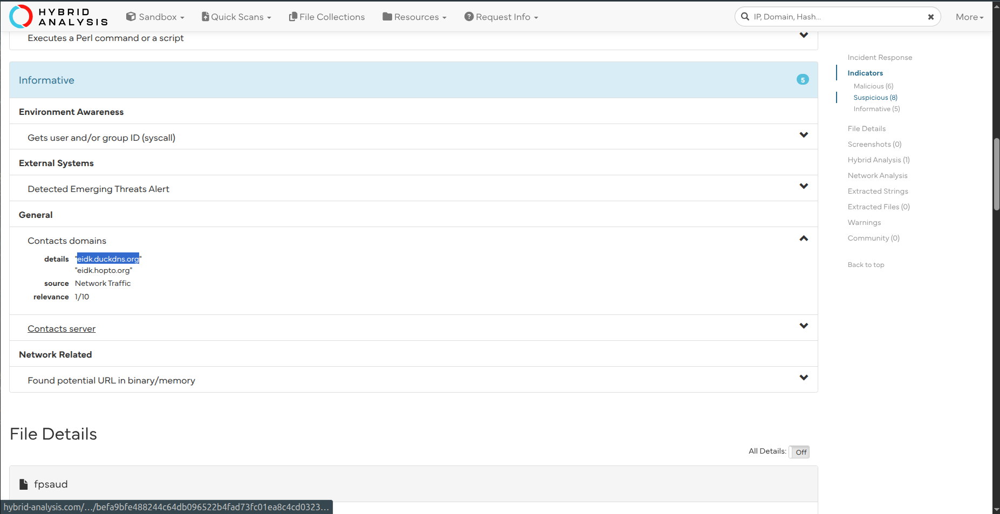

---

### Question 21 — What is the second (alphabetically) C&C server FQDN?

**Answer:**

```
eidk.hopto.org
```
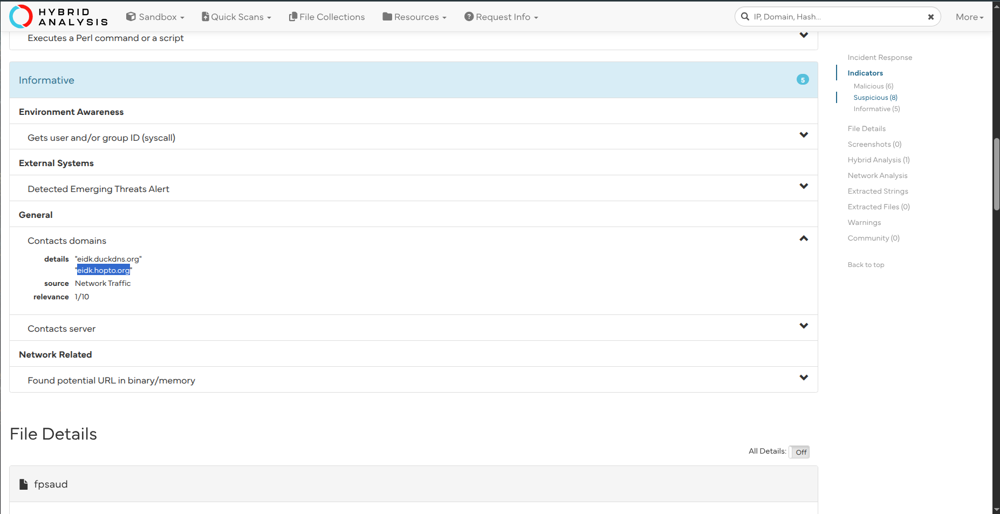

---

## 400 Series — Taedonggang APT

---

### Question 22 — What is the name of the attachment sent by the Taedonggang actor?

**SPL Query:**

```spl
index=botsv2 sourcetype="stream:smtp" *.zip
| reverse
```

**Investigation:**

- Queried SMTP streams for ZIP file attachments and reversed chronological order.
- Isolated the initial delivery event attributed to the Taedonggang APT framework.

**Answer:**

```
invoice.zip
```
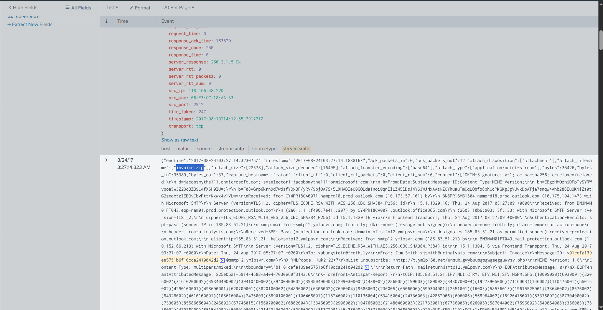

---

### Question 23 — What is the password to open the zip file?

**SPL Query:**

```spl
index=botsv2 sourcetype="stream:smtp" "invoice.zip" "password"
| table _time, src_ip, attachment_names, body
```

**Investigation:**

- The attacker embedded the decryption password directly in the email body — a standard social engineering technique to force user interaction while bypassing automated sandbox detonation.

**Answer:**

```
912345678
```
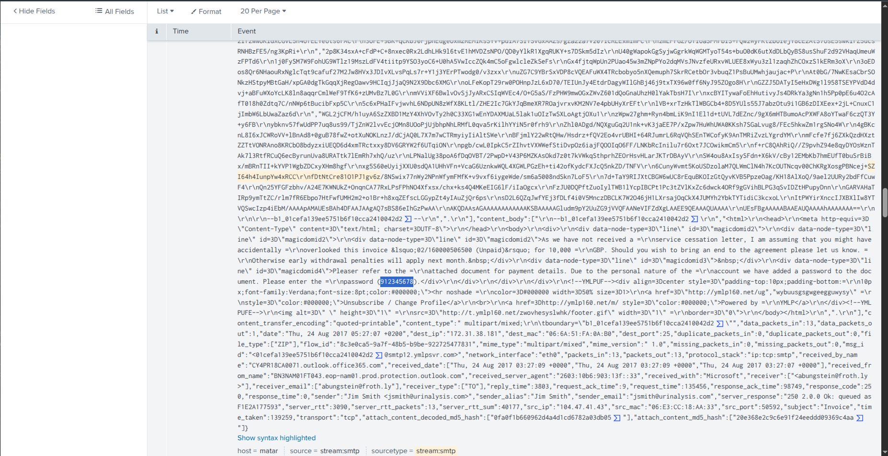

---

### Question 24 — What is the SSL Issuer used by Taedonggang for most of their traffic?

**SPL Query:**

```spl
index=botsv2 sourcetype="stream:tcp" 45.77.65.211
| dedup ssl_issuer
| table ssl_issuer
```

**Investigation:**

- Aggregated all TLS handshake metadata and ranked by `ssl_issuer` field.
- A minimalist self-signed certificate with only a country code dominated: **1,605 sessions (45.41%)**.
- Self-signed certs with minimal fields are a strong indicator of attacker-controlled infrastructure.

**Answer:**

```
C = US
```
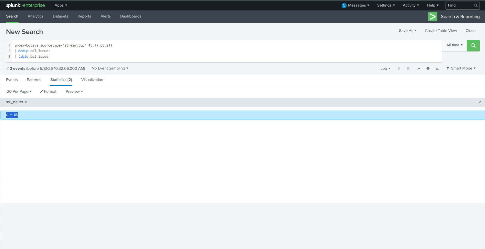

---

### Question 25 — What is the name of the person implicated in the document metadata?

**SPL Query:**

```spl
index=botsv2 sourcetype="XmlWinEventLog:Microsoft-Windows-Sysmon/Operational"
EventCode=1 "powershell.exe" "invoice.doc"
| table _time, host, user, CommandLine
```

**Investigation:**

- Static OLE metadata analysis of `invoice.doc` (SHA-256: `d8834aaa5ad6d8ee5ae71e042aca5cab960e73a6827e45339620359633608cf1`).
- The `Author` and `Last Saved By` fields inside the document properties exposed the implicated identity.

| Field | Value |
|---|---|
| Author | `Ryan Kovar` |
| Last Saved By | `Ryan Kovar` |
| Template | `Normal.dotm` |
| Revisions | 3 |

**Answer:**

```
Ryan Kovar
```
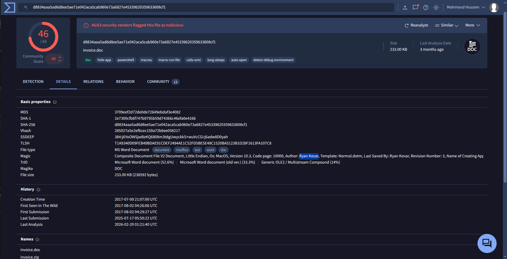

---

### Question 26 — What kind of points is mentioned in the document text?

**Investigation:**

- Detonated `invoice.doc` (MD5: `3709EEF2D72DE0DE72649EBDAF3E4082`) inside ANY.RUN sandbox.
- The visible document body rendered a hidden message directed at analysts before macro execution:

> *"Congrats! It looks like you have a virustotal account and chose to live on the edge. If you find this... turn it in for some CyberEastEgg points!!!"*

**Answer:**

```
CyberEastEgg
```

---

### Question 27 — What single webpage is most contacted by the Taedonggang scheduled tasks?

**SPL Query:**

```spl
index=botsv2 source=WinRegistry "\\Software\\Microsoft\\Network"
| reverse
```

**Investigation:**

- Analyzed Windows Registry modifications targeting `HKLM\software\microsoft\network\debug`.
- Decoded the Base64-obfuscated PowerShell payload stored in the registry `data` field.
- The decoded stager revealed the C2 beaconing target endpoint.

**Answer:**

```
process.php
```

---

## Full Attack Summary by Threat Actor

### Threat 1: Insider — Amber Turing

```
[1] Visited competitor: www.berkbeer.com
[2] Retrieved CEO contact: /images/ceoberk.png
[3] Emailed CEO: mberk@berkbeer.com
[4] Emailed second contact: hbernhard@berkbeer.com
[5] Leaked patent: Saccharomyces_cerevisiae_patent.docx
[6] Installed Tor Browser 7.0.4 for anonymization
[7] Personal email: ambersthebest@yeastiebeastie.com
```

### Threat 2: Web Attacker (45.77.65.211)

```
[1] Scanned: www.brewertalk.com (52.42.208.228)
[2] Targeted: /member.php (662 requests)
[3] Attack type: Error-Based SQLi via updatexml()
[4] Goal: Extract credentials from mybb_users table
[5] XSS attack → stole Kevin's session cookie: 1502408189
[6] CSRF token abuse → created fake user: kIagerfield
```

### Threat 3: Ransomware (Mallory's MacBook)

```
[1] Kevin plugged Alcor Micro USB on kutekitten
[2] Dropped: Important_HR_INFO_for_mkraeusen (Perl malware)
[3] Malware family: OSX.FruitFly | First seen: 2017-01-17
[4] C&C: eidk.duckdns.org, eidk.hopto.org
[5] Ransomware on MACLORY-AIR13:
    └─ Frothly_marketing_campaign_Q317.pptx → .pptx.crypt
    └─ GoT.S07E02.BOTS.BOTS.BOTS.mkv → .mkv.crypt
```

### Threat 4: Taedonggang APT

```
[1] Delivered: invoice.zip (password: 912345678) via phishing
[2] Executed: invoice.doc → PowerShell Empire via macro
[3] Metadata implicated: Ryan Kovar (false flag)
[4] SSL: self-signed certs (C = US)
[5] Persistence: Scheduled Tasks → registry-stored Base64 payload
[6] C2 beacon target: process.php
```

---

## Indicators of Compromise (IOCs)

| Type | Value | Description |
|---|---|---|
| Domain | `www.berkbeer.com` | Competitor site visited by insider |
| Email | `ambersthebest@yeastiebeastie.com` | Amber's covert personal email |
| File | `Saccharomyces_cerevisiae_patent.docx` | Exfiltrated patent document |
| IP | `45.77.65.211` | Web vulnerability scanner / attacker |
| IP | `52.42.208.228` | brewertalk.com public server |
| Cookie | `1502408189` | Kevin's stolen session cookie |
| Username | `kIagerfield` | Maliciously created forum account |
| File | `Frothly_marketing_campaign_Q317.pptx.crypt` | Encrypted ransomware victim file |
| File | `GoT.S07E02.BOTS.BOTS.BOTS.mkv.crypt` | Encrypted media file |
| SHA-256 | `befa9bfe488244c64db096522b4fad73fc01ea8c4cd0323f1cbdee81ba008271` | OSX.FruitFly sample |
| Domain | `eidk.duckdns.org` | FruitFly C&C (primary) |
| Domain | `eidk.hopto.org` | FruitFly C&C (secondary) |
| File | `invoice.zip` | Taedonggang phishing attachment |
| SSL Issuer | `C = US` | Taedonggang self-signed cert |
| Registry | `HKLM\software\microsoft\network\debug` | Taedonggang fileless persistence |
| Webpage | `process.php` | Taedonggang C2 beacon endpoint |

---

## MITRE ATT&CK Mapping

| Phase | Technique ID | Technique Name |
|---|---|---|
| Insider Threat | T1048 | Exfiltration Over Alternative Protocol |
| Insider Threat | T1567 | Exfiltration Over Web Service |
| Defense Evasion | T1090.003 | Proxy: Multi-hop (Tor) |
| Web Attack | T1190 | Exploit Public-Facing Application |
| Web Attack | T1059.007 | JavaScript (XSS payload) |
| Credential Access | T1539 | Steal Web Session Cookie |
| Persistence | T1098 | Account Manipulation (kIagerfield) |
| macOS Malware | T1059.006 | Python / Perl scripting |
| C2 | T1568.003 | DNS Calculation (Dynamic DNS) |
| Impact | T1486 | Data Encrypted for Impact (Ransomware) |
| APT Initial Access | T1566.001 | Phishing: Spearphishing Attachment |
| APT Persistence | T1053.005 | Scheduled Task |
| APT Evasion | T1112 | Modify Registry |
| APT Evasion | T1027 | Obfuscated Files or Information |
| APT C2 | T1573.001 | Encrypted Channel (SSL) |

---

*Writeup produced as part of SOC Analyst training — TryHackMe: Splunk 2 (BOTSv2)*