# 🧠 BOTSv2 – Advanced Threat Hunting & APT Investigation (Splunk)

---

## 📌 Scenario

A simulated enterprise environment was compromised by advanced threat actors, including insider activity and external APT groups. Logs from multiple sources (Windows endpoints, network traffic, IDS, and web proxy) were ingested into Splunk (index=botsv2) for analysis.

As a SOC Analyst, the objective was to perform deep threat hunting, identify attacker behavior, trace communications, and uncover multiple stages of compromise across the environment.

---

## 🎯 Investigation Objectives

* Identify suspicious user activity and insider threats
* Detect external attacker behavior and reconnaissance
* Analyze web, email, and endpoint activity
* Investigate persistence, exploitation, and C2 communication
* Correlate events across multiple data sources

---

## 🌐 Initial Reconnaissance & Web Activity

### 👤 Suspicious User Activity (Amber Turing)

* Initial search:

```
index="botsv2" amber
```

* Identify IP from firewall logs:

```
index="botsv2" sourcetype="pan:traffic"
```

---

### 🌍 Competitor Website Visited

```
www.berkbeer.com
```
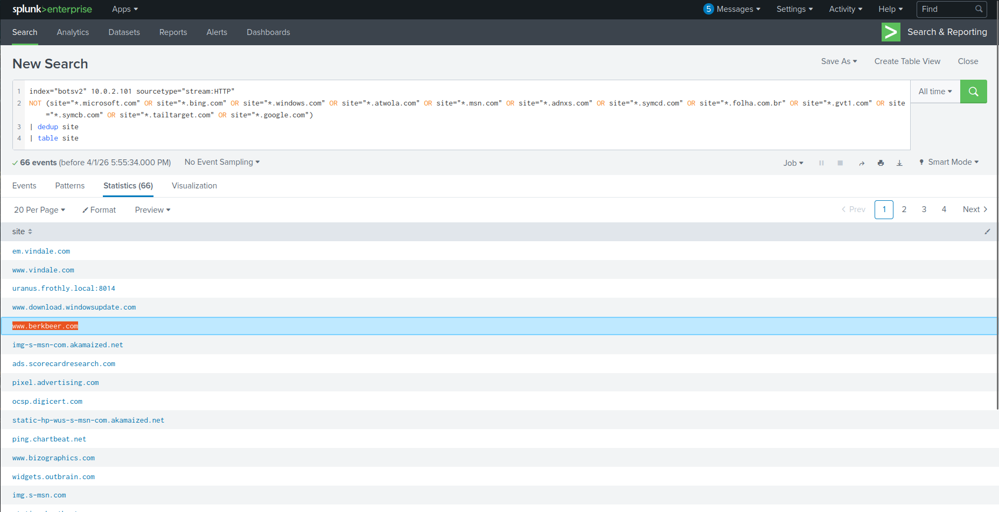

➡️ Amber accessed competitor website to gather executive contact information

---

### 🖼️ Extracted Sensitive Information

```
/images/ceoberk.png
```
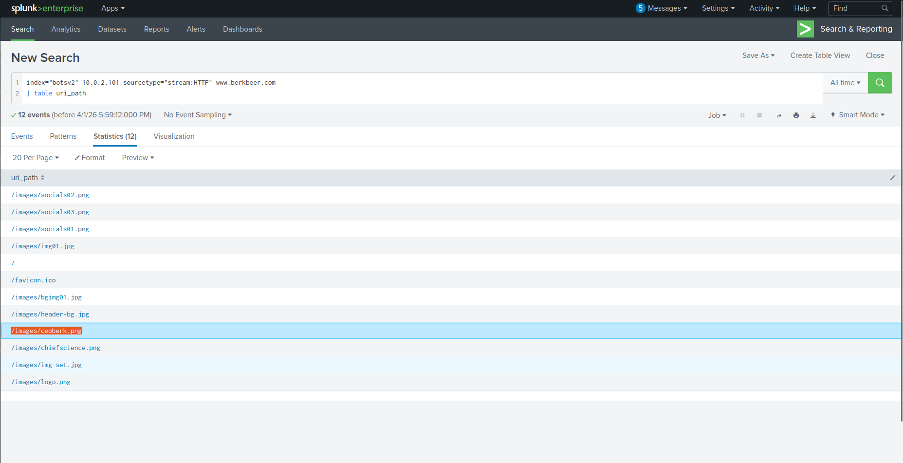

➡️ Image contained CEO contact details

---

### 👨‍💼 Targeted Executive

```
Martin Berk
mberk@berkbeer.com
```
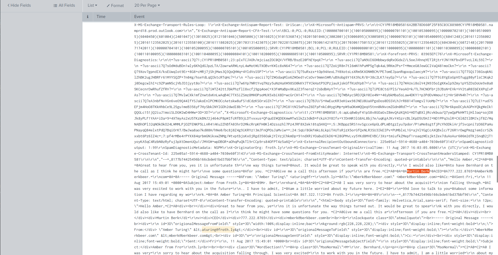
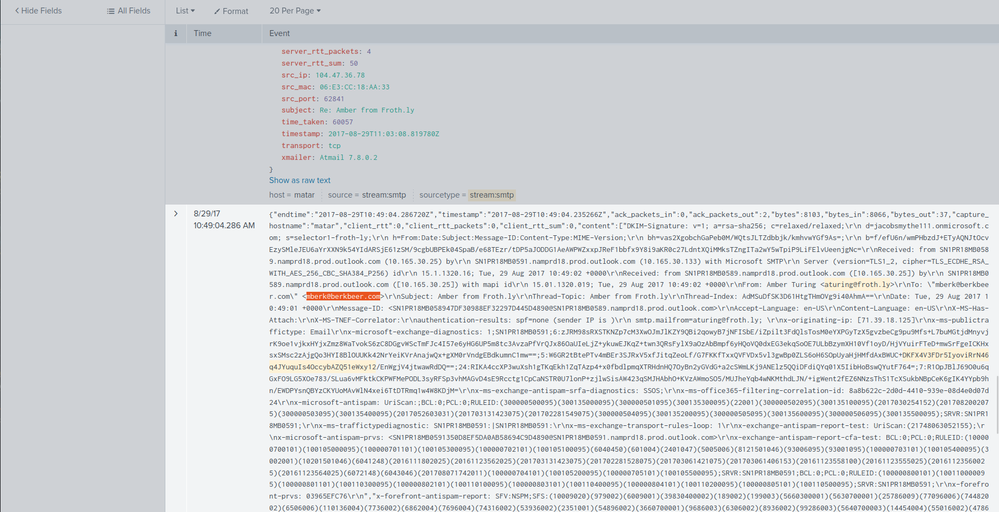

---

### 📧 Additional Contact

```
hbernhard@berkbeer.com
```
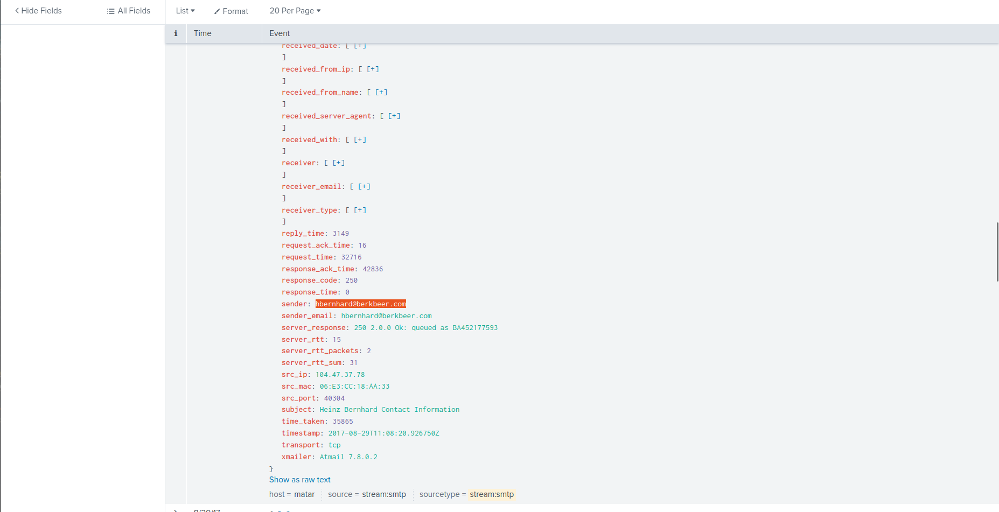

---

### 📎 Data Exfiltration

```
Saccharomyces_cerevisiae_patent.docx
```
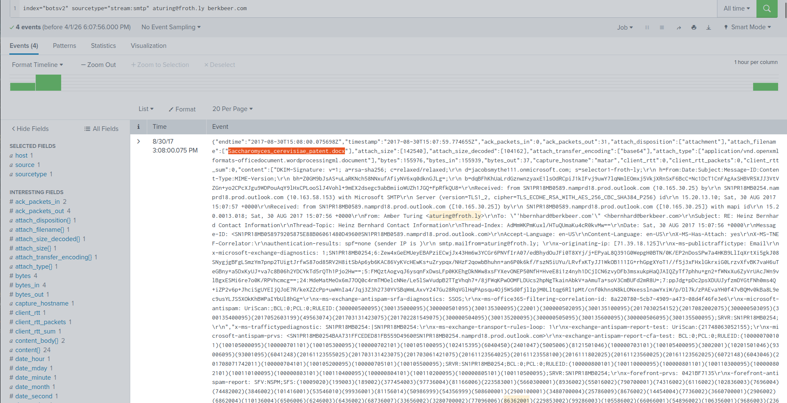

➡️ Sensitive file sent externally

---

### 🕵️ Personal Email Usage

```
ambersthebest@yeastiebeastie.com
```
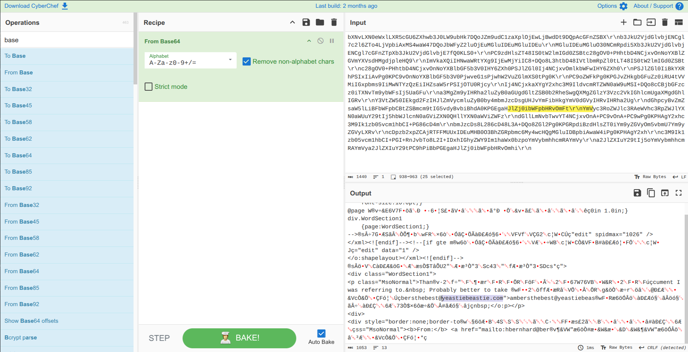

➡️ Possible insider threat behavior

---

## 🧅 Defense Evasion

### TOR Usage

```
7.0.4
```
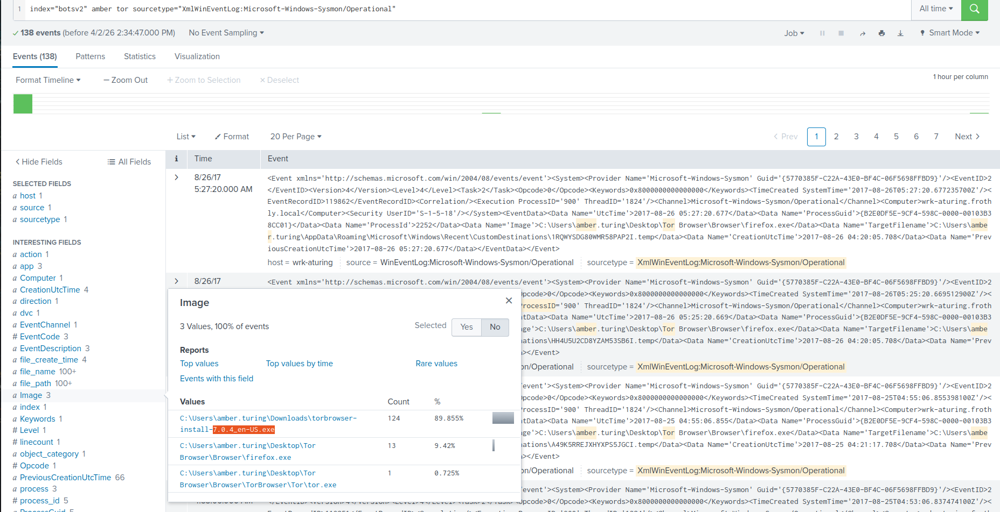

➡️ Used to anonymize activity

---

## 🌐 External Attack Activity

### 🎯 Target Server

```
www.brewertalk.com → 52.42.208.228
```
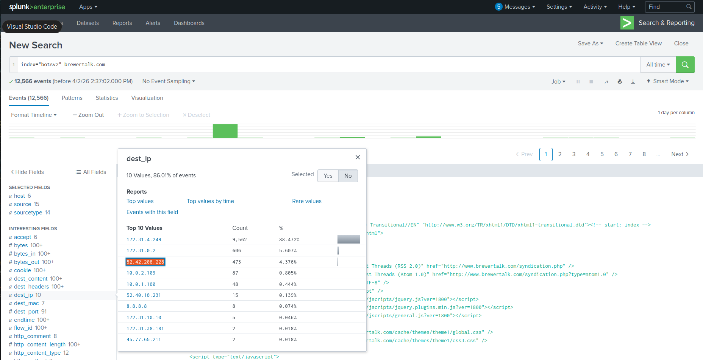


---

### ⚠️ Attacker IP

```
45.77.65.211
```
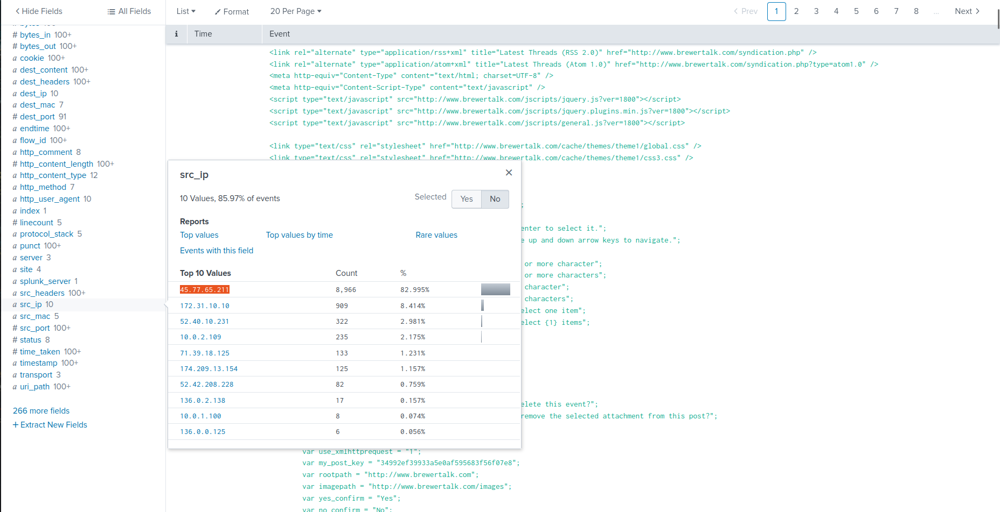

---

### 🧨 Exploited Endpoint

```
/member.php
```
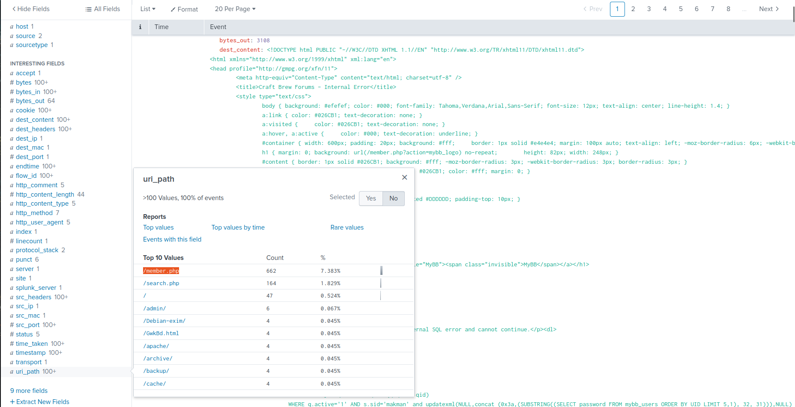

---

### 💣 SQL Injection

```
updatexml
```
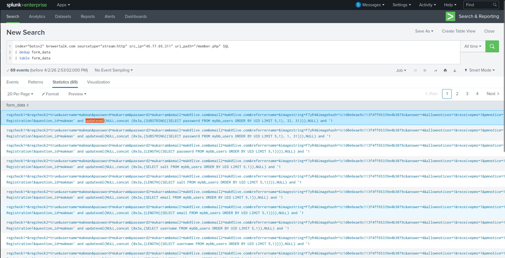

---

## 🍪 XSS Attack

### 🔓 Cookie Value

```
1502408189
```
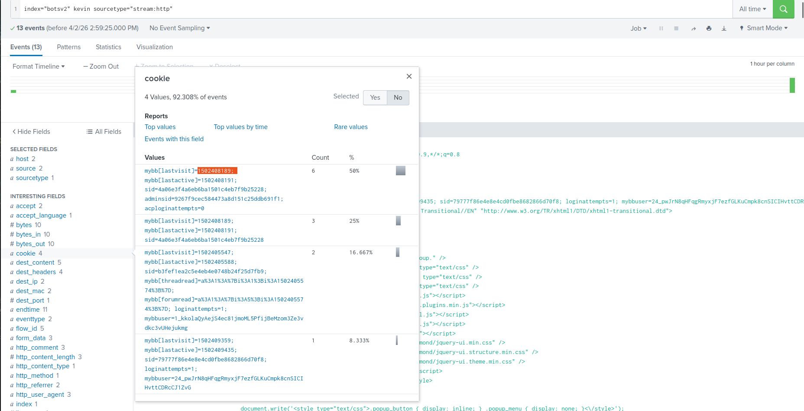

---

### 👤 Victim

```
Kevin Lagerfield
```

---

### 🎭 Malicious Account

```
kIagerfield
```
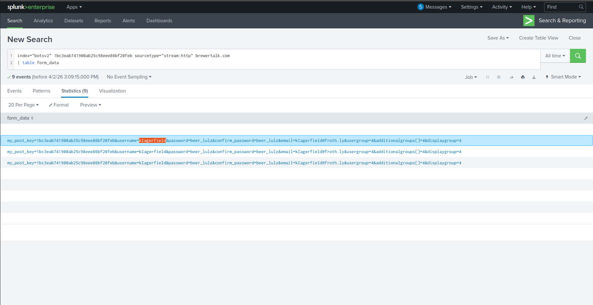

➡️ Username impersonation for persistence

---

## 💻 Endpoint Compromise (Mallory)

### 🗂️ Encrypted File

```
Frothly_marketing_campaign_Q317.pptx.crypt
```
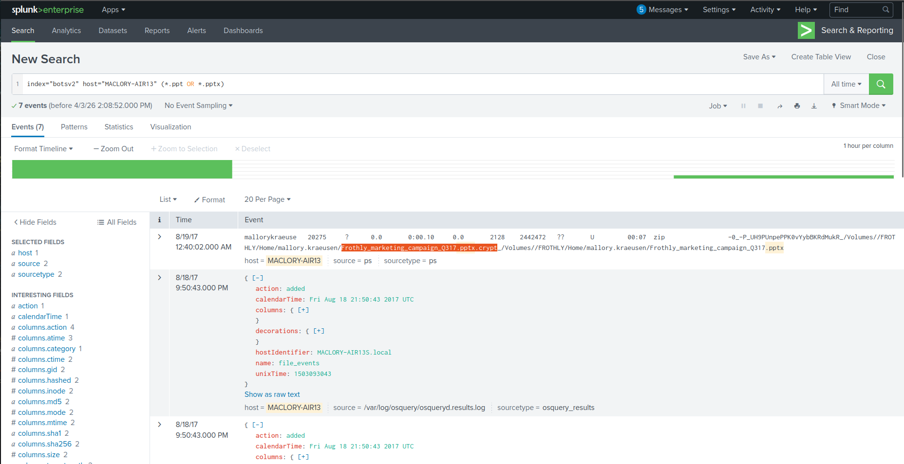

---

### 🎬 Additional File

```
S07E02
```
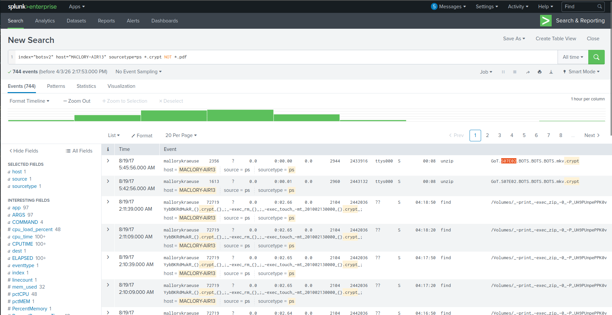

---

### 🔌 Infection Vector

```
USB – Alcor Micro Corp.
```

---

### 🧠 Malware Details

Language:

```
Perl
```

First Seen:

```
2017-01-17
```

---

### 🌐 C2 Servers

```
eidk.duckdns.org
eidk.hopto.org
```

---

## 📧 Spear Phishing

### 📎 Attachment

```
invoice.zip
```
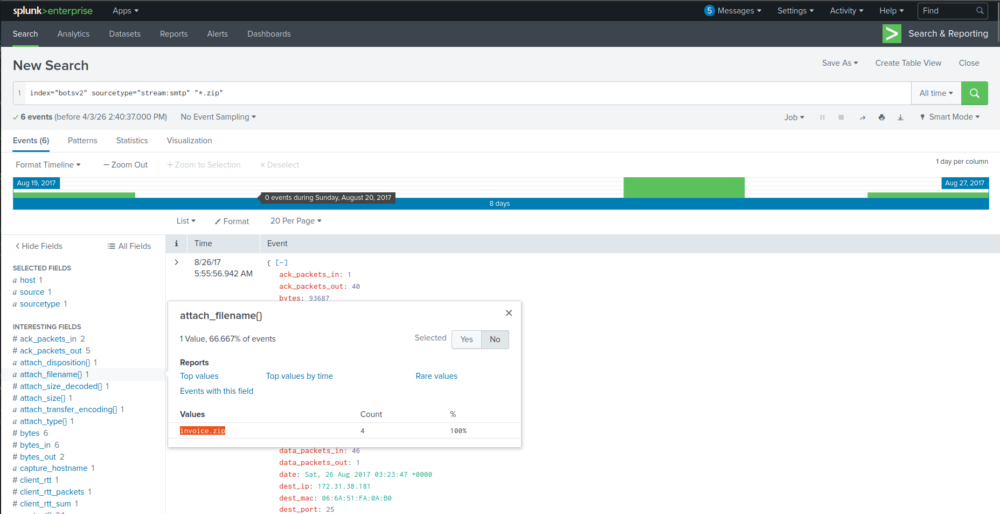

---

### 🔐 Password

```
912345678
```
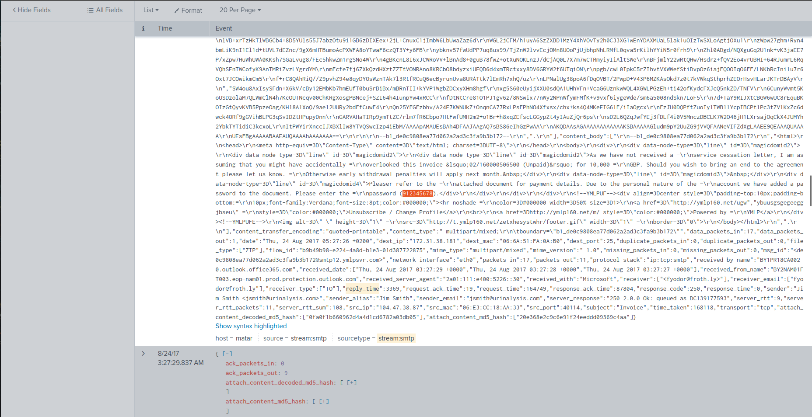

---

### 🔒 SSL Issuer

```
C = US
```
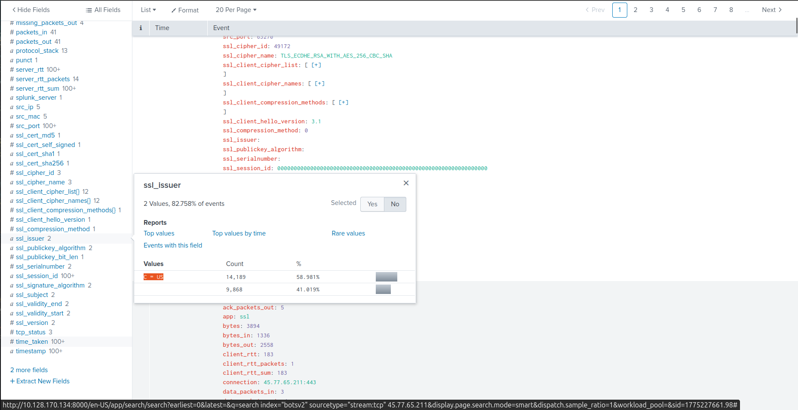

---

## 📥 Malware Activity

### ⚠️ Suspicious File

```
나는_데이비드를_사랑한다.hwp
```
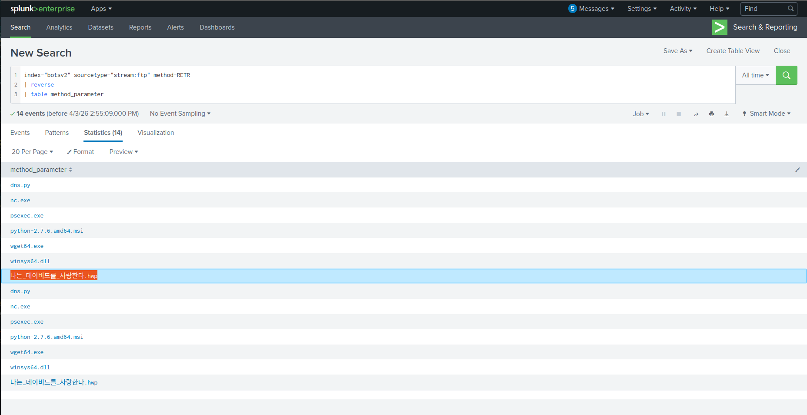

---

### 🧬 Metadata Attribution

```
Ryan Kovar
```

---

### 🧠 Marker

```
CyberEastEgg
```

---

## 🔁 Persistence

### ⚙️ Scheduled Task Beaconing

```
process.php
```

---

## 🚨 Attack Summary

* Insider threat activity (Amber Turing)
* Reconnaissance against competitor
* Data exfiltration via email
* TOR anonymization
* External scanning and exploitation
* SQL Injection & XSS
* Session hijacking
* Malware via USB
* Ransomware execution
* C2 via dynamic DNS
* Spear phishing campaign
* Persistence via tasks and fake users

---

## 🧠 Skills Demonstrated

* Splunk Threat Hunting
* Log Correlation
* Web Attack Detection
* Insider Threat Analysis
* Malware Investigation
* Network Analysis
* Endpoint Forensics
* C2 Detection

---

## 🏁 Conclusion

This investigation demonstrates a full attack lifecycle involving insider threats, web exploitation, malware delivery, and persistence techniques.

By correlating logs across multiple sources, the complete attack chain was reconstructed, revealing how attackers gained access, moved laterally, and maintained persistence.

This lab reflects real-world SOC operations and highlights the importance of visibility, detection, and threat hunting capabilities in modern security environments.
