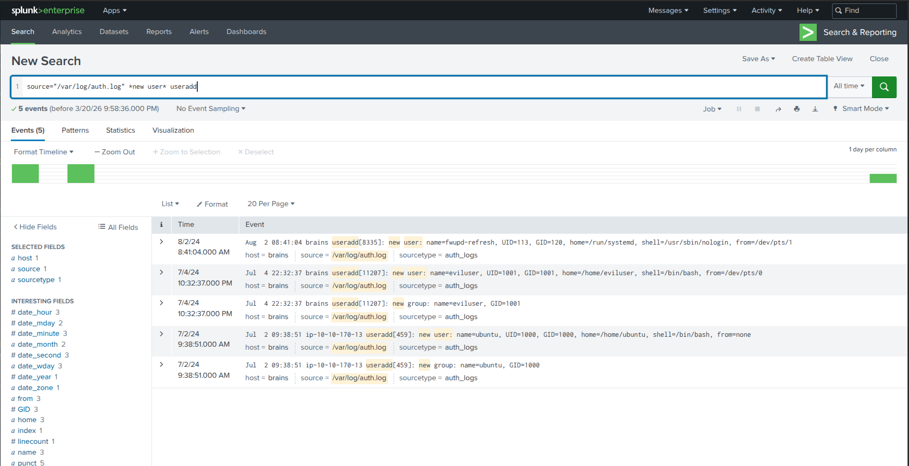
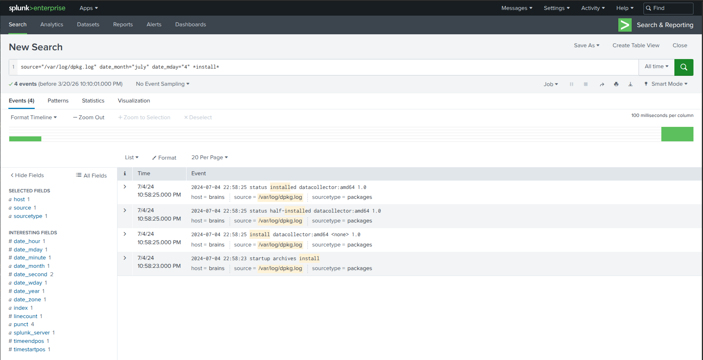
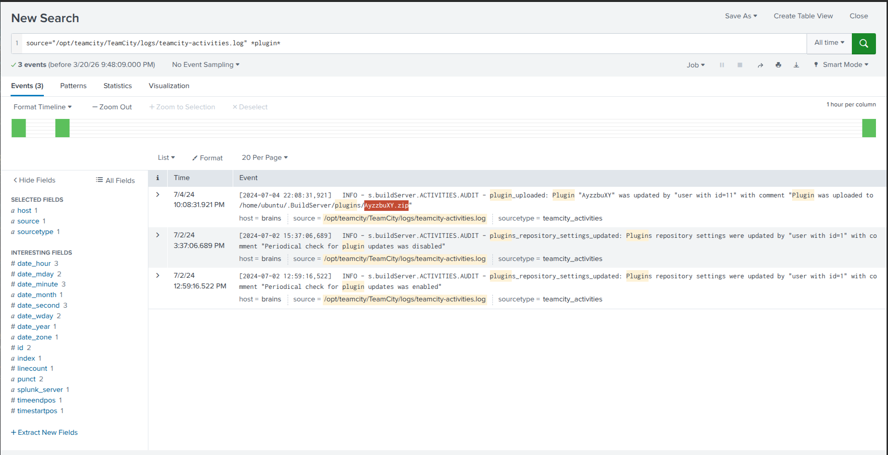

  
  
  

# 🧠 Brains – DFIR Investigation (TeamCity Exploitation)

---

## 📌 Scenario

A compromised server was identified after attackers exploited a vulnerability in TeamCity (CVE-2023). As a DFIR analyst, the task was to investigate the system, identify attacker activity, and uncover persistence mechanisms.

---

## ⚠️ Initial Access

- Exploitation of TeamCity vulnerability (CVE-2023)
- Attacker gained access to the target server

---

## 🔍 Investigation (Splunk Analysis)

### 👤 Persistence Mechanism
- Backdoor user created:
  - `eviluser`

---

### 📦 Malicious Activity

- Suspicious package installed:
  - `datacollector`

- Malicious plugin deployed:
  - `AyzzbuXY.zip`

---

## 🧬 Post-Exploitation Findings

- Attacker maintained persistence via user creation  
- Additional tooling installed for data collection / control  
- Indicators show continued access after initial compromise  

---

## 🚨 Indicators of Compromise (IOCs)

- Username: `eviluser`  
- Package: `datacollector`  
- File: `AyzzbuXY.zip`  

---

## 🏁 Conclusion

The attacker successfully exploited a vulnerable TeamCity instance, gained access, and established persistence on the system. Post-exploitation activity included installing malicious packages and creating a backdoor user for continued access.

---

## 🏆 Flag
- THM{faa9bac345709b6620a6200b484c7594}