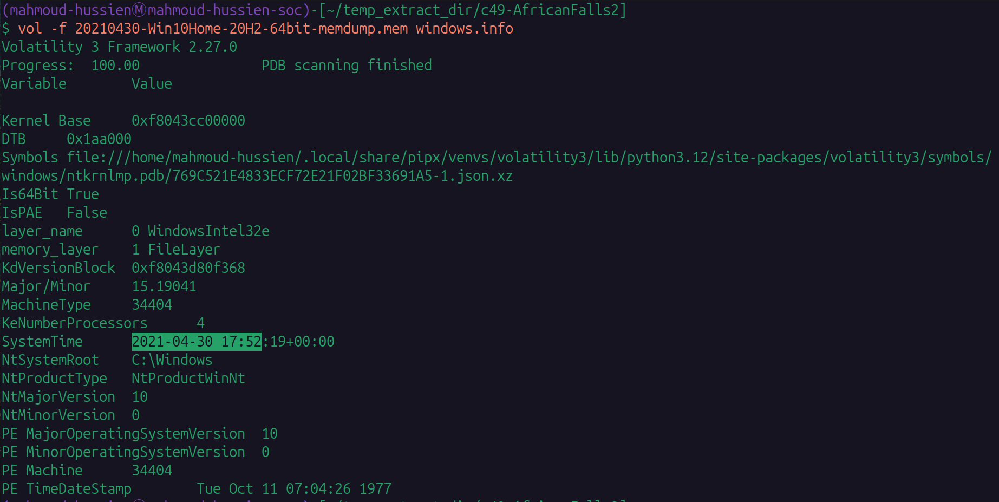
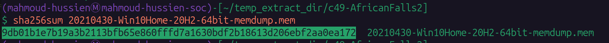
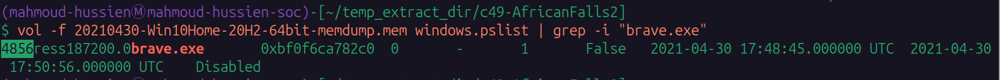
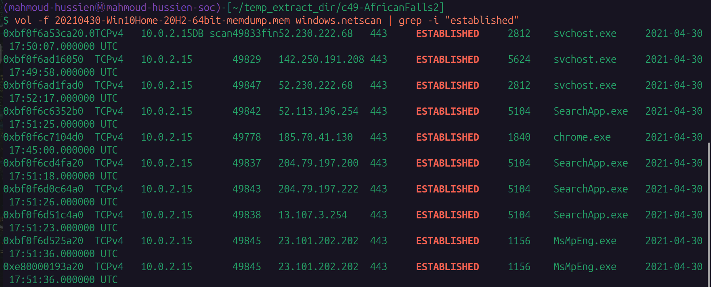
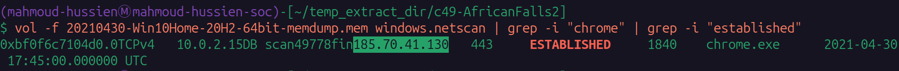
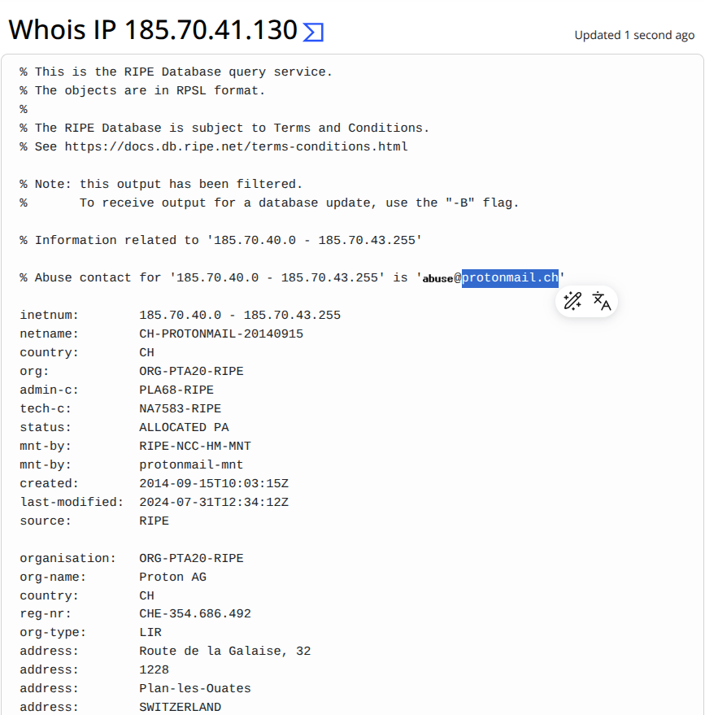
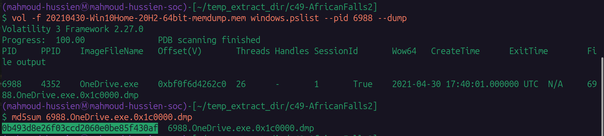
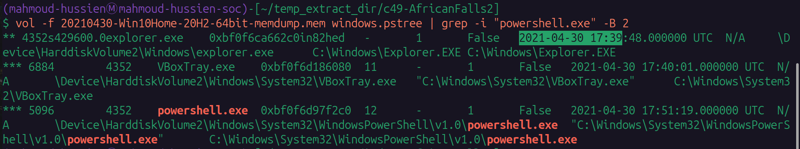
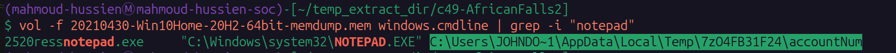
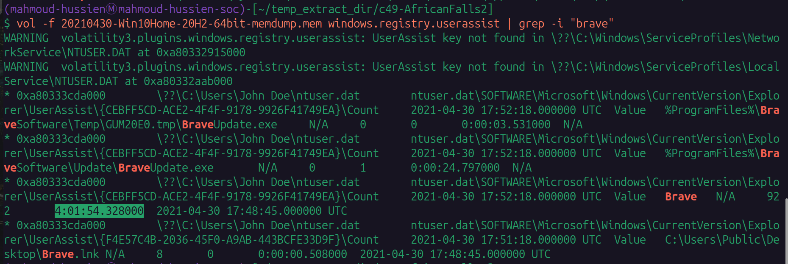

# Brave Lab — CTF Writeup

* **Platform:** CyberDefenders  
* **Challenge:** Brave Lab  
* **Category:** Endpoint Forensics / Memory Analysis  
* **Difficulty:** Medium  
* **Analyst:** Mahmoud Hussien  
* **Tools:** Volatility 3  
* **Artefact:** `20210430-Win10Home-20H2-64bit-memdump.mem`

---

## Scenario Overview

A memory image was acquired from a suspected compromised Windows 10 workstation belonging to a user flagged for potentially malicious activities, including unauthorized access attempts and unusual browsing patterns. The security team observed network activity to external IPs associated with encrypted communication services. The investigation reconstructs system activity, active network connections, browser usage, and suspicious file access patterns at the moment of memory acquisition.

---

## Evidence Integrity

| Property | Value |
|---|---|
| Image File | `20210430-Win10Home-20H2-64bit-memdump.mem` |
| SHA-256 | `9db01b1e7b19a3b2113bfb65e860fffd7a1630bdf2b18613d206ebf2aa0ea172` |
| OS | Windows 10 Home 20H2 (64-bit) |
| Kernel Base | `0xf8043cc00000` |
| System Root | `C:\Windows` |
| Acquisition Time | `2021-04-30 17:52:19 UTC` |

---

## Question 1 — What time was the RAM image acquired?

### Volatility Command

```bash
vol -f 20210430-Win10Home-20H2-64bit-memdump.mem windows.info
```

### Investigation

`windows.info` reads the kernel debugger block (KdVersionBlock) to extract OS metadata and the system clock timestamp at the time of memory acquisition. This establishes the forensic baseline — every process timestamp and network connection state in the dump is relative to this moment.

### Answer

```
2021-04-30 17:52
```


---

## Question 2 — What is the SHA256 hash of the RAM image?

### Command

```bash
sha256sum 20210430-Win10Home-20H2-64bit-memdump.mem
```

### Investigation

Cryptographic hashing of the evidence file establishes **chain-of-custody integrity** — confirming the memory dump has not been modified since acquisition. The SHA-256 algorithm produces a unique 256-bit fingerprint of the entire file.

### Answer

```
9db01b1e7b19a3b2113bfb65e860fffd7a1630bdf2b18613d206ebf2aa0ea172
```


---

## Question 3 — What is the process ID of brave.exe?

### Volatility Command

```bash
vol -f 20210430-Win10Home-20H2-64bit-memdump.mem windows.pslist | grep -i "brave.exe"
```

### Investigation

`windows.pslist` enumerates all processes from the Windows EPROCESS doubly-linked list. Filtering for `brave.exe` returned the Brave Browser process entry with its full metadata:

| Field | Value |
|---|---|
| Process | `brave.exe` |
| PID | `4856` |
| Launch Time | `2021-04-30 17:48:45 UTC` |
| Exit Time | `2021-04-30 17:50:56 UTC` |

Notably, the process had already **terminated** before the memory dump was taken at `17:52:19` — but its EPROCESS structure remained in memory, allowing forensic recovery of its metadata.

### Answer

```
4856
```


---

## Question 4 — How many established network connections were there at acquisition time?

### Volatility Command

```bash
vol -f 20210430-Win10Home-20H2-64bit-memdump.mem windows.netscan | grep -i "established"
```

### Investigation

`windows.netscan` carves `_TCP_ENDPOINT` structures from memory. Filtering for `ESTABLISHED` state returns only fully-formed, active TCP connections at the moment of acquisition — excluding `LISTENING`, `CLOSED`, and `SYN_SENT` states.

### Answer

```
10
```


---

## Question 5 — Which domain does Chrome have an established connection with?

### Volatility Command

```bash
vol -f 20210430-Win10Home-20H2-64bit-memdump.mem windows.netscan | grep -i "chrome" | grep -i "established"
```

### Investigation

Filtering netscan output for `chrome.exe` with an `ESTABLISHED` state revealed a persistent connection:

| Process | PID | Destination IP | Port | State |
|---|---|---|---|---|
| `chrome.exe` | `1840` | `185.70.41.130` | `443` | ESTABLISHED |

The destination IP `185.70.41.130` was submitted to WHOIS / RIPE NCC lookup — confirmed as belonging to **Proton AG** infrastructure, specifically `protonmail.ch`. This indicates the user was actively using ProtonMail (an end-to-end encrypted webmail service) in Chrome at the time of acquisition.

### Answer

```
protonmail.ch
```




---

## Question 6 — What is the MD5 hash of the executable for PID 6988?

### Volatility Commands

```bash
# Step 1: Dump the process executable from memory
vol -f 20210430-Win10Home-20H2-64bit-memdump.mem windows.pslist --pid 6988 --dump

# Step 2: Compute MD5 of the dumped image
md5sum 6988.OneDrive.exe.0x1c0000.dmp
```

### Investigation

PID 6988 corresponds to `OneDrive.exe` — launched at `17:40:01 UTC`. The process executable was extracted from memory using `--dump`, which writes the PE image sections to a local file. The MD5 hash was then computed for threat intelligence cross-referencing on VirusTotal.

| Field | Value |
|---|---|
| Process | `OneDrive.exe` |
| PID | `6988` |
| MD5 Hash | `0b493d8e26f03ccd2060e0be85f430af` |

### Answer

```
0b493d8e26f03ccd2060e0be85f430af
```


---

## Question 7 — What is the word at offset 0x45BE876 (6 bytes)?

### Command

```bash
xxd -s 0x45BE876 -l 6 20210430-Win10Home-20H2-64bit-memdump.mem
```

### Investigation

`xxd` is a hex dump utility. The flags used:
- `-s 0x45BE876` — seek to the specific physical byte offset in the raw memory image
- `-l 6` — read exactly 6 bytes

The 6-byte hex sequence extracted:

```
6861 636b 6572
```

Decoding each byte pair as ASCII:

| Hex | ASCII |
|---|---|
| `68` | `h` |
| `61` | `a` |
| `63` | `c` |
| `6b` | `k` |
| `65` | `e` |
| `72` | `r` |

### Answer

```
hacker
```


---

## Question 8 — What is the creation date of the parent process of powershell.exe?

### Volatility Command

```bash
vol -f 20210430-Win10Home-20H2-64bit-memdump.mem windows.pstree | grep -i "powershell.exe" -B 2
```

### Investigation

`windows.pstree` reconstructs parent-child relationships. The `-B 2` flag shows 2 lines before the match — revealing the parent process entry above `powershell.exe` in the tree.

**Process hierarchy identified:**

```
explorer.exe (PID: 4352) — Created: 2021-04-30 17:39:48 UTC
    └─ powershell.exe (PID: 5096) — Created: 2021-04-30 17:51:19 UTC
```

The parent of `powershell.exe` is `explorer.exe` (PID: 4352) — the Windows user shell. This means the user (or malware running in user context) **manually launched PowerShell from the desktop**, not from a scheduled task or service.

### Answer

```
2021-04-30 17:39
```


---

## Question 9 — What is the full path of the last file opened in Notepad?

### Volatility Command

```bash
vol -f 20210430-Win10Home-20H2-64bit-memdump.mem windows.cmdline | grep -i "notepad"
```

### Investigation

`windows.cmdline` extracts command-line arguments for running processes. The `notepad.exe` (PID: 2520) entry revealed the file it had open:

```
"C:\Windows\system32\NOTEPAD.EXE" C:\Users\JOHNDO~1\AppData\Local\Temp\7zO4FB31F24\accountNum
```

**Path Analysis:**

| Component | Significance |
|---|---|
| `JOHNDO~1` | Short (8.3) name for user `John Doe` |
| `AppData\Local\Temp\` | Temporary extraction directory |
| `7zO4FB31F24\` | 7-Zip extraction subfolder (random ID) |
| `accountNum` | File containing account numbers / credentials |

A file named `accountNum` being opened directly from a 7-Zip temporary extraction folder is a high-confidence indicator of staged credential data — likely extracted from a compressed archive delivered via phishing or download.

### Answer

```
C:\Users\JOHNDO~1\AppData\Local\Temp\7zO4FB31F24\accountNum
```


---

## Question 10 — How long did the suspect use Brave browser?

### Volatility Command

```bash
vol -f 20210430-Win10Home-20H2-64bit-memdump.mem windows.registry.userassist | grep -i "brave"
```

### Investigation

`windows.registry.userassist` parses the `UserAssist` registry keys from `NTUSER.DAT` — Windows automatically tracks the cumulative **focus time** (time the application window was in the foreground) for every launched application.

Filtering for `Brave.lnk` in the UserAssist output returned the engagement metrics:

| Field | Value |
|---|---|
| Application | `Brave.lnk` (Brave Browser) |
| Cumulative Focus Time | **4 hours, 1 minute, 54 seconds** |
| Last Run | `2021-04-30 17:48:45 UTC` |

Despite Brave being closed at `17:50:56 UTC` — only 1 minute and 23 seconds before memory acquisition — the UserAssist log preserved the full historical usage record across all previous sessions.

### Answer

```
4
```


---

## Full Investigation Timeline

| Timestamp (UTC) | PID | Event |
|---|---|---|
| 2021-04-30 17:39:48 | 4352 | `explorer.exe` initialized — user shell starts |
| 2021-04-30 17:40:01 | 6988 | `OneDrive.exe` launched |
| 2021-04-30 17:45:00 | 1840 | `chrome.exe` → ESTABLISHED connection to `protonmail.ch` (185.70.41.130:443) |
| 2021-04-30 17:48:45 | 4856 | `brave.exe` launched via `Brave.lnk` |
| 2021-04-30 17:49:58 | 5624 | `svchost.exe` → 142.250.191.208:443 |
| 2021-04-30 17:50:07 | 2812 | `svchost.exe` → 52.230.222.68:443 |
| 2021-04-30 17:50:56 | 4856 | `brave.exe` terminated |
| 2021-04-30 17:51:19 | 5096 | `powershell.exe` spawned from `explorer.exe` |
| 2021-04-30 17:52:17 | 2812 | Final `svchost.exe` connection before acquisition |
| 2021-04-30 17:52:18 | — | UserAssist hive updated (`BraveUpdate.exe`) |
| 2021-04-30 17:52:19 | — | **Memory dump acquired** |

---

## Indicators of Compromise (IOCs)

| Type | Value | Description |
|---|---|---|
| Process | `powershell.exe` (PID: 5096) | Manually launched PowerShell session |
| Process | `brave.exe` (PID: 4856) | Brave Browser (4h usage) |
| Process | `OneDrive.exe` (PID: 6988) | Cloud sync process |
| File | `accountNum` | Suspicious file from 7-Zip Temp directory |
| Path | `C:\Users\JOHNDO~1\AppData\Local\Temp\7zO4FB31F24\accountNum` | Staged credential file |
| IP | `185.70.41.130` | ProtonMail server (encrypted webmail) |
| Domain | `protonmail.ch` | Chrome ESTABLISHED connection |
| MD5 | `0b493d8e26f03ccd2060e0be85f430af` | OneDrive.exe memory dump hash |
| String | `hacker` | Found at raw offset `0x45BE876` |

---

## Key Commands Reference

```bash
# OS info and acquisition timestamp
vol -f 20210430-Win10Home-20H2-64bit-memdump.mem windows.info

# SHA256 of evidence file
sha256sum 20210430-Win10Home-20H2-64bit-memdump.mem

# Find Brave Browser process
vol -f 20210430-Win10Home-20H2-64bit-memdump.mem windows.pslist | grep -i "brave.exe"

# All ESTABLISHED connections
vol -f 20210430-Win10Home-20H2-64bit-memdump.mem windows.netscan | grep -i "established"

# Chrome connections only
vol -f 20210430-Win10Home-20H2-64bit-memdump.mem windows.netscan | grep -i "chrome" | grep -i "established"

# Dump OneDrive executable from memory
vol -f 20210430-Win10Home-20H2-64bit-memdump.mem windows.pslist --pid 6988 --dump
md5sum 6988.OneDrive.exe.0x1c0000.dmp

# Raw hex at specific offset
xxd -s 0x45BE876 -l 6 20210430-Win10Home-20H2-64bit-memdump.mem

# PowerShell parent process
vol -f 20210430-Win10Home-20H2-64bit-memdump.mem windows.pstree | grep -i "powershell.exe" -B 2

# Notepad file access
vol -f 20210430-Win10Home-20H2-64bit-memdump.mem windows.cmdline | grep -i "notepad"

# Brave usage time (UserAssist)
vol -f 20210430-Win10Home-20H2-64bit-memdump.mem windows.registry.userassist | grep -i "brave"
```

---

## MITRE ATT&CK Mapping

| Phase | Technique ID | Technique Name |
|---|---|---|
| Collection | T1114.001 | Email Collection: Local Email (ProtonMail via Chrome) |
| Defense Evasion | T1059.001 | PowerShell (manual launch from Explorer) |
| Discovery | T1083 | File and Directory Discovery (accountNum access) |
| Exfiltration | T1048.002 | Exfiltration Over Encrypted Channel (port 443) |
| Collection | T1560.001 | Archive Collected Data: 7-Zip (accountNum in Temp) |

---

## Lessons Learned

1. **UserAssist reveals hidden usage history** — Even after a process terminates, the UserAssist registry key retains cumulative focus time. This is valuable for proving extended browser usage the suspect may deny.
2. **7-Zip Temp paths signal staged data** — Files opened directly from `AppData\Local\Temp\7z*\` indicate content extracted from a downloaded archive — a strong indicator of phishing payload delivery or credential staging.
3. **Raw hex offsets expose embedded strings** — String artifacts in raw memory (like `hacker` at `0x45BE876`) can be found using `xxd` when standard Volatility plugins don't surface them, providing additional contextual evidence.
4. **ProtonMail usage complicates traffic inspection** — End-to-end encrypted webmail over HTTPS means content is invisible to network-level DLP. Monitor for ProtonMail connections combined with other suspicious indicators.
5. **Process exit doesn't erase EPROCESS** — `brave.exe` had already terminated before the dump, but its metadata (PID, timestamps, network history) remained recoverable — confirming memory forensics captures more than just "live" processes.

---

*Writeup produced as part of SOC Analyst training — CyberDefenders: Brave Lab*