# Carnage — CTF Writeup

* **Platform:** TryHackMe  
* **Room:** Carnage  
* **Category:** Network Forensics / PCAP Analysis / Malspam  
* **Difficulty:** Medium  
* **Analyst:** Mahmoud Hussien 
* **Tool:** Wireshark, VirusTotal  
* **File:** carnage.pcap

---

## Scenario Overview

Eric Fischer from the Purchasing Department at Bartell Ltd received an email from a known contact containing a Word document attachment. Upon opening it, he clicked "Enable Content" — triggering macro execution. The SOC team immediately received an endpoint alert showing suspicious outbound connections. A PCAP was captured from the network sensor and handed over for full analysis.

The investigation traces a complete **Malspam → Macro → ZIP → XLS → HTTPS → C2** infection chain including Cobalt Strike beaconing.

---

## Infection Chain Overview

```
[1] Malspam Email
    └─ farshin@mailfa.com → eric.fischer@bartell.com

[2] Macro Execution (Enable Content)
    └─ HTTP GET → 85.187.128.24 (attirenepal.com)
    └─ Download: documents.zip → chart-1530076591.xls

[3] Secondary Payload (HTTPS)
    └─ finejewels.com.au
    └─ thietbiagt.com
    └─ new.americold.com

[4] Post-Infection Tracking
    └─ HTTP POST → maldivehost.net
    └─ URI: /zLiIsQRWZI9/...

[5] Reconnaissance
    └─ DNS query → api.ipify.org (victim IP check)

[6] Cobalt Strike C2
    └─ 185.106.96.158 (survmeter.live)
    └─ 185.125.204.174 (securitybusinpuff.com)
```

---

## Question 1 — What was the date and time for the first HTTP connection to the malicious IP?

### Investigation

Applied Wireshark display filter to isolate the first outbound HTTP GET request from the victim host (`10.9.23.102`) to the malicious IP `85.187.128.24`:

```
http.request.method == "GET" && ip.dst == 85.187.128.24
```

The first packet timestamp from the frame details panel:

### Answer

```
2021-09-24 16:44:38
```
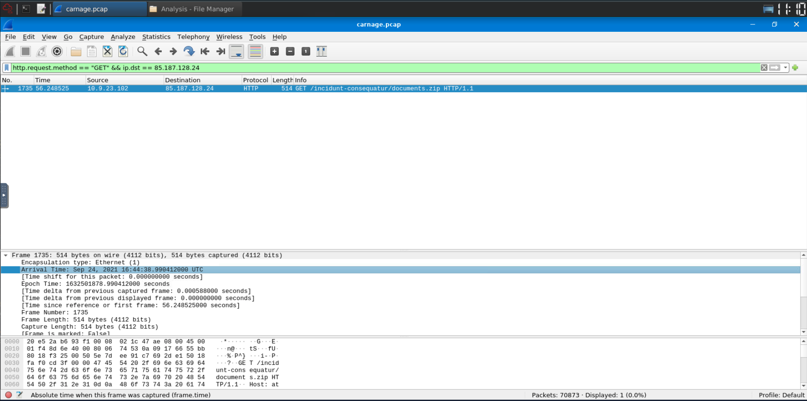

---

## Question 2 — What is the name of the zip file that was downloaded?

### Investigation

Following the HTTP stream from the first GET request to `85.187.128.24`, the full URI path was extracted from the HTTP request headers:

```
GET /incidunt-consequatur/documents.zip HTTP/1.1
```

### Answer

```
documents.zip
```
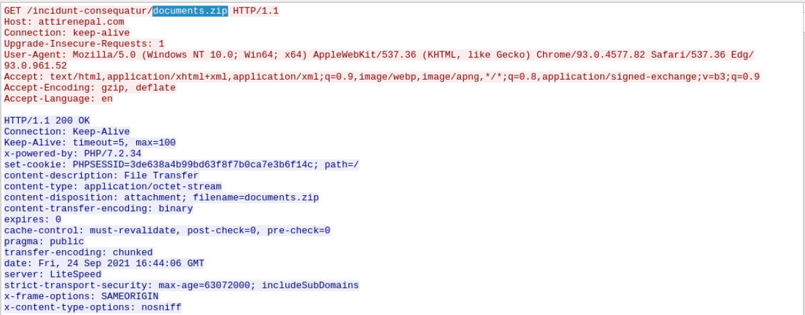

---

## Question 3 — What was the domain hosting the malicious zip file?

### Investigation

Inspecting the `Host:` header of the same HTTP GET request reveals the domain name associated with the malicious IP `85.187.128.24`:

```
Host: attirenepal.com
```

### Answer

```
attirenepal.com
```
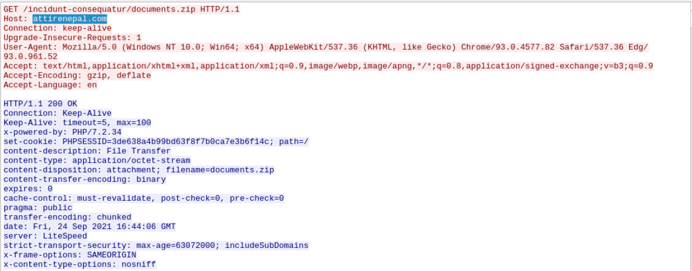

---

## Question 4 — Without downloading the file, what is the name of the file in the zip file?

### Investigation

Following the full HTTP stream in ASCII mode (`Follow → TCP Stream`), the raw response body contains the ZIP archive's binary content. The ZIP format stores filenames in plaintext within its local file header structure — visible by scanning the ASCII-readable sections of the stream for the standard `PK` ZIP header signature followed by the embedded filename.

The embedded spreadsheet filename was extracted directly from the stream:

### Answer

```
chart-1530076591.xls
```
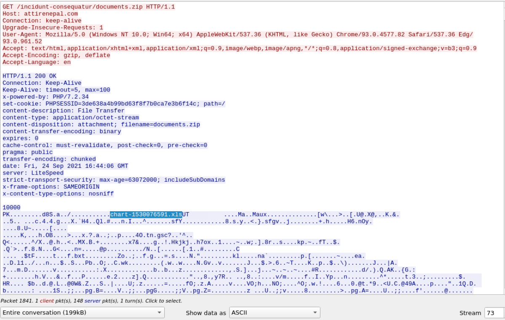

---

## Question 5 — What is the name of the webserver of the malicious IP?

### Investigation

Inspecting the HTTP response headers from `85.187.128.24`, the `Server:` header field identifies the web server software:

```
Server: LiteSpeed
```

### Answer

```
LiteSpeed
```
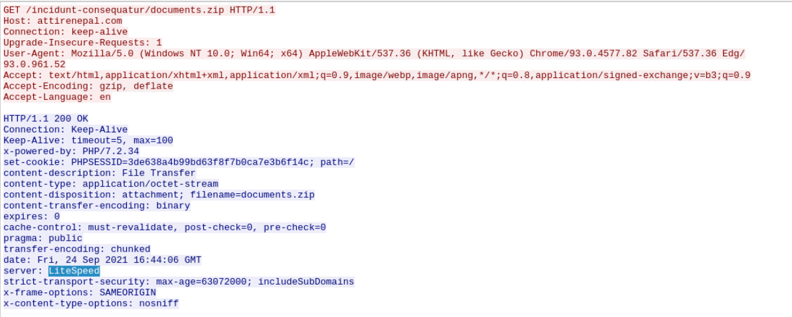

---

## Question 6 — What is the version of the webserver?

### Investigation

From the same HTTP response headers, the `X-Powered-By:` field exposes the backend PHP version running on the LiteSpeed server:

```
X-Powered-By: PHP/7.2.34
```

### Answer

```
PHP/7.2.34
```
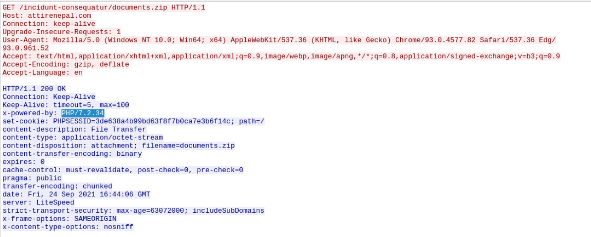

---

## Question 7 — What were the three domains involved in secondary payload delivery?

### Investigation

Filtered for HTTPS traffic (TLS) occurring between `16:45:11` and `16:45:30` UTC from the victim host:

```
tcp.port == 443 && tls.handshake.type == 1 && (frame.time >= "Sep 24, 2021 16:45:11") && (frame.time <= "Sep 24, 2021 16:45:30")
```

Inspected the **Server Name Indication (SNI)** field within each TLS Client Hello handshake — this field reveals the target domain even for encrypted HTTPS traffic, as it is sent in plaintext during the TLS negotiation phase.

Three distinct external domains were identified:

| Domain | Certificate Authority |
|---|---|
| `finejewels.com.au` | GoDaddy |
| `thietbiagt.com` | Let's Encrypt |
| `new.americold.com` | Sectigo |

### Answer

```
finejewels.com.au, thietbiagt.com, new.americold.com
```
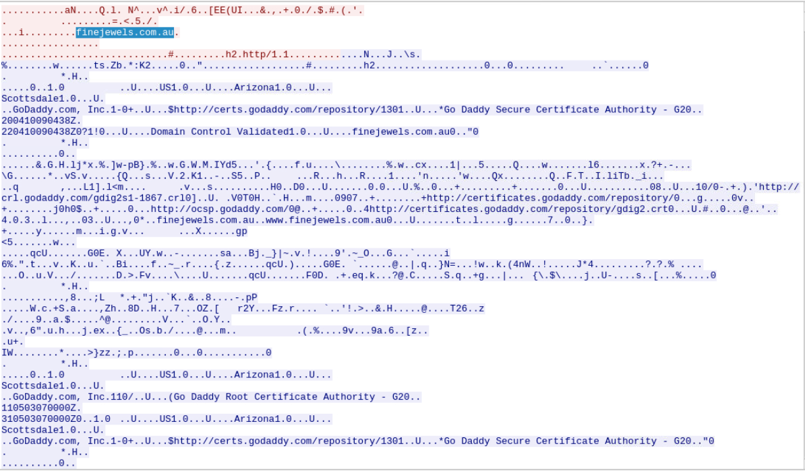
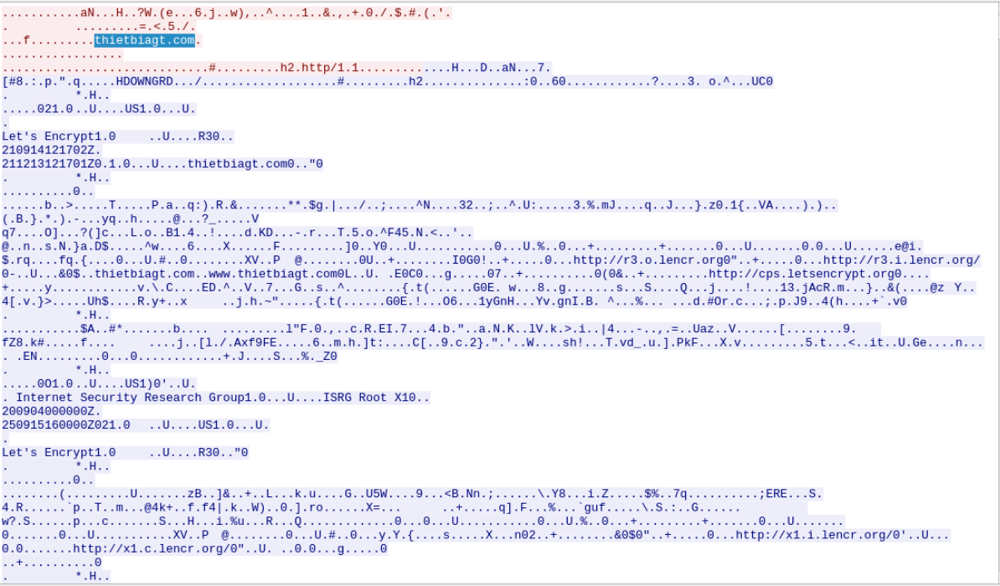
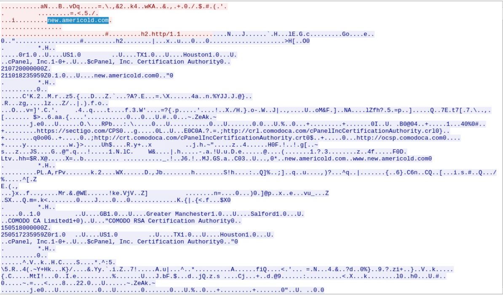

---

## Question 8 — Which certificate authority issued the SSL certificate to the first domain?

From the TLS handshake inspection for `finejewels.com.au`, the Certificate details show the issuer field:

### Answer

```
GoDaddy
```
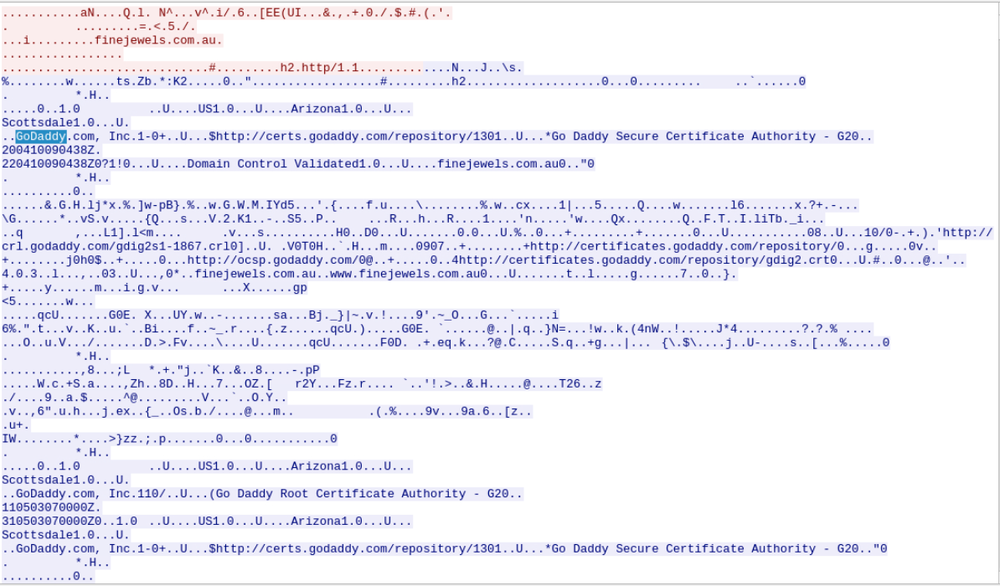

---

## Question 9 — What are the two IP addresses of the Cobalt Strike servers?

### Investigation

Cross-referenced destination IPs from post-infection C2 traffic with **VirusTotal Community tab** to identify Cobalt Strike server confirmations. Two IPs were flagged by the security community as active Cobalt Strike infrastructure:

| IP | Domain | Ports |
|---|---|---|
| `185.106.96.158` | `survmeter.live` | 8888, 443 |
| `185.125.204.174` | `securitybusinpuff.com` | 4444, 8080 |

### Answer

```
185.106.96.158, 185.125.204.174
```
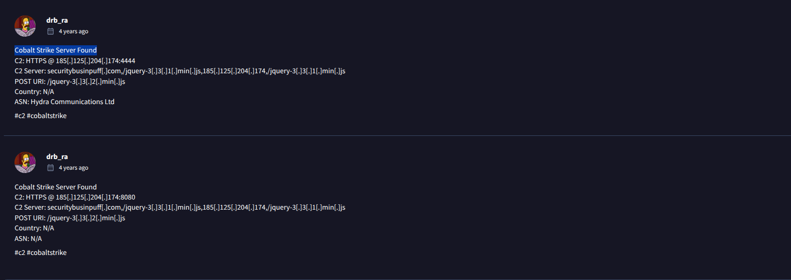
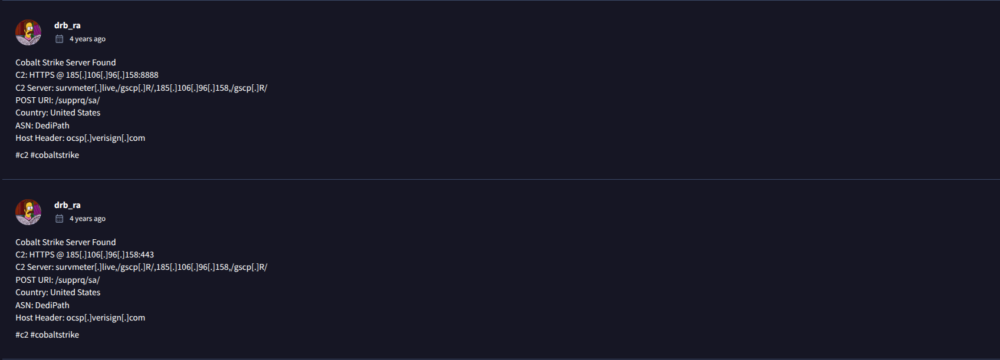

---

## Question 10 — What is the Host header for the first Cobalt Strike IP?

### Investigation

Filtered HTTP traffic to the first Cobalt Strike IP (`185.106.96.158`) and inspected the `Host:` header value transmitted by the victim host in its HTTP requests:

### Answer

```
ocsp.verisign.com
```
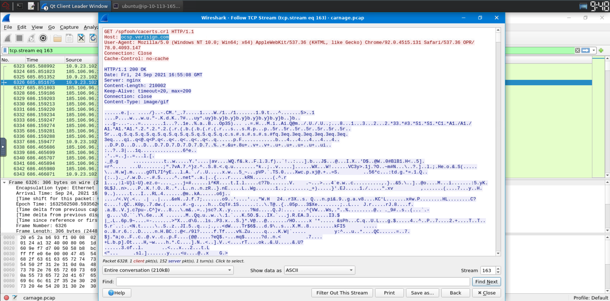

> **Note:** Using `ocsp.verisign.com` as the Host header is a deliberate **domain fronting / host spoofing** technique — the malware impersonates a legitimate Verisign OCSP (Online Certificate Status Protocol) request to blend C2 traffic with normal TLS certificate validation activity.

---

## Question 11 — What is the domain name for the first Cobalt Strike IP?

### Investigation

VirusTotal Community tab for `185.106.96.158` confirmed active Cobalt Strike C2 association and identified the linked domain:

### Answer

```
survmeter.live
```
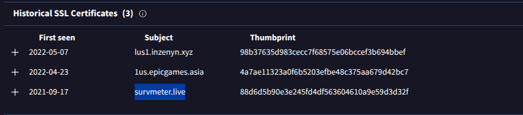

---

## Question 12 — What is the domain name for the second Cobalt Strike IP?

### Investigation

VirusTotal Community tab for `185.125.204.174` confirmed the associated domain:

### Answer

```
securitybusinpuff.com
```
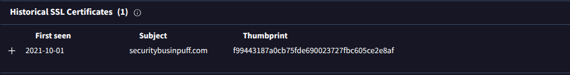

---

## Question 13 — What is the domain name of the post-infection traffic?

### Investigation

Filtered for HTTP POST requests from the victim host after initial infection:

```
http.request.method == "POST" && ip.src == 10.9.23.102
```

The `Host:` header in the POST request at `16:46:15 UTC` identifies the tracking gate domain:

### Answer

```
maldivehost.net
```
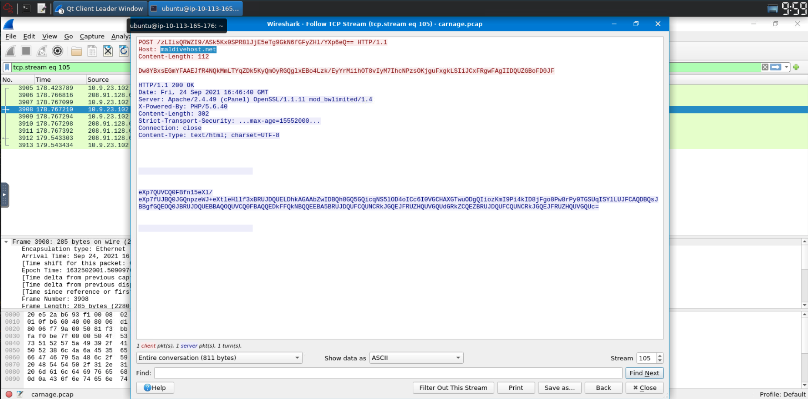

---

## Question 14 — What are the first eleven characters the victim host sends to the malicious domain?

### Investigation

Following the HTTP POST stream to `maldivehost.net`, the URI path contains the encoded tracking data. The first 11 characters of the outbound POST URI path:

```
POST /zLiIsQRWZI9/OQsaDixzHTgtfjMcGypGenpldWF5eV9f3k= HTTP/1.1
```

### Answer

```
zLiIsQRWZI9
```
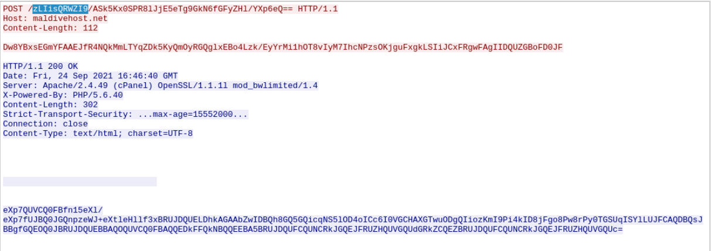

---

## Question 15 — What was the length for the first packet sent out to the C2 server?

### Investigation

Filtered traffic to the primary C2 server (`208.91.128.6`) and identified the very first packet sent from the victim host. The frame length was read directly from the Wireshark frame details panel:

### Answer

```
281
```
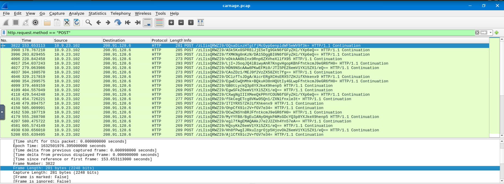

---

## Question 16 — What was the Server header for the malicious post-infection domain?

### Investigation

From the HTTP response received from `maldivehost.net`, the `Server:` response header:

```
Server: Apache/2.4.49 (cPanel) OpenSSL/1.1.1l mod_bwlimited/1.4
```

### Answer

```
Apache/2.4.49 (cPanel) OpenSSL/1.1.1l mod_bwlimited/1.4
```
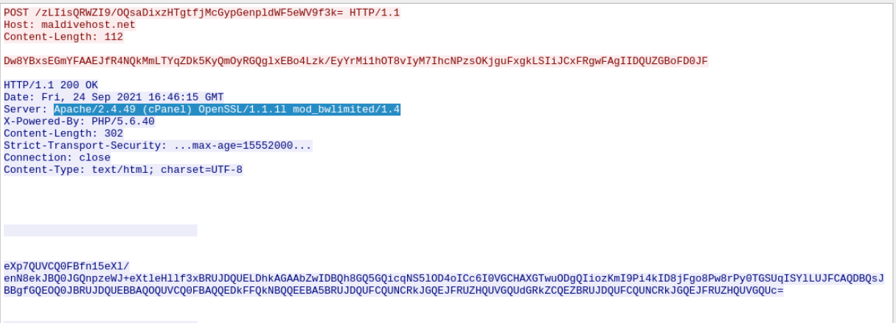

---

## Question 17 — What was the date and time when the DNS query for the IP check domain occurred?

### Investigation

Applied Wireshark DNS filter to find the query for the public IP reconnaissance API:

```
dns.qry.name contains "api"
```

The malware queried the local DNS resolver (`10.9.23.5`) to resolve the external IP check service — a standard post-infection technique to map the victim's public-facing IP and geographic location.

### Answer

```
2021-09-24 17:00:04 UTC
```
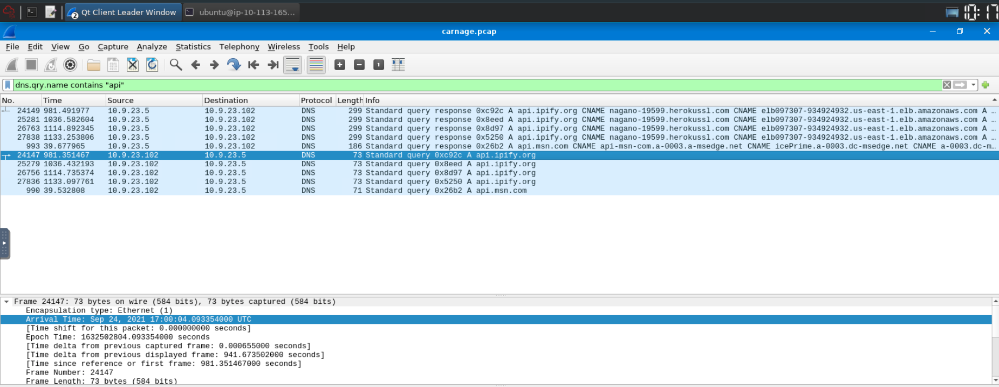

---

## Question 18 — What was the domain in the DNS query?

### Answer

```
api.ipify.org
```
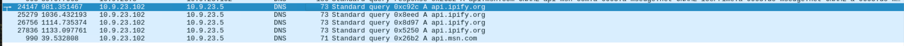

---

## Question 19 — What was the first MAIL FROM address observed in the SMTP traffic?

### Investigation

Applied Wireshark SMTP filter and followed the first SMTP stream:

```
smtp.req.command == "MAIL"
```

The first `MAIL FROM:` envelope address captured in the SMTP session identifies the malspam sender:

### Answer

```
farshin@mailfa.com
```
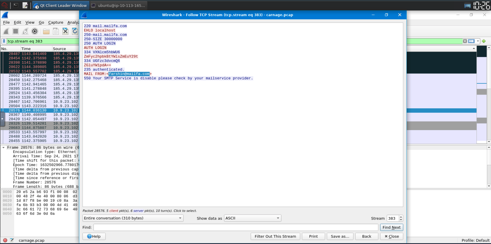

---

## Question 20 — How many packets were observed for the SMTP traffic?

### Investigation

Applied SMTP display filter in Wireshark and checked the status bar for total packet count:

```
smtp
```

### Answer

```
1439
```

---

## Full Attack Timeline

| Time (UTC) | Source | Destination | Event |
|---|---|---|---|
| 2021-09-24 16:32:11 | `farshin@mailfa.com` | `eric.fischer@bartell.com` | Malspam email delivered |
| 2021-09-24 16:44:38 | `10.9.23.102` | `85.187.128.24` | HTTP GET → `documents.zip` |
| 2021-09-24 16:45:11–30 | `10.9.23.102` | Multiple | HTTPS secondary payload download |
| 2021-09-24 16:46:15 | `10.9.23.102` | `208.91.128.6` | HTTP POST → `maldivehost.net` tracking |
| 2021-09-24 17:00:04 | `10.9.23.102` | `10.9.23.5` | DNS query → `api.ipify.org` (IP check) |
| Post-infection | `10.9.23.102` | `185.106.96.158` | Cobalt Strike C2 beaconing |
| Post-infection | `10.9.23.102` | `185.125.204.174` | Cobalt Strike C2 beaconing |

---

## Indicators of Compromise (IOCs)

| Type | Value (Defanged) | Description |
|---|---|---|
| Email | `farshin[@]mailfa[.]com` | Malspam sender |
| Mail Server | `mail[.]mailfa[.]com` | SMTP relay infrastructure |
| IP | `85[.]187[.]128[.]24` | ZIP payload hosting server |
| Domain | `attirenepal[.]com` | Malicious ZIP host domain |
| URI | `/incidunt-consequatur/documents[.]zip` | ZIP download path |
| File | `documents[.]zip` | Downloaded malicious archive |
| File | `chart-1530076591[.]xls` | Excel macro payload (inside ZIP) |
| Domain | `finejewels[.]com[.]au` | Secondary payload (GoDaddy SSL) |
| Domain | `thietbiagt[.]com` | Secondary payload (Let's Encrypt) |
| Domain | `new[.]americold[.]com` | Secondary payload (Sectigo) |
| Domain | `maldivehost[.]net` | Post-infection tracking gate |
| URI | `/zLiIsQRWZI9/...` | Tracking POST endpoint |
| IP | `208[.]91[.]128[.]6` | C2 server (initial POST) |
| IP | `185[.]106[.]96[.]158` | Cobalt Strike C2 |
| Domain | `survmeter[.]live` | Cobalt Strike C2 domain |
| IP | `185[.]125[.]204[.]174` | Cobalt Strike C2 |
| Domain | `securitybusinpuff[.]com` | Cobalt Strike C2 domain |
| Domain | `api[.]ipify[.]org` | Public IP reconnaissance API |

---

## Key Wireshark Filters Reference

```
-- First HTTP GET to malicious IP
http.request.method == "GET" && ip.dst == 85.187.128.24

-- TLS SNI extraction (secondary payloads)
tcp.port == 443 && tls.handshake.type == 1 && (frame.time >= "Sep 24, 2021 16:45:11") && (frame.time <= "Sep 24, 2021 16:45:30")

-- Post-infection HTTP POST traffic
http.request.method == "POST" && ip.src == 10.9.23.102

-- DNS IP check query
dns.qry.name contains "api"

-- SMTP traffic
smtp

-- SMTP MAIL FROM command
smtp.req.command == "MAIL"

-- C2 traffic to Cobalt Strike IPs
ip.dst == 185.106.96.158 || ip.dst == 185.125.204.174
```

---

## MITRE ATT&CK Mapping

| Phase | Technique ID | Technique Name |
|---|---|---|
| Initial Access | T1566.001 | Phishing: Spearphishing Attachment |
| Execution | T1204.002 | User Execution: Malicious File |
| Execution | T1059.005 | Visual Basic (Macro) |
| Defense Evasion | T1036 | Masquerading (ZIP → XLS) |
| Defense Evasion | T1071.001 | Web Protocols (C2 over HTTP) |
| Defense Evasion | T1568 | Dynamic Resolution (domain fronting) |
| Discovery | T1016 | System Network Configuration (api.ipify.org) |
| Command & Control | T1071.001 | Web Protocols (HTTP POST beaconing) |
| Command & Control | T1573.001 | Encrypted Channel (Cobalt Strike HTTPS) |
| Command & Control | T1105 | Ingress Tool Transfer |

---

## Lessons Learned

1. **Disable macros by default** — Microsoft Office macros should be disabled via Group Policy and only permitted for digitally signed documents from trusted publishers. "Enable Content" is one of the most exploited social engineering prompts.
2. **Inspect TLS SNI fields** — Even encrypted HTTPS traffic reveals the destination domain via SNI in the TLS Client Hello. This can be logged and analyzed without breaking encryption.
3. **Alert on ZIP-inside-email with Office files** — A ZIP attachment containing an `.xls` or `.doc` file is a strong malspam indicator and should be sandboxed automatically.
4. **Block public IP check APIs** — Outbound DNS/HTTP to `api.ipify.org` from workstations is abnormal and should trigger a SIEM alert — it is a near-universal malware post-infection step.
5. **Hunt for Cobalt Strike Host header spoofing** — HTTP requests to unknown IPs using `Host: ocsp.verisign.com` or other legitimate-looking headers is a classic Cobalt Strike malleable C2 profile technique.
6. **Monitor SMTP volume anomalies** — 1,439 SMTP packets in a session is highly anomalous for a standard user workstation and should trigger automated alerting.

---

*Writeup produced as part of SOC Analyst training — TryHackMe: Carnage*