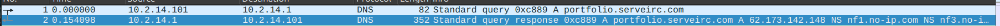
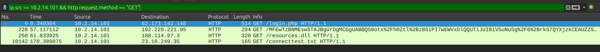
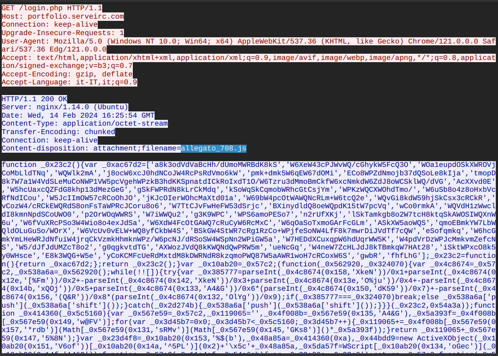
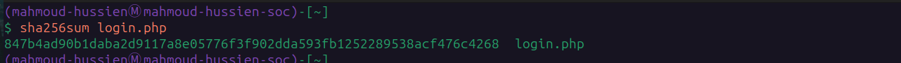
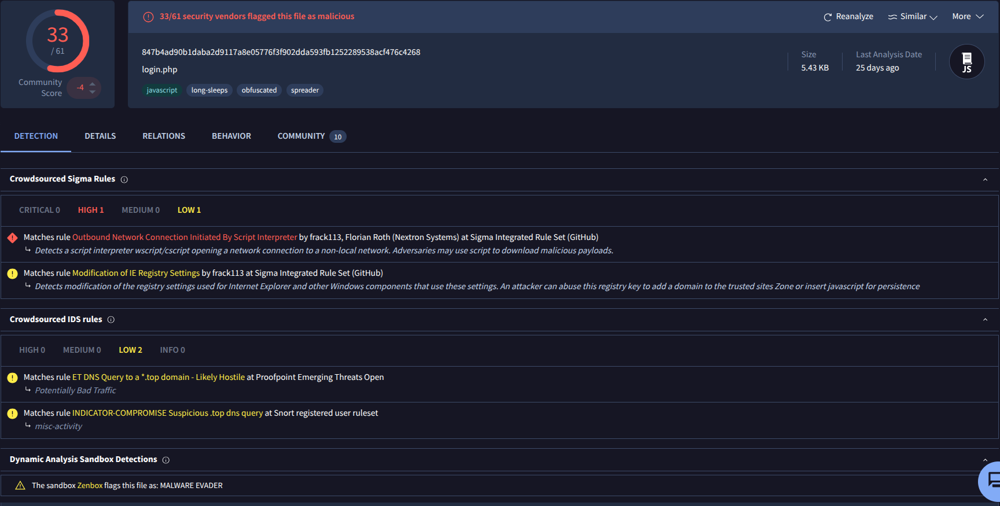
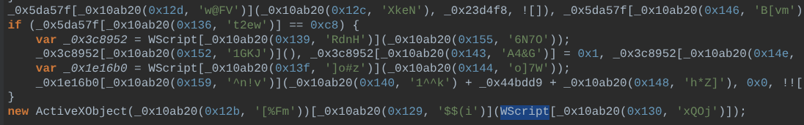
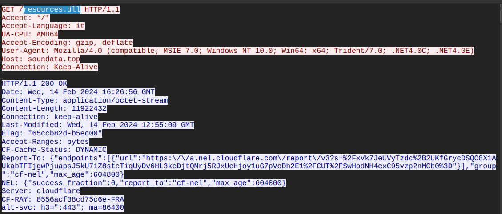
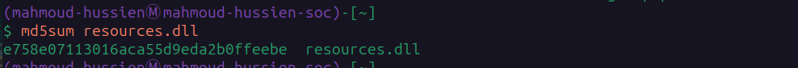

# DanaBot Lab — CTF Writeup

* **Platform:** CyberDefenders  
* **Challenge:** DanaBot Lab  
* **Category:** Network Forensics / Malware Analysis  
* **Difficulty:** Easy  
* **Analyst:** Mahmoud Hussien
* **Tool:** Wireshark, VirusTotal, beautifier  

---

## Scenario Overview

The SOC team detected suspicious network activity indicating a workstation compromise. A machine at `10.2.14.101` was infected via a multi-stage web delivery attack deploying the **DanaBot Banking Trojan**. The attack chain began with a malicious JavaScript stager delivered via a dynamic DNS domain, followed by a secondary DLL payload downloaded 62 seconds later. Full PCAP and host-level forensic analysis was performed to extract all IOCs and trace the complete infection chain.

---

## Victim & Attacker Profile

| Field | Value |
|---|---|
| Compromised Host | `10.2.14.101` |
| Local Gateway / DNS | `10.2.14.1` |
| OS | Windows 10 (AMD64) |
| Language | Italian (it-IT) |
| Attacker IP | `62.173.142.148` |
| Attacker ASN | AS34300 — Internet-Cosmos LLC (Russian Federation) |
| Stage 1 Domain | `portfolio.serveirc.com` (No-IP Dynamic DNS) |
| Stage 2 Domain | `soundata.top` (Eranet / Cloudflare) |

---

## Infection Chain Overview

```
[1] DNS Resolution
    └─ Victim queries: portfolio.serveirc.com
    └─ Resolved to: 62.173.142.148

[2] Stage 1 — JavaScript Stager (16:25:54 UTC)
    └─ HTTP GET /login.php → 62.173.142.148
    └─ Response: allegato_708.js (5.43 KB)
    └─ Executed by: wscript.exe

[3] Host Modification
    └─ IE zone registry keys modified
    └─ Dynamic %TEMP% path generated (10-char random)

[4] Stage 2 — DLL Payload (16:26:56 UTC, +62 seconds)
    └─ HTTP GET /resources.dll → soundata.top
    └─ Response: resources.dll (11.36 MB)
    └─ Written via: ADODB.Stream (binary mode)
    └─ Executed via: rundll32.exe
```

---

## Question 1 — Which IP address was used by the attacker during the initial access?

### Investigation

Applied Wireshark filter to identify the first outbound HTTP connection from the victim host after the DNS resolution for `portfolio.serveirc.com`:

```
ip.src == 10.2.14.101 && http.request.method == "GET"
```

The first HTTP GET request was directed to a single external IP — confirmed as the attacker's delivery server via ASN lookup (Internet-Cosmos LLC, Russian Federation).

### Answer

```
62.173.142.148
```



---

## Question 2 — What is the name of the malicious file used for initial access?

### Investigation

Following the HTTP stream from the first GET request to `62.173.142.148`, the server responded with:

```
GET /login.php HTTP/1.1
Host: portfolio.serveirc.com
```

The response included a `Content-Disposition: attachment` header serving the file under a different name than the requested PHP script — a common technique to disguise the true nature of the delivered payload:

```
Content-Disposition: attachment; filename="allegato_708.js"
```

The `.js` extension indicates a JavaScript file intended for execution by the Windows Script Host engine (`wscript.exe`) rather than a browser.

### Answer

```
allegato_708.js
```


---

## Question 3 — What is the SHA-256 hash of the malicious file?

### Investigation

Extracted `allegato_708.js` from the PCAP via Wireshark's `File → Export Objects → HTTP`. The exported file was hashed and cross-referenced with VirusTotal for threat intelligence confirmation:

```bash
sha256sum allegato_708.js
```

VirusTotal confirmed the file as a **DanaBot** stager with multiple AV detections.

### Answer

```
847b4ad90b1daba2d9117a8e05776f3f902dda593fb1252289538acf476c4268
```



---

## Question 4 — Which process was used to execute the malicious file?

### Investigation

Static analysis of `allegato_708.js` revealed it was a standalone script designed for execution outside the browser sandbox. When a `.js` file is opened or downloaded on Windows without browser sandbox controls, the OS default handler invokes:

```
C:\Windows\System32\wscript.exe
```

The script abused Microsoft COM/ActiveX interfaces (including `ADODB.Stream`) — capabilities only accessible outside the browser sandbox via the Windows Script Host engine.

**Execution chain confirmed:**

```
wscript.exe → allegato_708.js → [Registry modification + HTTP GET] → resources.dll
```

### Answer

```
wscript.exe
```


---

## Question 5 — What is the file extension of the second malicious file?

### Investigation

Filtered HTTP traffic for the second outbound request originating from `wscript.exe` activity — occurring 62 seconds after the initial infection:

```
ip.src == 10.2.14.101 && http.request.method == "GET"
  && http.host == "soundata.top"
```

The GET request path:

```
GET /resources.dll HTTP/1.1
Host: soundata.top
User-Agent: Mozilla/4.0 (compatible; MSIE 7.0; Windows NT 10.0; ...)
Accept-Language: it
```

The User-Agent string (`MSIE 7.0` / `Trident/7.0`) is characteristic of DanaBot's hardcoded Internet Explorer emulation — used to mimic legacy browser traffic and evade modern security controls.

### Answer

```
.dll
```


---

## Question 6 — What is the MD5 hash of the second malicious file?

### Investigation

Extracted `resources.dll` from the PCAP via `File → Export Objects → HTTP`. The file measured **11,922,432 bytes (~11.36 MB)** — consistent with a fully-packed banking trojan core module.

```bash
md5sum resources.dll
```

VirusTotal confirmed the file as the **DanaBot** core DLL component.

### Answer

```
e758e07113016aca55d9eda2b0ffeebe
```


---

## Full Attack Timeline

| Timestamp (UTC) | Source | Destination | Event |
|---|---|---|---|
| 16:25:54.000000 | `10.2.14.101` | `10.2.14.1` | DNS A query → `portfolio.serveirc.com` |
| 16:25:54.154098 | `10.2.14.1` | `10.2.14.101` | DNS response → `62.173.142.148` |
| 16:25:54 | `10.2.14.101` | `62.173.142.148` | HTTP GET `/login.php` → `allegato_708.js` delivered |
| Post-download | `10.2.14.101` | Local | `wscript.exe` executes `allegato_708.js` |
| Post-download | `10.2.14.101` | Local Registry | IE zone security settings modified |
| 16:26:56 | `10.2.14.101` | `soundata.top` | HTTP GET `/resources.dll` (Stage 2) |
| 16:26:56 | `soundata.top` | `10.2.14.101` | `resources.dll` delivered (11.36 MB) |
| Post-download | `10.2.14.101` | `%TEMP%\<random>` | ADODB.Stream writes DLL to disk |
| Final | `10.2.14.101` | Local | `rundll32.exe` loads DLL → C2 beaconing |

---

## JavaScript Stager Analysis (allegato_708.js)

The script employed multiple obfuscation techniques:

| Technique | Detail |
|---|---|
| String obfuscation | Split lookup array `_0x23c2` + extraction loop `_0x57c2` (RC4-like) |
| Anti-static analysis | Blocks signature detection of C2 domains and API endpoints |
| Random file path | `_0x414360(0xa)` generates 10-char alphanumeric → `%TEMP%\<random>.<ext>` |
| Registry modification | Modifies IE Trusted Zone keys to lower security for attacker domains |
| Binary download | `ADODB.Stream` (Type=1, binary) writes `resources.dll` to disk |
| Proxy execution | `rundll32.exe` loads and executes the DLL export silently |

---

## Indicators of Compromise (IOCs)

| Type | Value | Description |
|---|---|---|
| IP | `62.173.142.148` | Stage 1 delivery server (Russia / AS34300) |
| Domain | `portfolio.serveirc.com` | Dynamic DNS staging domain (No-IP) |
| URL | `http://portfolio.serveirc.com/login.php` | Stage 1 download URL |
| Domain | `soundata.top` | Stage 2 payload hosting (Cloudflare) |
| URL | `http://soundata.top/resources.dll` | Stage 2 download URL |
| File | `allegato_708.js` | JavaScript stager (5.43 KB) |
| SHA-256 | `847b4ad90b1daba2d9117a8e05776f3f902dda593fb1252289538acf476c4268` | `allegato_708.js` hash |
| File | `resources.dll` | DanaBot core DLL (11.36 MB) |
| MD5 | `e758e07113016aca55d9eda2b0ffeebe` | `resources.dll` hash |
| Process | `wscript.exe` | Script Host executing Stage 1 |
| Process | `rundll32.exe` | Proxy execution of Stage 2 DLL |
| Path | `%TEMP%\<random_10_chars>` | DLL drop location |

---

## Key Wireshark Filters Reference

```
-- Stage 1 delivery
ip.dst == 62.173.142.148 && http.request.method == "GET"

-- DNS resolution
dns.qry.name == "portfolio.serveirc.com"

-- Stage 2 payload download
http.host == "soundata.top" && http.request.method == "GET"

-- Export HTTP objects (both payloads)
File → Export Objects → HTTP

-- Full attack traffic from victim
ip.src == 10.2.14.101 && http
```

---

## MITRE ATT&CK Mapping

| Phase | Technique ID | Technique Name |
|---|---|---|
| Initial Access | T1566.002 | Phishing: Malicious Link |
| Execution | T1059.003 | Windows Script Host (wscript.exe) |
| Defense Evasion | T1027 | Obfuscated Files or Information (RC4-like JS) |
| Defense Evasion | T1112 | Modify Registry (IE Trusted Zone) |
| Defense Evasion | T1218.011 | System Binary Proxy Execution: Rundll32 |
| Defense Evasion | T1568 | Dynamic Resolution (No-IP DDNS) |
| Command & Control | T1105 | Ingress Tool Transfer (resources.dll) |
| Command & Control | T1071.001 | Web Protocols (HTTP port 80) |

---

## Recommendations

1. **Block Dynamic DNS providers at perimeter** — Domains like `*.serveirc.com` and `*.hopto.org` have no legitimate business use and should be blocked via DNS filtering (Pi-hole, Cisco Umbrella).
2. **Restrict wscript.exe and cscript.exe** — Use AppLocker or WDAC to prevent `.js` and `.vbs` files from being executed via Windows Script Host outside of approved administrative contexts.
3. **Monitor rundll32.exe loading from %TEMP%** — Any `rundll32.exe` invocation targeting a file in `%TEMP%` or `%APPDATA%` should trigger an immediate EDR alert.
4. **Block outbound HTTP to unrecognized hosts** — Enforce a proxy with category filtering. DanaBot communicates over standard HTTP port 80 — easily detectable with proper egress inspection.
5. **Audit IE zone registry keys** — Deploy a GPO to lock `HKCU\Software\Microsoft\Windows\CurrentVersion\Internet Settings\Zones` and alert on any modifications.
6. **Network block Russian ASN ranges** — If no legitimate business traffic originates from AS34300 (Internet-Cosmos LLC), block the `62.173.128.0/19` range at the firewall.

---

*Writeup produced as part of SOC Analyst training — CyberDefenders: DanaBot Lab*