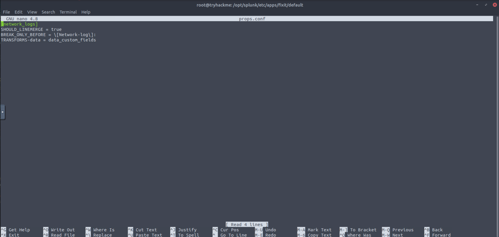
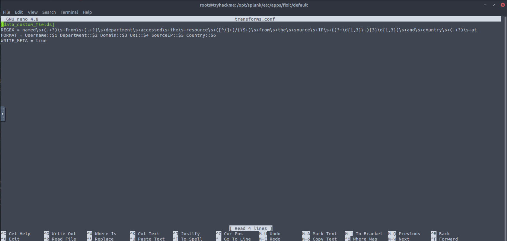
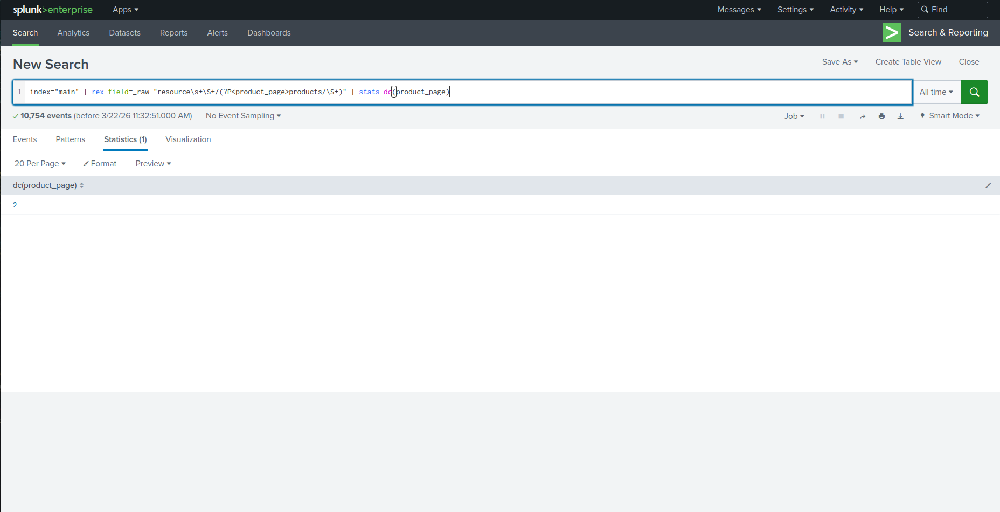
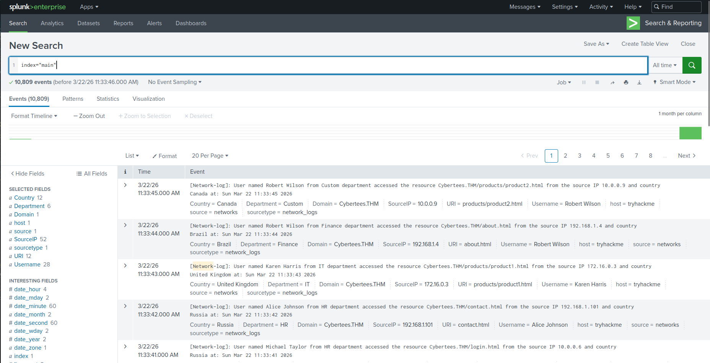

# 🔧 Splunk Fixit – Log Parsing & Network Traffic Analysis

---

## 📌 Scenario

During a SOC Level 2 assessment simulation, raw network logs were ingested into Splunk in an unusable format. As a SOC analyst, the objective was to fix parsing issues, extract meaningful fields, and analyze network activity.

---

## 🎯 Objectives

The investigation was divided into three phases:

1. Fix event boundaries
2. Extract custom fields
3. Analyze network traffic

---

## ⚙️ Phase 1: Fixing Event Boundaries

### 🚨 Problem

* Logs were ingested as a single block
* Splunk could not distinguish between events

### 🛠️ Solution

* Fixed configuration inside:

  ```
  /opt/splunk/etc/apps/fixit
  ```

* Applied the following setting:

```conf
BREAK_ONLY_BEFORE = ^\[Network-log\]:
```


### ✅ Result

* Each log is now a separate event
* Data became structured and searchable

---

## 🧩 Phase 2: Field Extraction

### 🎯 Extracted Fields

* Username
* Department
* Domain
* URI
* SourceIP
* Country


### 🛠️ Method

* Regex-based extraction using Splunk (props.conf / UI)

### 📊 Key Results

* Domain:

  ```
  Cybertees.THM
  ```

* Total usernames:

  ```
  28
  ```

* Total URIs:

  ```
  12
  ```

---

## 🔍 Phase 3: Network Traffic Analysis

### 📈 Findings

* `/products` pages accessed:

  ```
  2
  ```


* URI without extension:

  ```
  /sales/
  ```

* Most active user:

  ```
  Robert Wilson
  ```

* Unique IP ranges:

  ```
  3
  ```

---

## 🚨 Suspicious Activity

Sensitive file access detected:

```
secret-document.pdf
```

### 👤 Responsible User

```
Sarah Hall
```

➡️ Indicates potential unauthorized access to sensitive data

---

## 📂 Key Paths

* Fixit App:

  ```
  /opt/splunk/etc/apps/fixit
  ```

* Script Path:

  ```
  /opt/splunk/etc/apps/fixit/bin/network-logs
  ```

---

## 🧠 Skills Demonstrated

* Log parsing & normalization
* Regex field extraction
* Splunk configuration
* Network traffic analysis
* Detection of suspicious behavior

---

## 🏁 Conclusion

This challenge highlights the importance of proper log parsing before analysis. After fixing event boundaries and extracting structured fields, meaningful insights were obtained, including user activity, accessed resources, and potential data exposure.

This reflects real-world SOC workflows where analysts transform raw logs into actionable intelligence.
