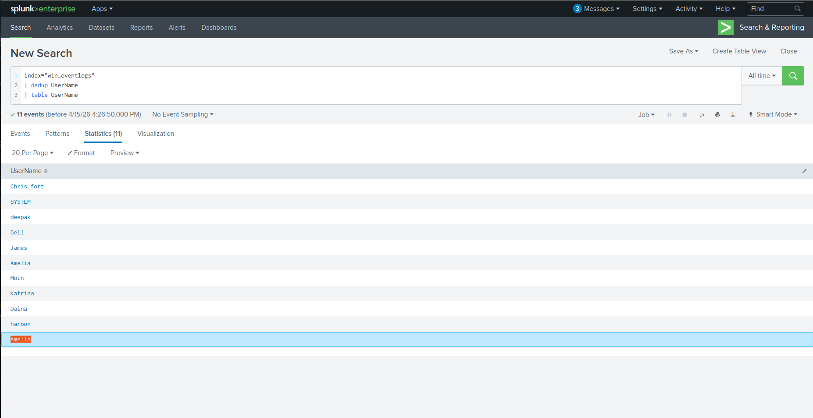
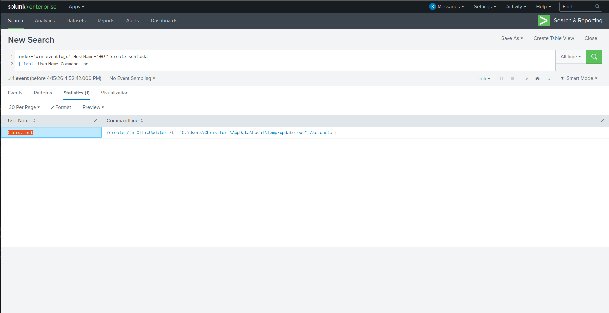
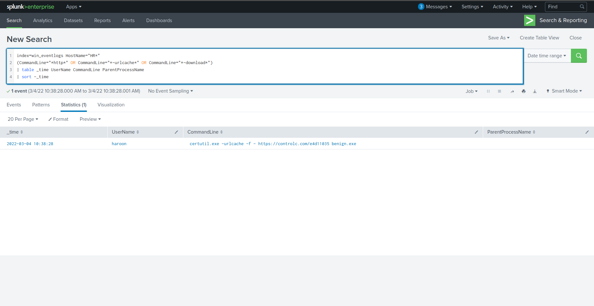
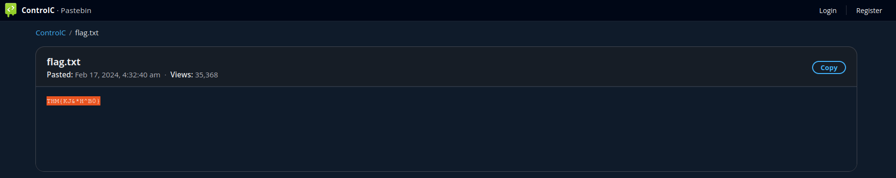

# 🔍 Windows Process Execution – HR Compromise Investigation

---

## 📌 Scenario

An IDS alert flagged suspicious process execution on a host within the HR department.

Due to limited resources, only **Windows process creation logs (Event ID: 4688)** were collected and ingested into Splunk under:

```
index=win_eventlogs
```

The objective was to identify the compromised user, analyze attacker behavior, and trace post-exploitation activity.

---

## 🎯 Investigation Objectives

* Identify compromised host/user
* Detect suspicious process execution
* Analyze LOLBins usage
* Identify payload delivery and C2 communication
* Detect persistence techniques

---

## 📊 Initial Findings

* Total logs (March 2022):

```
13959
```

---

## 🕵️ Suspicious Account Activity

### 🚨 Imposter Account Detected

```
Amel1a
```


➡️ Attacker used a **lookalike username** to evade detection

---

## 👥 HR Department Compromise

### 🧑‍💻 User Running Scheduled Tasks

```
Chris.fort
```


➡️ Indicates possible **persistence via scheduled tasks**

---

### ⚠️ Compromised User

```
haroon
```
➡️ Identified as the user executing malicious activity

---

## 🛠️ Defense Evasion & Execution

### ⚙️ LOLBIN Used

```
certutil.exe
```


➡️ Used to download payload from the internet (Living-Off-The-Land technique)

---

### 📅 Execution Date

```
2022-03-04
```

---

## 🌐 Payload Delivery

### 🌍 Hosting Site

```
controlc.com
```


---

### 📥 Downloaded File

```
benign.exe
```


---

### 🔗 Full URL

```
https://controlc.com/e4d11035
```


---

## 🧬 Indicators of Compromise (IOC)

### 🧾 Malicious Pattern

```
THM{KJ&*H^B0}
```


---

## 🚨 Attack Summary

* Imposter account created (`Amel1a`)
* HR user (`haroon`) compromised
* LOLBIN (`certutil.exe`) used for payload download
* Payload hosted on `controlc.com`
* Malicious file (`benign.exe`) executed
* Scheduled tasks used for persistence
* External communication with attacker-controlled URL

---

## 🧠 Skills Demonstrated

* Windows Event Log Analysis (Event ID 4688)
* Splunk Threat Hunting
* LOLBins Detection
* Persistence Mechanism Identification
* IOC Extraction & Analysis
* Attack Timeline Reconstruction

---

## 🏁 Conclusion

The investigation confirmed a compromise within the HR department involving multiple malicious activities.

The attacker leveraged **LOLBins (certutil.exe)** to download a payload, executed it, and established persistence via scheduled tasks.

Additionally, impersonation techniques were used to evade detection.

This scenario reflects real-world SOC investigations involving **process monitoring, payload delivery, and stealthy persistence techniques**.

---
