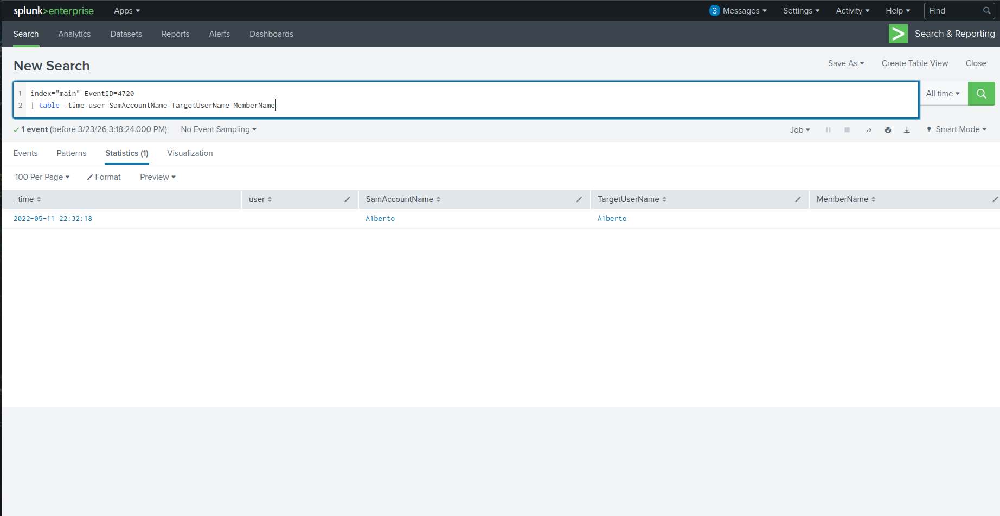
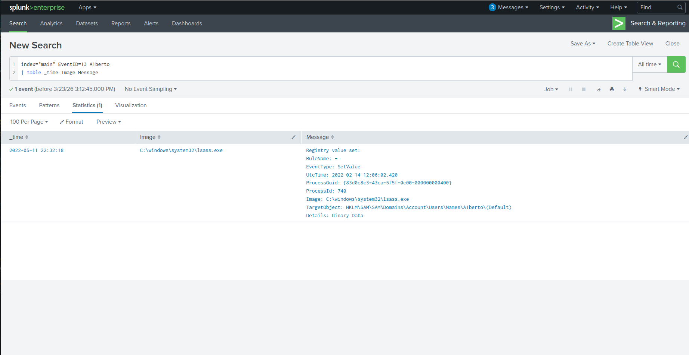
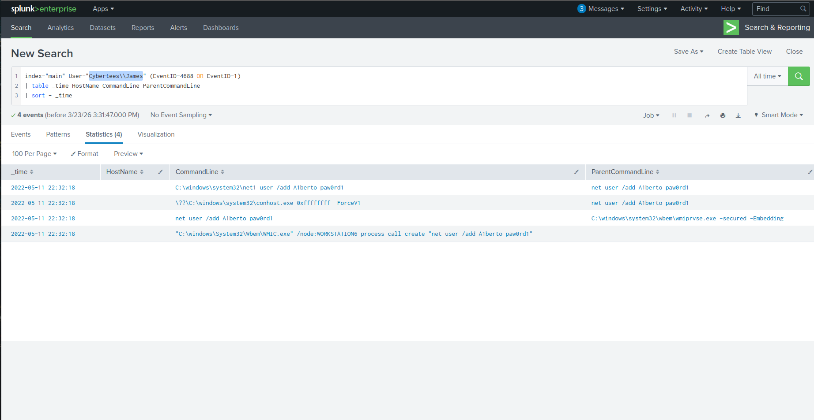
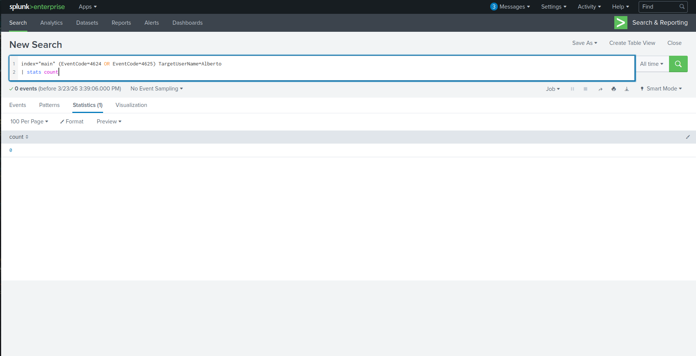
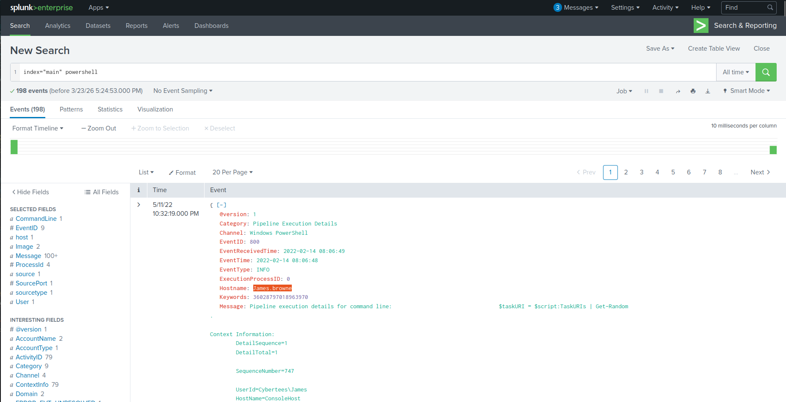
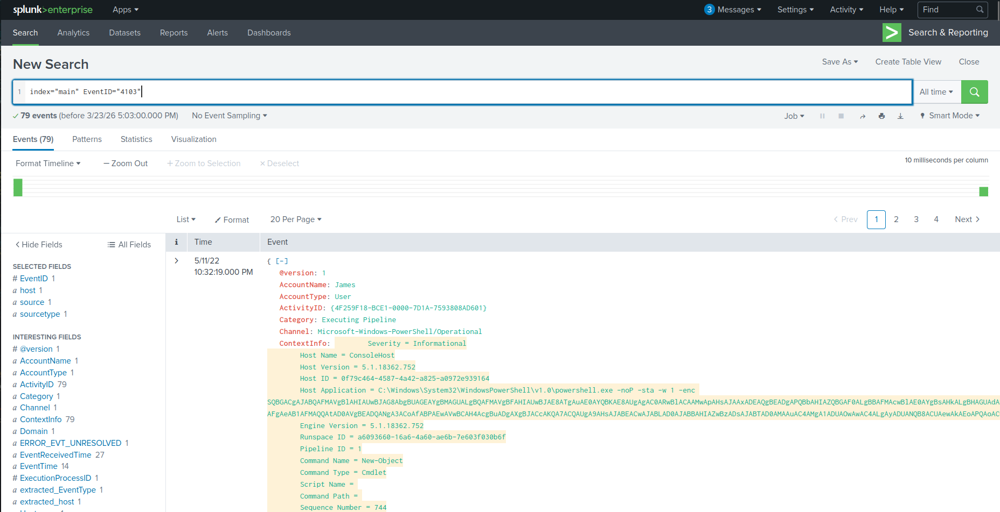
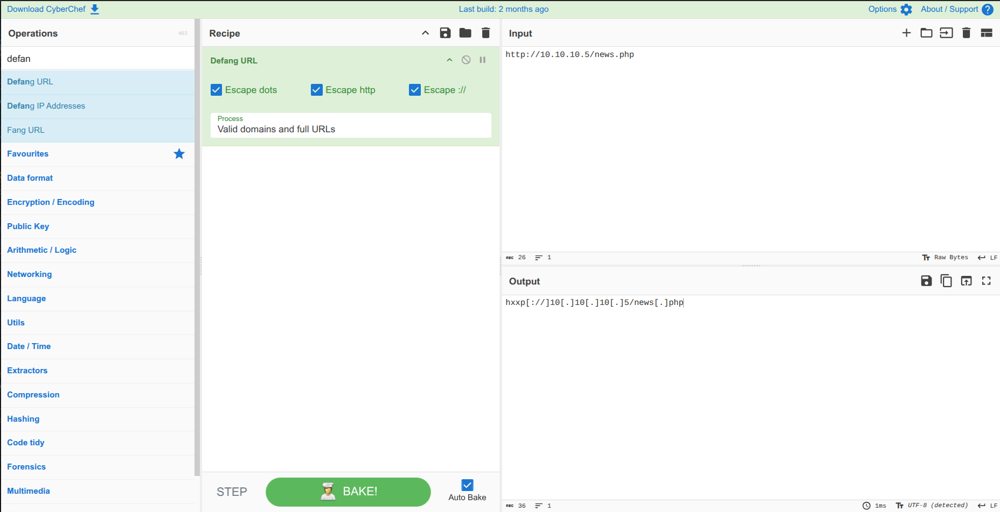

# 🔍 Investigating with Splunk – Windows Compromise Analysis

---

## 📌 Scenario

SOC Analyst observed anomalous activity across multiple Windows hosts. Logs were collected and ingested into Splunk (`index=main`) for investigation.

The objective was to identify attacker behavior, persistence mechanisms, and signs of compromise.

---

## 🎯 Investigation Objectives

* Identify compromised hosts
* Detect persistence mechanisms
* Analyze attacker activity
* Trace command execution and communication

---

## 📊 Initial Findings

* Total events ingested:

  ```
  12256
  ```

---

## 👤 Persistence Mechanism

### 🧑‍💻 Backdoor User Created

```
A1berto
```


### 🗂️ Registry Key Modified

```
HKLM\SAM\SAM\Domains\Account\Users\Names\A1berto
```


➡️ Indicates user creation persisted at system level

---

## 🎭 Defense Evasion

### 🔎 Impersonation Attempt

```
Alberto
```

➡️ Attacker created a visually similar username to evade detection

---

## 🛠️ Lateral Movement / Execution

### ⚙️ Remote Command Execution via WMIC

```id="k3p9dn"
C:\windows\System32\Wbem\WMIC.exe /node:WORKSTATION6 process call create "net user /add A1berto paw0rd1"
```


➡️ Indicates remote execution and account creation on target host

---

## 🔐 Authentication Analysis

* Backdoor login attempts observed:

  ```
  0
  ```


➡️ Suggests persistence was established but not actively used yet

---

## 💻 Infected Host Activity

### 🖥️ Compromised Machine

```
James.browne
```


---

## ⚡ Malicious PowerShell Activity

* Total malicious PowerShell events:

  ```
  79
  ```


### 🌐 Suspicious Web Request

```
hxxp://10.10.10.5/news.php
```


➡️ Likely C2 communication or payload retrieval

---

## 🚨 Attack Summary

* Backdoor user created (`A1berto`)
* Registry modified for persistence
* WMIC used for remote command execution
* PowerShell used for malicious activity
* External communication established

---

## 🧠 Skills Demonstrated

* Splunk log analysis
* Windows Event Log investigation
* Detection of persistence mechanisms
* Identifying impersonation techniques
* PowerShell threat analysis
* Lateral movement detection

---

## 🏁 Conclusion

The investigation confirmed that the attacker successfully compromised a Windows host, created a persistent backdoor user, and attempted to evade detection through username impersonation.

Further activity included remote command execution via WMIC and malicious PowerShell usage, indicating advanced post-exploitation behavior and possible command-and-control communication.

This scenario reflects real-world SOC investigations involving Windows environments and highlights the importance of monitoring authentication, registry changes, and script execution.
