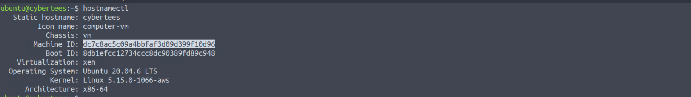
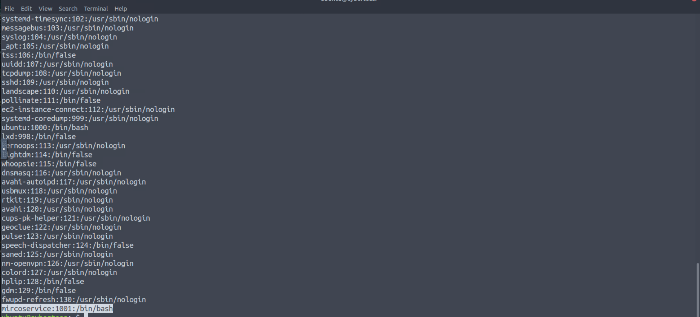
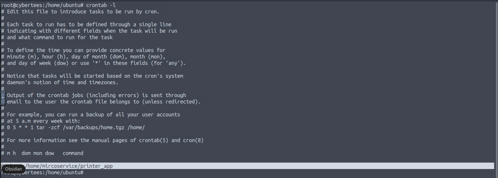
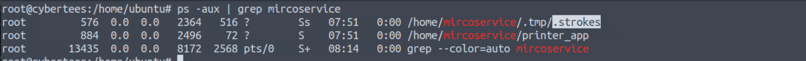
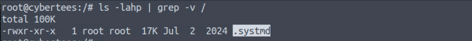
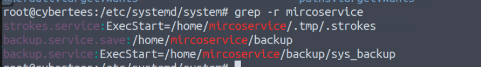
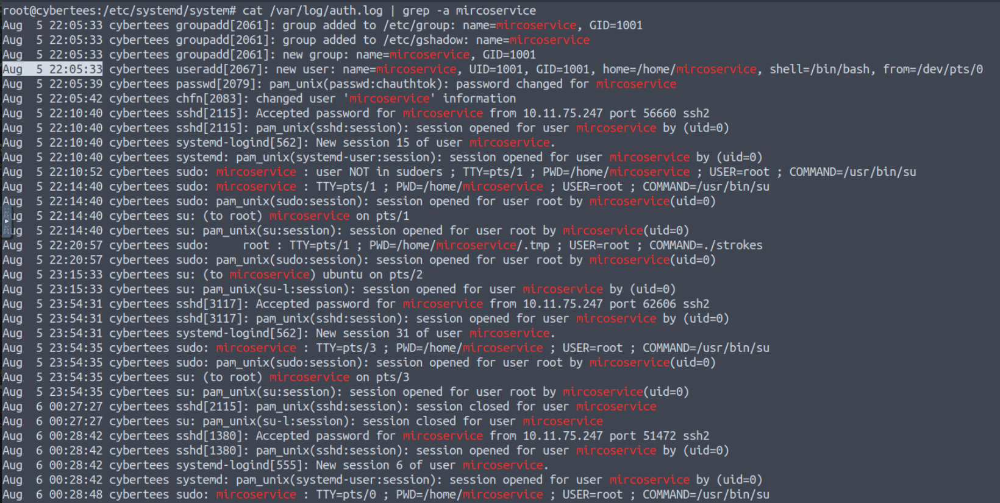
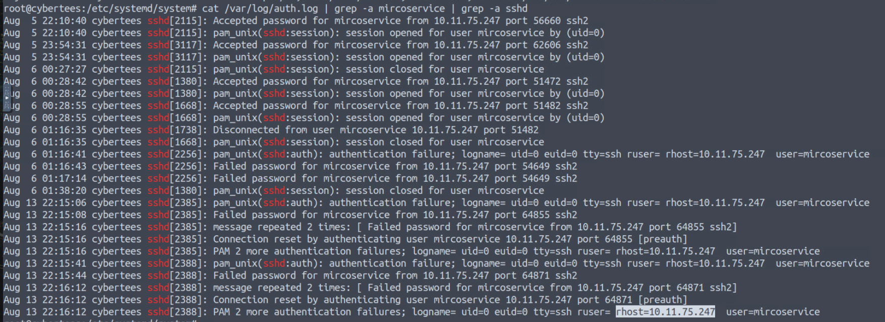
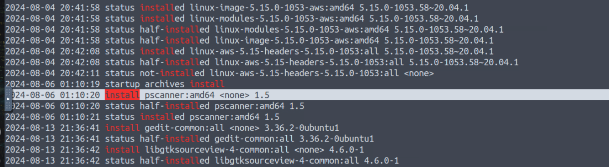
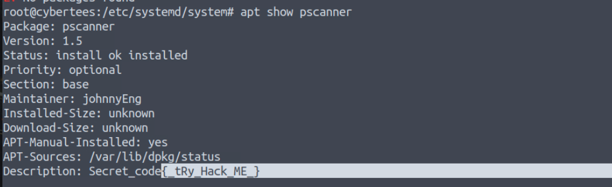

# IronShade — CTF Writeup

* **Platform:** TryHackMe  
* **Room:** IronShade  
* **Category:** DFIR / Linux Forensics / APT Investigation  
* **Difficulty:** Medium  
* **Analyst:** Mahmoud Hussien
* **Tools:** Linux CLI, systemd, auth.log, dpkg, /proc

---

## Scenario Overview

The IronShade APT group was observed targeting Linux servers across the region. A honeypot was deliberately configured with weak SSH credentials and exposed ports to attract the threat actor and study their TTPs. This report documents the full compromise assessment performed on the infected Ubuntu server (`cybertees`), uncovering persistence mechanisms, hidden processes, masqueraded binaries, and a tampered software package.

---

## System Identification

```bash
hostnamectl
```

| Attribute | Value |
|---|---|
| Hostname | `cybertees` |
| Machine ID | `dc7c8ac5c09a4bbfaf3d09d399f10d96` |
| Boot ID | `8db1efcc12734ccc8dc90389fd89c948` |
| OS | Ubuntu 20.04.6 LTS |
| Kernel | Linux 5.15.0-1066-aws |
| Architecture | x86-64 |
| Virtualization | Xen (AWS Instance) |

---

## Question 1 — What is the Machine ID of the machine we are investigating?

### Investigation

The Machine ID is a persistent, unique identifier assigned to a Linux system at installation time and stored in `/etc/machine-id`. It survives reboots and is used for system identification.

```bash
cat /etc/machine-id
# or
hostnamectl | grep "Machine ID"
```

### Answer

```
dc7c8ac5c09a4bbfaf3d09d399f10d96
```


---

## Question 2 — What backdoor user account was created on the server?

### Investigation

Reviewing `/etc/passwd` for recently added accounts or accounts with unexpected home directories and shells reveals the attacker's planted backdoor account. The account was created with UID/GID `1001`, a home directory under `/home/`, and an interactive `/bin/bash` shell — consistent with a persistence account designed for SSH access.

```bash
cat /etc/passwd | cut -d: -f1,3,7
```

The account name deliberately mimics a legitimate-sounding service name (`microservice` with a typo: `mirco`) to deceive system administrators during a cursory review.

### Answer

```
mircoservice
```


---

## Question 3 — What is the cronjob set up by the attacker for persistence?

### Investigation

Checking the root crontab for unauthorized scheduled tasks:

```bash
crontab -l
sudo crontab -l
cat /var/spool/cron/crontabs/root
```

The attacker registered a `@reboot` trigger to automatically execute the `printer_app` binary every time the system boots — ensuring the malware survives reboots without requiring manual re-execution.

### Answer

```
@reboot /home/mircoservice/printer_app
```


---

## Question 4 — What is the suspicious hidden process from the backdoor account?

### Investigation

Enumerating all running processes and filtering for those originating from the backdoor account's directory:

```bash
ps aux | grep mircoservice
ls -la /proc/*/exe 2>/dev/null | grep mircoservice
```

Two processes were found running from the backdoor account's home directory. The suspicious hidden one resides inside a hidden subdirectory (`.tmp`) and is itself a hidden file (prefixed with `.`), making it invisible to standard `ls` commands without the `-a` flag.

| PID | Process Path |
|---|---|
| 576 | `/home/mircoservice/.tmp/.strokes` |
| 884 | `/home/mircoservice/printer_app` |

### Answer

```
/home/mircoservice/.tmp/.strokes
```


---

## Question 5 — How many processes are running from the backdoor account's directory?

### Investigation

Counting all active processes with executable paths under `/home/mircoservice/`:

```bash
ls -la /proc/*/exe 2>/dev/null | grep "/home/mircoservice" | wc -l
```

Both PIDs 576 and 884 are confirmed running with full `root` privileges despite originating from the backdoor user's directory.

### Answer

```
2
```

---

## Question 6 — What is the name of the hidden file in memory from the root directory?

### Investigation

Scanning the filesystem root (`/`) for hidden files (those prefixed with `.`) that should not legitimately exist at that level:

```bash
ls -lahp | grep -v /
```

A suspicious executable was found directly at `/` — a location where no legitimate application binary should reside. The file was named to closely impersonate the real `systemd` binary (`systemd` vs `systmd`), a classic masquerading technique designed to deceive defenders doing a quick visual scan.

```
/.systmd
Size: 17K | Permissions: -rwxr-xr-x | Owner: root
```

### Answer

```
/.systmd
```


---

## Question 7 — What suspicious services were installed on the server?

### Investigation

Reviewing custom systemd unit files installed outside of standard package management:

```bash
grep -r mircoservice
```

Two unauthorized services were found, both pointing to binaries within the backdoor account's home directory — providing persistent execution that survives reboots and runs independently of cron.

| Service | Target Binary |
|---|---|
| `backup.service` | `/home/mircoservice/backup/sys_backup` |
| `strokes.service` | `/home/mircoservice/.tmp/.strokes` |

### Answer

```
backup.service, strokes.service
```


---

## Question 8 — When was the backdoor account created on this infected system?

### Investigation

Reviewing the authentication log for account creation events:

```bash
cat /var/log/auth.log | grep -a mircoservice
```

The log entry confirms the exact timestamp when the attacker created the backdoor account after gaining initial access to the system.

### Answer

```
Aug 5 22:05:33
```


---

## Question 9 — From which IP address were multiple SSH connections observed against the backdoor account?

### Investigation

Filtering authentication logs for SSH connections:

```bash
grep "mircoservice" /var/log/auth.log | grep "Accepted"
cat /var/log/auth.log | grep -a mircoservice | grep -a sshd
```

All successful and attempted SSH sessions for the `mircoservice` account originated from a single external IP — the threat actor's source.

### Answer

```
10.11.75.247
```


---

## Question 10 — How many failed SSH login attempts were observed on the backdoor account?

### Investigation

Counting failed authentication attempts against the `mircoservice` account across the full log timeframe:

```bash
grep "mircoservice" /var/log/auth.log | grep "Failed" | wc -l
cat /var/log/auth.log | grep -a mircoservice | grep -a sshd | grep -s Failed
```

The failed attempts (observed Aug 6–13) are consistent with automated tooling or faulty scripts repeatedly attempting to re-authenticate.

### Answer

```
8
```

---

## Question 11 — Which malicious package was installed on the host?

### Investigation

Reviewing the dpkg installation log for manually installed packages outside of standard system updates:

```bash
grep "install" /var/log/dpkg.log
```

Log entry confirming the unauthorized installation:

```
2024-08-06 01:10:21 status installed pscanner:amd64 1.5
```

The package was installed approximately 5 minutes after the threat actor's first privilege escalation — part of the post-exploitation tooling deployment phase.

### Answer

```
pscanner
```


---

## Question 12 — What is the secret code found in the metadata of the suspicious package?

### Investigation

Extracting and inspecting the package metadata to identify adversary-embedded indicators:

```bash
dpkg -s pscanner
apt show pscanner
```

Package metadata summary:

| Field | Value |
|---|---|
| Name | `pscanner` |
| Version | `1.5` |
| Maintainer | `johnnyEng` |
| Install Status | Manual (`APT-Manual-Installed: yes`) |
| Secret Code | `Secret_code{_tRy_Hack_ME_}` |

The secret code embedded in the package metadata serves as an adversary watermark — a hallmark of custom-built APT tooling.

### Answer

```
Secret_code{_tRy_Hack_ME_}
```


---

## Full Attack Chain Reconstruction

```
[Aug 5, 22:05:33] — Persistence Setup
    └─ Backdoor account created: mircoservice (UID 1001)
    └─ Password set for remote SSH access

[Aug 5, 22:10:40] — Initial Access
    └─ First SSH connection from 10.11.75.247
    └─ Authenticated as: mircoservice

[Aug 5, 22:14:40] — Privilege Escalation
    └─ su → root via mircoservice session

[Aug 5, 22:20:57] — Malware Execution
    └─ sudo ./strokes from /home/mircoservice/.tmp/
    └─ Hidden binary executed with root privileges

[Aug 6, 01:10:21] — Tool Deployment
    └─ Unauthorized package installed: pscanner v1.5
    └─ Maintainer: johnnyEng

[Aug 6 – Aug 13] — Sustained Access
    └─ Multiple SSH reconnections from 10.11.75.247
    └─ 8 failed login attempts recorded
    └─ Persistent processes: PIDs 576, 884
```

---

## Persistence Mechanisms Summary

| Mechanism | Detail |
|---|---|
| Backdoor Account | `mircoservice` — interactive bash shell, SSH-accessible |
| Cronjob | `@reboot /home/mircoservice/printer_app` |
| Systemd Service 1 | `backup.service` → `/home/mircoservice/backup/sys_backup` |
| Systemd Service 2 | `strokes.service` → `/home/mircoservice/.tmp/.strokes` |

---

## Indicators of Compromise (IOCs)

| Type | Value | Description |
|---|---|---|
| IP Address | `10.11.75.247` | Threat Actor Source IP |
| Username | `mircoservice` | Backdoor Account |
| File | `/home/mircoservice/.tmp/.strokes` | Hidden Malware Binary (PID 576) |
| File | `/home/mircoservice/printer_app` | Cronjob Persistence Binary (PID 884) |
| File | `/.systmd` | Masqueraded Root-Level Binary |
| Service | `backup.service` | Malicious Systemd Service |
| Service | `strokes.service` | Malicious Systemd Service |
| Package | `pscanner v1.5` | Unauthorized APT Package |
| Secret Code | `Secret_code{_tRy_Hack_ME_}` | Package Metadata Watermark |

---

## Key Linux Forensics Commands Reference

```bash
# System identification
hostnamectl
cat /etc/machine-id

# Backdoor account discovery
cat /etc/passwd | cut -d: -f1,3,7
cat /etc/passwd | grep "/bin/bash"

# Cronjob inspection
sudo crontab -l
cat /var/spool/cron/crontabs/root

# Running process enumeration
ps -aux | grep mircoservice
ls -la /proc/*/exe 2>/dev/null | grep mircoservice

# Hidden files in root directory
ls -lahp | grep -v /

# Suspicious systemd services
grep -r mircoservice

# Authentication log analysis
cat /var/log/auth.log | grep -a mircoservice
grep "mircoservice" /var/log/auth.log | grep "new user"
grep "mircoservice" /var/log/auth.log | grep "Accepted"
grep "mircoservice" /var/log/auth.log | grep "Failed" | wc -l

# Package installation history
grep "install" /var/log/dpkg.log
```

---

## MITRE ATT&CK Mapping

| Phase | Technique ID | Technique Name |
|---|---|---|
| Initial Access | T1110.001 | Brute Force: Password Guessing (SSH) |
| Execution | T1059.004 | Unix Shell |
| Persistence | T1136.001 | Create Account: Local Account |
| Persistence | T1053.003 | Scheduled Task/Job: Cron |
| Persistence | T1543.002 | Create or Modify System Process: Systemd Service |
| Privilege Escalation | T1548 | Abuse Elevation Control Mechanism (su) |
| Defense Evasion | T1036 | Masquerading (`/.systmd`, `.strokes`) |
| Defense Evasion | T1564.001 | Hide Artifacts: Hidden Files and Directories |
| Command & Control | T1021.004 | Remote Services: SSH |
| Discovery | T1057 | Process Discovery |

---

## Recommendations

1. **Host Isolation** — Immediately disconnect the `cybertees` instance from the network to stop outbound communications from `10.11.75.247`.
2. **Account Revocation** — Terminate all active sessions for UID 1001, delete the `mircoservice` account, and audit `/etc/sudoers` for unauthorized privilege rules.
3. **Artifact Purge** — Kill PIDs 576 and 884, remove the rogue cronjob, delete systemd unit files (`backup.service`, `strokes.service`), and purge `/.systmd` and `/home/mircoservice/`.
4. **Package Removal** — Completely purge the compromised package: `apt purge pscanner`.
5. **SSH Hardening** — Disable password-based SSH authentication; enforce key-only login. Implement Fail2Ban for brute-force protection.
6. **Monitor Hidden Directories** — Deploy AIDE or auditd rules to alert on new hidden files created in `/`, `/tmp`, and home directories.

---

*Writeup produced as part of SOC Analyst training — TryHackMe: IronShade*