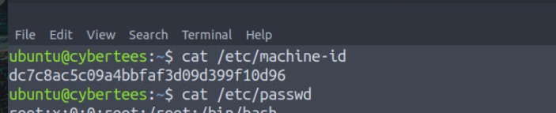
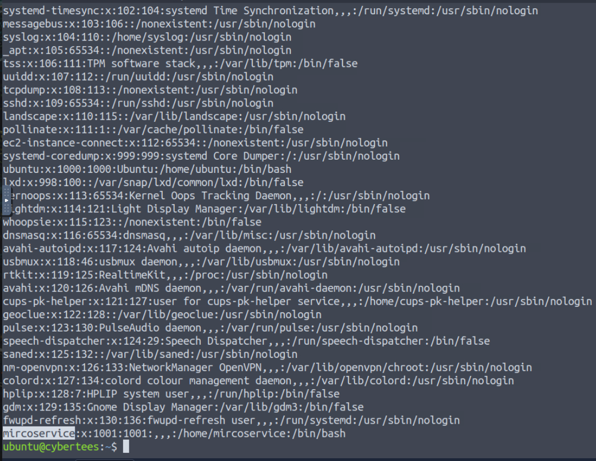
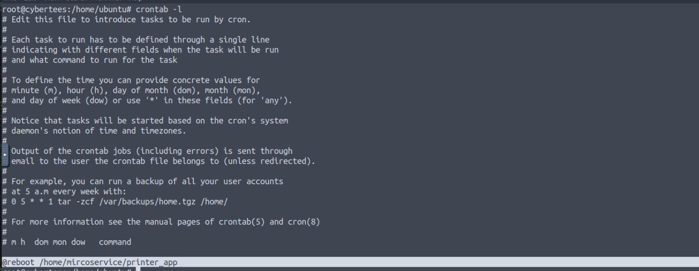
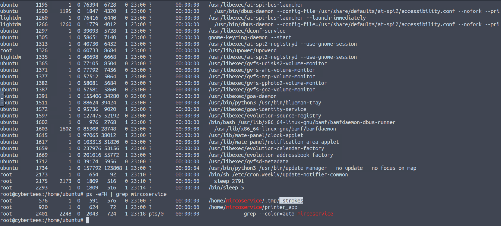
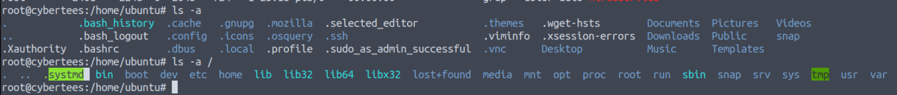
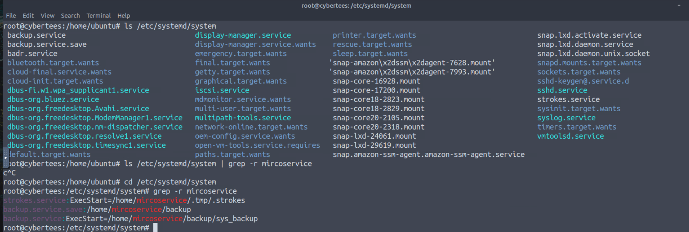
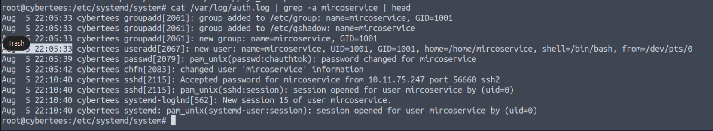
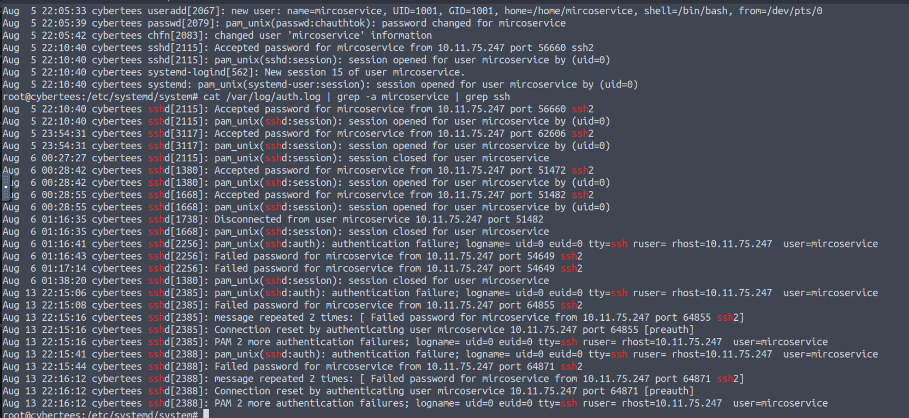
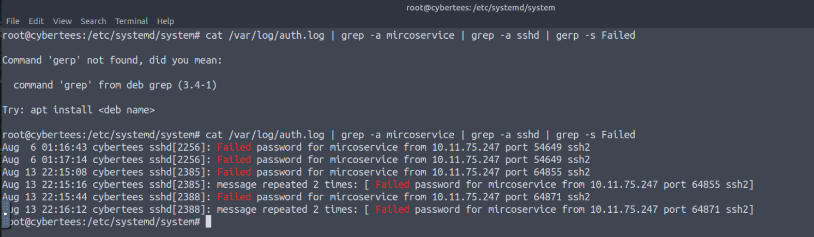
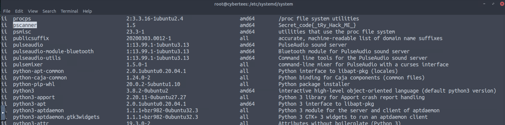

# 🛡️ IronShade APT Attack – Linux Compromise Investigation

---

## 📌 Scenario

Threat intelligence reports indicated that an APT group known as **IronShade** is actively targeting Linux servers. A honeypot system was deployed with intentionally exposed services (SSH) to capture attacker behavior.

The system was successfully compromised, and logs along with system artifacts were collected for investigation.

The objective was to identify attacker activity, persistence mechanisms, and indicators of compromise (IOCs).

---

## 🎯 Investigation Objectives

* Identify attacker entry and access method
* Detect persistence mechanisms
* Analyze malicious processes and services
* Investigate system logs for attacker activity
* Identify installed malware and artifacts

---

## 🖥️ Target System

### 🆔 Machine ID

```
dc7c8ac5c09a4bbfaf3d09d399f10d96
```


---

## 👤 Persistence Mechanism

### 🧑‍💻 Backdoor User Created

```
mircoservice
```


➡️ Attacker created a new user account to maintain access

---

### ⏰ Cronjob Persistence

```
@reboot /home/mircoservice/printer_app
```


➡️ Ensures malicious payload execution after system reboot

---

## ⚙️ Malicious Processes

### 🧩 Hidden Process Identified

```
.strokes
```


➡️ Suspicious hidden process running under attacker account

---

### 📂 Processes from Attacker Directory

```
2
```

➡️ Multiple processes indicate active attacker operations

---

## 🧠 Memory Artifact

### 🕵️ Hidden File in Memory

```
.systmd
```


➡️ Indicates stealth techniques to hide malicious components

---

## 🛠️ Malicious Services

### ⚙️ Installed Services

```
backup.service, strokes.service
```


➡️ Used to maintain persistence and execute malicious code

---

## 🔐 Authentication Analysis

### 🕒 Backdoor Account Creation Time

```
Aug  5 22:05:33
```


➡️ Timestamp confirms when attacker established persistence

---

### 🌐 Attacker IP Address

```
10.11.75.247
```


➡️ Source of repeated SSH connections

---

### ❌ Failed Login Attempts

```
8
```


➡️ Indicates brute-force or repeated access attempts

---

## 📦 Malware Analysis

### 🧪 Malicious Package Installed

```
pscanner
```


➡️ Likely used for scanning or post-exploitation activities

---

### 🔑 Secret Code (Metadata)

```
{_tRy_Hack_ME_}
```

➡️ Extracted from package metadata

---

## 🚨 Attack Summary

* Backdoor user account created (`mircoservice`)
* Persistence established via cronjob
* Hidden processes and files detected
* Malicious services installed
* SSH brute-force activity observed
* Malware package (`pscanner`) deployed
* Attacker activity traced to external IP

---

## 🧠 Skills Demonstrated

* Linux Incident Response
* Log Analysis & Correlation
* Persistence Detection (cronjobs, users, services)
* Process & Memory Analysis
* IOC Identification

---

## 🏁 Conclusion

The investigation confirmed that the **IronShade APT group** successfully compromised the Linux system and established multiple persistence mechanisms, including a backdoor user, cronjob execution, and malicious services.

The attacker leveraged stealth techniques such as hidden processes and memory-resident files to evade detection, while maintaining access through repeated SSH connections.

This scenario reflects a real-world advanced attack, demonstrating the importance of deep log analysis, process monitoring, and persistence detection in SOC operations.
