# Lockdown Lab — CTF Writeup

* **Platform:** CyberDefenders  
* **Challenge:** Lockdown Lab  
* **Category:** Network Forensics / Memory Analysis / Malware Analysis  
* **Difficulty:** Easy  
* **Analyst:** Mahmoud Hussien
* **Tools:** Wireshark, Volatility 3, VirusTotal  

---

## Scenario Overview

TechNova Systems' SOC detected suspicious outbound traffic from a public-facing IIS server. Forensic analysis confirmed a multi-stage intrusion: the attacker performed network reconnaissance, enumerated SMB shares, planted an ASPX web shell, established a reverse shell, deployed a persistence implant (`updatenow.exe`) in the Startup folder, and ultimately ran **AgentTesla** — a commodity RAT configured to beacon to Ukrainian C2 infrastructure.

Three artefacts were provided:
- **PCAP** — network traffic capture
- **memdump.mem** — full memory image of the IIS server
- **Malware sample** — `updatenow.exe` recovered from disk

---

## Attack Chain Overview

```
[1] Reconnaissance
    └─ TCP port scan + HTTP Nmap NSE enumeration

[2] Discovery
    └─ SMB2 Tree Connect → \Documents, \IPC$

[3] Initial Access
    └─ Web shell upload: shell.aspx → /Documents/

[4] Execution & C2
    └─ shell.aspx executed via w3wp.exe (PID: 4332)
    └─ Reverse shell callback → 10.0.2.4:4443

[5] Persistence
    └─ updatenow.exe dropped in Windows Startup folder

[6] Defense Evasion
    └─ Binary packed with UPX

[7] C2 Beaconing
    └─ AgentTesla → cp8nl.hyperhost.ua
```

---

## Question 1 — Which IP address generated the reconnaissance traffic?

### Investigation

**Wireshark Filter:**

```
tcp.flags.syn == 1 && tcp.flags.ack == 0
```

Analyzing the SYN packet volume per source IP revealed one host generating a high-volume burst of TCP SYN packets across multiple ports in rapid succession — the classic signature of an **automated port scanner**. This was the earliest activity observed in the PCAP.

### Answer

```
10.0.2.4
```
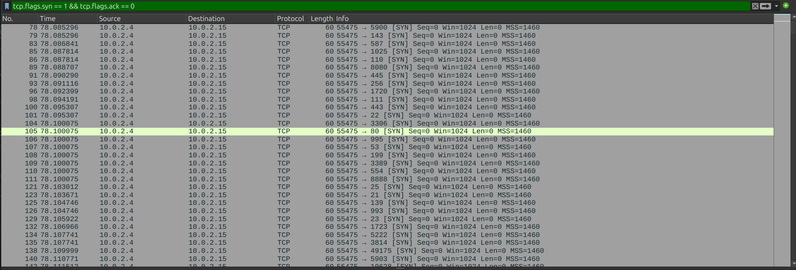

---

## Question 2 — Which tool is being used for HTTP enumeration?

### Investigation

**Wireshark Filter:**

```
http.user_agent contains "Nmap"
```

Filtering HTTP traffic for the attacker's IP revealed requests with a distinctive User-Agent string identifying the tool as the **Nmap Scripting Engine (NSE)** — Nmap's built-in framework for targeted service fingerprinting and vulnerability probing over HTTP.

### Answer

```
nmap
```
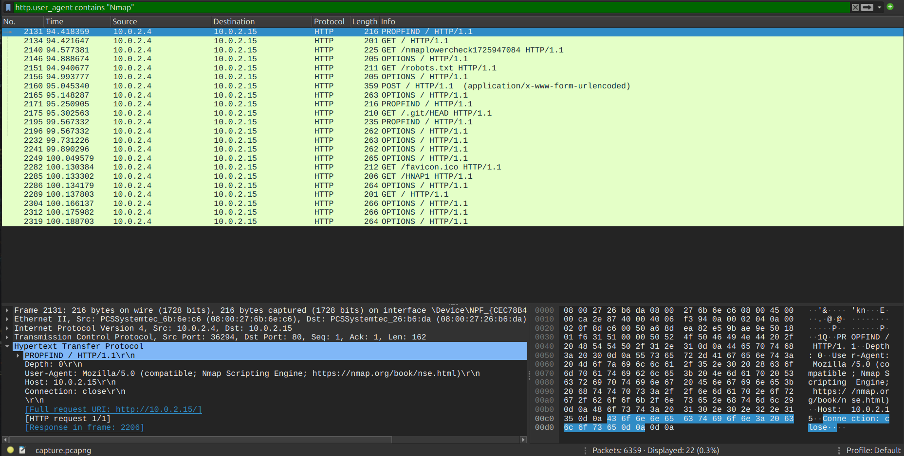

---

## Question 3 — Which two UNC paths were accessed via SMB?

### Investigation

**Wireshark Filter:**

```
smb2.cmd == 3
```

SMB2 command code `3` corresponds to **Tree Connect** requests — the SMB operation used to connect to a network share. Two consecutive Tree Connect requests from `10.0.2.4` were captured, exposing the shares the attacker probed on the IIS host:

| Share | Purpose |
|---|---|
| `\\10.0.2.15\Documents` | Web-accessible share — used for web shell upload |
| `\\10.0.2.15\IPC$` | Inter-Process Communication pipe — standard SMB enumeration target |

### Answer

```
\\10.0.2.15\Documents, \\10.0.2.15\IPC$
```
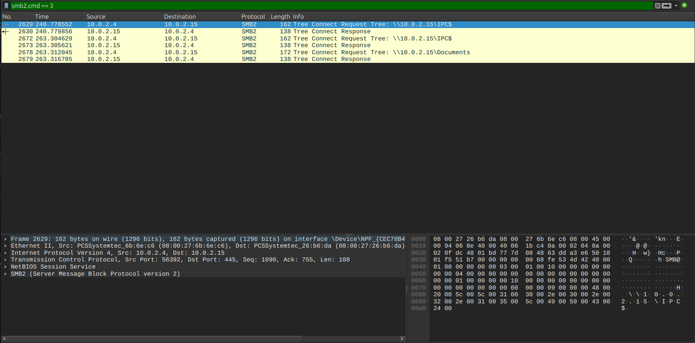

---

## Question 4 — What is the filename of the malicious file uploaded to the share?

### Investigation

Following the SMB Tree Connect to `\\10.0.2.15\Documents`, subsequent SMB2 traffic showed a file write operation. The attacker uploaded an ASPX file — a server-side scripting format executed by IIS — into the web-accessible Documents share, granting Remote Code Execution capability via HTTP requests.

**Wireshark Filter:**

```
smb2.cmd == 5 && smb2.filename contains ".aspx"
```

### Answer

```
shell.aspx
```
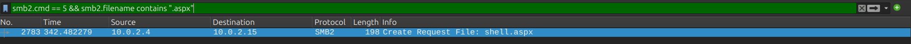

---

## Question 5 — Which port did the attacker use for the reverse shell?

### Investigation

After uploading `shell.aspx`, the attacker triggered it via HTTP. The web shell initiated an **outbound reverse TCP connection** back to the attacker's machine. Filtering for outbound connections from the IIS server (`10.0.2.15`) to the attacker (`10.0.2.4`):

```
ip.src == 10.0.2.15 && ip.dst == 10.0.2.4
```

The destination port `4443` was used — chosen to mimic HTTPS alternate port traffic and evade basic firewall rules blocking non-standard ports.

### Answer

```
4443
```
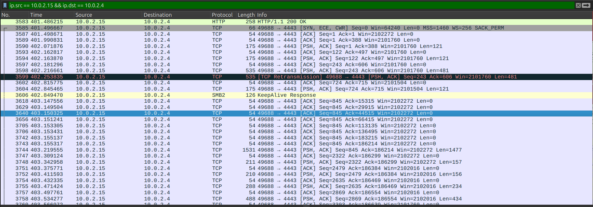

---

## Question 6 — What is the kernel base address in the memory dump?

### Investigation

**Volatility Command:**

```bash
vol -f memdump.mem windows.info
```

The `windows.info` plugin reads the memory image header and OS metadata to establish the forensic baseline. The kernel base address is extracted from the KDBG (Kernel Debugger Block) structure — a critical reference point for all subsequent memory analysis operations.

### Answer

```
0xf80079213000
```
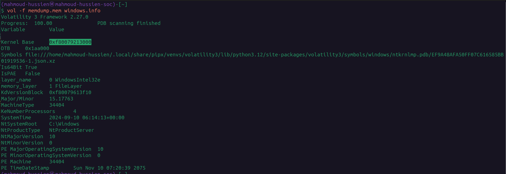

---

## Question 7 — What is the full on-disk path of the persistence implant?

### Investigation

**Volatility Command:**

```bash
vol -f memdump.mem windows.pstree
```

The process tree revealed an anomalous executable spawned by `w3wp.exe` (the IIS worker process) — a process that should only spawn IIS-related children. The implant was placed in the **Windows Startup folder**, ensuring execution on every system reboot:

```
C:\ProgramData\Microsoft\Windows\Start Menu\Programs\Startup\updatenow.exe
```

Placing malware in the Startup folder is a simple but effective **Boot/Logon Autostart** persistence technique that survives reboots without requiring registry modification privileges.

### Answer

```
C:\ProgramData\Microsoft\Windows\Start Menu\Programs\Startup\updatenow.exe
```
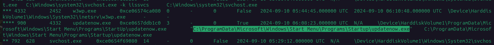

---

## Question 8 — What is the name and PID of the process handling the reverse shell?

### Investigation

**Volatility Command:**

```bash
vol -f memdump.mem windows.netscan | grep w3wp.exe
```

The `windows.netscan` plugin enumerates all active and recently closed network connections from memory. Filtering for `w3wp.exe` confirmed:

- The IIS worker process maintained the **outbound reverse shell connection** to `10.0.2.4:4443`
- The **same process** later spawned `updatenow.exe` (PID: 900) — linking the web shell execution to the persistence deployment

| Property | Value |
|---|---|
| Process Name | `w3wp.exe` |
| PID | `4332` |
| Connection | `10.0.2.15 → 10.0.2.4:4443` |

### Answer

```
w3wp.exe, 4332
```
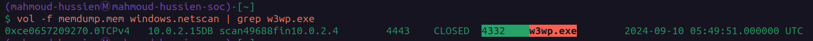

---

## Question 9 — Which packer was used to obfuscate the malware binary?

### Investigation

Static analysis of `updatenow.exe` using a PE inspection tool (PEiD / DIE / strings) revealed the binary's PE header had been modified with packer signatures. The entropy of the binary's sections was abnormally high — consistent with packed/compressed content. The packer identification string confirmed:

```
UPX 3.x → [LZMA]
```

**UPX (Ultimate Packer for eXecutables)** is a free, widely-used packer that compresses PE binaries. Malware authors abuse it to evade static signature detection — the actual malicious code is only unpacked in memory at runtime.

### Answer

```
UPX
```
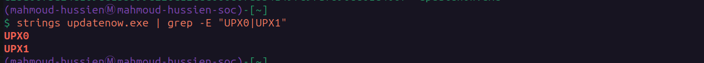

---

## Question 10 — Which FQDN does the malware contact for C2?

### Investigation

Submitted the SHA-256 hash of `updatenow.exe` to VirusTotal:

```
SHA-256: c25a6673a24d169de1bb399d226c12cdc666e0fa534149fc9fa7896ee61d406f
```

VirusTotal's **Relations** tab and sandbox behavioral analysis confirmed outbound DNS queries and HTTP connections to:

```
cp8nl.hyperhost.ua
```

The domain resolves to Ukrainian hosting infrastructure (hyperhost.ua) — a commercial hosting provider whose infrastructure has been observed hosting commodity RAT C2 servers.

### Answer

```
cp8nl.hyperhost.ua
```
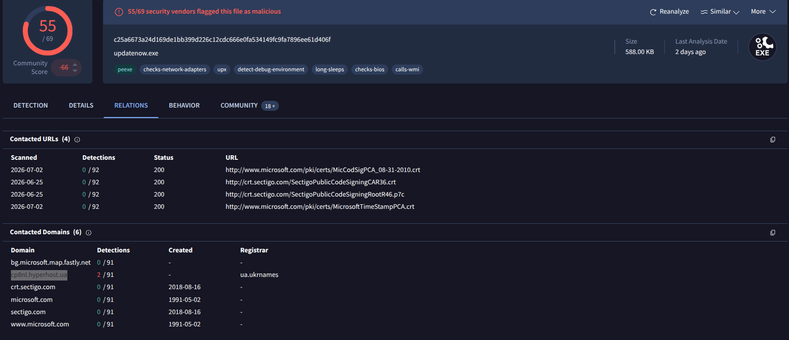

---

## Question 11 — Which malware family does the sample belong to?

### Investigation

Cross-referencing the SHA-256 hash across multiple threat intelligence platforms:
- **VirusTotal** — 40+ AV engines flagged as AgentTesla
- **Hatching Triage** (260515-lgrzfsbv4r) — Behavioral sandbox confirmed AgentTesla modules
- **FileScan.IO** — Static classification: AgentTesla RAT

**AgentTesla** is a commodity .NET-based **Remote Access Trojan and information stealer** targeting:
- Web browser saved credentials
- FTP client credentials
- Email client passwords
- Keystrokes and screenshots

### Answer

```
AgentTesla
```
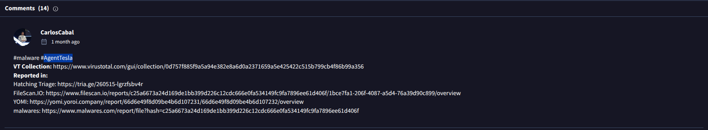

---

## Full Attack Timeline

| Time (GMT) | Source | Destination | Event |
|---|---|---|---|
| T+78.09s | `10.0.2.4` | `10.0.2.15` | Rapid TCP port scan (SYN flood) |
| T+94.42s | `10.0.2.4` | `10.0.2.15` | HTTP enumeration via Nmap NSE |
| T+240.78s | `10.0.2.4` | `10.0.2.15` | SMB2 Tree Connect → `\Documents`, `\IPC$` |
| 05:49:01 | `10.0.2.4` | `10.0.2.15` | `shell.aspx` uploaded to `\Documents\` |
| 05:49:51 | `w3wp.exe` (4332) | `10.0.2.4:4443` | Reverse shell callback established |
| 06:08:23 | `w3wp.exe` (4332) | Startup folder | `updatenow.exe` (PID: 900) deployed |
| 06:14:13 | Memory triage | Windows Server | RAM acquisition performed |
| Post-infection | `updatenow.exe` | `cp8nl.hyperhost.ua` | AgentTesla C2 beaconing |

---

## Indicators of Compromise (IOCs)

| Type | Value | Description |
|---|---|---|
| IP | `10.0.2.4` | Attacker source IP |
| IP | `10.0.2.15` | Victim IIS server |
| File | `shell.aspx` | ASPX web shell |
| Share | `\\10.0.2.15\Documents` | SMB share used for web shell upload |
| Port | `4443/TCP` | Reverse shell callback port |
| Process | `w3wp.exe` (PID: 4332) | IIS worker — web shell execution |
| File | `updatenow.exe` (PID: 900) | AgentTesla persistence implant |
| Path | `C:\ProgramData\Microsoft\Windows\Start Menu\Programs\Startup\updatenow.exe` | Startup folder persistence |
| Packer | `UPX` | Binary obfuscation packer |
| SHA-256 | `c25a6673a24d169de1bb399d226c12cdc666e0fa534149fc9fa7896ee61d406f` | `updatenow.exe` hash |
| FQDN | `cp8nl.hyperhost.ua` | AgentTesla C2 domain |
| Malware | `AgentTesla` | RAT / credential stealer family |

---

## Key Commands Reference

```bash
# Volatility — OS and kernel info
vol -f memdump.mem windows.info

# Volatility — Process tree (find malicious spawns)
vol -f memdump.mem windows.pstree

# Volatility — Network connections
vol -f memdump.mem windows.netscan

# Volatility — Filter for IIS worker process
vol -f memdump.mem windows.netscan | grep w3wp.exe

# Volatility — DLL list for specific PID
vol -f memdump.mem windows.dlllist --pid 4332

# Wireshark — Port scan detection
tcp.flags.syn == 1 && tcp.flags.ack == 0

# Wireshark — Nmap HTTP enumeration
http.user_agent contains "Nmap"

# Wireshark — SMB Tree Connect requests
smb2.cmd == 3

# Wireshark — Web shell upload
smb2.cmd == 5 && smb2.filename contains ".aspx"

# Wireshark — Reverse shell traffic
ip.src == 10.0.2.15 && ip.dst == 10.0.2.4
```

---

## MITRE ATT&CK Mapping

| Phase | Technique ID | Technique Name |
|---|---|---|
| Reconnaissance | T1595.001 | Active Scanning: IP/Port Scan |
| Reconnaissance | T1595.002 | Active Scanning: Vulnerability Scan (Nmap NSE) |
| Discovery | T1135 | Network Share Discovery (SMB2) |
| Initial Access | T1505.003 | Server Software Component: Web Shell |
| Execution | T1059 | Command and Scripting Interpreter (shell.aspx) |
| Persistence | T1547.001 | Boot/Logon Autostart: Startup Folder |
| Defense Evasion | T1027.002 | Obfuscated Files: Software Packing (UPX) |
| Command & Control | T1571 | Non-Standard Port (4443) |
| Command & Control | T1071.001 | Web Protocols (AgentTesla HTTP beaconing) |
| Credential Access | T1555 | Credentials from Password Stores (AgentTesla) |

---

## Recommendations

1. **Disable SMB share write access from untrusted hosts** — The `\Documents` share should never be writable from external IPs. Enforce strict ACLs and monitor SMB Tree Connect events.
2. **Restrict ASPX execution in upload directories** — Configure IIS to deny script execution (`ScriptResourceMap`) in any user-writable directory.
3. **Monitor w3wp.exe network connections** — IIS worker processes should never initiate outbound connections. Alert on any `w3wp.exe` network activity via EDR.
4. **Block non-standard outbound ports** — Port `4443` should be blocked at the egress firewall. Enforce an allowlist of approved outbound ports.
5. **Monitor Startup folder modifications** — Any write to `C:\ProgramData\...\Startup\` outside of approved software deployment should trigger an immediate alert.
6. **Block hyperhost.ua at DNS/firewall level** — If no legitimate traffic targets Ukrainian hosting infrastructure, block the domain range at the DNS resolver or perimeter firewall.
7. **Deploy memory forensics capability** — The ability to capture and analyze RAM (as done here with Volatility) was critical for identifying the persistence implant and C2 connections that network logs alone may miss.

---

*Writeup produced as part of SOC Analyst training — CyberDefenders: Lockdown Lab*