# Masterminds — CTF Writeup

* **Platform:** TryHackMe  
* **Room:** Masterminds  
* **Category:** Network Forensics / Malware Analysis  
* **Difficulty:** Medium  
* **Analyst:** Mahmoud Hussien 
* **Tool:** Brim (Zed Security), VirusTotal, URLhaus  
* **Scenario:** Three compromised Finance department machines at Pfeffer PLC

---

## Scenario Overview

Three machines in the Finance department at Pfeffer PLC were compromised via a phishing attempt and an infected USB drive. The Incident Response team captured network traffic logs from all three endpoints. Brim was used to analyze the PCAPs and identify indicators of compromise, malware families, and threat actors behind each infection.

---

## Infection 1 — Emotet

**PCAP:** `Infection1.pcap`  
**Victim IP:** `192.168.75.249`  
**Malware Family:** Emotet

---

### Question 1 — What is the victim's IP address?

**Brim Query:**

```
_path=="conn" | cut id.orig_h, id.resp_h | sort | uniq
```

Analyzing connection logs and isolating the internal private IP range identified the compromised endpoint initiating outbound connections to suspicious external hosts.

**Answer:**

```
192.168.75.249
```
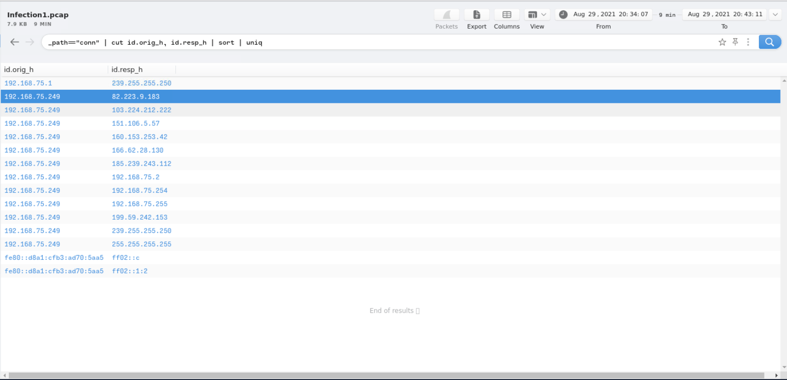

---

### Question 2 — What are the two suspicious domains that returned 404?

**Brim Query:**

```
_path=="http" | cut id.orig_h, id.resp_h, id.resp_p, method, host, uri | uniq -c
```

Then filtered for `404` status codes:

```
404
```

HTTP connections with `404 Not Found` responses indicate the victim's machine was trying to reach C2 or staging infrastructure that was either taken down or temporarily unavailable. Two domains matched this pattern:

**Answer:**

```
cambiasuhistoria.growlab.es, www.letscompareonline.com
```
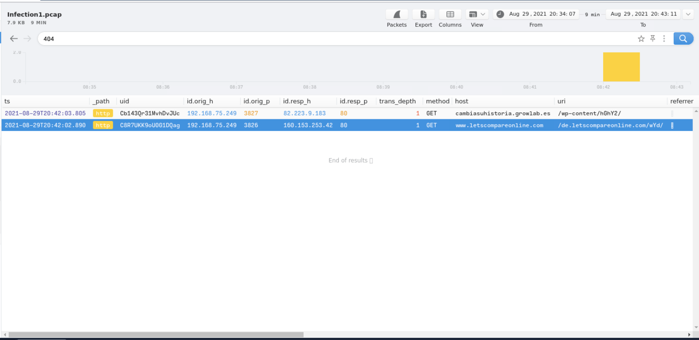

---

### Question 3 — Which domain returned a successful response with body length 1,309?

**Brim Query:**

```
_path=="http"
```

Filtered the HTTP log for `200 OK` responses and checked the `response_body_len` field. The domain that returned a successful connection with exactly `1,309` bytes of uncompressed content — alongside its resolved destination IP:

**Answer:**

```
ww25.gocphongthe.com, 199.59.242.153
```
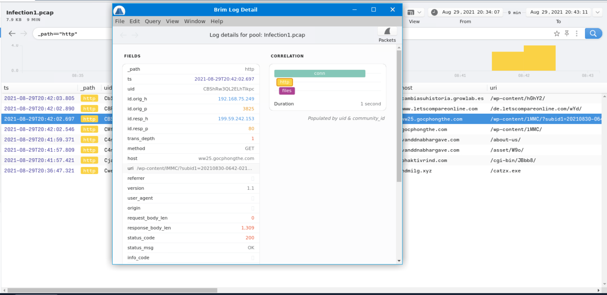

---

### Question 4 — How many unique DNS requests were made to cab[.]myfkn[.]com?

**Brim Query:**

```
_path=="dns" | count() by query | sort -r
```

Aggregated all DNS queries by domain name and sorted by count. The query included both standard and capitalized variants of the domain — both were counted as distinct DNS lookups.

**Answer:**

```
7
```
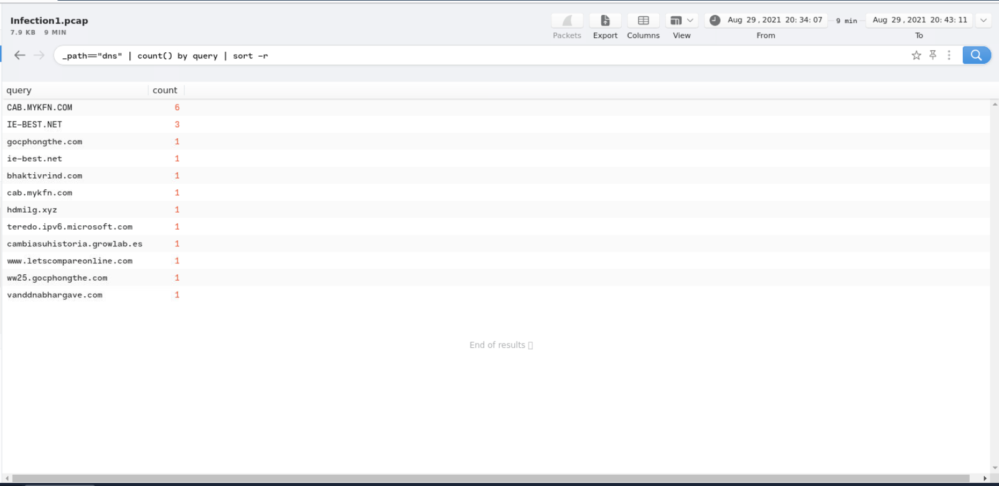

---

### Question 5 — What is the URI the victim used to reach bhaktivrind[.]com?

**Brim Query:**

```
_path=="http" | cut id.orig_h, id.resp_h, id.resp_p, method, host, uri | uniq -c
```

Filtered the HTTP log for the host `bhaktivrind.com` and extracted the `uri` field from the matching connection record.

**Answer:**

```
/cgi-bin/JBbb8/
```
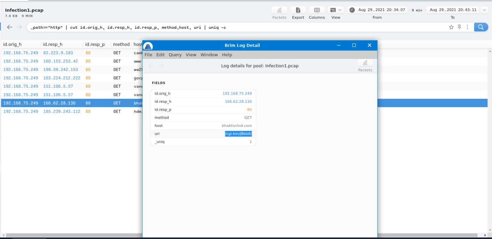

---

### Question 6 — What is the malicious server IP and the executable downloaded?

**Brim Query:**

```
185.239.243.112
```

Direct IP search surfaced HTTP traffic showing the victim downloading an executable file from this server. The filename was visible in the URI field of the HTTP GET request.

**Answer:**

```
185.239.243.112, catzx.exe
```
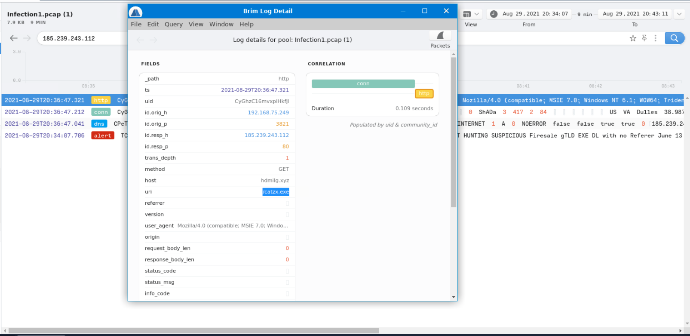

---

### Question 7 — What is the malware family?

**Investigation:**

The two domains identified in Question 2 (`cambiasuhistoria.growlab.es` and `www.letscompareonline.com`) were submitted to **VirusTotal** for threat intelligence correlation. Both domains were flagged as part of the **Emotet** malware distribution infrastructure — a notorious banking trojan and malware loader.

**Answer:**

```
Emotet
```
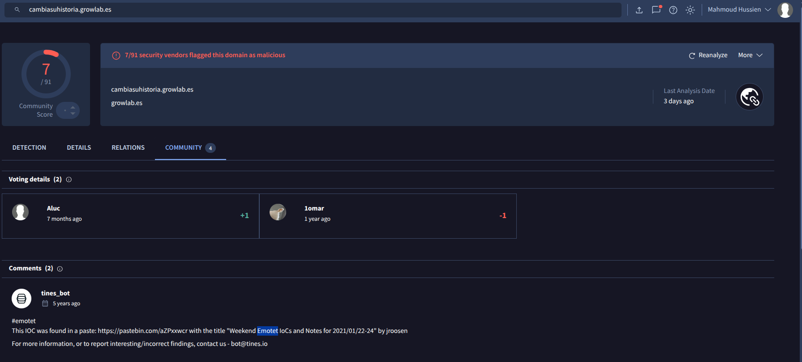

---

## Infection 2 — Redline Stealer

**PCAP:** `Infection2.pcap`  
**Victim IP:** `192.168.75.146`  
**Malware Family:** Redline Stealer

---

### Question 8 — What is the victim's IP address?

**Brim Query:**

```
_path=="conn" | cut id.orig_h, id.resp_p, id.resp_h | sort | uniq
```

Identified the internal host generating all suspicious outbound traffic.

**Answer:**

```
192.168.75.146
```
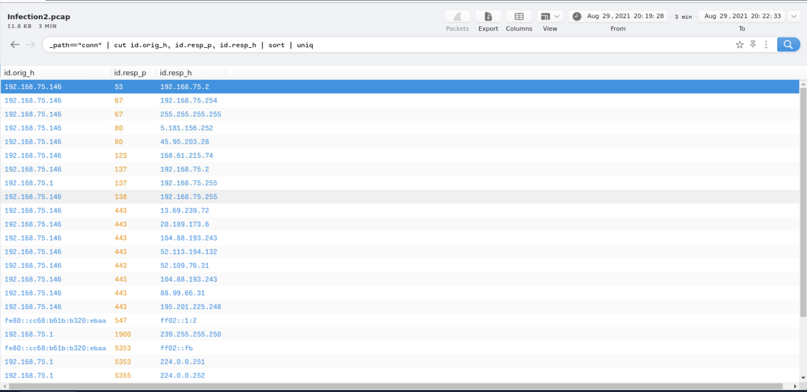

---

### Question 9 — What IP did the victim make POST connections to?

**Brim Query:**

```
method=="POST" | cut ts, uid, id, method, uri, status_code
```

Filtering for HTTP POST requests revealed repeated outbound data submissions to a single external IP — consistent with C2 data exfiltration behavior.

**Answer:**

```
5.181.156.252
```
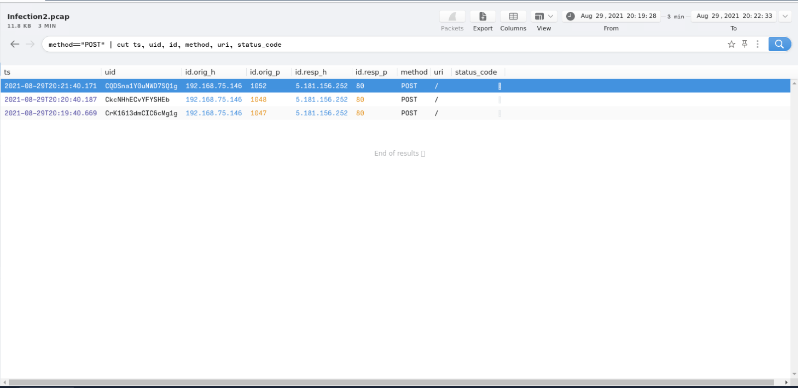

---

### Question 10 — How many POST connections were made?

Using the same POST filter query and counting the results for the destination IP `5.181.156.252`:

**Answer:**

```
3
```
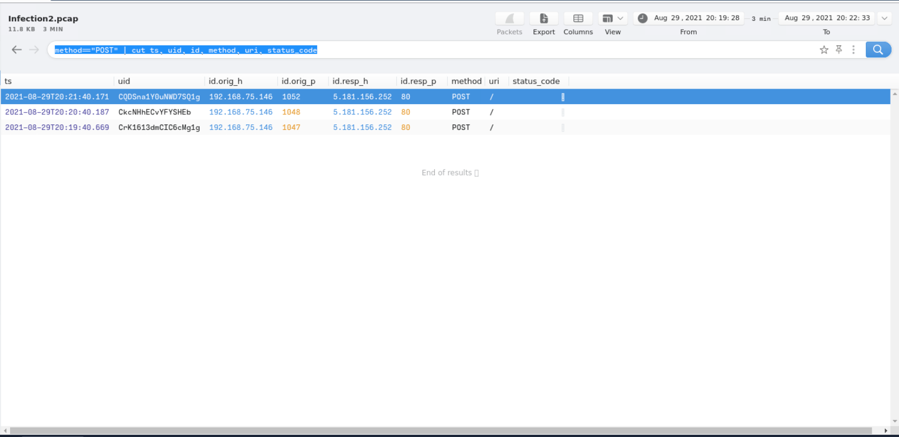

---

### Question 11 — What domain was the binary downloaded from?

**Brim Query:**

```
_path=="http" | cut id.orig_h, id.resp_h, id.resp_p, method, host, uri | uniq -c
```

Reviewing HTTP GET requests for executable file downloads identified the `.top` domain hosting the malicious binary.

**Answer:**

```
hypercustom.top
```
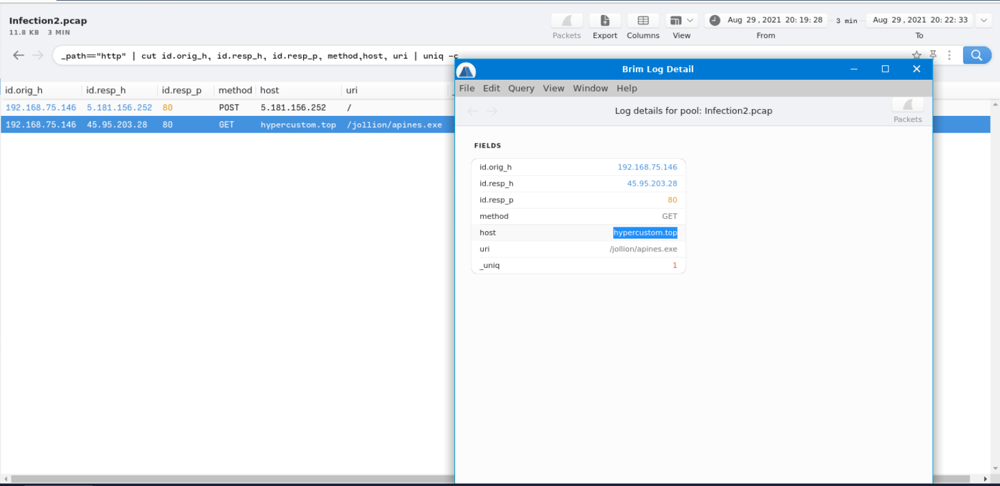

---

### Question 12 — What is the binary name including the full URI?

Using the same HTTP query above, the full URI path of the downloaded executable was extracted from the log entry for `hypercustom.top`:

**Answer:**

```
/jollion/apines.exe
```
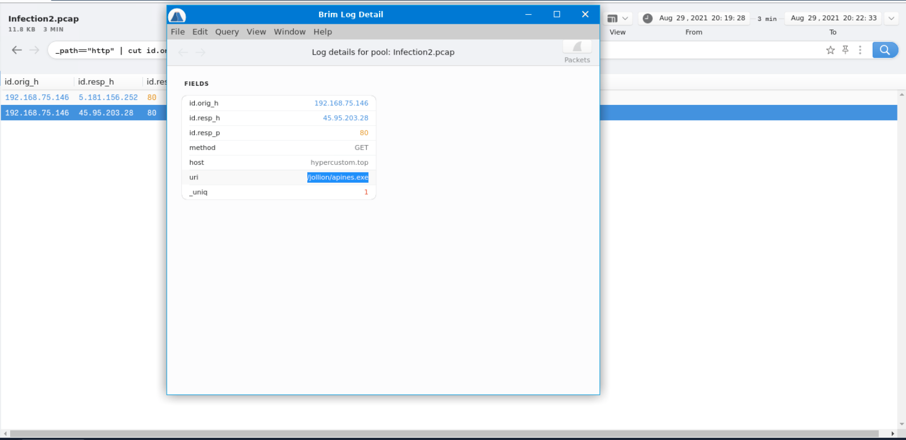

---

### Question 13 — What is the IP address of the domain hosting the binary?

The resolved destination IP for HTTP connections to `hypercustom.top` was extracted from the `id.resp_h` field:

**Answer:**

```
45.95.203.28
```
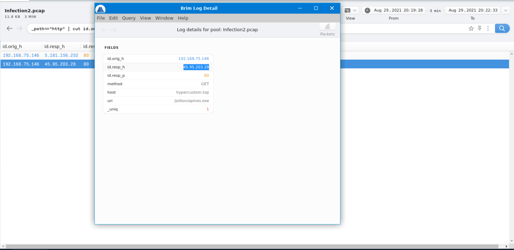

---

### Question 14 — What were the source and destination IPs for the Suricata "Network Trojan" alerts?

**Brim Query:**

```
event_type=="alert" | alerts := union(alert.category) by src_ip, dest_ip
```

Suricata IDS rules fired **2 alerts** with the category `"A Network Trojan was detected"`. The source-destination pair from both alerts:

**Answer:**

```
192.168.75.146, 45.95.203.28
```
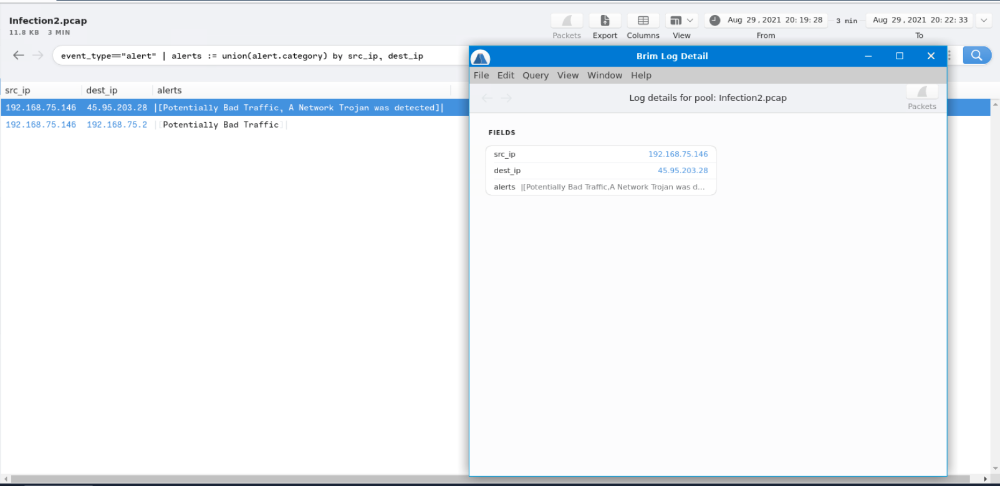

---

### Question 15 — What is the name of the stealer malware?

**Investigation:**

The `.top` domain (`hypercustom.top`) and the binary URI `/jollion/apines.exe` were submitted to the **URLhaus** abuse database (`urlhaus.abuse.ch`). The database entry confirmed the malware family associated with this URL:

**Answer:**

```
Redline Stealer
```
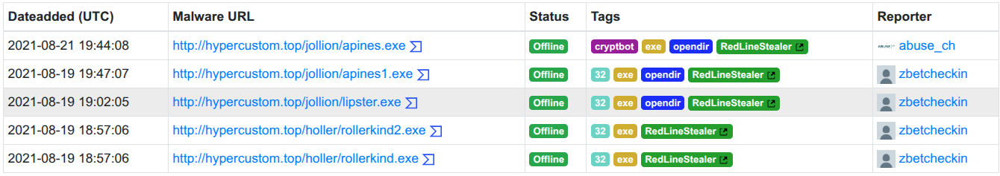

---

## Infection 3 — Phorphiex (Phorpiex) Worm

**PCAP:** `Infection3.pcap`  
**Victim IP:** `192.168.75.232`  
**Malware Family:** Phorphiex

---

### Question 16 — What is the victim's IP address?

**Brim Query:**

```
_path=="conn" | put total_bytes := orig_bytes + resp_bytes | sort -r total_bytes
  | cut uid, id, orig_bytes, resp_bytes, total_bytes
```

Sorting by total bytes transferred identified the internal host responsible for the heaviest outbound traffic — the compromised machine.

**Answer:**

```
192.168.75.232
```
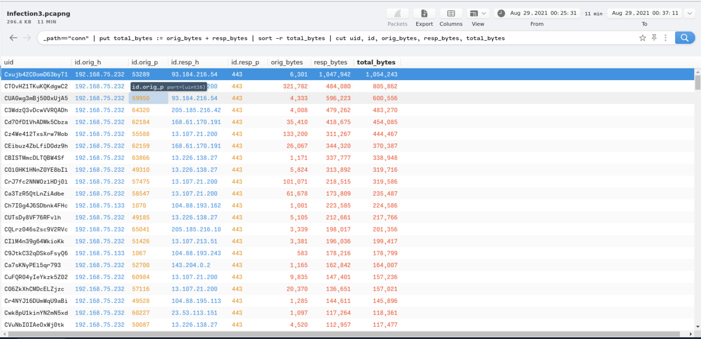

---

### Question 17 — What are the three C2 domains (earliest to latest)?

**Brim Query:**

```
_path=="http" | cut id.orig_h, id.resp_h, id.resp_p, method, host, uri | uniq -c
```

Sorting HTTP connections chronologically by timestamp and filtering for binary download requests revealed three distinct C2 domains serving the malware payloads — all following a similar naming pattern:

**Answer:**

```
efhoahegue.ru, afhoahegue.ru, xfhoahegue.ru
```
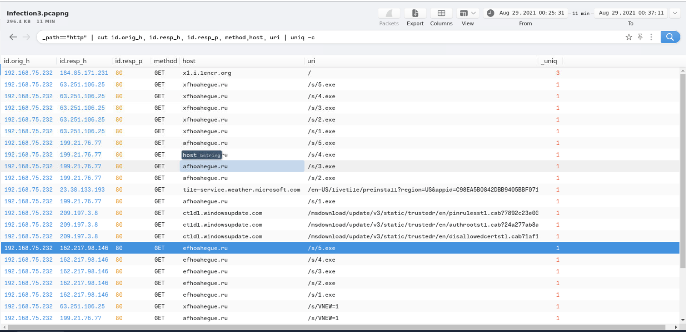

---

### Question 18 — What are the IP addresses for all three domains?

From the HTTP log's `id.resp_h` field, each domain resolved to a distinct IP:

| Domain | IP Address |
|---|---|
| `efhoahegue.ru` | `162.217.98.146` |
| `afhoahegue.ru` | `199.21.76.77` |
| `xfhoahegue.ru` | `63.251.106.25` |

**Answer:**

```
162.217.98.146, 199.21.76.77, 63.251.106.25
```


---

### Question 19 — How many unique DNS queries were made to the first domain's associated IP?

**Brim Query:**

```
_path=="dns" | count() by query | sort -r
```

Filtered for DNS queries resolving `efhoahegue.ru` — the domain associated with the first IP (`162.217.98.146`):

**Answer:**

```
2
```
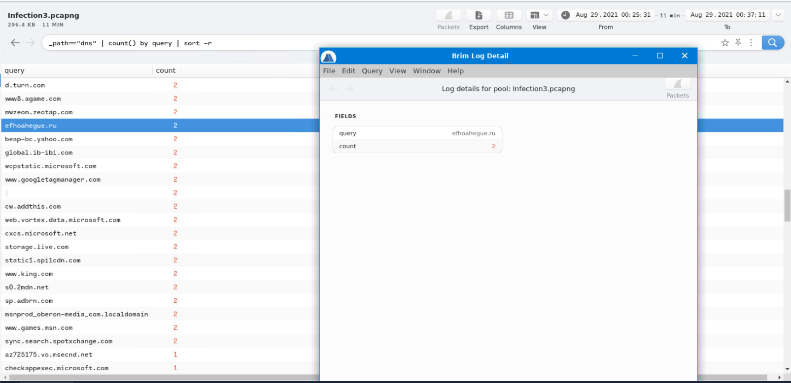

---

### Question 20 — How many binaries were downloaded from the first domain?

From the HTTP log filtered for `efhoahegue.ru` as the host, counting unique file download requests (GET requests returning executable content):

**Answer:**

```
5
```
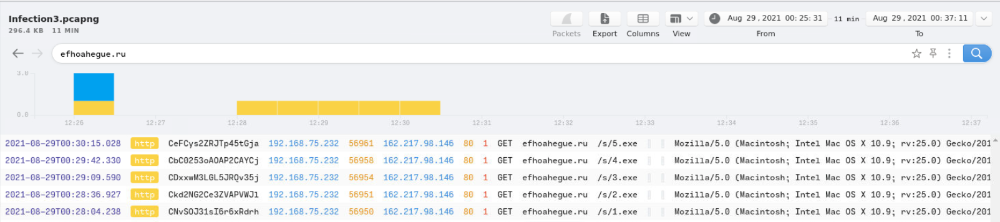

---

### Question 21 — What User-Agent was used to download the binaries?

From the same HTTP log entries for the binary downloads, the `user_agent` field contained a spoofed browser string — impersonating an old Firefox version on macOS:

**Answer:**

```
Mozilla/5.0 (Macintosh; Intel Mac OS X 10.9; rv:25.0) Gecko/20100101 Firefox/25.0
```
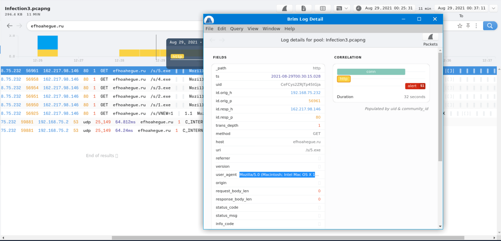

---

### Question 22 — How many total DNS connections were made in Infection3?

**Brim Query:**

```
_path=="dns" | count() by query | sort -r | sum(count)
```

Simple aggregate count of all DNS log entries in the Infection3 PCAP:

**Answer:**

```
986
```
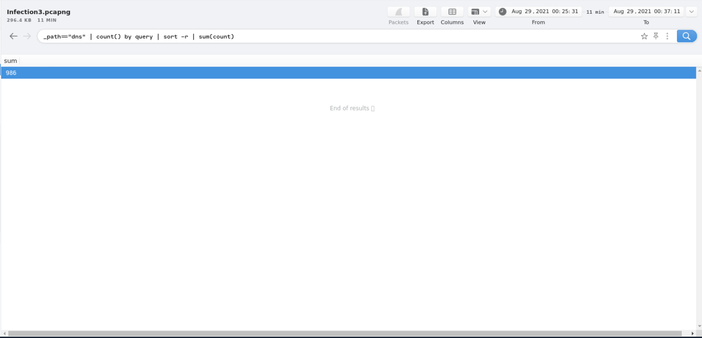

---

### Question 23 — What is the name of the worm?

**Investigation:**

Using the first C2 domain `efhoahegue` (without `.ru`) as a Google search query with quotation marks:

```
"efhoahegue"
```

OSINT results linked the domain to the **Phorphiex** (also spelled Phorpiex) worm — a well-documented botnet known for spamming, cryptocurrency mining, and ransomware distribution.

**Answer:**

```
Phorphiex
```

---

## Summary Table — All Three Infections

| Field | Infection 1 | Infection 2 | Infection 3 |
|---|---|---|---|
| Victim IP | `192.168.75.249` | `192.168.75.146` | `192.168.75.232` |
| Malware Family | Emotet | Redline Stealer | Phorphiex Worm |
| Initial Vector | Phishing / HTTP | Binary download | USB / Binary download |
| C2 Method | HTTP GET / POST | HTTP POST | HTTP GET (multiple domains) |
| Downloaded Binary | `catzx.exe` | `apines.exe` | 5 binaries |
| Malicious Server | `185.239.243.112` | `45.95.203.28` | `162.217.98.146` (primary) |
| Threat Intel Source | VirusTotal | URLhaus | OSINT / Google |

---

## Indicators of Compromise (IOCs)

### Infection 1 — Emotet

| Type | Value | Description |
|---|---|---|
| IP | `192.168.75.249` | Victim machine |
| Domain | `cambiasuhistoria.growlab.es` | C2 (404) |
| Domain | `www.letscompareonline.com` | C2 (404) |
| Domain | `ww25.gocphongthe.com` | C2 (200 OK) |
| IP | `199.59.242.153` | C2 server |
| Domain | `cab.myfkn.com` | DNS C2 (7 queries) |
| Domain | `bhaktivrind.com` | C2 URI: `/cgi-bin/JBbb8/` |
| IP | `185.239.243.112` | Malware delivery server |
| File | `catzx.exe` | Downloaded malware binary |

### Infection 2 — Redline Stealer

| Type | Value | Description |
|---|---|---|
| IP | `192.168.75.146` | Victim machine |
| IP | `5.181.156.252` | C2 exfiltration endpoint (3x POST) |
| Domain | `hypercustom.top` | Binary hosting domain |
| URI | `/jollion/apines.exe` | Full malware download path |
| IP | `45.95.203.28` | Binary hosting server IP |

### Infection 3 — Phorphiex

| Type | Value | Description |
|---|---|---|
| IP | `192.168.75.232` | Victim machine |
| Domain | `efhoahegue.ru` | C2 domain 1 (primary, 5 binaries) |
| Domain | `afhoahegue.ru` | C2 domain 2 |
| Domain | `xfhoahegue.ru` | C2 domain 3 |
| IP | `162.217.98.146` | efhoahegue.ru server |
| IP | `199.21.76.77` | afhoahegue.ru server |
| IP | `63.251.106.25` | xfhoahegue.ru server |
| User-Agent | `Mozilla/5.0 (Macintosh; Intel Mac OS X 10.9; rv:25.0)` | Spoofed download UA |

---

## Key Brim Queries Reference

```zed
-- HTTP traffic overview
_path=="http" | cut id.orig_h, id.resp_h, id.resp_p, method, host, uri | uniq -c

-- Filter by HTTP status code
404

-- DNS query aggregation
_path=="dns" | count() by query | sort -r

-- Total DNS count
_path=="dns" | count()

-- POST connections only
method=="POST" | cut ts, uid, id, method, uri, status_code

-- Suricata alert categories
event_type=="alert" | alerts := union(alert.category) by src_ip, dest_ip

-- Connection bytes (identify heaviest traffic)
_path=="conn" | put total_bytes := orig_bytes + resp_bytes
| sort -r total_bytes | cut uid, id, orig_bytes, resp_bytes, total_bytes

-- Search by specific IP
185.239.243.112

-- All unique connections
_path=="conn" | cut id.orig_h, id.resp_p, id.resp_h | sort | uniq
```

---

## MITRE ATT&CK Mapping

| Phase | Technique ID | Technique Name | Infection |
|---|---|---|---|
| Initial Access | T1566.001 | Phishing: Spearphishing Attachment | Infection 1 |
| Initial Access | T1091 | Replication Through Removable Media (USB) | Infection 3 |
| Execution | T1204.002 | User Execution: Malicious File | All |
| Command & Control | T1071.001 | Web Protocols (HTTP C2) | All |
| Command & Control | T1568 | Dynamic Resolution (DNS C2) | Infection 1 |
| Exfiltration | T1041 | Exfiltration Over C2 Channel (POST) | Infection 2 |
| Credential Access | T1555 | Credentials from Password Stores | Infection 2 (Redline) |
| Persistence | T1543 | Create or Modify System Process | Infection 1 (Emotet) |
| Lateral Movement | T1080 | Taint Shared Content | Infection 3 (Phorphiex) |

---

## Lessons Learned

1. **Block `.ru` domains at DNS level** — All three Phorphiex C2 domains used `.ru` TLDs. DNS filtering to block high-risk TLDs would have prevented C2 communication.
2. **Alert on executable downloads over HTTP** — Any `.exe` file downloaded over unencrypted HTTP from an uncategorized domain should trigger an immediate sandbox detonation alert.
3. **Monitor repetitive DNS queries** — 7 DNS queries to `cab.myfkn.com` in a short window is a strong DNS-based C2 indicator. SIEM rules should alert on high-frequency queries to a single domain.
4. **Block outbound POST to unknown IPs** — The Redline Stealer exfiltrated data via 3 POST requests to `5.181.156.252`. Egress filtering with application-layer inspection would have blocked this.
5. **Disable USB autorun** — The Phorphiex infection vector included a USB drive. Enforce Group Policy to disable autorun/autoplay on all removable media.
6. **Cross-reference IDS alerts with threat intel** — Suricata flagged the Redline traffic but the alert category alone (`Network Trojan`) needed URLhaus correlation to identify the specific family.

---

*Writeup produced as part of SOC Analyst training — TryHackMe: Masterminds*