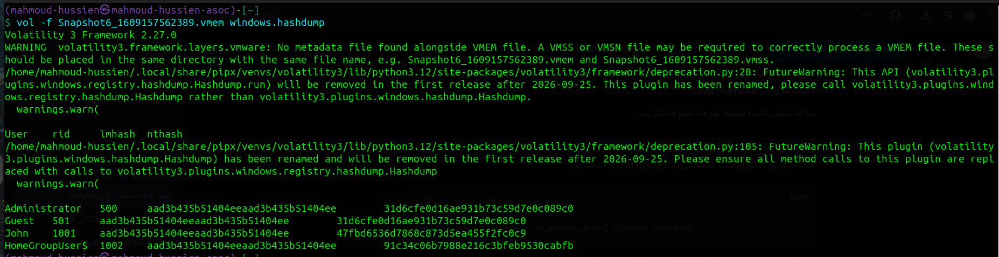
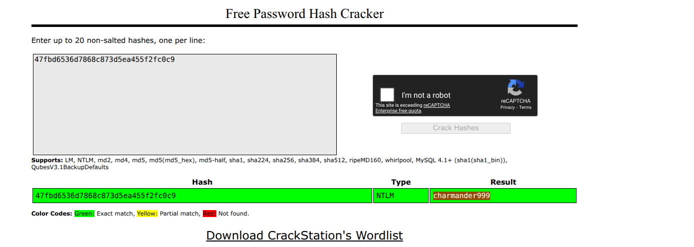
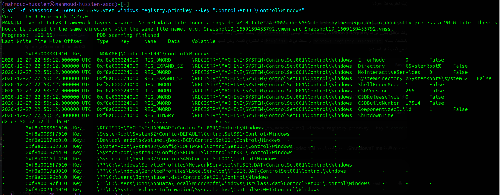
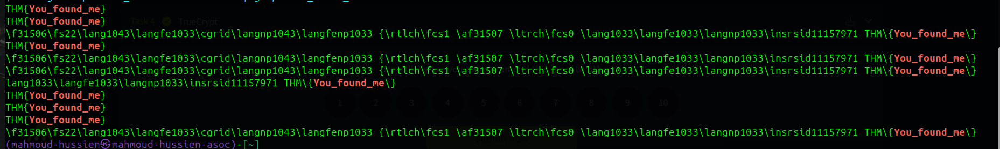

# 🧠 Memory Forensics Investigation – Volatility Analysis

---

## 📌 Scenario

A forensic investigator collected a memory dump from a suspect machine belonging to a user named John. As a secondary analyst, the objective was to analyze the memory image and extract critical forensic artifacts.

---

## 🎯 Investigation Objectives

* Recover sensitive credentials
* Identify user activity
* Extract hidden or encrypted data
* Build a forensic timeline

---

## 🔑 Credential Recovery

### 🔐 User Password

```
charmander999
```



➡️ Indicates sensitive credential exposure within memory

---

## 🕒 Timeline Analysis

### 🖥️ Last System Shutdown

```
2020-12-27 22:50:12
```


➡️ Helps establish timeline of user activity

---

## 📝 User Activity Evidence

### ✍️ Recovered Message

```
You_found_me
```



➡️ Indicates possible intentional message or attacker artifact

---

## 🔒 Encrypted Data Discovery

### 💽 Encrypted Volume Detected

* Tool identified:

  ```
  TrueCrypt
  ```

### 🔑 Recovered Passphrase

```
forgetmenot
```

➡️ Critical finding enabling decryption of hidden data

---

## 🧠 Key Findings

* Credentials recovered from memory
* Evidence of user interaction prior to shutdown
* Encrypted container identified and accessed
* Sensitive passphrase extracted

---

## 🧪 Tools Used

* Volatility (Memory Forensics Framework)

---

## 🧠 Skills Demonstrated

* Memory dump analysis
* Credential extraction from RAM
* Timeline reconstruction
* Detection of encrypted containers
* Forensic artifact identification

---

## 🏁 Conclusion

The memory analysis revealed critical forensic artifacts, including user credentials, system activity timeline, and an encrypted container passphrase. These findings demonstrate how volatile memory can expose highly sensitive information that may not be available on disk.

This investigation highlights the importance of memory forensics in uncovering hidden data and reconstructing user activity during an incident.
