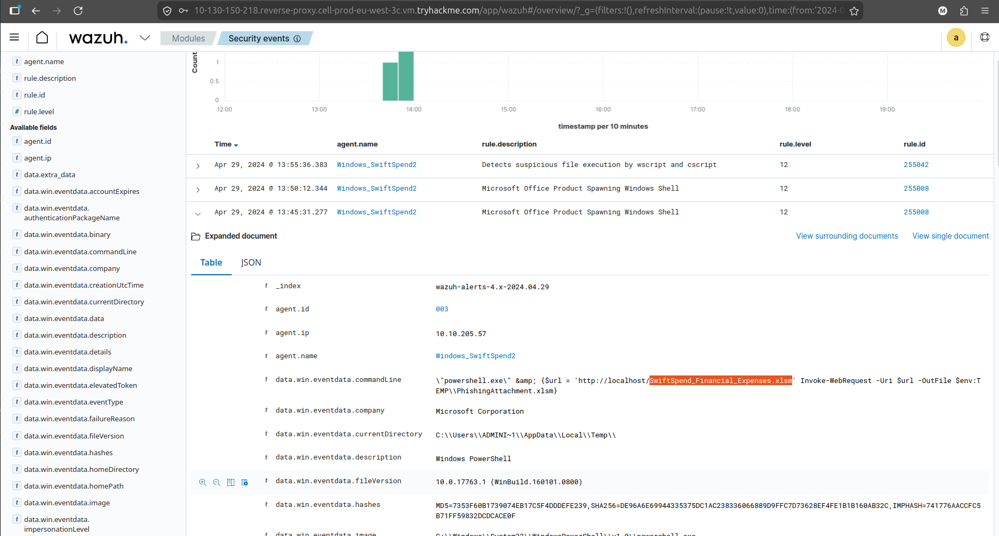
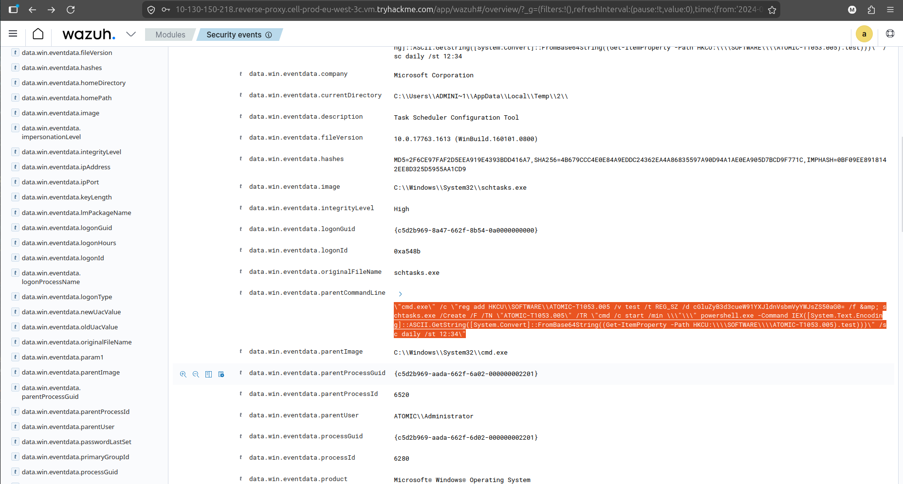
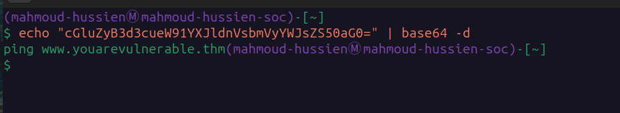
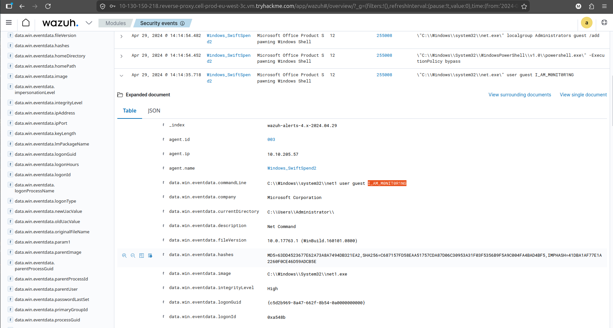
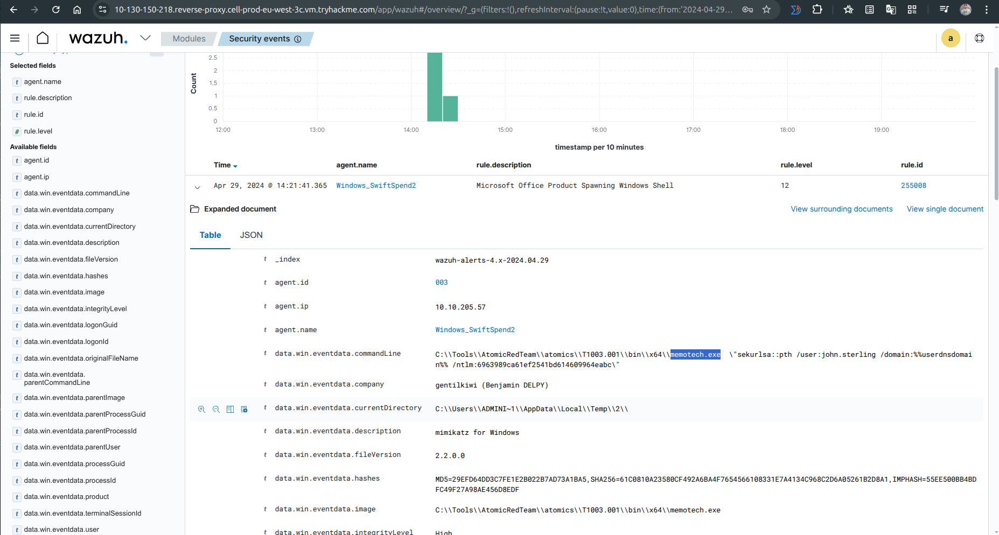
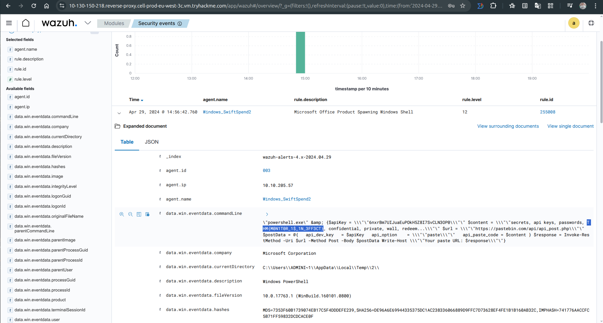

# 🔍 Swiftspend Finance – Wazuh & Sysmon Threat Detection Investigation

---

## 📌 Scenario

Swiftspend Finance conducted a security monitoring exercise to evaluate their endpoint detection capabilities using **Wazuh** and **Sysmon**.

The analysis focused on logs generated on April 29, 2024, between 12:00 and 20:00, with the goal of identifying suspicious process execution, persistence mechanisms, credential access, and potential data exfiltration.

---

## 🎯 Investigation Objectives

* Identify initial access vector
* Detect persistence mechanisms
* Analyze malicious command execution
* Investigate credential access activity
* Identify data exfiltration evidence

---

## 🚪 Initial Access

### 📄 Malicious File

```
SwiftSpend_Financial_Expenses.xlsm
```


➡️ Initial access was achieved via a malicious Excel macro-enabled document, indicating a phishing-based delivery.

---

## 🧩 Persistence Mechanism

### ⏰ Scheduled Task Creation

```
"cmd.exe" /c "reg add HKCU\\SOFTWARE\\ATOMIC-T1053.005 /v test /t REG_SZ /d cGluZyB3d3cueW91YXJldnVsbmVyYWJsZS50aG0= /f & schtasks.exe /Create /F /TN "ATOMIC-T1053.005" /TR "cmd /c start /min "" powershell.exe -Command IEX([System.Text.Encoding]::ASCII.GetString([System.Convert]::FromBase64String((Get-ItemProperty -Path HKCU:\\SOFTWARE\\ATOMIC-T1053.005).test)))" /sc daily /st 12:34"
```


---

### 🕒 Execution Time

```
12:34
```

➡️ Attacker established persistence using a scheduled task that executes a PowerShell payload daily.

---

## 🧠 Obfuscated Payload

### 🔐 Encoded Command

```
cGluZyB3d3cueW91YXJldnVsbmVyYWJsZS50aG0=
```

### 🔓 Decoded Content

```
ping www.youarevulnerable.thm
```


➡️ Payload was Base64 encoded to evade detection and executed via PowerShell.

---

## 👤 Account Manipulation

### 🔑 Created User Password

```
I_AM_M0NIT0R1NG
```


➡️ Indicates creation of a new user account for persistence and potential lateral movement.

---

## 🔓 Credential Access

### 🛠️ Credential Dumping Tool

```
memotech.exe
```


➡️ A suspicious executable was used to dump credentials from the system, indicating post-exploitation activity.

---

## 📤 Data Exfiltration

### 🚨 Exfiltrated Data Flag

```
THM{M0N1T0R_1$_1N_3FF3CT}
```


➡️ Evidence confirms that data exfiltration occurred from the compromised host.

---

## 🚨 Attack Summary

* Initial access via malicious Excel document (phishing)
* Persistence established using Scheduled Tasks
* PowerShell used for execution with Base64 obfuscation
* New user account created for attacker access
* Credential dumping performed using custom tool
* Data exfiltration successfully completed

---

## 🧠 Skills Demonstrated

* Wazuh log analysis
* Sysmon event investigation
* Persistence detection (Scheduled Tasks)
* PowerShell threat analysis
* Credential access detection
* Data exfiltration identification

---

## 🏁 Conclusion

The investigation revealed a full attack chain starting from phishing-based initial access, followed by persistence through scheduled tasks, and execution of obfuscated PowerShell payloads.

The attacker escalated capabilities by creating a new user account and deploying a credential dumping tool, ultimately leading to successful data exfiltration.

This scenario demonstrates real-world SOC detection use cases and highlights the importance of endpoint monitoring using tools like Wazuh and Sysmon to detect advanced threats.
