# PacketMaze Lab — CTF Writeup

* **Platform:** CyberDefenders  
* **Challenge:** PacketMaze Lab  
* **Category:** Network Forensics  
* **Difficulty:** Medium  
* **Analyst:** Mahmoud Hussien  
* **Tool:** Wireshark, ExifTool  
* **Artefact:** PCAP file

---

## Scenario Overview

A company's internal server was flagged for unusual network activity with multiple outbound connections to an unknown external IP. Investigation of the PCAP revealed a compromised host (`192.168.1.26`) performing unencrypted FTP credential use, data exfiltration, UDP-based C2 beaconing, and encrypted external communication to ProtonMail — with forensic artifacts linking the activity to a physical mobile device.

---

## Attack Chain Overview

```
[1] FTP Authentication
    └─ kali:AfricaCTF2021 → FTP server 192.168.1.20
    └─ Cleartext after failed TLS upgrade

[2] Data Exfiltration
    └─ Retrieved: accountNum.zip from /home/kali/Documents/

[3] C2 Beaconing
    └─ 10 UDP packets → 24.39.217.246
    └─ Uniform payload: 52 bytes each

[4] Encrypted External Communication
    └─ TLSv1.3 handshake → protonmail.com

[5] Physical Evidence
    └─ 20210429_152157.jpg → Camera: LM-Q725K (LG Q70)
```

---

## Question 1 — What is the FTP password?

### Wireshark Filter

```
ftp.request.command == "PASS"
```

### Investigation

Filtering for FTP `PASS` commands reveals the authentication credentials transmitted in cleartext. The FTP server (`192.168.1.20`) banner read:

```
220 Welcome to Hacker FTP service.
```

After the client attempted to upgrade to encrypted FTP (`AUTH TLS` and `AUTH SSL`) and both attempts failed, the session **downgraded to cleartext** — allowing the `PASS` command to be captured in plaintext in the PCAP.

### Answer

```
AfricaCTF2021
```
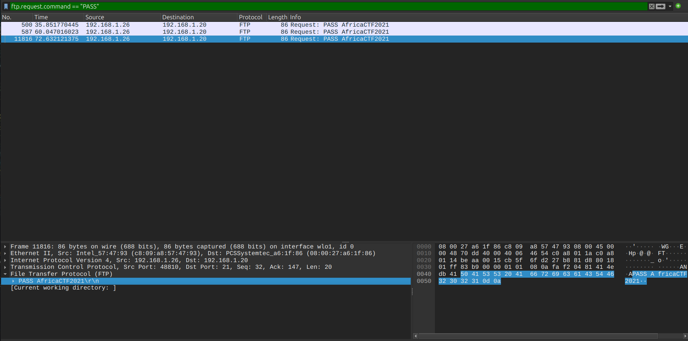

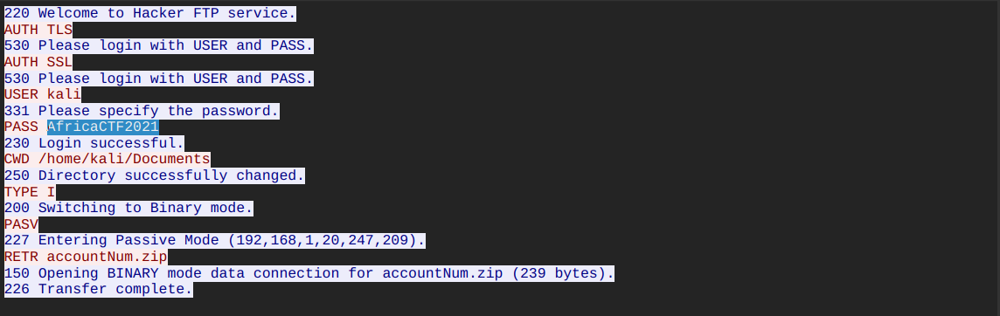


---

## Question 2 — What is the IPv6 address of the DNS server used by 192.168.1.26?

### Wireshark Filter

```
dns 
```

### Investigation

Analyzing DNS traffic from the victim host and expanding the UDP layer on packet 474 reveals the destination IPv6 address of the DNS resolver used. The internal network uses an IPv6-capable configuration with a link-local DNS resolver address.

### Answer

```
fe80::c80b:adff:feaa:1db7
```
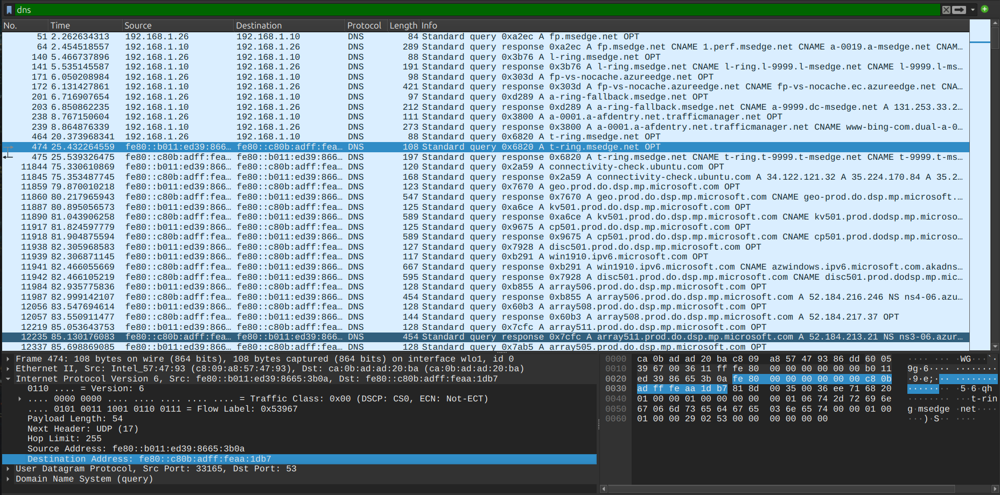

---

## Question 3 — What domain is the user looking up in packet 15174?

### Investigation

Navigating directly to frame 15174 in Wireshark and expanding the DNS query layer reveals the queried domain name. The DNS lookup for `www.7-zip.org` was subsequently resolved to `159.65.89.65` — consistent with the threat actor acquiring a compression tool for staging exfiltrated data.

### Answer

```
www.7-zip.org
```
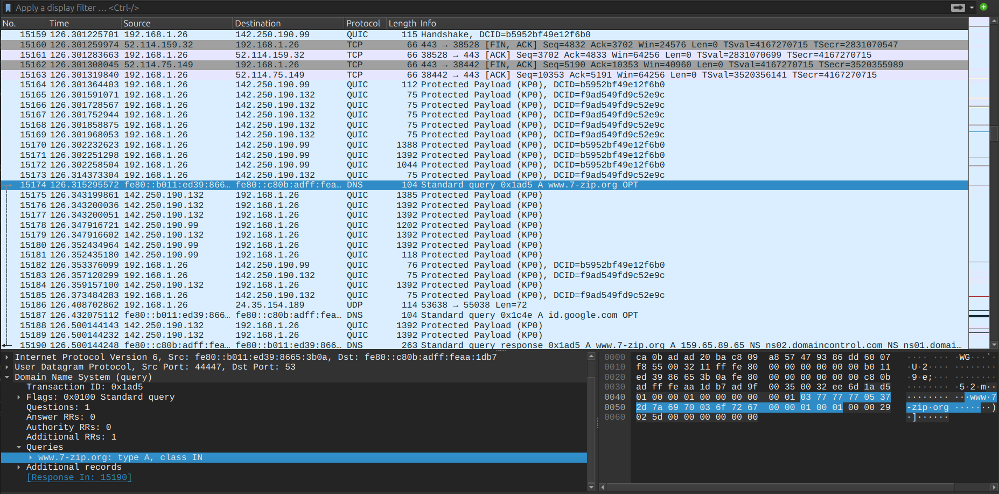

---

## Question 4 — How many UDP packets were sent from 192.168.1.26 to 24.39.217.246?

### Wireshark Filter

```
udp && (ip.src == 192.168.1.26 && ip.dst == 24.39.217.246)
```

### Investigation

Filtering for UDP traffic between the victim host and the suspected C2 destination, then checking the status bar for the total matching packet count. All 10 packets had a **uniform payload length of 52 bytes** — a strong indicator of automated C2 heartbeat beaconing rather than user-generated traffic.

### Answer

```
10
```
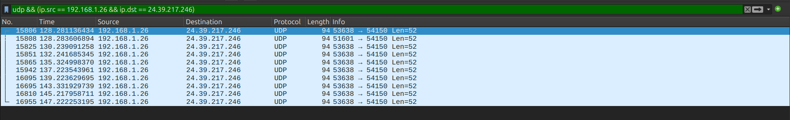

---

## Question 5 — What is the MAC address of the system under investigation?

### Wireshark Filter

```
dns && ip.src == 192.168.1.26
```

### Investigation

Examining the Ethernet frame header of any packet originating from `192.168.1.26` reveals the source MAC address in the Ethernet II layer. This MAC address's OUI (`c8:09:a8`) resolves to an Intel-based network interface — consistent with a Linux workstation.

### Answer

```
c8:09:a8:57:47:93
```
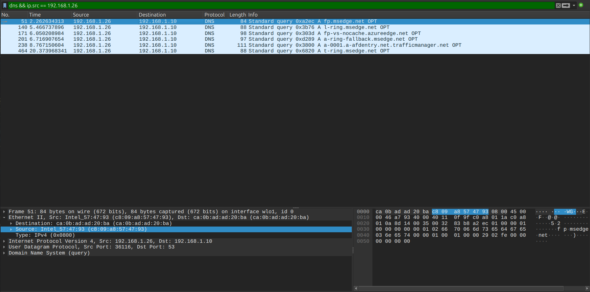

---

## Question 6 — What was the camera model used to take the picture?

### Investigation

**Step 1:** Extract the image file from the PCAP.

**Wireshark Filter:**

```
ftp-data
```

Following the FTP-DATA stream that contains the JPEG file and exporting the raw bytes reconstructs `20210429_152157.jpg`.

**Step 2:** Analyze EXIF metadata using ExifTool:

```bash
exiftool 20210429_152157.jpg
```

The `Camera Model Name` field in the EXIF metadata:

```
Camera Model Name: LM-Q725K
```

`LM-Q725K` is the model code for the **LG Q70** smartphone — physically linking the threat actor to the network-level exfiltration activity.

### Answer

```
LM-Q725K
```
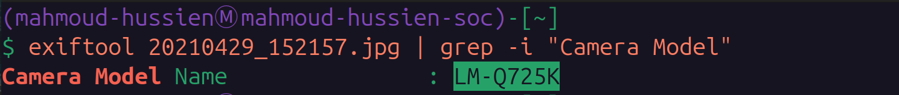

---

## Question 7 — What is the ephemeral public key from the TLS handshake?

### Wireshark Filter

```
tls.handshake.session_id == da:4a:00:00:34:2e:4b:73:45:9d:73:60:b4:be:a9:71:cc:30:3a:c1:8d:29:b9:90:67:e4:6d:16:cc:07:f4:ff
```

### Investigation

Locating the TLS session by its Session ID, then expanding the `TLS → Handshake Protocol → Server Hello → Extensions → Key Share` section reveals the server's **ephemeral EC (Elliptic Curve) Diffie-Hellman public key** provided during the TLS 1.3 handshake. This key is used for Perfect Forward Secrecy — a new ephemeral key pair is generated for each session.

### Answer

```
04edcc123af7b13e90ce101a31c2f996f471a7c8f48a1b81d765085f548059a550f3f4f62ca1f0e8f74d727053074a37bceb2cbdc7ce2a8994dcd76dd6834eefc5438c3b6da929321f3a1366bd14c877cc83e5d0731b7f80a6b80916efd4a23a4d
```
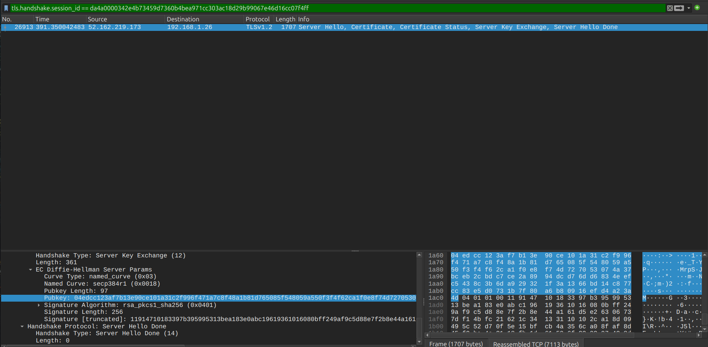

---

## Question 8 — What is the first TLS 1.3 client random used with protonmail.com?

### Wireshark Filter

```
tls.handshake.extensions_server_name == "protonmail.com"
```

### Investigation

Filtering for TLS Client Hello packets targeting `protonmail.com` via the SNI (Server Name Indication) extension, then expanding `TLS → Handshake Protocol → Client Hello → Random` reveals the 32-byte client random value. The **Client Random** is essential for session key derivation and passive TLS decryption if the session keys are later recovered.

### Answer

```
24e92513b97a0348f733d16996929a79be21b0b1400cd7e2862a732ce7775b70
```
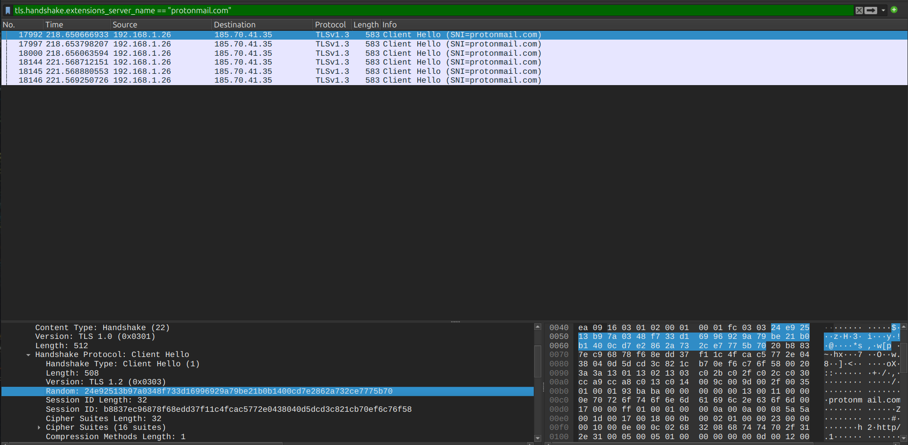

---

## Question 9 — Which country is the FTP server's MAC address manufacturer registered in?

### Investigation

The FTP server's MAC address (`08:00:27:a6:1f:86`) OUI prefix `08:00:27` resolves to **PCS Systemtechnik GmbH** — a German company that is the legal entity behind Oracle VirtualBox virtual machine NIC addresses.

Despite being a German company, the IEEE OUI registration for this vendor is registered under **United States** jurisdiction in the IEEE database.

### Answer

```
United States
```
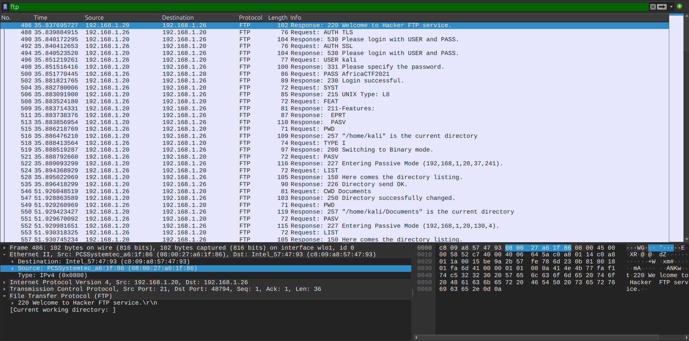

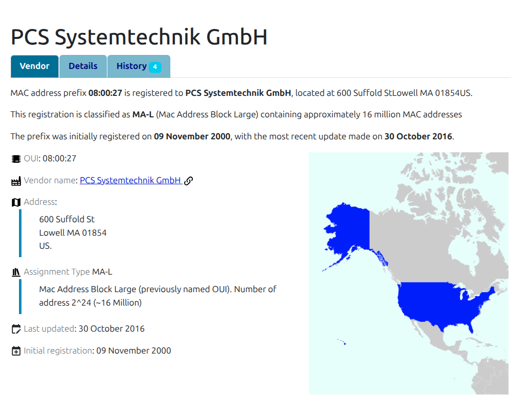

---

## Question 10 — What time was the non-standard folder created on the FTP server on April 20th?

### Wireshark Filter

```
ftp-data
```

### Investigation

Following the FTP-DATA stream containing directory listings, the server returned a detailed directory output showing folder creation timestamps. A non-standard folder named `ftp` (created by UID 65534 — the `nobody`/anonymous user) had the following timestamp in the `ls -la` output:

```
dr-xr-x---  4 65534 65534 4096 Apr 20 17:53 ftp
```

The folder `ftp` at `17:53` on April 20th is the staging area created by the threat actor.

### Answer

```
17:53
```
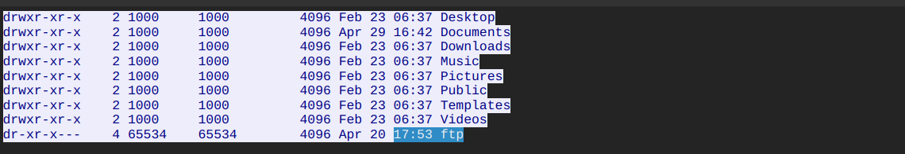

---

## Question 11 — What URL was visited that connected to IP 104.21.89.171?

### Wireshark Filter

```
http && ip.dst == 104.21.89.171
```

### Investigation

Filtering for HTTP traffic destined to `104.21.89.171` and examining the HTTP `Host:` header and request URI in the matching packets reveals the visited URL.

```
GET / HTTP/1.1
Host: dfir.science
```

### Answer

```
http://dfir.science/
```
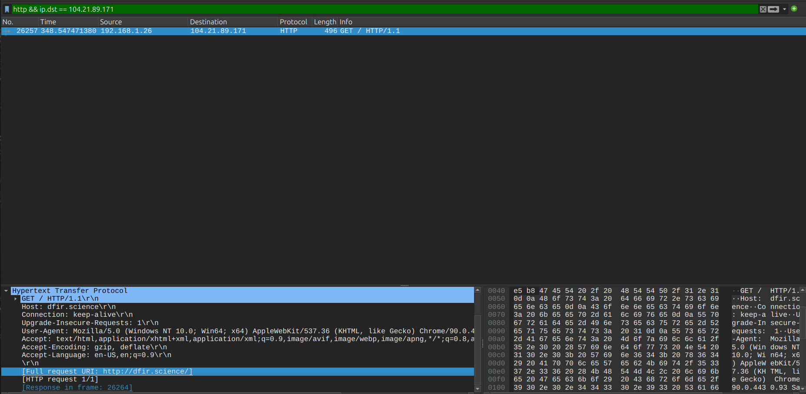

---

## Full Attack Timeline

| Timestamp | Event |
|---|---|
| April 20, 17:53 | Non-standard `ftp` folder created on server (UID 65534) |
| T+2.26s | DNS queries initiated for `msedge.net` |
| T+35.84s | FTP authentication: `kali:AfricaCTF2021` → `192.168.1.20` |
| T+51.92s | FTP directory traversal → `accountNum.zip` retrieved |
| April 29, 15:21 | `20210429_152157.jpg` captured by LG Q70 (LM-Q725K) |
| T+126.31s | DNS lookup → `www.7-zip.org` → `159.65.89.65` |
| T+128.28s | UDP C2 beaconing → 10 packets → `24.39.217.246` |
| T+128.28s | TLSv1.3 handshake → `protonmail.com` |
| T+348.54s | HTTP visit → `http://dfir.science/` → `104.21.89.171` |

---

## Indicators of Compromise (IOCs)

| Type | Value | Description |
|---|---|---|
| IP | `192.168.1.26` | Compromised victim host |
| MAC | `c8:09:a8:57:47:93` | Victim NIC (Intel) |
| IP | `192.168.1.20` | Internal FTP server |
| MAC | `08:00:27:a6:1f:86` | FTP server NIC (PCS Systemtechnik — VirtualBox) |
| Credential | `kali:AfricaCTF2021` | Compromised FTP credentials |
| File | `accountNum.zip` | Exfiltrated archive |
| IP | `24.39.217.246` | UDP C2 beaconing destination |
| Domain | `protonmail.com` | Encrypted external communication |
| Domain | `www.7-zip.org` | Compression tool acquisition |
| URL | `http://dfir.science/` | Web activity |
| IP | `104.21.89.171` | dfir.science host |
| IPv6 | `fe80::c80b:adff:feaa:1db7` | Internal IPv6 DNS resolver |
| Device | `LM-Q725K` | LG Q70 — physical device (EXIF) |
| TLS Random | `24e92513b97a0...` | ProtonMail TLS 1.3 client random |

---

## Key Wireshark Filters Reference

```
-- FTP password extraction
ftp.request.command == "PASS"

-- UDP C2 beaconing
udp && (ip.src == 192.168.1.26 && ip.dst == 24.39.217.246)

-- DNS from victim (MAC address + IPv6 DNS resolver)
dns && ip.src == 192.168.1.26

-- TLS session by Session ID
tls.handshake.session_id == da:4a:00:00:34:2e:4b:73:45:9d:73:60:b4:be:a9:71:cc:30:3a:c1:8d:29:b9:90:67:e4:6d:16:cc:07:f4:ff

-- ProtonMail TLS handshake (client random)
tls.handshake.extensions_server_name == "protonmail.com"

-- FTP data streams (files + directory listings)
ftp-data

-- HTTP traffic to specific IP
http && ip.dst == 104.21.89.171
```

---

## MITRE ATT&CK Mapping

| Phase | Technique ID | Technique Name |
|---|---|---|
| Initial Access | T1078 | Valid Accounts (kali credentials) |
| Credential Access | T1552.001 | Unsecured Credentials (FTP cleartext) |
| Collection | T1005 | Data from Local System (accountNum.zip) |
| Exfiltration | T1048.003 | Exfiltration Over Unencrypted Protocol (FTP) |
| Command & Control | T1071.001 | Web Protocols (UDP beaconing) |
| Command & Control | T1573.002 | Encrypted Channel: Asymmetric Cryptography (TLS 1.3) |
| Defense Evasion | T1048.002 | Exfiltration Over Encrypted Channel (ProtonMail) |

---

## Lessons Learned

1. **Never allow FTP without TLS** — The session downgraded to cleartext after `AUTH TLS` failed, exposing credentials. Use SFTP or FTPS with enforced TLS — never allow plaintext fallback.
2. **Monitor UDP to unknown external IPs** — 10 uniform 52-byte UDP packets to an unrecognized external IP is a textbook C2 heartbeat pattern. SIEM rules should alert on repeated uniform UDP to non-business destinations.
3. **Block ProtonMail for corporate endpoints** — While ProtonMail is legitimate, it's frequently used for covert exfiltration. Consider blocking or logging all TLS connections to free encrypted email providers from corporate hosts.
4. **EXIF metadata as forensic evidence** — The `LM-Q725K` camera model in EXIF data provides a direct link between network activity and a physical device — demonstrating the forensic value of image metadata analysis.
5. **Monitor FTP-DATA streams for sensitive files** — Files like `accountNum.zip` should trigger DLP (Data Loss Prevention) alerts when accessed via FTP by non-authorized accounts.
6. **Enforce MFA on FTP accounts** — Compromised static credentials (`kali:AfricaCTF2021`) should be protected by multi-factor authentication or replaced with key-based authentication.

---

*Writeup produced as part of SOC Analyst training — CyberDefenders: PacketMaze Lab*