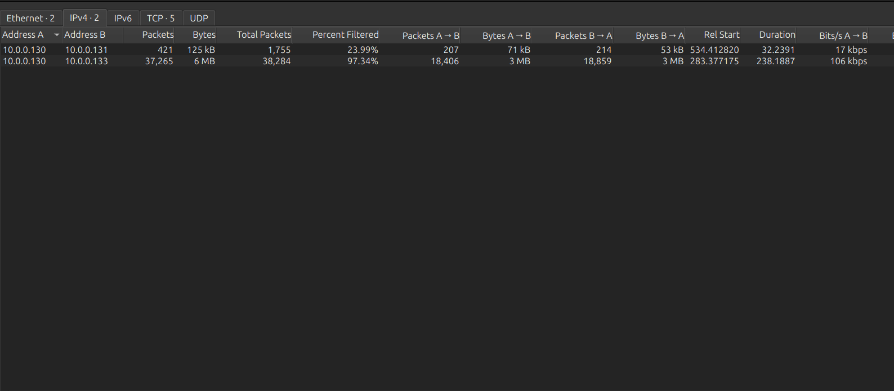
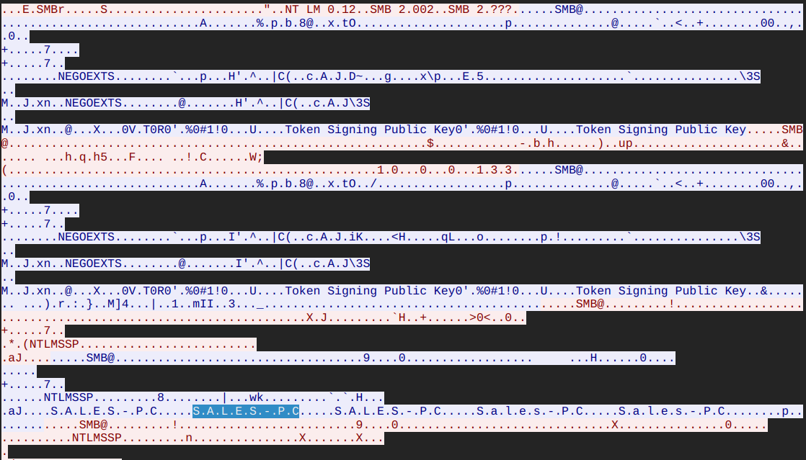
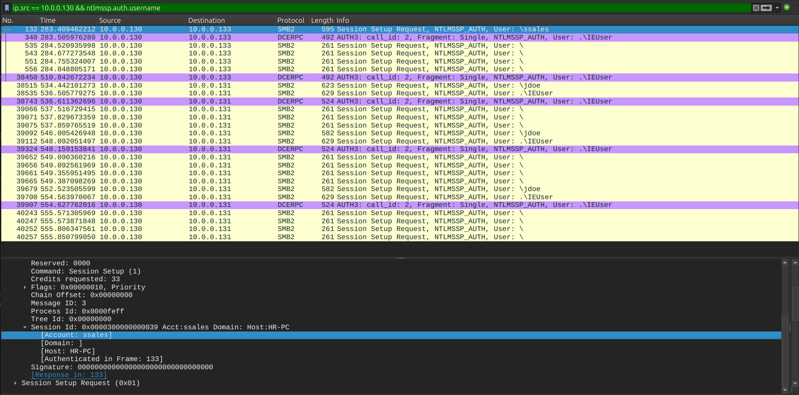
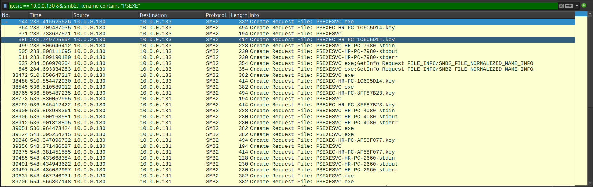
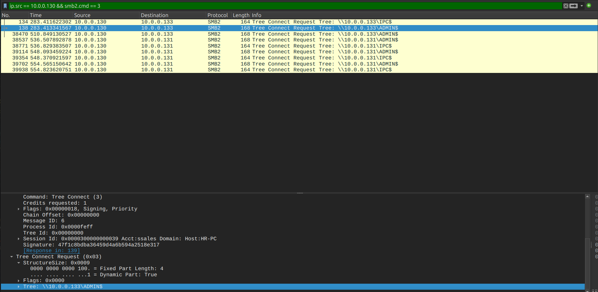
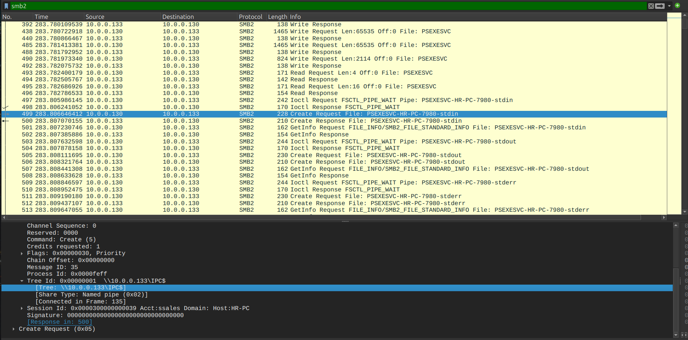
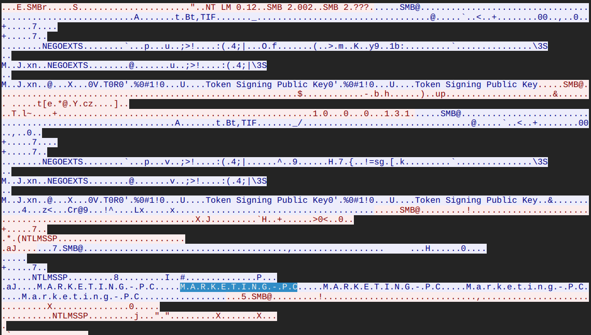

# PsExec Hunt Lab — CTF Writeup

* **Platform:** CyberDefenders  
* **Challenge:** PsExec Hunt Lab  
* **Category:** Network Forensics / Lateral Movement  
* **Difficulty:** Easy  
* **Analyst:** Mahmoud Hussien
* **Tool:** Wireshark  
* **Artefact:** PCAP file

---

## Scenario Overview

An IDS alert flagged anomalous lateral movement activity within the internal network. PCAP analysis confirmed that a compromised host (`10.0.0.130`) used **PsExec** — a legitimate Sysinternals remote execution tool — to pivot across multiple departmental workstations using stolen administrative credentials. The attacker systematically compromised the Sales and Marketing machines by dropping the `PSEXESVC.exe` service binary via SMB administrative shares.

---

## Attack Chain Overview

```
[1] Attacker Host: 10.0.0.130
    └─ SMB2 Protocol Negotiation

[2] Pivot 1 → SALES-PC (10.0.0.133)
    ├─ NTLMSSP Authentication: ssales
    ├─ Tree Connect: \\10.0.0.133\IPC$
    ├─ Tree Connect: \\10.0.0.133\ADMIN$
    ├─ File Drop: PSEXESVC.exe
    └─ Named Pipes C2: PSEXESVC-HR-PC-7980-stdin/stdout/stderr

[3] Pivot 2 → MARKETING-PC (10.0.0.131)
    └─ Same playbook: credential reuse + PsExec deployment
```

---

## Question 1 — What is the IP address from which the attacker initially gained access?

### Investigation

**Wireshark:** `Statistics → Conversations → IPv4`

Analyzing network conversations sorted by packet count revealed one internal host generating a disproportionately high volume of SMB traffic to multiple destination hosts. This aggressive multi-target communication profile is the network signature of an automated lateral movement tool like PsExec.

### Answer

```
10.0.0.130
```


---

## Question 2 — What is the hostname of the machine the attacker first pivoted to?

### Investigation

**Wireshark Filter:**

```
ip.src == 10.0.0.130 && smb2
```

Sorting SMB2 traffic chronologically, the first successful Session Setup Request from `10.0.0.130` targeted `10.0.0.133`. The SMB NTLMSSP authentication frame contains the target machine's NetBIOS name in the challenge response fields:

```
Target Name: SALES-PC
```

### Answer

```
SALES-PC
```


---

## Question 3 — What username did the attacker use for authentication?

### Investigation

**Wireshark Filter:**

```
ip.src == 10.0.0.130 && ntlmssp.auth.username
```

Deep packet inspection of the NTLMSSP `SESSION_SETUP` request exposes the plaintext username field in the authentication negotiation. The attacker reused this same credential across both pivot targets — confirming a credential dump or reuse attack as the enabler of lateral movement.

### Answer

```
ssales
```


---

## Question 4 — What is the name of the service executable set up by the attacker?

### Investigation

**Wireshark Filter:**

```
ip.src == 10.0.0.130 && smb2.filename contains "PSEXE"
```

After connecting to the `ADMIN$` share, the attacker issued an SMB2 `Create Request File` to write the PsExec service binary to the target's Windows system directory. The filename is visible in the SMB2 frame's file name field:

```
SMB2 Create Request File: PSEXESVC.exe
```

PsExec works by copying its service component (`PSEXESVC.exe`) to the target machine and registering it as a Windows service — granting remote command execution under `SYSTEM` context.

### Answer

```
PSEXESVC.EXE
```


---

## Question 5 — Which network share was used by PsExec to install the service?

### Investigation

**Wireshark Filter:**

```
ip.src == 10.0.0.130 && smb2.cmd == 3
```

SMB2 command code `3` = **Tree Connect** — the operation used to mount a network share. Two Tree Connect requests were observed targeting `10.0.0.133`:

| Share | Purpose |
|---|---|
| `\\10.0.0.133\IPC$` | Inter-Process Communication (C2 channel) |
| `\\10.0.0.133\ADMIN$` | Administrative hidden share — **used for service installation** |

The `ADMIN$` share maps directly to `C:\Windows\` on the remote host — allowing the attacker to write `PSEXESVC.exe` into the Windows directory without needing interactive access.

### Answer

```
Admin$
```


---

## Question 6 — Which network share did PsExec use for communication?

### Investigation

Following the file drop to `ADMIN$`, the attacker issued `Create Request` calls targeting the `IPC$` share to establish **Named Pipe** channels — the communication backbone of PsExec's interactive session:

| Named Pipe | Function |
|---|---|
| `\PSEXEC-HR-PC-7980-stdin` | Sends commands to the remote process |
| `\PSEXEC-HR-PC-7980-stdout` | Receives command output |
| `\PSEXEC-HR-PC-7980-stderr` | Receives error output |

This technique tunnels interactive command-line sessions inside legitimate SMB traffic — making it visually indistinguishable from normal administrative activity without deep packet inspection.

### Answer

```
IPC$
```


---

## Question 7 — What is the hostname of the second machine the attacker targeted?

### Investigation

**Wireshark Filter:**

```
ip.src == 10.0.0.130 && ip.dst == 10.0.0.131 && ntlmssp
```

After completing the first pivot to `SALES-PC`, the attacker immediately initiated the same sequence against `10.0.0.131`. Inspecting the NTLMSSP authentication frame's `Target Name` field in the challenge-response payload:

```
ASCII reconstruction: M.A.R.K.E.T.I.N.G.-.P.C.
Target Name: MARKETING-PC
```

The attacker reused the exact same operational playbook — SMB negotiation → NTLMSSP with `ssales` credentials → `ADMIN$` file drop → `IPC$` named pipe C2.

### Answer

```
MARKETING-PC
```


---

## Full Attack Timeline

| Timestamp (Relative) | Source | Destination | Event |
|---|---|---|---|
| T+283.392s | `10.0.0.133` | `10.0.0.130` | SMB2 Protocol Negotiation Response |
| T+283.409s | `10.0.0.130` | `10.0.0.133` | NTLMSSP Session Setup — user: `ssales` |
| T+283.412s | `10.0.0.130` | `10.0.0.133` | Tree Connect → `\\10.0.0.133\IPC$` |
| T+283.413s | `10.0.0.130` | `10.0.0.133` | Tree Connect → `\\10.0.0.133\ADMIN$` |
| T+283.416s | `10.0.0.130` | `10.0.0.133` | Create File → `PSEXESVC.exe` dropped |
| T+283.807s | `10.0.0.130` | `10.0.0.133` | Named Pipes established (stdin/stdout/stderr) |
| Secondary | `10.0.0.130` | `10.0.0.131` | Same attack replayed → `MARKETING-PC` |

---

## How PsExec Lateral Movement Works

```
[Attacker] ──SMB──► [ADMIN$] ──writes──► PSEXESVC.exe
                                              │
                                    [Registers as service]
                                              │
[Attacker] ──SMB──► [IPC$] ──creates──► Named Pipes
                                ├─ stdin  (commands in)
                                ├─ stdout (output out)
                                └─ stderr (errors out)
                                              │
                                    [Interactive shell]
                                    running as SYSTEM
```

---

## Indicators of Compromise (IOCs)

| Type | Value | Description |
|---|---|---|
| IP | `10.0.0.130` | Attacker pivot host |
| IP | `10.0.0.133` | First target (SALES-PC) |
| IP | `10.0.0.131` | Second target (MARKETING-PC) |
| Credential | `ssales` | Stolen/reused admin account |
| Share | `ADMIN$` | Used for service binary deployment |
| Share | `IPC$` | Used for Named Pipe C2 communication |
| Binary | `PSEXESVC.exe` | PsExec remote service component |
| Pipe | `\PSEXEC-HR-PC-7980-stdin` | C2 command channel |
| Pipe | `\PSEXEC-HR-PC-7980-stdout` | C2 output channel |
| Pipe | `\PSEXEC-HR-PC-7980-stderr` | C2 error channel |
| Subnet | `10.0.0.0/24` | Targeted internal network segment |

---

## Key Wireshark Filters Reference

```
-- All SMB2 traffic from attacker
ip.src == 10.0.0.130 && smb2

-- Tree Connect requests (share access)
ip.src == 10.0.0.130 && smb2.cmd == 3

-- NTLMSSP authentication (username extraction)
ip.src == 10.0.0.130 && ntlmssp.auth.username

-- File creation (PSEXESVC.exe drop)
ip.src == 10.0.0.130 && smb2.filename contains "PSEXE"

-- Named pipe creation (C2 channel)
ip.src == 10.0.0.130 && smb2.filename contains "PSEXEC"

-- Second pivot traffic
ip.src == 10.0.0.130 && ip.dst == 10.0.0.131

-- NTLMSSP target name (hostname extraction)
ip.src == 10.0.0.130 && ip.dst == 10.0.0.131 && ntlmssp
```

---

## MITRE ATT&CK Mapping

| Phase | Technique ID | Technique Name |
|---|---|---|
| Lateral Movement | T1021.002 | Remote Services: SMB/Windows Admin Shares |
| Lateral Movement | T1570 | Lateral Tool Transfer (PSEXESVC.exe via ADMIN$) |
| Execution | T1569.002 | System Services: Service Execution (PsExec) |
| Command & Control | T1071.002 | Application Layer Protocol: SMB (Named Pipes) |
| Credential Access | T1078 | Valid Accounts (ssales credential reuse) |
| Discovery | T1135 | Network Share Discovery (IPC$, ADMIN$) |

---

## Lessons Learned

1. **Monitor ADMIN$ and IPC$ access** — Legitimate IT operations rarely require direct access to `ADMIN$`. Any external or unexpected host accessing this share should trigger an immediate alert.
2. **Detect PSEXESVC.exe creation** — File creation events for `PSEXESVC.exe` on any host outside of approved administrative activity should be treated as a high-confidence lateral movement indicator.
3. **Restrict SMB laterally** — Implement host-based firewall rules to block SMB (port 445) between workstations. Workstation-to-workstation SMB is almost never legitimate in a corporate environment.
4. **Enforce least privilege** — The `ssales` account had sufficient privileges to mount `ADMIN$` on multiple machines. Restrict administrative rights to dedicated admin accounts only.
5. **Monitor Named Pipes** — EDR rules should alert on Named Pipe creation patterns matching `PSEXEC-*` — a strong indicator of PsExec-based lateral movement.
6. **Alert on credential reuse across hosts** — The same account authenticating to multiple machines in rapid succession is a behavioral anomaly detectable via SIEM correlation rules.

---

*Writeup produced as part of SOC Analyst training — CyberDefenders: PsExec Hunt Lab*