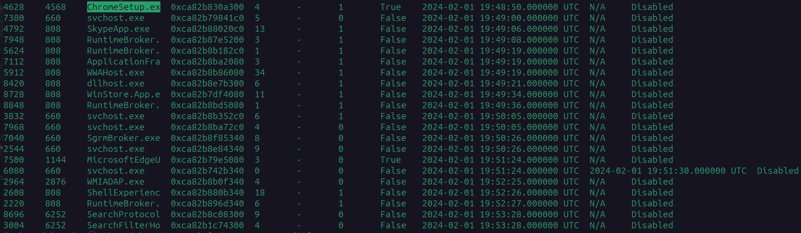
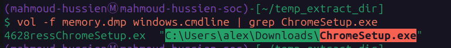
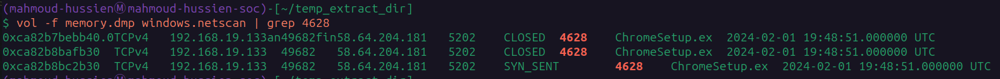
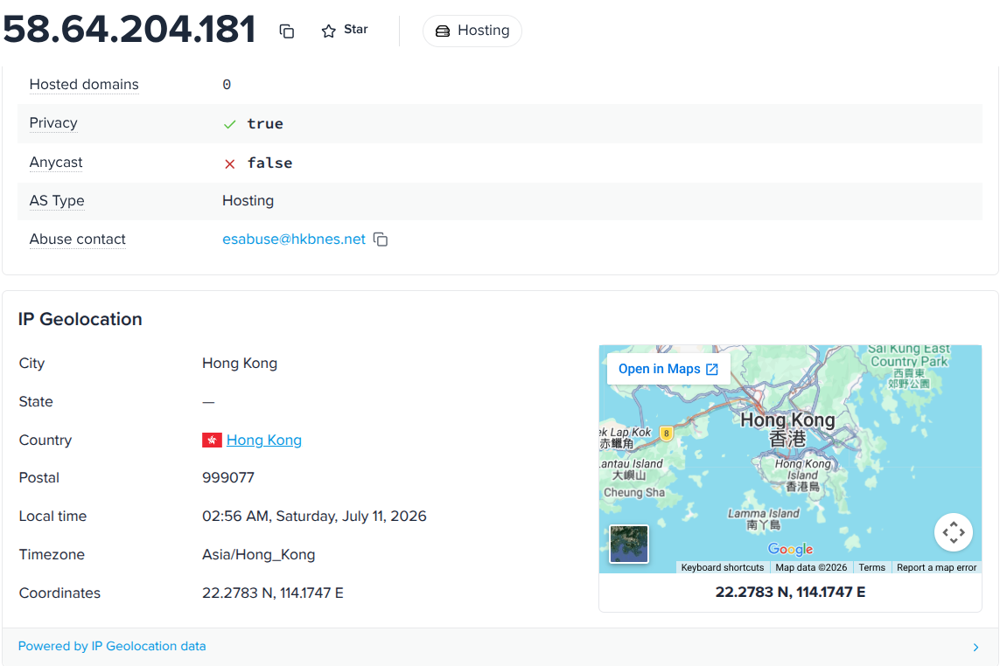
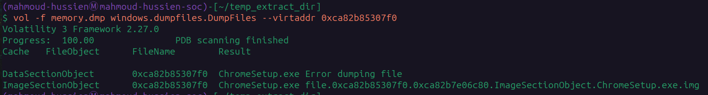
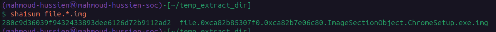
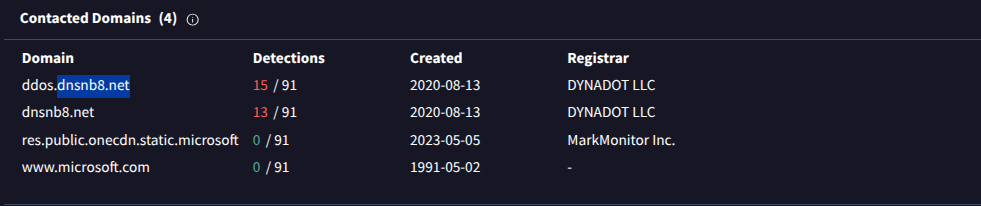

# Ramnit Lab — CTF Writeup

* **Platform:** CyberDefenders  
* **Challenge:** Ramnit Lab  
* **Category:** Memory Forensics / Malware Analysis  
* **Difficulty:** Easy  
* **Analyst:** Mahmoud Hussien
* **Tool:** Volatility 3, VirusTotal  
* **Artefact:** `memory.dmp` — Windows Memory Dump

---

## Scenario Overview

An IDS alert flagged suspicious behavior on a workstation. A memory dump was acquired for forensic analysis. Investigation revealed a disguised executable (`ChromeSetup.exe`) running from a user's Downloads folder — masquerading as a legitimate Google Chrome installer while beaconing to a C2 server in Hong Kong over a non-standard port.

---

## Investigation Workflow

```
[1] Process Enumeration  → windows.pslist
[2] Path Extraction      → windows.cmdline
[3] Network Mapping      → windows.netscan
[4] File Extraction      → windows.dumpfiles
[5] Hash Computation     → sha1sum
[6] Threat Intelligence  → VirusTotal
```

---

## Question 1 — What is the name of the process responsible for the suspicious activity?

### Investigation

**Volatility Command:**

```bash
vol -f memory.dmp windows.pslist
```

`windows.pslist` enumerates all active processes from the EPROCESS linked list in memory. Reviewing the process list for anomalies — unexpected names, unusual parent-child relationships, or processes running from non-standard paths — revealed one suspicious entry.

The process named `ChromeSetup.exe` was flagged due to its execution context: a legitimate Chrome installer would typically be run briefly during installation and then terminate, not remain as a persistent running process with active network connections.

### Answer

```
ChromeSetup.exe
```


---

## Question 2 — What is the exact path of the malicious executable?

### Investigation

**Volatility Command:**

```bash
vol -f memory.dmp windows.cmdline | grep ChromeSetup.exe
```

`windows.cmdline` extracts the full command-line arguments and executable paths for every running process from memory. Filtering for the suspicious process name confirmed the exact on-disk location:

```
PID 4628: C:\Users\alex\Downloads\ChromeSetup.exe
```

**Why this is suspicious:**

| Indicator | Analysis |
|---|---|
| Location: `Downloads\` | Legitimate Chrome setups run from `%TEMP%` or an admin-controlled path |
| No elevation | Real installers prompt for admin rights — this ran silently |
| Persistent execution | A legitimate installer terminates after completion |

### Answer

```
C:\Users\alex\Downloads\ChromeSetup.exe
```


---

## Question 3 — What IP address did the malware attempt to connect to?

### Investigation

**Volatility Command:**

```bash
vol -f memory.dmp windows.netscan | grep 4628
```

`windows.netscan` scans memory for network socket structures (`_TCP_ENDPOINT`, `_TCP_LISTENER`, `_UDP_ENDPOINT`). Filtering by PID `4628` revealed an active outbound TCP connection:

| Source IP | Source Port | Destination IP | Dest Port | Protocol | State |
|---|---|---|---|---|---|
| `192.168.19.133` | `49682` | `58.64.204.181` | `5202` | TCPv4 | SYN_SENT |

The `SYN_SENT` state confirms the malware was **actively attempting to reach the C2 server** at the time the memory dump was taken — the TCP handshake was initiated but not yet completed.

Port `5202` is non-standard for normal web traffic — a deliberate choice to avoid common port-based firewall rules.

### Answer

```
58.64.204.181
```


---

## Question 4 — Which city is associated with the attacker's IP address?

### Investigation

Submitted `58.64.204.181` to VirusTotal and ipinfo.io for geolocation and infrastructure enrichment:

| Field | Value |
|---|---|
| Country | Hong Kong |
| AS Type | Hosting / Commercial |
| Abuse Contact | `esabuse@hkbnes.net` |
| Provider | Hong Kong Broadband Network Enterprise Solutions |

The IP resolves to a commercial hosting provider — commonly abused by threat actors to host C2 infrastructure, as hosting providers in certain jurisdictions are slow to respond to abuse reports.

### Answer

```
Hong Kong
```


---

## Question 5 — What is the SHA1 hash of the malware executable?

### Investigation

**Volatility Commands:**

```bash
# Step 1: Export the binary image from memory
vol -f memory.dmp windows.dumpfiles.DumpFiles --virtaddr 0xca82b85307f0

# Step 2: Compute the SHA1 hash of the extracted image
sha1sum file.0xca82b85307f0.0xca82b7e06c80.ImageSectionObject.ChromeSetup.exe.img
```

The binary was extracted from the `ImageSectionObject` (the memory-mapped PE image) using its virtual address obtained from `windows.dumpfiles`. The SHA1 was then computed locally and cross-referenced with VirusTotal for threat intelligence confirmation.


**VirusTotal Results:**
- Multiple AV engines flagged the file as malicious
- Associated with botnet / RAT families
- Infrastructure linked to `dnsnb8.net` C2 domain

### Answer

```
280c9d36039f9432433893dee6126d72b9112ad2
```


---

## Question 6 — What is the compilation timestamp of the malware?

### Investigation

The PE (Portable Executable) header of every Windows binary contains a `TimeDateStamp` field set at compile time. After extracting the binary from memory, the PE header was inspected using VirusTotal's **Details** tab under the PE metadata section.

| Field | Value |
|---|---|
| PE Compilation Time | `2019-12-01 08:36:04 UTC` |
| First Global Submission | `2024-02-03 00:02:57 UTC` |
| Gap | ~4 years between compilation and first detection |

This 4-year gap between compilation and first public submission suggests the malware was either used in private targeted campaigns or stored and deployed much later than it was originally built.

### Answer

```
2019-12-01 08:36
```


---

## Question 7 — What is the domain connected to the malware?

### Investigation

VirusTotal's **Relations** tab for the SHA1 hash revealed the C2 infrastructure domains contacted by the malware during sandbox execution:

| Domain | Detection Ratio | Registrar | Role |
|---|---|---|---|
| `dnsnb8.net` | 13/91 | DYNADOT LLC | Primary C2 domain |
| `ddos.dnsnb8.net` | 15/91 | DYNADOT LLC | Active C2 subdomain / botnet signal |

The domain `dnsnb8.net` was registered on **2020-08-13** via Dynadot LLC — approximately 8 months after the binary's compilation timestamp, suggesting the threat actor prepared the delivery infrastructure separately from the malware build.

### Answer

```
dnsnb8.net
```


---

## Full Attack Timeline

| Timestamp (UTC) | Event |
|---|---|
| `2019-12-01 08:36:04` | Malware binary compiled (PE header timestamp) |
| `2020-08-13` | C2 domain `dnsnb8.net` registered via Dynadot LLC |
| `2024-02-01 19:48:50` | `ChromeSetup.exe` (PID: 4628) spawned by PPID: 4568 |
| `2024-02-01 19:48:51` | Outbound TCP SYN sent to `58.64.204.181:5202` |
| `2024-02-03 00:02:57` | First global VirusTotal submission |

---

## Malicious Process Profile

| Field | Value |
|---|---|
| Process Name | `ChromeSetup.exe` |
| PID | `4628` |
| PPID | `4568` |
| Architecture | 32-bit (Wow64: True) on 64-bit OS |
| Execution Path | `C:\Users\alex\Downloads\ChromeSetup.exe` |
| SHA1 Hash | `280c9d36039f9432433893dee6126d72b9112ad2` |
| Compilation Date | `2019-12-01 08:36:04 UTC` |
| C2 IP | `58.64.204.181:5202` |
| C2 Location | Hong Kong |
| C2 Domain | `dnsnb8.net` / `ddos.dnsnb8.net` |

---

## Indicators of Compromise (IOCs)

| Type | Value | Description |
|---|---|---|
| Process | `ChromeSetup.exe` | Masquerading malware process |
| PID | `4628` | Malicious process ID |
| Path | `C:\Users\alex\Downloads\ChromeSetup.exe` | On-disk execution path |
| SHA1 | `280c9d36039f9432433893dee6126d72b9112ad2` | Binary hash |
| IP | `58.64.204.181` | C2 server (Hong Kong) |
| Port | `5202/TCP` | Non-standard C2 communication port |
| Domain | `dnsnb8.net` | Primary C2 domain |
| Domain | `ddos.dnsnb8.net` | Active C2 subdomain |

---

## Key Volatility Commands Reference

```bash
# List all running processes
vol -f memory.dmp windows.pslist

# Extract full command-line paths
vol -f memory.dmp windows.cmdline | grep ChromeSetup.exe

# Map network connections by PID
vol -f memory.dmp windows.netscan | grep 4628

# Dump binary from memory
vol -f memory.dmp windows.dumpfiles.DumpFiles --virtaddr 0xca82b85307f0

# Compute SHA1 of extracted image
sha1sum file.0xca82b85307f0.0xca82b7e06c80.ImageSectionObject.ChromeSetup.exe.img
```

---

## MITRE ATT&CK Mapping

| Phase | Technique ID | Technique Name |
|---|---|---|
| Defense Evasion | T1036.005 | Masquerading: Match Legitimate Name (ChromeSetup.exe) |
| Execution | T1204.002 | User Execution: Malicious File |
| Command & Control | T1571 | Non-Standard Port (5202/TCP) |
| Command & Control | T1071.001 | Web Protocols |
| Command & Control | T1568 | Dynamic Resolution (DDNS — dnsnb8.net) |

---

## Lessons Learned

1. **Alert on processes running from Downloads folders** — Legitimate system binaries never execute from `C:\Users\<user>\Downloads\`. Any process spawned from this path should trigger an EDR alert for review.
2. **Monitor non-standard outbound ports** — Port `5202` has no legitimate application in a corporate environment. Egress filtering should enforce an allowlist of approved outbound ports.
3. **Name-based masquerading detection** — Deploy EDR rules that compare process names against known legitimate binaries and flag mismatches (e.g., `ChromeSetup.exe` running outside Google's update infrastructure paths).
4. **Block known malicious ASNs** — Commercial hosting ASNs in high-risk jurisdictions with no legitimate business purpose should be blocked at the perimeter firewall.
5. **Memory forensics as a detection layer** — Network and endpoint logs alone may miss in-memory activity. Periodic memory snapshots combined with Volatility analysis provide a critical additional detection layer.

---

*Writeup produced as part of SOC Analyst training — CyberDefenders: Ramnit Lab*