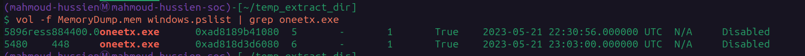
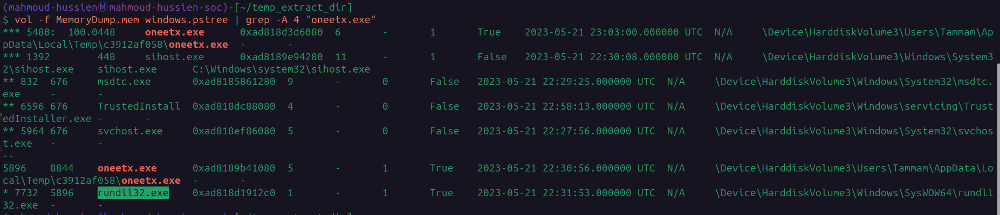
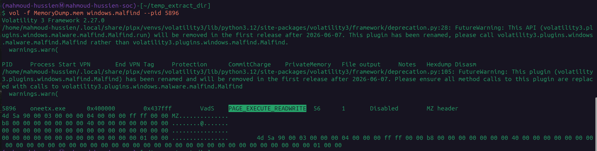
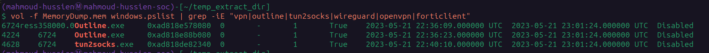
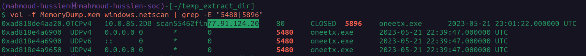
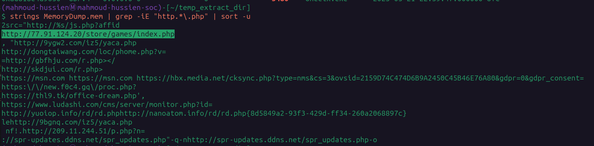
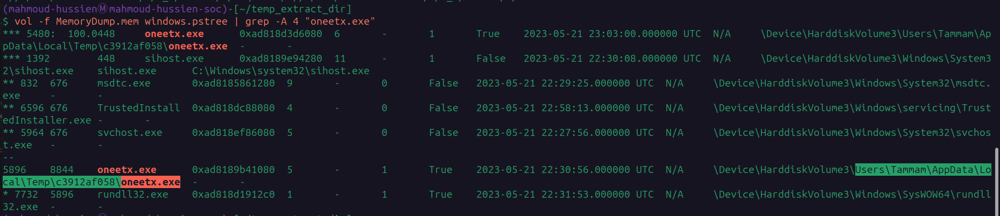

# RedLine Lab — CTF Writeup

**Platform:** CyberDefenders  
**Challenge:** RedLine Lab  
**Category:** Memory Forensics / Malware Analysis  
**Difficulty:** Medium  
**Analyst:** Mahmoud Hussien 
**Tool:** Volatility 3, strings  
**Artefact:** `MemoryDump.mem` — Windows Memory Dump

---

## Scenario Overview

A volatile memory dump was retrieved from a compromised Windows host. The investigation traced a malicious executable (`oneetx.exe`) dropped into a user's Temp directory, performing process injection into memory with RWX permissions, establishing a C2 connection to a remote PHP panel, and deliberately terminating the system's VPN to bypass Network Intrusion Detection System (NIDS) monitoring before spawning a second malicious instance.

The behavioral indicators align with **RedLine Stealer** — a commercial information-stealing malware targeting browser credentials, cookies, and crypto wallets.

---

## Attack Chain Overview

```
[1] Execution
    └─ oneetx.exe (PID: 5896) dropped in %TEMP%\c3912af058\
    └─ Spawns: rundll32.exe (PID: 7732)

[2] Memory Injection
    └─ RWX region at 0x400000–0x437fff
    └─ MZ header in unbacked memory → Process Injection

[3] C2 Communication (23:01:22 UTC)
    └─ Beacon → 77.91.124.20:80
    └─ URL: http://77.91.124.20/store/games/index.php
    └─ Socket closed after data handoff

[4] NIDS Evasion (23:01:24 UTC)
    └─ VPN terminated: Outline.exe (PIDs: 6724, 4224)
    └─ Tunnel killed: tun2socks.exe (PID: 4628)

[5] Phase 2 Execution (23:03:00 UTC)
    └─ oneetx.exe (PID: 5480) spawned under sihost.exe (PID: 448)
    └─ Post-evasion actions over cleartext interface
```

---

## Question 1 — What is the name of the suspicious process?

### Volatility Command

```bash
vol -f MemoryDump.mem windows.pslist
```

### Investigation

`windows.pslist` enumerates all active processes from the Windows EPROCESS doubly-linked list in memory. Reviewing the process list for anomalies — unexpected binary names, unusual execution paths, or processes spawning from user Temp directories — revealed one high-confidence malicious entry.

The process `oneetx.exe` stood out immediately:

- Running from `C:\Users\Tammam\AppData\Local\Temp\c3912af058\` — a randomized subfolder in Temp is a hallmark of dropped malware from browser exploitation or malicious installers.
- Two separate instances were running (PIDs: 5896 and 5480), suggesting relaunch or persistence staging.

### Answer

```
oneetx.exe
```


---

## Question 2 — What is the child process name of the suspicious process?

### Volatility Command

```bash
vol -f MemoryDump.mem windows.pstree | grep -A 4 "oneetx.exe"
```

### Investigation

`windows.pstree` reconstructs the parent-child process hierarchy from memory. Filtering for `oneetx.exe` and looking 4 lines ahead exposed the child process spawned by the primary malicious instance (PID: 5896).

The child process:

```
oneetx.exe (PID: 5896)
    └─ rundll32.exe (PID: 7732) — spawned at 22:31:53 UTC
```

`rundll32.exe` is a legitimate Windows binary used to execute functions exported from DLL files. Malware abuses it as a **Living-off-the-Land Binary (LOLBin)** to execute malicious DLL payloads while appearing as a trusted system process — making it harder for signature-based tools to flag.

### Answer

```
rundll32.exe
```


---

## Question 3 — What is the memory protection applied to the suspicious process memory region?

### Volatility Command

```bash
vol -f MemoryDump.mem windows.malfind --pid 5896
```

### Investigation

`windows.malfind` scans process Virtual Address Descriptor (VAD) nodes for memory regions with suspicious combinations of:

- **Executable + Writable** permissions simultaneously
- PE headers (`MZ` / `4d 5a`) found in memory regions not backed by a file on disk

For PID 5896, a suspicious memory region was identified:

| Field | Value |
|---|---|
| Address Range | `0x400000 — 0x437fff` |
| VAD Tag | `VadS` (unbacked — no file on disk) |
| Protection | `PAGE_EXECUTE_READWRITE` |
| Header | `4d 5a` (MZ — PE executable) |

`PAGE_EXECUTE_READWRITE` (RWX) means the region can be read, written, and executed simultaneously. Legitimate code is almost never allocated with all three permissions — this is the definitive signature of **process injection** or **shellcode staging** in memory.

### Answer

```
PAGE_EXECUTE_READWRITE
```


---

## Question 4 — What is the name of the process responsible for the VPN connection?

### Volatility Command

```bash
vol -f MemoryDump.mem windows.pslist | grep -iE "vpn|outline|tun2socks|wireguard|openvpn|forticlient"
```

### Investigation

Grep-filtering the process list for common VPN client binary names surfaced two VPN-related processes:

| PID | Process | Role |
|---|---|---|
| 6724 / 4224 | `Outline.exe` | Outline VPN core — manages encrypted tunnel |
| 4628 | `tun2socks.exe` | SOCKS5 proxy — redirects traffic through the tunnel |

The attacker deliberately killed both at `23:01:24 UTC` — exactly 2 seconds after the C2 beacon closed — to push subsequent traffic over cleartext interfaces and bypass NIDS rules tuned to monitor the encrypted VPN tunnel.

### Answer

```
outline.exe
```


---

## Question 5 — What is the attacker's IP address?

### Volatility Command

```bash
vol -f MemoryDump.mem windows.netscan | grep -E "5480|5896"
```

### Investigation

`windows.netscan` carves network socket structures from memory (`_TCP_ENDPOINT`, `_UDP_ENDPOINT`). Filtering for both malicious PIDs revealed the C2 connection:

| Source IP | Source Port | Destination IP | Dest Port | State | PID |
|---|---|---|---|---|---|
| `192.168.x.x` | Ephemeral | `77.91.124.20` | `80` | CLOSED | 5896 |

The connection was made over port **80 (HTTP)** — standard web traffic — to blend C2 beaconing with normal internet activity. The `CLOSED` state at `23:01:22 UTC` confirms the data handoff completed before the VPN was terminated.

### Answer

```
77.91.124.20
```


---

## Question 6 — What is the full URL of the PHP file the attacker visited?

### Volatility Command

```bash
strings MemoryDump.mem | grep -iE "http.*\.php" | sort -u
```

### Investigation

String carving the raw memory image for HTTP URLs ending in `.php` extracts hardcoded C2 panel paths from the malware's unpacked payload in memory. The URL follows a game-themed directory structure — a deliberate camouflage technique to make the C2 panel URL appear as a legitimate gaming website path.

```
http://77.91.124.20/store/games/index.php
```

The `/store/games/` path structure is a well-documented pattern for **RedLine Stealer** administrative panels.

### Answer

```
http://77.91.124.20/store/games/index.php
```


---

## Question 7 — What is the full path of the malicious executable?

### Volatility Command

```bash
vol -f MemoryDump.mem windows.pstree | grep -A 4 "oneetx.exe"
```

### Investigation

The process tree output includes the full command-line path for each process. The primary `oneetx.exe` instance (PID: 5896) shows the complete on-disk execution path:

```
C:\Users\Tammam\AppData\Local\Temp\c3912af058\oneetx.exe
```

**Path Analysis:**

| Component | Significance |
|---|---|
| `AppData\Local\Temp\` | User-writable — no admin rights needed to drop files |
| `c3912af058\` | Randomized subfolder — evades static path-based detections |
| `oneetx.exe` | Obfuscated name — not matching any known legitimate binary |

### Answer

```
C:\Users\Tammam\AppData\Local\Temp\c3912af058\oneetx.exe
```


---

## Full Attack Timeline

| Timestamp (UTC) | PID | Event |
|---|---|---|
| 2023-05-21 22:30:08 | 448 | `sihost.exe` — legitimate Windows shell host starts |
| 2023-05-21 22:30:56 | 5896 | `oneetx.exe` — initial malware instance executed |
| 2023-05-21 22:30:56 | 5896 | RWX memory region injected at `0x400000` |
| 2023-05-21 22:31:53 | 7732 | `rundll32.exe` spawned by `oneetx.exe` (PID: 5896) |
| 2023-05-21 22:36:09 | 6724 | `Outline.exe` VPN running (legitimate) |
| 2023-05-21 22:40:10 | 4628 | `tun2socks.exe` SOCKS5 proxy active |
| 2023-05-21 23:01:22 | 5896 | C2 beacon → `77.91.124.20:80` → CLOSED |
| 2023-05-21 23:01:24 | 6724/4224/4628 | VPN + tunnel processes **forcibly terminated** |
| 2023-05-21 23:03:00 | 5480 | `oneetx.exe` Phase 2 — spawned under `sihost.exe` |

---

## Indicators of Compromise (IOCs)

| Type | Value | Description |
|---|---|---|
| File | `oneetx.exe` | RedLine Stealer binary |
| Path | `C:\Users\Tammam\AppData\Local\Temp\c3912af058\oneetx.exe` | Malware drop location |
| PID | `5896` | Primary malware instance |
| PID | `5480` | Phase 2 malware instance (under sihost.exe) |
| PID | `7732` | `rundll32.exe` — child LOLBin |
| Memory | `0x400000–0x437fff` | RWX injected region (MZ header) |
| IP | `77.91.124.20` | RedLine C2 server |
| Port | `80/TCP` | C2 communication port |
| URL | `http://77.91.124.20/store/games/index.php` | RedLine admin panel endpoint |
| User | `Tammam` | Compromised user profile |

---

## Key Volatility Commands Reference

```bash
# List all processes
vol -f MemoryDump.mem windows.pslist

# Process tree (parent-child relationships)
vol -f MemoryDump.mem windows.pstree | grep -A 4 "oneetx.exe"

# Memory injection detection (RWX regions + MZ headers)
vol -f MemoryDump.mem windows.malfind --pid 5896

# VPN process identification
vol -f MemoryDump.mem windows.pslist | grep -iE "vpn|outline|tun2socks|wireguard|openvpn"

# Network connections by malicious PID
vol -f MemoryDump.mem windows.netscan | grep -E "5480|5896"

# String carve for C2 URLs
strings MemoryDump.mem | grep -iE "http.*\.php" | sort -u
```

---

## MITRE ATT&CK Mapping

| Phase | Technique ID | Technique Name |
|---|---|---|
| Execution | T1204.002 | User Execution: Malicious File |
| Defense Evasion | T1055 | Process Injection |
| Defense Evasion | T1218.011 | System Binary Proxy Execution: Rundll32 |
| Defense Evasion | T1562.001 | Disable or Modify Tools (VPN termination) |
| Defense Evasion | T1036 | Masquerading (random Temp subfolder) |
| Persistence | T1574 | Hijack Execution Flow (sihost.exe parent) |
| Credential Access | T1555.003 | Credentials from Web Browsers |
| Command & Control | T1071.001 | Web Protocols (HTTP port 80) |
| Command & Control | T1105 | Ingress Tool Transfer |

---

## Lessons Learned

1. **Alert on RWX memory allocations** — `PAGE_EXECUTE_READWRITE` in a VAD region not backed by a disk file is one of the highest-confidence process injection indicators. EDR tools should fire immediately on this pattern.
2. **Monitor processes spawning from %TEMP%** — Any executable running from `AppData\Local\Temp\<random>\` is suspicious and should be sandboxed automatically.
3. **Detect VPN process termination correlation** — A VPN process being killed within seconds of a network connection closing is a behavioral anomaly worth a dedicated SIEM correlation rule.
4. **Flag rundll32.exe with suspicious parents** — `rundll32.exe` spawned by a non-system process from Temp is a LOLBin abuse pattern that should trigger an immediate EDR alert.
5. **Credential reset for affected users** — RedLine Stealer harvests browser-saved passwords, cookies, and crypto wallets. All credentials stored by user `Tammam` must be treated as fully compromised and reset immediately.
6. **Block the C2 IP at perimeter** — Deny all traffic to `77.91.124.20` at the firewall layer and add it to the threat intelligence feed for enterprise-wide blocking.

---

*Writeup produced as part of SOC Analyst training — CyberDefenders: RedLine Lab*