#### Slingshot (SOC Investigation – Web Attack & Full Kill Chain Analysis)

---

### 📌 Scenario

Slingway Inc. detected suspicious activity on its e-commerce web server, including potential unauthorized database modifications.

As a SOC Analyst, the task was to investigate logs from the **Elastic Stack (Kibana)** using the `apache_logs` data view to uncover attacker activity starting from **July 26, 2023**.

---

### 🎯 Investigation Objectives

* Identify reconnaissance and enumeration techniques
* Detect exploited vulnerabilities
* Determine how administrative access was obtained
* Identify data access and exfiltration

---

### 🔍 Key Findings

* 🌐 Attacker IP Address:

  ```
  10.0.2.15
  ```

* 🔎 Initial Reconnaissance Tool:

  ```
  Nmap Scripting Engine
  ```
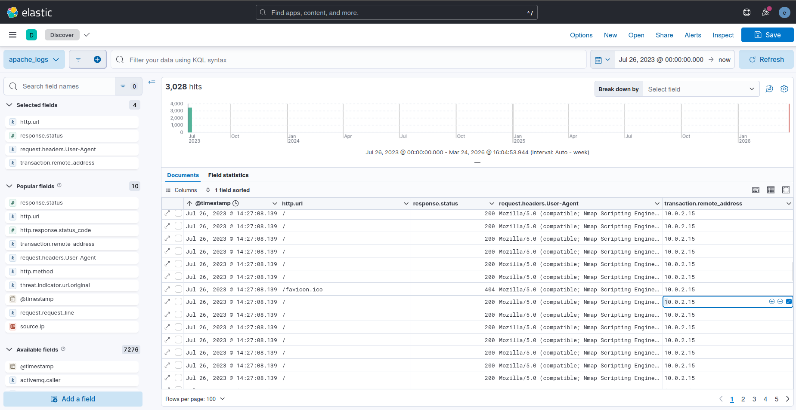

* 📂 Directory Enumeration Tool:

  ```
  Mozilla/5.0 (Gobuster)
  ```
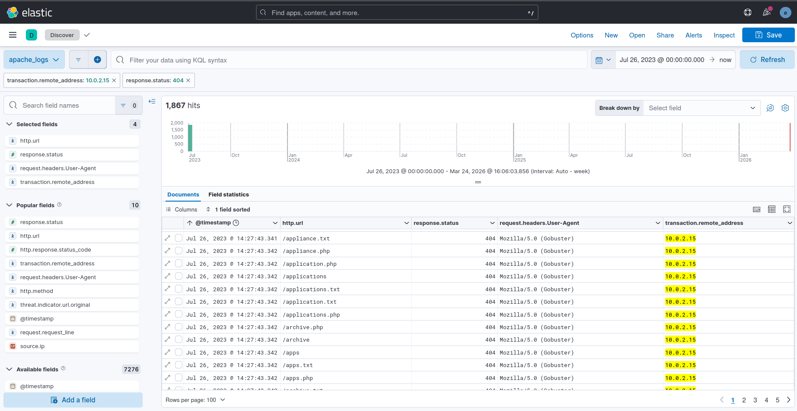

* 📊 Total 404 Responses (Enumeration Evidence):

  ```
  1867
  ```

* 🚪 Discovered Admin Login Page:

  ```
  /admin-login.php
  ```
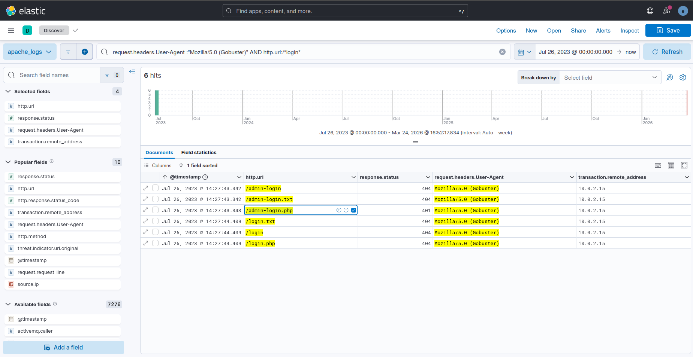

---

### 🚨 Attack Details

#### 🔐 Brute Force Attack

* 🛠️ Tool Used:

  ```
  Mozilla/4.0 (Hydra)
  ```
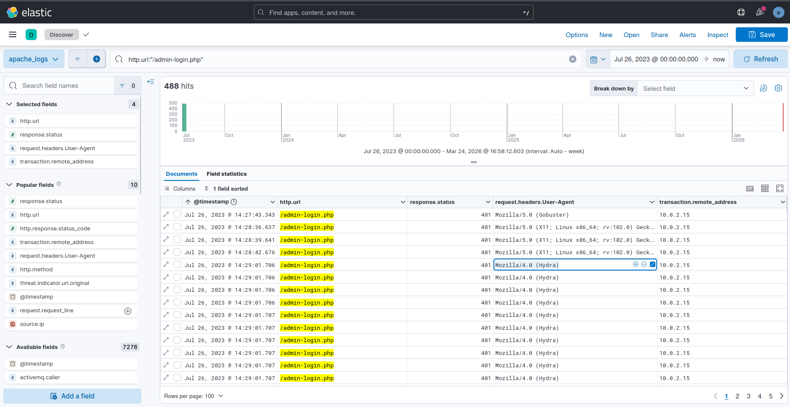

* 🔑 Compromised Credentials:

  ```
  admin:thx1138
  ```
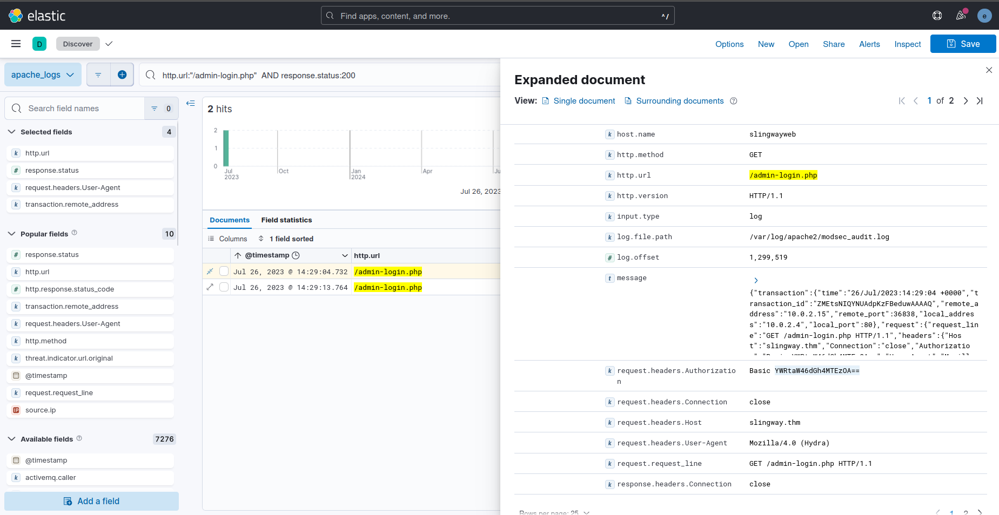
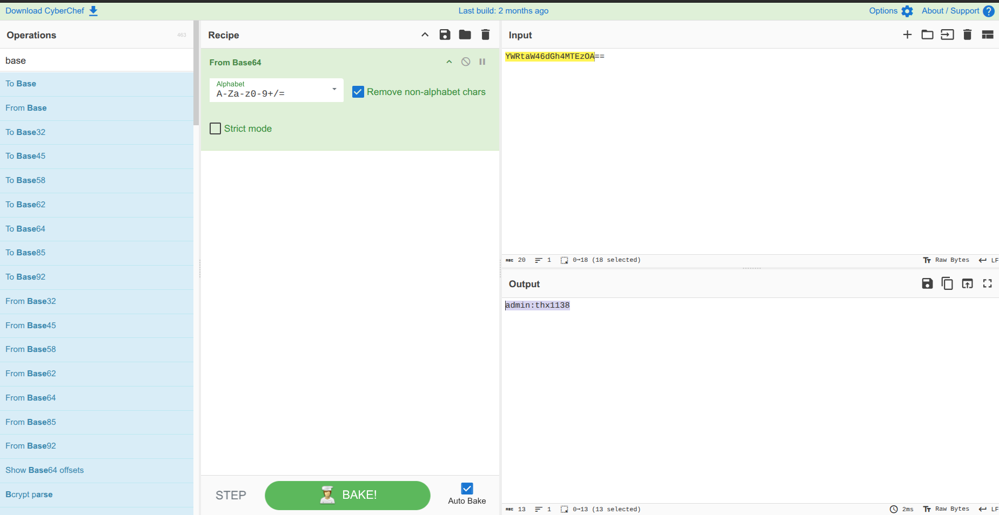

---

#### 🐚 Web Shell Deployment

* 📁 Uploaded File:

  ```
  easy-simple-php-webshell.php
  ```
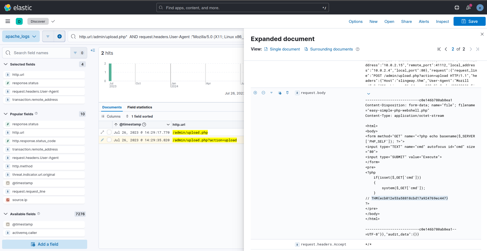

* 🧪 Command Execution:

  ```
  whoami
  ```
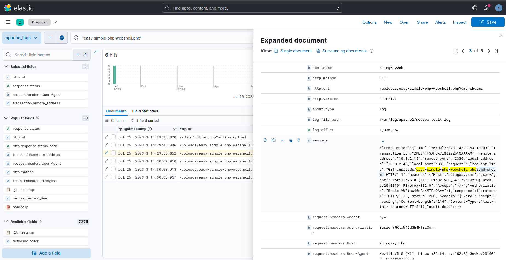

---

#### 🗂️ Exploitation Techniques

* 📂 Local File Inclusion (LFI):

  ```
  config-db.php
  ```
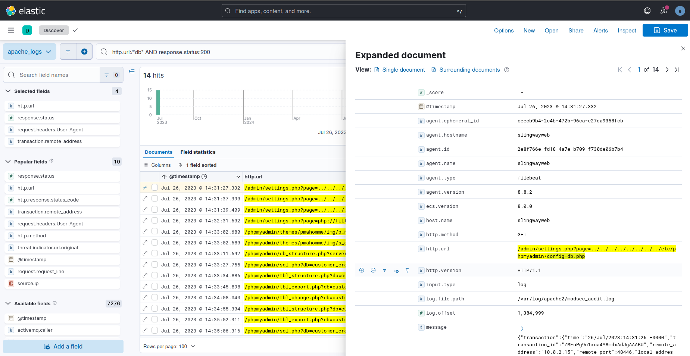

➡️ Used to retrieve database credentials

---

### 📦 Post-Exploitation

* 🗄️ Database Accessed:

  ```
  customer_credit_cards
  ```
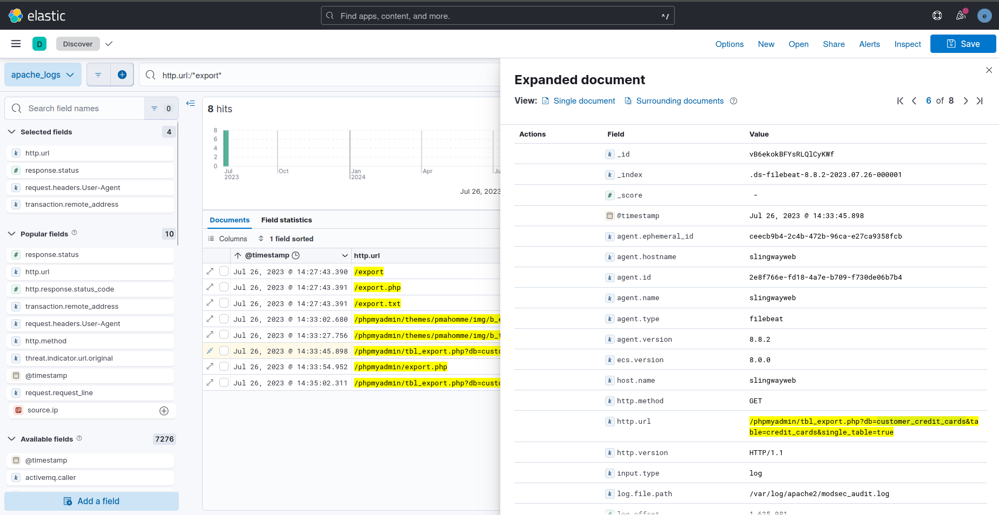

* 🧬 Injected Flag (via import.php):

  ```
  c6aa3215a7d519eeb40a660f3b76e64c
  ```
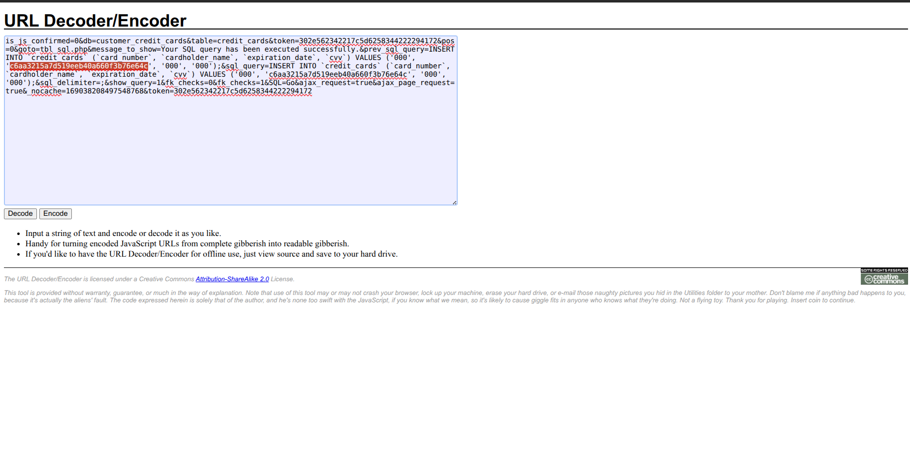

* 🏁 Uploaded File Flag:

  ```
  THM{ecb012e53a58818cbd17a924769ec447}
  ```

---

### 🧠 Attack Chain Summary

1. Reconnaissance using **Nmap**
2. Directory brute-force using **Gobuster**
3. Discovery of admin panel
4. Brute-force attack via **Hydra**
5. Upload of malicious **web shell**
6. Command execution on server
7. Exploitation via **LFI**
8. Database access and data exfiltration

---

### 🧩 MITRE ATT&CK Mapping

* **T1595** – Active Scanning
* **T1110** – Brute Force
* **T1505.003** – Web Shell
* **T1059** – Command Execution
* **T1005** – Data from Local System
* **T1190** – Exploit Public-Facing Application

---

### 🛠️ Skills Demonstrated

* Web log analysis using **Kibana (ELK Stack)**
* Detection of reconnaissance & enumeration techniques
* Identifying brute-force attacks
* Web shell detection and analysis
* Exploitation techniques (LFI)
* Tracking attacker activity across full kill chain

---

### 🏁 Conclusion

The investigation revealed a full attack lifecycle starting from reconnaissance to data exfiltration. The attacker leveraged multiple techniques including **directory enumeration, brute-force authentication, web shell deployment, and LFI exploitation** to gain persistent access and extract sensitive data.

This scenario demonstrates a real-world web attack chain and highlights the importance of monitoring web logs, securing admin panels, and preventing misuse of vulnerable web applications.
