# WireDive Lab — CTF Writeup

* **Platform:** CyberDefenders  
* **Challenge:** WireDive Lab  
* **Category:** Network Forensics  
* **Difficulty:** Medium
* **Analyst:** Mahmoud Hussien 
* **Tool:** Wireshark, nslookup/dig, grep

---

## Scenario Overview

WireDive is a comprehensive network traffic analysis exercise covering seven distinct PCAP files, each targeting a different protocol or scenario. The challenge tests DFIR skills across DHCP, DNS, SMB, reverse shells, enterprise network protocols, and HTTPS decryption — simulating artifacts commonly encountered in real-world blue team investigations.

**Challenge Files:**
- `dhcp.pcapng` — DHCP analysis
- `dns.pcapng` — DNS forensics
- `smb.pcapng` — SMB file access & authentication
- `shell.pcapng` — Reverse shell investigation
- `network.pcapng` — Enterprise protocol analysis
- `https.pcapng` — HTTPS decryption & web forensics
- `secret_sauce.txt` — TLS session key decryption file

---

## Section 1 — dhcp.pcapng

### Wireshark Filter

```
dhcp
```

---

### Q1 — What IP address is requested by the client?

**Investigation:**

The capture `dhcp.pcapng` was opened in Wireshark and isolated using the display filter `dhcp`. A complete DORA (Discover, Offer, Request, Acknowledge) cycle was identified starting at Frame 186. Inspecting the `DHCP Request` packet (Frame 189) under the Bootstrap Protocol layer reveals that the client machine requested the explicit assignment of `192.168.2.244` within:

```
Bootstrap Protocol → Option 50 (Requested IP Address)
```

**Answer:**

```
192.168.2.244
```
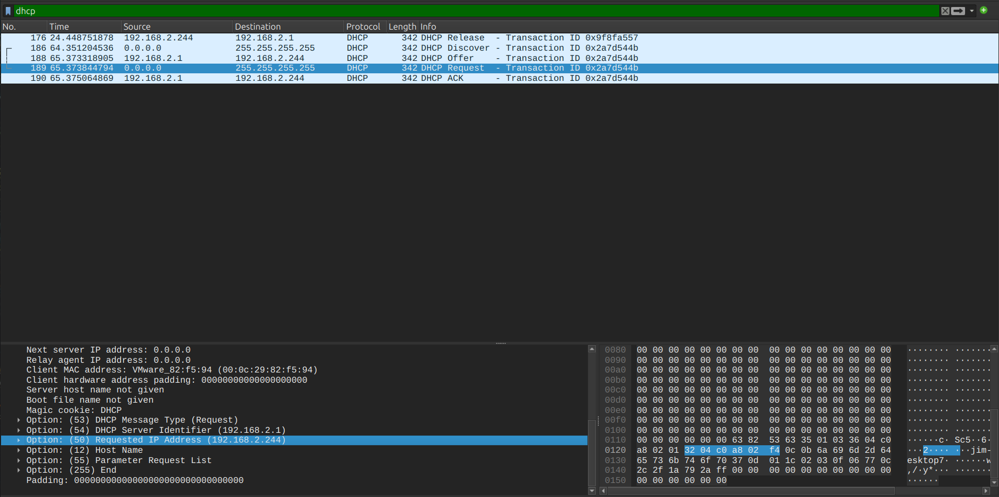

---

### Q2 — What is the transaction ID for the DHCP release?

**Investigation:**

Inside the filtered DHCP traffic, the first logged DHCP event (Frame 176) shows a `DHCP Release` message sent by the client (`192.168.2.244`) to the DHCP Server (`192.168.2.1`). Inspecting the Bootstrap Protocol fields of Frame 176:

```
Bootstrap Protocol → Transaction ID
```

Reveals a 4-byte unique Transaction ID value of `0x9f8fa557`.

**Answer:**

```
0x9f8fa557
```
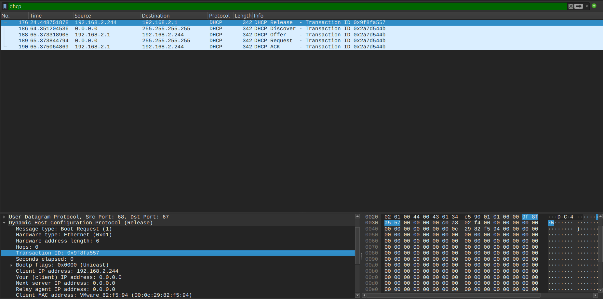

---

### Q3 — What is the MAC address of the client?

**Investigation:**

Inspecting the detailed packet bytes of Frame 176 under the `Dynamic Host Configuration Protocol (Release)` tree, the field `Client MAC address` explicitly logs the hardware identifier. The vendor OUI prefix identifies this as a VMware virtual interface.

```
Dynamic Host Configuration Protocol → Client MAC address
```

**Answer:**

```
00:0c:29:82:f5:94
```
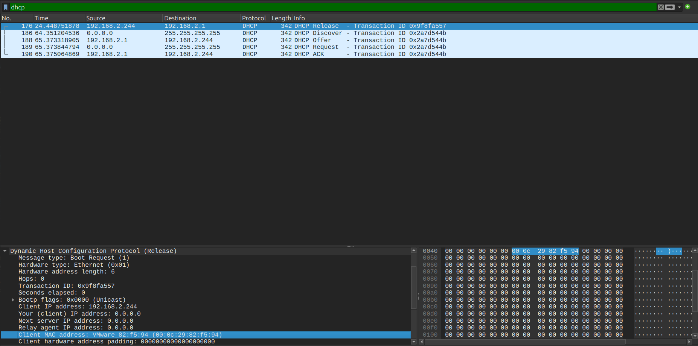

---

## Section 2 — dns.pcapng

### Wireshark Filter

```
dns.flags.response == 1
```

---

### Q4 — What is the response for the lookup of flag.fruitinc.xyz?

**Investigation:**

The capture file `dns.pcapng` was opened and filtered using `dns.flags.response == 1` to isolate incoming resolution responses. At Frame 24, a standard query response (Transaction ID: `0x41ff`) targeting the FQDN `flag.fruitinc.xyz` was captured. Expanding the `Answers` structure fields for the target `TXT` record explicitly displays the embedded string value:

```
Answers → TXT Record → Text: ACOOLDNSFLAG
```

**Answer:**

```
ACOOLDNSFLAG
```
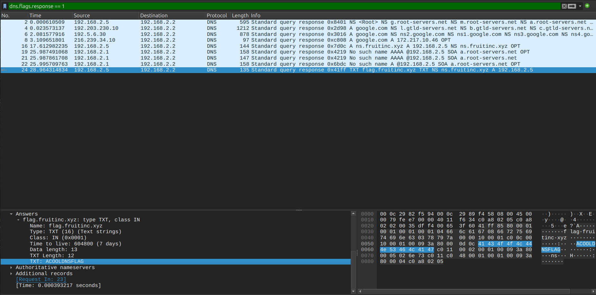

---

### Q5 — Which root server responds to the google.com query?

**Investigation:**

Utilizing the `dns.flags.response == 1` filter within `dns.pcapng`, Frame 4 was analyzed. This packet represents a standard query response for `google.com`. By examining the layer 3 packet structure, the responding root server's IP address was extracted as `192.203.230.10`. To map this address to its official hostname, a reverse pointer lookup was issued:

```bash
nslookup 192.203.230.10
# or
dig -x 192.203.230.10
# or
host 192.203.230.10
```

The reverse lookup confirmed the corresponding root server hostname as `e.root-servers.net`.

**Answer:**

```
e.root-servers.net
```
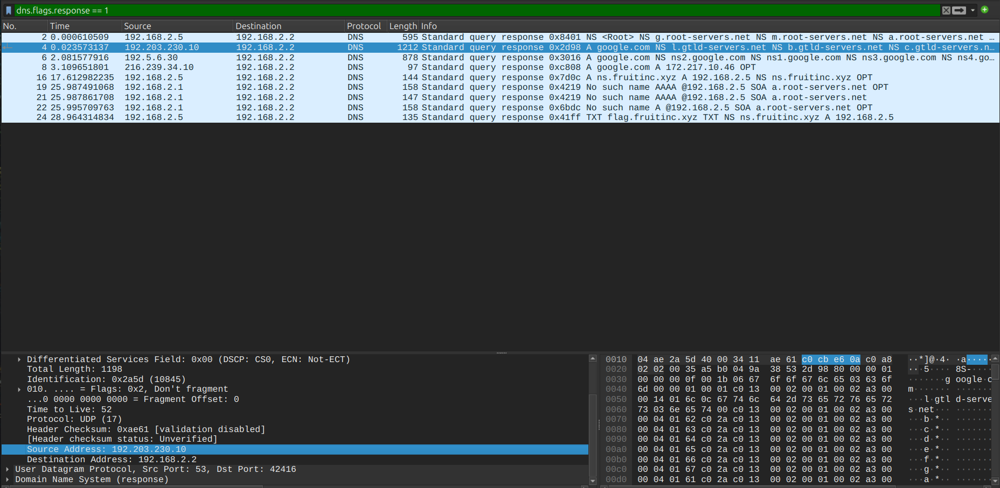

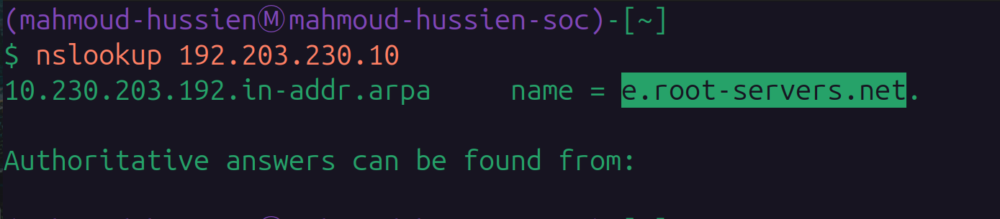


---

## Section 3 — smb.pcapng

---

### Q6 — What is the path of the file that is opened?

**Wireshark Filter:**

```
smb2.filename
```

**Investigation:**

The packet capture `smb.pcapng` was inspected using `smb2.filename` to expose file system enumeration and object access tracking. At Frame 282, an explicit `Create Request File` command generated by source IP `192.168.2.2` directed to destination share IP `192.168.2.10` was captured. Drilling into the SMB2 packet metadata:

```
SMB2 → Create Request → Buffer → Filename
```

The literal path of the target resource was verified as `HelloWorld\TradeSecrets.txt`.

**Answer:**

```
HelloWorld\TradeSecrets.txt
```
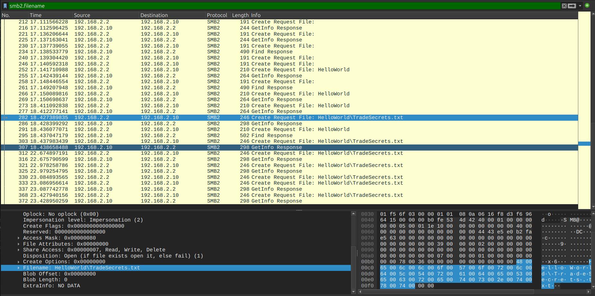

---

### Q7 — What was the hex status code when SAMBA\jtomato logs in?

**Wireshark Filter:**

```
smb2.cmd == 1
```

**Investigation:**

The capture was filtered with `smb2.cmd == 1` to isolate all Session Setup exchanges. At Frame 75, user `SAMBA\jtomato` attempts an `NTLMSSP_AUTH` request from `192.168.2.2` to `192.168.2.10`. Analyzing the immediate Server response in Frame 76, the session initiation fails. Expanding the SMB2 Header parameters:

```
SMB2 Header → NT Status: STATUS_LOGON_FAILURE (0xc000006d)
```

This represents an invalid username or bad password error.

**Answer:**

```
0xc000006d
```
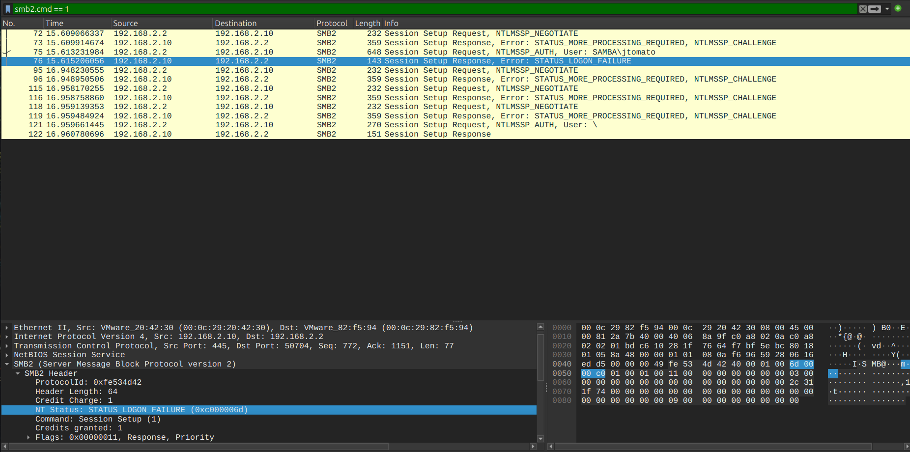

---

### Q8 — What is the tree that is being browsed?

**Wireshark Filter:**

```
smb2.cmd == 3
```

**Investigation:**

The capture was queried using `smb2.cmd == 3` to isolate all SMB2 Tree Connect request/response sequences. Frame 133 indicates an explicit connection attempt by host `192.168.2.2` aimed at remote server `192.168.2.10`. Expanding the structured packet parsing layers:

```
Tree Connect Request (0x03) → Tree: \\192.168.2.10\public
```

**Answer:**

```
\\192.168.2.10\public
```
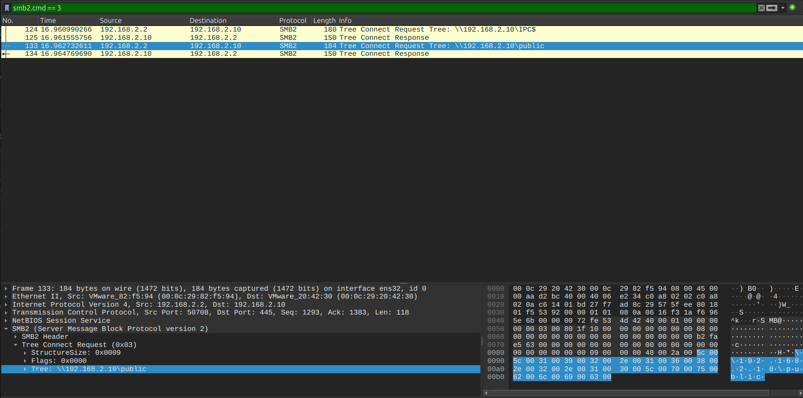

---

### Q9 — What is the flag in the file?

**Wireshark Export:**

```
File → Export Objects → SMB
```

**External Command:**

```bash
grep -io "flag<[^>]*>" '%5cHelloWorld%5cTradeSecrets.txt'
```

**Investigation:**

Following the identification of access targeting `HelloWorld\TradeSecrets.txt`, the raw object data stream was extracted directly from the SMB packet payloads. Once salvaged locally as `%5cHelloWorld%5cTradeSecrets.txt`, a case-insensitive regular expression search was used to target data enclosed within structural tag parameters matching `flag<...>`. This isolated the exact string entry.

**Answer:**

```
OneSuperDuperSecret
```
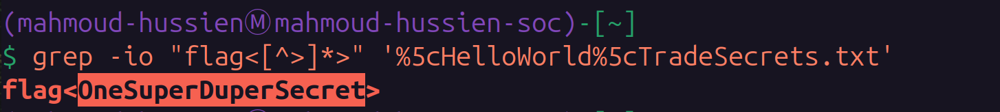

---

## Section 4 — shell.pcapng

---

### Q10 — What port is the shell listening on?

**Investigation:**

The packet capture `shell.pcapng` was opened in Wireshark without any filter applied. Frame 1 captures an initial TCP `SYN` from `192.168.2.5` to `192.168.2.244`. Analyzing the layer 4 parameter parsing block:

```
Transmission Control Protocol → Destination Port: 4444
```

Frame 2 shows a complete handshake acknowledgment (`SYN, ACK`) from `192.168.2.244` on port `4444`, verifying a listening service was waiting for connections at that boundary.

**Answer:**

```
4444
```
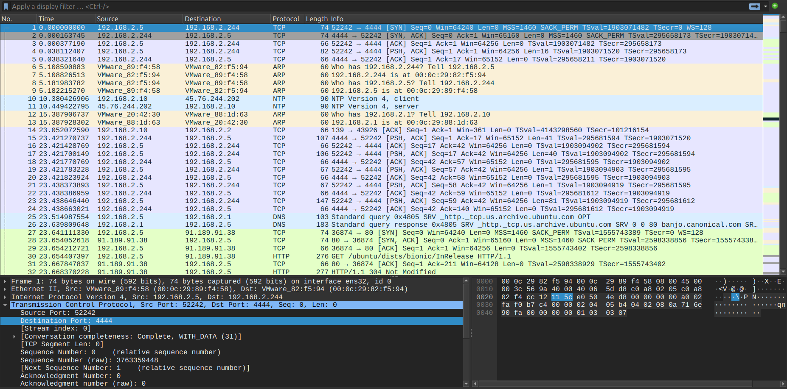

---

### Q11 — What is the port for the second shell?

**Method:** `Follow → TCP Stream` on the primary reverse session connection.

**Investigation:**

By tracking the raw ASCII output of the command traffic executed inside the primary shell session (port 4444), the commands executed by user `jtomato@ns01` were extracted. The log reveals an inline netcat invocation:

```bash
echo "*umR@Q%4V&RC" | sudo -S nc -nvlp 9999 < /etc/passwd
```

A secondary inbound persistence listener was instantiated explicitly binding to port `9999`.

**Answer:**

```
9999
```
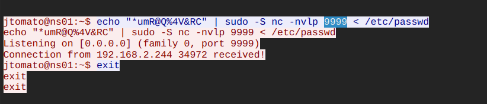

---

### Q12 — What version of netcat is installed?

**Method:** `Follow → TCP Stream` / Interactive terminal output logs.

**Investigation:**

Auditing the captured terminal stream, the threat actor's interaction with the package manager (`apt`) was exposed:

```
echo "*umR@Q%4V&RC" | sudo -S apt install netcat
```

The subsequent repository pull log captured:

```
Get:1 http://us.archive.ubuntu.com/ubuntu bionic/universe amd64 netcat all 1.10-41.1
```

This confirms the exact version compiled and written onto the victim host.

**Answer:**

```
1.10-41.1
```
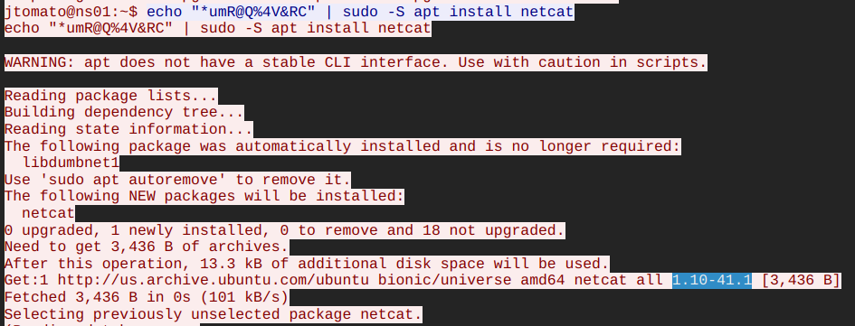

---

### Q13 — What file is added to the second shell?

**Method:** `Follow → TCP Stream` on the primary reverse session connection.

**Investigation:**

In checking the interaction logs inside the primary terminal session, the adversary setup a second listener command:

```bash
echo "*umR@Q%4V&RC" | sudo -S nc -nvlp 9999 < /etc/passwd
```

The structural shell operator `<` redirects file stream input. This confirms that the local path file loaded into the netcat port listener is the systems standard user listing configuration database.

**Answer:**

```
/etc/passwd
```
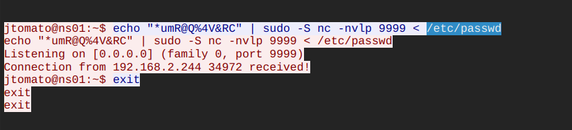

---

### Q14 — What password is used to elevate the shell?

**Method:** `Follow → TCP Stream` / Plaintext Command History Logs.

**Investigation:**

By analyzing the plaintext terminal traffic stream, the adversary's privilege escalation attempts were isolated. The user `jtomato` used the `-S` parameter flag to instruct `sudo` to read the password from standard input:

```bash
echo "*umR@Q%4V&RC" | sudo -S -i
```

The cleartext password string used to authorize administrative context commands is clearly visible in the stream.

**Answer:**

```
*umR@Q%4V&RC
```
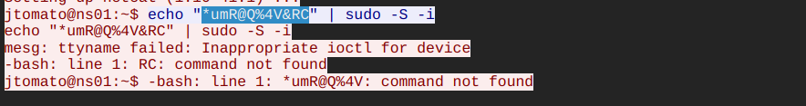

---

### Q15 — What is the codename of the target system's OS version?

**Method:** `Follow → TCP Stream` / APT output logs.

**Investigation:**

Inspecting the captured standard output generated by:

```bash
echo "*umR@Q%4V&RC" | sudo -S apt update
```

When `apt` checks for upstream index changes, it queries repository URIs constructed using the distribution's version code identifier:

```
http://us.archive.ubuntu.com/ubuntu bionic InRelease
```

This maps the platform to Ubuntu 18.04 LTS, confirming the operating system development codename.

**Answer:**

```
bionic
```
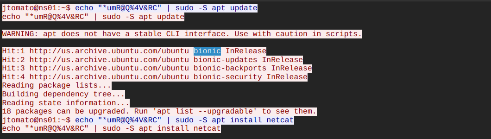

---

### Q16 — How many users are on the target system?

**Method:** `Follow → TCP Stream` / Exfiltrated `/etc/passwd` data.

**External Command:**

```bash
wc -l passwd
```

**Investigation:**

Inspecting the exfiltrated local system database pulled via the secondary connection on port 9999, the complete `/etc/passwd` content was mapped. Each entry inside `/etc/passwd` represents a distinct user account, bounded on its own newline segment. Passing the complete text block dump into a line counting tool returns exactly 31 structural entries.

**Answer:**

```
31
```
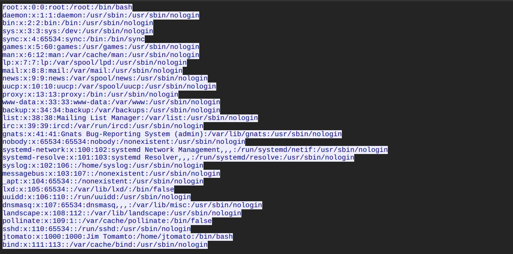

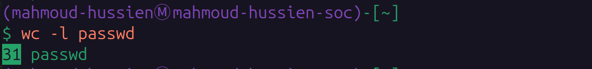

---

## Section 5 — network.pcapng

---

### Q17 — What is the IPv6 NTP server IP?

**Wireshark Filter:**

```
ntp
```

**Investigation:**

By applying the `ntp` protocol filter, Network Time Protocol synchronization packets were mapped. Frame 2919 contains an NTP Version 4 server response transmitted over IPv6. Inspecting the network encapsulation fields identifies the authoritative source device routing address:

```
IPv6 → Source: 2003:51:6012:110::dcf7:123
```

**Answer:**

```
2003:51:6012:110::dcf7:123
```
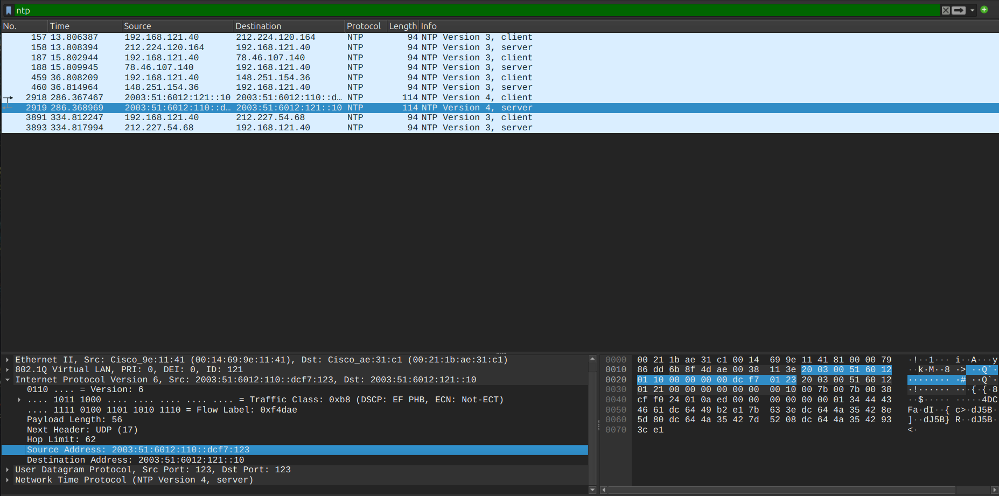

---

### Q18 — What is the first IP address requested by the DHCP client?

**Wireshark Filter:**

```
dhcp
```

**Investigation:**

Frame 1 captures an outbound broadcast `DHCP Request` message (Transaction ID: `0x3d02633d`). Drilling into:

```
Bootstrap Protocol → Option 50: Requested IP Address
```

Confirms the first network address requested for assignment.

**Answer:**

```
192.168.20.11
```
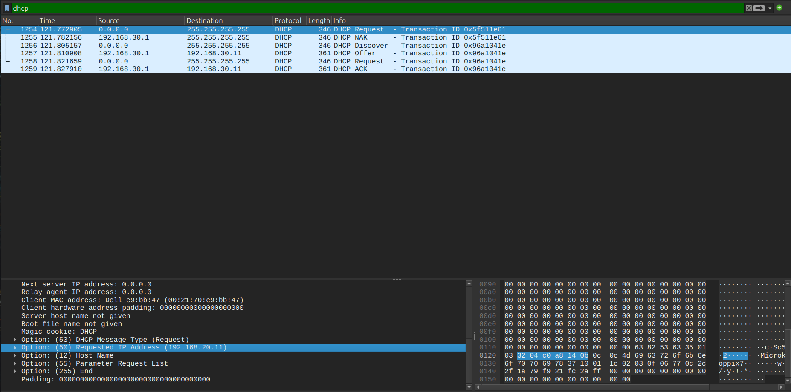

---

### Q19 — What is the first authoritative name server returned?

**Wireshark Filter:**

```
dns.flags.response == 1
```

**Investigation:**

Frame 11 maps an ongoing referral traversal path. Dropping into the packet details panel and expanding the Authoritative Nameservers metadata block, the very first index entry explicitly returns a Type `NS` record pointing to:

```
Authoritative Nameservers → NS Record → ns1.hans.hosteurope.de
```

**Answer:**

```
ns1.hans.hosteurope.de
```
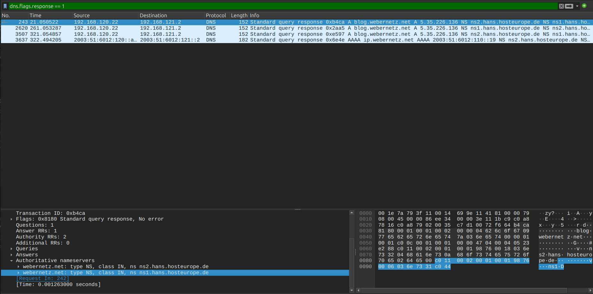

---

### Q20 — What is the number of the first VLAN to have a topology change occur?

**Wireshark Filter:**

```
stp.flags.tc == 1
```

**Investigation:**

Applying the `stp.flags.tc == 1` filter isolates all Bridge Protocol Data Units (BPDUs) signaling a Topology Change. Inspecting the earliest chronological frame (Frame 42) reveals:

```
Spanning Tree Protocol → Originating VLAN (PVID): 20
```

**Answer:**

```
20
```
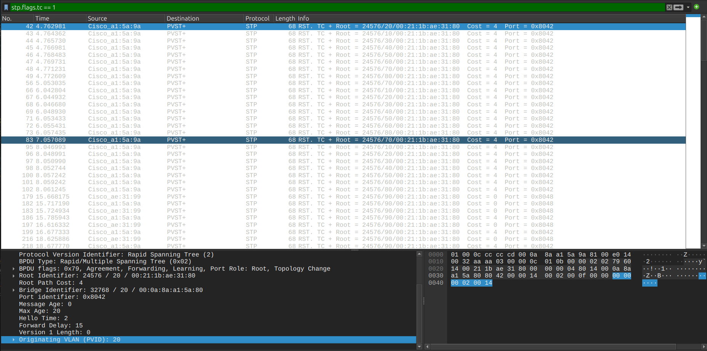

---

### Q21 — What is the port for CDP for CCNP-LAB-S2?

**Wireshark Filter:**

```
cdp
```

**Investigation:**

Filtering for CDP packets and locating the advertisement frames from `CCNP-LAB-S2`. Within the CDP payload structure:

```
Cisco Discovery Protocol → Port ID: GigabitEthernet0/2
```

**Answer:**

```
GigabitEthernet0/2
```
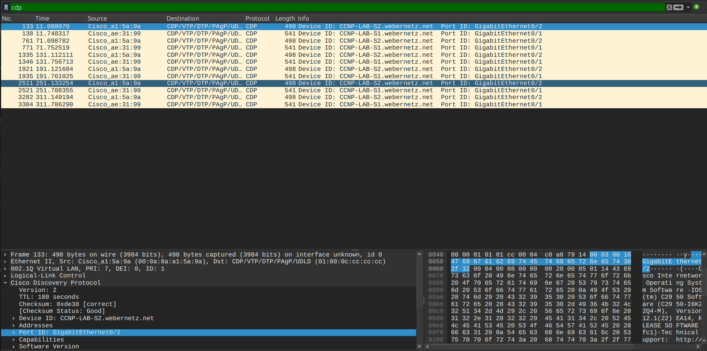

---

### Q22 — What is the MAC address for the root bridge for VLAN 60?

**Wireshark Filter:**

```
stp.root.ext == 60
```

**Investigation:**

Applying the filter isolates BPDUs specific to VLAN 60. Within the BPDU packet structure:

```
Spanning Tree Protocol → Root Bridge Identifier → Root Bridge System ID: 00:21:1b:ae:31:80
```

**Answer:**

```
00:21:1b:ae:31:80
```
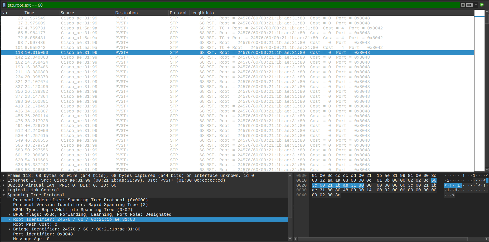

---

### Q23 — What is the IOS version running on CCNP-LAB-S2?

**Wireshark Filter:**

```
cdp
```

**Investigation:**

Examining the CDP advertisement from `CCNP-LAB-S2` and navigating to:

```
Cisco Discovery Protocol → Software version: 12.1(22)EA14
```

**Answer:**

```
12.1(22)EA14
```
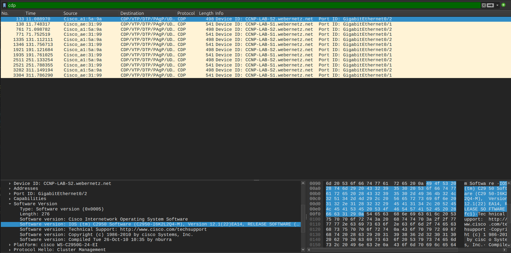

---

### Q24 — What is the virtual IP address used for HSRP group 121?

**Wireshark Filter:**

```
hsrp
```

**Investigation:**

Filtering for HSRP packets and isolating hello protocol transactions associated with Group 121:

```
Cisco Hot Standby Router Protocol → Virtual IP Address: 192.168.121.1
```

**Answer:**

```
192.168.121.1
```
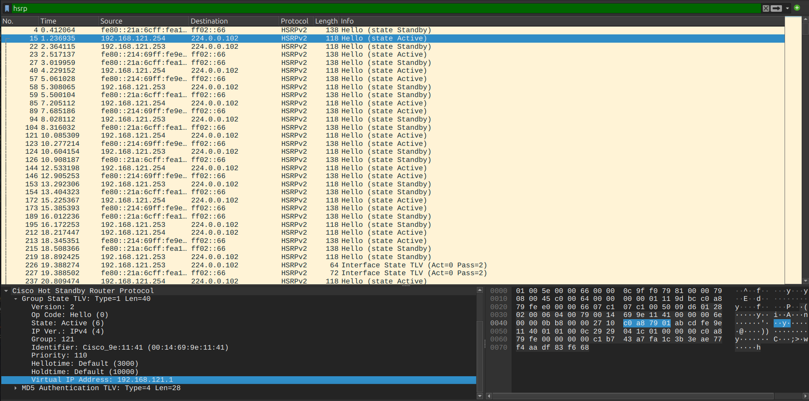

---

### Q25 — How many router solicitations were sent?

**Wireshark Filter:**

```
icmpv6.type == 133
```

**Investigation:**

Applying the ICMPv6 type 133 filter (Router Solicitation) isolates the relevant broadcast traffic frames. Reviewing the packet list pane, exactly 3 distinct frames are returned matching this criteria (Frames 1187, 1220, and 1267), confirming three consecutive solicitation attempts.

**Answer:**

```
3
```
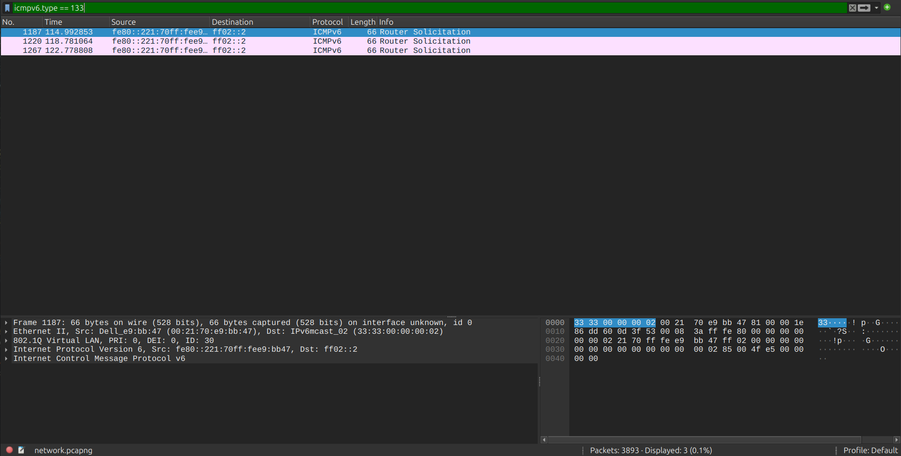

---

### Q26 — What is the management address of CCNP-LAB-S2?

**Wireshark Filter:**

```
cdp
```

**Investigation:**

Locating the CDP advertisement from `CCNP-LAB-S2` and expanding:

```
Cisco Discovery Protocol → Management Addresses: 192.168.121.20
```

**Answer:**

```
192.168.121.20
```
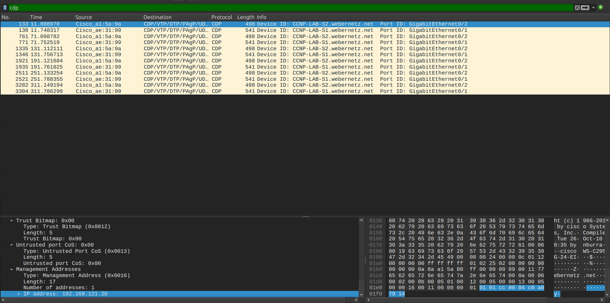

---

### Q27 — What is the interface being reported on in the first SNMP query?

**Wireshark Filter:**

```
snmp
```

**Investigation:**

Filtering for SNMP traffic and isolating the initial `GetRequest` packet. Expanding the Variable Bindings field within the SNMP protocol structure reveals the OID (Object Identifier) associated with the interface description (`ifDescr`), which resolves to the physical interface.

**Answer:**

```
FA0/1
```
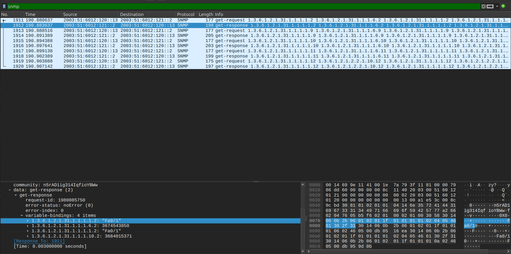

---

### Q28 — When was the NVRAM config last updated?

**Investigation:**

Using `Ctrl + F` to search for the string `nvram` within the management traffic capture, Frame 3770 was identified. Examining the packet data contents reveals the embedded metadata associated with the configuration backup.

**Answer:**

```
2017-03-03 21:02
```
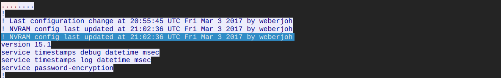

---

### Q29 — What is the IPv6 of the RADIUS server?

**Investigation:**

Examination of the configuration data extracted from the network traffic (specifically within configuration synchronization payloads) confirms the RADIUS server addressing. The configuration snippet explicitly identifies the IPv6 address operating on standard authentication and accounting ports.

**Answer:**

```
2001:DB8::1812
```
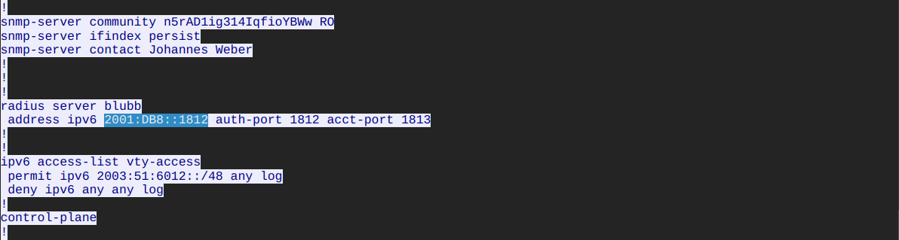

---

## Section 6 — https.pcapng

> **Decryption Setup:**  
> Load `secret_sauce.txt` via:  
> `Edit → Preferences → Protocols → TLS → (Pre-)Master-Secret log filename`

---

### Q30 — What has been added to web interaction with web01.fruitinc.xyz?

**Wireshark Filter:**

```
http contains "fruitinc.xyz"
```

**Investigation:**

Upon analyzing the packet stream associated with `web01.fruitinc.xyz`, payload inspection of the HTTP POST requests was performed. By correlating the content of the `secret_sauce.txt` file with the transmitted form data, the string `y2*Lg4cHe@Ps` was identified as an additional authentication or interaction parameter injected into the web traffic.

**Answer:**

```
y2*Lg4cHe@Ps
```
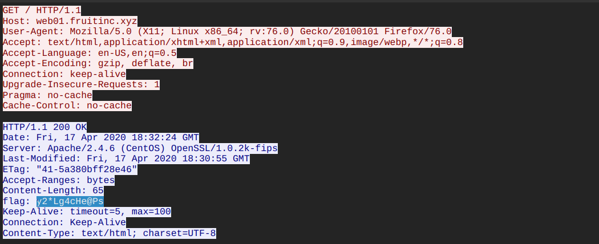

---

### Q31 — What is the name of the photo viewed in Slack?

**Wireshark Filter:**

```
http contains "slack"
```

**Investigation:**

Using the filter with a keyword search for "slack," the HTTP GET request sent to the Slack content delivery network was isolated. Inspecting the `Request URI` field within the HTTP header shows the full path for the image file retrieved during the user's session.

**Answer:**

```
get_a_new_phone_today__720.jpg
```
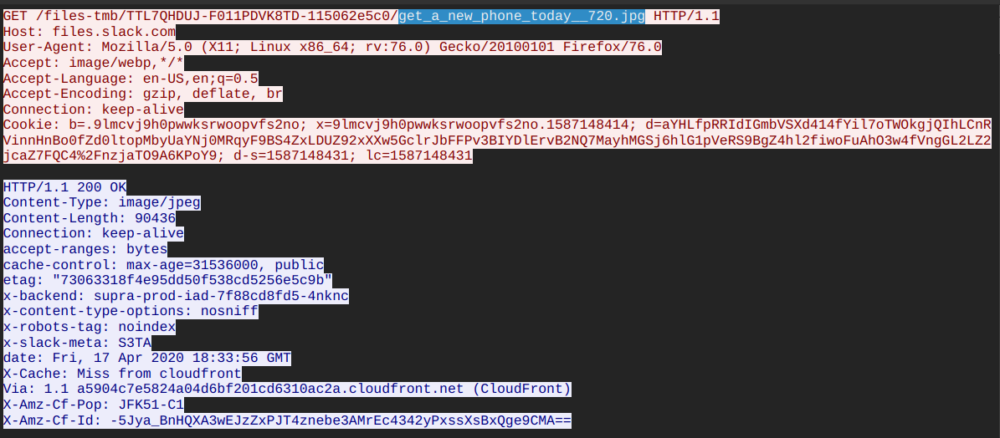

---

### Q32 — What is the username and password to login to 192.168.2.1?

**Wireshark Filter:**

```
http2 && ip.addr == 192.168.2.1
```

**Investigation:**

Applying the HTTP/2 filter to the network capture isolated the management session. Inspection of the HTTP/2 `DATA` frame payload reveals a `POST` request containing the administrative login form. Parsing these credentials from the captured packet data confirms the authentication details.

**Answer:**

```
admin:Ac5R4D9iyqD5bSh
```
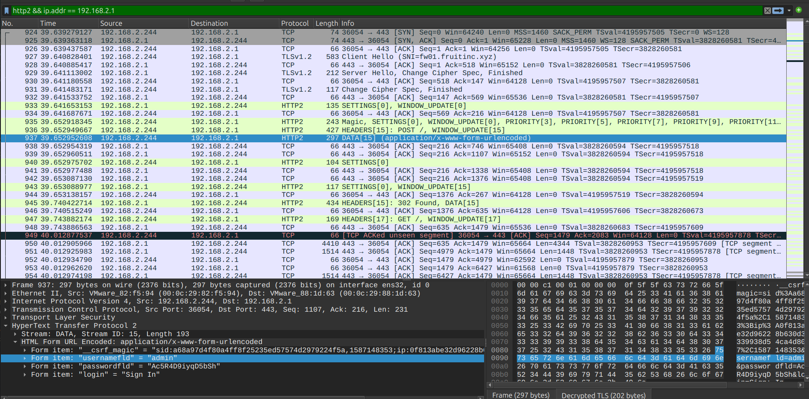

---

### Q33 — What is the certStatus for the certificate with serial 07752cebe5222fcf5c7d2038984c5198?

**Wireshark Filter:**

```
ocsp.serialNumber == 07752cebe5222fcf5c7d2038984c5198
```

**Investigation:**

Applying the specified OCSP serial number filter isolated the corresponding response frame. The OCSP response payload structure explicitly contains the `certStatus` field set to `good` for the target serial number, indicating the certificate is currently valid.

```
OCSP Response → certStatus: good
```

**Answer:**

```
good
```
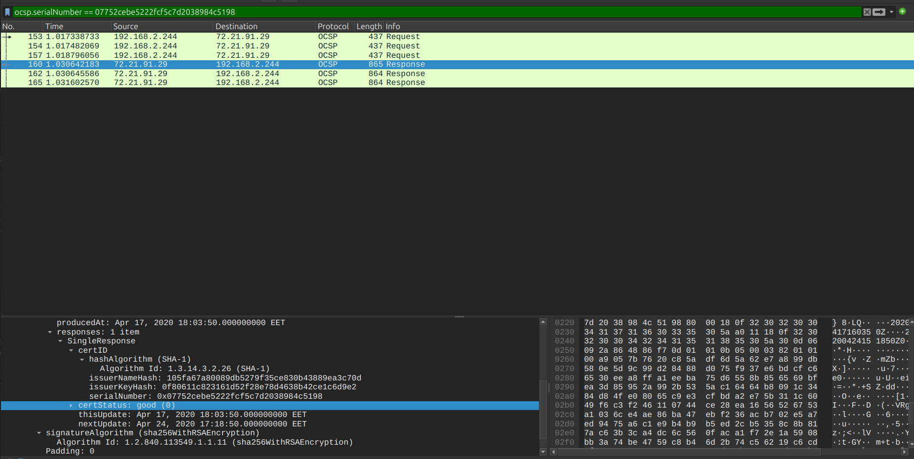

---

### Q34 — What is the email of someone who needs to change their password?

**Investigation:**

Based on analysis of the decrypted HTTP/2 traffic (specifically Stream 39), a login or password reset process was identified. The form-data payload within the stream contained the email address associated with the password change requirement.

**Answer:**

```
jim.tomato@fruitinc.xyz
```
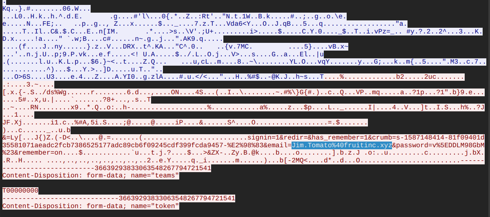

---

### Q35 — What interface and service are assigned?

**Wireshark Filter:**

```
ntp
```

**Investigation:**

Using the `ntp` filter in Wireshark, NTP synchronization packets between devices were identified. Traffic analysis shows communication between IP addresses within the `192.168.2.0/24` range, confirming that the service operates locally for LAN-connected devices. The NTP service is assigned to the LAN interface, ensuring time synchronization for all internal hosts.

**Answer:**

```
lan:ntp
```
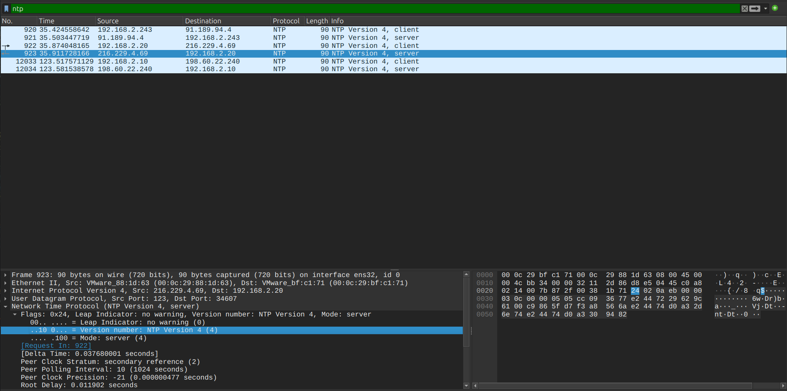

---

## Protocol Coverage Summary

| PCAP File | Protocols | Questions |
|---|---|---|
| `dhcp.pcapng` | DHCP / DORA cycle | 3 |
| `dns.pcapng` | DNS / TXT records / Root servers | 2 |
| `smb.pcapng` | SMB2 / NTLMSSP / File export | 4 |
| `shell.pcapng` | TCP / Netcat / Bash / sudo | 7 |
| `network.pcapng` | NTP, DHCP, DNS, STP, CDP, HSRP, ICMPv6, SNMP, RADIUS | 13 |
| `https.pcapng` | TLS 1.3 / HTTP2 / OCSP / Slack | 6 |

---

## Key Wireshark Filters Reference

```
-- DHCP analysis
dhcp

-- DNS responses only
dns.flags.response == 1

-- SMB2 filenames
smb2.filename

-- SMB2 session setup (authentication)
smb2.cmd == 1

-- SMB2 tree connect
smb2.cmd == 3

-- TCP streams (shell analysis)
tcp

-- NTP traffic
ntp

-- DHCP (network.pcapng)
dhcp

-- DNS responses (network.pcapng)
dns.flags.response == 1

-- STP topology change flag
stp.flags.tc == 1

-- CDP packets
cdp

-- STP root for VLAN 60
stp.root.ext == 60

-- HSRP packets
hsrp

-- ICMPv6 Router Solicitations
icmpv6.type == 133

-- SNMP
snmp

-- HTTPS: fruitinc.xyz web traffic
http contains "fruitinc.xyz"

-- HTTPS: Slack image
http contains "slack"

-- HTTPS: Router admin panel
http2 && ip.addr == 192.168.2.1

-- OCSP certificate status
ocsp.serialNumber == 07752cebe5222fcf5c7d2038984c5198
```

---

## External Commands Reference

```bash
# DNS reverse lookup for root server
nslookup 192.203.230.10
dig -x 192.203.230.10
host 192.203.230.10

# Extract flag from SMB exported file
grep -io "flag<[^>]*>" '%5cHelloWorld%5cTradeSecrets.txt'

# Count users in /etc/passwd
wc -l passwd
```

---

## MITRE ATT&CK Mapping

| Phase | Technique ID | Technique Name | Section |
|---|---|---|---|
| Initial Access | T1078 | Valid Accounts (SMB: jtomato) | smb.pcapng |
| Credential Access | T1552.001 | Unsecured Credentials (shell cleartext password) | shell.pcapng |
| Execution | T1059.004 | Unix Shell (netcat reverse shell) | shell.pcapng |
| Privilege Escalation | T1548.003 | Sudo and Sudo Caching | shell.pcapng |
| Collection | T1005 | Data from Local System (/etc/passwd) | shell.pcapng |
| Credential Access | T1110.001 | Brute Force: Password Guessing (SMB logon failure) | smb.pcapng |
| Lateral Movement | T1021.002 | SMB/Windows Admin Shares | smb.pcapng |
| Command & Control | T1095 | Non-Application Layer Protocol (raw TCP shell) | shell.pcapng |
| Credential Access | T1552.001 | Unsecured Credentials (router admin panel) | https.pcapng |

---

*Writeup produced as part of SOC Analyst training — CyberDefenders: WireDive Lab*