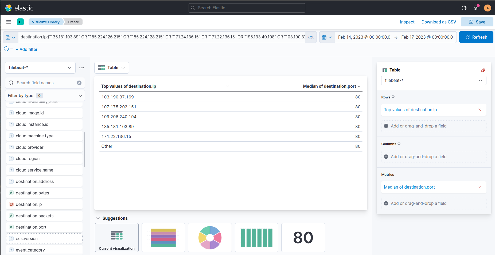
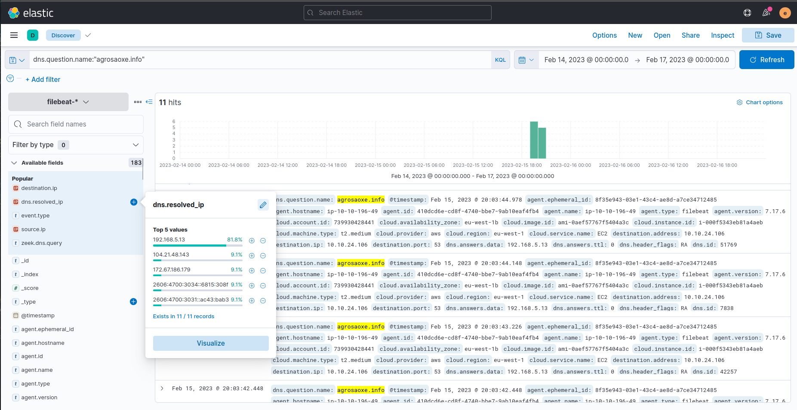
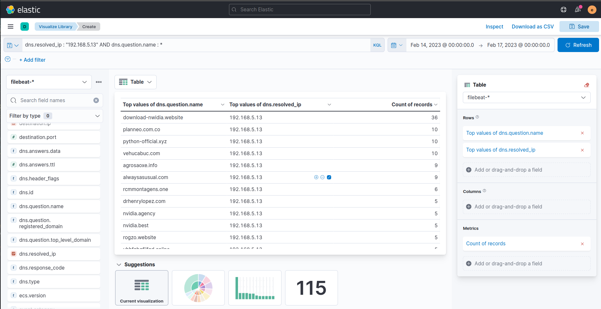
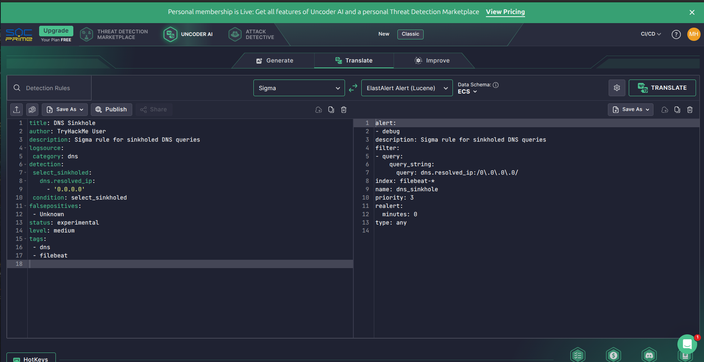
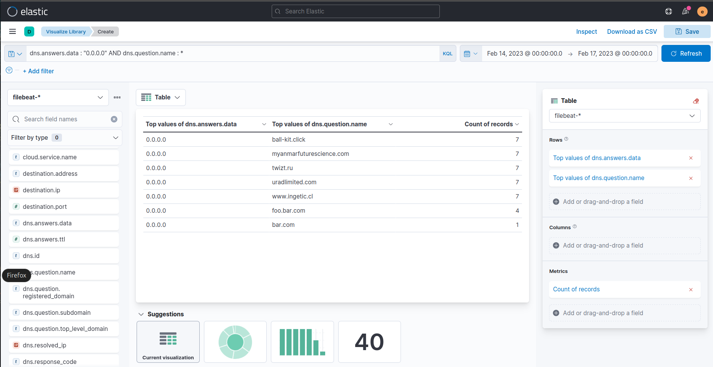

# 🛡️ Threat Intelligence in Security Operations (Comprehensive Report)
---

  
  
  
  
  

### 📝 Executive Summary
This project focused on integrating **Technical Threat Intelligence (IOC-based)** into the Security Operations pipeline. By transitioning from a tactical consumer to an active defender, we successfully deployed prevention controls (DNS Sinkholing) and optimized detection mechanisms using **Sigma** and **ElastAlert** to identify and mitigate malicious communication across the infrastructure.

---

### 🔍 Phase 1: Threat Intel Consumption & SIEM Hunting
* **Methodology:** Processed a list of **11 unique malicious IPs** using **Uncoder.io** to generate SIEM queries for Elastic/Kibana.
* **Kibana Investigation:** * **Total Hits:** Discovered **48 hits** in the logs between 02/14/2023 and 02/17/2023.
    * **Compromised Host:** Identified **10.10.19.36** as the internal victim.
    * **Target IPs:** Detected critical connections to **107.175.202.151** (Port 80) and **185.224.128.215** (21 connections).

---

### 🛡️ Phase 2: Prevention via DNS Sinkhole
* **Mechanism:** Redirected malicious DNS queries to a controlled internal Sinkhole IP (**192.168.100.100**).
* **Impact:** * Successfully sinkholed **2 unique domains**.
    * Captured **45 hits** that would have otherwise established Command & Control (C2) communication.
* **Baseline Comparison:** Before the sinkhole, the domain `agrosaoxe.info` resolved to legitimate-looking Cloudflare IPs (**104.21.48.143** and **172.67.186.179**) to bypass basic filters.

---

### ⚡ Phase 3: Detection Engineering (Sigma & ElastAlert)
* **Rule Conversion:** Transformed generic **Sigma** signatures into executable **ElastAlert** rules (`sinkhole.yaml`) to monitor DNS queries resolving to **0.0.0.0**.
* **Detection Implementation:**
    * **Alert Type:** `debug` (for real-time logging).
    * **Alerting Results:** The automated rule triggered **41 alerts**.
    * **Discovery:** Uncovered **3 unique sinkholed domains** using the 0.0.0.0 configuration, including the suspicious Russian-affiliated domain: `staystay[.]ru`.

---

### 🛠️ Strategic Recommendations & Remediation
1. **Automate IOC Feeds:** Transition from manual list processing to automated Threat Intelligence Platform (TIP) integration for real-time blocking.
2. **Egress Filtering:** Implement strict firewall rules to block outbound connections to non-standard ports identified during the investigation (e.g., 4444).
3. **Continuous Rule Tuning:** Regularly update Sigma rules to account for evolving TTPs (Tactics, Techniques, and Procedures) used by known threat actors.

---

### 🎓 Key Skills Demonstrated
* **Threat Intelligence Lifecycle** (Producers vs Consumers)
* **SIEM Query Optimization** (KQL / Lucene / Filebeat)
* **Detection-as-Code** (Sigma & ElastAlert Integration)
* **Network Defense Tactics** (DNS Sinkholing & IP/Domain Blocking)