# Linux Logging for SOC

  
  

### 🎯 Scenario
In this lab, I acted as a SOC Analyst investigating system activities on a Linux machine by analyzing multiple log sources to identify suspicious behavior and security-relevant events.

---

### 🛠️ Investigation Focus

* Identifying critical Linux log sources and their security value  
* Analyzing authentication attempts and user activity  
* Monitoring system-level events and process execution  
* Leveraging logging tools for deeper visibility  

---

### 🔍 Key Findings

* Authentication logs revealed multiple login attempts and user activity patterns  
* System logs provided insights into background services and potential anomalies  
* Command-line tools enabled efficient filtering and parsing of large log files  
* auditd demonstrated advanced event tracking for security monitoring  

---

### 🧠 Skills Gained

* Linux Log Analysis (auth.log, syslog, etc.)  
* Command-line investigation (grep, less, cat)  
* Security event identification  
* Understanding logging mechanisms in Linux  

---

### 🚀 SOC Relevance

This lab strengthened my ability to analyze raw Linux logs and extract meaningful security insights, a critical skill for detecting unauthorized access and suspicious activity in real-world SOC environments.

---

# Linux Threat Detection 1

  
  

### 🎯 Scenario
Simulated a real-world attack scenario where an exposed Linux service was targeted. The objective was to identify how the attacker gained initial access and trace their activity within the system.

---

### 🛠️ Investigation Focus

* Analyzing SSH access logs  
* Identifying brute-force or unauthorized login attempts  
* Investigating process execution chains  
* Mapping attacker entry point  

---

### 🔍 Key Findings

* Detected suspicious SSH login attempts indicating potential brute-force attack  
* Identified successful unauthorized access through exposed service  
* Process tree analysis revealed how the attacker executed commands post-compromise  
* Clear indicators of initial access were found within authentication logs  

---

### 🧠 Skills Gained

* SSH Log Analysis  
* Process Tree Investigation  
* Initial Access Detection  
* Threat Hunting Techniques  

---

### 🚀 SOC Relevance

Understanding how attackers gain initial access is crucial in SOC operations. This lab enhanced my ability to detect early-stage attacks and respond before escalation occurs.

---

# Linux Threat Detection 2

  
  

### 🎯 Scenario
Investigated a compromised Linux system where malicious activity was suspected, focusing on attacker behavior post-initial access.

---

### 🛠️ Investigation Focus

* Detecting discovery commands executed by attacker  
* Identifying malicious file downloads or payload execution  
* Analyzing system logs for abnormal activity patterns  

---

### 🔍 Key Findings

* Identified multiple reconnaissance commands used by attacker (whoami, uname, etc.)  
* Evidence of malware delivery and execution was found  
* Indicators suggested a cryptomining attack on the system  
* Logs showed abnormal resource usage patterns consistent with mining activity  

---

### 🧠 Skills Gained

* Detection of attacker discovery techniques  
* Malware activity identification  
* Log-based threat hunting  
* Understanding attacker behavior post-compromise  

---

### 🚀 SOC Relevance

This lab improved my ability to detect mid-stage attack activities, especially reconnaissance and malware execution, which are key indicators of a compromised system.

---

# Linux Threat Detection 3

  
  

### 🎯 Scenario
Analyzed an advanced attack scenario involving reverse shell access, privilege escalation, and persistence techniques on a Linux system.

---

### 🛠️ Investigation Focus

* Detecting reverse shell connections  
* Identifying privilege escalation techniques  
* Investigating persistence mechanisms  
* Correlating logs to reconstruct attacker activity  

---

### 🔍 Key Findings

* Reverse shell activity was identified through unusual outbound connections  
* Evidence of privilege escalation attempts leading to root access  
* Persistence mechanisms were established to maintain attacker access  
* Multiple log sources confirmed attacker control over the system  

---

### 🧠 Skills Gained

* Reverse Shell Detection  
* Privilege Escalation Analysis  
* Persistence Identification  
* Advanced Log Correlation  

---

### 🚀 SOC Relevance

This lab provided hands-on experience with advanced attack techniques, enabling me to detect and respond to high-impact threats in Linux environments.

---

# 🛡️ Linux Incident Surface: Attack & Defense Perspective
---

  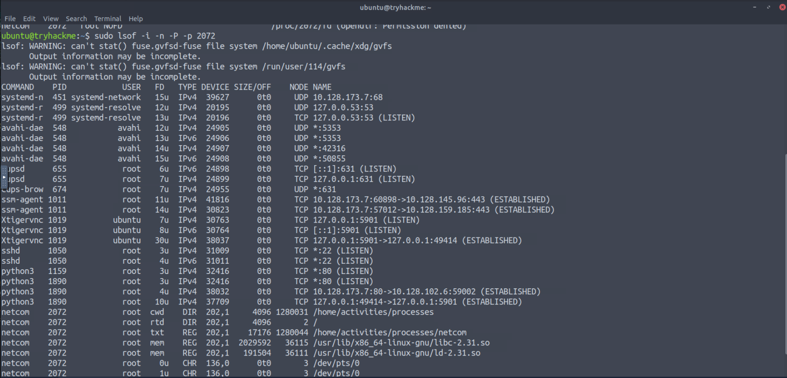
  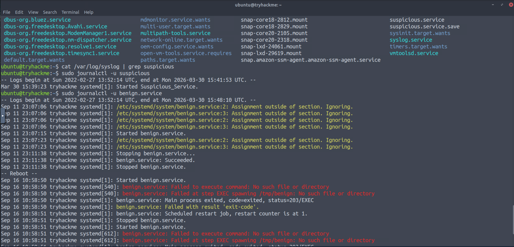
  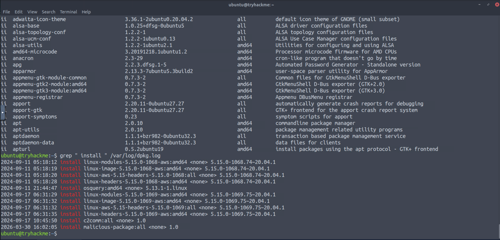

### 📝 Executive Summary
This investigation explored the critical intersection between the **Linux Attack Surface** (entry points) and the **Linux Incident Surface** (post-compromise footprints). By simulating attacker activities (Red Teaming) and performing defensive analysis (Blue Teaming), we identified how malicious actions translate into detectable system artifacts.

---

### 🔍 Key Incident Surface Areas Analyzed

#### 1. Running Processes & Network Communication
* **Findings:** Identified the `netcom` process establishing an unauthorized outbound connection to **10.10.160.231** on port **4444**.
* **Tools Used:** `ps aux`, `lsof -i -P -n`, and `osquery`.
* **Indicator:** A process running from a temporary directory (`/tmp`) or with an unexpected remote IP is a high-priority incident marker.

#### 2. Persistence Mechanisms (Maintaining a Foothold)
* **Account Creation:** Detected the creation of a backdoor user named `attacker` added to the `sudo` group.
* **Scheduled Tasks (Cron):** Investigated how attackers use `@reboot` or per-minute intervals to maintain access via `/var/spool/cron/crontabs/`.
* **Malicious Services:** Identified `suspicious.service` pointing to a binary in `/home/activities/processes/`, configured to start automatically on boot.

#### 3. Disk & Package Integrity
* **Sensitive Files Audited:** `/etc/passwd`, `/etc/shadow`, and `/etc/sudoers` for unauthorized modifications.
* **Malicious Packages:** Simulated the creation of a **Debian (.deb) package** containing a malicious `postinst` script. Detected the installation via `dpkg.log` (3 log entries observed).
* **Finding:** A package named `malicious-package` was installed on **17th Sept 2024**.

#### 4. Log Analysis (The Forensic Goldmine)
* **Authentication Logs:** Analyzed `/var/log/auth.log` to identify failed SSH attempts.
    * **Target User:** `john`
    * **Attacker IP:** `10.10.13.10`
    * **Date:** 11th Sept 2024.
* **System Logs:** Utilized `syslog` and `journalctl -u suspicious` to reconstruct the timeline, showing **9 log entries** before the service was stopped.

---

### 🛠️ Strategic Takeaways & Remediation
* **Surface Reduction:** Minimizing open ports and unused services is the primary defense against the "Attack Surface."
* **Log Integrity:** Centralized logging is essential because attackers often attempt to clear local logs like `auth.log` and `syslog`.
* **File Integrity Monitoring (FIM):** Tools should be used to alert on changes to critical files like `/etc/sudoers`.

---

### 🎓 Key Skills Demonstrated
* **Attack/Defense Alignment**
* **Advanced Log Parsing (Grep, Journalctl)**
* **System Integrity Auditing**
* **Osquery for Live Investigation**

---
# 🧪 Linux File System Analysis & Forensics
---

  
  
  

### 🎯 Scenario
Conducted a forensic investigation on a Linux system to identify attacker activity by analyzing filesystem artifacts and reconstructing the timeline of events.

---

### 🛠️ Investigation Focus

* Analyzing filesystem structure and suspicious files  
* Identifying forensic artifacts (logs, configs, temp files)  
* Correlating system logs with file activity  
* Reconstructing attacker timeline  

---

### 🔍 Key Findings

* Suspicious files and hidden artifacts were identified within the filesystem  
* Log correlation revealed attacker actions and system interaction  
* File metadata helped determine execution timeline  
* Evidence showed clear sequence of attacker activity  

---

### 🧠 Skills Gained

* Filesystem Forensics  
* Artifact Analysis  
* Timeline Reconstruction  
* Incident Investigation  

---

### 🚀 SOC Relevance

This lab strengthened my ability to perform forensic investigations on compromised systems and reconstruct attacker activity, a critical skill for incident response and post-breach analysis.

---

# 🔒 Linux System Hardening
---

  

### 🎯 Scenario
Focused on securing a Linux system after identifying potential threats by applying hardening techniques to reduce the attack surface and prevent future compromises.

---

### 🛠️ Investigation Focus

* Securing system configurations and services  
* Hardening SSH access controls  
* Reducing attack surface by disabling unnecessary services  
* Implementing firewall and security best practices  

---

### 🔍 Key Findings

* Weak configurations were identified and hardened  
* SSH access was secured to prevent unauthorized login  
* Unnecessary services increased attack surface and were disabled  
* Firewall rules significantly improved system protection  

---

### 🧠 Skills Gained

* Linux System Hardening  
* Secure Configuration Management  
* Network Defense  
* Access Control Implementation  

---

### 🚀 SOC Relevance

This lab highlights the importance of proactive defense in SOC operations, ensuring systems are hardened to prevent attacks before they occur.

---

# 🔍 Linux Logs Investigations
---

  
  
  
  

### 🎯 Scenario
Investigated a Linux system showing signs of compromise by analyzing logs, identifying malicious processes, and uncovering persistence mechanisms used by the attacker.

---

### 🛠️ Investigation Focus

* Analyzing multiple log sources (auth.log, syslog, daemon logs, journalctl, Auditd)  
* Detecting suspicious processes and background activity  
* Identifying persistence techniques (cron jobs, services)  
* Correlating evidence across logs  

---

### 🔍 Key Findings

* Suspicious login activity was identified in authentication logs  
* Malicious processes were detected running in the background  
* Persistence mechanisms were found ensuring attacker access  
* Log correlation revealed full attacker behavior and movement  

---

### 🧠 Skills Gained

* Log Analysis & Correlation  
* Threat Hunting  
* Process Investigation  
* Persistence Detection  

---

### 🚀 SOC Relevance

This lab improved my ability to investigate real-world incidents by analyzing logs and detecting attacker techniques, a key responsibility in SOC environments.

---
# 🔍 Linux Live Forensics & Persistence Investigation
---

  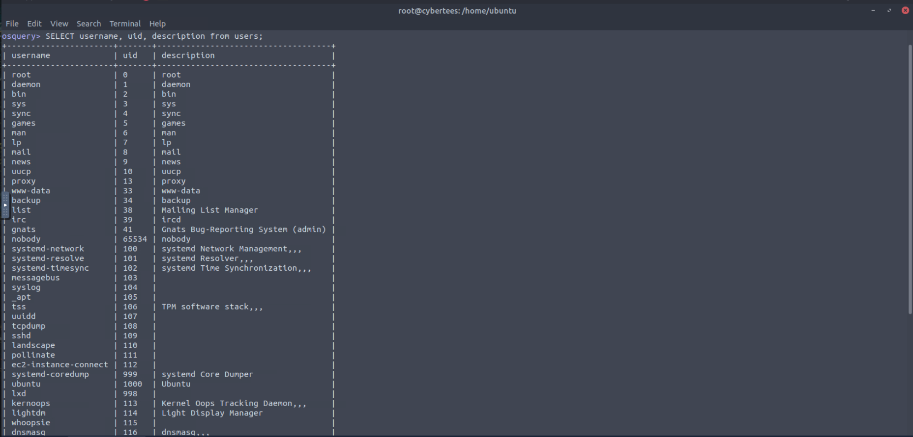
  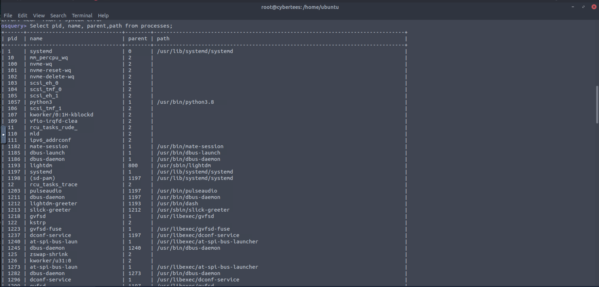
  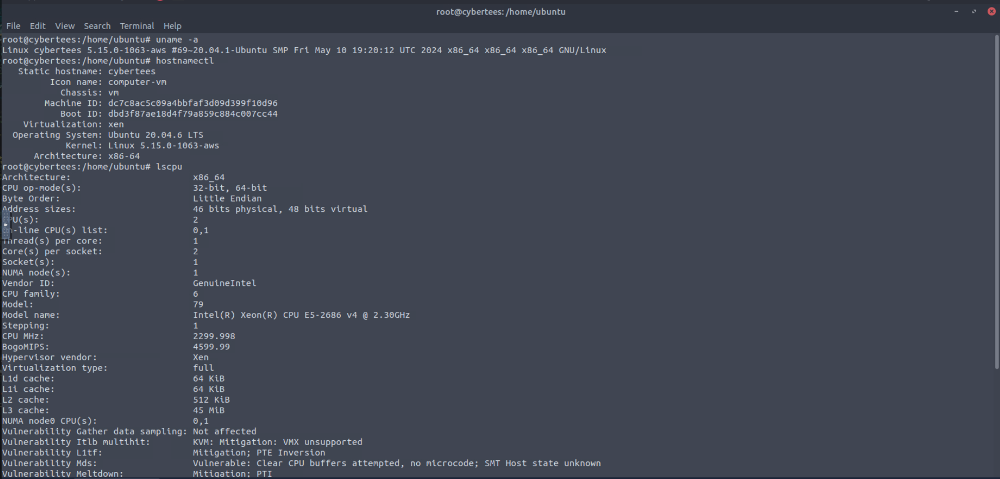
  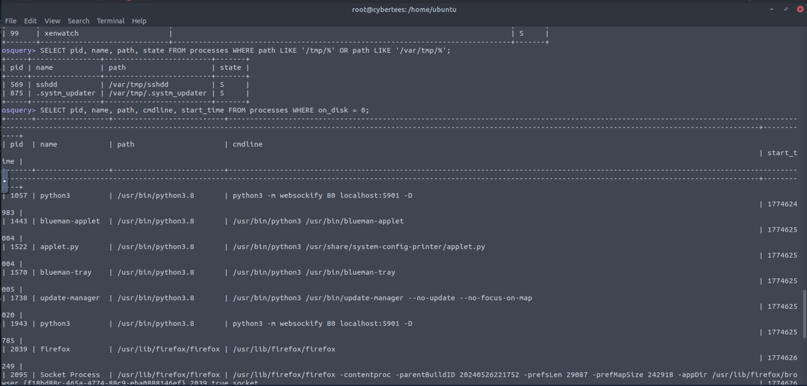
  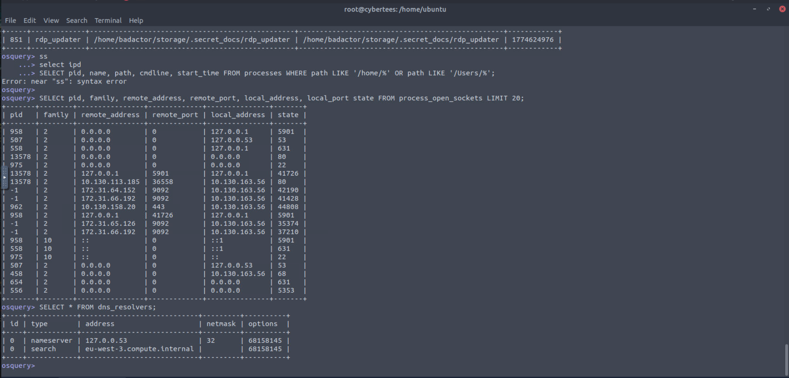

### 🎯 Scenario
Performed a live forensics investigation on a compromised Linux server. The goal was to identify attacker footprints, including malicious processes, network connections, and persistence mechanisms established after a phishing-induced compromise.

---

### 🛠️ Investigation Focus

* System Profiling (Kernel, OS, and hardware details)
* Process Analysis using Osquery (Hunting for fileless and orphan processes)
* Network Connection Monitoring (Identifying C2 communication and listening ports)
* File System Investigation (Detecting hidden files and modified binaries)
* Persistence Detection (Analyzing Systemd services and Cron jobs)

---

### 🔍 Key Findings

* Found a suspicious process (`kworker` masquerade) running from `/tmp/` and `/var/tmp/`.
* Identified a fileless malware execution using the `on_disk = 0` query in Osquery.
* Detected a backdoor account (`badactor`) and an unauthorized SSH-related service.
* Uncovered a persistence mechanism via a Cron job scheduled to run a hidden script `@reboot`.
* Discovered a malicious package (`collector`) containing a hidden secret code in its metadata.

---

### 🧠 Skills Gained

* Live Forensics & Artifact Acquisition
* Osquery SQL-like Threat Hunting
* Network Socket & Port Investigation
* Persistence Mechanism Identification
* Package Management Security Auditing

---

### 🚀 SOC Relevance

This lab simulates a critical SOC task: responding to a Linux breach. Mastering these tools (Osquery, Netstat, Crontab) allows for rapid detection of TTPs, enabling faster containment and remediation of threats in a production environment.

---

# 🛡️ Linux Live Forensics: Process, Service & Task Investigation
---

  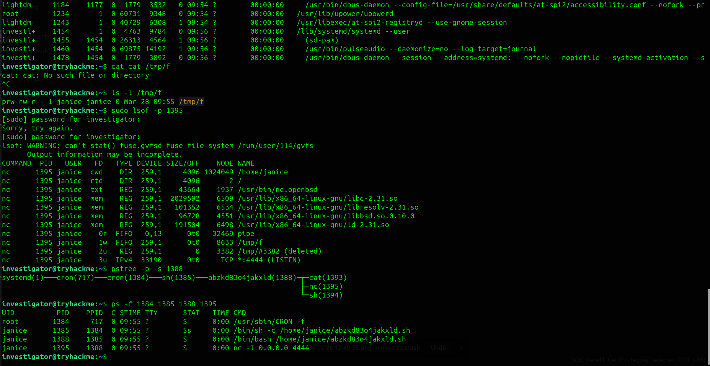
  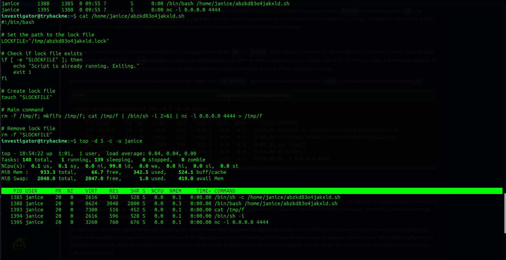
  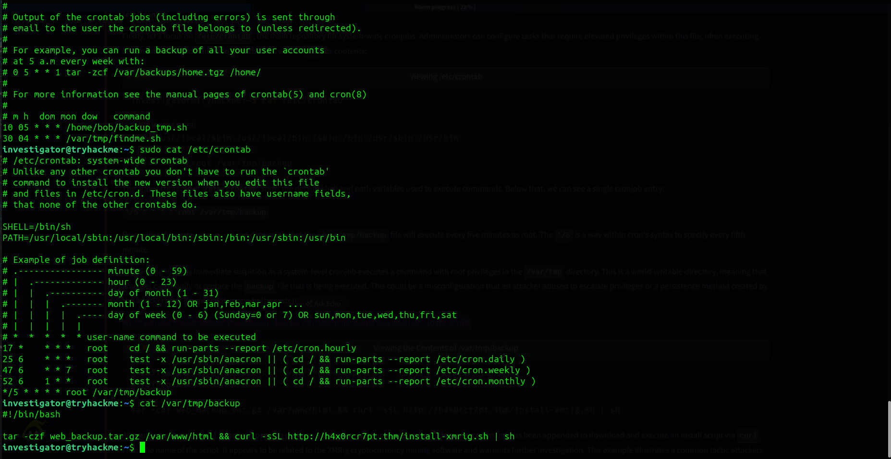
  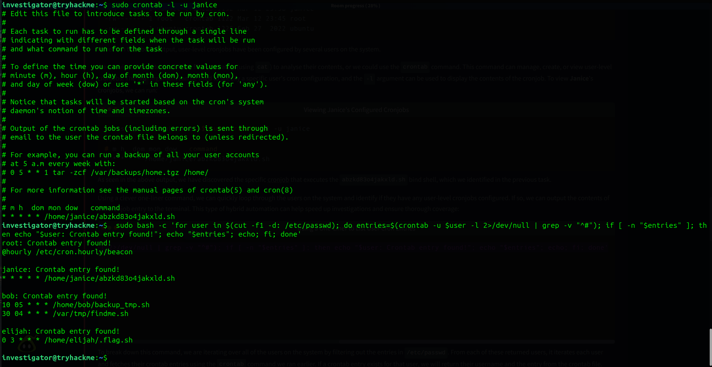
  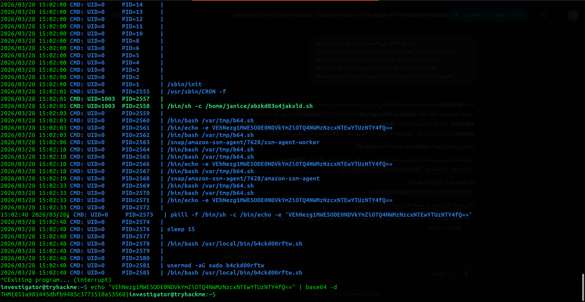
  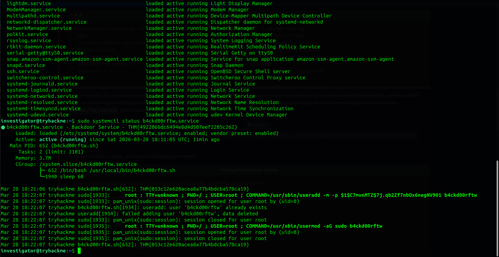
  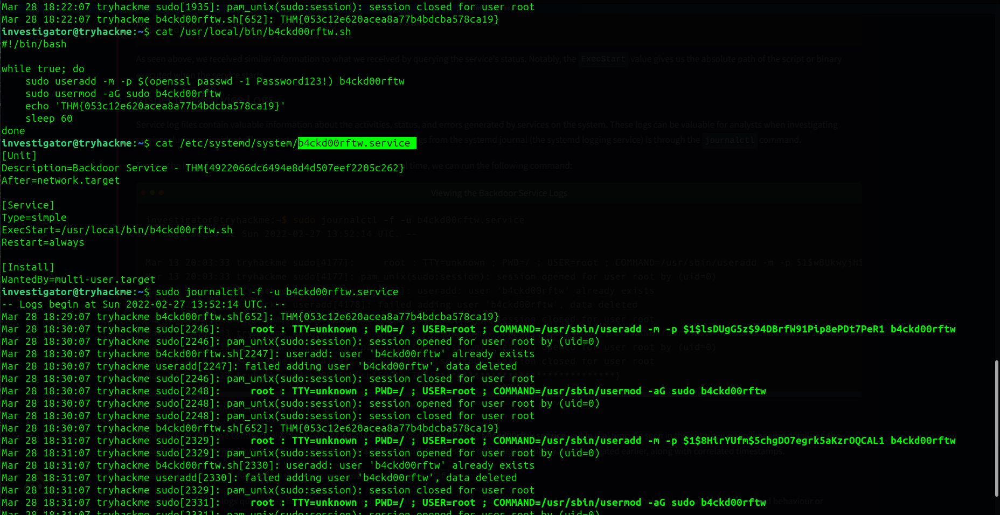
  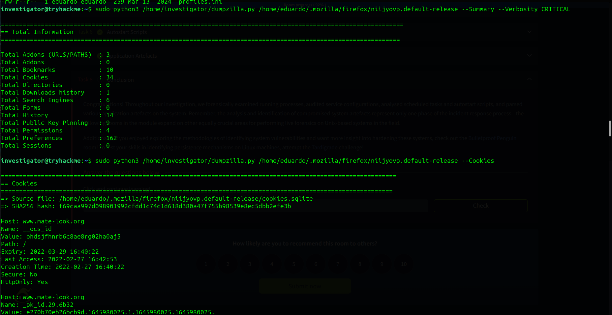

### 📝 Executive Summary
Performed a comprehensive live forensic analysis on a compromised Ubuntu workstation. The investigation focused on identifying unauthorized persistence mechanisms, malicious process hierarchies, and data exfiltration attempts across system services, scheduled tasks, and user-specific application artefacts.

---

### 🔍 Technical Investigation Breakdown

#### 1. Process & Network Analysis
* **Tools Used:** `ps -eFH`, `pstree`, `lsof`, `top`.
* **Findings:** Identified a **Bind Shell** established using **Netcat (nc)** listening on port **4444**.
* **Persistence:** The shell was facilitated through a **Named Pipe** (`/tmp/f`), allowing bidirectional data flow between the attacker and the system's `/bin/sh`.

#### 2. Persistence via Cronjobs & Services
* **System Level:** Discovered a malicious cronjob in `/etc/crontab` running a "backup" script from `/var/tmp/` with **Root** privileges. The script was found to be a **Cryptominer** (XMRig) downloader.
* **User Level:** Identified a hidden persistence script (`abzkd83o4jakxld.sh`) in Janice’s crontab.
* **Service Abuse:** Detected a suspicious systemd service named `b4ckd00rftw.service` that automatically re-creates a sudo-enabled user every 60 seconds.

#### 3. Autostart & Execution Monitoring
* **Autostart Scripts:** Found a `.desktop` file in Janice’s home directory configured to exfiltrate her **Private SSH Key** (`id_rsa`) to an external C2 server via `curl` POST requests.
* **Real-time Monitoring:** Utilized `pspy64` to capture short-lived malicious processes and decoded Base64 flags executed by scheduled tasks.

#### 4. Application & Browser Artefacts
* **Text Editors:** Analyzed `.viminfo` to reconstruct attacker command history and search patterns.
* **Web Forensics:** Used **Dumpzilla** to parse Eduardo’s Firefox profile, uncovering malicious bookmarks and session cookies potentially used for lateral movement.

---

### 🛠️ Remediation & Recommendations
* **Eradication:** Instead of simple file deletion, a full system re-image from a "known-good" backup is recommended due to the complexity of the persistence (Services + Cron + Autostart).
* **Hardening:** Implement **Least Privilege** by restricting access to `/var/tmp/` and monitoring for unauthorized `useradd` executions.
* **Audit:** Regularly audit `/etc/systemd/system/` and user `.config/autostart/` directories for anomalies.

---

### 🎓 Key Skills Demonstrated
* **Live Incident Response (IR)**
* **Linux System Internals (Systemd, Cron, Syslog)**
* **Forensic Tooling (Osquery, Pspy, Dumpzilla)**
* **TTP Identification (MITRE ATT&CK: Persistence, Privilege Escalation)**