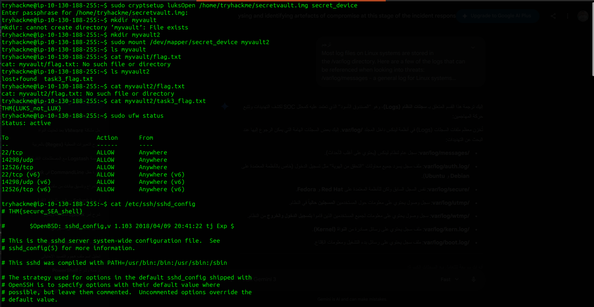

# Linux Logging for SOC

  
  

### 🎯 Scenario
In this lab, I acted as a SOC Analyst investigating system activities on a Linux machine by analyzing multiple log sources to identify suspicious behavior and security-relevant events.

---

### 🛠️ Investigation Focus

* Identifying critical Linux log sources and their security value  
* Analyzing authentication attempts and user activity  
* Monitoring system-level events and process execution  
* Leveraging logging tools for deeper visibility  

---

### 🔍 Key Findings

* Authentication logs revealed multiple login attempts and user activity patterns  
* System logs provided insights into background services and potential anomalies  
* Command-line tools enabled efficient filtering and parsing of large log files  
* auditd demonstrated advanced event tracking for security monitoring  

---

### 🧠 Skills Gained

* Linux Log Analysis (auth.log, syslog, etc.)  
* Command-line investigation (grep, less, cat)  
* Security event identification  
* Understanding logging mechanisms in Linux  

---

### 🚀 SOC Relevance

This lab strengthened my ability to analyze raw Linux logs and extract meaningful security insights, a critical skill for detecting unauthorized access and suspicious activity in real-world SOC environments.

---

# Linux Threat Detection 1

  
  

### 🎯 Scenario
Simulated a real-world attack scenario where an exposed Linux service was targeted. The objective was to identify how the attacker gained initial access and trace their activity within the system.

---

### 🛠️ Investigation Focus

* Analyzing SSH access logs  
* Identifying brute-force or unauthorized login attempts  
* Investigating process execution chains  
* Mapping attacker entry point  

---

### 🔍 Key Findings

* Detected suspicious SSH login attempts indicating potential brute-force attack  
* Identified successful unauthorized access through exposed service  
* Process tree analysis revealed how the attacker executed commands post-compromise  
* Clear indicators of initial access were found within authentication logs  

---

### 🧠 Skills Gained

* SSH Log Analysis  
* Process Tree Investigation  
* Initial Access Detection  
* Threat Hunting Techniques  

---

### 🚀 SOC Relevance

Understanding how attackers gain initial access is crucial in SOC operations. This lab enhanced my ability to detect early-stage attacks and respond before escalation occurs.

---

# Linux Threat Detection 2

  
  

### 🎯 Scenario
Investigated a compromised Linux system where malicious activity was suspected, focusing on attacker behavior post-initial access.

---

### 🛠️ Investigation Focus

* Detecting discovery commands executed by attacker  
* Identifying malicious file downloads or payload execution  
* Analyzing system logs for abnormal activity patterns  

---

### 🔍 Key Findings

* Identified multiple reconnaissance commands used by attacker (whoami, uname, etc.)  
* Evidence of malware delivery and execution was found  
* Indicators suggested a cryptomining attack on the system  
* Logs showed abnormal resource usage patterns consistent with mining activity  

---

### 🧠 Skills Gained

* Detection of attacker discovery techniques  
* Malware activity identification  
* Log-based threat hunting  
* Understanding attacker behavior post-compromise  

---

### 🚀 SOC Relevance

This lab improved my ability to detect mid-stage attack activities, especially reconnaissance and malware execution, which are key indicators of a compromised system.

---

# Linux Threat Detection 3

  
  

### 🎯 Scenario
Analyzed an advanced attack scenario involving reverse shell access, privilege escalation, and persistence techniques on a Linux system.

---

### 🛠️ Investigation Focus

* Detecting reverse shell connections  
* Identifying privilege escalation techniques  
* Investigating persistence mechanisms  
* Correlating logs to reconstruct attacker activity  

---

### 🔍 Key Findings

* Reverse shell activity was identified through unusual outbound connections  
* Evidence of privilege escalation attempts leading to root access  
* Persistence mechanisms were established to maintain attacker access  
* Multiple log sources confirmed attacker control over the system  

---

### 🧠 Skills Gained

* Reverse Shell Detection  
* Privilege Escalation Analysis  
* Persistence Identification  
* Advanced Log Correlation  

---

### 🚀 SOC Relevance

This lab provided hands-on experience with advanced attack techniques, enabling me to detect and respond to high-impact threats in Linux environments.

---

## 🧪 Linux File System Analysis & Forensics

  
  
  

### 🛡️ Technical Takeaways

* Live file system analysis on Linux environments  
* Identification of forensic artifacts (logs, configs, temp files)  
* Log analysis (auth logs, command history, system logs)  
* Timeline reconstruction of attacker activity  
* Incident response simulation on Linux systems  

---

## 🔒 Linux System Hardening

  

### 🛡️ Technical Takeaways

* Filesystem encryption & physical security  
* Firewall configuration and attack surface reduction  
* Secure SSH configuration and remote access control  
* Service and package management (reducing attack surface)  
* System auditing and logging best practices  