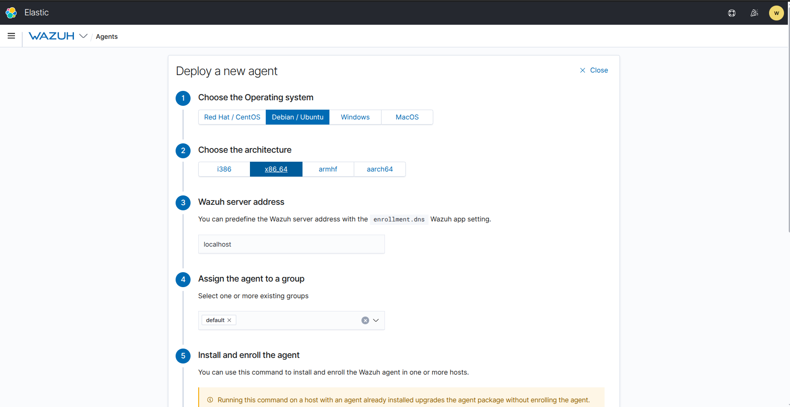
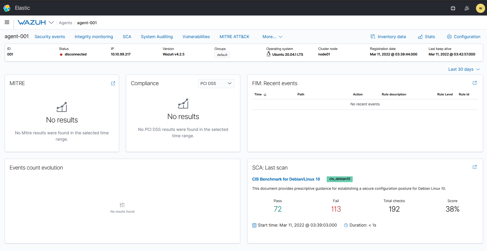
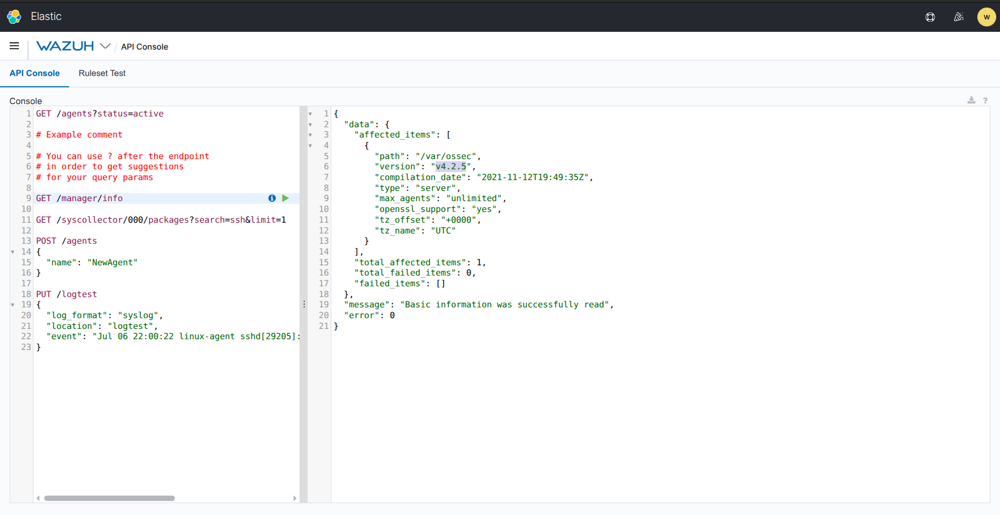

# 🛡️ Wazuh: Security Monitoring & EDR

  
  
  

### 🛡️ أهم ما تم تعلمه (Technical Takeaways):

* **Wazuh Architecture:** فهم هيكلية المنصة المكونة من الـ **Indexer**, **Server**, و **Dashboard** وكيفية إدارتها بشكل متكامل.
* **Agent Deployment:** تعلم كيفية تنصيب الـ **Wazuh Agents** على مختلف أنظمة التشغيل لجمع البيانات ومراقبة الأنشطة.
* **Vulnerability Detection:** استخدام المنصة للكشف عن الثغرات الأمنية الموجودة في البرامج والنظم المثبتة على الأجهزة.
* **File Integrity Monitoring (FIM):** ضبط إعدادات مراقبة سلامة الملفات لكشف أي تعديلات غير مصرح بها على الملفات الحساسة.
* **Threat Response:** استكشاف كيفية تحليل التنبيهات (Alerts) والاستجابة للحوادث الأمنية بناءً على القواعد (Rules) المحددة مسبقاً.

--- 