# 📊 SIEM & SOAR Operations

## 🛠️ Security Information and Event Management (SIEM)
**Description:** Learning how to centralize, search, and analyze logs using industry-standard tools like Splunk and Elastic Stack.

  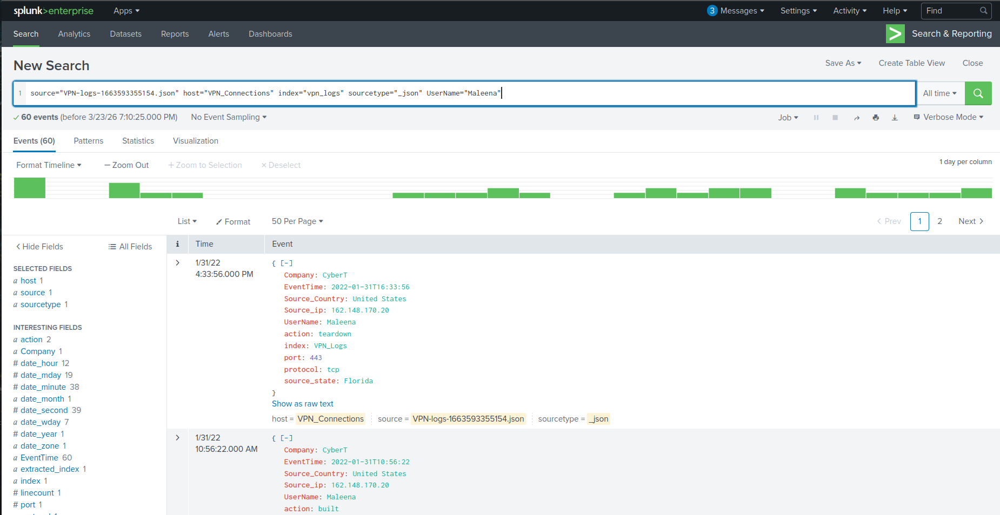
  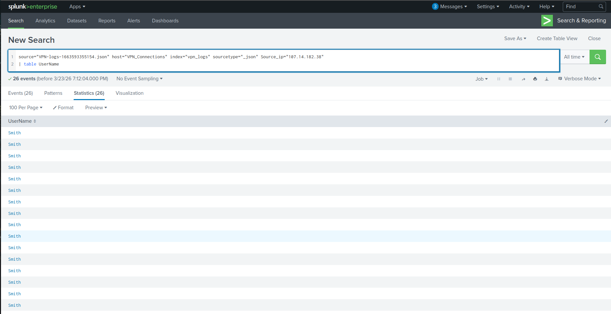

### 🔍 Splunk Proficiency:
* **Architecture:** فهم الـ Indexer, Search Head, والـ Forwarder.
* **Data Ingestion:** تعلم كيفية إضافة البيانات والبحث فيها باستخدام الـ SPL.
* **Log Investigation:** ممارسة التحقيق في السجلات لاكتشاف النشاطات المشبوهة.

---

## 📊 Elastic Stack (ELK)

  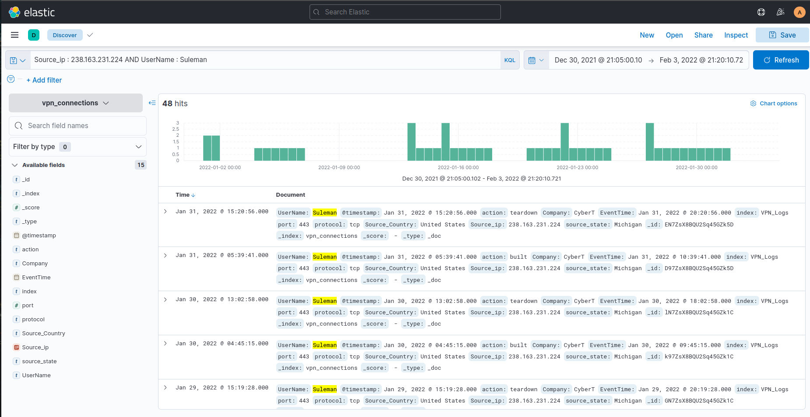
  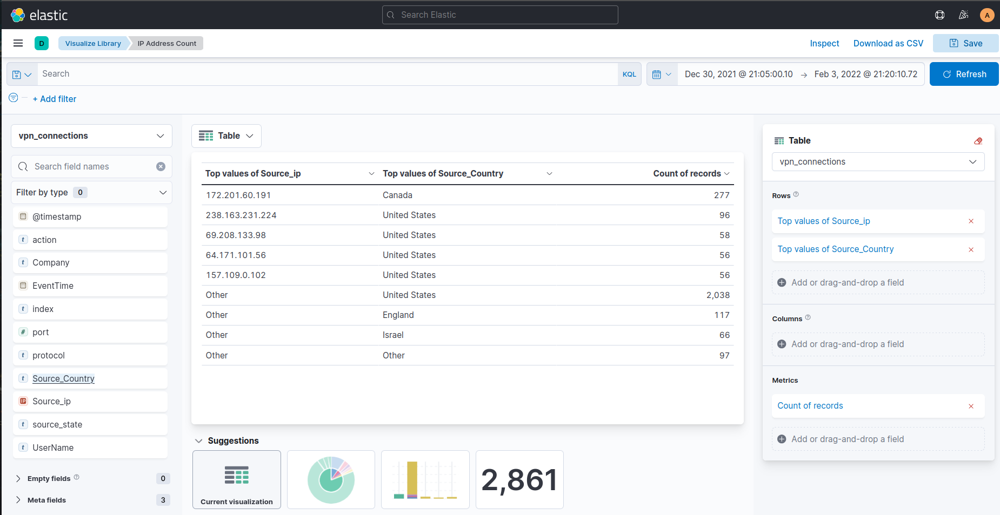

### 🛠️ Elastic Stack Key Learning Outcomes:
* **ELK Architecture:** فهم كيفية عمل Elasticsearch و Logstash و Kibana معاً.
* **KQL Proficiency:** كتابة استعلامات معقدة باستخدام Kibana Query Language.
* **Visualizing Data:** بناء Dashboards لمراقبة التهديدات الأمنية لحظياً.

---

## ⚙️ Security Orchestration, Automation, and Response (SOAR)
**Description:** Learning how to automate repetitive tasks and orchestrate incident response workflows.

  
  

### 🛠️ Key Learning Outcomes:
* **Automation Playbooks:** فهم كيفية بناء الـ Playbooks لأتمتة الرد على التنبيهات.
* **Efficiency Boost:** كيفية تقليل الـ Mean Time to Respond (MTTR).

---

#### 30. Log Analysis with SIEM

  
  

* **ما تم تعلمه (Learning Objectives):**
    * استكشاف مصادر البيانات المتنوعة التي يتم سحبها (**Ingestion**) إلى أنظمة الـ SIEM.
    * فهم أهمية ربط البيانات (**Data Correlation**) لتحويل السجلات المنفصلة إلى قصة هجوم متكاملة.
    * تعلم القيمة التحليلية لسجلات الويندوز، لينكس، الويب، والشبكة أثناء التحقيقات.
    * الممارسة العملية على تحليل السلوكيات الخبيثة واكتشاف الأنماط المشبوهة داخل منصة الـ SIEM.

---

# 📊 Splunk: Exploring SPL

  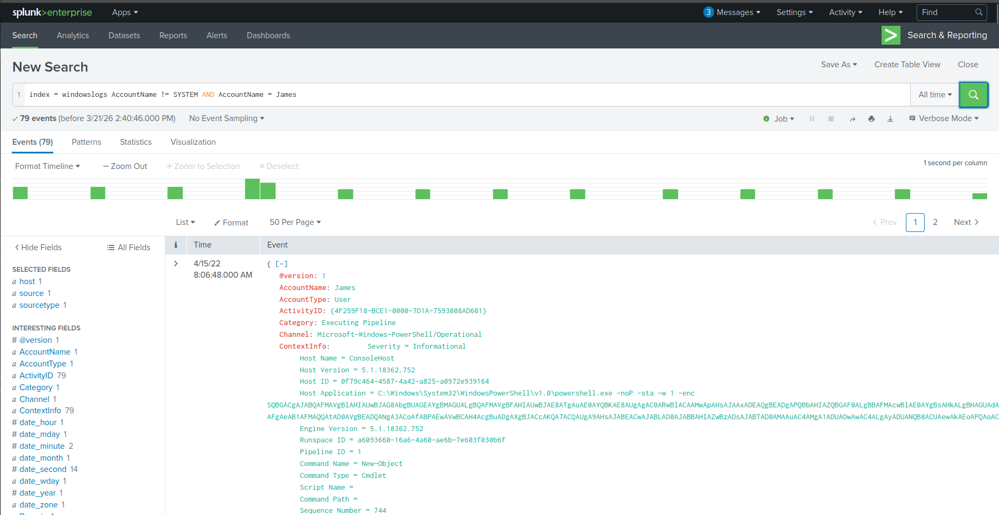
  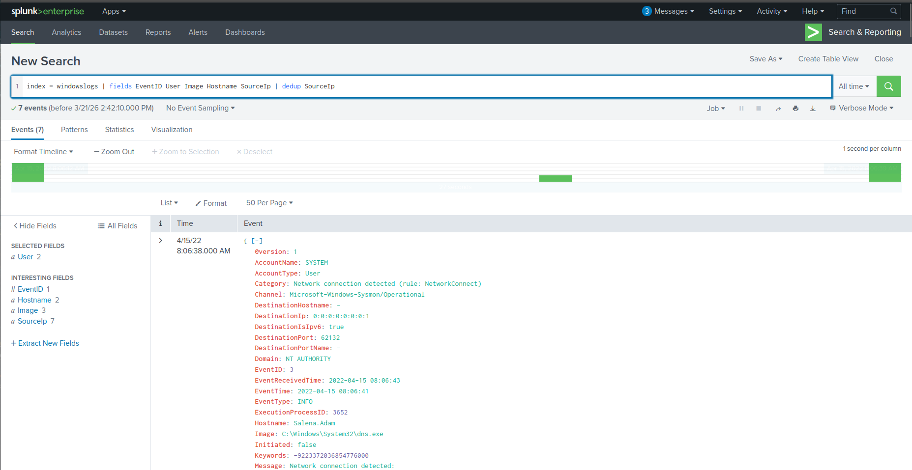
  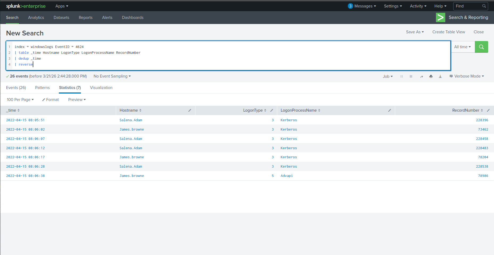
  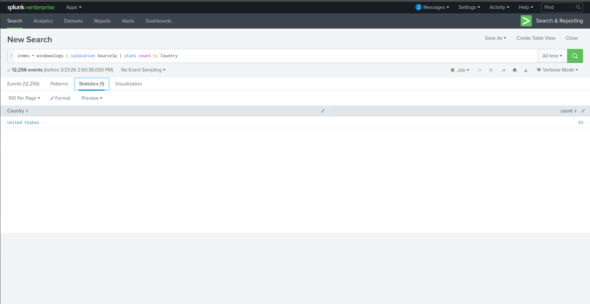

### 🛡️ أهم ما تم تعلمه (Technical Takeaways):

* **Search Processing Language (SPL):** فهم أساسيات لغة البحث الخاصة بـ Splunk وكيفية استخدامها لاستخراج البيانات وتحليلها بفعالية.
* **Advanced Filtering:** احتراف استخدام الفلاتر (Filters) لتضييق نطاق النتائج والتركيز على الأحداث الأمنية الهامة فقط.
* **Transformational Commands:** استخدام الأوامر التحويلية لإعادة هيكلة البيانات وتحويلها إلى تقارير وجداول مفيدة لاتخاذ القرار.
* **Data Organization:** القدرة على تغيير ترتيب النتائج (Sorting) وتنظيمها بشكل يسهل عملية التحقيق الجنائي الرقمي.

---

# 🏗️ Splunk: Setting up a SOC Lab

  
  
  
  

### 🛡️ أهم ما تم تعلمه (Technical Takeaways):

* **Deployment Architecture:** فهم كيفية بناء بيئة SOC مصغرة ومعرفة دور الـ **Splunk Enterprise** كـ Indexer والـ **Universal Forwarder** كأداة لجمع البيانات.
* **Linux Administration:** القدرة على تثبيت وإعداد Splunk والـ Forwarder على أنظمة **Linux** (Ubuntu) وضبط الإعدادات لضمان تدفق البيانات بشكل صحيح.
* **CLI Management:** احتراف إدارة Splunk من خلال **Command Line Interface**، مما يسهل عمليات الأتمتة والتحكم السريع في الخدمة.
* **Log Ingestion:** إعداد المسارات (Inputs) لاستقبال سجلات النظام (Linux Logs) وسجلات الويب (Web Logs) ومعالجتها داخل الـ SIEM.

---

# 📊 Splunk: Dashboards and Reports

  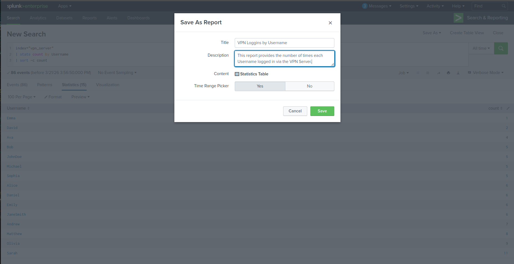
  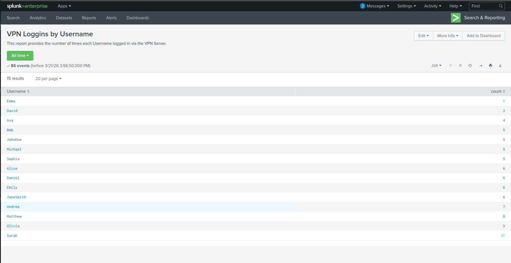
  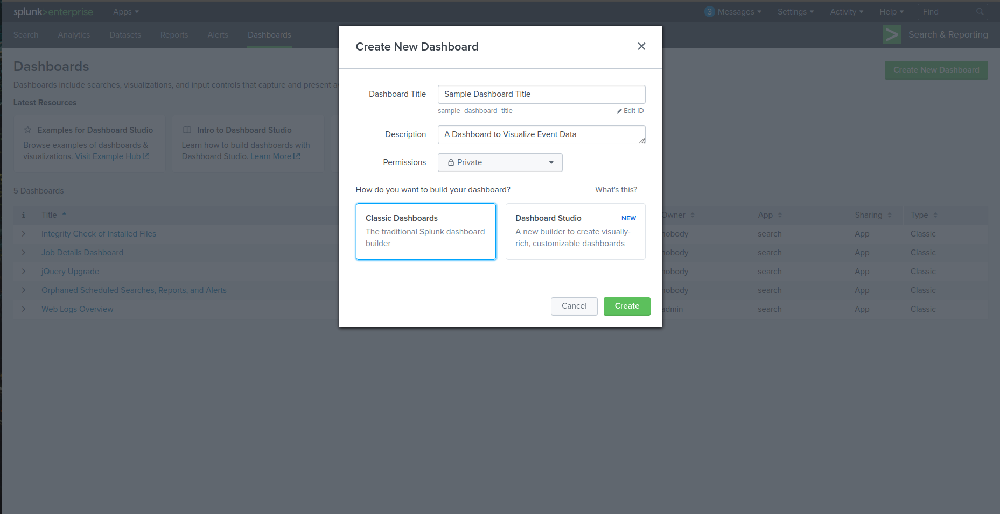
  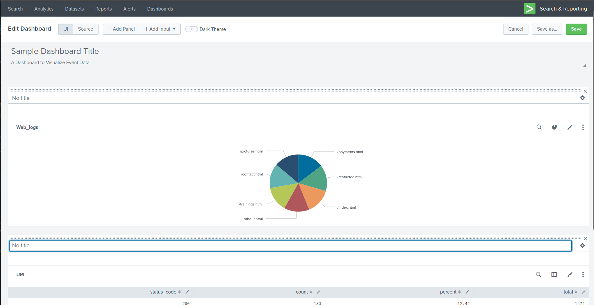

### 🛡️ أهم ما تم تعلمه (Technical Takeaways):

* **Data Organization:** فهم الأهمية القصوى لتنظيم البيانات داخل Splunk لتمكين المحللين من الوصول للمعلومات بسرعة ودقة أثناء التحقيقات.
* **Report Generation:** القدرة على إنشاء تقارير (Reports) لعمليات البحث المتكررة، مما يوفر الوقت ويساعد في مراقبة نشاط الأنظمة بشكل دوري.
* **Alerting & Rule Building:** احتراف بناء قواعد التنبيه (Alerts) وتحويل عمليات البحث إلى تنبيهات فورية عند اكتشاف أنشطة مشبوهة.
* **Data Visualization:** بناء لوحات تحكم (Dashboards) تفاعلية لتحويل البيانات المعقدة إلى رسوم بيانية توضح حالة الأمن الرقمي للمؤسسة.
* **SIEM Core Functionality:** استيعاب كامل لكيفية عمل Splunk كمنظومة **SIEM** متكاملة تجمع بين التحليل، التنبيه، والتوثيق.

---

# 🚂 Elastic: Using Logstash

  
  

### 🛡️ أهم ما تم تعلمه (Technical Takeaways):

* **Logstash Architecture:** فهم دور Logstash كمحرك لجمع البيانات ومعالجتها (Data Processing Pipeline) قبل إرسالها للتخزين.
* **Input, Filter, & Output Plugins:** احتراف التعامل مع المكونات الثلاثة الأساسية:
    * **Input:** كيفية استقبال البيانات من مصادر مختلفة.
    * **Filter:** معالجة البيانات وتعديلها أثناء المرور.
    * **Output:** توجيه البيانات المعالجة إلى وجهتها النهائية (مثل Elasticsearch).
* **Grok Parsing:** استخدام الـ **Grok patterns** لتحليل البيانات غير المنظمة (Unstructured Data) وتحويلها إلى حقول منظمة (Normalized Fields) يسهل تحليلها أمنياً.
* **Real-world Application:** تطبيق عملي لاستقبال وسحب سجلات المصادقة الخاصة بنظام لينكس (**Linux Authentication Logs**) وتنظيفها وإرسالها إلى Elastic Stack.

---

# 🔍 Elastic: Query Languages (KQL & Lucene)

  
  
  
  
  
  

### 🛡️ أهم ما تم تعلمه (Technical Takeaways):

* **Kibana Query Language (KQL):** إتقان استخدام لغة الاستعلام الافتراضية في Kibana لبناء عمليات بحث سريعة وبديهية (Intuitive Searching).
* **Advanced Operators:** احتراف استخدام الـ Operators (مثل `AND`, `OR`, `NOT`) والرموز الخاصة للتحكم الكامل في نتائج البحث وتصفية الضوضاء (Noise Filtering).
* **Nested Data Searching:** القدرة على البحث بدقة داخل البيانات المتداخلة (Nested Data) والهياكل المعقدة للأحداث (Events).
* **Flexible Matching:** استخدام تقنيات الـ Wildcards والـ Fuzzy Matching للوصول إلى البيانات حتى في حالة وجود تغييرات طفيفة في المصطلحات أو الأخطاء الإملائية في السجلات.
* **Pattern-based Discovery:** تطبيق أنماط البحث (Pattern-based searches) للكشف عن الأنشطة المترابطة وتتبع سلوك المهاجمين عبر سجلات النظام المختلفة.

---