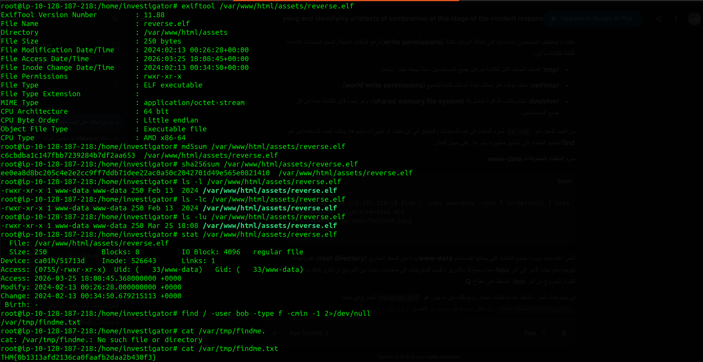
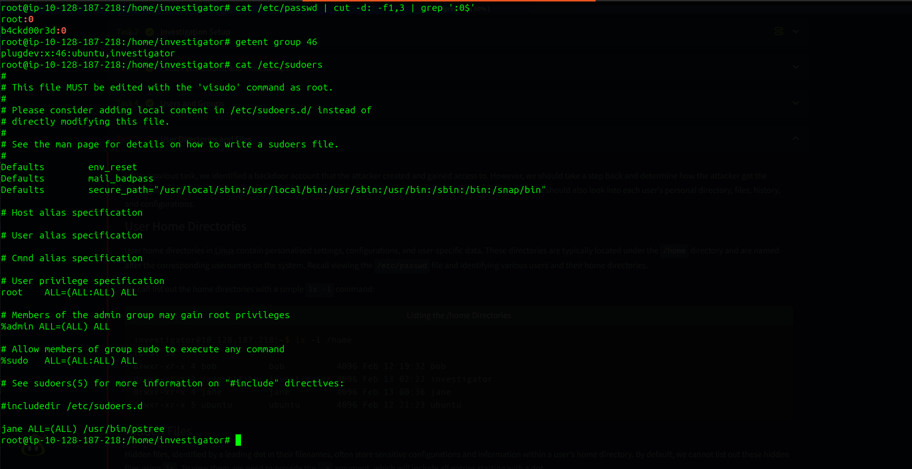
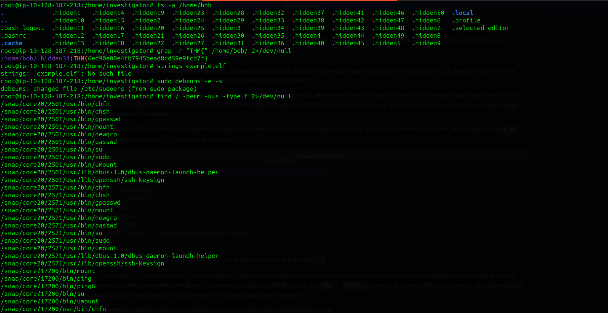

## 🐧 Linux Logging & Defensive Analysis

  
  

### 🛡️ Technical Key Takeaways:

* **Log-Based Threat Mitigation:** Developed a deep understanding of logs as a critical historical record, essential for identifying, tracing, and mitigating potential security threats.
* **Logging Architecture & Mechanisms:** Explored diverse logging frameworks, collection methods, and mechanisms across multiple Linux distributions and platforms.
* **Adversarial Detection & Analysis:** Gained hands-on experience in log analysis to detect suspicious patterns, enabling the effective identification and neutralization of adversaries within the environment.

---

# 🐧 Linux File System Analysis & Forensics

  
  
  

### 🛡️ أهم ما تم تعلمه (Technical Takeaways):

* **Live File System Analysis:** إتقان مهارات فحص أنظمة الملفات الحية على بيئة لينكس لاكتشاف التغييرات والملفات المشبوهة فور حدوثها.
* **Linux Forensics Artifacts:** فهم وتحليل الأدلة الرقمية (Artifacts) الأساسية مثل سجلات النظام (Logs)، ملفات الإعدادات، والملفات المؤقتة التي يتركها المهاجم.
* **Log Mechanisms:** استيعاب كيفية عمل آليات التسجيل في لينكس والقدرة على استخراج أدلة قوية من سجلات المصادقة، الأوامر المنفذة، وتفاعلات النظام.
* **Timeline Reconstruction:** إعادة بناء الجدول الزمني للأحداث (Event Timeline) بشكل يدوي وعملي، مما يساعد في فهم كيفية تسلسل الاختراق وتحديد وقت الدخول والخروج.
* **Incident Response Scenario:** تطبيق مهارات الاستجابة للحوادث في سيناريو واقعي لتحليل حركة الملفات وتحديد الثغرات التي تم استغلالها.

---