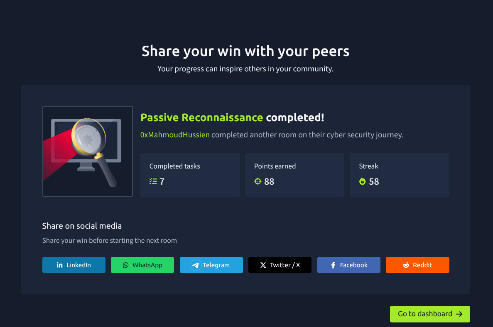
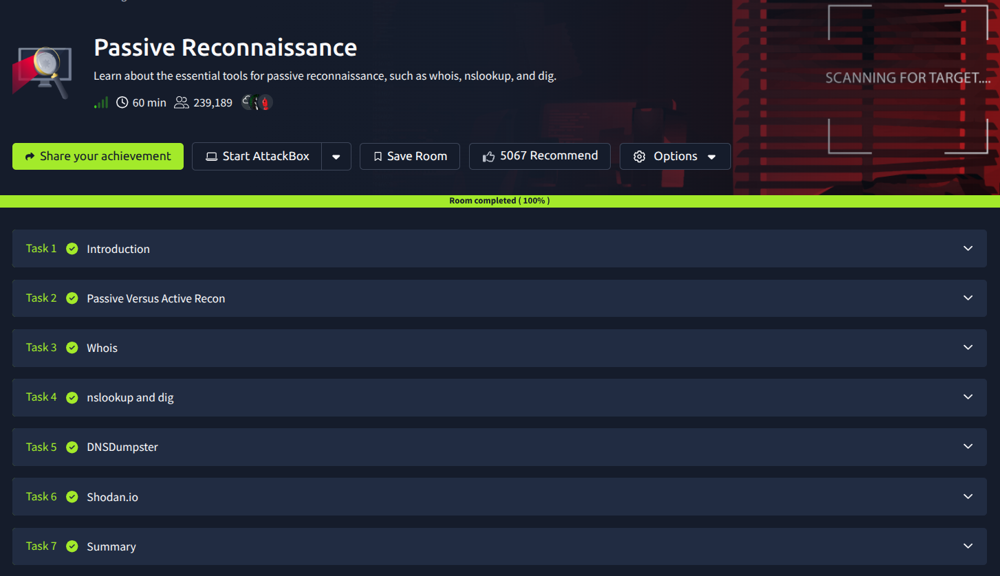
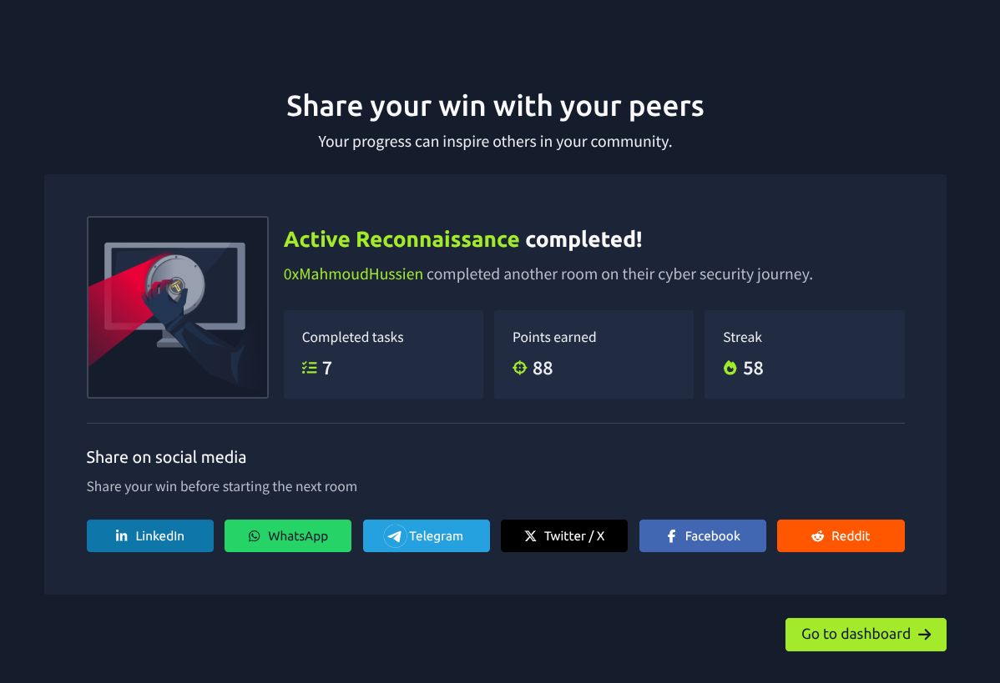
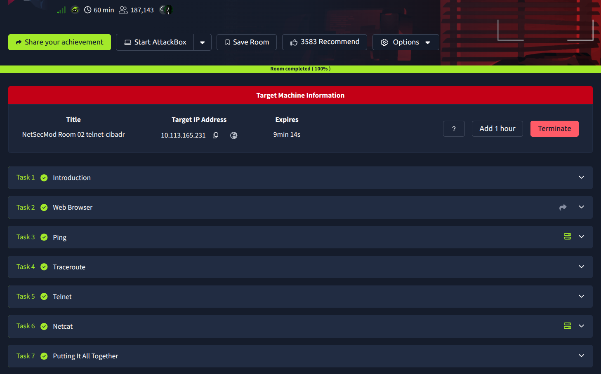
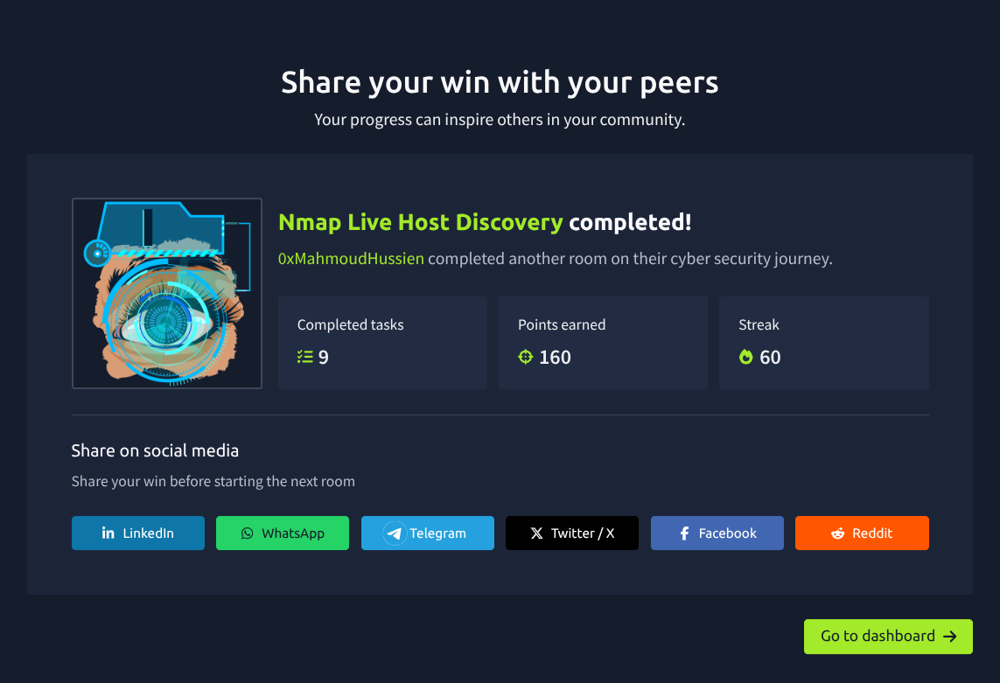
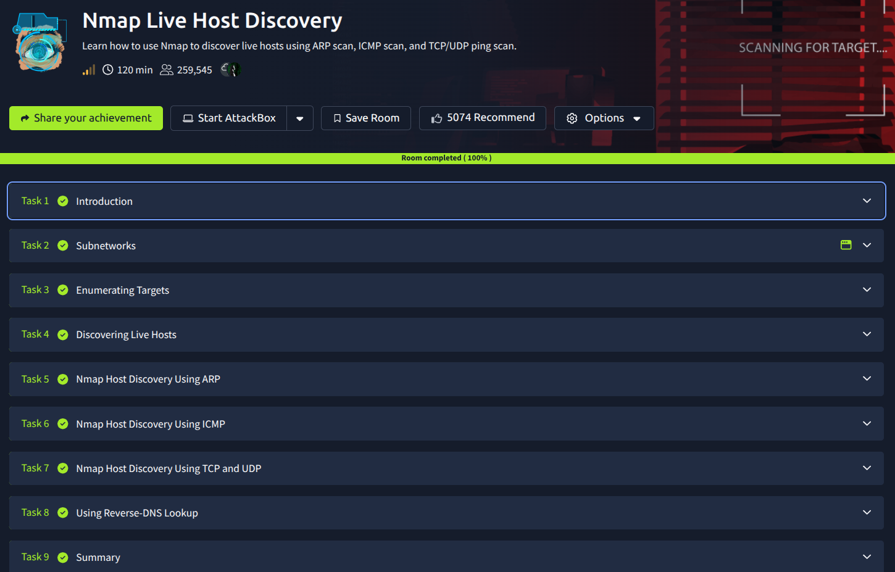

# 🔍 Passive Reconnaissance (OSINT)

  
  

### 🛡️ أهم ما تم تعلمه (Technical Takeaways):

* **Open-Source Intelligence (OSINT):** إتقان فن جمع المعلومات عن الهدف باستخدام المصادر المتاحة علنًا للجمهور دون أي تفاعل مباشر مع أنظمة الهدف.
* **DNS & Whois Enumeration:** استخدام أدوات مثل `whois`, `dig`, و `nslookup` للكشف عن تفاصيل تسجيل النطاقات (Domains)، وعناوين الـ IP، وسجلات الـ DNS المختلفة.
* **Search Engine Hacking:** احتراف استخدام الـ **Google Dorks** وعوامل البحث المتقدمة (Advanced Search Operators) للوصول إلى معلومات حساسة أو نطاقات فرعية (Subdomains) مكشوفة.
* **Specialized Tools:** اكتساب خبرة عملية في استخدام منصات عالمية مثل **Shodan**, **Censys**, و **BuiltWith** لتحديد التقنيات المستخدمة (Fingerprinting) وتحليل البنية التحتية للهدف.

---

# 🎯 Active Reconnaissance

  
  

### 🛡️ أهم ما تم تعلمه (Technical Takeaways):

* **Active Information Gathering:** الانتقال من البحث السطحي إلى التفاعل المباشر مع الأنظمة المستهدفة لجمع معلومات دقيقة حول المنافذ المفتوحة والخدمات النشطة.
* **Network Toolset:** اكتساب خبرة عملية في استخدام الأدوات الأساسية مثل `Ping` للتأكد من اتصال الأجهزة، و `Traceroute` لتتبع مسار البيانات عبر الشبكة.
* **Service Probing:** استخدام بروتوكولات مثل **Telnet** و **Netcat** للتفاعل مع الخدمات واختبار قدرة الوصول إليها بشكل يدوي.
* **Web Browser as a Tool:** فهم كيفية استخدام المتصفح كأداة أولية في عملية الـ Recon لاستكشاف الخدمات المتاحة عبر الويب.

---

#### 38. TShark: The Basics

  
  

* **ما تم تعلمه (Learning Objectives):**
    * تعلم كيفية تصفية وتحليل حركة مرور الشبكة (**Traffic Analysis**) باستخدام أداة سطر الأوامر **TShark**.
    * تطبيق فلاتر الـ **Wireshark** المعروفة داخل بيئة الـ Terminal بكفاءة عالية.
    * التوسع في عمليات تصفية الحزم (Packet Filtering) وأتمتتها (**Automation**) باستخدام الخيارات المتقدمة في TShark.
    * استخراج حقول محددة من الـ Packets وتحويلها إلى تقارير نصية سهلة القراءة والتحليل. 

---

#### 39. TShark: CLI Wireshark Features

  
  

* **ما تم تعلمه (Learning Objectives):**
    * استكشاف واستخدام مهارات Wireshark المتقدمة مباشرة من سطر الأوامر (CLI).
    * استخراج الإحصائيات (Statistics) وتحليل البروتوكولات والـ Endpoints باستخدام خيارات `-z`.
    * تحليل سلاسل البيانات (**Follow Streams**) لاستعادة المحادثات والبيانات المتبادلة في البروتوكولات المختلفة (TCP/UDP/HTTP).
    * إتقان التعامل مع الـ **Time Styles** والتحكم في عرض الحقول بدقة متناهية.
    * دمج الـ TShark في عمليات الـ Automation لتحليل كميات ضخمة من الـ Traffic بسرعة وكفاءة.

---

#### 6. Network Discovery Detection

  
  

* **ما تم تعلمه (Learning Objectives):**
    * فهم ماهية الـ **Network Discovery** ودورها في كشف الأجهزة والخدمات النشطة.
    * التعرف على أسباب قيام المهاجمين بعمليات الاكتشاف (Reconnaissance).
    * التمييز بين أنواع الـ Network Discovery المختلفة (External vs Internal Scanning).
    * فهم آليات عمل تقنيات الاكتشاف (Horizontal vs Vertical Scanning) وكيفية رصدها.

---

# 🔍 Nmap Live Host Discovery

  
  

### 🛡️ أهم ما تم تعلمه (Technical Takeaways):

* **Subnet Enumeration:** فهم كيفية تحديد النطاقات الشبكية واستهدافها بدقة.
* **Discovery Protocols:** احتراف استخدام بروتوكولات Discovery مثل ARP للمحلي، و ICMP و TCP/UDP لتجاوز الحماية.
* **Reverse DNS Lookup:** ربط الـ IP بأسماء الـ Hostnames للحصول على سياق أفضل.
* **Efficiency at Scale:** فحص شبكات ضخمة بسرعة وبأقل استهلاك للموارد.

---

# 🛡️ Nmap Basic Port Scans

  
  

### 🛡️ أهم ما تم تعلمه (Technical Takeaways):

* **TCP Connect Scan (`-sT`):** فهم كيفية إتمام عملية الـ Three-Way Handshake بالكامل للتحقق من المنافذ المفتوحة بشكل موثوق.
* **TCP SYN Scan (`-sS`):** احتراف تقنية الـ "Half-Open" scan لزيادة سرعة الفحص وتقليل احتمالية رصده بواسطة أنظمة الحماية.
* **UDP Scan (`-sU`):** تعلم كيفية فحص الخدمات التي تعتمد على بروتوكول UDP، وهو أمر ضروري لكشف الثغرات في خدمات مثل DNS و DHCP.
* **Port States Awareness:** القدرة على التمييز بين حالات المنافذ المختلفة (Open, Closed, Filtered) وفهم دلالة كل حالة أثناء التحقيق.
* **Service Detection Basics:** البدء في تحديد الخدمات التي تعمل خلف كل منفذ بناءً على استجابة النظام.

---
