#### 31. Alert Triage With Splunk
<p align="center">
  
  
</p>

* **ما تم تعلمه (Learning Objectives):**
    * تعلم الكيفية الصحيحة للتحقيق في التنبيهات (Alerts) داخل بيئة عمل الـ SOC.
    * فهم كيفية تتبع وتحليل هجمات التخمين (**Brute-force Attacks**) على أنظمة لينكس عبر Splunk.
    * اكتشاف آليات البقاء (**Persistence Mechanisms**) التي يزرعها المهاجمون داخل أنظمة ويندوز.
    * تحليل الـ **Web Shells** وكشف الثغرات في خوادم الويب المصابة.
    * الممارسة العملية على التحقيق في 3 سيناريوهات واقعية لمواجهة التهديدات باستخدام منصة **Splunk**.

---

#### 32. Alert Triage With Elastic
<p align="center">
  
  
</p>

* **ما تم تعلمه (Learning Objectives):**
    * استخدام منصة **Kibana** لتحليل سجلات الأمان الشائعة بكفاءة عالية.
    * تعلم كيفية تحديد مؤشرات الاختراق الرئيسية (**Key IOCs**) من خلال البيانات الضخمة.
    * ربط الأحداث (**Event Correlation**) عبر مصادر سجلات متعددة لرسم صورة كاملة للهجوم.
    * كشف تفاصيل الاختراقات الأمنية من خلال تتبع وتحليل سلسلة من تنبيهات الـ SOC.

---

#### 33. ItsyBitsy (SOC Investigation – Network C2 Analysis with Kibana)

---

### 📌 Scenario

During routine SOC monitoring, an IDS alert flagged a potential **C2 (Command & Control) communication** from a host within the HR department (User: Browne).

Due to limited visibility, only **HTTP connection logs** were collected and ingested into Kibana (`index=connection_logs`) for investigation.

---

### 🎯 Investigation Focus

* Identify the infected host
* Detect abuse of legitimate Windows binaries (LOLBins)
* Trace C2 communication and payload retrieval
* Extract malicious content from external source

---

### 🔍 Key Findings

* 📊 Total events analyzed (March 2022):

  ```
  1482
  ```

* 🖥️ Suspected infected host IP:

  ```
  192.166.65.54
  ```

* ⚙️ LOLBin used for file download:

  ```
  bitsadmin
  ```

* 🌐 C2 platform identified:

  ```
  pastebin.com
  ```
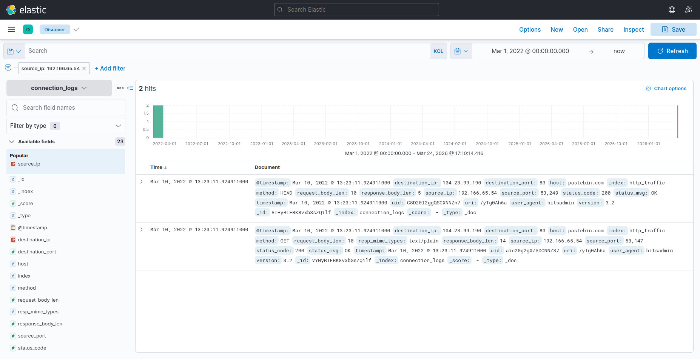

---

### 🚨 Attack Details

* 🔗 Full C2 URL:

  ```
  pastebin.com/yTg0Ah6a
  ```

* 📄 Accessed file:

  ```
  secret.txt
  ```

* 🧬 Extracted malicious pattern:

  ```
  THM{SECRET__CODE}
  ```
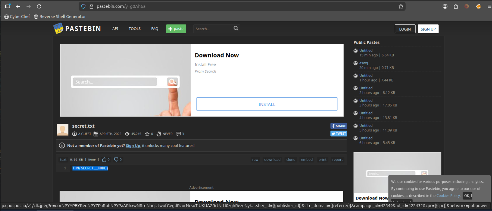

---

### 🧠 Attack Analysis

* The attacker leveraged **bitsadmin** (a legitimate Windows binary) to download malicious content → **LOLBins technique**
* **Pastebin** was used as a C2 server to host payload/data and evade detection
* Communication occurred over **HTTP**, blending with normal traffic
* Limited telemetry (network logs only) required deep log correlation to uncover attacker behavior

---

### 🛠️ Skills Demonstrated

* Network log analysis using **Kibana (KQL)**
* Detection of **C2 communication patterns**
* Identification of **LOLBins abuse (bitsadmin)**
* Threat hunting using limited log sources
* Extraction of Indicators (IP / URL / File / Pattern)

---

### 🏁 Conclusion

The investigation confirmed that the infected host established communication with an external C2 server using a legitimate Windows utility (**bitsadmin**). The attacker utilized a public file-sharing platform (**Pastebin**) to deliver malicious content, demonstrating a common evasion technique.

This scenario highlights the importance of **network-level visibility** and the ability to detect malicious behavior even when endpoint data is unavailable.


---

#### 34. Incident Handling With Splunk
<p align="center">
  
  
</p>

* **ما تم تعلمه (Learning Objectives):**
    * تعلم كيفية الاستفادة من مواقع الاستخبارات المفتوحة المصدر (**OSINT**) لتعزيز عملية التحقيق.
    * ربط ورسم خريطة لأنشطة المهاجم بمراحل سلسلة القتل السيبراني (**Cyber Kill Chain Phases**).
    * إتقان استخدام استعلامات **Splunk** الفعالة للبحث في السجلات (Logs) وتتبع التهديدات.
    * فهم الأهمية التكاملية لمصادر السجلات المرتكزة على المضيف (**Host-centric**) والمرتكزة على الشبكة (**Network-centric**).

---

#### 35. Benign (SOC Investigation – Splunk & LOLBins)

---

### 📌 Scenario

An IDS alert indicated suspicious process execution on a host within the HR department. Due to limited resources, only **Windows process creation logs (Event ID 4688)** were collected and ingested into Splunk (`index=win_eventlogs`) for investigation.

---

### 🎯 Investigation Focus

* Identify compromised host
* Detect misuse of legitimate system tools (LOLBins)
* Trace attacker activity and payload delivery

---

### 🔍 Key Findings

* 📊 Total logs analyzed (March 2022):

  ```
  13959
  ```

* 🕵️ Imposter account detected:

  ```
  Amel1a
  ```

* 👤 Suspicious HR user activity:

  ```
  Chris.fort (Scheduled Tasks Execution)
  ```
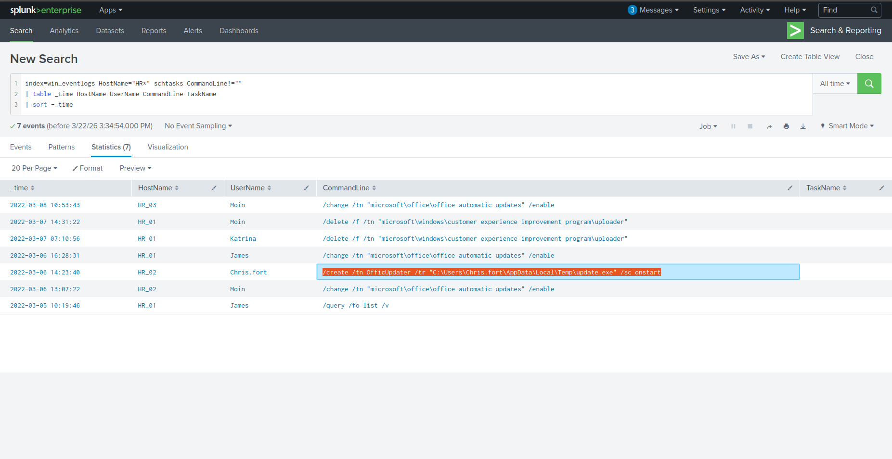

* ⚠️ Confirmed compromised user:

  ```
  haroon
  ```

---

### 🚨 Attack Details

* 🛠️ LOLBin used:

  ```
  certutil.exe
  ```

* 📅 Execution date:

  ```
  2022-03-04
  ```

* 🌐 Payload source:

  ```
  controlc.com
  ```

* 🔗 Full URL:

  ```
  https://controlc.com/e4d11035
  ```
  

---

### 📦 Post-Exploitation

* 📁 File dropped on host:

  ```
  benign.exe
  ```

* 🧬 Malicious pattern identified:

  ```
  THM{KJ&*H^B0}
  ```

---

### 🧠 Skills Demonstrated

* Splunk log analysis (Event ID 4688)
* Detection of LOLBins abuse
* Threat hunting & anomaly detection
* Identifying compromised accounts
* Tracing attacker activity & payload delivery

---

### 🏁 Conclusion

The investigation revealed a compromised HR host where the attacker leveraged **certutil.exe** (a legitimate Windows binary) to download a malicious payload from an external file-sharing service. The activity highlights common attacker techniques to bypass security controls using trusted system tools.

This scenario reflects real-world SOC investigations involving limited visibility and emphasizes the importance of process-level monitoring and behavioral analysis.


---

#### Splunk SOC Lab Setup (SIEM Lab – Deployment & Log Ingestion)

---

### 📌 Scenario

To simulate a real-world SOC environment, a lab was built using **Splunk Enterprise** and **Universal Forwarder** on a Linux-based system.

The objective was to create a centralized logging solution capable of collecting, indexing, and analyzing logs from multiple sources.

---

### 🎯 Lab Objectives

* Build a mini SOC environment using Splunk
* Configure log collection from Linux systems
* Understand SIEM architecture and data flow
* Practice Splunk administration via CLI

---

### 🏗️ Lab Setup

<p align="center">
  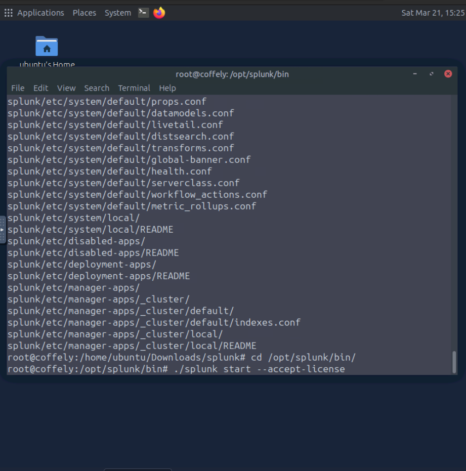
  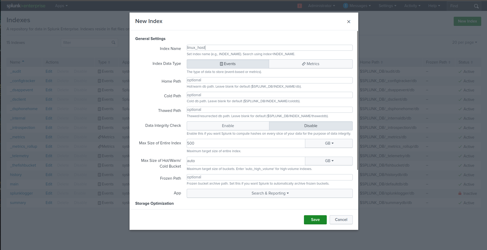
  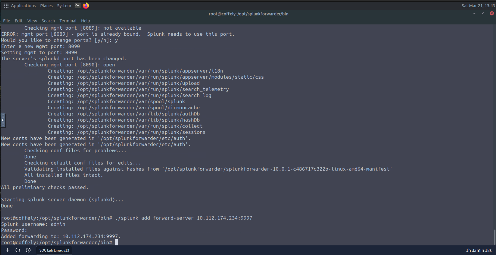
  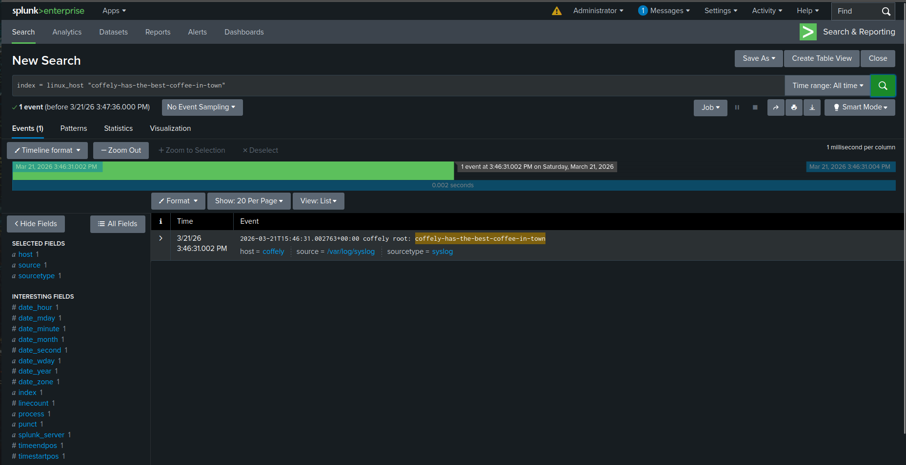
</p>

---

### ⚙️ Implementation Details

* 🧠 **Architecture Design:**

  ```
  Splunk Enterprise (Indexer) ← Universal Forwarder (Client)
  ```

* 🐧 **Environment:**

  ```
  Ubuntu Linux
  ```

* 📥 **Log Sources:**

  ```
  /var/log/auth.log
  /var/log/syslog
  Web server logs
  ```

---

### 🔍 Key Activities

* Installed and configured **Splunk Enterprise**
* Deployed **Universal Forwarder** on endpoint
* Configured log forwarding using inputs.conf
* Verified log ingestion and indexing in Splunk
* Managed Splunk services using CLI

---

### 🧠 Skills Demonstrated

* SIEM architecture design
* Log ingestion & forwarding
* Linux system administration
* Splunk CLI management
* Data onboarding & indexing

---

### 🏁 Conclusion

This lab demonstrates the ability to build and configure a functional SIEM environment from scratch. It highlights practical skills in log ingestion, system configuration, and understanding how security data flows within a SOC environment.


---

#### Logstash Data Pipeline (Elastic Lab – Log Processing & Parsing)

---

### 📌 Scenario

To enhance log visibility and normalization, **Logstash** was configured as a data processing pipeline within the Elastic Stack.

The goal was to collect, parse, and forward Linux authentication logs into Elasticsearch for analysis.

---

### 🎯 Lab Objectives

* Understand Logstash pipeline architecture
* Process and normalize unstructured logs
* Forward processed logs to Elasticsearch
* Improve data quality for security analysis

---

### 🏗️ Lab Setup

<p align="center">
  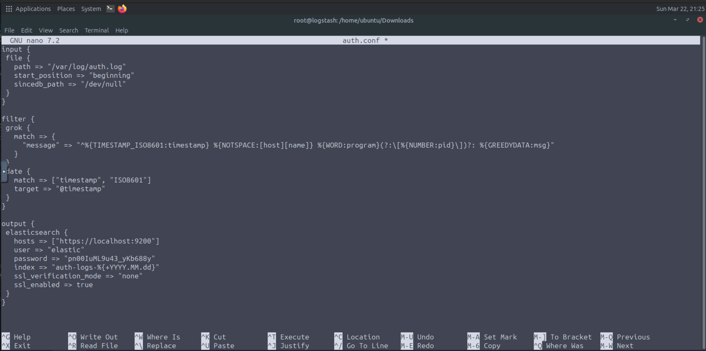
  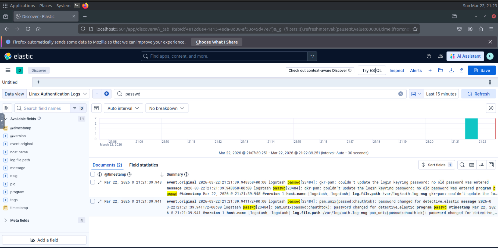
</p>

---

### ⚙️ Implementation Details

* 🔄 **Pipeline Structure:**

  ```
  Input → Filter → Output
  ```

* 📥 **Input Source:**

  ```
  Linux Authentication Logs
  ```

* 🧩 **Processing Method:**

  ```
  Grok Parsing
  ```

---

### 🔍 Key Activities

* Configured Logstash pipeline configuration file
* Parsed raw logs using **Grok patterns**
* Extracted structured fields (user, IP, action)
* Forwarded processed logs to Elasticsearch
* Verified indexed data in Kibana

---

### 🧠 Skills Demonstrated

* Log parsing & normalization
* Working with unstructured data
* Elastic Stack integration
* Pipeline configuration & debugging
* Data transformation for security analytics

---

### 🏁 Conclusion

This lab demonstrates practical experience in building a log processing pipeline using Logstash. It highlights the importance of structured data in improving detection capabilities and enabling efficient threat analysis.


---


#### KQL & Lucene Querying (Elastic Lab – Threat Hunting & Log Analysis)

---

### 📌 Scenario

Effective threat hunting requires the ability to query and filter large volumes of log data. This lab focuses on using **KQL (Kibana Query Language)** and **Lucene** to perform advanced searches within Elasticsearch.

---

### 🎯 Lab Objectives

* Perform efficient log searches using KQL
* Apply advanced filtering techniques
* Analyze structured and nested data
* Detect suspicious patterns in logs

---

### 🏗️ Lab Setup

<p align="center">
  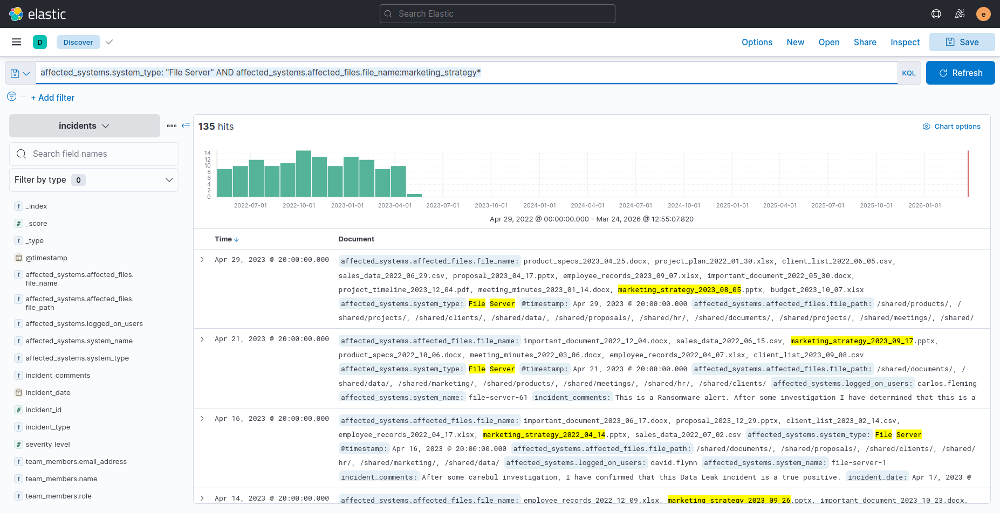
  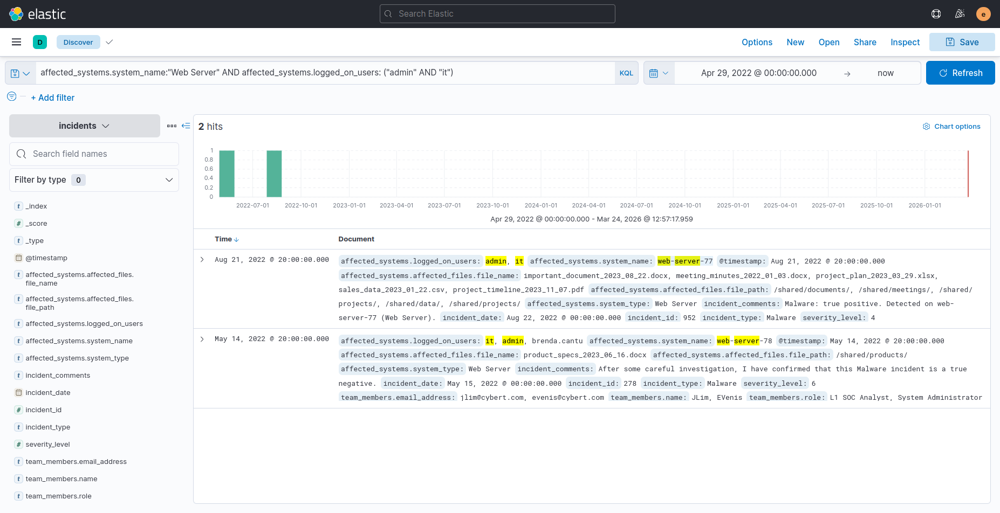
  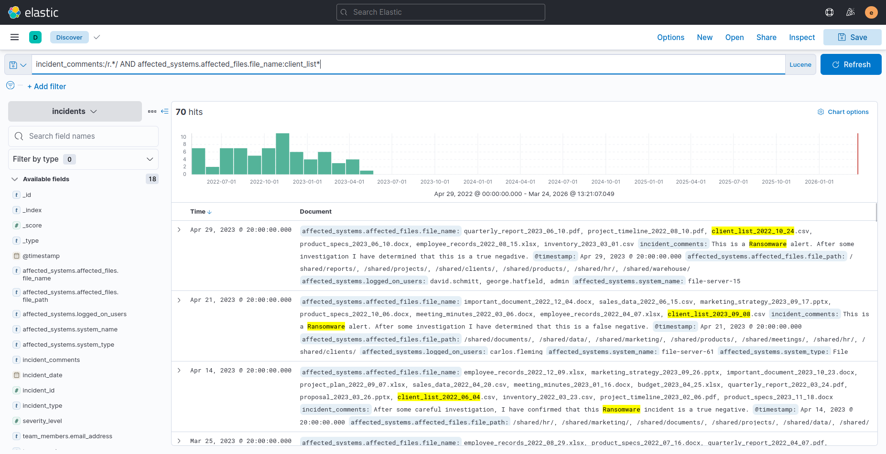
  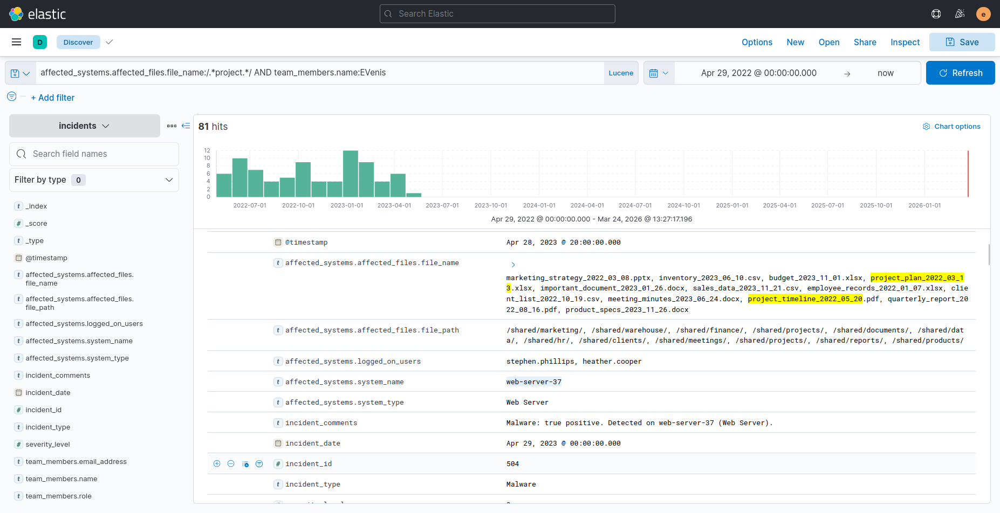
  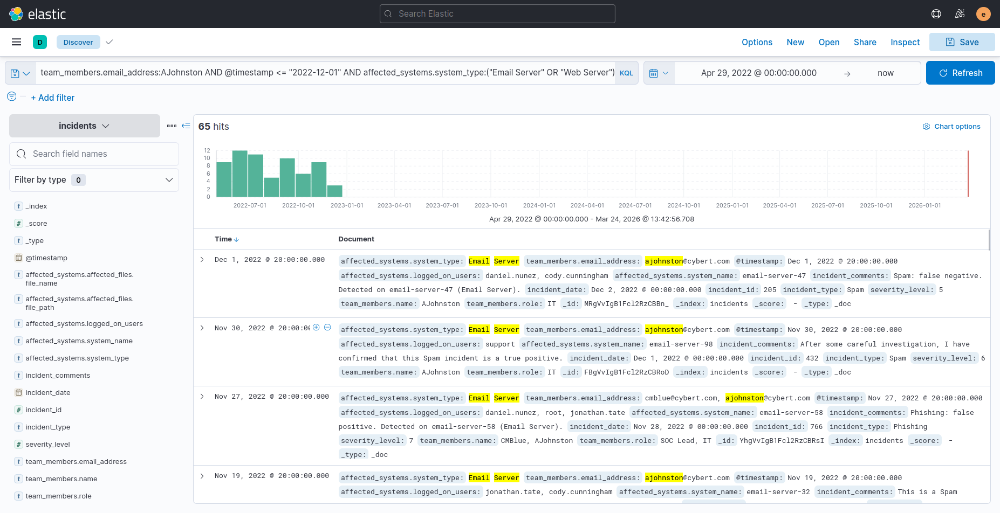
  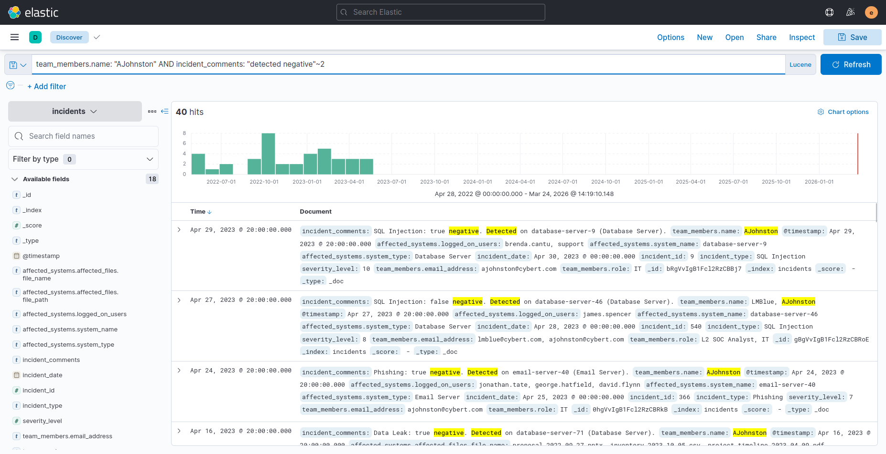
</p>

---

### ⚙️ Query Techniques

* 🔎 **Basic Filtering:**

  ```
  status:200 AND method:GET
  ```

* ⚡ **Advanced Logic:**

  ```
  Description: /(s|m).*/ AND /user.*/
  field_name: "search term"~slop_value
  ```

* 🧠 **Wildcard Search:**

  ```
  url:*login*
  ```

---

### 🔍 Key Activities

* Performed log searches using **KQL**
* Applied logical operators (AND / OR / NOT)
* Investigated nested and structured data
* Used wildcard and fuzzy matching
* Identified suspicious access patterns

---

### 🧠 Skills Demonstrated

* Threat hunting using KQL
* Log filtering and correlation
* Pattern-based detection
* Working with Elasticsearch data
* Noise reduction in large datasets

---

### 🏁 Conclusion

This lab highlights the importance of query languages in security operations. Mastering KQL and Lucene enables analysts to efficiently detect threats, filter noise, and extract meaningful insights from large-scale log data.
